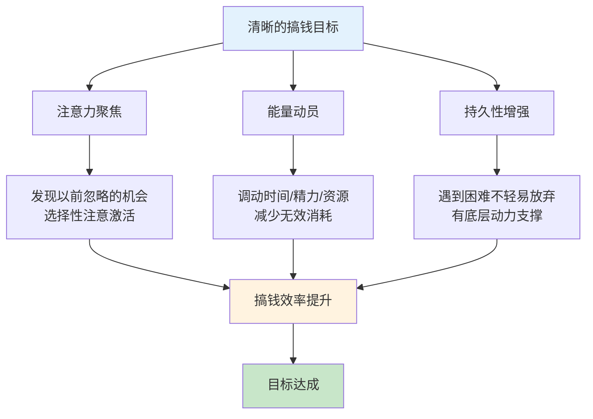
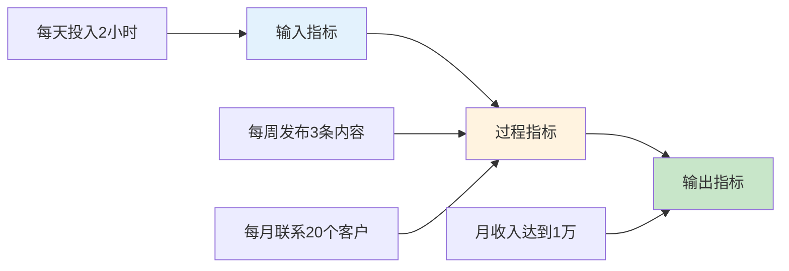
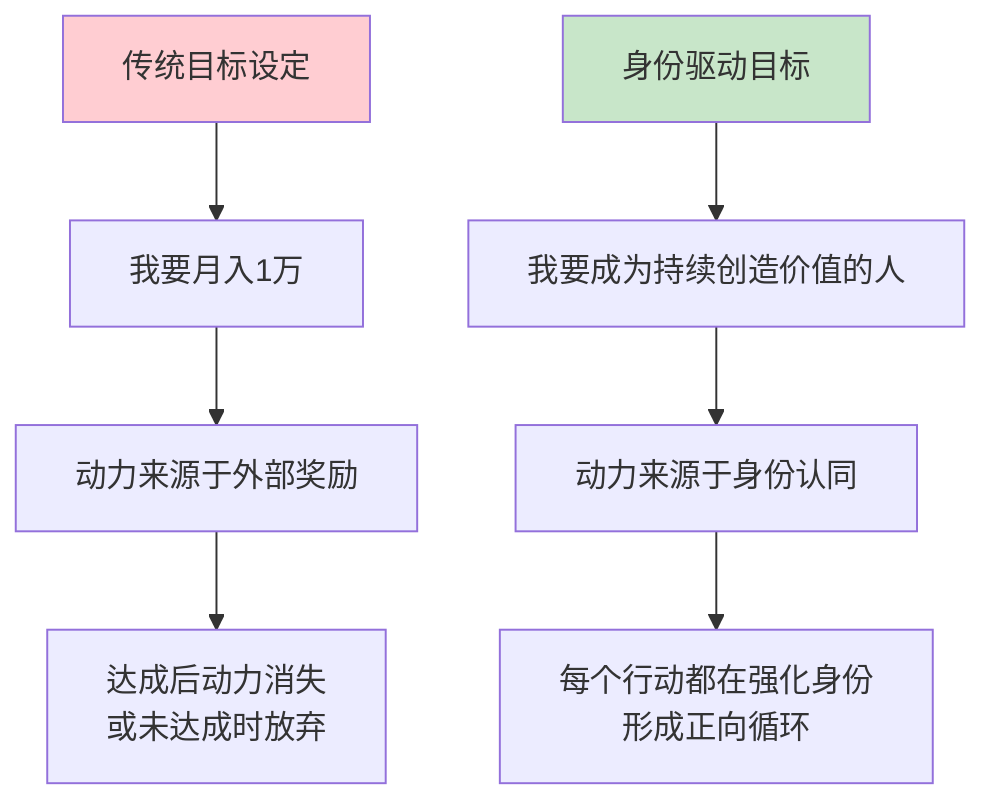

## 4.1 目标设定技巧

目标设定不是写下一句"我要赚100万"那么简单。心理学家Edwin Locke和Gary Latham经过35年研究发现：**明确且有挑战性的目标，比"尽力而为"的目标平均提升绩效25%以上**。但前提是目标设定方法正确——错误的目标设定不仅无效，反而会产生焦虑、自我怀疑，甚至导致放弃。

搞钱路上，目标就是你的导航系统。没有目标的人在原地打转，目标模糊的人走弯路，只有目标精准的人才能高效到达目的地。

### 4.1.1 为什么目标设定对搞钱至关重要

**目标的三大心理机制**：

**机制一：注意力聚焦**。人脑每天处理约35000个决策，其中绝大多数是无意识的。当你设定了"今年副业月入1万"的目标，大脑会自动开启"选择性注意"——你会开始注意到以前忽略的赚钱机会、技能需求和资源线索。这不是玄学，而是网状激活系统（RAS）的工作原理。

**机制二：能量动员**。模糊的目标无法调动你的全部能量。"我想变有钱"这种目标，大脑不知道该调动多少资源。但"3个月内把公众号做到5000粉丝"——这个目标会自动激发你的时间管理能力、学习动力和执行力。

**机制三：持久性增强**。研究显示，有明确目标的人在遇到困难时坚持的时间是无目标者的3.2倍。因为目标提供了"为什么要做"的底层动力，让你在痛苦的执行期不轻易放弃。



> **关键洞察**：目标不是用来"实现"的，而是用来"指引方向"的。即使最终没有100%达成，一个好的目标也会让你走到比没有目标远得多的地方。Locke的研究表明，达成目标的80%也远好于没有目标时的100%。

### 4.1.2 SMART目标设定法详解

SMART是最经典的目标设定框架，但大多数人只停留在表面理解。以下逐项深度拆解，每一项都给出搞钱场景的具体应用。

**S - Specific（具体的）**

"我要赚钱"不是目标，"我要通过开设线上Python课程实现月入1万"才是。具体的目标需要回答五个W：

| 维度 | 问题 | 模糊示例 | 具体示例 |
|------|------|----------|----------|
| What | 做什么？ | 赚更多钱 | 通过线上课程变现 |
| Why | 为什么？ | 想变有钱 | 积累被动收入，3年内财务自由 |
| Who | 谁来做？ | 我 | 我（主）+ 合伙人（推广） |
| Where | 在哪做？ | 网上 | 在知识星球+公众号+B站 |
| Which | 用什么方式？ | 副业 | 录制Python自动化课程，定价199元 |

**实操模板**：用以下句式写出你的具体目标——

```text
我要通过 [具体方式] 在 [具体平台] 为 [具体用户群] 提供 [具体价值]
从而实现 [具体收入数字] 的 [收入类型：主动/被动] 收入。
```

**M - Measurable（可衡量的）**

不可衡量的目标无法管理。搞钱目标的可衡量指标分为三类：

- **结果指标**：月收入、年收入、资产总额、净资产增长率
- **过程指标**：每日有效工作时间、每周产出内容数量、每月新增客户数
- **效率指标**：单位时间收入、获客成本、转化率

**关键原则**：不要只盯结果指标，过程指标才是你能直接控制的。你无法直接控制"月入1万"，但可以控制"每天写1000字""每天发布1条短视频""每周联系5个潜在客户"。



**实操模板**：为你的目标建立指标仪表盘——

| 指标类型 | 指标名称 | 当前值 | 目标值 | 数据来源 |
|----------|----------|--------|--------|----------|
| 结果 | 月收入 | 0元 | 10000元 | 银行流水 |
| 过程 | 每日内容产出 | 0篇 | 1篇 | 发布记录 |
| 过程 | 每周客户联系 | 0人 | 5人 | CRM系统 |
| 效率 | 内容转化率 | 0% | 3% | 数据分析 |

**A - Achievable（可实现的）**

"可实现"不等于"容易"。研究表明，最佳挑战度的目标是成功概率在30%-50%之间的目标——这个区间既能激发动力，又不会让人绝望。

**判断目标是否可实现的三步法**：

1. **资源审计**：你目前有多少时间、资金、技能、人脉？列出清单。
2. **差距分析**：达成目标需要的资源与现有资源之间的差距有多大？
3. **路径验证**：是否有人用类似资源达成了类似目标？如果有，说明可行。

**常见错误**：
- 目标太低：月入5000的人设目标"月入6000"——太容易，没有动力
- 目标太高：月入5000的人设目标"月入50万"——太难，容易放弃
- 合理区间：月入5000的人设目标"月入1万"——有挑战但可实现

> **注意**：目标的"可实现"是动态的。第一年月入1万可能是挑战目标，第三年可能变成保底目标。每半年重新评估一次目标的难度是否合适。

**R - Relevant（相关的）**

相关性要求目标与你的长期愿景、核心价值观和当前阶段一致。很多人设定了与自己真实需求无关的目标——看到别人做自媒体赚钱就跟风做自媒体，结果既不喜欢也不擅长，最终放弃。

**相关性检验清单**：

- [ ] 这个目标是否服务于你的3-5年财务愿景？
- [ ] 这个目标是否利用了你的核心优势？
- [ ] 这个目标是否与你的生活方式兼容？
- [ ] 如果没有任何外部压力，你还会选择这个目标吗？
- [ ] 达成这个目标后，你会感到满足还是空虚？

如果以上问题有3个以上答案为"否"，说明这个目标的相关性存在问题，需要重新审视。

**T - Time-bound（有时限的）**

没有截止日期的目标只是愿望。时间约束创造紧迫感，逼迫你做出优先级判断。

**时间框架设计**：

| 时间层次 | 周期 | 示例 | 关键动作 |
|----------|------|------|----------|
| 愿景层 | 5-10年 | 资产500万，被动收入覆盖开支 | 每年审视一次 |
| 战略层 | 1-3年 | 副业月入3万，投资组合50万 | 每季度调整 |
| 战术层 | 季度 | 课程上线，获得前100个付费用户 | 每月检查 |
| 执行层 | 周/日 | 完成第3章录制，发布5条推广内容 | 每天回顾 |

**SMART目标完整示例**：

```text
模糊目标：我想通过副业赚钱

SMART目标：在2025年12月31日前，
  通过在B站和知识星球开设Python自动化课程，
  实现月收入稳定达到1万元（连续3个月），
  为此我需要在每周投入15小时用于课程制作和推广。
```

### 4.1.3 目标分解：从愿景到行动的完整路径

设定了SMART目标后，下一步是将其分解为可执行的小目标。分解的核心原则是：**每一层目标都是上一层目标的充分条件**——如果所有子目标都达成，父目标必然达成。

**分解方法一：逆向规划法**

从最终目标出发，逆向推导每一步需要做什么。


**实操步骤**：

1. 写下终极目标（5年）
2. 问自己："要达成这个目标，1年后必须达到什么状态？"写下1年目标
3. 问自己："要达成1年目标，这个季度必须完成什么？"写下季度目标
4. 继续分解到月、周、日
5. 检查：日目标加总是否能支撑周目标？周目标加总是否能支撑月目标？

**分解方法二：目标阶梯法**

把目标拆成"台阶"，每一级台阶都是一个里程碑。这种方法特别适合收入类目标——因为收入增长通常不是线性的，而是阶梯式的。

| 阶段 | 收入里程碑 | 核心任务 | 预计耗时 |
|------|-----------|----------|----------|
| 第1阶 | 月入1000元 | 验证方向、获得第一批客户 | 1-3个月 |
| 第2阶 | 月入3000元 | 优化产品、建立口碑 | 2-4个月 |
| 第3阶 | 月入1万元 | 规模化获客、提升转化 | 3-6个月 |
| 第4阶 | 月入3万元 | 团队化、多渠道 | 6-12个月 |
| 第5阶 | 月入10万元 | 系统化运营、被动收入占比>50% | 12-24个月 |

> **关键提醒**：每一阶的难度不是线性增长，而是指数增长。从0到1000可能需要3个月，从1000到3000可能也需要3个月，但从3000到1万可能需要6个月。提前预期这个规律，就不会在"卡住"时焦虑。

**分解方法三：OKR目标管理法**

OKR（Objectives and Key Results）是Google、字节跳动等公司使用的目标管理方法，同样适用于个人搞钱目标。

**O（目标）**：定性的、鼓舞人心的方向描述
**KR（关键结果）**：定量的、可衡量的里程碑

**示例**：

```text
O：建立可持续的副业收入体系
  KR1：3月底前完成Python自动化课程全部录制（共20章）
  KR2：4月底前在知识星球获得50个付费用户
  KR3：6月底前月收入稳定达到1万元

O：建立个人品牌影响力
  KR1：B站粉丝达到5000
  KR2：公众号文章平均阅读量达到500
  KR3：每月至少2次行业交流或分享
```

**OKR vs SMART的区别**：

| 维度 | SMART | OKR |
|------|-------|-----|
| 适用场景 | 单一目标 | 多目标并行 |
| 难度设定 | 可实现（60-80%成功率） | 有挑战（40-60%成功率） |
| 周期 | 通常固定 | 季度为主 |
| 侧重点 | 目标本身 | 目标+关键结果 |
| 灵活性 | 较低 | 较高，鼓励调整 |

### 4.1.4 目标追踪系统

设定了目标不追踪，等于没有目标。追踪系统的核心是：**让你随时知道"我现在在哪里，离目标还有多远"**。

**追踪工具矩阵**：

| 工具 | 适合场景 | 优势 | 劣势 |
|------|----------|------|------|
| 滴答清单 | 任务级追踪 | 任务管理强，提醒功能好 | 数据分析弱 |
| Notion | 综合追踪 | 灵活定制，数据库强大 | 上手门槛高 |
| Excel/飞书表格 | 数据追踪 | 数据分析强，图表丰富 | 任务管理弱 |
| 手账本 | 习惯追踪 | 仪式感强，离线可用 | 统计分析弱 |
| Trello | 看板追踪 | 可视化好，协作方便 | 复杂目标不适合 |

**追踪频率与内容**：

| 频率 | 追踪内容 | 耗时 | 核心问题 |
|------|----------|------|----------|
| 每日（5分钟） | 当日任务完成情况 | 睡前 | 今天为目标做了什么？ |
| 每周（30分钟） | 周目标达成率、数据变化 | 周日晚 | 本周进展如何？下周重点？ |
| 每月（1小时） | 月度指标、收入数据 | 月初 | 距离目标差多少？需要调整吗？ |
| 每季（2小时） | OKR复盘、策略调整 | 季度末 | 方向对吗？目标需要修改吗？ |

**复盘模板（周度）**：

```markdown
## 第X周复盘（日期）

### 本周目标完成情况
| 目标 | 计划 | 实际 | 完成率 | 原因分析 |
|------|------|------|--------|----------|
| 录制2章课程 | 2章 | 1章 | 50% | 周三加班占用时间 |
| 发布3条推广 | 3条 | 3条 | 100% | - |
| 联系5个客户 | 5人 | 7人 | 140% | 主动介绍了2个 |

### 关键数据
- 本周收入：XXX元
- 本月累计：XXX元
- 距月目标差：XXX元

### 本周收获
- [具体收获]

### 下周计划
- [具体任务]

### 需要调整的地方
- [具体调整]
```

### 4.1.5 真实案例：目标设定如何改变搞钱轨迹

**案例一：小王的副业目标拆解**

小王是一名月薪8000的前端工程师，目标是"1年内副业月入1万"。

**错误的目标设定**："我要做副业赚钱"——没有具体方向、没有衡量标准、没有时间节点。

**正确的SMART目标**："在2025年12月31日前，通过在掘金和B站发布前端技术教程，建立付费社群（定价299元/年），实现月收入稳定1万元。"

**分解执行**：

| 阶段 | 时间 | 目标 | 具体行动 |
|------|------|------|----------|
| 第1阶段 | 1-3月 | 建立内容基础 | 每周发布2篇掘金文章+1个B站视频 |
| 第2阶段 | 4-6月 | 积累粉丝 | 粉丝达到3000，开始引流到微信 |
| 第3阶段 | 7-9月 | 付费转化 | 开设付费社群，目标100人 |
| 第4阶段 | 10-12月 | 规模扩大 | 社群达到350人，月收入破万 |

**结果**：小王在第11个月达成月入1万目标。关键转折点是第5个月一篇文章被推荐到掘金首页，单日涨粉500人。

**案例二：李姐的储蓄目标**

李姐月薪1.2万，月光族，目标"1年内存款10万"。

**分解**：
- 年目标：存款10万
- 月目标：存款8333元
- 日目标：控制日均消费在122元以内

**追踪方法**：每天记账，每周复盘消费结构，每月检查存款进度。

**关键调整**：第3个月发现房租+通勤占了收入的45%，调整策略——搬到离公司更近的地方（房租增加500元但通勤费减少800元），净省300元/月。

**结果**：12个月存款11.2万，超额完成。

### 4.1.6 目标设定的常见误区

**误区一：只有结果目标，没有过程目标**

错误：目标是"月入1万"
正确：目标是"月入1万"，同时设定"每周发布3条内容""每月联系10个客户"等过程目标

原因：结果目标受外部因素影响大（市场、运气），过程目标是你100%能控制的。当你无法控制结果时，控制过程至少能保证你在正确的方向上持续努力。

**误区二：目标太多，精力分散**

错误：同时追求"副业月入1万""投资年化20%""考下CPA""健身减脂10斤"
正确：每个时期聚焦1-2个核心目标，其他目标设为"维护型"（保持现状即可）

原因：人的注意力和意志力是有限资源。研究表明，同时追求3个以上高难度目标，每个目标的完成率会下降60%以上。

**误区三：设定了目标就不再调整**

错误：年初定的目标，全年不修改
正确：每季度评估目标是否仍然合理，根据实际情况调整

原因：环境在变、你在变、市场在变。死守一个过时的目标比没有目标更危险——它会让你在错误的方向上浪费时间和精力。

**误区四：目标过于依赖外部条件**

错误："等我升职了就开始做副业""等市场好了就开始投资"
正确："无论当前条件如何，我今天能做的最小行动是什么？"

原因：等待"完美条件"是一种拖延策略。完美条件永远不会到来，而行动的人已经在不完美的条件下取得了进展。

**误区五：只设财务目标，忽略能力建设**

错误：目标只有"月入X万""存款X万"
正确：同时设定"掌握XX技能""建立XX人脉""提升XX认知"等能力目标

原因：财务目标是"果"，能力建设是"因"。只盯结果不提升能力，即使偶然达成也无法持续。

### 4.1.7 高级技巧：身份驱动的目标设定

传统的目标设定关注"我要做什么"和"我要得到什么"，但最强大的目标设定方法来自James Clear在《Atomic Habits》中提出的"身份驱动"理念——**关注"我要成为什么样的人"**。

| 层次 | 问题 | 示例 |
|------|------|------|
| 结果层 | 我想要什么？ | 月入1万的副业收入 |
| 过程层 | 我要做什么？ | 每天写作2小时，每周发布3篇 |
| 身份层 | 我要成为谁？ | 我是一个持续输出价值的内容创作者 |

**为什么身份层更强大**？

当你认同"我是内容创作者"这个身份时，每天写作不再是"为了赚钱而做的事"，而是"我这个人自然会做的事"。每一次写作都是对这个身份的投票——"看，我又写了，我确实是内容创作者"。这种内在驱动力远比外在的金钱目标持久。

**实操方法**：

1. 写下你的财务目标（结果层）
2. 问自己："什么样的人能达成这个目标？"写下这个人的特征
3. 把这些特征转化为身份声明："我是一个______的人"
4. 每天的行动就是对这个身份的投票

```text
目标：1年内副业月入1万
→ 能达成这个目标的人是什么样的？
→ 他们持续输出高质量内容、主动学习行业知识、坚持与用户互动
→ 身份声明：我是一个每天都在创造有价值内容的人
→ 今天的行动：写1篇文章 = 对这个身份投了一票
```



### 4.1.8 目标设定工具箱

**工具一：目标金字塔工作表**

```text
愿景（5-10年）：________________________________
  ↓ 分解
战略目标（1-3年）：________________________________
  ↓ 分解
年度目标：________________________________
  ↓ 分解
季度OKR：
  O1：________________________________
    KR1：________________________________
    KR2：________________________________
    KR3：________________________________
  ↓ 分解
月度计划：________________________________
  ↓ 分解
周计划：________________________________
  ↓ 分解
今日行动：________________________________
```

**工具二：目标健康度检查清单**

每月用此清单检查你的目标状态：

- [ ] 目标是否仍然与我的长期愿景一致？（相关性）
- [ ] 目标的难度是否合适？太容易还是太难？（挑战度）
- [ ] 我是否有清晰的下一步行动？（可执行性）
- [ ] 我是否在追踪关键指标？（可衡量性）
- [ ] 我是否在按计划推进？（进度）
- [ ] 外部环境是否有重大变化需要调整目标？（适应性）

**工具三：目标可视化看板**

在你每天能看到的地方（电脑桌面、手机壁纸、床头）放置目标可视化看板：

```text
┌─────────────────────────────────────────┐
│           我的年度搞钱目标               │
├─────────────────────────────────────────┤
│ 🎯 年度目标：副业年收入12万             │
│ 📊 当前进度：已完成 42%（5.04万）       │
│ ⏰ 剩余时间：7个月                      │
│ 📈 需要月均：9943元/月                  │
├─────────────────────────────────────────┤
│ 本月重点：                              │
│ 1. 完成课程第3-4章录制                  │
│ 2. 新增30个付费用户                     │
│ 3. 发布12条推广内容                     │
├─────────────────────────────────────────┤
│ 💪 今日行动：录制1节课 + 写1篇推广文    │
└─────────────────────────────────────────┘
```

***
