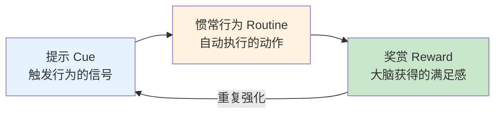
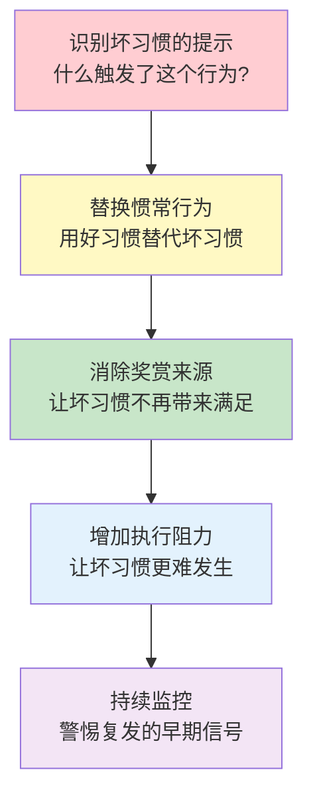
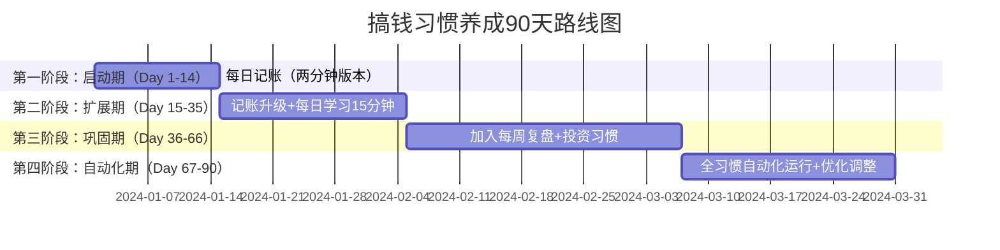

## 4.2 习惯养成技巧

习惯是行为的自动驾驶模式。神经科学研究表明，人类日常行为中约43%是习惯驱动的自动反应，而非有意识的决策。在搞钱这件事上，真正拉开差距的不是某次灵光乍现的投资决策，而是日复一日的财务好习惯——持续记账、定期复盘、克制冲动消费、坚持学习理财知识。

本节从行为科学的底层原理出发，系统讲解六种经过验证的习惯养成策略，帮助你把"想搞钱"的意愿转化为自动化的行为模式。

### 4.2.0 习惯的底层机制：习惯回路

在学习具体技巧之前，必须理解习惯是如何在大脑中形成和运作的。MIT研究人员发现，所有习惯都遵循一个三阶段神经回路：



**提示（Cue）**：触发大脑进入自动模式的信号。可以是时间（每天早上8点）、地点（坐到办公桌前）、情绪（感到焦虑时）、前一行为（吃完午饭后）、或特定的人（见到某个朋友）。

**惯常行为（Routine）**：被触发后自动执行的动作序列。大脑一旦识别到提示，就会调用已存储的神经通路来执行，几乎不消耗意志力。

**奖赏（Reward）**：行为完成后大脑获得的满足感。奖赏让大脑判断"这个回路值得保留"，多巴胺的释放会强化这条神经通路。关键在于：奖赏必须是即时的、可感知的。

**习惯的形成过程**：当提示→行为→奖赏这个循环反复发生，基底神经节会将整个行为序列"打包"存储，形成自动化程序。这就是为什么养成习惯初期很费力（需要前额叶皮层有意识参与），但一旦习惯固化，执行起来毫不费力。

| 阶段 | 大脑区域 | 特征 | 意志力消耗 |
|------|----------|------|-----------|
| 尝试期（1-7天） | 前额叶皮层主导 | 需要有意识决策，容易遗忘 | 高 |
| 形成期（8-21天） | 前额叶+基底神经节交替 | 开始自动化，偶尔需要提醒 | 中 |
| 巩固期（22-66天） | 基底神经节主导 | 大部分时间自动执行 | 低 |
| 自动化（66天+） | 基底神经节完全接管 | 不做反而不舒服 | 极低 |

> **关键数据**：伦敦大学学院Phillippa Lally的研究显示，习惯自动化平均需要66天，而非广为流传的21天。简单习惯（如喝一杯水）可能21天就固化，复杂习惯（如晨跑）可能需要254天。不要因为21天后还没"习惯"就放弃——坚持本身就是过程。

### 4.2.1 习惯叠加法（Habit Stacking）

**原理**：利用大脑已有的神经通路作为"挂载点"，将新行为附加在已有习惯之后。这比从零建立新习惯高效得多，因为已有习惯的提示信号可以直接复用，你只需要把新行为"粘贴"到旧习惯的末尾。

**公式**：在[已有习惯]之后，我会[新习惯]。

James Clear在《Atomic Habits》中提出这个方法的科学依据：大脑倾向于将连续发生的行为建立关联（经典条件反射）。当行为A和行为B反复一起出现，执行A会自动触发执行B的冲动。

**搞钱场景的习惯叠加方案**：

| 已有习惯（锚点） | 叠加的新习惯 | 完整行为链 | 固化难度 |
|-----------------|-------------|-----------|---------|
| 早上打开电脑 | 查看昨日收支 | 打开电脑→记账App→核对昨日消费 | ★★☆☆☆ |
| 午饭后休息 | 阅读15分钟理财文章 | 午饭→打开收藏夹→阅读→记录要点 | ★★★☆☆ |
| 下班通勤 | 听理财播客 | 上地铁→戴耳机→打开播客App | ★★☆☆☆ |
| 睡前刷手机 | 记录当日财务日志 | 躺床上→打开记账App→记录→放下手机 | ★★★☆☆ |
| 每周五下午 | 复盘本周投资 | 周五→打开Excel→对比计划与实际→记录偏差 | ★★★★☆ |
| 每月1号发工资 | 自动转入储蓄账户 | 工资到账→触发自动转账→剩余才是可支配 | ★★☆☆☆ |

**实操步骤**：

1. **盘点现有习惯**：花3天时间记录你每天的固定行为（起床、刷牙、通勤、午饭、下班、睡前等），列出至少10个稳定锚点
2. **选择匹配的锚点**：新习惯的时间需求和场景要与锚点匹配。比如"通勤30分钟"适合听播客，"午休15分钟"适合阅读
3. **制定明确公式**：用"在X之后，我会Y"的句式写下来，越具体越好。"下班后学习"太模糊，"到家换完衣服后打开理财课程App学习15分钟"才有效
4. **先试运行一周**：不要急着加量，先验证这个叠加组合是否能在你的实际日程中稳定执行
5. **逐步增加强度**：确认可行后，每隔1-2周微调增加（如从15分钟到20分钟），避免一步到位导致抗拒

**常见失败原因**：锚点习惯本身不够稳定（比如你本身就不是每天喝咖啡）、新习惯与锚点场景冲突（比如通勤开车时无法阅读）、没有即时奖赏（听了播客但感觉不到进步）。

### 4.2.2 两分钟规则（Two-Minute Rule）

**原理**：把任何新习惯的启动版本压缩到两分钟内完成。这不是偷工减料，而是利用行为启动的心理学原理——万事开头难，而两分钟的门槛低到几乎无法拒绝。

**核心逻辑**：习惯的关键不是强度，而是频率。每天做1个俯卧撑的人，比一周做一次高强度训练的人更容易养成运动习惯。先成为"做这件事的人"（身份认同），再提升执行强度。

**搞钱场景的两分钟版本**：

| 目标习惯 | 两分钟版本 | 进阶路径 |
|---------|-----------|---------|
| 每日记账 | 记录今天最大的一笔消费 | →记录3笔→记录全部→分类统计 |
| 学习理财 | 打开理财App看一眼收益 | →阅读1篇文章→看10分钟课程→做笔记 |
| 分析股票 | 打开行情软件看一眼持仓 | →看5分钟K线→记录一个观察→写分析 |
| 副业开发 | 打开项目文件夹看一眼代码 | →修改1行→写一个函数→完成一个功能 |
| 储蓄习惯 | 查看银行余额 | →设置一个储蓄目标→计算进度→优化方案 |
| 减少消费 | 等待10分钟再下单 | →等1小时→等1天→等1周 |

**为什么两分钟规则有效**：

1. **消除启动阻力**：心理学中的"行动激活"理论指出，最难的不是执行行为本身，而是从"不做"切换到"做"的状态。两分钟的承诺让这个切换几乎无痛
2. **建立身份认同**：当你每天打开理财App，你开始认同自己是"关注财务的人"。身份认同一旦建立，行为就会自然延伸
3. **利用蔡格尼克效应**：大脑对未完成的任务有强烈的完成欲望。一旦你开始了两分钟版本，往往会自然地继续做下去
4. **降低失败成本**：即使最忙、最累、最不想做的日子，两分钟总能做到。连续执行的记录不会中断，习惯回路得以保持

**进阶：从两分钟到自动化**

两分钟版本不是终点，而是入口。具体的升级节奏：

- **第1-2周**：只做两分钟版本，唯一目标是"每天都做"
- **第3-4周**：自然延长到5-10分钟，不强求，能做多少做多少
- **第5-8周**：设定一个舒适区上限（如15分钟），稳定执行
- **第9周起**：逐步增加到目标强度，此时习惯已经固化，增加强度不会破坏连续性

> **实战案例**：一位自由职业者的记账习惯养成过程。最初目标是"每天记录所有收支"，坚持3天就放弃了。改用两分钟规则——"每天睡前打开记账App，只记今天花得最多的一笔"——连续坚持了18天。第19天开始自然地想记录更多，到第30天已经自动记录全部收支并分类统计。从"痛苦的任务"变成了"睡前的例行公事"。

### 4.2.3 环境设计（Environment Design）

**原理**：人的行为深受环境线索的影响。与其依赖意志力对抗环境诱惑，不如主动改造环境，让好习惯成为阻力最小的路径，让坏习惯的执行成本最大化。

**核心公式**：
- 好习惯 = 减少摩擦（让开始更容易）
- 坏习惯 = 增加摩擦（让执行更困难）

神经科学解释：大脑倾向于选择能量消耗最小的选项。当好习惯触手可及、坏习惯需要费力才能做到时，大脑会自动"选择"好习惯，因为它是默认选项。

**搞钱场景的环境设计方案**：

**减少摩擦（促进好习惯）**：

| 想养成的习惯 | 环境设计方案 | 原理 |
|-------------|-------------|------|
| 坚持记账 | 记账App放手机首屏Dock栏，桌面放记账本 | 降低启动视觉线索的搜索成本 |
| 坚持学习理财 | 书桌上只放理财书和笔记本，浏览器首页设为理财网站 | 增加提示信号的频率 |
| 坚持储蓄 | 设置工资日自动转账，开立无卡储蓄账户 | 让储蓄变成默认行为，需要主动选择才不存 |
| 坚持副业 | 专用副业电脑/桌面，固定工作时间，准备好的开发环境 | 消除每次启动的准备成本 |
| 关注投资 | 设置每日推送提醒，关注的标的加入自选列表 | 让信息主动找你，而非你去找信息 |

**增加摩擦（抑制坏习惯）**：

| 想戒除的习惯 | 环境设计方案 | 原理 |
|-------------|-------------|------|
| 冲动消费 | 删除购物App，取消免密支付，取消信用卡自动扣款 | 增加每一步的决策成本 |
| 频繁看盘 | 卸载行情App只留网页版，设定固定看盘时间 | 让即时查看变得不方便 |
| 跟风投资 | 取关煽动性财经博主，退出情绪化投资群 | 减少触发提示的来源 |
| 过度外卖 | 清理外卖App收藏和历史订单，删除收货地址 | 重置决策起点，需要重新输入 |
| 盲目追高 | 设置买入冷静期（必须等待24小时），关闭一键买入 | 引入强制暂停机制 |

**高阶技巧：利用空间分区**

把你的物理和数字空间划分为不同功能区域：

- **工作区**：只有生产力工具，娱乐App全部移到第二屏或文件夹深处
- **学习区**：固定一个位置专门用于学习理财，不在这里做其他事
- **休息区**：严格隔离工作/学习工具，建立"到这里就是放松"的条件反射

这种空间分区利用了"情境依赖记忆"——大脑会将特定地点与特定行为关联。当你在固定位置只做一件事，进入那个空间就会自动切换到对应的行为模式。

> **真实数据**：Google曾做过一个实验，在公司食堂把糖果从透明碗换成不透明碗，糖果消耗量减少了近30%。没有禁止任何人吃糖，只是增加了0.5秒的"看不到"摩擦。你的消费习惯也是如此——增加一步确认操作，可能就阻止了一次冲动消费。

### 4.2.4 诱惑绑定（Temptation Bundling）

**原理**：把"需要做但不想做"的事情和"想做但不应该做"的事情捆绑在一起。这是沃顿商学院Katherine Milkman教授提出的策略，利用多巴胺的转移机制——当一项低吸引力的活动与高吸引力的奖赏绑定，前者的执行意愿会显著提升。

**公式**：只有在做[需要做的事]时，才能享受[想做的事]。

**搞钱场景的绑定方案**：

| 需要做的事（低吸引力） | 想做的事（高吸引力） | 绑定方式 |
|---------------------|--------------------|---------|
| 复盘投资记录 | 喜欢的咖啡/奶茶 | 只在复盘时喝，其他时间不喝 |
| 阅读财报分析 | 舒适的沙发+音乐 | 创建专属"阅读角落"体验 |
| 记账和预算规划 | 追剧时间 | 完成记账后才打开视频App |
| 学习理财课程 | 健身房锻炼 | 在跑步机上听理财课程 |
| 整理发票报销 | 听喜欢的播客 | 只在整理发票时听特定播客 |
| 研究副业项目 | 周末外出就餐 | 周末研究2小时后奖励自己探店 |

**与传统奖励机制的区别**：传统奖励是"做完事后奖励自己"，存在延迟——行为和奖赏之间有时间差，大脑的强化效果会衰减。诱惑绑定是"在做事的同时享受奖赏"，奖赏与行为同时发生，强化效果最强。

**注意事项**：
- 绑定的"想做的事"不能是你正在戒除的坏习惯（比如"复盘时刷短视频"——短视频本身就是需要控制的）
- 绑定的两个活动不能互相干扰（比如"开车时听理财课"——注意力分散导致两个都做不好）
- 定期更换绑定组合，避免奖赏适应（大脑会对重复的奖赏脱敏）

### 4.2.5 习惯追踪与反馈系统

**原理**：你无法改善你无法衡量的习惯。追踪本身就是一个强有力的提示信号——它每天提醒你"这个习惯存在"，同时提供可视化的进展反馈，激活大脑的成就动机。

**追踪方法对比**：

| 方法 | 适合场景 | 优点 | 缺点 | 推荐工具 |
|------|---------|------|------|---------|
| 日历打卡法 | 单一习惯 | 视觉冲击强，连续打卡有动力 | 只记录"做了没"，无细节 | 实体日历、Google Calendar |
| 习惯追踪App | 多个习惯 | 数据统计全面，提醒功能 | 容易变成"为了打卡而打卡" | Habitica、Loop、Streaks |
| 表格记录法 | 需要量化数据的习惯 | 灵活自定义，数据可分析 | 需要手动填写，有门槛 | Notion、Excel、飞书 |
| 财务仪表盘 | 搞钱相关习惯 | 一目了然看到财务全貌 | 搭建需要一定技术能力 | 随手记、MoneyWiz、自制Dashboard |

**搞钱专用追踪体系**：

建议建立一个"搞钱习惯追踪表"，包含以下维度：

```text
每日追踪项：
  □ 记账（记录所有收支）
  □ 学习（阅读/课程/播客，至少15分钟）
  □ 复盘（查看投资组合，记录观察）

每周追踪项：
  □ 周报（本周收支汇总 vs 预算）
  □ 投资复盘（本周交易记录 + 反思）
  □ 副业进展（本周完成的任务 + 下周计划）

每月追踪项：
  □ 月度财务报告（收入/支出/储蓄率/投资回报）
  □ 习惯完成率统计（哪些坚持了，哪些断了）
  □ 下月预算制定
```

**追踪中的常见陷阱**：

1. **完美主义陷阱**：某天忘了打卡就觉得"全毁了"而放弃。正确做法：接受偶尔的遗漏，关键是断了之后立刻恢复，不要让"断链"变成"放弃"
2. **数字游戏陷阱**：为了保持打卡记录而敷衍完成。正确做法：追踪的是真实行为，不是打卡数字。偶尔的诚实"今天没做"比虚假打卡更有价值
3. **过度追踪陷阱**：追踪太多指标导致负担过重。正确做法：核心习惯追踪3-5个就够了，不要让追踪本身成为负担

### 4.2.6 破坏坏习惯的系统方法

养成好习惯和戒除坏习惯是同一枚硬币的两面。坏习惯遵循同样的习惯回路，只是我们想要阻断它。

**破坏坏习惯的四步法**：



**搞钱领域的典型坏习惯及破解方案**：

| 坏习惯 | 触发提示 | 替代行为 | 破解策略 |
|--------|---------|---------|---------|
| 冲动消费 | 刷到种草内容/收到促销推送 | 取关种草账号，退订营销邮件，将商品加入"冷静清单"等待48小时 | 增加执行阻力：删除支付App，取消免密支付 |
| 频繁看盘 | 焦虑/无聊/看到涨跌消息 | 设定固定看盘时间（如收盘后），其他时间用"看盘→记录观察"替代"看盘→操作" | 消除提示：关闭推送，只留网页版 |
| 跟风投资 | 看到别人赚钱/群里吹票 | 冷静期24小时，写下买入的三个理由，检查是否符合自己的投资策略 | 消除提示：退出煽动性群聊 |
| 报复性消费 | 心情不好/工作压力大 | 建立替代解压方式（运动、散步、冥想），识别情绪触发源 | 替换行为：压力大时→运动而非购物 |
| 拖延报税/记账 | 觉得麻烦/怕算出来花太多 | 两分钟规则启动，习惯叠加到已有行为后 | 增加奖赏：完成后奖励自己喜欢的东西 |

**关键原则**：不要试图用意志力硬扛坏习惯。意志力是有限资源，对抗环境和本能注定会输。正确的方法是改变环境（减少提示、增加阻力）和替换行为（保留回路，更换内容）。

### 4.2.7 习惯养成路线图

**从零开始的90天搞钱习惯养成计划**：



**每个阶段的具体行动**：

**第一阶段（Day 1-14）：只做一个习惯**
- 唯一目标：每天记账，从两分钟版本开始（只记最大的一笔消费）
- 环境准备：记账App放手机首屏，设置每晚9点提醒
- 习惯叠加：在"睡前刷手机"之前，先打开记账App
- 追踪方式：在日历上画X，目标是连续14天不断

**第二阶段（Day 15-35）：增加学习习惯**
- 记账升级：从记录1笔扩展到记录全部消费
- 新增习惯：每天学习理财15分钟（两分钟版本→自然延长）
- 环境准备：订阅2-3个优质理财公众号/播客
- 诱惑绑定：只在学习时喝喜欢的饮料

**第三阶段（Day 36-66）：加入复盘和投资习惯**
- 新增习惯：每周五下午复盘本周投资（习惯叠加到下班前）
- 新增习惯：每月1号自动转入储蓄（环境设计，自动化执行）
- 开始建立习惯追踪表，每周统计完成率

**第四阶段（Day 67-90）：优化和自动化**
- 审视所有习惯，剔除不必要的，强化有效的
- 建立完整的搞钱习惯体系（日/周/月三个维度）
- 开始考虑习惯的进阶升级（从基础到高级）

### 4.2.8 常见误区与纠正

| 误区 | 真相 | 正确做法 |
|------|------|---------|
| "21天养成习惯" | 平均需要66天，复杂习惯可能200天+ | 设定合理预期，不因"超过21天还没习惯"而焦虑 |
| "我意志力强，不需要技巧" | 意志力是有限资源，环境设计才是可持续的 | 把精力放在设计环境上，而非依赖意志力 |
| "一次养成多个习惯" | 同时改变太多，注意力分散，全部失败 | 一次只聚焦一个核心习惯，稳定后再加下一个 |
| "失败一次就全完了" | 习惯研究显示，偶尔中断不会摧毁习惯回路 | 接受不完美，关键是"断了立刻接上" |
| "我天生就不是这种人" | 身份认同是习惯的结果，不是前提 | 从最小行为开始，让行为塑造身份 |
| "奖赏会削弱内在动力" | 初期外在奖赏帮助启动，后期自然转化为内在动力 | 初期允许外在奖赏，随着习惯固化逐步减少 |

### 4.2.9 本节小结

习惯养成不是意志力的较量，而是策略的比拼。掌握以下核心要点：

1. **理解习惯回路**：提示→行为→奖赏，三者缺一不可
2. **善用习惯叠加**：在已有习惯上挂载新习惯，比从零开始高效3倍
3. **启动用两分钟规则**：把门槛降到不可能拒绝，先建立频率再提升强度
4. **改造环境**：让好习惯容易做，让坏习惯难做，比靠意志力可靠100倍
5. **绑定诱惑**：把低吸引力任务和高吸引力奖赏同步进行，而非事后奖励
6. **持续追踪**：衡量才能改善，但不要让追踪本身成为负担
7. **破坏坏习惯**：替换而非硬抗，消除提示和增加阻力是最有效的策略

> **最后的提醒**：不要试图同时应用所有技巧。选择一个最打动你的策略，用在一个最想养成的习惯上，先做出一个成功案例。有了第一个成功经验，后续的习惯养成会越来越顺——因为"养成习惯"本身也是一个习惯。
