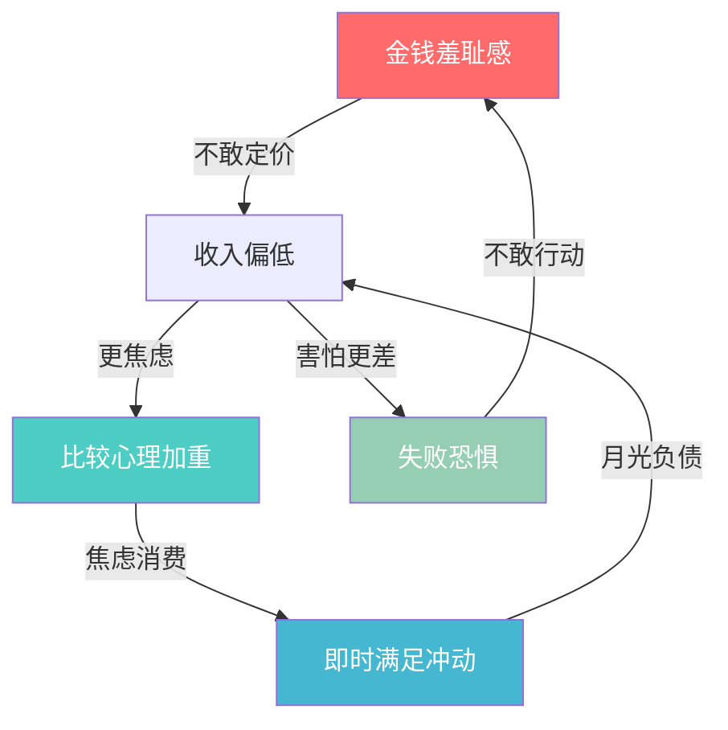

## 4.3 心态调整技巧

心态不是玄学，而是可以训练的心理技能。本节提供一套完整的心理调整工具箱，针对搞钱路上最常见的四大心理障碍——金钱羞耻感、失败恐惧、比较心理、即时满足——给出可落地的训练方法。

每一种障碍都配有：识别信号 → 根源分析 → 具体技法 → 训练计划 → 常见误区，确保你能从"知道"走到"做到"。

```mermaid
mindmap
  root((心态调整))
    克服金钱羞耻感
      认知重构
      价值锚定
      渐进脱敏
    克服失败恐惧
      概率思维
      最小试错
      失败复盘
    克服比较心理
      纵向对比
      信息筛选
      聚焦内圈
    克服即时满足
      承诺机制
      替代策略
      环境重塑
```



---

### 4.3.1 克服金钱羞耻感

#### 识别信号

你可能正在经历金钱羞耻感，如果：

- 谈到价格、收费、工资时会不自觉地压低声音或转移话题
- 不好意思向客户报价，总觉得"要多了"
- 看到别人高收入时第一反应是"肯定有问题"而非"我也可以"
- 收到钱时感到不安，觉得"受之有愧"
- 宁可免费帮忙也不愿谈报酬

#### 根源分析

金钱羞耻感不是天生的，而是被"安装"进大脑的。主要来源有三层：

| 层级 | 来源 | 典型植入语句 | 影响机制 |
|------|------|------------|---------|
| 文化层 | 传统观念 | "君子喻于义，小人喻于利" | 将金钱与道德对立 |
| 家庭层 | 父母教育 | "钱够用就行"、"别老想着钱" | 内化为自我限制信念 |
| 社交层 | 同伴影响 | "谈钱伤感情"、"有钱人都为富不仁" | 形成社交回避模式 |

这些信念在潜意识中运行，你甚至意识不到它们在影响你的决策。一个创业者可能明明产品很好，却始终不敢涨价，根源就在这里。

#### 技法一：认知重构——改写内心的金钱剧本

认知行为疗法（CBT）的核心原理：不是事件本身让你痛苦，而是你对事件的解读。金钱羞耻感本质上是一套错误的认知框架，需要逐条拆解和替换。

**第一步：提取自动化思维**

准备一个"金钱思维日志"，每当涉及金钱的场景让你感到不适时，立刻记录：

```text
日期：____
场景：____（例如：客户问我报价）
自动化思维：____（例如：要多了他会觉得我贪心）
情绪强度：1-10分：____
身体反应：____（例如：胃部发紧、脸发热）
```

**第二步：质疑自动化思维**

用以下五个问题逐一审视记录下来的思维：

1. **证据检验**：支持这个想法的证据是什么？反对的证据是什么？
2. **概率评估**：这件事真的发生的概率有多大？
3. **最坏情况**：最坏的结果是什么？我能承受吗？
4. **朋友视角**：如果朋友遇到同样的情况，我会怎么对他说？
5. **替代解读**：还有没有其他可能的解释？

**第三步：构建替代信念**

| 原有信念 | 替代信念 | 支撑逻辑 |
|---------|---------|---------|
| 谈钱俗气 | 谈钱是专业表现 | 医生、律师、咨询师都明码标价，这是职业素养 |
| 赚钱是贪婪 | 赚钱是价值交换的确认 | 你创造了价值，金钱是对方认可的证明 |
| 有钱人都不善良 | 财富放大一个人的本性 | 善良的人有钱后做更多好事，如比尔·盖茨的慈善 |
| 我不配赚那么多 | 我的价值由市场决定，不由我的感觉决定 | 价格是供需关系的反映，不是道德审判 |

#### 技法二：价值锚定——用事实替代感觉

羞耻感的本质是"感觉与事实脱节"。你觉得自己的价值不够高，但市场可能不这么认为。解决方法是建立客观的价值参照系。

**练习：制作你的"价值清单"**

```text
第一步：列出你提供的所有价值（至少20项）
├── 专业技能：____
├── 解决的问题：____
├── 帮助过的人数：____
├── 获得的认可/证书：____
└── 独特的优势组合：____

第二步：为每项价值标注市场参考价
├── 同行平均收费：____
├── 你目前的收费：____
└── 差距：____

第三步：计算"价值折扣率"
价值折扣率 = (市场参考价 - 你的收费) / 市场参考价 × 100%
如果 > 30%，说明你在"打折出售"自己的价值
```

**关键认知**：当你不好意思收费时，你不是在"照顾别人"，而是在"贬低自己"。免费或低价服务，接收方往往也不会珍惜。

#### 技法三：渐进脱敏——从小金额开始练胆

脱敏疗法的原理：恐惧不会消失，但你可以逐步提高对恐惧的耐受力。

**30天脱敏训练计划**：

| 阶段 | 天数 | 任务 | 难度 |
|------|------|------|------|
| 第一阶段 | 1-10天 | 每天和一个人主动谈论金钱话题（储蓄、投资、收入） | ★☆☆ |
| 第二阶段 | 11-20天 | 给自己提供的服务标注价格，告诉至少3个人 | ★★☆ |
| 第三阶段 | 21-30天 | 向一个客户/朋友正式报价，不打折、不解释 | ★★★ |

每天完成任务后记录：焦虑程度（1-10分）、实际结果、与预期的差距。你会发现，实际结果几乎总是比你预想的好。

#### 常见误区

- **误区一："等我够格了再收费"**——你永远不会觉得自己"够格"，这是冒名顶替综合征。先行动，资格感在行动中建立。
- **误区二："免费积累口碑，以后再收费"**——免费吸引来的用户，转化为付费用户的比例极低（通常 < 5%）。从一开始就建立付费预期。
- **误区三："我应该纯粹为了热爱而做"**——热爱和赚钱不矛盾。做热爱的事并获得合理报酬，才能持续做下去。

---

### 4.3.2 克服失败恐惧

#### 识别信号

- 一个想法想了很久，但始终没有开始行动
- 做任何决策前都要收集"所有"信息，导致决策瘫痪
- 害怕尝试新事物，总觉得"还没准备好"
- 过度关注风险而忽视机会
- 用"完美主义"包装拖延：反复修改方案但从不发布

#### 根源分析

失败恐惧的核心机制是**损失厌恶**——诺贝尔经济学奖得主丹尼尔·卡尼曼的研究表明，损失带来的痛苦感是等额收益带来的快乐感的 2-2.5 倍。换句话说，失去100元的痛苦，需要赚到200-250元才能抵消。

这解释了为什么：
- 你宁愿不赚那1000元，也不愿冒500元的风险
- 你宁愿维持现状（即使不满意），也不愿尝试改变
- 你宁愿花3个月"准备"，也不愿花3天"试错"

#### 技法一：概率思维——用数学替代恐惧

**练习：恐惧量化表**

把你的恐惧写下来，然后用概率和期望值来分析：

```text
我害怕的事情：创业失败

最坏情况：损失____元，花费____个月
最好情况：月收入增加____元
最可能的情况：____

概率评估（参考同类创业数据）：
├── 完全失败（血本无归）：____%
├── 小亏收场（损失可控）：____%
├── 勉强持平：____%
├── 小有盈利：____%
└── 大获成功：____%

期望值计算：
期望收益 = Σ(每种结果的概率 × 该结果的收益)
= (____% × 最坏) + (____% × 小亏) + ... + (____% × 大成功)
= ____

对比：不行动的"收益"= 0（维持现状的机会成本）
```

当你把模糊的恐惧转化为具体数字时，往往会发现：最大的风险不是尝试失败，而是永远不尝试。

#### 技法二：最小可行试错（MVE）

借鉴精益创业的 MVP（最小可行产品）理念，设计你的"最小可行试错"方案：

**MVE设计框架**：

```text
我想要尝试的事：____

第一步：把这件事拆解为最小的可验证单元
├── 最小投入金额：____元（应该让你心疼但不伤筋动骨）
├── 最小投入时间：____小时/天
└── 验证周期：____天（通常7-30天）

第二步：定义明确的验证标准
├── 成功信号：____（例如：有3个人愿意付费）
├── 失败信号：____（例如：7天内0人咨询）
└── 继续/止损决策点：____天后根据信号决定

第三步：执行，只看数据不看感觉
├── 开始日期：____
├── 数据记录：每天记录____
└── 决策日期：____
```

**关键原则**：试错成本应该低到"即使全亏了也不影响生活"。这样你就把"要不要做"的问题，转化为"用多小的代价来验证"的问题。

#### 技法三：失败复盘术——把每次失败变成资产

普通人害怕失败，高手利用失败。关键区别在于：高手失败后会做结构化复盘。

**GRAI复盘模板**：

```text
G - Goal（目标）：当时想达成什么？
    ____

R - Result（结果）：实际发生了什么？
    ____

A - Analysis（分析）：
    ├── 哪些因素是可控的？我做得怎样？
    ├── 哪些因素是不可控的？
    ├── 关键转折点在哪里？
    └── 根本原因是什么？（连续问5个为什么）

I - Insight（洞察）：
    ├── 我学到了什么？
    ├── 下次遇到类似情况我会怎么做？
    └── 这个经验可以复用到哪些场景？
```

**训练习惯**：每个月做一次"失败复盘"。不是等到大失败才复盘，而是把每一个"不如预期"的结果都当作学习素材。3个月后你会发现，你的"失败免疫力"显著提升。

#### 技法四：预设失败剧本——斯多葛消极想象法

古罗马斯多葛哲学家塞涅卡提出的"消极想象"（Premeditatio Malorum），是应对恐惧的经典方法：

**练习：最坏情况演练**

1. 把你害怕的事写下来
2. 详细描述最坏的结果（具体到画面、场景、对话）
3. 然后问自己：
   - 这个最坏结果真的会发生吗？（通常不会）
   - 如果真的发生了，我会怎么办？（列出具体应对方案）
   - 一年后我会怎么看这件事？（通常会觉得"也没那么严重"）
4. 最后问：不行动的代价是什么？（通常比最坏结果更可怕）

**核心洞察**：恐惧来自未知。当你把最坏情况"演练"一遍后，它就从"未知的恐怖"变成了"已知的风险"，而已知的风险是可以管理的。

#### 常见误区

- **误区一："失败是成功之母"但不复盘**——失败本身不会自动变成经验，只有结构化的复盘才能提取教训。
- **误区二：把试错成本设得太高**——很多人一创业就投入全部积蓄，这不是勇敢而是鲁莽。MVE的核心是"用最小代价获得最大信息"。
- **误区三：只接受"成功"的结果**——试错的目的是获取信息，不是保证成功。即使验证了"这条路不通"，试错也是有价值的。

---

### 4.3.3 克服比较心理

#### 识别信号

- 刷朋友圈/社交媒体后感到焦虑或自卑
- 听到同龄人赚了多少钱后开始怀疑自己
- 频繁改变自己的方向，因为"别人都在做那个"
- 无法为他人的成功真心高兴
- 总觉得"别人轻轻松松就成功了，我怎么这么难"

#### 根源分析

比较心理有进化根源——在原始部落中，关注他人地位是生存本能。但在信息时代，这个本能被无限放大：

- **社交货币效应**：社交媒体的算法推送"精彩内容"，让你看到的永远是别人最好的一面
- **幸存者偏差**：你看到的成功案例是少数幸存者，看不到大量沉默的失败者
- **向上比较本能**：人类天生倾向于和比自己"好"的人比较，而不是和平均水平比

结果：你每天都在和一个经过美化的"虚拟人群"比较，这是一场注定失败的比赛。

#### 技法一：纵向对比法——建立个人进度条

把注意力从"横向比较"转为"纵向比较"——只和过去的自己比。

**练习：个人成长仪表盘**

```text
每月1号填写：

财务维度：
├── 本月收入：____元（上月：____元，变化：____%）
├── 本月储蓄：____元（上月：____元，变化：____%）
├── 本月投资收益：____元
└── 被动收入：____元

能力维度：
├── 本月学会的新技能：____
├── 本月完成的项目/里程碑：____
├── 本月读的书/课程：____
└── 本月建立的新连接：____人

满意度维度（1-10分）：
├── 收入满意度：____
├── 成长满意度：____
└── 生活满意度：____
```

**关键规则**：只和自己上个月的数据比较。如果你每个月都比上个月进步1%，一年后你会进步12%以上——这比任何一次"暴富"都更可靠。

#### 技法二：信息环境重塑——主动管理你的信息输入

你无法控制别人发什么，但你可以控制自己看什么。

**30天信息断舍离计划**：

| 阶段 | 行动 | 预期效果 |
|------|------|---------|
| 第1周 | 取消关注所有让你焦虑的账号（炫富、鸡汤、贩卖焦虑） | 减少负面刺激源 |
| 第2周 | 关注5个提供实际价值的账号（行业分析、技能教程、真实案例） | 重建信息输入质量 |
| 第3周 | 设定每天社交媒体使用时间上限（建议30分钟以内） | 减少被动比较时间 |
| 第4周 | 用"主动学习"替代"被动浏览"（读书、课程、实操） | 把注意力从别人身上收回 |

**辅助工具**：
- 手机屏幕使用时间功能（iOS/Android自带）监控每日使用时长
- 浏览器插件：News Feed Eradicator（隐藏社交媒体信息流）
- 物理方法：把社交媒体App从手机首屏移到第三屏文件夹深处

#### 技法三：概率视角——拆解"别人的故事"

当你看到别人的成功时，用以下框架进行理性拆解：

**成功故事拆解模板**：

```text
我看到的成功案例：____

第一步：识别幸存者偏差
├── 同期做这件事的人有多少？____
├── 成功的有多少？____
├── 成功率：____%
└── 我看到的是____分之一的幸存者

第二步：识别隐藏信息
├── 他有什么我没看到的优势？（资源、人脉、背景、运气）
├── 他经历了什么我没看到的失败？
├── 他的成功花了多长时间？
└── 他展示的是"结果"还是"过程"？

第三步：提取可借鉴的要素
├── 哪些因素是可以学习的？
├── 哪些因素是我可以创造的？
├── 哪些因素是我必须接受差异的？
└── 我的实际行动计划：____
```

#### 技法四：建立"同行者圈"替代"比较对象"

比较心理的根源之一是孤独感——觉得自己在独自战斗。解决方法不是"不比较"，而是把比较对象换成和你处境相似、正在一起成长的人。

**构建同行者圈的方法**：

1. **找到3-5个和你处于类似阶段的人**——不找比你强很多的"偶像"，找和你差不多的"战友"
2. **建立固定交流机制**——每周或每两周一次线上/线下交流，分享进展、困惑、资源
3. **设定"不评判"规则**——这个圈子的目的是互相支持，不是互相比较
4. **共同设定里程碑**——一起设定季度目标，互相督促

#### 常见误区

- **误区一："我不应该和任何人比较"**——完全不比较既不现实也没必要。关键是选对比较对象和比较维度。和昨天的自己比是健康的。
- **误区二："我只要不看社交媒体就好了"**——信息环境不只是社交媒体，还包括你身边的人、你读的书、你听的播客。需要全面管理。
- **误区三："别人的成功是运气好"**——把别人的成功全部归因于运气，和全部归因于能力一样不客观。理性拆解才能提取有价值的信息。

---

### 4.3.4 克服即时满足

#### 识别信号

- 月光或负债，但说不清钱花在了哪里
- 明知道应该学习/工作，却控制不住刷手机
- 购物后很快后悔，但下次还是会冲动消费
- 储蓄计划总是执行不到一个月就放弃
- 总是选择"现在爽"而不是"以后好"

#### 根源分析

即时满足的底层机制是大脑的**双曲贴现**（Hyperbolic Discounting）：人类倾向于高估即时奖励的价值，低估延迟奖励的价值。

举例：
- 今天给你100元 vs 一个月后给你150元——大多数人选今天
- 但如果是"一年后给你100元 vs 一年零一个月后给你150元"——大多数人选150元

同样是等一个月，但因为"现在"的存在，大脑的决策发生了翻转。这不是意志力问题，而是大脑的进化遗留——在食物稀缺的原始环境中，"现在就吃"是理性选择。

**关键认知**：你不是意志力差，而是大脑在用一套过时的操作系统做决策。解决方案不是"逼自己忍耐"，而是设计外部机制来绕过这个系统漏洞。

#### 技法一：承诺机制（Commitment Device）

承诺机制的核心思想：让"未来的你"没有退路。

**具体方法**：

| 方法 | 操作 | 适用场景 |
|------|------|---------|
| 自动转账 | 发工资当天自动转30%到储蓄/投资账户 | 储蓄 |
| 定期存款 | 设定到期才能取出的定期产品 | 强制长期储蓄 |
| 预付消费 | 预付健身年卡、课程费（利用沉没成本效应） | 习惯养成 |
| 公开承诺 | 在朋友圈/社群公开宣布你的储蓄/学习目标 | 降低放弃概率 |
| 同伴监督 | 找一个伙伴互相监督，违约者请客吃饭 | 任何目标 |
| 物理隔离 | 把信用卡冻在冰块里/删除购物App | 消费控制 |

**实施模板**：

```text
我的承诺机制设计：

目标：____（例如：每月储蓄5000元）

自动执行机制：
├── 工资到账日：自动转账____元到____账户
├── 账户类型：____（定期/基金/余额宝，确保取款有摩擦）
└── 设置日期：____

监督机制：
├── 监督人：____
├── 检查频率：每月____日
└── 违约惩罚：____

应急机制：
├── 什么情况下可以例外：____（只列真正紧急的情况）
├── 例外审批流程：____（例如：需要监督人同意）
└── 例外次数上限：每季度____次
```

#### 技法二：替代满足策略

即时满足的冲动不会消失，但可以用更低成本的方式满足同样的底层需求。

**需求-替代对照表**：

| 你想要的 | 底层需求 | 低成本替代方案 | 节省金额 |
|---------|---------|--------------|---------|
| 买新衣服 | 新鲜感、自我表达 | 重新搭配已有衣物、交换二手衣服 | 500-2000元/月 |
| 点外卖 | 便利、口味 | 学做3道拿手菜、批量备餐 | 1000-3000元/月 |
| 冲动购物 | 购买时的多巴胺快感 | 加入购物车后等24小时；逛"只看不买"的实体店 | 因人而异 |
| 刷短视频 | 无聊时的刺激 | 听播客/有声书（同样碎片化但有积累价值） | 时间成本 |
| 买课程囤课 | 学习焦虑的缓解 | 先学完一个再买下一个 | 500-5000元/年 |

**关键原则**：不是"不满足自己"，而是"用更聪明的方式满足自己"。完全压抑欲望会导致报复性消费，替代策略才能长期可持续。

#### 技法三：24小时法则 + 10-10-10法则组合拳

这两个法则单独使用效果有限，组合使用威力倍增。

**操作流程**：

```text
当产生消费冲动时：

第一步：24小时冷却（阻断冲动）
├── 把想买的东西加入购物车/愿望清单
├── 设置24小时后的提醒
├── 告诉自己："如果24小时后还想买，就买"
└── （通常70%的冲动会在24小时内消退）

第二步：10-10-10分析（理性评估）
├── 10分钟后：我会有什么感觉？（通常：开心、满足）
├── 10个月后：我会有什么感觉？（通常：无所谓、已经忘了）
├── 10年后：我会有什么感觉？（通常：完全没有影响）
└── 10年后这笔钱如果投资呢？
    └── ____元 × (1+8%)^10 = ____元（对比一下）

第三步：替代方案扫描
├── 有没有更便宜的方式获得同样的满足？
├── 这个东西我真的"需要"还是只是"想要"？
└── 如果必须买，有没有等促销/买二手的选项？

第四步：做决定
├── 通过了所有三步？→ 买
├── 任何一步没通过？→ 不买，把省下的钱转入储蓄账户
└── 记录这次决策，月底统计省了多少钱
```

#### 技法四：环境设计——让正确的事变容易，让错误的事变难

行为设计学的核心原理：改变行为最有效的方法不是增强意志力，而是改变环境。

**消费环境设计清单**：

```text
物理环境：
□ 把钱包/信用卡放在不容易拿到的地方
□ 删除手机上的购物App（需要时再装）
□ 取消所有促销短信/邮件订阅
□ 超市购物前写清单，只买清单上的东西
□ 不饿的时候去超市（饥饿感会增加30%的非计划消费）

数字环境：
□ 关闭所有购物App的推送通知
□ 取消保存的支付方式（每次手动输入增加摩擦）
□ 使用浏览器插件屏蔽购物网站（工作时间）
□ 把首屏App换成记账、学习、健身类

社交环境：
□ 减少和"消费型朋友"的购物聚会
□ 增加和"储蓄型朋友"的交流
□ 加入理财社群（看到别人的储蓄进度会有正向激励）
□ 和家人/伴侣建立共同的消费规则
```

#### 技法五：延迟满足的系统训练

延迟满足像肌肉一样可以训练。以下是一个渐进式的训练计划：

**28天延迟满足训练**：

| 周次 | 训练内容 | 难度 |
|------|---------|------|
| 第1周 | 每天选择一个小的即时满足场景，延迟30分钟再满足（例如：想吃零食→等30分钟） | ★☆☆ |
| 第2周 | 延长时间到1小时，同时记录等待期间的情绪变化 | ★★☆ |
| 第3周 | 尝试完全跳过一些非必要的即时满足（例如：今天不喝奶茶，把钱存起来） | ★★★ |
| 第4周 | 设定一个需要30天才能达成的小目标，每天记录进度（例如：连续30天记账） | ★★★ |

**训练日志模板**：

```text
日期：____
今天想要的即时满足：____
我做了什么：□ 立即满足 □ 延迟____分钟 □ 完全跳过
等待时的情绪变化：____
最终结果：____
今天省下/多花了：____元
```

#### 常见误区

- **误区一："我要完全戒掉消费欲望"**——完全压抑会导致报复性消费。目标是"有意识的消费"，不是"零消费"。
- **误区二："延迟满足 = 痛苦忍耐"**——正确的延迟满足是"用更好的选择替代当前选择"，不是"强忍着什么都不做"。
- **误区三："一次失败就说明我没救了"**——训练过程中"破戒"是正常的。重要的是记录、分析、下一次做得更好，而不是自我否定。

---

### 4.3.5 四大障碍的联动关系与综合应对

这四种心理障碍不是孤立存在的，它们往往会叠加出现，形成恶性循环：



**综合应对策略**：

当你发现多个障碍同时出现时，不要试图同时解决。按优先级排序：

1. **第一优先：金钱羞耻感**（底层信念，影响最大）
2. **第二优先：失败恐惧**（阻碍行动，不解决就无法开始）
3. **第三优先：即时满足**（影响积累，需要在行动中同步训练）
4. **第四优先：比较心理**（影响持续性，需要长期维护信息环境）

**每日心态维护清单**（5分钟）：

```text
□ 早上：阅读一条替代信念（从你的认知重构笔记中选）
□ 中午：检查今天的消费是否有冲动成分
□ 下午：记录一件今天的进步（和自己比）
□ 晚上：花2分钟做感恩练习（3件值得感恩的事）
□ 睡前：回顾今天的心态状态，给自己的"心态健康度"打分（1-10）
```

---

### 4.3.6 进阶：建立长期心态维护系统

短期的技巧训练能解决眼前问题，但真正的心态转变需要系统化的长期维护。

#### 心态维护的三层架构

```text
第一层：日常维护（每天5分钟）
├── 晨间信念复习
├── 消费意识检查
├── 进步记录
└── 感恩练习

第二层：周度复盘（每周30分钟）
├── 本周的心态波动回顾
├── 消费决策质量评估
├── 和上周的自己对比
└── 下周的心态维护重点

第三层：月度深度检修（每月2小时）
├── 认知重构笔记更新
├── 恐惧量化表更新
├── 个人成长仪表盘填写
├── 信息环境审计（检查关注列表）
└── 承诺机制效果评估
```

#### 什么时候需要专业帮助

以下情况建议寻求专业心理咨询师的帮助：

- 金钱相关的焦虑已经严重影响到日常生活和工作
- 反复出现无法控制的消费行为（疑似强迫性购物）
- 因为财务问题产生严重的抑郁情绪
- 以上所有技巧都尝试过但效果甚微

心理咨询不是"有病才去"，而是一种高效的问题解决方式。就像请财务顾问帮你理财一样，请心理咨询师帮你"理心"也是合理的投资。

---

### 本节小结

| 心态障碍 | 核心技法 | 最关键的一步 |
|---------|---------|------------|
| 金钱羞耻感 | 认知重构 + 价值锚定 + 渐进脱敏 | 提取并质疑你的自动化思维 |
| 失败恐惧 | 概率思维 + 最小可行试错 + 失败复盘 | 把模糊恐惧转化为具体数字 |
| 比较心理 | 纵向对比 + 信息环境重塑 + 同行者圈 | 建立个人成长仪表盘，只和自己比 |
| 即时满足 | 承诺机制 + 替代满足 + 环境设计 | 设置自动转账，让储蓄变成默认行为 |

心态调整不是一次性事件，而是持续的训练过程。不要期望读完这一节就立刻改变——选择一个最需要解决的障碍，从最小的练习开始，坚持28天，你会看到明显的变化。

***
