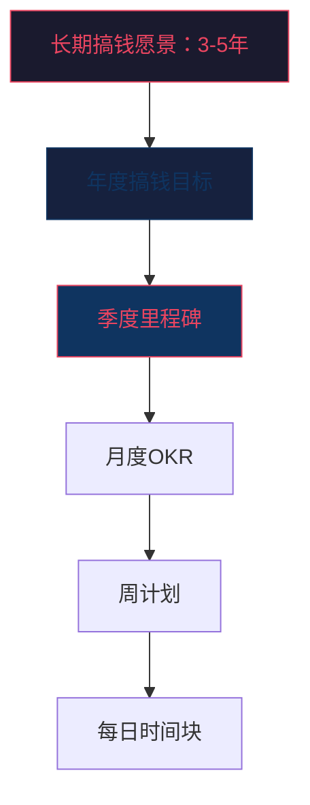
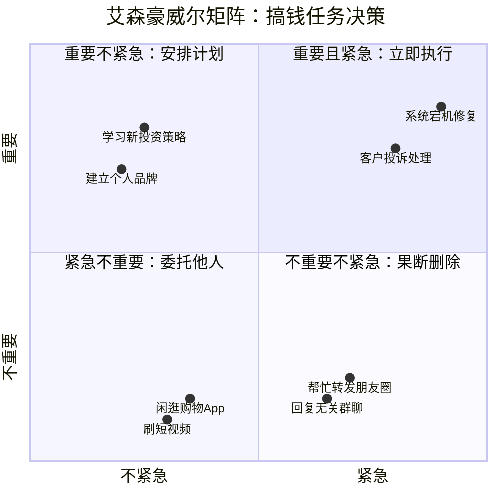
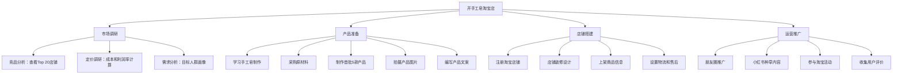

## 4.4 时间管理技巧

时间是搞钱过程中唯一真正稀缺的资源。金钱可以借贷、可以再赚，但每个人每天只有 24 小时，无法充值、无法转让、无法暂停。对于想要搞钱的人来说，时间管理不是"让生活更有序"的锦上添花，而是直接决定收入上限的核心能力。同样一天 8 小时用于搞钱相关活动，一个懂得时间管理的人可以完成三倍于普通人的高价值产出——这不靠加班，靠的是方法。

### 4.4.1 为什么搞钱必须先管好时间

#### 时间的真实成本

大多数人对时间没有量化概念，这是时间管理失败的根源。你需要先算清一笔账：

**计算你的时间单价：**

```text
时间单价 = 月收入 ÷ 月工作小时数
```

| 月收入 | 每月工作小时 | 时间单价 |
|--------|-------------|----------|
| 8,000 元 | 176 小时（22天×8h） | 45 元/小时 |
| 15,000 元 | 176 小时 | 85 元/小时 |
| 30,000 元 | 200 小时 | 150 元/小时 |
| 50,000 元 | 200 小时 | 250 元/小时 |

这个数字不是用来炫耀的，而是用来做决策的。当你的时间单价是 85 元/小时，花 2 小时为了省 30 块钱对比三家店铺，你就亏了 140 元。搞钱的第一步，就是停止用高价值时间做低价值的事。

#### 搞钱者的时间分类

并非所有时间都等价。搞钱场景下，时间分为四类：

| 时间类型 | 定义 | 产出价值 | 举例 |
|---------|------|---------|------|
| **高价值创造时间** | 产出直接影响收入的时间 | 最高 | 写代码、谈客户、写方案、做投资决策 |
| **高价值学习时间** | 提升未来收入能力的时间 | 高（延迟兑现） | 学新技能、研究行业趋势、复盘案例 |
| **维护性时间** | 保持现有运转必需但不产生新增价值 | 中 | 回复邮件、处理报销、整理文件 |
| **低价值消耗时间** | 无意识的时间浪费 | 接近零 | 刷短视频、无目的刷新闻、无效会议 |

搞钱型时间管理的核心目标很简单：**增加前两类时间的占比，压缩后两类时间的绝对值。**

#### 时间管理失败的底层原因

大多数人时间管理失败，不是因为懒，而是因为以下三个根本原因：

1. **缺乏清晰的搞钱目标**：不知道时间该花在哪里，自然无法分配
2. **认知偏差——把忙碌当产出**：一天回复 200 条消息很"忙"，但可能零产出
3. **环境设计失败**：把意志力当时间管理工具，而意志力是消耗品，每天有限

后面的内容会针对这三个根本原因，给出系统性的解决方案。

### 4.4.2 目标导向的时间分配框架

#### 搞钱目标的层级结构

时间管理必须建立在清晰目标之上，否则再好的工具也只是"更高效地做无意义的事"。



**举例：一个副业搞钱者的层级分解**

| 层级 | 目标示例 |
|------|---------|
| 3年愿景 | 副业收入超过主业，实现时间自由 |
| 年度目标 | 副业年收入 15 万，建立 3 个稳定收入渠道 |
| 季度里程碑 | Q1：完成产品MVP并获取前 50 个付费用户 |
| 月度OKR | 本月新增 20 个付费用户，用户续费率 > 70% |
| 周计划 | 本周完成用户回访、修复 3 个关键bug、发布一篇引流文章 |
| 每日时间块 | 6:30-7:30 写文章，20:00-22:00 产品开发 |

#### ABC 时间分配法

基于帕累托法则（80/20 法则），把每天的时间块按价值分级：

- **A 类时间（占 60%）**：直接创造收入或大幅提升能力的事。这是你的"不可侵犯时间"，绝不允许被会议、消息、杂事侵占
- **B 类时间（占 25%）**：维持现有业务运转、维护客户关系、处理必要行政事务
- **C 类时间（占 15%）**：低价值但必须做的杂事。能外包的外包，能批处理的批处理，能自动化的自动化

**关键原则：A 类时间必须安排在你精力最充沛的时段。** 如果你是早起型，把 A 类时间放在早上 6:00-10:00；如果你是夜猫子，放在晚上 20:00-24:00。精力管理的具体方法在 4.5 节详述，这里只强调：时间分配的前提是精力分配。

#### 周计划模板

比起每天制定计划，周计划更能保证搞钱目标的持续推进。以下是经过验证的周计划结构：

```markdown
## 本周搞钱目标（最多3个）
1. [目标1] —— 对应的收入/能力指标
2. [目标2] —— 对应的收入/能力指标  
3. [目标3] —— 对应的收入/能力指标

## 每日 A 类时间安排
周一：[具体搞钱任务] —— 预计时长
周二：[具体搞钱任务] —— 预计时长
...（重复到周五）

## 本周必须完成的 B 类事项
- [ ] 
- [ ]

## 本周可延后/外包的 C 类事项
- [ ] 
- [ ]
```

### 4.4.3 七大实战时间管理方法

以下方法不是并列选择题，而是可以根据场景组合使用的工具箱。

#### 方法一：时间块法（Time Blocking）

时间块法是将一天划分成若干固定用途的时间段，每个时间段只做一件事。这是 Cal Newport 在《深度工作》中极力推荐的方法，也是巴菲特、比尔·盖茨等顶级搞钱者实际在用的方法。

**具体操作步骤：**

1. 前一天晚上或当天早上，列出当天所有待办事项
2. 按 ABC 分级标注每件事的价值等级
3. 将 A 类事项安排在精力高峰时段，分配 2-4 小时整块时间
4. 将 B 类事项安排在精力中等时段
5. 将 C 类事项集中安排在精力低谷时段（通常在午餐后）
6. 每个时间块之间留 15 分钟缓冲

**时间块示例（上班族副业搞钱者）：**

| 时间段 | 用途 | 价值等级 |
|--------|------|---------|
| 6:00-7:00 | 副业核心工作（写作/开发/接单） | A |
| 7:00-8:00 | 通勤 + 学习音频课程 | B |
| 8:00-12:00 | 主业工作（将 A 类任务集中在此） | A |
| 12:00-13:00 | 午餐 + 刷行业资讯 | C |
| 13:00-17:00 | 主业工作（处理 B/C 类任务） | B |
| 17:00-18:00 | 通勤 + 学习音频课程 | B |
| 18:00-19:00 | 晚餐 + 休息 | — |
| 19:00-21:00 | 副业核心工作（深度时段） | A |
| 21:00-21:30 | 复盘 + 规划明天 | B |
| 21:30-22:30 | 自由时间 | — |

**注意事项：**
- 时间块不是牢笼，而是默认计划。突发紧急事项可以调整，但调整时必须明确牺牲了哪个时间块
- 每周回顾：哪些时间块被频繁打断？是计划不合理还是外部干扰太多？
- 新手常犯的错误是把每个小时都排满，实际上应该留出 20% 的缓冲时间

#### 方法二：番茄工作法（Pomodoro Technique）

番茄工作法的核心是"25 分钟专注 + 5 分钟休息"的循环，适合需要长时间专注但容易走神的搞钱任务。

**标准流程：**

1. 选定一个要完成的搞钱任务
2. 设定 25 分钟倒计时
3. 在 25 分钟内全力专注，不看手机、不回消息
4. 倒计时结束，标记完成一个"番茄钟"
5. 休息 5 分钟（站起来走动、喝水、远眺）
6. 每完成 4 个番茄钟，长休息 15-30 分钟

**搞钱场景适配：**

| 任务类型 | 推荐番茄钟设置 | 原因 |
|---------|---------------|------|
| 写作/内容创作 | 标准 25+5 | 写作需要频繁切换思路，短间隔更友好 |
| 编程/开发 | 加长 45+10 | 进入代码状态需要时间，频繁中断反而降低效率 |
| 学习新技能 | 标准 25+5 | 新知识吸收有容量上限，短间隔防止过载 |
| 客户沟通 | 不适用 | 沟通是互动性任务，不适合计时器驱动 |
| 数据分析 | 加长 50+10 | 数据分析需要连贯的逻辑链条 |

**工具推荐：**
- 物理番茄钟：无需手机即可使用，减少干扰（推荐厨房计时器）
- 手机App：Forest（种树模式，中途退出树会枯死）、Focus To-Do
- 桌面端：Pomotroid、TomatoBar（Mac）

**进阶技巧——番茄统计法：**
记录每天完成的番茄钟数量，连续记录 2 周，你就能知道自己每天真正的有效工作时间是多少。大多数人会震惊地发现，自认为"工作了 8 小时"，实际上有效番茄钟不超过 6 个（2.5 小时）。这个数据是提升时间管理的基准线。

#### 方法三：两分钟法则（Two-Minute Rule）

来自 David Allen 的 GTD（Getting Things Done）方法论：**如果一件事能在 2 分钟内完成，立刻做掉，不要记录、不要计划、不要拖延。**

这条规则的价值在于消除"小任务积压"带来的心理负担。搞钱过程中会有大量琐碎事务：

- 回复一条合作邀约消息
- 确认一个订单
- 提交一份发票
- 更新一个表格数据

这些事每件都很小，但如果堆积 20 件，就会形成巨大的心理压力，占用你的"注意力带宽"——即使你没在做这些事，它们也会像后台进程一样消耗你的脑力。

**操作边界：**
- 2 分钟法则只适用于"快速完成"的事，不适用于"快速开始"
- 不要让两分钟法则打断你正在进行的 A 类时间块
- 在 A 类时间块内收到的 2 分钟任务，记录下来放到下一个 B/C 类时间块集中处理

#### 方法四：批处理法（Batching）

批处理的核心思想是：**相同类型的任务集中处理，减少任务切换的认知成本。**

每次从一个任务切换到另一个任务，大脑需要 15-25 分钟才能恢复到原来的专注深度（美国加州大学尔湾分校 Gloria Mark 教授的研究数据）。如果你一天切换 10 次任务，就会损失 2.5-4 小时的专注力——相当于半天的工作时间白白蒸发。

**搞钱场景的批处理建议：**

| 任务类型 | 批处理方式 | 建议频率 |
|---------|-----------|---------|
| 回复消息/邮件 | 集中在 2-3 个固定时段统一回复 | 每天 3 次 |
| 内容创作（文章/视频脚本） | 一次批量创作 2-3 篇内容 | 每周 1-2 次 |
| 客户沟通/跟进 | 集中在特定时段批量处理 | 每天 1-2 次 |
| 社交媒体运营 | 用工具预排期，一次排好一周内容 | 每周 1 次 |
| 记账/财务整理 | 周末统一处理 | 每周 1 次 |
| 学习/阅读 | 集中在固定学习日 | 每周 1-2 次 |

**批处理的前置条件——清单驱动：**
批处理需要一个可靠的收集系统。当小任务出现时，先记到清单里，等到批处理时间块再统一处理。推荐工具：

- 纸质：随身携带的小本子，简单可靠
- 数字：Todoist、滴答清单、Microsoft To Do
- 极简：手机自带备忘录 + 每日固定时间回顾

#### 方法五：艾森豪威尔矩阵（Eisenhower Matrix）

这是最经典的时间管理决策工具，将任务按"紧急性"和"重要性"两个维度分为四个象限：



**四个象限的搞钱策略：**

**第一象限：重要且紧急 → 立刻亲自做**
- 有截止日期的交付任务
- 客户紧急投诉
- 系统/业务故障
- 限时的投资机会（需要快速判断）

**第二象限：重要不紧急 → 安排固定时间做（这是搞钱的核心象限）**
- 学习新技能
- 建立个人品牌
- 开发新产品/服务
- 维护核心人脉关系
- 制定搞钱战略和长期计划
- 锻炼身体（身体是搞钱的本钱）

**第三象限：紧急不重要 → 尽量委托或自动化**
- 大部分即时消息回复
- 他人发起的非必要会议
- 一些行政杂事
- 重复性的数据录入

**第四象限：不重要不紧急 → 果断删减**
- 无目的刷社交媒体
- 纯消遣性内容消费
- 无价值的社交应酬
- 完美主义驱动的反复修改

**关键认知：大多数人把 80% 的时间花在第一和第三象限（紧急的事），而真正决定搞钱上限的第二象限（重要不紧急）反而被严重忽视。** 因为第二象限的事"不急"，所以总被推迟——直到它变成第一象限的危机。

解决方案：每周从第二象限选出 2-3 件事，像对待重要会议一样固定安排到日程中，不可取消、不可推迟。

#### 方法六：吞青蛙法（Eat That Frog）

来自 Brian Tracy 的同名书籍。核心思想：**每天第一件事，先完成最困难、最重要、最不想做的搞钱任务。** 这只"青蛙"就是你当天的 A 类任务中最难的那个。

**为什么要先吞青蛙：**
- 早上意志力最充沛，抵抗拖延的能力最强
- 完成最难的任务后会产生巨大的成就感，带动全天的积极性
- 避免拖延到下午/晚上，最终被其他事挤掉

**操作步骤：**
1. 前一天晚上确定明天的"青蛙"是哪件事
2. 第二天早上，不看邮件、不刷手机、不处理任何杂事
3. 直接开始做"青蛙"任务
4. 至少完成一个番茄钟（25 分钟）再去做其他事

**常见抗拒及应对：**

| 抗拒原因 | 应对方法 |
|---------|---------|
| 任务太大，不知从何开始 | 拆解成子任务，只做第一步 |
| 害怕失败/结果不好 | 告诉自己"先做一个垃圾版本"，完成后迭代 |
| 缺乏动力 | 想象完成后的收益/不做会的后果 |
| 早上精力不好 | 调整作息，或把"青蛙"安排在你的精力高峰时段 |

#### 方法七：1-3-5 法则

每天只计划完成 **1 件大事、3 件中事、5 件小事**，总共 9 件事。这个方法的精髓是限制任务数量，防止"计划 20 件事、完成 5 件、剩下 15 件产生挫败感"的恶性循环。

**搞钱版 1-3-5 法则：**

```markdown
今日计划：

🐸 1 件大事（A 类，搞钱核心）：
  → [ ] 完成客户提案初稿

📋 3 件中事（B 类，推进搞钱进度）：
  → [ ] 回复 3 个潜在客户的询价
  → [ ] 发布本周的引流文章
  → [ ] 更新产品页面的用户评价

📎 5 件小事（C 类，维护性工作）：
  → [ ] 处理退款申请
  → [ ] 记录今日收支
  → [ ] 回复合作邮件
  → [ ] 更新项目进度表
  → [ ] 预约明天的客户电话
```

**使用要点：**
- 大事必须是当天的"青蛙"，放在精力最好的时段做
- 如果大事做完了还有余力，可以从明天借一件大事提前做
- 小事尽量集中在下午精力低谷时批处理
- 如果连续 3 天都无法完成计划的 9 件事，说明计划过于乐观，需要下调

### 4.4.4 消灭时间黑洞

#### 识别你的个人时间黑洞

时间黑洞是指那些"不知不觉就吞掉大量时间"的活动。每个人的时间黑洞不同，但以下是搞钱者最常见的几类：

**数字时间黑洞：**

| 黑洞类型 | 平均日耗时（调查数据） | 年化损失 |
|---------|---------------------|---------|
| 短视频（抖音/快手/Reels） | 90-120 分钟 | 547-730 小时/年 |
| 社交媒体浏览（微信朋友圈/微博） | 40-60 分钟 | 243-365 小时/年 |
| 无目的网页浏览 | 30-45 分钟 | 182-274 小时/年 |
| 即时消息打断（微信群/QQ群） | 60-90 分钟 | 365-547 小时/年 |

把这些时间加起来，一个普通人每天在数字黑洞上消耗 3.5-5 小时，一年就是 1,300-1,800 小时。如果把这些时间的 30% 用于搞钱相关活动，一年就是 400-540 小时——足够学会一门新技能或从零搭建一个副业项目。

**社交时间黑洞：**
- 无明确目的的饭局应酬
- "顺便帮忙"但实际消耗大量时间的请求
- 群聊中的无意义争论
- 为了"维护关系"的被迫社交

**决策时间黑洞：**
- 为低价值消费反复比价（买个 30 块的东西比价 2 小时）
- 在两个差不多的选项间反复犹豫
- 反复修改已经够好的方案（完美主义陷阱）

#### 系统性消灭时间黑洞的方法

**方法一：环境阻断法（最有效）**

不要靠意志力对抗诱惑，而是让诱惑变得不可及：

- 工作时把手机放到另一个房间（研究表明，即使手机静音放在桌上，也会降低认知能力——Ward 等人 2017 年发表在《Journal of the Association for Consumer Research》的研究）
- 安装网站屏蔽工具（Cold Turkey、Freedom、StayFocusd），在 A 类时间块自动屏蔽娱乐网站
- 卸载手机上的短视频 App，只在电脑上使用（增加使用摩擦）
- 退出所有非必要的微信群，保留的群设为免打扰

**方法二：时间审计法**

连续记录一周的时间使用情况，精确到 30 分钟。方法很简单：

```markdown
## 时间审计表（示例）

| 时间段 | 实际做的事 | 价值等级 | 备注 |
|--------|-----------|---------|------|
| 6:00-6:30 | 刷手机 | D | 起床拖延 |
| 6:30-7:00 | 洗漱早餐 | C | 必要 |
| 7:00-7:30 | 刷短视频 | D | 黑洞 |
| 7:30-8:00 | 通勤 | C | 必要 |
| 8:00-8:30 | 回复邮件 | B | 可以集中处理 |
| 8:30-9:00 | 开早会 | C | 80%与我无关 |
...（持续记录一整天）
```

记录一周后做汇总分析，你会清晰地看到时间去了哪里。很多人在做完整周审计后，发现自己的"有效搞钱时间"每天不到 2 小时——这就是改变的起点。

**方法三：替换法**

单纯"戒掉"某个习惯很难，但用另一个习惯替换它容易得多：

| 要戒掉的时间黑洞 | 替换方案 | 预期回收时间 |
|-----------------|---------|-------------|
| 通勤刷短视频 | 听商业/投资播客 | 40-60 分钟/天 |
| 午休刷朋友圈 | 午睡或冥想 15 分钟 | 20-30 分钟/天 |
| 睡前刷手机 | 阅读行业报告或书籍 | 30-45 分钟/天 |
| 排队时发呆 | 用手机处理待办清单 | 15-20 分钟/天 |
| 无目的群聊 | 写搞钱复盘笔记 | 20-30 分钟/天 |

### 4.4.5 任务管理与执行力

#### 任务拆解能力

搞钱任务往往比较宏大（"建立一个赚钱的副业""实现年收入翻倍"），如果不拆解，就会一直停留在"想做"阶段。

**拆解方法——WBS（Work Breakdown Structure）：**

以"开一个淘宝店卖手工皂"为例：



**拆解的判断标准：**
- 每个最底层任务应该能在 1-2 个番茄钟（25-50 分钟）内完成
- 如果某个子任务预估超过 2 小时，说明还需要继续拆
- 每个子任务有明确的完成标准（做到什么程度算"完成"）

#### GTD 工作流的搞钱适配版

David Allen 的 GTD（Getting Things Done）是全球最经典的任务管理系统。以下是针对搞钱场景的简化适配版：

```mermaid
flowchart LR
    A[收集所有待办] --> B{这个任务需要行动吗?}
    B -->|不需要| C[丢弃/存档/参考资料]
    B -->|需要| D{2分钟能做完?}
    D -->|能| E[立即执行]
    D -->|不能| F{是我做吗?}
    F -->|不是| G[委托他人]
    F -->|是我做| H{有截止日期?}
    H -->|有| I[加入日历]
    H -->|没有| J[加入"下一步行动"清单]
```

**搞钱场景的实际操作：**

1. **收集**：用一个统一的收件箱（可以是 App、笔记本、邮件标签），把所有冒出来的待办事项全部丢进去。不要在收集时思考和分类
2. **处理**：每天固定 1-2 个时段处理收件箱，逐条按照上面的流程图决策
3. **组织**：按项目分类（如"淘宝店项目""投资学习""客户开发"），每个项目维护一个"下一步行动"清单
4. **回顾**：每周日花 30 分钟回顾所有清单，更新进度，调整优先级
5. **执行**：根据当前情境、可用时间、精力状态和优先级选择要做的事

#### 搞钱者的每日最佳流程

结合以上方法论，以下是经过验证的搞钱者每日时间管理最佳实践：

**晚间准备（前一晚，10 分钟）：**
1. 回顾今天的完成情况
2. 确定明天的"青蛙"任务（1 件最重要的搞钱任务）
3. 用 1-3-5 法则规划明天的任务清单
4. 准备好明天需要的资料和工具

**晨间启动（起床后 30 分钟）：**
1. 不碰手机（前 30 分钟完全隔离手机）
2. 简短的身体活动（5-10 分钟拉伸或散步）
3. 回顾今日计划，确认"青蛙"任务
4. 开始执行"青蛙"

**日间执行：**
1. A 类时间块：专注搞钱核心任务，手机静音、关门、断网社交
2. B 类时间块：处理维护性工作
3. C 类时间块：批处理小任务和消息回复
4. 每 90 分钟休息 15 分钟

**晚间复盘（睡前 15 分钟）：**
1. 记录今天完成了什么
2. 记录今天的时间使用情况（至少前两周需要详细记录）
3. 分析什么浪费了时间、什么方法有效
4. 做好明天的准备

### 4.4.6 多项目并行的时间管理

搞钱者通常不是只做一件事，而是同时推进主业、副业、学习、投资等多条线。如何在多项目间分配时间，是高级时间管理的核心课题。

#### 多项目的三种模式

| 模式 | 适用场景 | 时间分配 | 风险 |
|------|---------|---------|------|
| **主攻+副线** | 主业收入稳定，副业在孵化期 | 主业 70% + 副业 20% + 学习 10% | 副业进展缓慢 |
| **双轨并行** | 主业和副业都在成长期 | 各 40% + 学习 20% | 精力分散，两头不到岸 |
| **全面转型** | 副业收入已超主业，准备全职做 | 副业 60% + 过渡准备 30% + 学习 10% | 收入波动风险 |

**大多数人应该选择"主攻+副线"模式，直到副业收入稳定达到主业的 50% 以上再考虑切换。** 过早全职投入副业是搞钱失败的常见原因。

#### 项目切换的最小成本法

在不同项目间切换时，需要最小化上下文切换的成本：

1. **项目工作日志**：每个项目结束时，用 3 分钟写下：做到哪里了、下一步做什么、有什么待解决的问题。下次开始时不需要重新回忆
2. **物理环境切换**：如果可能，不同的项目在不同的物理空间进行（书房做副业、客厅做投资研究）
3. **工具隔离**：不同项目使用不同的浏览器 Profile 或桌面虚拟桌面，避免通知交叉干扰
4. **固定项目日**：把不同类型的任务安排到固定的日期（周一三五做副业开发，周二四做投资研究）

### 4.4.7 工具推荐与选择

#### 时间管理工具矩阵

| 需求 | 推荐工具 | 特点 | 费用 |
|------|---------|------|------|
| 日程管理 | Google Calendar / 飞书日历 | 可共享、支持多种视图 | 免费 |
| 任务清单 | Todoist / 滴答清单 | 轻量、支持项目分类和优先级 | 免费/付费 |
| 时间追踪 | Toggl Track / aTimeLogger | 精确记录时间使用 | 免费/付费 |
| 专注工具 | Forest / 番茄土豆 | 番茄钟+白噪音 | 免费/付费 |
| 网站屏蔽 | Cold Turkey / Freedom | 在专注时段屏蔽干扰网站 | 付费 |
| 项目管理 | Notion / 飞书多维表格 | 看板+日历+数据库一体化 | 免费/付费 |
| 笔记收集 | 随手记 / 备忘录 | 快速记录想法和待办 | 免费 |

#### 工具选择原则

1. **少即是多**：不要同时使用 5 个 App。一个日历+一个任务清单+一个专注工具就够了
2. **选择你会用的**：功能最强大的工具如果你不会用或嫌麻烦，不如选一个简单的
3. **手机端优先**：搞钱过程中大部分时间不在电脑前，手机端体验很重要
4. **同步是刚需**：如果你在多设备上工作，选择支持云同步的工具

**推荐最小工具组合：**
- 日历：Google Calendar（设置所有时间块和会议）
- 任务：Todoist 或滴答清单（管理所有待办和项目）
- 专注：Forest（专注计时+白噪音）

### 4.4.8 常见误区与纠正

#### 误区一：把"工具"当"方法"

很多人时间管理失败是因为沉迷于折腾工具——花 3 天搭建一个精美的 Notion 时间管理系统，然后用了 2 天就弃用。工具只是载体，方法才是核心。先用纸笔把方法跑通，再考虑用工具提效。

**纠正：先从最简单的方法开始（1-3-5 法则+纸质笔记本），坚持 2 周后再逐步引入工具。**

#### 误区二：过度计划

把每天的时间安排精确到分钟，然后因为一次打断就全盘崩溃，产生挫败感后彻底放弃。过度计划的本质是追求控制感的焦虑，而时间管理的目标不是控制每一分钟，而是确保重要的事被完成。

**纠正：只计划 A 类时间块（2-4 小时），其余时间保持灵活。每周计划比每天计划更抗干扰。**

#### 误区三：忽视休息和恢复

有些人把时间管理理解为"榨干每一分钟"，结果连续高强度工作一周后 burnout，接下来两周什么都不想做。这种"过山车式"的效率模式远不如"稳定中等强度"持续产出高。

**纠正：休息是时间管理的一部分，不是时间管理的敌人。在日程中像安排工作一样正式安排休息时间。每周至少保留一个半天完全不搞钱。**

#### 误区四：盲目照搬名人时间表

网上流传着各种"CEO 的一天""成功人士的早晨 routine"，但这些时间表是为那些有团队、有资源、生活高度可控的人设计的。一个上有老下有小的上班族，不可能照搬 Tim Ferriss 的"4 小时工作周"。

**纠正：根据自己的实际情况（工作时间、家庭责任、精力水平）设计适合自己的时间管理系统。最好的系统是你能坚持执行的那个。**

#### 误区五：只关注效率不关注方向

用最高效的方法做了一堆事，但这些事对搞钱目标没有帮助。比如花一整天优化了一个精美的 Excel 表格模板，但这个表格本身对收入没有直接影响。

**纠正：每周回顾时问自己——"这周做的事情，有哪些真正推进了我的搞钱目标？"如果答案是"几乎没有"，说明方向有问题，效率再高也没用。**

### 4.4.9 进阶：时间管理的系统化升级

#### 从"管时间"到"管能量"

初级时间管理关注"什么时候做什么事"，高级时间管理关注"在什么能量状态下做什么事"。一个人在精力充沛时 1 小时的产出，可能是疲劳状态下的 5 倍。

**能量-任务匹配矩阵：**

| 精力状态 | 适合做的搞钱任务 | 不适合做的任务 |
|---------|----------------|--------------|
| 高能量期（通常在上午） | 创造性工作、重要决策、学习新技能、谈判 | 行政杂事、回复消息 |
| 中能量期（通常在下午前半段） | 执行性工作、客户沟通、数据分析 | 创新性工作、战略思考 |
| 低能量期（通常在午后/晚间） | 批处理小任务、整理归档、例行沟通 | 任何需要深度思考的事 |

#### 从"个人管理"到"系统自动化"

当你的搞钱事业进入成长期，应该逐步将重复性工作自动化或外包，释放自己的时间去做更高价值的事：

| 任务 | 自动化/外包方案 | 每周回收时间 |
|------|---------------|-------------|
| 社交媒体发布 | 用 Buffer/新榜等工具预排期 | 2-3 小时 |
| 客户常见问题回复 | 设置自动回复模板/FAQ页面 | 1-2 小时 |
| 记账和财务整理 | 用记账App自动同步银行流水 | 1-2 小时 |
| 数据报表制作 | 用脚本自动生成定期报告 | 2-4 小时 |
| 内容素材收集 | 用 RSS/关键词订阅自动聚合 | 1-2 小时 |
| 设计类工作 | 外包给设计师/用Canva模板 | 2-5 小时 |

每回收 1 小时的低价值时间，就多 1 小时用于创造收入。如果这 1 小时创造的价值高于外包/工具的成本，这笔交易就是赚的——这就是时间管理的 ROI 思维。

#### 年度时间审计与迭代

每季度进行一次深度时间审计：

1. 回顾本季度的时间使用数据
2. 计算有效搞钱时间占比的变化趋势
3. 识别新出现的时间黑洞
4. 调整下一季度的时间分配策略
5. 更新搞钱目标和对应的计划

**审计的核心问题：**
- 我的时间分配是否与搞钱目标一致？
- 有没有什么任务应该停止、委托或自动化？
- 有没有新的高价值活动应该加入？
- 我的时间管理系统是否需要简化或升级？

### 4.4.10 本节小结

时间管理不是目的，搞钱才是目的。所有时间管理技巧的价值，都取决于它们是否帮你把更多时间投入到真正创造收入和提升能力的活动上。

**核心要点回顾：**

1. **先算清你的时间单价**，用它做一切时间决策的标尺
2. **用目标倒推时间分配**，而不是用时间去填塞模糊的目标
3. **选择 2-3 个适合自己的方法**，坚持比完美更重要
4. **消灭时间黑洞要靠系统**（环境阻断），不靠意志力
5. **多项目并行选"主攻+副线"模式**，避免精力过度分散
6. **定期审计和迭代**，时间管理系统需要随搞钱阶段演进而升级

从今天开始，做一次简单的时间审计——记录你明天一天的时间使用情况。不需要工具，一张纸就够了。这是一切改变的起点。
