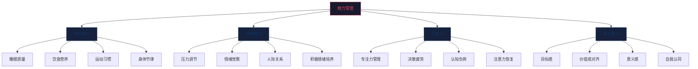

## 4.5 精力管理技巧

上一节讲了时间管理——如何把每天 24 小时分配到最高价值的事情上。但这里有一个残酷的事实：**你可以在日程表上划出 4 小时的深度工作时间块，但如果这 4 小时里你大脑昏沉、情绪低落、注意力涣散，那这个时间块的产出几乎为零。**

时间管理解决的是"把时间花在哪里"的问题，精力管理解决的是"在那些时间里你能产出多少"的问题。一个精力充沛的人 2 小时的产出，可以超过一个精疲力竭的人 8 小时的产出。这就是为什么搞钱高手不只管时间，更管精力。

### 4.5.1 精力的四个维度

精力不是单一概念。Jim Loehr 和 Tony Schwartz 在《精力管理》（The Power of Full Engagement）一书中提出，人的精力由四个维度构成，缺一不可：



**四个维度的关系：**

| 维度 | 作用 | 如果缺失会怎样 | 类比 |
|------|------|---------------|------|
| 体能精力 | 提供基础能量供应 | 做什么都累，注意力无法集中 | 手机电池 |
| 情绪精力 | 保持积极、抗压、社交能力 | 焦虑、易怒、逃避社交 | 系统温度 |
| 心智力 | 维持专注、决策、创造力 | 决策失误、效率低下、产出低质 | CPU 处理能力 |
| 意志精力 | 提供方向感和持久动力 | 迷茫、半途而废、缺乏行动力 | 导航系统 |

**关键洞察：这四个维度是层级递进的。体能是地基，没有好的体能，后面三个维度都会崩塌。** 你见过凌晨三点还困着硬撑的人做出过好决策吗？不可能。搞钱的第一步不是学技巧，而是保证体能充沛。

### 4.5.2 体能精力：搞钱的物理基础

体能是所有精力的根基。体能差的人，每天有效工作时间可能只有 3-4 小时；体能好的人，可以稳定输出 6-8 小时高质量工作。这不是意志力的问题，是生理基础的问题。

#### 睡眠：被搞钱者严重低估的第一生产力

大多数人对睡眠的态度是"能少睡就少睡，多出来的时间可以搞钱"。这是搞钱路上最大的认知陷阱之一。

**睡眠不足的真实代价：**

| 每晚睡眠时间 | 认知能力下降 | 对搞钱的影响 |
|-------------|------------|------------|
| 7-8 小时（充足） | 基准线 | 正常决策、稳定产出 |
| 6 小时（轻度不足） | 约 25% | 反应变慢，创造力下降 |
| 5 小时（明显不足） | 约 40% | 决策质量显著下降，容易犯低级错误 |
| 4 小时（严重不足） | 约 60% | 等同于轻度醉酒状态，不适合做任何重要决策 |

加州大学伯克利分校 Matthew Walker 教授的研究表明：连续一周每晚只睡 6 小时，认知表现等同于连续 24 小时不睡觉。大多数人每天少睡 1-2 小时自以为"已经适应了"，实际上他们只是"适应了低水平表现"——自己感觉不到能力下降，但产出数据不会说谎。

**搞钱者的睡眠优化方案：**

1. **固定就寝时间和起床时间**——即使周末也不超过 1 小时的偏差。生物钟的稳定性比睡眠时长更重要。一个每天固定 23:00-7:00 睡眠的人，比一个工作日 23:00-6:00、周末 2:00-11:00 的人精力好得多，即使后者总睡眠时长更长

2. **睡前 90 分钟启动睡眠准备流程**：
   - 停止接触蓝光（手机、电脑、电视），或使用蓝光过滤眼镜
   - 降低环境温度到 18-20°C（核心体温下降是入睡信号）
   - 避免剧烈运动、重口味食物、酒精和咖啡因
   - 可以做轻度拉伸、阅读纸质书、听低刺激播客

3. **卧室环境优化**：
   - 遮光窗帘：即使微弱的光线也会抑制褪黑素分泌
   - 耳塞或白噪音机：隔绝环境噪音
   - 床只用于睡觉和亲密关系——不在床上工作、刷手机、看视频。让大脑建立"床 = 睡觉"的条件反射

4. **午睡策略**：10-20 分钟的午睡可以恢复约 30% 的认知能力。超过 30 分钟会进入深度睡眠，醒来后反而更困（睡眠惯性）。最佳午睡时间是下午 1:00-2:00，不要超过下午 3:00，否则影响夜间睡眠

#### 运动：性价比最高的精力投资

"没时间运动"是搞钱者最常见的自我欺骗。事实恰恰相反：不运动的人浪费的时间远超运动的时间。

**运动对搞钱能力的直接影响：**

- **有氧运动**（跑步、游泳、快走）：提升大脑供氧量，增加海马体神经元生长，直接提升记忆力和学习能力。哈佛大学 John Ratey 教授在《运动改造大脑》中的研究表明，每周 3 次、每次 30 分钟的有氧运动，可以将认知能力提升 15-25%
- **力量训练**（举重、自重训练）：提升睾酮水平，增强自信心和决策魄力。这对谈判、销售、投资决策等搞钱场景有直接帮助
- **拉伸/瑜伽**：降低皮质醇（压力激素），改善情绪稳定性

**搞钱者的最低有效运动方案：**

不需要每天跑 10 公里。以下是经过验证的"最小有效剂量"：

| 运动类型 | 最低频率 | 最低时长 | 具体建议 |
|---------|---------|---------|---------|
| 有氧运动 | 每周 3 次 | 每次 30 分钟 | 快走、慢跑、游泳、骑行 |
| 力量训练 | 每周 2 次 | 每次 30 分钟 | 深蹲、俯卧撑、硬拉等复合动作 |
| 日常活动 | 每天 | 持续 | 走楼梯、步行通勤、站立办公 |

**关键原则：运动时间不是从搞钱时间里"挤"出来的，而是通过消灭时间黑洞"回收"出来的。** 每天少刷 30 分钟短视频，就足以完成一次高效的运动。这笔账怎么算都是赚的——运动后 2-3 小时内，大脑的认知能力处于峰值状态，这段时间的产出质量远超疲惫状态下的硬撑。

**运动时间的选择：**

| 运动时间 | 优势 | 劣势 | 适合人群 |
|---------|------|------|---------|
| 早晨 6:00-7:30 | 提升全天精力基线，不容易被临时事务挤掉 | 需要早起，冬季执行难度大 | 早起型搞钱者 |
| 中午 12:00-13:00 | 突破午后精力低谷，下午精力更充沛 | 时间紧张，需要洗浴换衣 | 午休时间充裕的上班族 |
| 晚上 18:00-19:30 | 体温最高，运动表现最好 | 容易被加班/社交挤掉，影响入睡 | 晚间搞钱者（21:00后开始深度工作） |

#### 饮食：你的燃料决定你的输出

搞钱者的饮食目标不是减肥，不是增肌，而是**稳定血糖、持续供能、避免精力断崖**。

**血糖波动与精力的关系：**


午餐吃一大碗白米饭 + 红烧肉 + 可乐，下午 2 点准时犯困——这不是"饭气攻心"的正常现象，而是血糖过山车的直接后果。

**搞钱者的饮食优化方案：**

1. **早餐必须吃，且以蛋白质+复合碳水为主**：
   - 好的组合：鸡蛋 + 全麦面包 + 牛油果；燕麦 + 坚果 + 蓝莓
   - 差的组合：油条 + 豆浆；面包 + 果汁；不吃早餐
   
2. **午餐控制碳水比例**：
   - 蛋白质占 40%，蔬菜占 35%，碳水占 25%
   - 用糙米/杂粮替代白米饭，用红薯替代面条
   - 避免含糖饮料，用绿茶或黑咖啡替代

3. **下午加餐策略**：
   - 15:00-16:00 是下午精力低谷，提前准备健康加餐
   - 推荐：一小把坚果、一个苹果、一杯希腊酸奶
   - 避免：饼干、奶茶、巧克力棒（血糖过山车）

4. **咖啡因使用指南**：
   - 最佳饮用时间：9:30-11:30（皮质醇自然下降期）和 13:30-14:00（午后低谷前）
   - 下午 2 点后不再摄入咖啡因（咖啡因半衰期 5-6 小时，下午 3 点喝的咖啡到晚上 11 点还有 50% 在体内）
   - 每日上限：400mg（约 4 杯普通咖啡）
   - 咖啡因午睡法：喝一杯咖啡后立刻午睡 20 分钟，醒来时咖啡因刚好起效——精力恢复叠加咖啡因提神，效果极佳

#### 昼夜节律：顺应生物钟而非对抗它

每个人的身体有自己的"高能量时段"和"低能量时段"，这就是昼夜节律（Circadian Rhythm）。搞钱的高手不是"更努力"的人，而是在对的时段做对的事的人。

**典型昼夜节律与搞钱任务匹配：**

| 时段 | 生理状态 | 最适合做的事 | 最不适合做的事 |
|------|---------|------------|--------------|
| 6:00-8:00 | 皮质醇上升，逐渐清醒 | 晨间仪式、轻度规划 | 重大决策、深度创作 |
| 8:00-10:00 | 认知能力快速上升 | 分析性工作、学习新技能 | 重复性杂事 |
| 10:00-12:00 | 认知能力峰值 | 深度工作、创作、谈判、重要决策 | 刷社交媒体、回消息 |
| 12:00-14:00 | 午后低谷 | 午餐、轻度社交、散步、短午睡 | 深度工作、重要会议 |
| 14:00-16:00 | 精力回升 | 协作性工作、头脑风暴、客户沟通 | 需要高度专注的独处工作 |
| 16:00-18:00 | 第二个精力高峰 | 手眼协调工作、运动、执行性任务 | 创造性工作 |
| 18:00-20:00 | 精力下降 | 晚餐、社交、轻度运动 | 深度学习 |
| 20:00-22:00 | 轻度回升（夜猫子的主高峰） | 阅读、反思、规划、轻度创作 | 重大决策 |
| 22:00-6:00 | 睡眠期 | 睡觉 | 任何搞钱活动 |

**确定你自己的节律类型：**

人不是简单分为"早起型"和"夜猫子型"。根据睡眠医学研究，大致分为四种类型：

| 类型 | 特征 | 高峰时段 | 搞钱策略 |
|------|------|---------|---------|
| 熊型（约 55%的人口） | 跟随日出日落，午后有明显低谷 | 上午 10 点、下午 4 点 | 标准安排，利用上午高峰做深度工作 |
| 狼型（约 15-20%） | 晚睡晚起，夜间创造力强 | 上午 11 点、晚上 8-10 点 | 把核心搞钱时间放在晚上，上午处理杂事 |
| 狮型（约 15-20%） | 早起早睡，上午精力最旺 | 上午 8-10 点 | 利用清晨做最困难的事，下午早点收工 |
| 海豚型（约 10%） | 睡眠浅、易醒，精力波动大 | 上午 10-12 点 | 在精力窗口期集中爆发，其余时间允许自己低强度运转 |

### 4.5.3 心智力：搞钱的认知引擎

体能精力解决的是"有没有能量"的问题，心智力解决的是"能量用在哪里、用得多高效"的问题。

#### 决策疲劳：搞钱者最容易忽视的精力杀手

每一个决策都在消耗你的认知资源——无论这个决策多么微小。Roy Baumeister 的经典实验证明：连续做决策后，人的后续决策质量会显著下降。这就是为什么乔布斯永远穿同样的黑色高领毛衫，扎克伯格永远穿灰色 T 恤——他们把决策配额留给真正重要的事。

**搞钱者的决策疲劳陷阱：**

| 场景 | 无意识的决策消耗 | 优化方案 |
|------|----------------|---------|
| 今天穿什么 | 每天 5-10 分钟的选择纠结 | 建立固定穿搭模板，减少选择 |
| 中午吃什么 | 每天 10-15 分钟的犹豫 | 预设一周午餐计划，或固定 2-3 个食堂/餐厅 |
| 先做哪个任务 | 每天 20-30 分钟的优先级纠结 | 前一晚用 1-3-5 法则确定次日任务（参见 4.4 节） |
| 这个报价合不合适 | 可能消耗数小时的心理博弈 | 建立定价公式/决策清单，减少主观判断 |
| 要不要回复这条消息 | 每次 1-2 分钟，一天几十次 | 批处理消息（参见 4.4 节批处理法） |

**决策节能策略：**

1. **预设规则替代即时决策**：
   - "低于 100 元的消费不比较，直接买性价比最高的"
   - "超过 2000 元的合作邀约，先回复'收到，24小时内给您答复'，不即时决策"
   - "收到非紧急消息，统一在 10:00/15:00/20:00 三个时段回复"

2. **重要决策放在精力巅峰时段**：
   - 投资决策、客户谈判、产品定价等高风险决策，必须安排在上午 10:00-12:00
   - 绝不在下午 3 点以后、深夜、饥饿或疲惫时做重大财务决策

3. **使用决策框架减少认知负荷**：
   - 利弊清单法：列出每个选项的 3 个好处和 3 个坏处
   - 10-10-10 法则：这个决策 10 分钟后、10 个月后、10 年后分别会怎么想？
   - 逆转测试：如果我现在处于相反的立场，我会怎么选？

#### 注意力残留：任务切换的隐形成本

Sophie Leroy 教授的研究发现：当你从任务 A 切换到任务 B 时，你的注意力不会完全跟过来——一部分还"残留"在任务 A 上。这就是"注意力残留"（Attention Residue）。

**搞钱场景中的注意力残留：**

你正在写一份重要的商业计划书（任务 A），这时手机弹出一条微信消息，你看了一眼，回了两句，然后继续写计划书。看起来只花了一分钟，但接下来的 10-15 分钟里，你的大脑有一部分在想那条消息的内容、对方会怎么回复、要不要再说点什么——这就是注意力残留。

如果你一天被打断 20 次，每次损失 15 分钟的专注深度，那一天的有效深度工作时间就从 8 小时变成了不到 3 小时。

**消除注意力残留的方法：**

1. **物理隔离法**：深度工作时把手机放到另一个房间，不是静音，不是翻面，是物理隔离。Ward 等人 2017 年的研究证明，即使手机关机放在桌上，认知能力也会下降——因为大脑在持续消耗资源"抵抗看手机的冲动"

2. **清空大脑法**：在开始深度工作前，花 2 分钟把脑中所有未完成的事写到纸上。GTD 的"大脑清空"原理：大脑擅长处理信息，不擅长存储信息。把待办事项写下来，大脑就不会反复提醒你

3. **仪式化切换法**：建立固定的"进入深度工作"仪式，帮助大脑完成注意力切换：
   - 戴上降噪耳机
   - 打开特定的专注音乐（白噪音、古典乐、Lo-Fi）
   - 在纸上写下接下来 90 分钟的唯一目标
   - 深呼吸 3 次

#### 认知负荷管理：别让大脑同时运行太多程序

认知负荷理论（Cognitive Load Theory）告诉我们，人的工作记忆一次只能处理 4±1 个信息单元。超过这个容量，处理效率就会断崖式下降。

**搞钱者的认知负荷来源：**

- 同时跟进 5 个副业项目
- 脑子里装着 20 个"待回复"的客户
- 同时学习 3 门新技能
- 关注 10 个投资标的

**认知负荷优化方案：**

1. **减少并行项目数量**：同一时期最多聚焦 2 个项目（一个主要、一个次要）。其他项目放入"停车场清单"，等当前项目告一段落后再启动

2. **外部化记忆**：把所有需要记住的事都写下来（用笔记工具、任务管理 App），不要让大脑承担"记忆"的功能，让它专注于"处理"

3. **简化信息输入**：
   - 取消关注 80% 的公众号/博主/新闻源
   - 设定固定的信息获取时段（如每天早 30 分钟、晚 30 分钟）
   - 使用 RSS/信息聚合工具，主动拉取而非被动推送

4. **模板化重复性工作**：
   - 客户沟通模板：常见问题的标准回复
   - 会议纪要模板：固定格式，减少每次组织语言的负荷
   - 报价模板：预设计算公式，输入参数自动出结果

### 4.5.4 情绪精力：搞钱的稳定器

情绪是精力的放大器或消耗器。积极情绪（兴奋、好奇、成就感）可以放大精力产出，消极情绪（焦虑、愤怒、恐惧）会快速消耗精力储备。

#### 情绪对搞钱决策的直接影响

| 情绪状态 | 对搞钱的影响 | 典型表现 |
|---------|------------|---------|
| 焦虑 | 导致保守决策，错过机会 | 看到好项目不敢投，该涨价不敢涨 |
| 愤怒 | 导致冲动决策，增加风险 | 因客户一句话怒而丢单，因股市波动恐慌抛售 |
| 过度兴奋 | 导致盲目乐观，低估风险 | 赚了一笔就加大杠杆，听了个课就all in新领域 |
| 低落/沮丧 | 导致拖延和自我怀疑 | 副业遇到瓶颈就想放弃，看到别人赚钱就焦虑 |
| 平静/专注 | 最佳搞钱状态 | 冷静分析、理性决策、稳定执行 |

#### 压力管理的实用框架

压力不是敌人——适度的压力（心理学上称为"良性压力"，Eustress）能提升表现。问题在于压力过度和压力失控。

**压力的倒 U 曲线（Yerkes-Dodson Law）：**


**搞钱者的压力调节工具箱：**

1. **即时压力缓解（5分钟以内见效）**：
   - 4-7-8 呼吸法：吸气 4 秒 → 屏住 7 秒 → 呼气 8 秒。重复 3-4 次。这个方法通过激活副交感神经系统，快速降低皮质醇水平
   - 冷水洗脸/冲手腕：冷水刺激迷走神经，触发"潜水反射"，心率快速下降
   - 5-4-3-2-1 感官锚定法：说出你看到的 5 样东西、听到的 4 种声音、触碰到的 3 种质感、闻到的 2 种气味、尝到的 1 种味道。这个方法将注意力从焦虑源拉回当下

2. **日常压力预防（建立抗压基线）**：
   - 每天 10-15 分钟冥想或正念练习。Headspace、Calm、小睡眠等 App 可以引导入门。不需要做到"清空思绪"，只需要做到"注意到思绪飘走并拉回来"——这本身就是对注意力肌肉的训练
   - 每周至少一次"完全断联"时间：2-4 小时不看手机、不想工作。去散步、爬山、做手工、和朋友面对面聊天
   - 写情绪日记：每晚花 5 分钟记录今天的情绪高峰和低谷，以及触发原因。坚持 2 周，你会发现自己的情绪模式，提前做好应对准备

3. **压力转化为动力的认知重构**：
   - "这个客户很难搞" → "搞定这个客户，我的谈判能力会上一个台阶"
   - "副业还没赚到钱" → "我现在积累的每一小时经验都在为未来定价"
   - "市场行情不好" → "行情好的时候大家都在赚钱，行情不好才是拉开差距的机会"

#### 人际关系与情绪精力

搞钱不是孤军奋战。人际关系既是情绪精力的来源，也是情绪精力的消耗口。

**搞钱者的人际精力管理：**

| 关系类型 | 对精力的影响 | 管理策略 |
|---------|------------|---------|
| 支持型关系（导师、伙伴、理解你的家人） | 充电 | 主动维护，定期深度交流，表达感谢 |
| 交易型关系（客户、合作伙伴） | 中性（但消耗社交能量） | 设定边界，批量处理，明确期望 |
| 消耗型关系（负能量的人、不断索取的人） | 放电 | 减少接触频率，学会拒绝，必要时断联 |
| 竞争型关系（同行、竞争对手） | 可充可耗 | 保持适度距离，转化为学习动力而非焦虑来源 |

**搞钱者的社交边界设定：**

- 不参加"没有明确价值"的饭局（每次应酬前问自己：这次社交 3 个月后会带来什么具体回报？）
- 不在深夜回复工作消息（除非是真正的紧急事项）
- 不为"维护关系"而强迫自己社交——质量远比数量重要
- 建立"社交预算"：每周的社交时间和精力是有上限的，分配给最高价值的关系

### 4.5.5 意志精力：搞钱的持久燃料

意志精力是最稀缺的精力形式——它决定了你能坚持多久、能在多大困难面前不放弃。

#### 意志力的真相：它不是性格，而是肌肉

Baumeister 的"自我损耗"理论（Ego Depletion）表明：意志力是一种有限资源，和肌肉一样会疲劳。每使用一次意志力（抵抗诱惑、强迫自己做事、控制情绪），你的意志力储备就会减少一些。

**搞钱场景中的意志力消耗：**

- 坚持每天早起搞副业（抵抗睡懒觉的诱惑）
- 看到同龄人晒高消费而自己坚持储蓄（抵抗攀比心理）
- 连续 3 个月副业没收入还继续投入（抵抗放弃的冲动）
- 面对复杂的财务报表坚持学习而不是逃避（抵抗畏难情绪）

#### 意志力的保护与增强策略

既然意志力是有限资源，策略就是：**减少不必要的消耗 + 在最佳状态下使用 + 通过训练逐步增强**。

1. **减少意志力消耗——习惯化**：
   - 任何行为一旦变成习惯，就不再消耗意志力。刷牙不消耗意志力，但"决定今天要不要刷牙"消耗意志力
   - 把搞钱的关键行为变成自动化的习惯（详见 4.2 习惯养成技巧）：每天固定时间学习投资知识、每周固定时间复盘收支、每月固定时间调整资产配置
   - 环境设计是最好的意志力替代品：不买零食回家，就不用抵抗吃零食的诱惑；把手机锁进抽屉，就不用抵抗刷手机的冲动

2. **在意志力巅峰时使用——优先级配置**：
   - 早上意志力最充沛（经过一夜恢复），适合做最需要自律的搞钱任务
   - 晚上意志力最低（一天消耗殆尽），适合做不需要自律的放松活动
   - 如果你正在戒掉某个高消费习惯（如每天一杯 30 元的奶茶），把省钱行动安排在早上执行（如带自己泡的茶），而不是靠晚上"控制消费冲动"

3. **通过训练增强意志力——渐进式挑战**：
   - 每天做一件"让自己微微不舒服"的事：冷水洗脸、提前一站下车走路、用非惯用手吃饭
   - 坚持 30 天的"小挑战"可以显著提升整体意志力水平
   - 运动本身就是最好的意志力训练——每次坚持跑完最后一公里，都是在强化"面对困难不退缩"的神经通路

#### 目标感与意义：意志力的终极燃料

所有的精力管理技巧，最终都服务于一个更深层的问题：**你为什么要搞钱？**

如果搞钱只是"因为别人都在搞钱"，你的意志力很快就会耗尽。但如果搞钱是为了"给家人更好的生活"、"实现财务自由后去做真正热爱的事"、"证明自己的能力"——这些深层动机才是意志力的终极燃料。

**找到你的搞钱意义：**

花 30 分钟做这个练习，把它写下来：

```markdown
## 我的搞钱意义地图

### 1. 短期目标（1年内）
搞钱是为了：____________
具体数字：____________
达到后我会：____________

### 2. 中期目标（3-5年）
搞钱是为了：____________
具体状态：____________
生活会变成：____________

### 3. 终极愿景（10年+）
我理想中的生活是：____________
搞钱在其中的角色是：____________
当财务自由后，我最想做的事是：____________

### 4. 这件事为什么重要？
写给未来的自己：
当我想放弃的时候，请记住____________
```

把这份意义地图打印出来，贴在你每天都能看到的地方。当搞钱路上遇到困难、想要放弃的时候，重新读一遍。

### 4.5.6 精力管理系统：从理论到日常

以上讲了四个精力维度的原理和方法。但知道不等于做到。你需要一个系统把这些方法嵌入日常生活。

#### 超日节律（Ultradian Rhythm）工作法

人体有一个 90-120 分钟的超日节律周期——在这段时间内，大脑会经历从高度专注到疲劳的自然波动。顺应这个节律，比硬撑 4 小时效率高得多。

**90-90-90 工作节奏：**

| 阶段 | 时长 | 做什么 |
|------|------|--------|
| 深度工作 | 90 分钟 | 专注搞钱核心任务，关闭所有干扰 |
| 主动恢复 | 15-20 分钟 | 站起来走动、喝水、远眺、做轻度拉伸。不刷手机——这会让注意力残留 |
| 下一个周期 | 重复 | 根据精力状态决定是继续深度工作还是切换到浅层任务 |

一天最多进行 3-4 个这样的周期（4.5-6 小时深度工作），这已经超过了大多数人的有效工作时长。剩下的时间用于浅层任务、社交、行政事务。

**注意事项：**
- 第一个周期精力最充沛，留给最难的搞钱任务
- 第二个周期精力仍然不错，可以做第二重要的事
- 第三个周期精力开始下降，适合做中等难度的事
- 第四个周期适合批处理低难度的杂事

#### 每日精力管理模板

```markdown
## 日期：____年__月__日

### 晨间精力启动（起床后30分钟）
- [ ] 固定起床时间：__:__
- [ ] 喝一杯温水（补充夜间水分流失）
- [ ] 5分钟轻度运动（拉伸/散步）
- [ ] 5分钟正念/冥想
- [ ] 回顾今日搞钱目标（只看不做）
- [ ] 晨间阳光暴露 10 分钟（调节褪黑素和皮质醇节律）

### 上午深度工作周期（__：__ - __：__）
- [ ] 周期 1（90分钟）：______________  产出/完成情况：____
- [ ] 主动恢复（15分钟）：______________
- [ ] 周期 2（90分钟）：______________  产出/完成情况：____

### 午间恢复
- [ ] 午餐：蛋白质+蔬菜为主，控制碳水
- [ ] 20分钟午睡 或 10分钟散步
- [ ] 不刷手机

### 下午工作周期（__：__ - __：__）
- [ ] 周期 3：______________  产出/完成情况：____
- [ ] 周期 4（如精力允许）：______________

### 运动（__分钟）
- [ ] 类型：______________
- [ ] 强度：轻/中/高

### 晚间恢复与准备
- [ ] 19:00 后不再摄入咖啡因
- [ ] 21:00 后减少蓝光暴露
- [ ] 10分钟复盘：今天精力最高点和最低点分别在什么时候？
- [ ] 确定明天的"青蛙"任务
- [ ] 固定就寝时间：__:__

### 今日精力评分（1-10分）
- 体能精力：__/10
- 情绪精力：__/10
- 心智力：__/10
- 意志精力：__/10
- 综合评分：__/10
```

**持续记录 2 周后做趋势分析：**
- 你每周哪几天精力最好？把最重要的搞钱任务安排在那些天
- 你每天什么时段精力最高？把深度工作安排在那个时段
- 什么事最容易消耗你的精力？找到根源并消除或优化
- 什么事最能恢复你的精力？把这些恢复活动当作"非谈判事项"固定到日程中

#### 精力恢复的主动策略

搞钱不是永动机。持续输出而不恢复，最终一定会崩溃。精力管理不是"榨干每一滴精力"，而是"高效输出 + 高效恢复"的循环。

**日常恢复策略：**

| 恢复方式 | 所需时间 | 恢复效果 | 适用场景 |
|---------|---------|---------|---------|
| 深呼吸/冥想 | 5-10 分钟 | 中等 | 两个工作周期之间 |
| 午睡 | 10-20 分钟 | 高 | 午后低谷期 |
| 户外散步 | 15-30 分钟 | 高 | 思维卡壳时、情绪低落时 |
| 运动 | 30-60 分钟 | 极高 | 每天固定时段 |
| 社交（正面的） | 30-60 分钟 | 高 | 晚间或周末 |
| 完全断联 | 2-4 小时 | 极高 | 每周至少一次 |
| 充分睡眠一晚 | 7-9 小时 | 根本性恢复 | 每天 |

**每周恢复策略：**

- 保留至少一个完整的半天作为"充电时间"——不安排任何搞钱任务，做纯粹让自己开心的事
- 每月至少一次"精力审计"：回顾过去一个月的精力评分记录，找出模式和问题
- 每季度安排一次 2-3 天的短途旅行或彻底休息，让精力系统完全重置

### 4.5.7 搞钱者的精力管理常见误区

#### 误区一："我年轻，精力不是问题"

20 多岁确实比 40 多岁有更多体能储备，但心智力和意志力并不因年轻而无限。年轻搞钱者最常见的崩溃模式是：连续高强度工作 3-6 个月 → 突然情绪崩溃/身体出问题 → 被迫停工 1-2 个月 → 恢复后又开始新一轮高强度循环。这种"脉冲式"工作模式的总产出，远低于"持续稳定输出+规律恢复"的模式。

#### 误区二："喝咖啡就能撑住"

咖啡因是"精力借贷"，不是"精力创造"。它只是暂时阻断了大脑接收"疲劳"信号的能力，让你感觉不到累，但身体的疲劳并没有消失。靠咖啡因硬撑的代价是：更大的精力债务、更差的睡眠质量、更强的咖啡因依赖。正确的做法是用咖啡因优化已经不错的精力，而不是用咖啡因掩盖精力不足。

#### 误区三："忙就是有精力"

很多人把"忙碌感"等同于"精力充沛"。实际上，忙碌但低效恰恰是精力管理失败的典型表现。真正精力充沛的状态是：清晰知道自己要做什么，能快速进入专注状态，产出质量高，完成后还有余力。如果你忙了一天但感觉什么重要的事都没做完，那不是时间管理问题，是精力分配问题。

#### 误区四："意志力靠硬撑"

"坚持就是胜利"这句话害了无数搞钱者。意志力不是靠"硬撑"无限供应的。真正可持续的搞钱策略是：把关键行为习惯化（减少意志力消耗）+ 环境设计（让正确的事更容易做、错误的事更难做）+ 在精力巅峰期做最重要的事。硬撑的结果是迟早崩溃，而且崩溃往往发生在你最需要意志力的关键时刻。

#### 误区五："没时间搞精力管理"

"我忙得连睡觉时间都不够，哪有时间冥想、运动？"——这恰恰是最需要精力管理的信号。如果你每天的有效搞钱时间不到 3 小时（因为精力不足导致大量时间在低效运转），那花 1 小时运动+冥想来提升剩余 7 小时的产出质量，这笔账怎么算都是赚的。精力管理不是从搞钱时间里"挤"出来的，它是搞钱效率的"倍增器"。

### 4.5.8 实战案例：精力管理带来的搞钱效率跃迁

#### 案例一：程序员小李的精力优化

**背景**：小李是一名前端程序员，白天上班，晚上做独立开发副业。之前每天下班后从 20:00 工作到凌晨 1:00，但实际有效编码时间不到 2 小时，其余时间都在刷手机、发呆、反复切换任务。周末更是整天昏昏沉沉。

**问题诊断**：
- 睡眠不足（每天 5-6 小时），导致白天上班效率低，晚上副业效率更低
- 没有运动，久坐导致腰痛和持续疲劳感
- 晚饭吃外卖高油高盐，餐后血糖飙升直接犯困
- 副业时间没有结构化，想到什么做什么

**优化方案**：
1. 固定 23:30-7:00 睡眠，确保 7.5 小时
2. 晚饭改为轻食（沙拉+鸡胸肉），避免血糖过山车
3. 19:00-19:30 跑步 30 分钟（替代之前的"休息一下刷会手机"）
4. 副业时间块化：20:00-21:30 深度编码，21:30-21:45 休息，21:45-23:00 深度编码，23:00-23:30 复盘+规划明天
5. 手机放在客厅充电，工作区只放电脑

**结果**（3个月后）：
- 每晚有效编码时间从不到 2 小时提升到 2.5-3 小时
- 副业项目推进速度提升约 60%
- 上班效率也明显提升，不再频繁加班
- 腰痛消失，精神状态明显改善

#### 案例二：自由职业者阿华的精力重建

**背景**：阿华做自媒体+电商，时间完全自由，但反而比上班时效率更低。每天睡到自然醒（通常 10-11 点），醒来后刷手机到中午，下午在"焦虑但没动力"的状态中度过，晚上才开始工作，但通常做不了多久就累了。

**问题诊断**：
- 没有固定的作息时间，昼夜节律完全紊乱
- 起床后立即刷手机，第一口"信息燃料"就是低质量内容
- 没有区分"工作模式"和"休息模式"，在家工作环境太舒适
- 体能差，心肺功能弱，稍微需要集中注意力就感到疲劳

**优化方案**：
1. 固定 8:00 起床，用智能灯模拟日出
2. 起床后 1 小时内不碰手机，执行"晨间启动程序"
3. 建立专门的工作区域（一张书桌，只用于工作），工作时换上"上班装"
4. 每天 8:30-9:00 出门快走 30 分钟
5. 上午 9:30-12:00 为深度工作时间，处理最重要的搞钱任务
6. 使用 Forest App 屏蔽手机娱乐 App

**结果**（2个月后）：
- 日均有效工作时间从 2-3 小时提升到 5-6 小时
- 自媒体更新频率从每周 1 篇提升到每周 3 篇
- 电商运营效率提升，客户响应时间从平均 8 小时缩短到 2 小时
- 月收入增长约 40%

### 4.5.9 本节小结

精力管理的本质是**用科学方法管理你的身体和大脑，让有限的精力产生最大的搞钱价值**。

四个核心原则：

1. **体能是地基**：睡够、吃对、动起来。这三件事做不好，后面所有的精力管理技巧都是空中楼阁
2. **顺势而为**：顺应你的生物节律，在精力巅峰做最重要的事，在精力低谷做恢复和杂事
3. **保护认知资源**：减少决策疲劳、消除注意力残留、管理认知负荷，把有限的心智力留给搞钱核心任务
4. **可持续才是真的**：搞钱是马拉松，不是短跑。建立"输出-恢复"的循环节奏，才能走得远、赚得多

记住：**你管理精力的方式，决定了你赚钱的效率。** 时间对每个人是公平的，但精力不是。一个精力管理高手用 4 小时的深度工作，可以超过一个精力管理失败者 12 小时的低效忙碌。搞钱，从管好你的精力开始。
