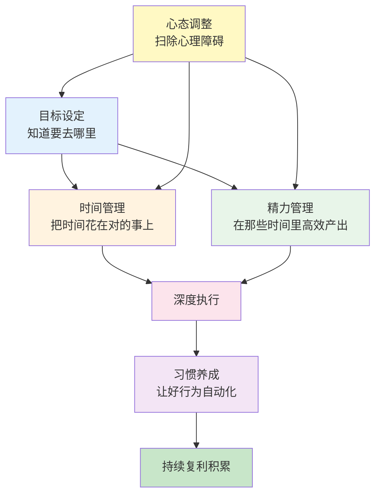
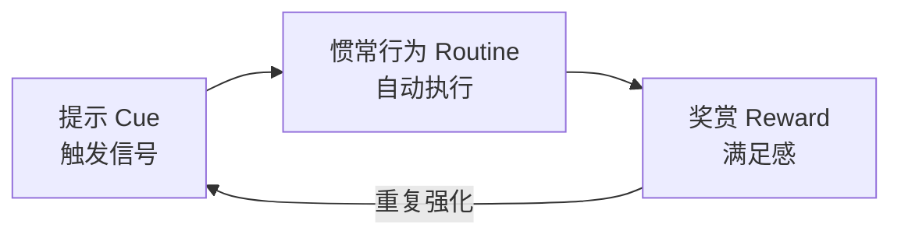
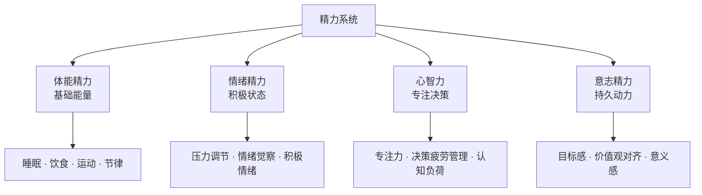
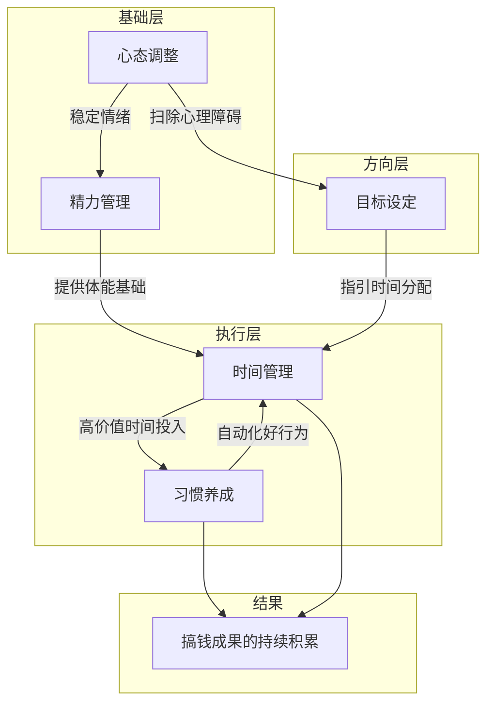

## 本节小结：核心技巧全景回顾与整合

本节从五个维度系统构建了搞钱的底层操作系统——目标设定、习惯养成、心态调整、时间管理、精力管理。这五个维度不是孤立的技巧清单，而是一套环环相扣的自驱系统。本小结将提炼每一块的核心要点，揭示它们之间的协同关系，并给出一张可直接执行的整合行动清单。



---

### 一、五大核心技巧速览

#### 1. 目标设定：搞钱的导航系统

目标设定不是写一句"我要赚100万"就完事。Locke和Latham长达35年的研究证明，明确且有挑战性的目标比"尽力而为"平均提升绩效25%以上，但前提是方法正确。

**三个核心机制**：

| 机制 | 原理 | 效果 |
|------|------|------|
| 注意力聚焦 | 网状激活系统（RAS）自动筛选与目标相关的信息 | 发现以前忽略的机会 |
| 能量动员 | 明确目标让大脑知道该调动多少资源 | 减少无效消耗 |
| 持久性增强 | 目标提供"为什么"的底层动力 | 遇到困难坚持时间延长3.2倍 |

**关键方法：SMART目标法**

- **S（具体）**：用"五个W"锁定目标——What做什么、Why为什么、Who谁来做、Where在哪做、Which用什么方式
- **M（可衡量）**：建立三类指标——结果指标（月收入）、过程指标（每周产出量）、效率指标（单位时间收入）
- **A（可实现）**：跳一跳够得着，不要定"3个月赚1000万"这种自我打击的目标
- **R（相关性）**：每个小目标都指向大愿景，不做与搞钱主线无关的"勤奋假动作"
- **T（有时限）**：没有截止日期的目标只是愿望

**目标分解的层级结构**：3年愿景 → 年度目标 → 季度里程碑 → 月度OKR → 周计划 → 每日行动。每一层都是上一层的可执行拆解。

> **核心教训**：目标不是用来"实现"的，而是用来"指引方向"的。达成80%也远好于没有目标时的100%。

---

#### 2. 习惯养成：把意志力外包给自动化

人类43%的日常行为是习惯驱动的自动反应，而非有意识的决策。搞钱真正拉开差距的不是某次灵光乍现，而是日复一日的财务好习惯。

**习惯回路三阶段**：



**六种核心养成策略**：

| 策略 | 原理 | 搞钱场景示例 |
|------|------|------------|
| 习惯叠加 | 把新行为挂在已有习惯之后 | 打开电脑→查看昨日收支 |
| 环境设计 | 降低好习惯的摩擦力，提高坏习惯的摩擦力 | 把记账App放在手机首页第一屏 |
| 身份认同 | 从"我在记账"到"我是一个精明的理财者" | 改变自我标签，行为自然跟上 |
| 两分钟规则 | 新习惯起步版不超过2分钟 | 读一页理财书 → 逐渐延长 |
| 诱惑绑定 | 把"想做的"和"该做的"配对 | 只在跑步时听喜欢的理财播客 |
| 习惯追踪 | 可视化记录连续打卡天数 | 日历上画X，不断链 |

**关键数据**：习惯自动化平均需要66天（Lally研究），而非广为流传的21天。简单习惯可能21天固化，复杂习惯可能需要254天。不要因为"21天了还没习惯"就放弃。

> **核心教训**：习惯的目标不是"坚持"，而是"让坚持变得不必要"——当行为自动化之后，执行它就像刷牙一样自然。

---

#### 3. 心态调整：扫除搞钱路上的心理障碍

心态不是玄学，而是可以训练的心理技能。搞钱路上有四大心理障碍，每一种都有对应的认知行为疗法（CBT）技法。

**四大障碍与应对**：

| 障碍 | 识别信号 | 根源 | 核心技法 |
|------|---------|------|---------|
| 金钱羞耻感 | 不好意思报价、谈钱时压低声音 | 文化/家庭/社交三层植入的限制性信念 | 认知重构：提取自动化思维→质疑→替换 |
| 失败恐惧 | 总想"等准备好了再开始" | 损失厌恶（损失的痛苦是收益快乐的2倍） | 概率思维+最小试错（控制单次损失在可承受范围） |
| 比较心理 | 看到别人赚钱就焦虑 | 社交媒体的"幸存者偏差"展示 | 纵向对比（和昨天的自己比）+ 信息筛选 |
| 即时满足 | 明知该存钱却忍不住消费 | 大脑的"双曲贴现"机制 | 承诺机制（自动转账定投）+ 环境重塑 |

**认知重构四步法**：

1. **提取**：记录自动化思维（"要多了他会觉得我贪心"）
2. **质疑**：用五个问题审视——证据检验、替代解释、最坏情况、概率评估、成本收益
3. **替换**：构建更准确的认知（"专业服务合理定价是尊重双方的时间"）
4. **验证**：在真实场景中测试新信念，记录结果

> **核心教训**：搞钱路上最大的敌人不是市场、不是竞争对手，而是你脑子里那些未经审视的金钱信念。改变信念，行为自然改变。

---

#### 4. 时间管理：把24小时花在刀刃上

时间是搞钱过程中唯一真正稀缺的资源。同样8小时，懂时间管理的人产出可以是普通人的三倍——不靠加班，靠方法。

**先算清你的时间单价**：

```text
时间单价 = 月收入 ÷ 月工作小时数
```

当你的时间单价是85元/小时，花2小时为了省30块钱比价，你就亏了140元。搞钱的第一步，是停止用高价值时间做低价值的事。

**搞钱时间四分类**：

| 类型 | 价值 | 举例 | 策略 |
|------|------|------|------|
| 高价值创造 | 最高 | 谈客户、写方案、做投资决策 | 优先保护，安排在精力峰值时段 |
| 高价值学习 | 高（延迟兑现） | 学技能、研究趋势、复盘 | 固定每日学习时间块 |
| 维护性工作 | 中 | 回邮件、处理报销、整理 | 批量处理，压缩到固定时段 |
| 低价值消耗 | 接近零 | 刷短视频、无效会议 | 识别并消除 |

**核心方法**：
- **时间块管理**：把一天划分为若干专注块，每块只做一类事
- **要事第一**：每天先做最重要的1-3件事（MIT，Most Important Tasks）
- **批量处理**：同类任务合并处理（统一时间回邮件、统一时间打电话）
- **帕金森定律反制**：给任务设定比自然需要更短的截止时间，压缩低效填充

> **核心教训**：时间管理的本质不是"做更多事"，而是"做更少但更重要的事"。高效搞钱者一天可能只做3件事，但每件都是高价值创造。

---

#### 5. 精力管理：在对的时间里高效产出

时间管理解决"把时间花在哪里"，精力管理解决"在那些时间里你能产出多少"。精力充沛的人2小时产出，可以超过精疲力竭的人8小时。

**精力四维度**：



**四维度层级关系**：体能是地基，情绪是温度，心智是CPU，意志是导航。没有好的体能，后面三个维度都会崩塌。

**关键要点**：
- **睡眠是第一生产力**：每晚7-8小时不是浪费时间，是投资。睡眠不足6小时，认知能力下降约30%，决策失误率翻倍
- **运动是精力充电器**：每周3-4次、每次30分钟中等强度运动，能提升20%的精力水平
- **遵循超日节律**：人的精力以90-120分钟为一个周期波动，每个周期后需要15-20分钟恢复
- **情绪是精力的放大器或消耗器**：愤怒、焦虑可以在10分钟内耗尽你半天的精力储备

> **核心教训**：搞钱的第一步不是学技巧，而是保证体能充沛。你见过凌晨三点硬撑的人做出过好决策吗？管理精力，时间管理才有意义。

---

### 二、五大技巧的协同关系

这五个维度不是并列的，而是有明确的依赖和放大关系：



**依赖关系解读**：

| 关系 | 说明 |
|------|------|
| 心态 → 目标 | 有金钱羞耻感的人根本不敢设搞钱目标 |
| 心态 → 精力 | 焦虑和比较心理持续消耗情绪精力 |
| 精力 → 时间 | 精力低谷期做高价值工作等于浪费时间 |
| 目标 → 时间 | 没有目标，时间分配就没有依据 |
| 时间 → 习惯 | 固定时间块重复执行才能形成习惯 |
| 习惯 → 时间 | 习惯自动化后释放出更多意志力用于新挑战 |

**一句话总结**：心态决定你敢不敢搞，精力决定你能不能搞，目标决定你往哪搞，时间决定你何时搞，习惯决定你持续搞。

---

### 三、整合行动清单

把五大技巧转化为一份可直接执行的"搞钱操作系统"启动清单：

#### 第一周：基础搭建

| 天 | 行动 | 对应技巧 |
|----|------|---------|
| Day 1 | 计算自己的时间单价，写下3年搞钱愿景 | 目标设定 + 时间管理 |
| Day 2 | 用SMART法把愿景拆解为年度目标和季度里程碑 | 目标设定 |
| Day 3 | 做一次"金钱思维日志"——记录3个让你谈钱不舒服的场景和自动化思维 | 心态调整 |
| Day 4 | 审视自己的睡眠、运动、饮食，找出最薄弱的一项制定改善计划 | 精力管理 |
| Day 5 | 把一天划分为时间块，标记高价值创造时间和学习时间 | 时间管理 |
| Day 6 | 选择1个搞钱好习惯，用习惯叠加法绑定到已有行为上 | 习惯养成 |
| Day 7 | 周复盘：哪些做了？哪些没做？没做的原因是什么？ | 全部 |

#### 第二周到第四周：固化循环

每天重复的核心节奏：

1. **晨间（10分钟）**：确认今日MIT（最重要的1-3件事）→ 目标设定
2. **上午精力峰值**：深度工作时间块（2-4小时）→ 精力管理 + 时间管理
3. **午间（5分钟）**：快速复盘上午产出，调整下午计划 → 时间管理
4. **下午**：维护性工作批量处理 → 时间管理
5. **晚间（10分钟）**：财务日志 + 习惯打卡 + 明日MIT → 习惯养成 + 目标设定
6. **睡前**：金钱思维日志（如有不适场景）→ 心态调整

#### 第二个月起：优化迭代

| 频率 | 复盘内容 | 优化方向 |
|------|---------|---------|
| 每周 | 本周高价值时间占比、习惯连续打卡天数 | 调整时间块分配 |
| 每月 | 月收入变化、新技能习得、心态障碍克服进展 | 调整目标和策略 |
| 每季 | 季度里程碑达成率、精力四维度自评 | 调整大方向和生活习惯 |

---

### 四、常见整合误区

搞钱实践中，最容易犯的错误不是"某个技巧没做好"，而是"把五个维度割裂对待"。

| 误区 | 表现 | 纠正 |
|------|------|------|
| 只管目标不管精力 | 设了宏大目标但每天精疲力竭无法执行 | 先把体能精力调好，再谈目标 |
| 只管时间不管心态 | 日程排得很满但内心充满金钱羞耻感 | 先做认知重构，再分配时间 |
| 只管习惯不管目标 | 养成了记账习惯但不知道记账是为了什么 | 每个习惯都要挂在目标上 |
| 只管精力不管习惯 | 睡眠运动都很好但没有搞钱的日常习惯 | 精力是燃料，习惯才是引擎 |
| 五个都管但不复盘 | 每天忙忙碌碌但从不回头看效果 | 没有复盘就没有优化，没有优化就没有进步 |

---

### 五、从"知道"到"做到"的关键跨越

读完这五个技巧，你可能觉得"道理都懂"。但懂和做到之间隔着一道鸿沟，跨过这道鸿沟只需要三个动作：

1. **今天就开始第一步**：不是明天、不是下周一，就是今天。哪怕只花5分钟写下你的SMART目标，也比"等准备好了再开始"强一万倍。拖延是搞钱最大的敌人，而行动是对抗拖延的唯一武器。

2. **从最小可行动作开始**：不要试图一次性把五个维度全部优化到位。选一个最薄弱的环节，从一个两分钟就能完成的小动作开始。想养成记账习惯？今天只记一笔。想改善睡眠？今天只提前15分钟上床。

3. **找到你的问责机制**：一个人坚持很难，找一个同样在搞钱路上的伙伴互相监督，或者公开承诺（比如在朋友圈宣布你的季度目标），让社会压力成为你的执行力外挂。

> **本节终极洞察**：搞钱不是某个单一技能的比拼，而是一套操作系统的升级。目标是导航，习惯是自动驾驶，心态是防抱死系统，时间是油门分配，精力是发动机功率。五者缺一不可，协同运转才能跑得又快又远。
