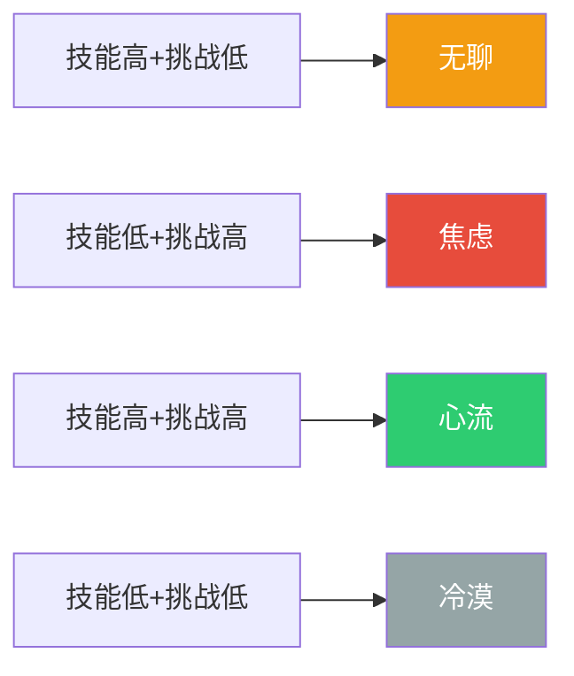
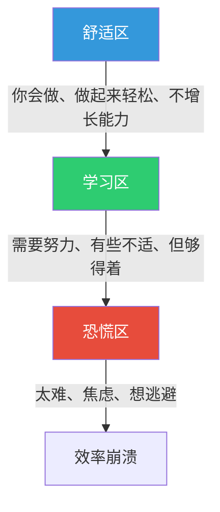
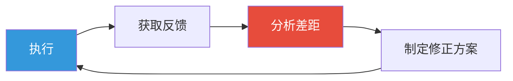
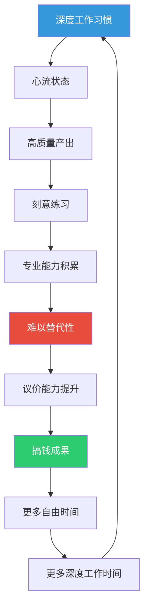

## 六、搞钱中的深度工作与心流状态

上一节讲了精力管理——如何保证你在工作时段拥有充沛的能量。但精力充沛只是前提，**把精力投入到什么类型的工作中，才是决定搞钱产出质量的关键变量。**

一个残酷的现实：大多数人每天工作 8 小时，但真正产生高价值产出的深度工作时间不足 2 小时。剩下的 6 小时被会议、消息回复、社交媒体、无意义的"忙碌感"吞噬。这不是时间管理的问题，而是**工作模式**的问题。

本节要解决的核心问题是：**如何进入并维持深度工作状态，在有限时间内产出最大的搞钱价值？**

---

### 6.1 深度工作的价值：为什么它是搞钱的核心能力

#### 6.1.1 什么是深度工作

"深度工作"（Deep Work）这个概念由 Georgetown 大学计算机科学教授 Cal Newport 在其同名著作中系统阐述。他的定义是：

> **在无干扰的状态下进行的专业活动，这些活动能把你的认知能力推向极限。这种努力创造新价值，提升你的技能，而且难以复制。**

与之对应的是"浅层工作"（Shallow Work）——不需要太多认知投入的、通常在受到干扰时完成的任务，这类工作往往不创造太多新价值，而且容易被复制。

在搞钱场景中，两者的区别更加鲜明：

| 维度 | 深度工作 | 浅层工作 |
|------|---------|---------|
| **认知负荷** | 高——需要全神贯注 | 低——可以边聊天边做 |
| **产出价值** | 高——创造难以替代的成果 | 低——产出容易被替代 |
| **典型搞钱场景** | 写商业计划书、开发核心产品功能、深度研究投资标的、设计营销策略 | 回复邮件、整理文件、参加无明确议程的会议、刷行业新闻 |
| **可替代性** | 低——需要多年积累的专业能力 | 高——任何人培训一周就能做 |
| **收入杠杆** | 极高——一份深度工作成果可以反复变现 | 低——做完就没了，不产生复利 |
| **议价能力** | 强——客户为你的深度能力付费 | 弱——因为容易替代，所以没有溢价 |

Cal Newport 的核心论点是：**在新经济中，两种人会获得巨大回报——能够快速掌握复杂事物的"超级明星"，以及拥有资本可以把产出推向市场的人。如果你不是后者，那么深度工作就是你成为前者的唯一路径。**

#### 6.1.2 深度工作对搞钱的四大价值

**价值一：产出质量形成竞争壁垒**

深度工作的产出质量远高于浅层工作。写一篇深度行业分析报告，如果在不断被打断的状态下完成，质量可能只有专注状态下的 40%。而搞钱的本质是用高质量产出换取高回报——质量就是你的护城河。

一个程序员在深度状态下 4 小时写出的核心模块，可能比浅层状态下一整天写的代码更简洁、更健壮、更优雅。前者能支撑一个产品运转数年，后者可能三天两头出 bug。

**价值二：进入心流状态，实现"工作即奖励"**

深度工作是进入心流状态的前提条件。心流状态下，工作效率提升 2-5 倍是常见现象（详见 6.3 节）。更重要的是，心流体验本身就是一种内在奖励——你会享受工作过程，而不只是盯着结果。这种内在动机是长期坚持搞钱的最强动力。

**价值三：加速专业能力积累，形成"知识复利"**

深度工作迫使你的大脑在"学习区"运转，不断突破认知边界。每一次深度工作都是对神经通路的强化——你在物理层面变得更强。这种积累是复利式的：第一年你可能只是入门级，第三年你就是行业专家，第五年你的认知深度已经让后来者望尘莫及。

**价值四：在 AI 时代建立不可替代性**

2024 年以后，大量浅层工作正在被 AI 替代。写模板化文案、做基础数据分析、整理文档——这些 AI 都能做。但**深度的创造性工作、复杂的策略判断、跨领域的知识整合**——这些恰恰是 AI 最难替代的，也是深度工作的核心产出。拥抱深度工作，就是在为自己的搞钱能力购买"抗 AI 保险"。

#### 6.1.3 浅层工作的陷阱：为什么"看起来很忙"是搞钱的大敌

很多人误以为"忙碌 = 高产出"。事实上，浅层忙碌是搞钱效率最大的敌人。

**"忙碌陷阱"的四个特征：**

1. **假性忙碌**：一天下来觉得自己很忙很累，但仔细盘点发现没有产出任何有实质价值的成果。回了 50 条消息、参加了 3 个会议、刷了 2 小时行业资讯——每件事都"有用"，但没有一件事能直接推动搞钱进度。

2. **多任务幻觉**：以为自己在"多线并行"处理多个搞钱项目，实际上大脑在快速切换任务，每次切换都产生注意力残留（参见上一节 4.5.3），导致每个任务的完成质量都下降。

3. **紧急感依赖**：用"紧急"替代"重要"。回消息很紧急，但学习一项新技能很重要；处理客户投诉很紧急，但优化产品核心功能很重要。长期被紧急事务驱动的人，永远在救火，没有时间搞建设。

4. **可见性偏好**：倾向于做"别人看得见"的工作（发朋友圈、打卡、汇报进度），而非"别人看不见但真正有价值"的工作（深度思考、系统设计、底层能力建设）。搞钱的结果由价值决定，不由可见性决定。

**诊断：你是否陷入了浅层工作陷阱？**

回答以下问题，回答"是"越多，说明浅层工作占比越高：

- 你是否经常觉得一天很忙但没有实质产出？
- 你是否无法连续 90 分钟不看手机？
- 你是否经常同时打开 5 个以上浏览器标签页？
- 你的工作日是否被会议和消息回复切割成碎片？
- 你上一次进入"完全沉浸"的工作状态是什么时候？如果想不起来，说明你已经很久没有深度工作了。

---

### 6.2 建立深度工作习惯：从"偶尔专注"到"系统化深度工作"

深度工作不是靠"今天状态好所以很专注"的随机事件，而是一套可以系统化培养的习惯。Cal Newport 在《深度工作》中总结了四种深度工作哲学，每一种适合不同的搞钱场景。

#### 6.2.1 四种深度工作哲学

| 哲学 | 核心理念 | 适合的搞钱场景 | 代表人物 |
|------|---------|--------------|---------|
| **修道院模式** | 几乎所有工作时间都用于深度工作，彻底消除浅层任务 | 全职创作者、独立开发者、学术研究者 | 作家尼尔·斯蒂芬森（不设公开邮箱、不参加任何会议） |
| **双模式** | 将时间分为"深度期"和"浅层期"，深度期内完全专注 | 有季节性项目的搞钱者，如课程开发者在制作期、自由撰稿人在截稿期 | 卡尔·荣格（在塔楼中闭关写作，回到城市后正常社交） |
| **节奏模式** | 将深度工作变成日常固定节奏，如每天固定 3-4 小时 | 大多数搞钱者——上班族的副业时间、创业者的日常产出 | 作家村上春树（每天固定 4-5 小时写作，雷打不动） |
| **记者模式** | 利用任何空闲时间快速进入深度状态 | 日程不固定的搞钱者，如销售、自由职业者、多项目并行者 | 沃尔特·艾萨克森（在任何碎片时间都能进入写作状态） |

**对大多数搞钱者来说，"节奏模式"是最实用的选择。** 将深度工作固定为每天的"仪式"，就像刷牙一样自然——不需要每次都要消耗意志力去"决定"今天要不要深度工作。

#### 6.2.2 时间安排：把深度工作变成非谈判事项

**原则一：每天至少保留 2-4 小时的深度工作时间**

这不是建议，而是搞钱者的底线。Cal Newport 的研究表明，即使是训练有素的深度工作者，每天也只能维持 4-5 小时的真正深度工作。对于刚入门的人，从每天 1-2 小时开始是合理的。

**原则二：将深度工作安排在精力最充沛的时段**

结合上一节的昼夜节律知识：

| 节律类型 | 最佳深度工作时段 | 原因 |
|---------|---------------|------|
| 熊型（55%的人） | 上午 9:00-12:00 | 认知能力处于自然峰值 |
| 狼型（15-20%） | 晚上 20:00-23:00 | 夜间创造力最强 |
| 狮型（15-20%） | 清晨 6:00-9:00 | 意志力和注意力最充沛 |
| 海豚型（10%） | 上午 10:00-12:00 | 抓住精力窗口期集中爆发 |

**原则三：用时间块管理法固定深度工作时间**

不是"有空就深度工作"，而是"把深度工作时间块像会议一样写进日程表，不可移动、不可取消"。

```text
【示例：上班族的搞钱深度工作日程】

06:30-07:00  晨间启动（运动、早餐、冥想）
07:00-08:30  ★ 深度工作时段 1（副业核心任务）
08:30-09:00  通勤
09:00-12:00  本职工作（处理需要协作的事务）
12:00-13:00  午餐 + 短午睡
13:00-18:00  本职工作
18:00-19:00  通勤 + 晚餐
19:00-20:30  ★ 深度工作时段 2（副业核心任务）
20:30-21:00  复盘 + 规划明天
21:00-23:00  放松 + 准备睡觉
```

这个日程中，两个深度工作时段（共 3 小时）是"非谈判事项"——除非天塌下来，否则不动摇。

#### 6.2.3 环境设计：打造"一坐下就想工作"的空间

环境对行为的影响远超意志力。你需要设计一个物理空间，让大脑自动切换到"深度工作模式"。

**专用深度工作空间的五个要素：**

1. **物理隔离**：一个专门用于深度工作的空间。如果有独立书房最好；如果没有，至少用一张专用的桌子，桌上只放深度工作需要的东西。不要在这张桌子上吃饭、刷手机、看视频——让大脑建立"这张桌子 = 深度工作"的条件反射。

2. **消除视觉干扰**：桌面只保留当前任务需要的物品。视觉杂乱会增加认知负荷——即使你没有主动注意，大脑也在消耗资源处理视觉信息。

3. **声学控制**：
   - 首选：降噪耳机 + 白噪音/自然声/Lo-Fi 音乐
   - 次选：耳塞
   - 最低要求：安静的环境
   - 避免：有人说话的环境（人声是最难忽略的干扰——大脑有专门处理人声的神经回路）

4. **温度适宜**：研究表明，认知表现最佳的环境温度是 20-22°C。太热让人昏沉，太冷让人分心。

5. **光线充足**：自然光最佳，白炽灯次之。昏暗的环境会增加困意和注意力涣散。

**"进入状态"的启动仪式（深度工作仪式感）：**

仪式的作用是给大脑一个明确的信号："现在要切换到深度工作模式了。" 仪式不需要复杂，但需要固定。以下是一个经过验证的 5 分钟启动仪式：

```markdown
## 我的深度工作启动仪式（每次花5分钟）

1. 【准备】关闭手机通知，手机翻面朝下或放到另一个房间
2. 【清理】桌面只保留当前任务需要的物品，清理无关标签页
3. 【环境】戴上降噪耳机，打开固定的专注音乐
4. 【目标】在纸上写下接下来 90 分钟的唯一目标（只写一个）
5. 【启动】深呼吸 3 次，然后开始
```

**关键细节**：仪式中的每一个步骤都在削弱干扰、强化专注。"关闭通知"消除外部打断，"清理桌面"消除视觉干扰，"固定音乐"建立条件反射（大脑听到这个音乐就知道"该工作了"），"写目标"明确当前唯一任务。

#### 6.2.4 深度工作的四个实操框架

**框架一：90-90-90 节奏法**

这是精力管理中超日节律的直接应用：

| 阶段 | 时长 | 做什么 | 不做什么 |
|------|------|--------|---------|
| 深度工作 | 90 分钟 | 专注搞钱核心任务，关闭所有干扰 | 不看手机、不回消息、不切换任务 |
| 主动恢复 | 15-20 分钟 | 起立走动、喝水、远眺、轻度拉伸 | 不刷手机（否则产生注意力残留） |
| 评估决策 | 2 分钟 | 评估精力状态，决定下一轮做什么 | 不纠结——如果精力好就继续深度工作，精力差就切换到浅层任务 |

一天进行 3-4 个周期，总深度工作时间 4.5-6 小时，已经远超平均水平。

**框架二：时间块主题法**

将一周的深度工作时间分配给不同的搞钱主题：

| 日期 | 深度工作主题 | 具体任务示例 |
|------|------------|------------|
| 周一 | 核心技能提升 | 学习投资分析方法、练编程、学营销 |
| 周二 | 产品/服务打磨 | 优化产品功能、改进服务流程、写核心内容 |
| 周三 | 客户/市场研究 | 深度分析客户需求、研究竞品、挖掘新机会 |
| 周四 | 系统/流程建设 | 搭建自动化工具、优化工作流、建立模板 |
| 周五 | 复盘与规划 | 本周成果复盘、下周深度工作计划、长期战略思考 |

**框架三：截止日期压力法**

适度的截止日期能激活"良性压力"（Yerkes-Dodson 定律），帮助你更快进入深度状态。给自己的深度工作设定"假截止日期"：

- "我必须在 90 分钟内完成这份商业计划书的初稿"
- "今天下午 3 点前，这个功能必须能跑通"
- "这周日之前，我要完成对这个行业的深度分析报告"

注意：截止日期要"有挑战但可达成"。太松没有紧迫感，太紧导致焦虑和质量下降。

**框架四：产出记录法**

记录每一次深度工作的具体产出，建立"深度工作→高价值产出"的正向反馈：

```markdown
## 深度工作记录（示例）

### 2024-03-15
- 时段：07:00-08:30（90分钟）
- 任务：撰写产品营销文案
- 产出：完成核心卖点提炼 + 3 版标题方案
- 产出价值评估：★★★★★（直接用于投放，预估带来 2000+ 元收入）
- 干扰次数：0
- 进入心流：是（第 20 分钟左右进入）

### 2024-03-15
- 时段：19:00-20:30（90分钟）
- 任务：分析本月副业数据
- 产出：发现 3 个关键增长点，制定了下周优化策略
- 产出价值评估：★★★★（可能在下个月带来 5000+ 元增量）
- 干扰次数：2（手机震动）
- 进入心流：否（数据分析比较碎片化）
```

坚持记录 2 周后，你会清楚地看到：**深度工作的产出价值是浅层工作的 5-10 倍。** 这个数据会让你从内心认同深度工作的价值，而不是靠意志力强迫自己。

#### 6.2.5 深度工作的常见障碍与应对

| 障碍 | 本质原因 | 解决方案 |
|------|---------|---------|
| **坐不住** | 注意力肌肉太弱，需要循序渐进 | 从 25 分钟开始（一个番茄钟），每周增加 5 分钟，直到能稳定 90 分钟 |
| **总想看手机** | 多巴胺回路被社交媒体劫持 | 物理隔离手机（放到另一个房间），使用 Forest 等专注 App |
| **不知道做什么** | 没有明确的深度工作任务定义 | 前一晚写好明天深度工作时段的唯一任务，精确到"做什么、做到什么程度、用什么方法" |
| **被打断** | 环境没有做好隔离 | 和身边的人明确约定深度工作时间段，门上挂"请勿打扰"标识 |
| **一开始就想完美** | 完美主义导致启动困难 | 允许自己写出"垃圾初稿"——先完成再完美。写作可以先写最烂的版本，编程可以先写能跑通的代码 |
| **感觉产出没用** | 没有建立产出到价值的反馈回路 | 使用产出记录法，追踪深度工作成果的实际价值 |

---

### 6.3 心流状态的触发条件：如何让搞钱变成一种享受

#### 6.3.1 心流的科学基础

"心流"（Flow）概念由心理学家 Mihaly Csikszentmihalyi（米哈里·契克森米哈赖）在 1990 年的著作《心流：最优体验心理学》中系统提出。他通过对数千名艺术家、运动员、科学家、商业领袖的深度访谈，发现了一种共同的最优体验模式——当人们全身心投入一项活动时，会进入一种"时间感消失、自我意识消失、完全沉浸"的状态。

**心流状态下的生理变化：**

| 指标 | 心流状态 | 普通工作状态 |
|------|---------|------------|
| 前额叶皮层活动 | 降低（"暂时性失忆"——不再自我评判） | 正常（持续自我监控） |
| 多巴胺、去甲肾上腺素、内啡肽 | 同时释放（产生愉悦感和高度专注） | 正常分泌 |
| 脑电波 | 从β波（清醒焦虑）转向θ波（深度放松中的创造性状态） | 持续β波 |
| 时间感知 | 主观时间缩短（"感觉才过了 30 分钟"实际上已经 2 小时） | 正常 |
| 工作记忆 | 扩大（能同时处理更多信息单元） | 4±1 个单元 |

神经科学家 Steven Kotler（《超人的崛起》作者）的研究表明，心流状态下的生产力可以提升 200-500%。这不是玄学——多巴胺、去甲肾上腺素和内啡肽的协同释放，同时提升了专注力、模式识别能力和愉悦感，形成了一个正向循环。

#### 6.3.2 触发心流的四个核心条件

Csikszentmihalyi 的研究发现，心流不是随机出现的，它需要满足四个条件。缺少任何一个，都很难进入心流。

**条件一：明确的目标**

心流需要你知道"现在在做什么"以及"做到什么程度算完成"。模糊的目标（"今天要搞钱"）不会触发心流，清晰的目标（"在 90 分钟内完成产品定价方案的第一版，包含竞品价格对比和定价逻辑"）才能触发。

**搞钱场景中的目标明确化：**

| 模糊目标（无法触发心流） | 明确目标（可以触发心流） |
|----------------------|----------------------|
| 今天学习投资 | 今天阅读《聪明的投资者》第 7 章，用自己的话总结 3 个核心投资原则 |
| 优化副业 | 分析本月副业的 5 个核心数据指标，找到流失率最高的环节并提出 2 个改进方案 |
| 写一篇文章 | 完成 2000 字的文章初稿，包含开头钩子、3 个核心论点、每个论点至少 1 个案例支撑 |

**条件二：即时反馈**

心流需要你在行动的同时知道"做得对不对"。编程时代码能跑通就是即时反馈，写作时段落逻辑通顺就是即时反馈，投资分析时假设被数据验证就是即时反馈。

**搞钱场景中创造即时反馈的方法：**

1. **把大任务拆成小里程碑**：不是"写一本书"，而是"今天写完第三章第二节的初稿"——每完成一个小节就有明确的"完成感"。
2. **使用检查清单**：每完成一个步骤就打勾——视觉上的进度推进本身就是反馈。
3. **实时测试**：写代码就边写边跑，写文案就边写边读出声，做设计就边做边看效果。
4. **量化指标**：设定可量化的产出指标——"这 90 分钟我要写出 1500 字"，字数增长就是即时反馈。

**条件三：挑战与技能的平衡**

这是心流触发条件中最关键的一个。Csikszentmihalyi 发现：



- **太简单**（技能远超挑战）→ 无聊：做重复性数据录入不会进入心流，因为没有认知挑战。
- **太难**（挑战远超技能）→ 焦虑：让一个投资新手直接做量化交易策略，会因困难太大而放弃。
- **刚好平衡**（挑战略高于当前技能 4-10%）→ 心流：这是甜蜜区——你觉得自己"够得着"，但需要全力以赴。

**搞钱场景中的挑战-技能平衡调整：**

| 情况 | 症状 | 调整方法 |
|------|------|---------|
| 任务太简单 | 无聊、走神、想刷手机 | 提高标准（如从"写文章"到"写一篇能让行业大V转发的文章"）、增加难度维度、缩短截止时间 |
| 任务太难 | 焦虑、拖延、想放弃 | 拆解子任务、降低当前阶段的要求（先完成再完美）、找教程/导师、先做一个最简单的版本 |
| 刚好在甜蜜区 | 时间飞逝、不想停下来、享受过程 | 不要打断——这是搞钱效率最高的状态 |

**条件四：专注的环境**

这一点在 6.2 节已经详细讨论过。核心原则：**在心流触发前，消除一切可能打断你的因素。** 研究表明，一旦被打断，平均需要 23 分钟才能恢复到之前的专注深度（UC Irvine 研究）。而心流被打断后，可能需要 15-30 分钟才能重新进入。

#### 6.3.3 心流的特征：如何判断自己是否进入了心流

心流不是"感觉很努力"，它有明确的可辨识特征：

| 特征 | 具体表现 | 如何区分"假心流" |
|------|---------|----------------|
| **时间感消失** | 感觉才过了 30 分钟，实际已经 2 小时 | 假心流：虽然也很投入，但能清楚感知时间流逝 |
| **自我意识消失** | 不再想"我做得好不好""别人会怎么看"，只关注任务本身 | 假心流：还在间歇性自我评判 |
| **行动与意识融合** | 不需要"思考→决定→执行"的过程，行动自动发生 | 假心流：每个步骤都需要有意识地推动 |
| **内在动机驱动** | 不是为了外部奖励（钱、表扬）而工作，而是任务本身带来的满足感 | 假心流：主要靠"做完就能拿到钱"驱动 |
| **控制感增强** | 感觉自己能掌控任务进展，对挑战充满信心 | 假心流：虽然投入但感觉"勉强跟上" |
| **体验本身就是奖励** | 完成后感到满足和愉悦，而不是"终于熬完了" | 假心流：完成后感觉被掏空 |

#### 6.3.4 搞钱场景中的心流触发策略

**策略一：任务分级——把搞钱任务按心流潜力分类**

不是所有搞钱任务都能触发心流。根据心流的四个条件，对你的搞钱任务进行分级：

| 心流潜力 | 任务特征 | 搞钱场景示例 | 建议处理方式 |
|---------|---------|------------|------------|
| 高 | 目标明确、有即时反馈、挑战适度、可深度专注 | 创作核心内容、开发产品功能、深度研究投资标的、设计营销策略 | 安排在精力最佳时段，保护 90 分钟不被打断 |
| 中 | 目标较明确但反馈较慢、或有一定干扰 | 客户深度沟通、复盘分析、学习新技能的练习环节 | 尽量创造心流条件，但接受不一定每次都能进入 |
| 低 | 任务碎片化、反馈延迟、或太简单 | 回消息、整理文件、报销、行政事务 | 批量处理，不追求心流，快速完成 |

**策略二：进入心流的"倒计时仪式"**

给自己设定一个 10 分钟的"进入缓冲期"——开始深度工作后的前 10 分钟，不要期望立刻进入心流。大脑需要时间切换模式。

```text
【进入心流的时间线】

0-5 分钟：启动期。开始做任务，即使感觉不想做、注意力涣散——这是正常的。
5-10 分钟：过渡期。注意力开始集中，但仍需要有意识地把思绪拉回来。
10-20 分钟：聚焦期。注意力逐渐锁定，干扰的吸引力减弱。
20-30 分钟：心流入口。如果任务满足心流条件，你会开始感到时间加速。
30 分钟+：心流区。时间感消失，效率飙升，享受工作。
```

**策略三：用"适度压力"触发心流**

Yerkes-Dodson 定律告诉我们，适度的压力能提升表现。在搞钱场景中：

- **设定有挑战的截止时间**："这 90 分钟我要完成初稿"——不是"今天内完成"
- **增加少量外部约束**：告诉合作伙伴"明天给你"——社交承诺增加适度压力
- **提高对自己的标准**："不只是写完，要写到我自己都佩服的水平"

但要警惕压力过度：如果感到焦虑、心跳加速、想逃避，说明压力太大了，需要降低难度或拆解任务。

**策略四：积累心流触发经验**

心流是可以"训练"的。每一次成功进入心流，都在强化大脑的"深度专注"神经通路。坚持规律的深度工作 2-4 周后，你会发现自己进入心流的速度越来越快、时间越来越长。

记录每次心流体验：

```markdown
## 心流日志

### 日期：____
- 任务：____________
- 进入心流所需时间：约 __ 分钟
- 心流持续时间：约 __ 分钟
- 触发因素：（什么帮助你进入？）
- 中断因素：（什么打断了心流？）
- 产出评估：比非心流状态效率高约 __ 倍
- 改进：下次如何更快进入/更持久？
```

---

### 6.4 搞钱中的刻意练习：深度工作的进阶形态

#### 6.4.1 刻意练习与普通练习的本质区别

心理学家 Anders Ericsson（安德斯·艾利克森）通过对各领域顶尖专家（小提琴手、国际象棋大师、外科医生、运动员）长达 30 年的研究，提出了"刻意练习"（Deliberate Practice）理论。他的核心发现是：

> **决定一个人专业水平的不是经验年限，而是刻意练习的小时数。** 一个有 20 年经验的医生，如果只是在重复同样的操作，他的水平可能和一个有 5 年经验但坚持刻意练习的医生差不多。

普通练习与刻意练习的区别：

| 维度 | 普通练习 | 刻意练习 |
|------|---------|---------|
| **目标** | 模糊——"练习投资" | 明确——"今天专门练习判断企业护城河" |
| **舒适度** | 舒适——做已经会的事 | 不适——挑战略高于当前能力的事 |
| **注意力** | 可以分心 | 需要全神贯注 |
| **反馈** | 延迟或模糊 | 即时且具体——知道哪里做对了、哪里做错了 |
| **重复** | 无目的的重复 | 有目的的针对性重复，每次都在修正上一次的不足 |
| **提升** | 很快到达瓶颈 | 持续突破瓶颈 |

**在搞钱中的本质意义：** 刻意练习是深度工作的最高形式。它不只是"专注地工作"，而是"专注地在学习区工作"——每一次都在拉伸你的能力边界。这就是为什么有些人工作 10 年还是原地踏步，而有些人 3 年就能成为行业顶尖。

#### 6.4.2 刻意练习的五个核心原则

**原则一：走出舒适区——在"学习区"工作**

人的能力分三个区域：



- **舒适区**：做你已经会的事。在搞钱中表现为：一直用同一种方法卖货、只投自己熟悉的标的、从不尝试新的搞钱方式。
- **学习区**：挑战略高于当前能力。在搞钱中表现为：学习一种新的营销方法、分析一个陌生行业的投资机会、尝试将副业收入提升 20%。
- **恐慌区**：难度远超能力。在搞钱中表现为：贷款 All in 一个完全不懂的项目、毫无经验就和大型企业谈判。

**关键：只在学习区练习。** 一直在舒适区，能力不增长；直接跳到恐慌区，崩溃放弃。

**原则二：专注和投入——质量重于时长**

Ericsson 发现，顶尖小提琴手的刻意练习时间每天不超过 4 小时——他们不是"练得多"，而是"每一分钟都在全力投入"。

在搞钱场景中：
- 1 小时全神贯注地分析 3 家公司的财务报表，比 4 小时边刷手机边扫 20 家公司的数据有效得多。
- 30 分钟专注地优化一段核心代码，比 3 小时边聊天边修 bug 更有产出。

**原则三：明确的目标——每次练习只解决一个问题**

| 刻意练习的错误做法 | 正确做法 |
|------------------|---------|
| "今天练习写文案" | "今天练习写高转化率的标题——只练标题，写 20 个，对比分析最好的 3 个" |
| "今天学习投资" | "今天学习如何看懂现金流量表——做 5 道练习题，每道题限时 10 分钟" |
| "今天优化副业" | "今天专门分析用户流失原因——读 30 条差评，分类归纳，找出 Top 3 问题" |

**原则四：即时反馈——知道对错才能修正**

反馈是刻意练习的燃料。没有反馈的练习，就像蒙着眼睛投篮——你不知道自己偏了多远。

**搞钱场景中的反馈来源：**

| 反馈来源 | 适用场景 | 如何获取 |
|---------|---------|---------|
| 数据 | 营销、投资、产品优化 | 关注转化率、ROI、用户留存率等量化指标 |
| 导师/前辈 | 任何领域 | 找到比你厉害的人，定期请教，请他们指出你的盲点 |
| 用户/客户 | 产品、服务、销售 | 直接问用户"你觉得哪里可以改进"，或者观察用户行为数据 |
| 同行评审 | 内容创作、代码开发 | 让同行审阅你的产出，接受建设性批评 |
| 自我对比 | 任何场景 | 保存每次练习的产出，定期对比——你是否比上个月做得更好？ |

**原则五：重复和修正——形成改进循环**

刻意练习不是"做一次就完了"，而是"做→反馈→修正→再做"的循环。每一次循环，都在缩小"当前水平"和"目标水平"之间的差距。



#### 6.4.3 刻意练习在四大搞钱场景中的应用

**场景一：投资——建立"决策复盘"系统**

投资是最典型的"反馈延迟"场景——一个决策的好坏可能几个月甚至几年后才能验证。因此，刻意练习的重点是**记录决策过程而非结果**。

```markdown
## 投资决策刻意练习模板

### 交易/投资记录
- 日期：____
- 标的：____________
- 决策类型：买入/卖出/持有
- 决策理由（写清楚，至少 3 个理由）：
  1. ____________
  2. ____________
  3. ____________
- 当时的情绪状态：冷静/兴奋/焦虑/恐惧（1-10分）
- 预期结果：____________
- 可能出错的地方：____________

### 季度复盘（每 3 个月做一次）
- 本季度做了多少个投资决策？
- 决策质量评分（过程质量，不是结果）：____/10
- 最好的决策是什么？为什么好？可复制吗？
- 最差的决策是什么？差在哪里？如何避免？
- 识别到的决策偏差：____________（如：过度自信、损失厌恶、锚定效应等）
- 下季度刻意练习重点：____________
```

**场景二：创业——"快速迭代"式刻意练习**

创业的本质是快速试错。每一次产品迭代、每一次客户沟通、每一次营销活动，都是一次刻意练习的机会。

- **产品迭代**：不要追求完美版本，而是"最小可行产品→用户反馈→快速改进"的循环。每次迭代只解决一个核心问题。
- **客户沟通**：录音（征得同意）每次重要销售对话，事后回听——找到自己表达不清楚的地方、错过的成交信号、处理异议的不足。
- **营销优化**：每次营销活动后做 A/B 测试分析——哪种标题更吸引人？哪种定价更有吸引力？哪种渠道转化率更高？

**场景三：技能提升——"专项突破"法**

当你想提升某项搞钱技能（写作、编程、设计、谈判）时，不要"什么都学一点"，而是"一次只突破一个技能瓶颈"。

步骤：
1. **诊断瓶颈**：找到当前技能水平的最大短板。比如写作的瓶颈可能是"开头不够吸引人"而不是"词汇量不够"。
2. **专项训练**：花 1-2 周只练习这一个环节。写 20 个不同风格的开头，分析哪个效果最好。
3. **应用验证**：把专项训练的成果应用到实际搞钱场景中，检验效果。
4. **进入下一个瓶颈**：突破一个瓶颈后，找到新的瓶颈，重复循环。

**场景四：销售——"对话分析"法**

销售能力的提升依赖于对每一次销售对话的深度复盘：

| 复盘维度 | 问自己什么 | 如何改进 |
|---------|-----------|---------|
| 开场 | 客户是否在 30 秒内产生兴趣？ | 准备 5 个开场白模板，每次用不同的，对比效果 |
| 需求挖掘 | 是否问对了问题？是否真正听懂了客户的痛点？ | 列出"必问清单"，每次对话后检查是否问到了 |
| 异议处理 | 客户的反对意见我处理得好吗？有没有更好的回应方式？ | 建立"异议库"，为每种常见异议准备 2-3 种回应 |
| 成交推动 | 是否在最佳时机提出了成交？ | 记录"成交信号"——客户说什么/做什么时最容易成交 |
| 跟进 | 跟进频率和内容是否合适？ | 建立跟进模板和节奏表 |

---

### 6.5 深度工作的常见误区

**误区一："我必须先有完美的环境才能深度工作"**

真相：完美的环境不存在。在等完美环境的过程中，你浪费的是可以深度工作的时间。一个安静的角落、一副耳机、一个手机放远一点的决定——这些就够了。深度工作是技能，不是条件反射。

**误区二："深度工作 = 长时间不休息"**

真相：人的注意力生理极限是 90-120 分钟。超过这个时间强行硬撑，效率断崖式下降。深度工作强调的是"质量"而非"时长"。2 小时真正的深度工作，价值远超 6 小时的"假装专注"。

**误区三："心流是一种天赋，有些人天生就能进入"**

真相：心流是一种可训练的状态。Mihaly Csikszentmihalyi 的研究表明，通过规律的练习和环境设计，每个人都能提高进入心流的频率和速度。前几次可能需要 30 分钟才能进入，坚持练习 2-4 周后，很多人能在 5-10 分钟内进入。

**误区四："搞钱需要多线并行才能更快"**

真相：多任务并行是深度工作的天敌。每次任务切换都会产生注意力残留，降低每个任务的完成质量。正确的做法是"时间块串行"——在一个时间块内只做一件事，做完再切换到下一件事。

**误区五："有些搞钱任务就是不可能深度工作"**

真相：大多数搞钱任务都可以被重新设计为适合深度工作的形式。回消息太碎片？批处理——每天 3 个固定时段集中回复。开会太多？要求会议有明确议程和时间限制，砍掉不必要的会议。行政杂事太多？用自动化工具处理，或者外包。

**误区六："我现在还太弱，等我能力强了再深度工作"**

真相：深度工作本身就是提升能力的最有效方法。你不是等到能力强了才深度工作，而是通过深度工作来变强。从每天 25 分钟开始，循序渐进。

---

### 6.6 深度工作的工具与技术栈

#### 6.6.1 专注力辅助工具

| 工具类型 | 推荐工具 | 作用 | 价格 |
|---------|---------|------|------|
| 降噪耳机 | Sony WH-1000XM5 / AirPods Pro / Bose QC45 | 物理隔绝环境噪音 | 1000-3000 元 |
| 白噪音 App | Noisli / myNoise / 小睡眠 | 提供稳定的背景声，掩盖突发噪音 | 免费/订阅制 |
| 专注计时 App | Forest（种树）/ Tide（潮汐）/ Focus To-Do | 番茄钟计时 + 视觉化专注时间 | 免费/订阅制 |
| 网站屏蔽工具 | Cold Turkey / Freedom / StayFocusd | 屏蔽指定网站/应用，防止无意识浏览 | 免费/付费 |
| 手机物理锁 | Kitchen Safe 定时锁盒 | 物理锁定手机，无法提前打开 | 200-400 元 |

#### 6.6.2 深度工作管理系统

| 工具 | 用途 | 搞钱场景 |
|------|------|---------|
| Notion / Obsidian | 深度工作记录、产出追踪 | 记录每次深度工作的任务、产出、心流状态 |
| Trello / 看板 | 深度工作任务管理 | 将搞钱项目拆解为可深度工作的子任务 |
| 日历（Google Calendar） | 时间块规划 | 将深度工作时段像会议一样写进日程 |
| RescueTime / Toggl Track | 时间使用分析 | 追踪每天有多少时间用于深度工作 vs 浅层工作 |

#### 6.6.3 刻意练习工具

| 搞钱场景 | 工具/方法 | 具体用途 |
|---------|---------|---------|
| 投资 | 交易日志 Excel/Notion 模板 | 记录每笔交易的决策过程、情绪状态、事后复盘 |
| 创业 | 用户反馈收集（Typeform/问卷星） | 系统化收集用户反馈，量化改进方向 |
| 内容创作 | Grammarly / Hemingway Editor | 即时反馈写作质量，指出冗长、被动语态、复杂句 |
| 编程 | LeetCode / Codewars | 专项算法练习 + 即时反馈 |
| 销售 | 录音复盘 + Gong.io | 录音回放销售对话，AI 分析关键节点 |

---

### 6.7 从深度工作到搞钱成果：完整路径

深度工作不是目的，搞钱才是。以下是深度工作转化为搞钱成果的完整路径：



这是一个**正向飞轮**。深度工作产出高质量成果，高质量成果带来更强的专业能力和市场竞争力，更强的能力带来更多搞钱回报，更多的回报给你更多自由时间用于深度工作——飞轮越转越快。

**这个飞轮的启动门槛极低**：每天 1 小时深度工作，坚持 30 天。不需要天赋，不需要资源，只需要一个安静的角落、一副耳机，和"每天保护这 1 小时不被任何人任何事打扰"的决心。

---

### 6.8 实战模板：深度工作周计划

```markdown
## 本周深度工作计划（____月____日 - ____月____日）

### 本周深度工作目标
1. 主要目标：____________
2. 次要目标：____________

### 时间规划

| 日期 | 深度工作时段 | 深度工作主题 | 预期产出 | 实际产出 | 心流评分(1-10) |
|------|------------|------------|---------|---------|--------------|
| 周一 | 07:00-08:30 | | | | |
| 周二 | 07:00-08:30 | | | | |
| 周三 | 07:00-08:30 | | | | |
| 周四 | 07:00-08:30 | | | | |
| 周五 | 07:00-08:30 | | | | |
| 周六 | 09:00-11:00 | | | | |
| 周日 | 复盘日 | | | | |

### 周末复盘
- 本周深度工作总时长：____ 小时
- 产出最大价值的一次深度工作是哪次？为什么？
- 心流进入率：本周____次深度工作中，____次进入了心流
- 最大的干扰源是什么？下周如何消除？
- 下周深度工作重点调整：____________
```

---

### 6.9 本节小结

| 核心概念 | 一句话总结 |
|---------|-----------|
| 深度工作 | 在无干扰状态下进行高认知需求的工作，是搞钱者最稀缺、最有价值的工作模式 |
| 心流状态 | 完全沉浸的最优体验状态，生产力提升 200-500%，需要四个条件：明确目标、即时反馈、挑战-技能平衡、专注环境 |
| 刻意练习 | 在学习区专注练习、获得即时反馈、针对性修正，是深度工作的最高形态 |
| 飞轮效应 | 深度工作→高质量产出→专业能力→议价能力→搞钱成果→更多自由时间→更多深度工作 |

**搞钱的本质是用稀缺能力换取高回报。深度工作是打造稀缺能力的最高效方法。从今天开始，保护你每天的第一个 90 分钟，把它投入到最重要的搞钱任务中——30 天后，你会看到明显的变化。**
