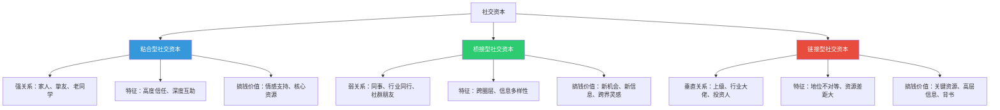
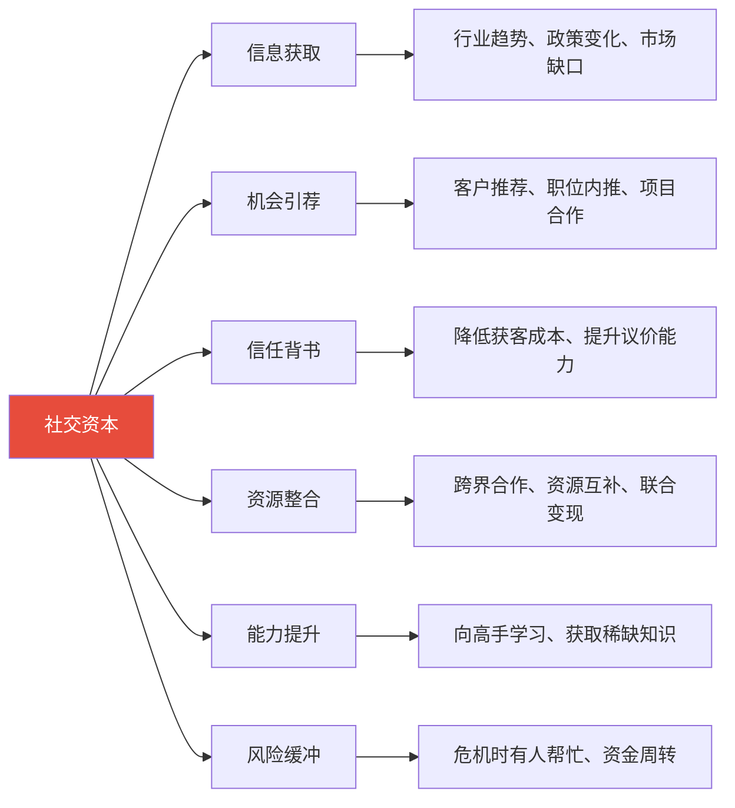
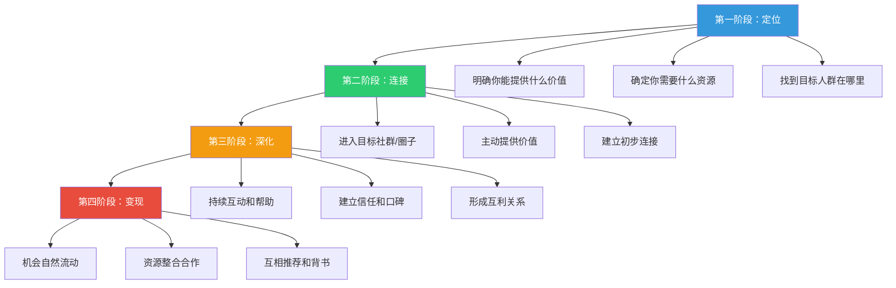

## 七、搞钱中的社交资本建设

前面几节我们讨论了深度工作、心流状态——这些都是"向内求"的能力。但搞钱从来不是一个人的事。你可能听过这样一句话：**"你的收入是你最常接触的五个人的平均值。"** 这句话出自 Jim Rohn，虽然不完全精确，但它揭示了一个被大量研究证实的事实：**社交网络的结构和质量，深刻决定了一个人的搞钱天花板。**

一个残酷的现实是：很多能力相当的人，搞钱的结果天差地别。区别往往不在于谁更努力、谁更聪明，而在于**谁的信息网络更优质、谁的机会管道更通畅、谁能在关键时刻调动更多资源。** 这就是社交资本（Social Capital）的力量。

本节要解决的核心问题是：**什么是社交资本？它如何转化为真金白银？以及如何系统地建设、维护和升级你的社交资本？**

---

### 7.1 社交资本的理论基础：为什么关系能变成钱

#### 7.1.1 什么是社交资本

"社交资本"（Social Capital）最早由社会学家 Pierre Bourdieu 在 1980 年代系统阐述，后来被政治学家 Robert Putnam、社会学家 James Coleman 等学者进一步发展。它的核心定义是：

> **社交资本是嵌入在社会关系网络中的资源总和——包括信任、互惠规范、信息通道和影响力。它不是你"认识谁"，而是你"能调动谁"以及"谁愿意为你调动"。**

Bourdieu 区分了三种资本：

| 资本类型 | 定义 | 搞钱中的体现 |
|---------|------|------------|
| **经济资本** | 直接的金钱和物质资产 | 银行存款、房产、投资组合 |
| **文化资本** | 知识、技能、教育背景、审美品味 | 专业能力、学历证书、行业认知 |
| **社交资本** | 社会关系网络及其带来的资源调动能力 | 人脉关系、行业口碑、圈层归属 |

三种资本可以相互转化：你可以用经济资本购买文化资本（花钱上 MBA），也可以用文化资本积累社交资本（用专业能力赢得行业尊重），更可以用社交资本变现为经济资本（通过人脉获取商业机会）。**搞钱高手的核心能力之一，就是高效地在三种资本之间进行转化。**

#### 7.1.2 社交资本的三种类型

哈佛大学教授 Robert Putnam 在《独自打保龄球》中将社交资本分为三种类型，这对搞钱者理解自己的社交网络结构至关重要：



| 类型 | 关系特征 | 典型对象 | 搞钱价值 | 风险 |
|------|---------|---------|---------|------|
| **粘合型** | 强关系、高信任、深度互动 | 家人、挚友、创业合伙人 | 情感支持、核心资源共享、风险共担 | 信息同质化——"圈子太小"导致视野受限 |
| **桥接型** | 弱关系、跨圈层、信息多样 | 行业同行、社群成员、校友 | 新机会发现、信息多样性、跨界创新 | 信任度低——需要时间建立互信 |
| **链接型** | 垂直关系、地位不对等 | 行业大佬、投资人、政府关系 | 关键资源获取、高层背书、稀缺信息 | 维护成本高——需要持续提供对等价值 |

**搞钱的关键洞察：** 社会学家 Mark Granovetter 在 1973 年的经典论文《弱关系的力量》中发现，**大多数人找到好工作（和好机会）的信息来源，不是亲密的强关系，而是"偶尔联系"的弱关系。** 原因很简单：强关系和你处于同一个社交圈，信息高度重叠；弱关系跨越不同的社交圈，能带来你圈子之外的新信息。

这并不是说强关系不重要——强关系提供信任和深度合作的基础。但如果你的社交网络只有强关系（只有家人和发小），你的搞钱机会就会被限制在一个很小的范围内。**真正强大的搞钱社交网络，是三种类型的均衡组合。**

#### 7.1.3 社交资本的经济学原理

为什么社交资本能转化为金钱？从经济学角度看，有四个核心机制：

**机制一：降低信息不对称**

诺贝尔经济学奖得主 George Akerlof 提出的"信息不对称"理论指出，市场交易中买卖双方信息不平等会导致"柠檬问题"（劣币驱逐良币）。社交资本的核心功能之一就是**降低信息搜索成本和信任建立成本**。

- 你通过朋友推荐找到一个靠谱的供应商，省去了逐个试错的时间和金钱
- 客户通过你的行业口碑信任你，省去了你反复自证能力的营销成本
- 投资人通过共同朋友的背书信任你的项目，省去了漫长的尽调周期

**机制二：创造网络外部性**

经济学家所说的"网络效应"在社交资本中同样适用。Metcalfe 定律指出：网络的价值与节点数量的平方成正比。你的社交网络每增加一个高质量节点，不仅增加了直接连接的价值，还增加了通过这个节点到达其他节点的间接价值。

```text
【社交网络的Metcalfe效应】

你的网络有 5 个节点：直接连接 = 5，间接路径 = 10
你的网络有 10 个节点：直接连接 = 10，间接路径 = 45
你的网络有 20 个节点：直接连接 = 20，间接路径 = 190

网络规模翻倍，价值增长约 4 倍。
```

**机制三：创造信息套利机会**

所谓"信息套利"，就是利用信息差来获利。你的社交网络越多元、越跨界，你能捕捉到的信息差就越大。

一个只认识程序员的程序员，可能永远不知道某个行业急需某种技术解决方案；但一个同时认识程序员和行业从业者的搞钱者，就能发现这个信息差，并将其转化为商业机会——自己做或者推荐给别人收中介费。

**机制四：提供"非市场"资源**

很多搞钱机会不在公开市场上流通。职位空缺在公开发布前往往先在内部推荐中消化，好的投资项目在公开路演前已经在朋友圈子里完成了融资，优质供应商的信息在行业群里流传但不会出现在搜索引擎上。**社交资本让你进入这些"非公开市场"的机会池。**

---

### 7.2 社交资本的搞钱价值：它到底能帮你赚多少钱

#### 7.2.1 社交资本影响搞钱的六大路径



**路径一：信息获取——别人不知道的，你知道**

搞钱的第一要素是信息。社交资本最直接的价值就是拓宽信息渠道。行业政策变动、市场新需求、技术新趋势、竞争对手动态——这些信息往往先在行业圈子里流传，然后才出现在公开报道中。

一个搞钱者如果同时是几个高质量行业社群的成员，又认识几个不同城市的同行，他能比"单打独斗"的人提前 1-3 个月发现市场机会。在搞钱领域，1-3 个月的时间差，可能意味着从蓝海进入红海的整个窗口期。

**路径二：机会引荐——别人拿不到的，你能拿到**

LinkedIn 的数据显示，**70% 的人通过人脉关系找到工作，85% 的关键岗位通过推荐而非公开招聘填补。** 这个数据在搞钱领域同样适用——大量的商业机会、项目合作、客户资源，都是通过人脉引荐获取的。

一个做自由咨询师的人，如果完全靠自己获客，可能每月只能找到 1-2 个客户；但如果有 10 个经常给他推荐客户的人脉，每月可能有 5-8 个客户主动找上门。收入差距可能是 3-5 倍。

**路径三：信任背书——降低交易成本**

搞钱的本质是交换——你用能力/产品/服务换取金钱。而所有交换的前提是信任。社交资本提供的信任背书能大幅降低交易成本：

| 场景 | 没有信任背书 | 有信任背书 | 差距 |
|------|------------|-----------|------|
| 自由职业者获客 | 需要花 2-4 周建立信任，可能要免费试做 | 客户通过朋友推荐来，直接进入合作 | 获客周期缩短 60-80% |
| 创业者找投资人 | BP 投了 100 家没回复 | 通过共同朋友引荐，投资人主动约谈 | 融资效率差距巨大 |
| 卖家获取大客户 | 需要反复证明自己、提供试用、打价格战 | 客户基于行业口碑直接签约 | 客单价可以高出 30-50% |

**路径四：资源整合——1+1>2 的搞钱效应**

社交资本让你能够连接不同的资源方，创造单独一方无法实现的价值。一个做内容的人认识一个做电商的人，可能催生出"内容电商"的搞钱模式；一个技术人才认识一个懂市场的人，可能一起做出一个有商业价值的产品。

这种"资源整合"创造的价值，往往远超各方单独搞钱的总和。你的社交网络就是你的"资源整合平台"。

**路径五：能力提升——向高手学习的捷径**

你的搞钱能力上限，很大程度上取决于你能接触到什么样的搞钱高手。和月入 10 万的人交流，你会学到月入 10 万的思维和方法；和月入 100 万的人交流，你的认知天花板会被拉高一个量级。

这种学习不是看书能替代的——高手的很多经验是隐性知识（Tacit Knowledge），只有在交流、观察、合作中才能传递。社交资本就是获取这些隐性知识的通道。

**路径六：风险缓冲——搞钱路上的安全网**

搞钱必然伴随风险。当你遇到困难时——客户跑单、项目失败、资金紧张——强关系网络就是你的安全网。家人提供情感支持，朋友提供临时资金周转，同行提供替代方案。有研究显示，社交网络更强的人在创业失败后的恢复速度更快，因为他们能更快地获取资源、信息和新机会。

#### 7.2.2 社交资本的"复利效应"

社交资本有一个和金融资本相似的特性：**复利增长。** 社交网络不是线性增长的，而是指数级增长的——你认识的每个人背后都有一个你尚未触及的社交网络。

```text
【社交资本的复利模型】

第 1 年：你有 50 个有效联系人
    - 直接机会：约 5-10 个/年（每人每年可能带来 0.1-0.2 个机会）
    - 间接机会（二度人脉）：约 25-50 个/年

第 3 年：你有 200 个有效联系人（每年增长约 50%）
    - 直接机会：约 20-40 个/年
    - 间接机会：约 200-400 个/年
    
第 5 年：你有 500+ 个有效联系人
    - 直接机会：约 50-100 个/年
    - 间接机会：你已经不需要"找机会"了——机会会主动找到你
```

这就是为什么很多搞钱高手说"前三年最难"——因为社交资本需要时间积累。但一旦突破临界点，社交资本带来的机会会像滚雪球一样加速增长。

---

### 7.3 从零开始建设社交资本：系统化方法论

#### 7.3.1 社交资本建设的四个阶段

大多数人认为社交资本就是"多认识人"、"多参加活动"。这是一个严重的误解。社交资本的建设不是数量游戏，而是**质量、结构和维护的系统工程。**



**阶段一：定位——你能提供什么价值（第 1-2 周）**

在建设社交资本之前，你必须先回答一个核心问题：**你能为别人提供什么价值？**

社交资本的本质是价值交换。如果你什么都不能提供，你认识再多人也没用——因为别人没有理由和你建立深度关系。

可提供的价值类型：

| 价值类型 | 具体形式 | 门槛 | 示例 |
|---------|---------|------|------|
| **信息价值** | 行业洞察、市场数据、技术趋势 | 中 | 你是某个细分领域的深度研究者，能提供别人不知道的行业信息 |
| **技能价值** | 专业技能、解决问题的能力 | 高 | 你能帮人写代码、设计产品、做营销方案 |
| **连接价值** | 认识有价值的人、能促成合作 | 中 | 你是"超级连接者"，能把需要合作的双方对接起来 |
| **情绪价值** | 倾听、鼓励、陪伴、幽默 | 低 | 你是那个让人感觉"跟你聊天很舒服"的人 |
| **资源价值** | 资金、场地、设备、渠道 | 高 | 你能提供创业场地、销售渠道、启动资金 |

**关键原则：先提供价值，再收获价值。** 这是社交资本建设的第一原则，也是最多人违反的原则。很多人参加社交活动时满脑子想的是"我能从这个人身上得到什么"，而高手的思维是"我能为这个人提供什么"。

**实操步骤：**

```markdown
## 我的社交价值定位清单

### 1. 我的核心专业能力是什么？（能解决什么具体问题）
   - 示例：我能帮中小企业做数据分析，找出增长瓶颈

### 2. 我的独特信息优势是什么？（我知道什么别人不知道的）
   - 示例：我深入了解某个细分行业的供应链，知道哪些供应商靠谱

### 3. 我的连接优势是什么？（我认识什么别人想认识的人）
   - 示例：我认识 5 个不同城市的电商卖家，能提供跨城市的市场信息

### 4. 我能持续提供的价值是什么？（不是一次性，而是可持续的）
   - 示例：我每周整理一份行业资讯简报，分享给圈子里的人
```

**阶段二：连接——进入目标圈子（第 1-3 个月）**

定位完成后，下一步是找到你的目标人群并建立初步连接。

**进入圈子的七个渠道：**

| 渠道 | 效率 | 适合场景 | 具体操作 |
|------|------|---------|---------|
| **行业社群（微信群/Discord/Telegram）** | ★★★★★ | 获取行业信息、认识同行 | 加入 3-5 个高质量行业社群，前 2 周先观察，然后开始有质量地发言和回答问题 |
| **行业会议/线下活动** | ★★★★ | 建立深度连接、面对面交流 | 每月参加 1-2 次，每次重点认识 2-3 个人，而非泛泛交换名片 |
| **线上内容平台（知乎/公众号/小红书）** | ★★★★ | 建立专业形象、吸引同频的人 | 每周输出 1-2 篇有深度的行业内容，让目标人群主动找到你 |
| **开源/免费贡献** | ★★★★★ | 技术领域建立声誉 | 参与开源项目、免费回答行业问题、做行业数据整理并公开分享 |
| **校友网络** | ★★★ | 跨行业连接、信任起点高 | 参加校友活动，加入校友行业群，利用"校友"这个天然的信任标签 |
| **付费社群/课程** | ★★★★ | 认识有付费意愿和行动力的人 | 付费社群的成员质量通常高于免费社群，因为付费本身就是一种筛选 |
| **共同朋友引荐** | ★★★★★ | 高质量连接、信任传递 | 请现有朋友介绍你想认识的人，这是效率最高的连接方式 |

**进入圈子后的前 30 天行为规范：**

```text
【社交新手的第一个月——做与不做清单】

✅ 做：
1. 先观察：花 1-2 周了解社群的调性、核心成员、讨论话题
2. 回答问题：看到有人提问你懂的领域，主动、详细地回答
3. 分享有价值的信息：转发行业报告、数据、案例，并附上你的分析
4. 私下感谢：有人分享了对你有用的内容，私信说"感谢分享，对我很有启发"
5. 记录关键人物：把社群中活跃的、有深度的、你希望深入交流的人记下来

❌ 不做：
1. 不要一进群就发广告、自我介绍、求关注
2. 不要只索取不付出——潜水三个月只看不说话
3. 不要和人争论、抬杠——你来建设社交资本，不是来吵架的
4. 不要一次性加一堆人——每次加人要有具体理由和话题
5. 不要在群里过度活跃——质量远比数量重要
```

**阶段三：深化——从"认识"到"信任"（第 3-12 个月）**

连接只是起点，把"点头之交"变成"可信赖的关系"才是社交资本建设的核心。这个过程需要时间、频率和质量的三重投入。

**深化关系的五个实操方法：**

**方法一：主动提供超预期帮助**

不要等到别人开口求助，而是主动观察对方的需求并提供帮助。

```text
【示例：如何主动提供帮助】

场景：你在行业群里看到某人说"最近在找一个靠谱的数据分析工具"

❌ 普通回应：推荐一个工具就完了

✅ 超预期回应：
1. 推荐 2-3 个你实际用过的工具，列出各自的优缺点
2. 如果有免费试用链接，一起发出来
3. 如果你有使用经验，主动说"如果遇到问题可以问我"
4. 过 3 天后跟进："上次推荐的工具用得怎么样？有没有遇到什么问题？"
```

这种"超预期帮助"会让对方记住你，并在未来主动回报——这就是社交资本的"储蓄"过程。

**方法二：定期保持"轻触达"**

关系需要温度维持。不需要每次都深度交流，但需要保持一定的互动频率。

| 互动频率 | 适合的关系阶段 | 具体方式 |
|---------|-------------|---------|
| 每周 1-2 次 | 核心圈（5-10 人） | 深度交流、信息分享、互相反馈 |
| 每月 1-2 次 | 内圈（20-50 人） | 点赞评论、转发有价值的内容、节日问候 |
| 每季度 1 次 | 外圈（100+ 人） | 群发有价值的信息、行业活动邀请、偶尔的私聊 |

**关键原则：每次触达都要提供价值，不要只是"刷存在感"。** "在吗？"是最糟糕的开场白。好的触达是："看到这篇文章想到了你，里面关于 XX 的观点对你正在做的 YY 可能有帮助。"

**方法三：成为"超级连接者"**

超级连接者（Super Connector）是社交网络中最有价值的角色——他们不一定是最有能力的人，但他们是"认识最多人并且能把人连接起来"的人。

成为超级连接者的方法：

```markdown
## 如何成为超级连接者

### 1. 建立"人脉地图"
   - 维护一个表格，记录每个联系人的：
     - 姓名、职业、专长领域
     - 能提供什么价值
     - 需要什么资源
     - 上次联系时间
   
### 2. 做"匹配器"
   - 经常思考：A 认识的人中，谁和 B 的需求匹配？
   - 每月至少促成 2-3 次有价值的人脉连接
   - 连接时附上简短的"为什么你们应该认识"的说明

### 3. 降低"连接摩擦"
   - 主动建群拉人，而非等别人来问
   - 做自我介绍时带上"我能帮大家做什么"
   - 组织小型线上/线下聚会（3-6人的小聚会效率最高）
```

**方法四：建立"社交信用"**

社交信用是你在社交网络中的信誉值。它由三个要素构成：

| 要素 | 定义 | 如何积累 |
|------|------|---------|
| **可靠性** | 说到做到，答应的事一定完成 | 100% 兑现承诺，做不到就提前说明 |
| **专业性** | 在某个领域有公认的能力 | 持续输出高质量内容，解决实际问题 |
| **利他性** | 愿意帮助别人，不斤斤计较 | 主动分享、免费帮忙、不求即时回报 |

社交信用的积累是缓慢的（可能需要 6-12 个月），但消耗是极快的（一次失信就可能毁掉长期积累）。**维护社交信用的核心原则：宁可少承诺，也不要承诺后做不到。**

**方法五：制造"高光时刻"**

让别人记住你的最好方式是创造"记忆锚点"——一个对方和你互动时的高光时刻。

- 在行业会议上做一次精彩的分享
- 在群里做一次深度的行业分析，引发广泛讨论
- 帮某人解决了一个困扰他很久的问题
- 组织一次高质量的线下聚会

这些高光时刻会让你从"群里那个人"变成"那个很厉害的人"——社交资本质的飞跃。

**阶段四：变现——社交资本转化为搞钱成果（持续进行）**

社交资本的变现不是"利用朋友赚钱"，而是**通过关系网络自然流动的机会、信息和资源来创造搞钱成果。** 以下是可以直接落地的变现路径：

| 变现路径 | 具体方式 | 适用阶段 | 收入预期 |
|---------|---------|---------|---------|
| **信息变现** | 付费社群、行业咨询、信息中介 | 有行业影响力后 | 3000-30000元/月 |
| **推荐变现** | 推荐费、佣金、分成 | 有稳定关系网络后 | 2000-20000元/月 |
| **合作变现** | 联合项目、资源互补、能力互补 | 有深度信任关系后 | 项目制，差异极大 |
| **品牌变现** | 个人品牌带来的溢价——同样的服务可以收费更高 | 长期积累后 | 服务费提升 30-100% |
| **背书变现** | 为别人做信用背书（慎重使用） | 有极高社交信用后 | 间接价值，难以量化 |

---

### 7.4 线上社交资本建设：数字时代的社交资本新玩法

#### 7.4.1 为什么线上社交资本越来越重要

2020 年以后，社交资本的建设已经大量转移到线上。这不仅是疫情的催化，更是数字基础设施成熟的必然结果。线上社交资本有几个独特优势：

| 维度 | 线下社交 | 线上社交 |
|------|---------|---------|
| **覆盖范围** | 受地理限制，通常覆盖一个城市 | 全球范围，没有地理边界 |
| **时间效率** | 一次活动半天，认识 5-10 人 | 同样时间可以在多个社群互动，认识 20-30 人 |
| **成本** | 交通、餐饮、门票 | 几乎为零（除了付费社群的会费） |
| **深度** | 面对面交流更容易建立信任 | 需要更长时间和更多互动才能建立同等信任 |
| **信息沉淀** | 口头交流不留痕迹 | 文字记录可搜索、可回溯、可引用 |
| **规模** | 一次活动最多认识几十人 | 一个帖子可能触达几千人 |

**最佳策略：线上线下结合。** 线上建立初步连接和持续互动，线下深化信任和推进合作。线上是"广度"，线下是"深度"。

#### 7.4.2 线上社交资本建设的五个核心平台策略

**策略一：微信/企业微信——维护核心关系的主阵地**

微信是中国搞钱者社交资本的核心载体。高效使用微信的关键是**分层管理联系人**：

```markdown
## 微信联系人分层管理模板

### 核心层（10-20人）——最重要的搞钱伙伴
- 标签：⭐核心
- 互动频率：每周
- 管理方式：定期深度交流，第一时间分享重要信息
- 备注格式：姓名-职业-专长-上次互动日期

### 内圈（50-100人）——信任关系
- 标签：⭐内圈
- 互动频率：每 2 周
- 管理方式：定期互动，重要节日问候，分享相关内容

### 外圈（200-500人）——潜在价值连接
- 标签：行业-城市-认识渠道
- 互动频率：每月
- 管理方式：朋友圈互动，偶尔私聊，转发相关内容

### 弱连接（500+人）——保持连接即可
- 标签：行业-认识渠道
- 互动频率：每季度
- 管理方式：群发有价值信息，朋友圈点赞
```

**微信社交的三个禁忌：**
1. **不打招呼就发语音**——文字是对他人的尊重，语音是在消耗对方的时间
2. **群发无差别广告**——这是最快消耗社交资本的方式
3. **只在需要帮忙时才联系**——让对方觉得你只把他当工具人

**策略二：知识星球/付费社群——筛选高质量社交对象**

付费社群的价值不仅是内容，更是**筛选机制**。愿意付费加入社群的人通常有三个特征：有行动力、重视成长、愿意投资自己。这些人是高质量社交资本的理想来源。

在付费社群中的社交策略：

```text
【付费社群中的社交资本建设方法】

第 1-2 周：观察期
- 了解社群调性和核心成员
- 找到你最想深入交流的 3-5 个人

第 3-4 周：价值输出期
- 详细回答新人的问题
- 分享你的专业领域深度内容
- 在群讨论中提供有见地的分析

第 2-3 月：连接建立期
- 私下和欣赏的人建立一对一连接
- 主动邀请几个人做小型深度交流
- 组织或参与社群的线下活动

第 3 月以后：关系深化期
- 和核心成员形成稳定的互助关系
- 开始探索合作机会
- 成为社群的意见领袖之一
```

**策略三：朋友圈——你的社交名片**

朋友圈是别人了解你的第一窗口。搞钱者的朋友圈应该传递三个信号：**专业能力、积极状态、价值输出。**

| 朋友圈内容类型 | 频率 | 价值 | 示例 |
|-------------|------|------|------|
| 专业内容/行业洞察 | 每周 2-3 条 | 建立专业形象 | 分享行业分析、项目成果、学习心得 |
| 价值输出/免费资源 | 每周 1-2 条 | 吸引同频的人 | 分享工具、模板、报告、方法论 |
| 生活/积极状态 | 每周 1-2 条 | 展示真实人格 | 运动、阅读、旅行、家庭（适度） |
| 互动/提问 | 每月 2-3 条 | 增加互动频率 | 征求意见、发起讨论、投票 |

**朋友圈的三个红线：**
1. 不发负面情绪——没人想和一个充满负能量的人合作
2. 不刷屏——每天超过 3 条就会被屏蔽
3. 不炫耀——"又签了一个百万大单"这种内容会让人反感而非敬佩

**策略四：内容平台——用内容吸引社交资本**

知乎、小红书、公众号等内容平台是建设"被动社交资本"的最佳渠道——你写一篇高质量文章，可能几百上千人看到，其中一些人会主动联系你。这种"被吸引来的关系"质量往往很高，因为对方已经通过你的内容认可了你的能力。

**内容平台社交资本建设的公式：**

```text
持续输出高质量内容 → 建立专业形象 → 吸引同频的人 → 主动联系你 → 建立关系

关键指标：
- 内容深度 > 内容数量
- 解决具体问题 > 泛泛而谈
- 有数据/案例支撑 > 只有观点
- 持续更新 > 偶尔爆发
```

**策略五：GitHub/技术社区——技术人员的社交资本金矿**

对于技术人员，GitHub 是建设社交资本的独特平台。你的代码就是你的"作品集"，开源贡献就是你的"社交货币"。

- 贡献高质量的开源项目 → 技术社区认可 → 认识高水平开发者
- 回答技术问题（Stack Overflow/掘金/V2EX）→ 建立专家形象
- 写技术博客 → 被引用和转发 → 扩大技术影响力

---

### 7.5 社交资本的维护与升级

#### 7.5.1 社交资本的"熵增定律"

社交资本和物理系统一样，存在"熵增"趋势——**如果你不主动维护，关系会自然衰减。** 研究表明，一个你 6 个月没有任何互动的联系人，其社交资本价值会衰减 50% 以上；超过 12 个月无互动，基本等同于重新认识。

这意味着社交资本建设不是"一次性工程"，而是**持续的维护工作。**

#### 7.5.2 社交资本维护的四个系统

**系统一：定期触达系统**

建立一个定期联系机制，确保核心关系不会"断联"：

```markdown
## 我的社交维护日历

### 每周一（15分钟）
- 查看上周互动记录
- 确定本周需要联系的 3-5 个核心联系人
- 发送有价值的信息或进行简短交流

### 每月初（30分钟）
- 审查联系人分层，是否需要调整
- 回顾上月社交活动，哪些关系深化了，哪些疏远了
- 规划本月社交目标：重点维护哪些关系，新认识哪些人

### 每季度（1小时）
- 全面审视社交网络结构
- 是否需要拓展新的圈层？
- 是否需要减少某些低价值的社交投入？
- 更新"人脉地图"

### 每年（2小时）
- 年度社交资本盘点
- 哪些关系对搞钱最有帮助？
- 哪些关系投入产出比最低？
- 下一年的社交资本建设重点是什么？
```

**系统二：价值交换平衡表**

健康的社交关系是双向的。定期审视你的核心关系中，价值交换是否平衡：

| 关系 | 你提供给对方的价值 | 对方提供给你的价值 | 平衡状态 |
|------|-----------------|-----------------|---------|
| 张三（行业同行） | 行业数据分享、客户推荐 | 技术方案建议、项目合作 | 平衡 |
| 李四（投资圈朋友） | 少量行业信息 | 投资机会、高端人脉 | 你亏欠——需要增加输出 |
| 王五（前同事） | 偶尔的职业建议 | 几乎没有 | 你在消耗——需要减少或补充价值 |

**当关系明显失衡时的处理方式：**
- 你欠对方的：主动提供价值，弥补差额
- 对方欠你的：不急于催讨，但适当减少投入
- 长期单向输出：评估这段关系的搞钱价值，决定是否继续

**系统三：社交资本危机管理**

社交资本也会遇到"危机"——误解、冲突、背叛。处理方式直接影响你的社交信用。

```text
【社交资本危机处理四步法】

第一步：快速响应（24小时内）
- 不要拖延，越早处理越好
- 主动联系对方，表达沟通意愿

第二步：倾听理解
- 先听对方的立场和感受
- 不要急于辩解或反驳
- 问："你希望我怎么解决这个问题？"

第三步：行动修复
- 如果是你的问题，真诚道歉并提出补偿方案
- 如果是误解，澄清事实但不要指责对方
- 如果是对方的问题，表达底线但保持尊重

第四步：跟进确认
- 一周后确认对方是否满意解决方案
- 用后续行动证明你的诚意
```

**系统四：社交圈层升级**

随着搞钱能力的提升，你的社交圈层也需要升级。这不是"忘恩负义"，而是"共同成长"。

| 阶段 | 社交圈层特征 | 升级策略 |
|------|------------|---------|
| 搞钱起步期 | 同事、同学、同城市的朋友 | 重点建设桥接型社交资本，跨出舒适圈 |
| 搞钱成长期 | 行业同行、社群成员、小圈子 | 重点建设链接型社交资本，向上连接 |
| 搞钱成熟期 | 行业大佬、投资人、跨界精英 | 重点维护和经营，保持价值交换平衡 |

**社交圈层升级的注意点：**
- 不要"有了新朋友忘了老朋友"——强关系是你的安全网
- 向上社交不是"攀附"，而是"用价值换取机会"
- 每次圈层升级，都要重新做价值定位——你能为新圈层提供什么？

---

### 7.6 社交资本建设的常见误区

#### 误区一：把"认识"当"关系"

很多人觉得自己微信里有 3000 个好友，社交资本就很强大。但事实是：**你微信里 90% 的人，你可能连他们做什么都不清楚。** "认识"和"有关系"之间隔着巨大的鸿沟。

| "认识"的特征 | "有关系"的特征 |
|-------------|-------------|
| 只知道名字和头像 | 了解对方的专业、需求、痛点 |
| 只在朋友圈点赞 | 有过深度的私聊交流 |
| 对方不会想起你 | 对方在遇到相关问题时会主动想到你 |
| 你不好意思开口求助 | 你可以在合理范围内互相帮助 |

**纠正方法：** 与其追求联系人数量，不如把精力投入到 50 个核心关系的深度经营中。50 个真正信任你、了解你的联系人，比 3000 个"点赞之交"的搞钱价值高出百倍。

#### 误区二：只索取不付出

这是社交资本建设中最常见的错误。有些人的社交模式是：需要帮忙时才联系别人，用完就消失。这种模式短期可能有效，长期一定会被社交网络淘汰。

**纠正方法：** 建立"先给予"的习惯。每次和人交流前，先想"我能为他提供什么"，而不是"我能从他身上得到什么"。社交资本的黄金法则是：**你先成为别人需要的人，别人才会成为你需要的人。**

#### 误区三：社交恐惧导致被动等待

很多搞钱者性格内向，害怕主动社交。他们希望"做好自己的事，机会自然会来"。这在小概率上可能成立，但在大多数情况下，**被动等待 = 机会流失。**

**纠正方法：** 社交不等于"尬聊"。对内向者最友好的社交方式是"内容社交"——通过写文章、做分享、回答问题来展示价值，让别人主动找你。你不需要变成一个外向的人，只需要找到适合自己性格的社交方式。

#### 误区四：混圈子就是搞社交

有些人热衷于参加各种活动、加入各种社群，觉得自己在"搞社交"。但如果每次都是泛泛而谈，加完微信再无下文，这种"社交"只是在浪费时间。

**纠正方法：** 社交的目标不是"参加多少活动"，而是"建立多少有效关系"。参加 1 次活动并深入交流 3 个人，比参加 10 次活动各加 20 个人有效得多。

#### 误区五：把社交当交易

有些人社交的目的太赤裸裸——认识人就是为了利用别人。这种"工具化社交"不仅建立不了真正的社交资本，还会损害已有的关系。

**纠正方法：** 把社交关系当"长期投资"而非"即时交易"。今天你帮了一个看似"没用"的人，三年后他可能成为你最重要的合作伙伴。社交资本的价值经常在你意想不到的时间和方式上兑现。

#### 误区六：忽视"社交维护成本"

建设社交资本需要投入时间、精力甚至金钱。如果不计算这些成本，可能会出现"社交过度"——花太多时间社交，反而影响了核心搞钱能力的提升。

**纠正方法：** 把社交时间纳入你的时间管理系统。对大多数搞钱者来说，每天 30-60 分钟的社交维护时间是合理的。超过这个时间，就要审视是否在做低效社交。

---

### 7.7 搞钱高手的社交资本案例

#### 案例一：从程序员到技术咨询师——靠社交资本实现收入翻 3 倍

小周是一个 5 年经验的后端程序员，月薪 2 万。他技术能力不错，但一直靠投简历找工作，收入增长缓慢。

**社交资本建设过程：**

1. **定位（第 1 个月）**：小周发现自己在分布式系统领域有深度经验，能解决很多中小公司的架构难题。
2. **连接（第 2-3 个月）**：他开始在技术社区写分布式系统系列文章，每篇 3000-5000 字，有原理、有代码、有踩坑经验。文章被多次转发。
3. **深化（第 4-8 个月）**：通过文章认识了 20+ 个技术同行和创业者。他在技术社群中免费回答问题，帮助了几家公司解决线上故障。
4. **变现（第 9 个月以后）**：
   - 有人主动找他做技术顾问，每月 5000 元
   - 有创业公司通过社群认识他，邀请他做兼职架构师，每月 8000 元
   - 他的文章被一个技术培训机构看到，邀请他做讲师，每节课 3000 元

**结果：** 一年内，小周的月收入从 2 万增长到 4-5 万（本职工作 + 技术顾问 + 培训收入）。关键不是他技术变强了多少，而是他的技术能力通过社交网络被更多人知道了。

#### 案例二：宝妈靠"超级连接者"身份月入过万

李姐是一个全职宝妈，没有特别突出的专业技能。但她有一个特点：特别热心，喜欢帮人介绍资源。

**社交资本建设过程：**

1. **定位**：李姐发现自己最大的价值是"连接"——她认识很多宝妈、小商家、自由职业者。
2. **连接**：她加入了 10+ 个本地生活群、宝妈群、小商家群，经常在群里帮人对接需求。
3. **深化**：她建了一个"资源对接群"，定期在群里发布各种合作需求和资源信息。群成员从 20 人增长到 300 人。
4. **变现**：
   - 帮本地商家对接推广资源，收取 10% 的中介费
   - 组织宝妈团购，赚取团购差价
   - 为需要招聘的小微企业推荐人选，收取推荐费
   - 建立付费资源对接社群（年费 365 元），200+ 人付费

**结果：** 李姐每月收入 1-2 万元，核心能力不是任何专业技能，而是社交资本——她认识足够多的人，能帮他们互相连接。

#### 案例三：电商卖家靠社交资本降低 40% 的获客成本

老陈做跨境电商，之前一直靠平台广告获取客户，获客成本（CAC）约 80 元/人。

**社交资本优化过程：**

1. 老陈开始建设行业社交网络——参加跨境电商行业活动，加入行业社群
2. 他认识了 5 个不同品类的卖家，建立了"互推联盟"——互相在自己的客户群中推荐对方的产品
3. 他认识了 3 个行业 KOL，建立了长期合作关系——KOL 帮他推广，他给 KOL 提供独家折扣
4. 他在行业社群中持续分享运营经验，建立了"跨境电商专家"的形象

**结果：** 一年后，老陈的获客成本从 80 元降到 48 元（降低 40%），其中 60% 的新客户来自社交网络推荐，而非付费广告。按他每月 1000 个新客户计算，每月节省 3.2 万元广告费。

---

### 7.8 社交资本建设的工具箱

#### 7.8.1 联系人管理工具

| 工具 | 适合人群 | 核心功能 | 价格 |
|------|---------|---------|------|
| **微信标签功能** | 所有人 | 联系人分层、群发消息 | 免费 |
| **Notion 人脉数据库** | 知识工作者 | 自定义字段、关系追踪、定期提醒 | 免费/付费 |
| **CRM 工具（HubSpot/Salesforce）** | 销售/商务人员 | 完整的关系管理、商机追踪 | 免费/付费 |
| **飞书/语雀多维表格** | 团队协作 | 联系人信息共享、协作管理 | 免费/付费 |

#### 7.8.2 社交资本建设的每周检查清单

```markdown
## 每周社交资本检查清单

### 周日晚上（15分钟）

- [ ] 本周认识了几个新的有价值联系人？（目标：2-3人）
- [ ] 本周和几个核心联系人保持了互动？（目标：3-5人）
- [ ] 本周为别人提供了几次有价值的帮助？（目标：2-3次）
- [ ] 本周是否有新的合作机会浮现？
- [ ] 下周需要重点维护哪几段关系？
- [ ] 下周是否有可以参加的社交活动？
```

#### 7.8.3 社交资本建设的 30 天启动计划

如果你目前社交资本薄弱，这是一个可直接执行的 30 天启动计划：

```text
【30天社交资本启动计划】

第 1 周：定位与准备
Day 1-2：完成"社交价值定位清单"
Day 3-4：整理现有联系人，按"核心/内圈/外圈/弱连接"分层
Day 5-7：找到 3-5 个目标行业社群并加入

第 2 周：观察与初步输出
Day 8-10：在社群中观察，了解调性和核心成员
Day 11-14：开始回答问题、分享有价值的内容（每天至少 1 条有质量的发言）

第 3 周：建立连接
Day 15-17：私下联系 3-5 个你想深入交流的人
Day 18-19：主动为 2-3 个人提供帮助
Day 20-21：在朋友圈/内容平台发布一篇专业内容

第 4 周：深化与维护
Day 22-24：跟进上周建立的新连接，提供持续价值
Day 25-26：组织或参与一次小型线上/线下交流
Day 27-28：维护现有核心关系——和 3 个老朋友深度交流
Day 29-30：复盘本月社交活动，制定下月计划
```

---

### 7.9 本节总结

社交资本不是"玄学"，而是有明确理论基础、可系统化建设、可量化评估的搞钱核心能力。

**关键认知：**

1. 社交资本的本质是"嵌入在关系网络中的可调动资源"，不是"认识多少人"
2. 弱关系（桥接型社交资本）对搞钱机会的贡献往往大于强关系
3. 社交资本有复利效应——前三年最难，突破临界点后机会会指数级增长
4. 先提供价值，再收获价值——这是社交资本建设的第一原则
5. 社交资本需要持续维护——6 个月不互动的关系会衰减 50% 以上

**核心行动：**

1. 完成你的"社交价值定位清单"——明确你能提供什么
2. 加入 3-5 个高质量行业社群——进入目标圈子
3. 每周投入 30-60 分钟维护核心关系——持续积累社交信用
4. 成为"超级连接者"——把人连接起来本身就是最高价值的社交行为
5. 用内容建立被动社交资本——让机会主动找到你

社交资本是搞钱路上最被低估的资产。它不像技能那样可以直接衡量，不像产品那样可以直接定价，但它是**所有搞钱活动的底层基础设施**。没有社交资本，你的技能可能无人知晓，你的产品可能无人购买，你的机会可能永远停留在"如果当初认识那个人"的遗憾中。

现在就开始建设你的社交资本——这是你在搞钱路上做出的最高 ROI 的投资之一。
