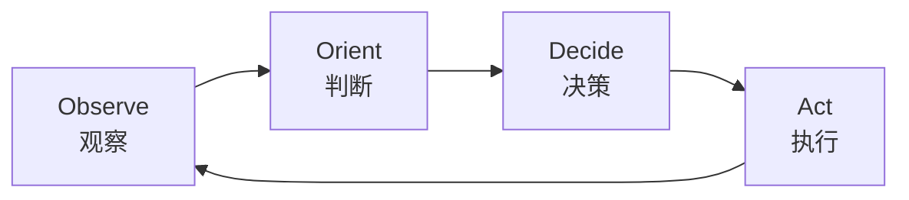
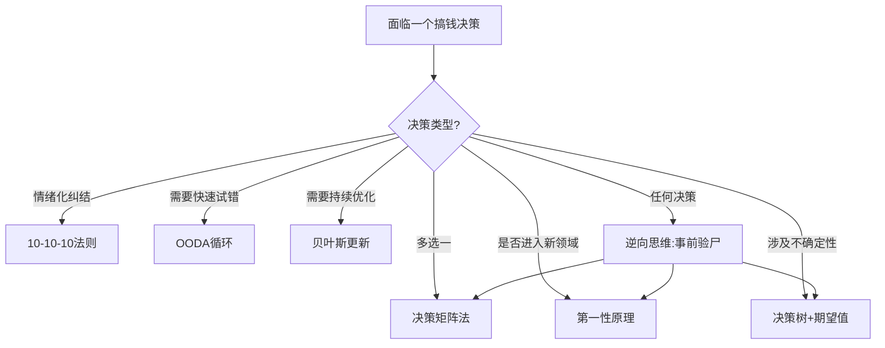

## 八、搞钱中的决策框架

搞钱的本质是一连串决策的叠加。选行业、选赛道、选合作方、选投资标的、选扩张时机——每一个节点的决策质量，最终决定了财富积累的速度和上限。直觉可以帮你走前三步，但走到一定体量后，没有系统化的决策框架，就会被概率碾碎。

本章梳理七个经过验证的决策框架，从个人副业选择到百万级投资决策都能直接套用。

### 8.1 决策矩阵法：量化比较多选一

当面对三个以上选项、每个选项都有多个评估维度时，直觉已经不够用了。决策矩阵法的核心是**把模糊的"感觉"变成可比较的数字**。

#### 标准操作流程

**第一步：穷举选项**。把所有可能的选择列出来，不要提前筛选。很多人在"列选项"这一步就犯错——只列了自己熟悉的两三个，忽略了更有潜力的方向。建议花30分钟做信息搜集，至少列出5个以上选项。

**第二步：确定评估维度**。不同场景需要不同的维度，以下是最常用的维度模板：

| 场景 | 核心维度 |
|------|---------|
| 选择副业方向 | 市场需求、启动成本、时间投入、天花板、个人匹配度 |
| 选择投资项目 | 预期收益、最大回撤、流动性、信息优势、时间精力 |
| 选择合作方 | 资源互补度、信用记录、利益分配、退出机制、沟通成本 |
| 选择跳槽offer | 薪资、成长空间、行业前景、团队质量、work-life balance |

**第三步：设定权重**。权重总和必须为100%。权重设定的常见错误是"什么都重要"——如果每个维度权重都差不多，说明你还没想清楚优先级。问自己一个问题：**如果只能保留一个维度，你选哪个？**那个维度的权重应该最高。

**第四步：打分（1-10分制）**。打分时注意：不要给所有选项在同一个维度上打相同的分数。如果你发现所有选项在"市场需求"上都打7分，说明你的评分标准太粗糙，需要进一步细化区分。

**第五步：计算加权总分，做出选择**。

#### 完整示例：选择副业方向

假设你是一个有3年工作经验的程序员，月余8000元，想利用下班时间搞副业。列出5个方向后：

| 方案 | 市场需求(25%) | 启动成本(15%) | 时间投入(20%) | 天花板(25%) | 个人匹配(15%) | 总分 |
|------|-------------|-------------|-------------|-----------|-------------|------|
| 技术自媒体 | 8×0.25=2.0 | 9×0.15=1.35 | 6×0.20=1.2 | 8×0.25=2.0 | 8×0.15=1.2 | **7.75** |
| 技术外包接单 | 7×0.25=1.75 | 9×0.15=1.35 | 5×0.20=1.0 | 5×0.25=1.25 | 9×0.15=1.35 | **6.70** |
| SaaS小工具 | 6×0.25=1.5 | 6×0.15=0.9 | 4×0.20=0.8 | 9×0.25=2.25 | 7×0.15=1.05 | **6.55** |
| 知识付费课程 | 7×0.25=1.75 | 8×0.15=1.2 | 7×0.20=1.4 | 7×0.25=1.75 | 6×0.15=0.9 | **7.00** |
| 电商无货源 | 8×0.25=2.0 | 7×0.15=1.05 | 8×0.20=1.6 | 4×0.25=1.0 | 4×0.15=0.6 | **6.25** |

结果：技术自媒体得分最高。但注意——**矩阵告诉你的是"综合最优"，不是"一定正确"**。如果SaaS小工具的天花板（9分）深深吸引你，而你愿意承受前期的低时间投入评分，那也可以选它。矩阵是辅助思考的工具，不是替代决策的机器。

#### 常见陷阱

- **伪精确**：给每个选项打出像8.3、7.6这样精确到小数的分数——你的判断没那么精确，整数就够。
- **权重漂移**：打完分后觉得结果不对，偷偷调整权重让"心仪选项"胜出。如果发现自己在做这件事，停下来问：到底是矩阵错了，还是你内心已经有答案，只是想找一个"理性的外衣"？
- **维度遗漏**：最危险的陷阱。比如选择副业时忘了"可组合性"——这个副业积累的能力和资源，能否迁移到下一个阶段？

### 8.2 第一性原理：穿透表象看本质

第一性原理（First Principles Thinking）是埃隆·马斯克最常提到的思维方法。核心思路：**抛开所有现有的假设和做法，回到最底层的事实，从零开始推理**。

#### 为什么搞钱需要第一性原理？

因为大多数人搞钱的方式是"类比思维"——看别人做什么赚钱，自己也去做。这在红利期有效，但当所有人都在用类比思维时，机会窗口迅速关闭，利润趋近于零。

第一性原理让你看到别人看不到的东西。

#### 操作步骤

**第一步：明确你要解决的问题**。比如："如何用10万元本金，在一年内获得超过银行理财的收益？"

**第二步：列出所有相关假设**。把"常识"和"大家都这么说"的东西全写出来：
- "股票风险很大"
- "房产是最好的投资"
- "创业需要很多钱"
- "普通人不可能跑赢大盘"

**第三步：逐条质疑，找到不可再分的事实**。问自己：这个假设是事实，还是观点？如果是观点，支撑它的事实是什么？

比如"股票风险很大"——事实是：**个股**波动大，但沪深300指数过去15年年化收益约8-10%。"风险大"是对个股的判断，被错误泛化到了所有股票类资产。

**第四步：从事实出发，重新构建方案**。经过质疑后，你的思维空间可能从"只有银行理财和买房两个选项"扩展到：指数基金定投、可转债打新、REITs、甚至用这10万做技能培训提升主业收入。

#### 真实案例

2014年前后，外卖市场刚起步时，大多数餐饮老板的类比思维是："外卖就是堂食的延伸，做个网页挂上去就行。"

但外卖创业者的第一性原理推理是：
1. 用户的核心需求是"快速吃到方便的饭菜"（不是"在餐厅吃饭"）
2. 用户愿意为"快+方便"支付的溢价是多少？（答案：配送费3-6元）
3. 什么样的供给结构能满足这个需求？（答案：不是传统餐厅，而是中央厨房+骑手网络）

这个推理导致了"幽灵厨房"（dark kitchen）这个全新业态的诞生——没有堂食区域，只做外卖，租金降低60%，出餐速度提升40%。

### 8.3 决策树与期望值：量化不确定性

当决策涉及不确定的未来结果时，你需要把不确定性结构化。决策树是最直观的工具。

#### 基本结构

```text
                    ┌─ 市场好(60%) → 赚50万
        ┌─ 扩张 ──┤
        │          └─ 市场差(40%) → 亏20万
当前状态 ┤
        │          ┌─ 稳定(70%) → 赚10万
        └─ 保守 ──┤
                   └─ 衰退(30%) → 赚2万
```

**期望值计算**：
- 扩张方案：0.6×50 + 0.4×(-20) = **22万**
- 保守方案：0.7×10 + 0.3×2 = **7.6万**

单看期望值，扩张方案远优于保守方案。

#### 但期望值不是全部——引入凯利公式

如果你有100万本金，面临一个期望值为正的赌局，应该押多少？

凯利公式（Kelly Criterion）给出了数学上的最优答案：

> 最优投注比例 f* = (bp - q) / b
>
> 其中：b = 赔率（盈亏比），p = 胜率，q = 1-p

**示例**：一个副业项目，成功概率40%，成功赚3倍（投入10万赚30万），失败概率60%，失败亏掉全部投入。
- b = 3（赚3倍），p = 0.4，q = 0.6
- f* = (3×0.4 - 0.6) / 3 = 0.2

最优投入比例是总资金的20%。这意味着：如果你有100万可动用资金，这个项目最多投20万。

凯利公式的实操价值在于：**它告诉你即使期望值为正，也不能all-in**。太多人在搞钱过程中犯了"赢了加码、输了更要翻倍"的错误，凯利公式从数学上杜绝了这种冲动。

#### 构建决策树的实操要点

1. **分支要穷尽**：每个节点的分支必须覆盖所有可能，概率之和=100%。
2. **概率要有依据**：不要拍脑袋给概率。用历史数据、行业报告、专家判断来估算。如果实在没有依据，用"乐观/中性/悲观"三个场景各赋一个概率（如20%/60%/20%）。
3. **收益要包含隐性成本**：比如扩张方案的"赚50万"，要扣除你投入的时间成本（如果这6个月全职投入，放弃的主业收入是多少？）、心理压力成本、机会成本。
4. **敏感性分析**：关键假设变化时，结论是否反转？比如上面的扩张方案，如果"市场好"的概率从60%降到40%，期望值变为0.4×50+0.6×(-20)=8万，仍然高于保守方案。但如果降到30%，期望值变为30×0.5+(-20)×0.7=1万，优势几乎消失。

### 8.4 逆向思维：芒格的"反过来想"

查理·芒格的名言："反过来想，总是反过来想。"（Invert, always invert.）

这不是一句鸡汤，而是一个有严格操作步骤的思维工具。

#### 操作方法

**正向思考**容易陷入"乐观偏差"——人天然倾向于高估成功概率、低估困难。

**逆向思考**的操作是：先定义"彻底失败是什么样的"，然后逐一避免。

| 正向问题 | 逆向问题 | 逆向思维产出的行动清单 |
|---------|---------|---------------------|
| 如何让副业月入过万？ | 什么会让副业彻底失败？ | 不选没有市场需求的方向；不过度投入固定成本；不同时做3个以上方向 |
| 如何选到好股票？ | 什么操作一定亏钱？ | 不追涨停板；不听小道消息；不用杠杆；不投自己看不懂的公司 |
| 如何让创业公司活过3年？ | 创业公司的常见死法是什么？ | 现金流管理（占创业失败原因的29%）；不在验证PMF前大规模扩张；不找能力不互补的合伙人 |

#### 逆向思维在搞钱中的三个高频应用场景

**场景一：投资前的"事前验尸"（Pre-mortem）**

在做任何投资决策前，假设这笔投资已经亏光了，写下"它是怎么死的"：
- "我投了15万开奶茶店，6个月后关门。原因：选址在新开发的商业街，入住率不到30%；加盟费占了启动资金的40%，导致后续运营资金不足；没有餐饮经验，员工管理混乱。"

然后逐条检查：这些问题在你的计划中是否有预案？

**场景二：简历逆向法（筛选合作方）**

选合伙人或合作方时，不要看他们的"成功故事"，而是问："你过去最大的失败是什么？你从中学到了什么？"一个说"我没失败过"的人，要么在说谎，要么风险意识极差。

**场景三：底线思维**

在每个决策中先定义"不可逾越的底线"：
- 单笔投资不超过总资金的20%
- 负债率不超过30%
- 不碰自己完全不懂的领域
- 不为了短期收益牺牲长期信誉

底线是"铁律"，无论预期收益多高都不能突破。

### 8.5 10-10-10法则：拉开时间维度

这个方法由通用电气前CEO杰克·韦尔奇提出，用于处理"情绪化决策"。

#### 操作方法

面对纠结的决策时，问自己三个问题：

1. **10分钟后**，我会怎么看这个决定？（短期情绪反应）
2. **10个月后**，我会怎么看这个决定？（中期结果评估）
3. **10年后**，我会怎么看这个决定？（长期价值判断）

#### 为什么有效？

人在做决策时，大脑中的杏仁核（负责情绪反应）会劫持前额叶皮层（负责理性思考）。10-10-10法则通过"强制时间透视"，把决策从情绪区域拉回到理性区域。

#### 搞钱场景应用示例

**场景：老板给你涨薪30%，但需要去一个你不感兴趣的部门。接不接？**

- 10分钟后：开心，钱多了。
- 10个月后：在新部门可能遇到两种情况——适应了，或者每天上班如上坟。如果后者，你的工作状态会下滑，甚至可能被辞退。
- 10年后：如果这个部门方向不是你的长期方向，你浪费了10个月在一个不可积累的领域。如果原来的部门方向更有前景，这个涨薪的机会成本可能高达上百万。

**结论**：如果新部门与你的长期方向不一致，短期涨薪不值得。10-10-10法则帮你看到了"被短期收益蒙蔽"的风险。

#### 适用边界

这个方法适合处理"短期诱惑 vs 长期价值"的冲突，但不适合所有决策。如果决策时间窗口极短（比如股票闪崩时要不要卖），10-10-10法则太慢了——这时候你需要预设的规则（如止损线）而不是现场分析。

### 8.6 OODA循环：快速试错的决策引擎

OODA循环（Observe-Orient-Decide-Act）最初由美国空军战略家约翰·博伊德提出，用于空战决策，后来被广泛应用于商业领域。它的核心思想是：**在不确定环境中，决策速度比决策精度更重要**。

#### 四个阶段



**Observe（观察）**：收集环境信息。搞钱场景中，这包括市场数据、用户反馈、竞品动态、政策变化。

**Orient（判断）**：这是最关键的一步——根据你的经验、知识和价值观，对观察到的信息进行解读。同样的数据，不同人的判断完全不同。2020年疫情初期，有人看到"线下停摆"判断"完了"，有人看到"线上需求暴增"判断"机会来了"。

**Decide（决策）**：基于判断，选择一个行动方案。

**Act（执行）**：快速执行，然后回到Observe阶段，观察执行结果。

#### OODA在搞钱中的实操应用

**案例：用OODA循环做小红书账号冷启动**

| 阶段 | 具体动作 | 时间 |
|------|---------|------|
| Observe | 搜索目标领域的热门笔记，分析点赞>1000的内容特征（选题、标题、封面、字数） | 第1天 |
| Orient | 总结规律：该领域高赞内容集中在"避坑指南"和"对比测评"两类，平均封面是竖版图文，标题带数字 | 第1天 |
| Decide | 第一批内容策略：发3篇避坑指南+2篇对比测评，封面统一风格，标题用"X个"+"避坑" | 第2天 |
| Act | 按策略发布5篇笔记 | 第2-3天 |
| Observe | 3天后看数据：哪类内容数据好？哪个时间段发布效果最佳？评论区用户在问什么？ | 第5天 |
| Orient | 数据显示避坑类互动率是对比类的2倍；晚上8点发布效果最好；用户高频问题是"XX品牌怎么选" | 第5天 |
| Decide | 调整策略：加大避坑类比例，锁定晚8点发布，新增品牌选择指南选题 | 第5天 |
| Act | 执行调整后的内容策略 | 第6-14天 |

关键点：**每个OODA循环要快**。不要花一个月"研究"再开始——先做，拿到反馈数据，再调整。在小红书这个案例中，一个OODA循环大约3-5天，两周内就能跑完3-4个循环，找到适合自己的内容策略。

#### OODA vs 传统规划

| 对比维度 | 传统规划（瀑布式） | OODA循环（敏捷式） |
|---------|-----------------|-----------------|
| 适用环境 | 确定性高、变量少 | 不确定性高、变化快 |
| 决策节奏 | 一次规划，长期执行 | 快速迭代，持续调整 |
| 信息利用 | 前期大量收集信息 | 边做边收集信息 |
| 风险特征 | 前期风险低，后期纠错成本高 | 单次试错成本低，累积风险低 |
| 搞钱场景 | 开实体店、买房等重资产决策 | 副业探索、内容创业、电商测品等轻资产决策 |

### 8.7 概率思维与贝叶斯更新：持续修正你的判断

#### 期望值思维

每个决策都有多种可能的结果。概率思维的第一步是学会计算期望值：

> 期望值 = Σ（每种结果的概率 × 该结果的收益/损失）

**示例对比**：
- 方案A：90%概率赚10万，10%概率亏5万 → 期望值 = 0.9×10 + 0.1×(-5) = **8.5万**
- 方案B：50%概率赚30万，50%概率亏10万 → 期望值 = 0.5×30 + 0.5×(-10) = **10万**

方案B期望值更高，但波动也更大。选择哪个？取决于两个因素：

1. **你的风险承受能力**：如果你有200万存款，亏10万无所谓；如果你只有15万存款，亏10万意味着生活陷入困境。凯利公式可以帮你精确计算最优投入比例（参见8.3节）。
2. **可重复次数**：如果你能重复做100次类似决策（比如量化交易），选期望值最高的方案。如果只做一次（比如辞职创业），要考虑"最坏情况下的生存问题"。

#### 贝叶斯更新：用新证据修正旧判断

贝叶斯定理的核心思想：**你的判断应该随着新证据的出现而更新**。

> 后验概率 = (先验概率 × 似然度) / 证据概率

不用记公式，理解操作逻辑就行：

**初始判断（先验）**：你觉得某A股公司有30%的概率在未来两年内股价翻倍。这个判断基于行业分析和财务数据。

**新证据出现**：该公司拿到了一个大客户的独家合同。

**更新判断（后验）**：拿到大客户独家合同的公司，两年内股价翻倍的概率历史上约为50%。那么你的判断应该从30%上调——但调到多少？取决于这个证据的强度。如果独家合同金额占公司营收的30%以上，你可以把概率调到45-50%；如果只占5%，可能只调到33-35%。

#### 搞钱中的贝叶斯思维实操

**第一步：建立"先验"**。在做任何决策前，先给出一个初始概率判断。不要说"可能会成功"，要说"我认为成功率在60%左右"。

**第二步：定义"什么证据会改变我的判断"**。在行动之前就想好：如果出现什么信号，我要上调/下调判断？这比事后找理由更有纪律性。

比如你做了一个小红书账号，初始判断"3个月内能做到1万粉"的概率是40%。你定义的更新规则：
- 如果第1周有笔记超过500赞 → 上调到60%
- 如果第2周粉丝增长率超过20%/周 → 上调到70%
- 如果连续2周没有任何笔记超过100赞 → 下调到20%

**第三步：严格执行更新**。大多数人的错误是：当证据不支持自己的判断时，选择性忽视证据，而不是更新判断。这就是心理学中的"确认偏差"（Confirmation Bias）——你只看到支持你结论的证据，忽略反对的证据。

对抗确认偏差的方法：**指定一个"反对者"**。在每个重大决策中，强迫自己花10分钟站在反对者的角度，列出所有"这个决策会失败"的理由。

### 8.8 建立你的个人决策系统

以上七个框架不是孤立的工具，它们可以组合成一个完整的决策系统。以下是推荐的组合方式：

#### 决策分类与框架匹配



#### 决策清单：重大决策前的自检

在做任何涉及超过月收入50%的搞钱决策时，过一遍这个清单：

- [ ] 我是否用了至少两个框架来分析这个决策？
- [ ] 我是否做过逆向思维（事前验尸）？
- [ ] 我是否考虑过最坏情况？最坏情况下我能承受吗？
- [ ] 我是否计算过期望值和最优投入比例？
- [ ] 我是否定义了"什么证据会让我改变判断"？
- [ ] 我是否设置了止损线/退出条件？
- [ ] 这个决策是基于事实，还是基于情绪（贪婪/恐惧/焦虑）？
- [ ] 如果我最信任的人来做这个决策，我会给他什么建议？（这个技巧叫"旁观者视角"，能有效消除情绪干扰）

#### 常见决策偏差与纠正

| 偏差 | 表现 | 纠正方法 |
|------|------|---------|
| 锚定效应 | 被第一个接触的信息锁定。看到"原价999，现价299"就觉得便宜，不管这个东西实际值多少 | 强制自己先评估"这个东西对我来说值多少"，再看标价 |
| 沉没成本谬误 | 因为已经投入了时间/金钱，所以继续投入明知不值得的项目 | 问自己："如果我现在从零开始，还会选择做这件事吗？" |
| 从众效应 | "大家都在做，应该没问题" | 记住：当所有人都觉得没问题时，往往就是最大的问题 |
| 过度自信 | 高估自己的判断准确率，低估不确定性 | 记录自己过去的预测和实际结果，计算真实准确率 |
| 损失厌恶 | 亏1万的痛苦是赚1万快乐的2.5倍（卡尼曼研究），导致过早卖出盈利资产、死守亏损资产 | 设定预设规则（如止损10%、止盈30%），严格执行 |
| 可得性偏差 | 用容易想到的案例代替统计。看到一个朋友炒股赚了钱，就觉得炒股很容易成功 | 要求自己找到统计数据，而不是靠个案做判断 |
| 禀赋效应 | 高估自己已经拥有的东西的价值。自己做的副业项目，明知不赚钱，就是舍不得放弃 | 定期做"如果这个项目不是我的，我会投资它吗？"的思维实验 |

#### 训练决策能力的日常练习

决策能力和肌肉一样，需要持续训练：

1. **决策日志**：每次做出重要决策后，记录你的推理过程、当时的假设、预期结果。3-6个月后回看，对比实际结果。这是提升决策质量最有效的方法——研究表明，坚持记录决策日志的人，决策准确率在一年内提升15-20%。

2. **概率校准训练**：每周选5个你不确定的事实（比如"下周某股票是涨还是跌"），给出你的概率判断，然后对照结果。目标是让你说"70%概率"的事情，真的有70%左右的准确率。

3. **反向案例分析**：每周选一个搞钱失败的案例，用本章的框架分析"在哪个决策节点出了问题"。失败案例比成功案例更有学习价值——因为成功有运气成分，但失败的原因往往是可以避免的决策错误。

4. **红队演练**：在重大决策前，找一个你信任且敢于直言的朋友，让他专门挑毛病。如果找不到这样的人，用AI工具模拟——让AI扮演"悲观的反对者"，专门质疑你的决策。

### 8.9 本章小结

决策框架不是万能药——它们不能消除不确定性，不能保证你每次都做对。但它们能做到两件事：

1. **减少系统性错误**：人的认知偏差是系统性的，框架是对抗偏差的工具。用了框架不能保证做对，但不用框架几乎一定会犯某种偏差错误。

2. **加速学习**：有了框架，你才能结构化地分析自己的决策过程，知道自己"在哪里做对了、在哪里做错了"。没有框架的人，赢了不知道为什么赢，输了不知道为什么输，下一次决策还是靠运气。

最终目标不是成为"决策机器"，而是在搞钱这条路上，**用更少的学费，学到更多的教训**。
