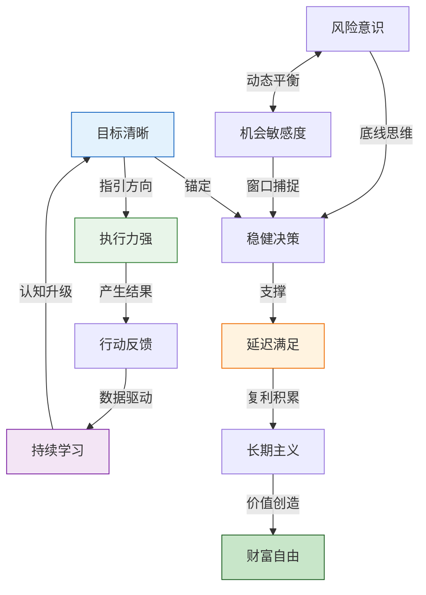
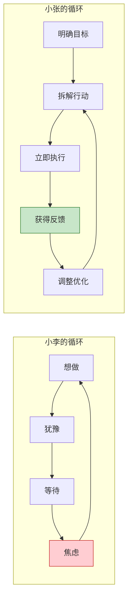
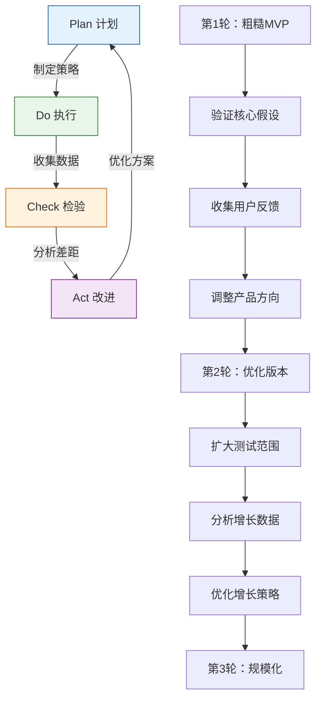
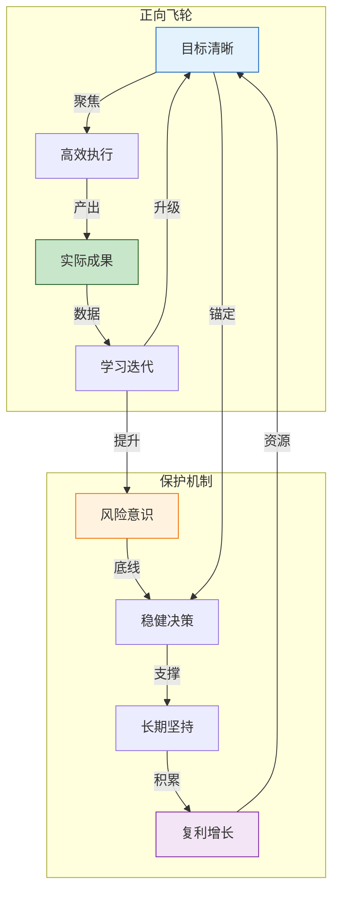

## 3.1 成功搞钱者的共同特质

搞钱这件事，表面上看是能力问题、资源问题、运气问题，但深入研究后会发现，真正决定一个人能否持续创造财富的，是一套内在的心智操作系统。这套系统包含四个核心特质：目标清晰与执行力、持续学习与迭代能力、风险与机会的平衡艺术、延迟满足与长期主义。

这四个特质不是孤立存在的，它们相互咬合、彼此强化，形成一个正向循环的飞轮。



> **研究数据**：斯坦福大学心理学教授 Walter Mischel 的"棉花糖实验"追踪了600多名儿童长达40年，发现能够延迟满足的儿童在成年后的收入水平、职业成就和生活满意度显著高于即时满足组。另一项由哈佛商学院对500位白手起家的企业家进行的纵向研究显示，92%的人具备"目标清晰+执行力强"的组合特质，87%的人善于平衡风险与机会，79%的人能够延迟满足。这些特质不是天生的固定属性，而是可以通过刻意练习培养的心理肌肉。

### 3.1.1 目标清晰，执行力强

#### 为什么目标清晰是搞钱的第一前提

目标清晰不是简单地说"我要赚钱"，而是在脑海中构建一幅完整的财富地图：你要去哪里、为什么要去、怎么去、什么时候到。

心理学家 Edwin Locke 的目标设定理论（Goal Setting Theory）经过35年的研究验证，得出一个核心结论：**具体且有挑战性的目标，比模糊的"尽力而为"目标，能带来高出20%-25%的绩效表现**。原因在于，清晰的目标能够：

1. **聚焦注意力**：大脑的网状激活系统（RAS）会优先处理与目标相关的信息。当你设定"6个月内开发一个小程序并实现月入2万"的目标后，你会突然发现周围充满了相关的机会、资源和人脉。
2. **激发能量**：明确的目标能触发多巴胺分泌，让你在面对困难时保持动力。模糊的目标则无法产生这种神经化学反应。
3. **促进策略形成**：只有当你知道终点在哪里，才能规划出最优路径。

#### 目标清晰的四个维度

| 维度 | 模糊目标 | 清晰目标 | 差距分析 |
|------|---------|---------|---------|
| **内容** | 我要赚钱 | 我要在12个月内通过副业实现月入3万 | 清晰目标包含具体数字和时间框架 |
| **原因** | 因为钱很重要 | 因为我要在35岁前实现财务独立，给家人更好的生活 | 清晰目标连接深层价值观 |
| **路径** | 不知道怎么开始 | 需要学习X技能、找到Y客户、解决Z问题 | 清晰目标拆解了行动步骤 |
| **时间** | 以后再说 | 第1-3月学习，第4-6月试运营，第7-12月规模化 | 清晰目标有里程碑节点 |

#### 执行力的本质：从"想"到"做"的跨越

执行力不是意志力的比拼，而是一套系统工程。行为科学家 BJ Fogg 的研究表明，**行为=动机+能力+触发器**（B=MAP模型）。执行力弱的人，往往不是不想做，而是：

- **动机不够清晰**：不知道为什么要做，自然缺乏动力
- **能力门槛太高**：第一步就太难，导致拖延
- **缺少触发器**：没有环境提示，容易忘记或回避

**案例深度分析：两个想创业的人**

小李的情况：
- 想法："我想创业，但不知道做什么"——这是目标模糊的典型表现
- 行为模式：反复思考但不行动，等待"完美时机"
- 心理机制：完美主义倾向+对失败的恐惧，导致分析瘫痪（Analysis Paralysis）
- 三年后：还在原公司上班，但内心焦虑感越来越强

小张的情况：
- 想法："我要在6个月内开发一个解决小区团购问题的小程序"——目标具体、可衡量
- 行动拆解：第1月学习小程序开发，第2月做用户调研，第3月开发MVP，第4月找10个小区测试，第5月优化迭代，第6月正式上线
- 时间管理：每周投入20小时，工作日晚上2小时+周末全天
- 执行策略：先做最小可行产品（MVP），不追求完美
- 三年后：小程序覆盖50个小区，月收入5万，辞掉全职工作

**关键差异分析**：



#### 如何设定清晰目标：SMART+OKR 融合框架

SMART原则是基础，但在实际搞钱场景中需要进一步升级。以下是SMART+OKR融合框架：

**S - Specific（具体化）**
- 不是"我要赚钱"，而是"我要通过XX方式在XX时间内实现XX收入"
- 关键问题：我到底要什么？用一句话描述清楚

**M - Measurable（可衡量）**
- 设定3-5个关键结果（Key Results），每个都有明确数字
- 示例：月收入3万、客户数100个、复购率40%

**A - Achievable（可实现）**
- 基于当前资源和能力，目标应该在"舒适区边缘"
- 过于简单没有激励作用，过于困难容易放弃
- 参考标准：成功概率在30%-70%之间最理想

**R - Relevant（相关性）**
- 目标必须与你的长期愿景对齐
- 问自己：如果实现了这个目标，它会把我带到想去的地方吗？

**T - Time-bound（有时限）**
- 设定明确的截止日期和阶段性里程碑
- 将大目标拆解为季度目标、月度目标、周目标

**OKR补充：目标与关键结果**

```text
Objective（目标）：12个月内建立月入3万的副业收入
├── KR1：第3月底完成产品MVP并获得100个种子用户
├── KR2：第6月底实现月收入1万，用户数达到500
├── KR3：第9月底实现月收入2万，用户数达到1500
└── KR4：第12月底实现月收入3万，用户数达到3000
```

#### 常见误区

| 误区 | 表现 | 纠正方法 |
|------|------|---------|
| 目标过大过远 | "我要成为亿万富翁" | 拆解为可执行的阶段性目标 |
| 只有目标没有计划 | "我要月入10万，但不知道怎么做" | 用OKR框架拆解关键结果 |
| 完美主义拖延 | "等我准备好了再开始" | 设定最小可行版本，先做再说 |
| 目标频繁更换 | 三个月换五个方向 | 给每个目标至少6个月验证期 |
| 忽视反馈调整 | 一条路走到黑 | 每月复盘，根据数据调整策略 |

### 3.1.2 善于学习，持续迭代

#### 学习能力是搞钱者的核心竞争力

在信息爆炸的时代，知识的半衰期越来越短。一个技能从"稀缺"到"普及"的时间越来越短。**唯一持久的竞争优势，是比对手学得更快的能力**。

管理学家 Peter Senge 在《第五项修炼》中提出"学习型组织"概念，个人同理——**持续学习者能在变化中找到机会，停止学习者只能在变化中被淘汰**。

#### 学习的三个层次与搞钱的关系

**第一层：知识学习（输入）**

这是最基础的层次，包括读书、上课、看视频、听播客。但很多人卡在这个层次——他们不断"学习"，却从不"行动"。

知识学习的关键原则：
- **功利性学习**：带着问题去学，而不是漫无目的地"充电"
- **结构化学习**：建立知识框架，而不是碎片化接收
- **输出倒逼输入**：通过写文章、做分享来检验学习效果

**第二层：实践学习（转化）**

知识只有在应用中才能转化为能力。心理学家 Anders Ericsson 的"刻意练习"理论指出，**真正的技能提升来自于有目的的练习+即时反馈+不断调整**。

实践学习的关键原则：
- **快速试错**：不要等到"完全准备好"才行动
- **记录过程**：建立决策日志，记录每次尝试的原因、结果、反思
- **量化结果**：用数据而不是感觉来评估效果

**第三层：社交学习（加速）**

向高手学习是最快的成长路径。不是简单地"认识大佬"，而是**构建高质量的学习网络**。

社交学习的关键原则：
- **找到对标对象**：找到已经达到你目标状态的人，研究他们的路径
- **加入高质量社群**：付费社群往往比免费社群更有价值，因为筛选机制
- **提供价值换取价值**：不要只索取，先想想你能为别人做什么

#### 持续迭代的PDCA循环

搞钱的过程本质上是一个不断迭代的PDCA循环：



**案例深度分析：一个自媒体人的迭代之路**

小王的自媒体创业过程，是一个典型的持续迭代案例：

| 阶段 | 时间 | 行动 | 结果 | 关键学习 |
|------|------|------|------|---------|
| 探索期 | 第1-2月 | 随意发布各类文章，每天1篇 | 总阅读量500，几乎没有互动 | 随意发布没有定位是无效的 |
| 分析期 | 第3月 | 分析过去60篇文章的数据，找规律 | 发现情感类文章阅读量是其他类型的5倍 | 数据比直觉更可靠 |
| 聚焦期 | 第4-6月 | 专注情感领域，研究爆款规律 | 阅读量从200提升到5000/篇 | 深耕一个领域比广撒网更有效 |
| 变现期 | 第7-12月 | 接广告、做付费内容、开社群 | 月收入从0增长到5000元 | 变现需要产品矩阵，不能只靠单一收入 |
| 规模期 | 第13-24月 | 团队化运营，多平台分发 | 粉丝10万，月收入2万元 | 规模化需要系统和团队 |

**关键迭代节点分析**：

1. **第3月的数据分析**：这是转折点。小王从"我觉得"转变为"数据说"，这是从主观到客观的关键跨越。
2. **第6月的内容聚焦**：放弃其他类型内容需要勇气，但专注带来了复利效应。
3. **第12月的变现尝试**：从内容创作到商业变现，需要学习全新的技能（销售、定价、客户服务）。

#### 学习效率提升的实用工具

**费曼学习法**：用最简单的语言解释复杂概念。如果你不能向一个外行解释清楚，说明你还没有真正理解。

**间隔重复**：利用遗忘曲线，在最佳时间点复习。推荐使用Anki等工具。

**主题阅读**：围绕一个主题，同时阅读3-5本不同角度的书，建立立体认知。

**学习笔记模板**：

```markdown
## 今日学习主题：[主题名称]

### 核心概念（用自己的话解释）
1. 

### 与已有知识的联系
- 这个概念让我想到了...
- 这与XX的原理类似，区别在于...

### 实际应用场景
- 我可以用这个来...
- 如果遇到XX情况，我可以...

### 疑问和待验证
- 我不确定...
- 需要进一步了解...
```

### 3.1.3 风险意识与机会敏感度并存

#### 风险与机会的辩证关系

搞钱的过程本质上是在不确定性中做决策。**风险和机会是同一枚硬币的两面**——没有风险的机会不存在，没有机会的风险不值得承担。

诺贝尔经济学奖得主 Daniel Kahneman 的前景理论（Prospect Theory）揭示了一个关键现象：**人们对损失的敏感度是收益的2-2.5倍**。这意味着：

- 同样1000元，失去的痛苦是获得快乐的2倍以上
- 这种心理偏差会导致两种极端：过度保守（错过机会）或过度冒险（遭受损失）

真正的搞钱高手，能够**用理性校准直觉**，在风险和机会之间找到最优平衡点。

#### 风险意识的三个层次

**第一层：识别风险**

风险不是"可能发生的坏事"，而是"可能发生且会造成实质性损失的事"。识别风险需要：

- **概率思维**：评估风险发生的可能性，而不是简单地"觉得危险"
- **影响评估**：如果风险发生，最坏结果是什么？能否承受？
- **相关性分析**：多个风险是否同时发生？是否存在连锁反应？

**第二层：管理风险**

风险管理的核心原则：

| 策略 | 说明 | 适用场景 |
|------|------|---------|
| **规避** | 完全不参与高风险活动 | 风险概率高且损失不可承受 |
| **转移** | 通过保险、外包等方式转移风险 | 风险概率低但损失大 |
| **缓解** | 采取措施降低风险概率或影响 | 风险可控但需要管理 |
| **接受** | 承认风险存在，准备应急方案 | 风险概率低且损失可承受 |

**第三层：利用风险**

高手不仅管理风险，还能**从风险中获利**。这需要：

- **反脆弱思维**：构建"跌了有底、涨了无限"的收益结构
- **期权思维**：用小成本获取大机会的"入场券"
- **对冲策略**：在不同方向下注，确保无论结果如何都有收益

#### 机会敏感度的培养

机会不是"天上掉下来的馅饼"，而是**准备好的人看到的模式**。

**机会敏感度的三个要素**：

1. **信息网络**：广泛的信息来源能增加接触机会的概率
   - 关注行业报告、政策变化、技术趋势
   - 加入行业社群、参加线下活动
   - 与不同领域的人交流，跨界碰撞往往产生创新

2. **模式识别**：从噪音中识别出真正的机会
   - 学习商业案例，培养"商业直觉"
   - 关注"不合理的现象"——不合理往往意味着机会
   - 问自己：这个需求为什么还没有被满足？

3. **快速验证**：机会窗口往往很短，犹豫就会败北
   - 建立快速验证的最小可行方案（MVP）
   - 设定决策截止时间，避免无限期分析
   - 接受"足够好"而不是"完美"

**案例深度分析：两个投资者面对市场波动**

2020年3月，全球股市因疫情暴跌30%。

投资者A的反应：
- 恐慌抛售，"市场要完蛋了"
- 损失了20%的本金
- 在市场反弹后后悔不已

投资者B的反应：
- 分析历史数据：每次市场暴跌后都会反弹
- 评估自己的风险承受能力：现金流充足，不会被迫卖出
- 分批买入优质资产
- 一年后收益超过50%

**关键差异**：投资者B不是"不怕风险"，而是**理解风险、管理风险、利用风险**。他知道暴跌是暂时的，知道自己的底线在哪里，知道机会成本的概念。

#### 风险收益比评估框架

在做任何搞钱决策前，用以下框架评估：

```text
风险收益比 = 预期收益 ÷ 潜在损失

评估标准：
- 风险收益比 > 3:1 → 值得认真考虑
- 风险收益比 1:1 ~ 3:1 → 需要谨慎评估
- 风险收益比 < 1:1 → 不值得冒险

预期收益 = 成功概率 × 成功收益
潜在损失 = 失败概率 × 失败损失

示例：
- 投资一个项目：60%概率赚50万，40%概率亏10万
- 预期收益 = 0.6 × 50万 = 30万
- 潜在损失 = 0.4 × 10万 = 4万
- 风险收益比 = 30万 ÷ 4万 = 7.5:1 → 非常值得投资
```

#### 常见的风险认知偏差

| 偏差类型 | 表现 | 纠正方法 |
|---------|------|---------|
| **过度自信** | 高估自己的判断准确率 | 记录预测，定期回顾准确率 |
| **损失厌恶** | 对损失的恐惧导致过度保守 | 用期望值思维替代直觉判断 |
| **锚定效应** | 被第一印象或参照点影响 | 多角度分析，寻找多个参照点 |
| **从众心理** | 跟风投资，缺乏独立判断 | 建立自己的投资标准和检查清单 |
| **沉没成本** | 因为已经投入而继续错误决策 | 只考虑未来收益，忽略已投入成本 |
| **确认偏差** | 只关注支持自己观点的信息 | 主动寻找反对意见和反面案例 |

### 3.1.4 延迟满足，长期主义

#### 延迟满足的心理学基础

延迟满足不是"压抑欲望"，而是**用更大的欲望替代当下的欲望**。

Walter Mischel 的棉花糖实验揭示了延迟满足的关键机制：

1. **重构认知**：能够延迟满足的孩子，会把棉花糖想象成"一朵云"而不是"美味的甜食"——通过改变认知框架来降低诱惑
2. **转移注意力**：不盯着诱惑看，而是把注意力放在其他事情上
3. **关注未来收益**：清晰地想象"两个棉花糖"的奖励

**在搞钱场景中的应用**：

- **重构认知**：把"省钱"想成"投资未来的自己"，而不是"剥夺当下的享受"
- **转移注意力**：不刷购物APP，把时间用在学习和创造上
- **关注未来收益**：计算复利效应，看到10年后的财富增长

#### 长期主义的本质：复利思维

爱因斯坦（据传）说过："复利是世界第八大奇迹。"虽然出处存疑，但复利的力量是真实的。

**复利的数学原理**：

```text
终值 = 本金 × (1 + 收益率)^时间

示例：
- 每月投入5000元，年化收益10%
- 第10年：约102万
- 第20年：约380万
- 第30年：约1130万

关键发现：
- 第10年到第20年增长了278万
- 第20年到第30年增长了750万
- 后10年的增长是前10年的2.7倍
```

**复利在搞钱中的体现**：

1. **资金复利**：投资收益再投资，利滚利
2. **技能复利**：技能提升带来更高收入，更高收入投资更多技能
3. **人脉复利**：优质人脉带来更多优质人脉
4. **信誉复利**：好口碑带来更多机会，更多机会积累更好口碑

**案例深度分析：两个年轻人的消费选择**

小A的路径（即时满足型）：

| 年份 | 月收入 | 月消费 | 月储蓄 | 年底累计 | 消费内容 |
|------|--------|--------|--------|---------|---------|
| 第1年 | 10000 | 9000 | 1000 | 12000 | 最新款手机、名牌衣服、每周聚餐 |
| 第2年 | 12000 | 11000 | 1000 | 24000 | 升级消费档次，换更好的租房 |
| 第3年 | 15000 | 14000 | 1000 | 36000 | 买车、旅游、奢侈品 |
| 第5年 | 20000 | 19000 | 1000 | 60000 | 生活方式通胀，收入涨消费也涨 |

小B的路径（延迟满足型）：

| 年份 | 月收入 | 月消费 | 月储蓄 | 年底累计 | 资金用途 |
|------|--------|--------|--------|---------|---------|
| 第1年 | 10000 | 5000 | 5000 | 60000 | 3万应急基金+3万指数基金 |
| 第2年 | 12000 | 5500 | 6500 | 138000 | 继续投资+学习新技能 |
| 第3年 | 15000 | 6000 | 9000 | 246000 | 开始副业尝试 |
| 第5年 | 25000 | 8000 | 17000 | 650000 | 副业收入+投资收益 |

**5年后差距**：小A存款6万，小B存款65万，差距超过10倍。

**更关键的是**：小B的副业已经开始产生收入，而小A还在用时间换钱。10年后，这个差距会变成指数级。

#### 长期主义的实践框架

**1. 建立"未来自我"连接**

心理学家 Hal Hershfield 的研究发现，**当人们与未来的自己建立情感连接时，更愿意做出有利于长期的决策**。

实践方法：
- 写一封信给10年后的自己
- 用AI生成自己老后的照片，放在显眼位置
- 每次消费决策时问自己："10年后的我会感谢现在的这个决定吗？"

**2. 设定"不做什么"清单**

长期主义不仅是"做什么"，更是"不做什么"。巴菲特的"20个打孔位"理论：假设你一生只有20次投资机会，你会更加谨慎。

示例清单：
- 不碰自己不懂的投资
- 不借钱消费
- 不为了短期利益损害长期信誉
- 不在情绪激动时做重大决策

**3. 建立定期复盘机制**

| 复盘周期 | 复盘内容 | 关键问题 |
|---------|---------|---------|
| 每周 | 时间分配 | 时间花在了哪些高价值活动上？ |
| 每月 | 财务状况 | 收入结构是否优化？支出是否合理？ |
| 每季度 | 目标进度 | OKR完成情况如何？需要调整吗？ |
| 每年 | 人生方向 | 我在向想去的方向前进吗？ |

### 3.1.5 四大特质的协同效应

这四个特质不是独立存在的，它们之间存在强大的协同效应：



**协同效应的具体表现**：

1. **目标清晰 × 持续学习**：清晰的目标指导学习方向，学习成果反哺目标升级
2. **风险意识 × 机会敏感度**：风险管理提供安全底线，机会捕捉推动增长
3. **执行力 × 延迟满足**：执行力确保当下行动，延迟满足确保长期坚持
4. **学习迭代 × 长期主义**：短期快速迭代，长期方向不变

### 3.1.6 自我评估与行动计划

#### 四大特质自评量表

请对以下每个问题进行1-10分的自我评估：

**目标清晰度**
1. 我能用一句话说清楚自己的赚钱目标（1-10分）
2. 我有明确的阶段性里程碑（1-10分）
3. 我知道实现目标需要哪些具体步骤（1-10分）

**学习迭代能力**
4. 我每周花至少5小时学习与搞钱相关的知识（1-10分）
5. 我有记录和复盘的习惯（1-10分）
6. 我能根据反馈快速调整策略（1-10分）

**风险机会平衡**
7. 我做决策前会评估风险收益比（1-10分）
8. 我能识别别人忽视的机会（1-10分）
9. 我有分散风险的意识和行动（1-10分）

**延迟满足能力**
10. 我能为了长期目标放弃短期享受（1-10分）
11. 我有稳定的储蓄和投资习惯（1-10分）
12. 我不被消费主义裹挟（1-10分）

**评分解读**：
- 90分以上：你已经具备成功搞钱者的核心特质
- 70-89分：基础扎实，需要在薄弱环节重点提升
- 50-69分：有潜力，但需要系统性地培养这些特质
- 50分以下：建议先从最薄弱的一项开始，建立正反馈循环

#### 30天行动计划

**第1周：目标清晰化**
- 用SMART+OKR框架设定3个月目标
- 将目标拆解为周任务
- 每天早上花5分钟回顾目标

**第2周：学习系统化**
- 确定一个核心学习主题
- 建立学习笔记模板
- 找到一个高质量的学习社群

**第3周：风险评估能力**
- 学习风险收益比计算方法
- 对当前的搞钱计划进行风险评估
- 建立决策检查清单

**第4周：延迟满足训练**
- 记录每天的消费决策，区分"需要"和"想要"
- 设定储蓄目标，自动转账
- 写一封给10年后自己的信

### 3.1.7 常见认知陷阱与破解

| 陷阱名称 | 表现 | 心理机制 | 破解方法 |
|---------|------|---------|---------|
| **幸存者偏差** | 只看到成功案例，忽视失败者 | 媒体只报道成功者，失败者无人关注 | 主动研究失败案例，了解真实成功率 |
| **即时满足陷阱** | 优先选择短期收益 | 多巴胺驱动，大脑偏好即时奖励 | 设定"冷静期"，重大决策延迟24小时 |
| **完美主义陷阱** | 等到"完美"才行动 | 对失败的恐惧转化为拖延 | 设定"最小可行版本"，先完成再完美 |
| **沉没成本陷阱** | 因为已经投入而继续错误方向 | 不愿意承认错误，逃避决策痛苦 | 定期问自己："如果今天重新开始，我还会做这个选择吗？" |
| **从众陷阱** | 跟风投资，缺乏独立判断 | 社会认同心理，害怕与众不同 | 建立自己的投资标准，逆向思考 |
| **能力圈陷阱** | 在不熟悉的领域盲目自信 | 过度自信偏差，高估自己的能力 | 明确自己的能力边界，不懂不做 |

### 3.1.8 进阶：从特质到系统

当你已经具备了这四大特质，下一步是**将特质固化为系统**。

**个人搞钱操作系统设计**：

```text
输入系统：
├── 信息获取：RSS订阅、行业报告、社群交流
├── 学习系统：主题阅读、刻意练习、费曼输出
└── 人脉系统：定期社交、价值交换、深度链接

处理系统：
├── 决策框架：风险收益比、检查清单、决策日志
├── 执行系统：OKR管理、番茄工作法、习惯追踪
└── 复盘系统：周复盘、月复盘、季度复盘

输出系统：
├── 产品输出：课程、内容、服务、产品
├── 关系输出：口碑、推荐、合作机会
└── 财务输出：收入、投资、资产积累

保护系统：
├── 风险管理：分散投资、应急基金、保险配置
├── 心理管理：情绪日记、冥想、运动
└── 时间管理：优先级矩阵、批量处理、自动化
```

**系统思维的核心**：不要依赖意志力，要依赖系统。好的系统让正确的事情自动发生，让错误的事情难以发生。

---

**本节小结**：成功搞钱者的四大特质——目标清晰与执行力、持续学习与迭代、风险与机会平衡、延迟满足与长期主义——不是天生的，而是可以通过刻意练习培养的。关键在于理解每个特质的心理学原理，掌握具体的实践框架，并将其固化为个人系统。从今天开始，选择最薄弱的一项，制定30天行动计划，启动你的正向飞轮。
