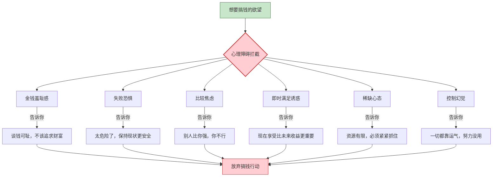
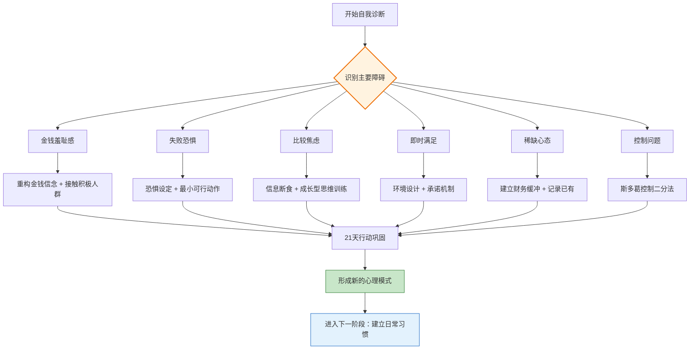

## 3.2 克服搞钱路上的心理障碍

上一节我们描绘了成功搞钱者的特质画像——目标清晰、持续学习、平衡风险、延迟满足。但知道"该成为什么样的人"和"真正成为那样的人"之间，隔着一道看不见的墙。这道墙不是能力不足、不是资源匮乏，而是**内心深处的心理障碍**。

心理学家 Abraham Maslow 提出的"约拿情结"（Jonah Complex）描述了一种普遍现象：人们不仅害怕失败，**更害怕成功**。因为成功意味着走出舒适区、承担更大的责任、面对未知的挑战。搞钱路上的心理障碍，本质上是大脑的自我保护机制在过度运转。



本节系统拆解搞钱路上最常见的六种心理障碍，从神经科学和行为经济学的角度解释其成因，并提供经过验证的克服方法。记住：**识别障碍本身就是克服障碍的一半**。

---

### 3.2.1 对金钱的羞耻感：最隐蔽的搞钱杀手

#### 现象描述

"谈钱俗气"、"赚钱是贪婪的表现"、"君子喻于义，小人喻于利"——这些观念深植在很多人的潜意识中，形成了一种对金钱的系统性羞耻感。

这种羞耻感的危险之处在于，它不是让你"不想赚钱"，而是让你在赚钱时感到**内疚和不安**，从而在潜意识中破坏自己的搞钱行为。心理学家称之为"金钱回避"（Money Avoidance）——Klontz 等人在2011年发表在《Journal of Financial Therapy》上的研究发现，约25%的人存在显著的金钱回避倾向，这类人群的平均收入和净资产显著低于其他人群。

#### 羞耻感的四个来源

| 来源 | 典型观念 | 心理机制 | 影响范围 |
|------|---------|---------|---------|
| **传统文化** | "君子喻于义，小人喻于利"（孔子）；"安贫乐道"；"铜臭味" | 将金钱与道德对立，追求财富被等同于道德堕落 | 深受儒家文化影响的知识分子群体 |
| **家庭教育** | "钱够用就行"；"我们家不是有钱人"；"谈钱伤感情" | 通过代际传递形成的金钱信念系统，往往在无意识中被继承 | 成长于经济紧张但"不好意思谈钱"的家庭 |
| **社会环境** | "有钱人都不是好人"；"无商不奸"；"为富不仁" | 幸存者偏差+媒体选择性报道，放大了负面案例 | 对商业世界缺乏直接接触的人群 |
| **职场文化** | "谈涨薪不好意思"；"和同事讨论收入是禁忌" | 组织文化对金钱话题的压抑，导致员工不了解自己的市场价值 | 长期在单一组织内工作的职场人 |

#### 金钱羞耻感的深层心理机制

从精神分析的角度，金钱在很多人的潜意识中与以下概念绑定：

1. **权力与控制**：金钱意味着权力，追求金钱被视为"有野心"，而在强调谦逊的文化中，野心是被压制的
2. **爱与关注**：童年时期如果"要钱"被父母拒绝或批评，会在潜意识中形成"要钱=不被爱"的联结
3. **自我价值**：当自我价值感不足时，会认为自己"不配"拥有财富，从而在搞钱时自我破坏

#### 克服金钱羞耻感的五步法

**第一步：觉察——识别你的金钱信念**

拿出一张纸，写下你关于金钱的所有信念。不用思考对错，只是记录。例如：
- "有钱人都是靠不正当手段赚钱的"
- "赚钱太辛苦了，不值得"
- "我这种人不可能赚大钱"
- "谈钱会让别人看不起我"

**第二步：追溯——找到信念的源头**

对每一条信念，问自己：这个想法最早是从哪里来的？谁告诉我的？当时的情境是什么？

通常你会发现，80%以上的金钱信念来自父母和童年经历，而非你自己的独立判断。

**第三步：质疑——用理性审视信念的合理性**

对每条信念，问三个问题：
1. 这个信念是事实还是观点？
2. 这个信念对我有帮助还是有阻碍？
3. 我认识的人中，有没有反例？

**第四步：重构——建立新的金钱信念**

| 旧信念 | 新信念 | 为什么更合理 |
|--------|--------|-------------|
| 谈钱俗气 | 谈钱是成年人的基本能力 | 不谈钱导致信息不对称，反而吃亏 |
| 赚钱是贪婪 | 赚钱是价值交换的自然结果 | 你提供价值、获得回报，这是公平交易 |
| 有钱人都不是好人 | 有钱人里有好人也有坏人，和所有人一样 | 用个案推断整体是逻辑谬误 |
| 钱够用就行 | 财务安全带来选择自由 | "够用"的标准会变，没有安全垫很脆弱 |
| 我不配有钱 | 我和所有人一样，值得通过合法劳动获得财富 | 财富不是道德奖惩，而是价值创造的副产品 |

**第五步：行动——用行为验证新信念**

信念的改变不能只靠思考，必须通过行动来巩固。从最小的行动开始：
- 主动和朋友讨论一次理财话题
- 认真评估自己的市场价值，更新一次简历
- 读一本关于财富的传记，了解正面的财富故事
- 尝试一次副业，体验"用自己的能力赚钱"的感觉

> **关键洞见**：研究发现，仅仅是"命名"情绪（"我现在感到羞耻"）就能降低杏仁核的激活水平。这被称为"情感标签效应"（Affect Labeling），由 UCLA 的 Matthew Lieberman 团队在2007年通过fMRI实验验证。所以，当你感到搞钱羞耻时，对自己说"我现在感到对金钱的羞耻感"，这个动作本身就能削弱羞耻感的强度。

---

### 3.2.2 失败恐惧与完美主义：行动的绊脚石

#### 现象描述

"万一亏了怎么办？"、"我还没准备好"、"等条件成熟了再说"——这些想法听起来理性，实际上是恐惧和完美主义在伪装成谨慎。

失败恐惧和完美主义是一对孪生兄弟：**恐惧告诉你"太危险了"，完美主义告诉你"还不够好"**。两者合力，把你的行动冻结在起点。

#### 失败恐惧的心理学解析

心理学家 Martin Seligman 的研究表明，人类对失败的恐惧源于"习得性无助"（Learned Helplessness）——当一个人反复经历失败且无法控制结果时，会形成"无论怎么做都没用"的信念，从而放弃尝试。

但失败恐惧还有更深层的机制：

**1. 损失厌恶的放大效应**

Daniel Kahneman 的前景理论揭示：**人们对损失的敏感度是收益的2-2.5倍**。这意味着：
- 亏1万元的痛苦 ≈ 赚2.5万元的快乐
- 这种不对称导致人们过度规避风险，宁愿不赚钱也不愿承担可能的损失

**2. 社会评价恐惧**

人是社会性动物，对"被他人评价"的恐惧根植于进化本能。在搞钱场景中，失败不仅是经济损失，更意味着"被别人看笑话"。研究表明，社会评价恐惧在集体主义文化（如中国）中尤为显著。

**3. 身份认同威胁**

当一个人把"成功"与"自我价值"绑定时，失败就不再是"一件事没做好"，而是"我这个人不行"。这种身份认同威胁是最深层的恐惧来源。

#### 完美主义的三种类型

| 类型 | 核心信念 | 表现 | 在搞钱中的危害 |
|------|---------|------|-------------|
| **自我导向型** | "我必须做到完美" | 对自己要求极高，不允许犯错 | 永远在"准备"中，从不开始 |
| **他人导向型** | "别人必须认可我" | 极度在意他人评价 | 因害怕批评而放弃任何公开尝试 |
| **社会规定型** | "社会要求我完美" | 认为环境在施加完美压力 | 用"条件不成熟"作为不行动的借口 |

> **研究数据**：心理学家 Paul Hewitt 和 Gordon Flett 的研究发现，"社会规定型完美主义"与拖延行为的相关性最高（r=0.45）。这类完美主义者不是不想行动，而是被"必须达到外界标准"的执念所瘫痪。

#### 克服失败恐惧的系统方法

**方法一：恐惧设定（Fear Setting）——Tim Ferriss 实践法**

这是 Tim Ferriss 在 TED 演讲中推荐的方法，比传统的"目标设定"更有效：

```text
第一步：定义恐惧
如果我尝试 [具体行动]，最坏的结果是什么？
列出所有可能的最坏结果（至少10个）

第二步：预防措施
对于每个最坏结果，我能做什么来降低其发生的概率？
（每条至少写1个预防措施）

第三步：修复方案
如果最坏结果真的发生了，我能做什么来弥补？
（每条至少写1个修复方案）

第四步：评估不行动的代价
如果我什么都不做，6个月后、1年后、3年后会怎样？
（把不行动的代价具体化）

第五步：做出决定
对比"行动的最坏结果"和"不行动的确定代价"，选择更小的那个。
```

**方法二：最小可行动作（Minimum Viable Action）**

把任何搞钱行动拆解到"小到不可能失败"的程度：

| 目标 | 最小可行动作 | 启动成本 |
|------|------------|---------|
| 开始投资 | 开一个证券账户，不投钱 | 30分钟 |
| 开始写公众号 | 写一篇500字的文章，不发布 | 1小时 |
| 开始做副业 | 和3个做过副业的人聊一次 | 2小时 |
| 学习理财 | 读一本理财书的第一章 | 30分钟 |
| 找到新工作 | 更新简历的一个模块 | 30分钟 |

**方法三：重新定义失败——失败资产负债表**

失败不是"终点"，而是一笔"投资"。用资产负债表的视角看待每次失败：

```text
失败资产（得到的）：
├── 经验教训：知道了什么方法行不通
├── 人脉资源：在过程中认识的人
├── 技能提升：过程中学到的新技能
├── 信息优势：对市场的更深理解
└── 心理韧性：下次面对类似情况更有信心

失败负债（失去的）：
├── 时间成本：投入的时间
├── 资金成本：投入的金钱
└── 机会成本：这段时间本可以做的事

关键判断：如果资产 > 负债，这次失败就是"盈利"的。
```

**案例深度分析：一个创业失败者的"失败复盘"**

小赵在2022年开了一家奶茶店，投入15万元，经营8个月后关闭，亏损约10万元。

失败资产清单：
- 学会了选址方法论（后来帮朋友避开了一个坑位，省了20万）
- 建立了供应商人脉（其中一个供应商后来成了他第二个项目的合作伙伴）
- 理解了餐饮行业的现金流管理（这是MBA课程教不了的实战知识）
- 认识了同一条街的5个店主（其中2个成了长期朋友）
- 心理承受能力显著增强（"10万块买来的心理韧性课"）

小赵的第二次创业——一个线上烘焙品牌，投入仅2万元，因为有了第一次的经验，第一年就实现了盈利。他说："第一次失败不是亏了10万，是花10万买了张'创业大学'的入场券。"

#### 克服完美主义的实用策略

**1. "70分开始"法则**

不要等到准备到100分才行动。70分就可以开始，剩下的30分在行动中学习和调整。

**2. 设定"失败配额"**

每个月给自己设定一个"必须失败"的配额——比如，本月至少要尝试3件可能失败的事。当"失败"从"要避免的坏事"变成"要完成的任务"时，恐惧感会大幅降低。

**3. "最坏情况"推演法**

Stoic哲学家称之为"消极想象"（Negative Visualization）：
1. 问自己：如果这件事失败了，最坏会怎样？
2. 然后问：这个最坏情况我能承受吗？
3. 最后问：一年后这件事还重要吗？

在绝大多数情况下，最坏情况远没有想象中那么可怕，而且往往是可承受的。

---

### 3.2.3 比较心理与焦虑：节奏的破坏者

#### 现象描述

打开朋友圈，看到前同事晒年终奖；刷小红书，看到同龄人买了房；逛知乎，看到别人月入十万——比较之后，焦虑涌上心头，开始怀疑自己的方向和进度。

比较心理的危害不仅在于让你不开心，更在于它会**打乱你自己的节奏**。当你因为别人赚钱而焦虑时，你可能放弃自己正在做的事，盲目跟风，最终一事无成。

#### 社会比较理论的科学解释

心理学家 Leon Festinger 在1954年提出"社会比较理论"（Social Comparison Theory）：人类有一种内在驱力，需要通过与他人比较来评估自己的能力和观点。

社会比较有两种方向：

| 比较方向 | 定义 | 心理效果 | 搞钱场景中的表现 |
|---------|------|---------|---------------|
| **上行比较** | 与比自己优秀的人比较 | 短期激励，长期焦虑 | 看到别人月入10万，觉得自己不行 |
| **下行比较** | 与不如自己的人比较 | 短期安慰，长期停滞 | "至少比大多数人强"，放弃努力 |

两种比较都不健康：上行比较导致焦虑和自我否定，下行比较导致自满和停滞。

#### 社交媒体如何加剧比较焦虑

社交媒体创造了一个**扭曲的现实镜像**：

1. **幸存者偏差**：你看到的都是成功案例，因为失败者不会发朋友圈
2. **精心策划的展示**：别人展示的是"精选集"，不是"完整版"
3. **算法放大**：平台算法会推送更多让你焦虑的内容（因为焦虑让你刷得更久）
4. **匿名夸大**：网络上大量"月入十万"的帖子，很多是虚构的，用来引流或卖课

> **数据佐证**：2019年发表在《Journal of Social and Clinical Psychology》上的一项实验研究（Hunt等）发现，将社交媒体使用时间限制在每天30分钟以内，可以在3周内显著降低孤独感和抑郁症状。参与者报告的比较焦虑也显著下降。

#### 克服比较焦虑的四层方法

**第一层：认知层——理解比较的荒谬性**

比较之所以荒谬，因为你在拿自己的"幕后花絮"和别人的"精彩剪辑"做对比。更关键的是：

- **起点不同**：别人的起点可能是三代人的积累，你的起点可能从零开始
- **赛道不同**：A在互联网，B在传统行业，收入差距可能是行业红利，不是能力差距
- **时间线不同**：有人25岁成功，有人45岁才爆发，每个人的节奏不同
- **可见性偏差**：你看到的是别人的收入，看不到的是他们的压力、牺牲和焦虑

**第二层：行为层——切断比较的信息源**

| 行动 | 具体做法 | 预期效果 |
|------|---------|---------|
| 信息断食 | 每天设定1-2个固定时段看社交媒体，其余时间关闭通知 | 减少50%以上的被动比较机会 |
| 清理关注列表 | 取关让你焦虑的账号，关注有实质内容的创作者 | 信息环境从"比较场"变成"学习场" |
| 设置使用时限 | 使用手机自带的屏幕时间管理功能，限制社交App使用 | 物理限制比意志力更可靠 |
| 替换信息输入 | 用读书、播客、课程替代刷社交媒体 | 用高质量输入替代低质量刷屏 |

**第三层：参照层——建立正确的比较基准**

不要和别人比，和以下三个参照物比：

```text
参照物1：过去的自己
- 3个月前的我在哪？现在在哪？
- 关键指标：收入、技能、认知、人脉

参照物2：行业基准
- 我所在行业/岗位的平均收入是多少？
- 我处于什么百分位？
- 这个比较是为了校准，不是为了焦虑

参照物3：自己的目标
- 我的OKR完成进度如何？
- 本月比上月进步了多少？
- 这才是最有意义的比较
```

**第四层：心态层——从"竞争思维"转向"成长思维"**

心理学家 Carol Dweck 的研究表明，拥有"成长型思维"的人把他人成功视为学习机会而非威胁。

具体转变：

| 固定思维（竞争） | 成长思维（学习） |
|----------------|----------------|
| "他赚得比我多，我不行" | "他赚得比我多，我来研究他的方法" |
| "这个行业太卷了" | "行业活跃说明有机会，关键是怎么切入" |
| "我没有他的资源/背景" | "我有什么独特优势可以发挥？" |
| "别人成功是因为运气" | "运气只是一部分，他的策略和执行力值得学习" |

---

### 3.2.4 即时满足的诱惑：复利的天敌

#### 现象描述

即时满足是搞钱路上最普遍、最日常的心理障碍。它不像羞耻感和恐惧那样明显，而是渗透在每一个日常选择中：今天是学习还是追剧？这笔钱是存起来还是花掉？这个月是投资自己还是买个新手机？

每一次选择即时满足，都是在用"未来的你"为"现在的你"买单。

#### 延迟折扣：大脑的"时间贴现"机制

行为经济学中的"延迟折扣"（Temporal Discounting）理论解释了为什么即时满足如此诱人：

**大脑对"现在的价值"和"未来的价值"使用不同的估值系统**。

```text
延迟折扣公式：
主观价值 = 实际价值 ÷ (1 + 折扣率 × 延迟时间)

示例：
- 现在给你100元 vs 一个月后给你120元
- 如果你的折扣率是每月20%：
  - 现在100元的主观价值 = 100元
  - 一个月后120元的主观价值 = 120 ÷ (1 + 0.2×1) = 100元
  - 结论：两者等价，你会选择"现在就拿100元"
- 如果你的折扣率是每月5%：
  - 一个月后120元的主观价值 = 120 ÷ 1.05 = 114.3元
  - 结论：等待更值钱，你会选择等待
```

**折扣率高的人**更倾向于即时满足，**折扣率低的人**更倾向于延迟满足。好消息是，折扣率可以通过训练降低。

#### 即时满足在搞钱中的典型表现

| 表现 | 即时满足的选择 | 延迟满足的选择 | 10年后的差距 |
|------|-------------|-------------|------------|
| 消费习惯 | 刷信用卡买最新款手机 | 使用现有手机，把钱投入指数基金 | 约5-8万元（含投资收益） |
| 学习投资 | 每天刷短视频2小时 | 每天学习1小时+实操1小时 | 技能差距带来的收入差距可能达数倍 |
| 健康管理 | 每天点外卖+熬夜追剧 | 自己做饭+规律作息 | 医疗支出差异+精力差异带来的效率差距 |
| 储蓄习惯 | 月光，有多少花多少 | 先储蓄30%，再规划消费 | 以月薪1万计，10年差距约36万+投资收益 |
| 职业选择 | 选择轻松但没成长的工作 | 选择有挑战但能提升能力的工作 | 职业天花板的差距可能是3-5倍 |

#### 克服即时满足的系统方法

**方法一：环境设计——不靠意志力，靠系统**

意志力是有限资源，不要和自己的本能硬碰硬。通过改变环境来降低即时满足的可能性：

```text
减少诱惑源：
├── 删除手机上的购物App（需要时再装）
├── 取消信用卡，使用借记卡（花的是真金白银）
├── 不在饥饿时逛超市（防止冲动消费）
├── 把手机放在另一个房间充电（防止熬夜刷手机）
└── 设定"花钱冷却期"：任何超过500元的消费，等48小时再决定

增加延迟满足的便利性：
├── 设置工资日自动转账到投资账户（先储蓄后消费）
├── 把学习资料放在桌面最显眼的位置
├── 准备好运动装备放在门口（降低运动的启动成本）
└── 和朋友约定互相监督（社交压力是强大的行为驱动力）
```

**方法二：承诺机制——让"理性自我"约束"冲动自我"**

Ulysses Contract（尤利西斯契约）：在理性清醒的时候，为未来冲动的自己设定约束。

实践形式：
- **自动扣款**：设置每月自动定投，让你"花不了"这笔钱
- **公开承诺**：在朋友圈宣布自己的储蓄目标，社交压力会约束你
- **惩罚机制**：和朋友约定，如果月消费超过预算，要给对方转500元
- **提前锁定**：把钱存入定期或封闭式基金，取出有成本

**方法三：替代满足——用健康的方式获得多巴胺**

即时满足的本质是多巴胺驱动的。你不需要消除多巴胺，只需要用更健康的方式获取它：

| 替代前（高成本） | 替代后（低成本） | 原理 |
|----------------|----------------|------|
| 冲动购物 | 整理和优化已有的物品 | "重新发现"也能触发多巴胺 |
| 刷短视频 | 阅读一本好书 | 好书同样提供新奇感和愉悦感 |
| 吃垃圾食品 | 自己做一顿精致的饭 | 烹饪过程本身提供成就感 |
| 和别人比较 | 记录自己的进步 | 看到自己的成长曲线产生满足感 |
| 无目的消费 | 设定一个储蓄里程碑并庆祝 | 里程碑奖励比随机消费更有满足感 |

**方法四：可视化未来——缩短"心理距离"**

延迟折扣之所以发生，是因为未来的收益在心理上显得"不真实"。通过可视化技术，让未来变得具体、生动、有情感连接：

1. **写一封给10年后自己的信**：描述你理想中的生活场景，越具体越好
2. **制作"梦想板"**：把你想要的生活用图片展示出来，放在每天能看到的地方
3. **计算"时薪"**：把自己的收入换算成时薪，每次消费时问自己"这值我X小时的工作吗？"
4. **复利计算器**：每次想冲动消费时，用复利计算器算一下这笔钱10年后的价值

---

### 3.2.5 稀缺心态：贫穷的心理陷阱

#### 现象描述

稀缺心态（Scarcity Mindset）是一种认为"资源永远不够"的心理状态。它不仅出现在经济困难的人身上，很多收入不低的人也深陷其中——因为稀缺感的本质不是"真的缺"，而是"感觉缺"。

哈佛大学教授 Sendhil Mullainathan 和普林斯顿大学教授 Eldar Shafir 在合著的《稀缺》一书中揭示了一个关键发现：**稀缺心态会降低人的认知能力，导致"管窥效应"（Tunneling）——你只能看到眼前的紧急事务，忽略了更重要的长期规划**。

#### 稀缺心态的具体表现

```text
稀缺心态的行为模式：

1. 带宽不足
   - 大脑被"怎么省钱"、"怎么还信用卡"占据
   - 没有认知资源用于思考长期规划和自我提升
   - 决策质量下降，更容易做出短视选择

2. 管窥效应
   - 只关注眼前最紧急的事（下个月的房租）
   - 忽略最重要的事（建立长期收入来源）
   - 陷入"救火模式"，永远在应对紧急情况

3. 借用行为
   - 用信用卡透支未来
   - 用明天的时间弥补今天的拖延
   - 用下一个项目的钱填补当前项目的窟窿

4. 余闲缺失
   - 日程排得太满，没有缓冲时间
   - 财务上月光，没有应急储备
   - 精力上透支，没有恢复空间
```

#### 稀缺心态 vs 富足心态

| 维度 | 稀缺心态 | 富足心态 |
|------|---------|---------|
| 对机会的看法 | "机会有限，必须抓住每一个" | "机会很多，选择最适合我的" |
| 对金钱的态度 | "钱永远不够" | "钱是流动的，可以创造更多" |
| 对时间的感受 | "时间总是不够用" | "时间可以通过系统来优化" |
| 对失败的反应 | "完了，又损失了" | "学到了什么？下次怎么做得更好？" |
| 对他人的态度 | "别人的成功意味着我的失败" | "别人的成功证明这条路走得通" |
| 决策模式 | 基于恐惧和紧迫感 | 基于价值观和长期目标 |
| 消费习惯 | "便宜就好" | "性价比和长期价值" |

#### 从稀缺心态到富足心态的转变路径

**第一步：建立财务缓冲——打破稀缺循环的物理基础**

稀缺心态最顽固的根源是"真的缺"。如果你的银行账户余额只够支撑一个月的生活，你的大脑确实会进入稀缺模式。

打破方法：
- 先建立一个"应急基金"：金额为3-6个月的生活支出
- 这个基金不用于投资，只用于消除"下个月怎么办"的焦虑
- 一旦有了这个缓冲，大脑的"带宽"会显著释放出来

**第二步：记录"已有"——训练大脑看到丰足**

稀缺心态让人只关注"缺什么"。通过有意识地记录"有什么"来反转这个模式：

```text
每天晚上记录三件事：
1. 今天我拥有什么（健康、技能、人脉、时间、机会）
2. 今天我学到了什么（新知识、新技能、新认知）
3. 今天我创造了什么价值（帮助了谁、完成了什么）

坚持21天后，你会发现自己对"资源"的感知发生了根本性改变。
```

**第三步：重新定义"足够"——从无限欲望到有意识的满足**

稀缺心态的一个核心问题是"永远不够"。解决方案不是赚更多的钱，而是定义"多少是足够的"。

练习：计算你的"够用线"
```text
月固定支出（房租、水电、饮食、交通）= _____
月变动支出（社交、娱乐、购物）= _____
月储蓄目标 = _____
月投资目标 = _____
月学习投资 = _____
────────────
月"够用线" = _____

年"够用线" = 月"够用线" × 12 = _____

当你知道自己"够用"的具体数字后，焦虑会大幅降低。
```

---

### 3.2.6 控制幻觉与习得性无助：努力无用论的陷阱

#### 现象描述

这一类心理障碍表现为两种看似矛盾但实则同源的心态：

**控制幻觉**："我肯定能行，这次一定中"——过度高估自己对随机事件的控制力，常见于赌博、投机、盲目创业。

**习得性无助**："反正怎么做都没用"——过度低估自己对可控事件的影响力，常见于反复失败后放弃尝试。

两者共同的底层问题是：**分不清"什么是我能控制的"和"什么是我不能控制的"**。

#### 斯多葛控制二分法

古希腊斯多葛学派的核心智慧之一是"控制二分法"（Dichotomy of Control）：

```text
我能控制的（内圈）：
├── 我的想法和信念
├── 我的行动计划
├── 我的努力程度
├── 我的态度和情绪管理
├── 我选择投入时间做什么
└── 我如何回应发生的事

我不能控制的（外圈）：
├── 市场的涨跌
├── 别人的决定和看法
├── 宏观经济形势
├── 政策变化
├── 竞争对手的行为
└── 运气和随机事件

搞钱高手的做法：
→ 把100%的精力投入内圈
→ 对外圈保持关注但不焦虑
→ 建立系统来应对外圈的不确定性
```

#### 克服方法：建立"可控性评估"习惯

面对任何搞钱机会或挑战时，用以下框架评估：

| 问题 | 类型 | 我的行动 |
|------|------|---------|
| 这件事的结果，有多少比例是我能控制的？ | 评估 | 如果>50%，全力投入；如果<20%，谨慎对待 |
| 我能控制的部分，我是否已经做到了极致？ | 自检 | 如果没有，先把可控部分做到位 |
| 我不能控制的部分，我是否准备了应对方案？ | 预案 | 用"如果...那么..."的预案降低不确定性 |

---

### 3.2.7 心理障碍的综合诊断与系统克服

#### 自我诊断清单

以下清单帮你识别自己最需要克服的心理障碍。勾选所有符合你的描述：

**金钱羞耻感（勾选数：___）**
- [ ] 谈论收入时感到不自在
- [ ] 觉得追求财富有些"俗气"
- [ ] 不好意思和客户/老板谈价格
- [ ] 潜意识里觉得有钱人不好

**失败恐惧（勾选数：___）**
- [ ] 有很多想法但不敢行动
- [ ] 总是觉得"还没准备好"
- [ ] 回避任何有风险的尝试
- [ ] 失败一次后很难再鼓起勇气

**比较焦虑（勾选数：___）**
- [ ] 经常在社交媒体上感到焦虑
- [ ] 看到同龄人成功会自我怀疑
- [ ] 经常改变自己的方向去追赶别人
- [ ] 很难为别人的成功真心高兴

**即时满足（勾选数：___）**
- [ ] 经常冲动消费后后悔
- [ ] 难以坚持需要长期才能看到结果的事
- [ ] 每月储蓄率低于收入的20%
- [ ] 经常把学习/工作推到明天

**稀缺心态（勾选数：___）**
- [ ] 经常觉得钱不够用（即使收入不低）
- [ ] 做决定时总是先考虑"亏了怎么办"
- [ ] 日程排得很满，没有余闲
- [ ] 很难拒绝"看起来划算"的机会

**控制幻觉/习得性无助（勾选数：___）**
- [ ] 相信某种"方法"能保证赚钱
- [ ] 或者觉得"努力也没什么用"
- [ ] 很难区分运气和实力的作用
- [ ] 对不确定性感到极度焦虑

#### 根据诊断结果的针对性建议

| 得分最高的类型 | 建议优先阅读 | 建议练习 |
|-------------|------------|---------|
| 金钱羞耻感 | 本节3.2.1 + 第1章金钱观 | 金钱信念追溯练习 |
| 失败恐惧 | 本节3.2.2 + 心态调整技巧 | 恐惧设定 + 最小可行动作 |
| 比较焦虑 | 本节3.2.3 + 信息节食方法 | 信息断食 + 自我进步记录 |
| 即时满足 | 本节3.2.4 + 延迟满足深度拓展 | 48小时冷静期 + 环境设计 |
| 稀缺心态 | 本节3.2.5 + 富足心态训练 | 感恩日记 + "够用线"计算 |
| 控制问题 | 本节3.2.6 + 决策框架 | 可控性评估练习 |



#### 重要提醒：心理障碍不是一次性解决的

克服心理障碍不是"读完这一节就搞定了"的事情。它是一个持续的过程，需要：

1. **反复觉察**：每次做出非理性决策时，回溯是哪种心理障碍在作怪
2. **持续练习**：认知行为疗法的研究表明，新的思维模式需要至少8周的持续练习才能固化
3. **自我慈悲**：偶尔被心理障碍影响是正常的，不要因为"又犯了"而自我批评——自我批评本身就是另一种心理障碍
4. **寻求支持**：如果某种心理障碍严重影响了你的生活和决策，考虑寻求专业心理咨询师的帮助

> **下一节预告**：清除了心理障碍之后，接下来需要建立支撑搞钱的日常习惯系统。3.3节将详细讲解记账、学习、人脉、健康四大习惯的科学养成方法。

***
