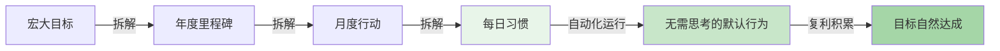
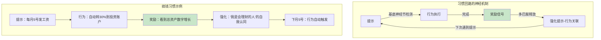
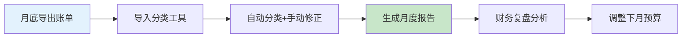
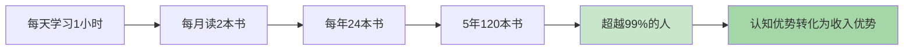
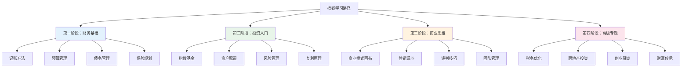
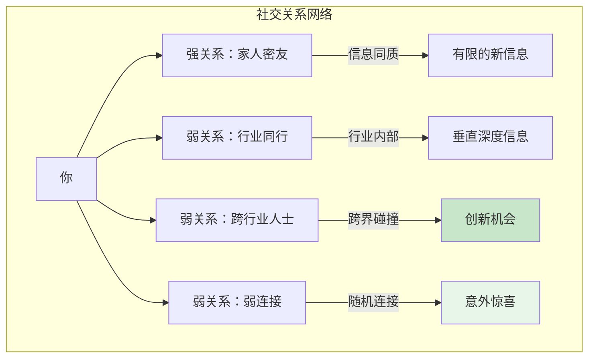
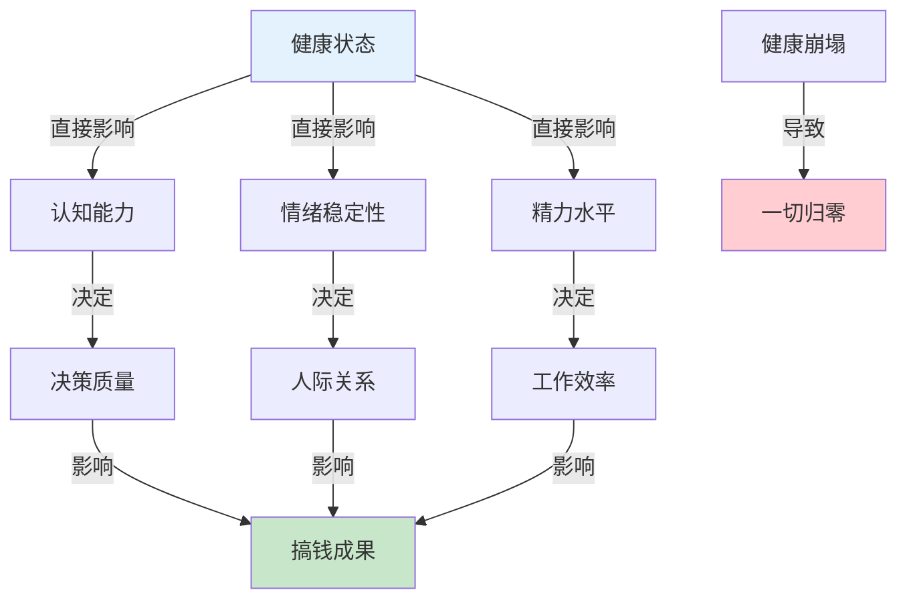
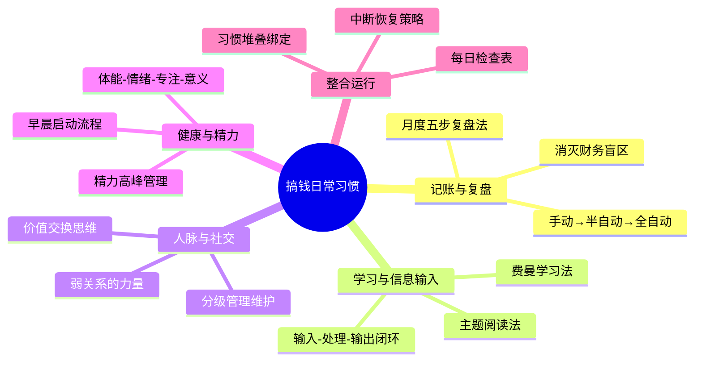

## 3.3 建立搞钱的日常习惯

上一节我们拆解了搞钱路上的心理障碍——金钱羞耻、失败恐惧、稀缺心态。认识到障碍只是第一步，真正的转变发生在**日常行为的系统性重塑**中。本节的核心命题是：如何把"想搞钱"的念头，转化为一组自动运行的日常习惯，让财富积累成为一种无需意志力驱动的默认行为。

### 为什么习惯比目标更重要

大多数人搞钱失败，不是因为目标不够宏大，而是因为**没有把目标嵌入日常行为系统**。目标告诉你"去哪里"，习惯决定你"每天做什么"。

哈佛商学院教授克莱顿·克里斯坦森（Clayton Christensen）在《你要如何衡量你的人生》中指出：战略不是你声明了什么，而是你每天实际在做什么。一个人声称要财务自由，但每天下班后刷手机三小时、从不记账、从不学习投资——他的"真实战略"是维持现状。

这里有一个关键的认知框架：

| 维度 | 目标导向思维 | 习惯导向思维 |
|------|------------|------------|
| 关注点 | 结果（存够100万） | 过程（每天自动储蓄） |
| 情绪状态 | 达成前焦虑，达成后空虚 | 每天都有掌控感 |
| 抗风险能力 | 一次挫折可能放弃 | 系统自动运转，不怕中断 |
| 复利效应 | 线性增长 | 指数增长（习惯叠加） |
| 可持续性 | 依赖意志力，容易耗竭 | 依赖系统，意志力消耗极低 |



### 习惯养成的神经科学基础

要建立习惯，首先要理解习惯在大脑中是如何运作的。

MIT研究人员在20世纪90年代发现，习惯的形成与大脑中的**基底神经节**（Basal Ganglia）密切相关。当我们学习一个新行为时，大脑前额皮层（负责决策）高度活跃。但随着行为重复，基底神经节开始接管，行为逐渐"自动化"，前额皮层的参与度大幅下降。这就是为什么你不需要"决定"怎么系鞋带——习惯已经把行为编码成了一套自动程序。

习惯回路（Habit Loop）由三个核心组件构成：

1. **提示（Cue）**：触发行为的信号。可以是时间（早上7点）、地点（到公司）、情绪（感到焦虑）、前序动作（吃完午饭）
2. **行为（Routine）**：被触发的具体动作。这是你通常所说的"习惯"
3. **奖励（Reward）**：行为完成后大脑获得的满足感。可以是物质的（一杯咖啡）、情感的（成就感）、生理的（多巴胺释放）



詹姆斯·克利尔（James Clear）在《原子习惯》中提出了著名的"四定律"，这是目前最实用的习惯建立框架：

| 定律 | 目标 | 搞钱习惯应用 |
|------|------|-------------|
| 第一定律：让它显而易见 | 设计环境中的提示 | 把记账App放在手机首屏 |
| 第二定律：让它有吸引力 | 将习惯与愉悦绑定 | 记账后奖励自己一杯好咖啡 |
| 第三定律：让它简单易行 | 降低启动门槛 | 只记一笔大额消费也行 |
| 第四定律：让它令人满足 | 提供即时奖励 | 每周看资产增长曲线 |

> **关键数据**：伦敦大学学院（UCL）的Phillippa Lally等人在2009年的研究中发现，习惯养成的平均时间是66天，而非流行说法的21天。简单习惯（如喝水）可能只需18天，复杂习惯（如运动、投资决策）可能需要254天。关键变量不是天数，而是**一致性**——偶尔跳一天不会破坏习惯，但连续跳三天就会显著削弱。

### 3.3.1 记账与财务复盘——搞钱习惯的基石

#### 为什么记账是第一优先级

在所有搞钱习惯中，记账排在第一位。原因很简单：**你无法管理你看不见的东西**。

行为经济学中有一个概念叫"心理账户"（Mental Accounting），由诺贝尔奖得主理查德·塞勒（Richard Thaler）提出。人类天生不善于准确追踪自己的财务状况——我们会高估收入、低估支出、遗忘零散消费。一项发表在《消费者研究期刊》上的研究显示，使用信用卡消费的人比使用现金的人平均多花12-18%，因为"刷卡"这个动作减少了"花钱"的心理痛感。

记账的本质作用是**打破财务盲区**：

- **消费盲区**：你以为自己每月只花3000，实际可能花了5000。记账把模糊的感觉变成精确的数字
- **模式盲区**：你不知道钱花在哪里最多。记账让你看到"拿铁因子"——那些不起眼但持续消耗的小额支出
- **趋势盲区**：你不知道自己的财务状况是在改善还是恶化。记账提供了时间序列数据，让你看到趋势

#### 记账方法体系

**层级一：手动记账（入门级）**

手动记账是最基础也最有效的方法，因为它要求你**主动面对每一笔消费**。

适用人群：刚开始建立记账习惯的人、需要高度掌控感的人、消费冲动较强需要"冷制动"的人。

工具选择：
- **Excel/Google Sheets**：最灵活，可以自定义分类和图表，适合喜欢数据分析的人
- **记账App**：随手记、Money Pro、Spendee、Money Manager。功能完善，操作便捷
- **纸质记账本**：极简主义，书写本身有"仪式感"，强化记账行为的奖励机制

记账模板（Excel版）：

```text
日期 | 类别 | 金额 | 支付方式 | 备注
-----|------|------|---------|------
6/1  | 餐饮 | 35   | 微信    | 午餐外卖
6/1  | 交通 | 6    | 支付宝  | 地铁
6/1  | 学习 | 99   | 微信    | 得到课程
```

每日记账的最佳实践：
1. **固定时间记账**：选择一个触发提示（如晚上刷牙前），每天在同一时间记账
2. **即时记录**：消费后立刻记录，不要等到晚上回忆——回忆一定会遗漏
3. **先记大类再细分**：刚开始不需要精确到每个子类，"餐饮""交通""学习"三个大类就够了
4. **允许不完美**：漏记一笔不等于失败。跳过一天不等于放弃。重新开始就好

**层级二：半自动记账（进阶级）**

利用技术手段减少手动输入的工作量，同时保持对消费的觉察。

方法：
- **银行App账单导出**：大部分银行App支持导出CSV格式的交易记录，直接导入Excel分析
- **支付宝/微信账单**：支付宝"账单"→"导出账单"；微信"钱包"→"账单"→右上角"常见问题"→"下载账单"
- **专业工具**：YNAB（You Need A Budget）、MoneyWiz、Beancount（开源，程序员友好）

半自动记账的核心流程：



**层级三：全自动监控（高级级）**

适合已经建立了良好记账习惯、不需要手动"触感"来强化行为的人。

方法：
- **多账户监控**：使用个人财务仪表盘工具（如Firefly III自建、Personal Capital、Copilot），聚合所有银行账户、投资账户、信用卡的实时数据
- **规则引擎**：设置自动分类规则（如"美团"→餐饮、"京东"→购物），自动标记异常消费（单笔超过500元）
- **预算预警**：设置每个类别的月度预算上限，超支自动推送提醒

#### 每月财务复盘：从数据到洞察

记账是收集数据，复盘才是**把数据变成行动**。没有复盘的记账，就像体检后不看报告。

**复盘五步法**：

**第一步：收入结构分析**

不要只看"总收入"这个数字，要拆解收入来源的构成：

| 收入来源 | 金额 | 占比 | 趋势 | 优化方向 |
|---------|------|------|------|---------|
| 主业工资 | 15000 | 75% | 稳定 | 争取加薪/晋升 |
| 副业收入 | 3000 | 15% | ↑增长 | 扩大规模 |
| 投资收益 | 1500 | 7.5% | ↑增长 | 优化配置 |
| 其他 | 500 | 2.5% | 波动 | — |
| **合计** | **20000** | **100%** | | |

关键指标：**被动收入占比**。当被动收入（投资收益、版税、租金等）超过生活支出时，你就实现了财务自由的基础条件。

**第二步：支出结构分析**

将支出分为四类，计算各类占比：

- **必要固定支出**（房租、房贷、保险）：目标<收入的30%
- **必要可变支出**（餐饮、交通、日用品）：目标<收入的20%
- **可选支出**（娱乐、社交、购物）：目标<收入的15%
- **投资/储蓄**：目标>收入的30%

**第三步：储蓄率计算**

储蓄率 = (收入 - 支出) / 收入 × 100%

| 储蓄率 | 评价 | 意味着 |
|-------|------|--------|
| <10% | 警告 | 财务状况脆弱，任何意外都可能造成危机 |
| 10-20% | 及格 | 在正轨上，但财务自由还需要很长时间 |
| 20-30% | 良好 | 大多数人的理想水平 |
| 30-50% | 优秀 | 可以在10-15年内实现财务自由 |
| >50% | 卓越 | 5-10年内可以实现财务自由 |

**第四步：投资收益复盘**

- 本月投资收益率 vs 基准（如沪深300、标普500）
- 各资产类别的收益贡献
- 是否需要调整资产配置

**第五步：目标进度检查**

设定具体的里程碑（如"年末存款达到10万"），每月检查进度：

```text
目标：年末存款10万
当前：已存6.5万（65%）
时间：已过6个月（50%）
状态：超前进度 ✓
```

如果进度落后，分析原因并制定追赶计划。如果进度超前，考虑是否提高目标。

#### 常见记账误区

| 误区 | 为什么是错的 | 正确做法 |
|------|------------|---------|
| "记账太麻烦了" | 前3分钟最痛苦，之后变成自动行为 | 用App一键导入，减少手动输入 |
| "我记了但控制不住" | 记账≠控制，需要配合预算系统 | 设定预算上限，超支时触发反思 |
| "小钱不用记" | 小钱是最大的财务漏洞 | 小钱最应该记，正是"拿铁因子"所在 |
| "记账让我焦虑" | 回避不会让问题消失 | 接受现实是改变的第一步 |
| "我记了几个月就够了" | 财务状况是动态变化的 | 至少坚持记12个月才能看到完整模式 |

### 3.3.2 定期学习与信息输入——搞钱的认知燃料

#### 为什么学习是搞钱的核心习惯

搞钱本质上是一个**认知变现**的过程。你对世界的理解越深，你能识别的机会越多，你做出的决策质量越高。

查理·芒格说过："我这辈子遇到的聪明人，没有不每天阅读的——没有，一个都没有。"沃伦·巴菲特每天花80%的时间在阅读上。比尔·盖茨每年读50本书。这不是因为他们"有时间"，而是阅读本身就是他们成功的**原因**，不是结果。

学习的复利效应：



一项发表在《应用心理学杂志》上的研究显示，持续学习的员工收入增长速度比不学习的员工快23%。另一项针对企业家的调查显示，每周阅读5小时以上的企业家，其企业存活率比不阅读的企业家高出2.5倍。

#### 搞钱学习的内容框架

搞钱相关的学习应该覆盖以下四大领域：

| 领域 | 核心知识 | 推荐入门资源 |
|------|---------|-------------|
| **财务知识** | 会计基础、税务、预算、现金流 | 《富爸爸穷爸爸》《小狗钱钱》 |
| **投资知识** | 资产配置、风险管理、市场分析 | 《聪明的投资者》《漫步华尔街》 |
| **商业知识** | 商业模式、营销、谈判、管理 | 《从零到一》《精益创业》 |
| **心理学** | 行为经济学、决策科学、消费心理 | 《思考，快与慢》《助推》 |

学习优先级建议：



#### 高效学习方法

**方法一：主题阅读法**

不要东一本西一本随机阅读，而是围绕一个主题集中阅读3-5本书。

操作步骤：
1. **选定主题**：比如本月主题是"指数基金投资"
2. **选书**：从豆瓣/Amazon找该主题评分最高的3-5本书
3. **快速浏览**：先读目录和序言，了解每本书的核心论点
4. **对比阅读**：找出各书观点的异同，形成自己的判断
5. **输出笔记**：写一篇该主题的综合笔记，用自己的话重新组织

**方法二：费曼学习法**

理查德·费曼（诺贝尔物理学奖得主）的学习方法核心是：**如果你不能用简单的语言解释一个概念，你就没有真正理解它**。

操作步骤：
1. 选择一个概念（如"复利"）
2. 假装你要向一个12岁的孩子解释它
3. 写下你的解释，用最简单的语言
4. 发现卡壳的地方——那就是你没理解的地方
5. 回去重新学习，直到能流畅解释

**方法三：输入-处理-输出闭环**

单纯阅读的留存率只有10%。要提高学习效果，必须建立完整的输入-处理-输出闭环：

| 环节 | 活动 | 留存率 |
|------|------|--------|
| 输入 | 阅读、听课、看视频 | 10% |
| 处理 | 做笔记、画思维导图、讨论 | 50% |
| 输出 | 写文章、教别人、实际应用 | 90% |

#### 每日学习计划模板

不要依赖意志力"找时间学习"，而是把学习嵌入已有的日常流程：

**通勤时间（30-60分钟）**：
- 听财经播客：推荐《得意忘形》《商业就是这样》《硅谷101》
- 听有声书：微信读书、喜马拉雅的财经类有声书
- 听行业新闻：36氪、虎嗅的音频版

**午休时间（15-20分钟）**：
- 阅读财经公众号文章
- 刷行业资讯（雪球、集思录、少数派）
- 做笔记卡片（用Flomo、Notion记录灵感）

**晚间时间（30-60分钟）**：
- 深度阅读：每天30-50页书籍
- 学习课程：得到、极客时间、Coursera
- 实践操作：更新投资组合、分析财务数据

**周末（2-4小时）**：
- 周复盘：整理本周学习笔记
- 主题阅读：集中阅读同一主题的书籍
- 社群学习：参加线上线下读书会

#### 常见学习误区

| 误区 | 为什么是错的 | 正确做法 |
|------|------------|---------|
| "收藏等于学习" | 收藏的知识你永远不会看 | 学完一个知识点就用一个 |
| "只学不练" | 知识不应用就会遗忘 | 学完立刻在小金额上实践 |
| "追求完美知识" | 永远等不到"准备好了"的那一天 | 学到70分就开始行动 |
| "只看免费内容" | 免费内容往往是碎片化的 | 为优质内容付费是投资，不是消费 |
| "学太多方向" | 样样通样样松 | 一个阶段聚焦一个主题 |

### 3.3.3 人脉维护与社交投资——搞钱的关系网络

#### 为什么社交是一种投资

斯坦福商学院教授杰弗里·普费弗（Jeffrey Pfeffer）的研究表明：在职场中，绩效只解释了约50%的晋升差异，另外50%由人际关系和政治技能决定。在创业领域，数据更极端——CB Insights对失败创业公司的调查显示，23%的失败原因直接归因于"团队/人际关系问题"。

社会学家马克·格兰诺维特（Mark Granovetter）在1973年的经典论文《弱关系的力量》中发现：大多数人找到工作（或商业机会）的渠道不是亲密的"强关系"（家人、密友），而是"弱关系"（不太熟的熟人）。因为强关系的信息圈子重叠度高，弱关系才能带来你圈子之外的新信息。



#### 人脉维护的系统方法

人脉不是"认识"就够的，需要**持续维护**。以下是经过验证的人脉维护系统：

**层级一：人脉分级管理**

将你认识的人分为四级，分配不同的维护精力：

| 级别 | 定义 | 人数 | 维护频率 | 维护方式 |
|------|------|------|---------|---------|
| 核心圈 | 可以深夜打电话求助的人 | 3-5人 | 每周 | 深度交流、共同活动 |
| 重要圈 | 有业务往来或深度信任的人 | 10-20人 | 每月 | 定期聚餐、信息分享 |
| 一般圈 | 认识但交集不多的人 | 50-100人 | 每季度 | 朋友圈互动、节日问候 |
| 外围圈 | 泛泛之交 | 不限 | 按需 | 社群互动、偶尔联系 |

**层级二：价值交换思维**

人脉的本质是**价值交换网络**。单向索取的关系注定不长久。在维护人脉时，首先要问"我能为对方提供什么"，而不是"对方能给我什么"。

你能提供的价值类型：
- **信息价值**：分享行业动态、有用的工具、靠谱的供应商
- **连接价值**：介绍对方需要认识的人
- **技能价值**：用你的专业技能帮对方解决问题
- **情绪价值**：倾听、鼓励、在对方低谷时给予支持
- **机会价值**：把合适的商业机会推荐给合适的人

**层级三：社交投资的具体行动**

每周社交行动清单：
1. **主动联系1个人**：不是群发问候，而是有具体内容的交流（"看到这篇文章想到你"、"上次你说的问题，我找到了一个解法"）
2. **帮1个人一个小忙**：不求回报的举手之劳，长期积累信任
3. **发1条有价值的内容**：朋友圈或社群分享有价值的信息，而不是无意义的刷屏
4. **接受1次邀约**：不要总是拒绝社交邀请，即使对方不是"重要"的人

每月社交行动清单：
1. **参加1次行业活动**：线下沙龙、行业峰会、Meetup
2. **组织或参加1次小型聚会**：3-5人的深度交流比大型活动更有效
3. **维护1段疏远的关系**：找一个很久没联系的老朋友/老同事，主动问候

#### 高质量社交的技巧

**技巧一：深度倾听**

大多数人社交时犯的最大错误是**说太多，听太少**。心理学家卡尔·罗杰斯（Carl Rogers）的研究表明，被深度倾听的人会对倾听者产生强烈的信任和好感。

实践方法：
- 提问后认真听，不要急着表达自己的观点
- 用复述确认理解："你的意思是……对吗？"
- 关注对方的情绪，而不只是事实
- 不要打断，让对方把话说完

**技巧二：给予而非索取**

亚当·格兰特（Adam Grant）在《给予与索取》中的研究发现：在职场中，最成功的不是"索取者"，而是"给予者"——那些主动帮助他人、不计较回报的人。给予者建立了最广泛、最深厚的信任网络，长期来看获得了最多的回报。

**技巧三：定期复盘社交ROI**

像复盘财务一样复盘你的社交投入：

- 本月参加了哪些社交活动？
- 产生了哪些有价值的连接或机会？
- 哪些关系需要加强维护？哪些可以降级？
- 下月的社交重点是什么？

#### 社交投资的常见误区

| 误区 | 为什么是错的 | 正确做法 |
|------|------------|---------|
| "多认识人就行" | 没有深度的关系无法提供实质帮助 | 质量优先，10个深度关系>100个名片 |
| "社交就是应酬" | 低质量社交消耗精力却无收益 | 选择性参加，宁缺毋滥 |
| "功利化社交" | 别人能感受到你的功利心 | 真诚交往，先给予后收获 |
| "社恐就不社交" | 社交是一项可以学习的技能 | 从线上社群开始，逐步扩展 |
| "只和同级别的人社交" | 错过向上和向下的价值交换 | 与不同层次的人都保持连接 |

### 3.3.4 健康管理与精力管理——搞钱的底层基础设施

#### 为什么健康是搞钱的第一优先级

很多人把健康管理放在"等我有钱了再说"的位置上。这是一个致命的错误。健康不是搞钱的"结果"，而是搞钱的**前提条件**。

世界卫生组织的数据：全球每年因健康问题导致的生产力损失高达12万亿美元。对个人而言，一场大病可以在几个月内耗尽数十年的积蓄。

更重要的是，健康直接影响你的**认知能力和决策质量**：

- **睡眠不足**：哈佛医学院研究显示，连续两周每天只睡6小时，认知能力下降到相当于连续48小时不睡觉的水平。这意味着你的判断力、创造力、反应速度全面退化
- **缺乏运动**：伊利诺伊大学研究发现，有氧运动后人的注意力和执行功能提升15-20%
- **饮食不当**：高糖饮食导致血糖波动，引起注意力下降和情绪不稳定
- **慢性压力**：皮质醇长期偏高会损害海马体（记忆中枢）和前额皮层（决策中枢）



#### 精力管理的四维模型

精力管理比时间管理更根本。时间是刚性的——每个人每天都只有24小时。但精力是弹性的——同样一小时，精力充沛时的产出可能是精力低谷时的5倍。

精力管理涉及四个维度：

**维度一：体能精力**

体能是精力金字塔的底层基础。

| 要素 | 最低标准 | 理想状态 | 搞钱影响 |
|------|---------|---------|---------|
| 睡眠 | 7小时/天 | 7-8小时，固定时间 | 决策质量的基石 |
| 运动 | 150分钟/周中等强度 | 3次力量+2次有氧 | 精力水平的燃料 |
| 饮食 | 三餐规律 | 低GI、高蛋白、充足水分 | 血糖稳定=注意力稳定 |
| 呼吸 | 正常呼吸 | 每天5分钟深呼吸练习 | 即时降低压力水平 |

**维度二：情绪精力**

积极情绪是高效工作的催化剂。芭芭拉·弗雷德里克森（Barbara Fredrickson）的"扩展-建构理论"指出：积极情绪不仅让你感觉好，还能扩展你的思维范围、增强创造力、改善人际关系。

维护情绪精力的方法：
- **感恩练习**：每天写下3件值得感恩的事（已证实能提升幸福感25%）
- **社交充电**：与让你感到愉快的人定期交流
- **情绪觉察**：识别情绪信号，在情绪低谷时不要做重要决策
- **边界管理**：学会说"不"，保护自己的情绪带宽

**维度三：专注精力**

专注是一种有限资源，需要像管理金钱一样管理它。

提升专注力的方法：
- **番茄工作法**：25分钟专注+5分钟休息，每4个番茄钟休息15-30分钟
- **时间块管理**：把一天分为若干时间块，每个时间块只做一类任务
- **环境设计**：工作区保持整洁，关闭不必要的通知
- **单任务模式**：多任务切换会消耗40%的有效工作时间

**维度四：意义精力**

这是最高层的精力来源。当你做的事情与你的核心价值观和长期目标一致时，你会拥有源源不断的内在动力。

找到意义精力的方法：
- 明确你的"为什么"——你搞钱的深层目的是什么？
- 将日常工作与长期愿景连接
- 定期反思：我现在做的事情是否在推动我靠近目标？

#### 日常精力管理实战

**早晨精力启动流程（30分钟）**：

1. 起床后不看手机（前30分钟避免信息轰炸）
2. 喝一杯温水（补充夜间流失的水分）
3. 5分钟拉伸或轻度运动（唤醒身体）
4. 5分钟冥想或深呼吸（稳定情绪）
5. 写下今天最重要的3件事（聚焦注意力）
6. 吃一顿有蛋白质的早餐（稳定血糖）

**工作日精力管理节奏**：

| 时间段 | 精力状态 | 适合做什么 | 不适合做什么 |
|--------|---------|-----------|-------------|
| 8:00-10:00 | 高峰 | 深度思考、重要决策、创造性工作 | 开会、处理邮件 |
| 10:00-12:00 | 中高 | 分析工作、学习、写作 | 休息、闲聊 |
| 12:00-14:00 | 低谷 | 午餐、轻度任务、散步 | 重要决策、复杂计算 |
| 14:00-16:00 | 中等 | 会议、协作、常规任务 | 深度思考 |
| 16:00-18:00 | 次高峰 | 收尾工作、计划、复盘 | 启动新项目 |
| 18:00-22:00 | 递减 | 运动、社交、轻松学习 | 重大决策、高强度工作 |

#### 健康管理常见误区

| 误区 | 为什么是错的 | 正确做法 |
|------|------------|---------|
| "等有空了再锻炼" | 永远不会有空，而且健康崩塌时一切都归零 | 把运动当作最重要的"会议"排进日程 |
| "年轻扛得住" | 现在透支的健康，30岁以后加倍偿还 | 20多岁建立健康习惯，成本最低 |
| "喝咖啡就是精力管理" | 咖啡因掩盖疲劳信号，不解决根本问题 | 先保证睡眠，咖啡只是辅助 |
| "赚钱了再注重饮食" | 每天都在吃饭，现在就能改善 | 从下一顿开始选择更好的食物 |
| "压力大是正常的" | 慢性压力是健康的隐形杀手 | 主动管理压力，定期释放 |

### 3.3.5 五大习惯的整合运行系统

以上四个领域（记账、学习、社交、健康）不是孤立的，它们需要整合成一个**统一的日常运行系统**。

#### 习惯堆叠：把新习惯绑在旧习惯上

BJ·福格（BJ Fogg）教授提出的"微习惯"方法：把你想建立的新习惯，绑定在一个已有的习惯之后。

示例：
- **起床后** → 喝水 → 5分钟拉伸 → 写下今日三件事
- **通勤时** → 听30分钟财经播客
- **午休时** → 读15分钟财经文章 → 记录一条笔记
- **晚饭后** → 30分钟深度阅读
- **刷牙前** → 记录今日消费
- **周末上午** → 1小时财务复盘+学习

#### 每日搞钱习惯检查表

用一张简单的检查表追踪每日习惯的执行情况：

```text
日期：____年____月____日

□ 记账（记录今日所有收支）
□ 学习（至少30分钟）
□ 健康（运动/健康饮食/充足睡眠 任一）
□ 社交（主动联系1人 或 接受邀约）
□ 复盘（花5分钟回顾今日进展）

今日搞钱洞察：____________________
```

#### 习惯养成的阶段与应对策略

| 阶段 | 时间范围 | 体验 | 应对策略 |
|------|---------|------|---------|
| 启动期 | 第1-7天 | 新鲜感，容易坚持 | 趁热打铁，多建立几个习惯 |
| 低谷期 | 第8-30天 | 新鲜感消退，开始觉得麻烦 | 只坚持最低标准，哪怕只做1分钟 |
| 稳定期 | 第31-66天 | 逐渐自动化，不再需要意志力 | 开始增加习惯的深度和复杂度 |
| 巩固期 | 第67-180天 | 习惯已成为生活的一部分 | 偶尔检查质量，防止流于形式 |
| 自动期 | 180天以上 | 完全自动化，不做反而不舒服 | 可以开始叠加更高层次的习惯 |

#### 习惯中断后的恢复策略

所有人都会中断习惯——出差、生病、情绪低谷、突发状况。关键不是"不中断"，而是**快速恢复**。

恢复策略：
1. **永远不要连续跳过两天**：跳过一天是意外，跳过两天是新习惯的开始
2. **降低标准**：中断后回来的第一天，只做最低版本（记一笔账、读一页书、做5个俯卧撑）
3. **不要试图弥补**：不要试图把中断期间落下的全部补回来，那会导致更大的压力和再次放弃
4. **分析原因**：每次中断后花5分钟分析原因——是触发信号失效了？是奖励不足？还是门槛太高？
5. **设计预防措施**：针对中断原因调整系统（如出差时用手机App记账替代Excel）

### 3.3.6 不同人生阶段的习惯重点

搞钱习惯的重点会随着人生阶段而变化：

| 阶段 | 年龄参考 | 习惯重点 | 核心目标 |
|------|---------|---------|---------|
| 奠基期 | 22-28岁 | 记账、学习、建立职业网络 | 积累第一桶金，建立基础技能 |
| 加速期 | 28-35岁 | 投资学习、人脉深耕、副业探索 | 收入多元化，资产快速积累 |
| 巩固期 | 35-45岁 | 资产配置优化、健康管理、财富传承规划 | 被动收入超过生活支出 |
| 收获期 | 45岁+ | 资产保值、精力管理、知识输出 | 财务自由，精力充沛地享受生活 |

### 3.3.7 本节核心要点总结



建立搞钱的日常习惯，本质上是在**设计你的默认行为系统**。当记账成为自动行为，学习成为日常节奏，社交成为自然习惯，健康成为不可谈判的底线——搞钱就不再需要意志力，它会成为你生活的默认模式。

习惯的力量在于：**你不需要每天都做出正确的决定，你只需要建立一个能持续做出正确决定的系统**。

***
