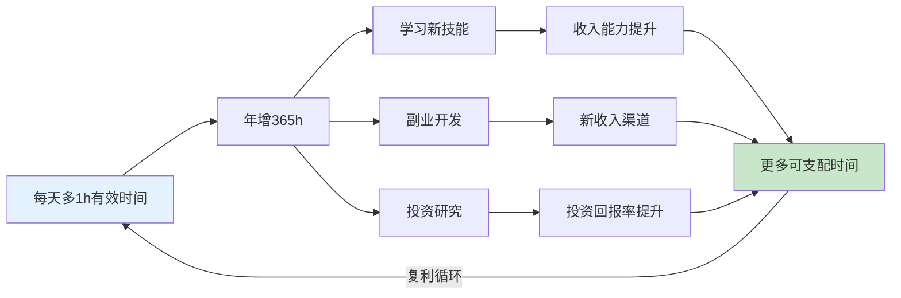
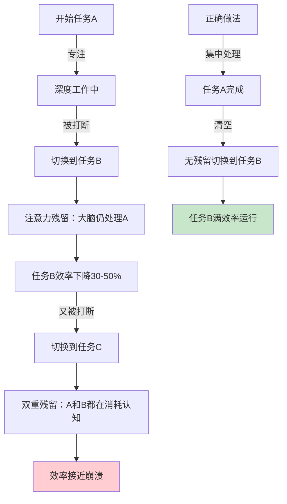
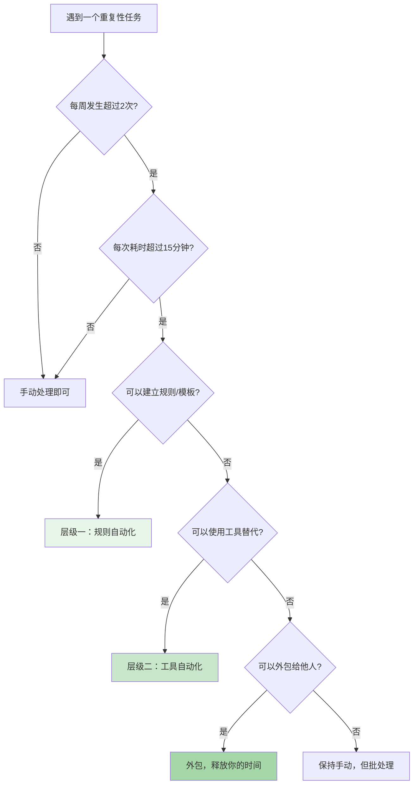
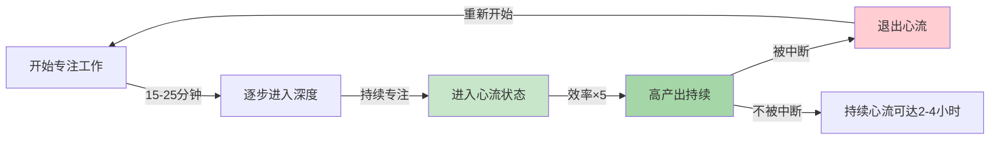
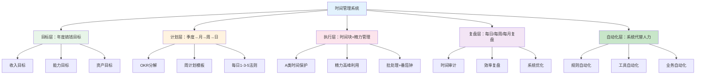

## 3.4 时间管理与效率提升

上一节我们建立了搞钱的日常习惯体系——记账、学习、社交、健康。这些习惯构成了搞钱的"操作系统"，但操作系统需要一个核心调度器来决定资源如何分配。这个调度器就是**时间管理**。

本节要解决的核心问题是：**时间是每个人唯一真正公平的资源——每人每天24小时，但为什么有人用同样的时间搞到了10倍于别人的收入？** 答案不在于"更努力"或"更忙碌"，而在于对时间的**认知深度**和**分配策略**存在根本差异。

> **本节定位**：本节是时间管理的"道"——讲原理、讲框架、讲底层逻辑。具体的时间管理技巧（番茄工作法、GTD、时间块等）在4.4节详述。先理解"为什么"，再学"怎么做"，效果天差地别。

### 3.4.1 时间：搞钱过程中唯一不可再生的资源

#### 资源稀缺性的本质差异

搞钱涉及四种核心资源：资金、技能、人脉、时间。它们的稀缺性特征完全不同：

| 资源 | 是否可再生 | 是否可借贷 | 是否可转让 | 稀缺程度 |
|------|----------|----------|----------|---------|
| 资金 | 是（可再赚） | 是（银行贷款） | 是（赠与、投资） | 相对稀缺 |
| 技能 | 是（可学习） | 否 | 部分可（外包） | 可改变 |
| 人脉 | 是（可拓展） | 否 | 部分可（介绍） | 可改变 |
| **时间** | **否** | **否** | **否** | **绝对稀缺** |

这个对比揭示了一个关键事实：**时间是搞钱过程中唯一既不能借贷、不能转让、也不能再生的资源。** 你可以向银行借钱来投资，可以花钱请人教你技能，可以付费参加社交活动拓展人脉——但你无法向任何人"借"一小时，也无法把你的24小时"转赠"给别人。

彼得·德鲁克（Peter Drucker）在《卓有成效的管理者》中写道："时间是最特殊的一种资源。它不能被积累，不能被储存，也不能被替代。昨天的24小时已经永远消失了，明天的24小时还没有到来——你能使用的只有今天的这24小时。"

#### 时间价值的量化：从抽象概念到具体数字

"时间就是金钱"这句话人人都会说，但大多数人从未真正量化过自己的时间价值。没有量化，就无法做理性决策。

**基础计算公式：**

```text
时间单价 = 年收入 ÷ 年有效工作小时数
```

注意这里用的是"有效工作小时数"，而不是"在公司待着的小时数"。一个年薪20万、每天实际高效工作4小时的人，和一个年薪20万、每天在公司坐满10小时但只有3小时在做有价值的事的人，他们的时间单价完全不同。

| 年收入 | 有效工作小时/年 | 时间单价 | 含义 |
|--------|---------------|---------|------|
| 10万 | 1,200（每天约5h） | 83元/h | 每浪费1小时，损失83元 |
| 20万 | 1,200 | 167元/h | 每浪费1小时，损失167元 |
| 50万 | 1,500 | 333元/h | 每浪费1小时，损失333元 |
| 100万 | 1,500 | 667元/h | 每浪费1小时，损失667元 |

这个数字的真正价值不是用来炫耀，而是用来**做决策**。当你的时薪是167元时：

- 花2小时对比三家店省下30块钱 → 你亏了304元（2×167 - 30）
- 花1小时排队买打折商品省下50块 → 你亏了117元
- 花30分钟处理一个可以5块钱外包的琐事 → 你亏了78.5元

**搞钱者的时间价值不仅包括当前时薪，还包括时间投资的复利回报。** 你花1小时学习投资知识，当期收益是零，但未来10年可能带来数万元的投资收益提升。这就是为什么搞钱者的时间管理不能只看"当下的产出"，还要看"时间投资的长期回报率"。

#### 时间复利：最容易被忽视的搞钱杠杆

复利不仅存在于金融领域，时间管理同样存在复利效应。每天多出1小时用于高价值搞钱活动，其累积效果远超直觉预期：

```text
每天多出1小时有效搞钱时间
  → 每月多30小时
  → 每年多365小时
  → 10年多3,650小时

假设每小时产出价值150元：
  → 年增量价值 = 54,750元
  → 10年增量价值 = 547,500元（不含复利再投资）
```

如果把这些时间用于学习技能、建立副业、优化投资，产出的复利效应会让数字变得更大。这就是时间管理被称为"搞钱的基础能力"而非"锦上添花"的根本原因。



### 3.4.2 高价值时间与低价值时间：搞钱者的时间分类框架

#### 核心认知：不是所有时间都等价

大多数人管理时间的方式是"填满每一分钟"——从早忙到晚，感觉自己很充实。但搞钱者管理时间的方式是"**让每一分钟产出最大价值**"——同样8小时，产出可能是普通人的3-5倍。

区别在于：搞钱者会主动区分**高价值时间**和**低价值时间**，然后把最好的精力分配给最高价值的活动。

#### 四象限时间分类模型

根据"对搞钱的直接影响"和"是否需要深度专注"两个维度，把时间分为四类：

| 类型 | 定义 | 特征 | 举例 | 占比建议 |
|------|------|------|------|---------|
| **Ⅰ 创造型时间** | 直接产出搞钱成果的时间 | 需要深度专注，产出最高 | 写商业方案、开发产品、谈客户、做投资决策 | 30-40% |
| **Ⅱ 学习型时间** | 提升未来搞钱能力的时间 | 需要专注，回报延迟 | 学新技能、研究行业趋势、复盘分析、读书 | 15-25% |
| **Ⅲ 维护型时间** | 保持现有运转的必要时间 | 低专注需求，无新增价值 | 回邮件、处理报销、整理文件、日常沟通 | 20-30% |
| **Ⅳ 消耗型时间** | 无意识流失的时间 | 零专注，零产出 | 刷短视频、无目的浏览、无效会议、纠结犹豫 | 目标<10% |

**关键洞察：大多数人的实际分配是 Ⅰ(15%) + Ⅱ(5%) + Ⅲ(30%) + Ⅳ(50%)。** 而搞钱高手的分配接近 Ⅰ(35%) + Ⅱ(20%) + Ⅲ(30%) + Ⅳ(15%)。差距不在总时间上，而在Ⅰ和Ⅱ的占比上——差了整整35个百分点。

#### 高价值时间的识别标准

判断一个活动是否属于高价值时间，用以下三个标准：

**标准一：可累积性**
这个活动的产出是可以累积的，还是做完就消失？写一篇文章（累积，长期带来流量和影响力）比回复一条群消息（即时消耗）价值高。做一个可复用的自动化脚本（累积）比手动处理一次数据（消耗）价值高。

**标准二：收入关联度**
这个活动和收入之间有多直接的关系？直接谈客户签单 > 优化销售流程 > 学习销售技巧 > 参加无关培训。越靠近收入链条顶端的活动，单位时间价值越高。

**标准三：不可替代性**
这个活动是否只有你能做？如果你花1小时做的事，花50块钱就能请别人做，那你的时间应该花在更不可替代的事情上。搞钱者的一个核心能力是：**不断把低不可替代性的任务外包出去，把时间集中在高不可替代性的活动上。**

#### 时间价值的动态变化

时间价值不是静态的。同一个活动在不同阶段的时间价值差异巨大：

| 活动 | 初创期时间价值 | 成长期时间价值 | 成熟期时间价值 |
|------|-------------|-------------|-------------|
| 学习新技能 | 极高（奠基） | 中（补充） | 低（边际递减） |
| 手动获客 | 高（验证需求） | 中（规模化） | 低（应系统化） |
| 产品开发 | 极高（核心） | 高（迭代） | 中（维护） |
| 战略思考 | 中（执行更重要） | 高（方向关键） | 极高（避免走弯路） |
| 社交活动 | 低（先做出来） | 中（拓展资源） | 高（资源整合） |

搞钱者需要定期审视：**当前阶段，我的时间应该重点投向哪里？** 这个答案会随着你的搞钱阶段变化而变化。

### 3.4.3 批量处理与自动化：用系统代替意志力

#### 任务切换的真实成本

人类大脑不是CPU，不能在多个任务之间无缝切换。每次从一个任务切换到另一个任务，大脑需要付出"切换成本"（Context Switching Cost）。

加州大学尔湾分校Gloria Mark教授的研究发现：**被打断后，平均需要23分钟15秒才能完全恢复到原来的专注深度。** 如果一天被打断10次，你将损失近4小时的深度工作能力——相当于半天的工作时间被白白蒸发。

这个现象的神经科学解释是"注意力残留"（Attention Residue）。明尼苏达大学Sophie Leroy教授在2009年的研究中发现：当你从任务A切换到任务B时，你的大脑仍然有一部分在处理任务A的信息。这个"残留"会持续占用认知资源，降低你在任务B上的表现。



**搞钱启示：** 批量处理同类任务，不只是"省时间"，更是在**保护你的深度工作能力**。一个下午回复50条消息（一次性批处理）的总耗时，远少于分散在全天50次中断中处理（因为每次都有切换成本）。

#### 批量处理的原理与应用

批量处理的核心思想来自工业生产中的"批次优化"：把相同类型的工作集中到一起处理，减少设备切换的次数和成本。在搞钱场景中，"设备"就是你的大脑。

**批量处理的三个层次：**

| 层次 | 原理 | 搞钱场景 | 效率提升 |
|------|------|---------|---------|
| 消息批处理 | 同类消息集中回复 | 固定3个时段统一处理微信/邮件 | 减少50%以上的注意力切换 |
| 任务批处理 | 同类任务连续完成 | 周末集中写下周所有内容、一次处理所有报销 | 减少进入状态的重复成本 |
| 决策批处理 | 同类决策统一处理 | 每周固定时间做投资决策、每月统一评估供应商 | 减少决策疲劳，提高决策质量 |

**决策疲劳**（Decision Fatigue）是批量处理的另一个理论支撑。心理学家Roy Baumeister的研究发现：人的决策能力是有限的，每做一个决策都会消耗意志力资源。以色列法官假释裁决的经典研究显示：上午的假释批准率约65%，到下午临近午餐时下降到接近0%——不是因为下午的犯人更危险，而是法官的决策资源被耗尽了。

搞钱者每天面对大量决策：买什么、卖什么、投多少、先做哪个、拒绝哪个。如果把这些决策分散在全天，每个决策的质量都会因为疲劳而下降。**批量处理决策，就是在你精力最充沛的时候集中做最重要的选择。**

#### 自动化思维：从"亲自做"到"让系统做"

自动化的本质是**把一次性的意志力投入转化为永久性的系统产出**。

**自动化的三个层级：**

**层级一：规则自动化（入门）**

为重复性决策建立固定的规则，消除"每次都要想"的认知成本。

示例规则：
- 收到工资 → 自动转30%到投资账户（银行自动转账）
- 信用卡账单 → 自动全额还款（避免利息和忘记还款）
- 每月固定支出 → 自动扣款（水电煤、保险、订阅）
- 新邮件 → 自动分类到对应文件夹（Gmail过滤器/Outlook规则）

这些规则一旦设置，就不再消耗任何注意力。你不需要每月发工资后"决定"要不要存钱——系统替你做了这个决定。

**层级二：工具自动化（进阶）**

用工具替代手动操作，把重复性劳动交给机器。

| 手动操作 | 自动化方案 | 年省时间 |
|---------|----------|---------|
| 手动记账 | 银行账单自动导入+自动分类 | 50-80小时 |
| 手动排期内容发布 | Buffer/微小宝定时发布 | 30-50小时 |
| 手动回复常见客户问题 | 客服机器人/自动回复模板 | 100-200小时 |
| 手动收集行业信息 | RSS订阅+关键词过滤 | 40-60小时 |
| 手动生成报表 | Excel模板+数据透视表自动刷新 | 20-40小时 |

**层级三：业务自动化（高级）**

把整个业务流程自动化，让你的搞钱系统可以"无人值守"运行。

示例：
- **内容创作系统**：选题库→自动生成大纲→人工审核→AI辅助写作→人工修改→定时发布→自动分发到多个平台。单篇文章的人工介入时间从4小时压缩到1小时
- **电商运营系统**：自动上架→自动定价（基于竞品监控）→自动客服→自动发货→自动催评→自动补货提醒。店主每天只需处理异常情况
- **投资系统**：自动定投（每月固定金额买入指数基金）→自动再平衡（每季度调整一次比例）→异常波动提醒→年度税务报告自动生成

**自动化的决策框架：**

面对任何一个重复性任务，搞钱者应该问自己以下问题：



### 3.4.4 时间管理的底层科学：为什么"更忙"不等于"更高效"

#### 心流状态：高效搞钱的巅峰体验

心理学家米哈里·契克森米哈赖（Mihaly Csikszentmihalyi）在20世纪70年代提出了"心流"（Flow）概念：当人完全沉浸在一项有挑战性但能力匹配的活动中时，会进入一种高度专注、忘我、高效的状态。

心流状态的特征：
- 完全专注于当前任务，忘记时间流逝
- 行动与意识融为一体，不需要刻意思考"下一步做什么"
- 内在动机驱动，活动本身就是奖赏
- 自我意识消失，不会担心别人的评价
- 时间感扭曲——可能觉得过了20分钟，实际过了3小时

**心流与搞钱效率的关系：**

McKinsey的一项高管调查显示：在心流状态下的工作效率是正常状态的**5倍**。如果一个搞钱者每周能进入10小时心流状态（相当于每天2小时），其产出相当于普通状态下50小时的工作量。

但心流有一个关键前提条件：**不受打扰**。研究表明，任何一次外部中断都会将你从心流状态中拉出来，重新进入心流需要15-25分钟。这就是为什么搞钱者必须保护自己的"深度工作时间"——不是为了"安静"，而是为了**触发和维持心流状态**。



**触发心流的条件：**

1. **明确的目标**：知道自己这2小时要完成什么。"做点副业"无法触发心流，"用2小时写完这篇产品介绍文案"可以
2. **即时反馈**：能快速知道自己做得对不对。写作（看到文字产出）、编程（看到代码运行）、设计（看到视觉效果）都天然提供即时反馈
3. **挑战与能力匹配**：太容易会无聊，太难会焦虑。选择"刚好够得着"难度的任务
4. **不受打扰**：关掉手机通知，关闭社交软件，告诉身边的人不要打扰你

#### 认知带宽：为什么搞钱决策需要"留白"

哈佛大学教授塞德希尔·穆来纳森（Sendhil Mullainathan）在《稀缺》一书中提出了"认知带宽"（Cognitive Bandwidth）概念：人的注意力和决策能力是有限的，当被琐事占满时，留给重要决策的空间就会减少。

这对搞钱者的启示是：**如果你把所有时间都填满了任务，你反而会降低搞钱效率。** 因为搞钱需要的不只是"执行"，还需要"思考"——评估机会、分析风险、调整策略、寻找新方向。这些都需要"留白"时间。

硅谷顶级投资人Naval Ravikant说过："如果你的日程表上没有空闲时间，你就没有时间思考。不思考的人，不可能赚到大钱。"

**搞钱者的"留白"安排：**

| 留白类型 | 频率 | 时长 | 用途 |
|---------|------|------|------|
| 每日留白 | 每天 | 30分钟 | 散步/冥想，让大脑自由联想 |
| 每周留白 | 每周 | 2-3小时 | 回顾全局，思考战略方向 |
| 每月留白 | 每月 | 半天 | 深度复盘，调整搞钱方向 |
| 季度留白 | 每季度 | 1天 | 战略思考，评估是否需要大方向调整 |

#### 注意力的三种模式

神经科学家Daniel Levitin在《有序》中指出，大脑的注意力系统有三种工作模式，搞钱者需要了解并善用：

| 模式 | 神经网络 | 特征 | 最佳搞钱用途 |
|------|---------|------|------------|
| **专注模式** | 中央执行网络 | 高度集中，处理单一任务 | 执行型工作：写代码、谈客户、写方案 |
| **发散模式** | 默认模式网络 | 自由联想，连接不同想法 | 创造型工作：想新点子、寻找商业机会 |
| **突显网络** | 突显网络 | 在两种模式间切换 | 判断型工作：评估方案、做投资决策 |

大多数人只使用专注模式（"埋头干活"），忽略了发散模式的价值。但很多搞钱的关键洞察——新的商业机会、创新的解决方案、更好的投资策略——往往出现在发散模式下：散步时、淋浴时、半梦半醒时。

**实践启示：** 不要把每一分钟都塞满任务。刻意安排"不做事"的时间（散步、运动、发呆），让大脑切换到发散模式，反而能产生更有价值的搞钱想法。

### 3.4.5 机会成本：搞钱决策的时间视角

#### 什么是机会成本

经济学中有一个基础概念叫"机会成本"（Opportunity Cost）：你选择做一件事，就意味着放弃了做其他所有可能的事。**真正的成本不是你花了多少钱，而是你放弃了什么。**

应用到时间管理上：你花1小时刷短视频，其成本不只是"浪费了1小时"，而是"放弃了用这1小时做任何搞钱活动的潜在收益"。

#### 用机会成本思维做时间决策

搞钱者在面对时间分配选择时，应该始终问：**"这段时间用于其他搞钱活动，最高能产生多少价值？"**

具体操作方法：

**第一步：建立你的"时间机会成本基准线"**

```text
时间机会成本 = 当前最佳搞钱活动的时薪

例如：
- 主业时薪 = 100元
- 副业接单时薪 = 200元
- 投资研究的预期年化收益提升带来的时薪 = 150元

→ 时间机会成本 = 200元/小时（取最高值）
```

**第二步：用基准线评估每个时间使用决策**

| 时间使用选项 | 直接收益 | 机会成本 | 净判断 |
|------------|---------|---------|--------|
| 花1小时比价省50元 | 50元 | 200元 | 亏150元，不值得 |
| 花2小时接一单400元的副业 | 400元 | 400元 | 持平，看精力状态决定 |
| 花1小时学习新技能 | 0元（当期） | 200元 | 长期收益可能远超200元，值得 |
| 花3小时参加无效社交 | 0元 | 600元 | 亏600元，果断拒绝 |

**第三步：定期更新基准线**

你的搞钱能力在提升，你的时间机会成本也应该随之提升。当你的时间价值从100元/小时增长到300元/小时时，很多以前"值得亲自做"的事情（比如修电脑、跑腿取快递、手动整理数据）就应该外包了。

#### 搞钱者的时间外包决策

外包的本质是**用金钱购买别人的时间，释放自己的时间去做更高价值的事**。这不是"懒"，而是理性的时间投资。

| 你的时间单价 | 外包成本 | 判断 | 示例 |
|------------|---------|------|------|
| 200元/小时 | 30元/小时 | 强烈外包 | 家政清洁、数据录入、简单设计 |
| 200元/小时 | 150元/小时 | 值得外包 | 专业翻译、视频剪辑、税务申报 |
| 200元/小时 | 250元/小时 | 需要评估 | 如果释放的时间能产生>250元产出就外包 |
| 200元/小时 | 500元/小时 | 通常不外包 | 除非你的时间单价远超500元 |

**外包的优先级排序：**
1. 你做得很差且不喜欢的事（外包收益最大）
2. 你做得还行但别人做得更好的事（质量提升+时间释放）
3. 你做得很好但时间单价低于你机会成本的事（纯经济理性）

### 3.4.6 常见的时间管理误区

#### 误区一："忙碌 = 高效"

**真相：** 忙碌是"在做事"，高效是"在做对的事"。一个人可以每天工作16小时、从不休息、日程排得满满的——但如果不区分事情的价值高低，这16小时可能只有2小时在做真正推动搞钱进展的事。

**纠正方法：** 每天结束时问自己："今天做的哪件事对搞钱的推进最大？"如果答不上来，或者答案是"处理了一堆杂事"，说明你今天的时间分配出了问题。

#### 误区二："时间管理就是把每分钟都排满"

**真相：** 排得满满的时间表是最脆弱的——一个意外就会导致全盘崩溃。更严重的是，没有留白的时间表会扼杀创造力和战略思考。

**纠正方法：** 时间规划只安排70-80%的时间，留出20-30%作为缓冲和自由探索时间。

#### 误区三："早起就能搞定一切"

**真相：** 早起本身不是目的，把高质量时间用于搞钱核心活动才是。一个凌晨5点起床但把黄金时间用来刷手机的人，不如一个8点起床但立刻投入深度工作的人。

**纠正方法：** 关键不是"几点起"，而是"起来后第一件事做什么"。找到你自己的精力高峰期，把最重要的搞钱任务安排在那个时段。

#### 误区四："工具越高级，时间管理越好"

**真相：** Notion、Obsidian、Todoist这些工具再强大，如果你没有清晰的目标和优先级判断框架，工具只会让你更高效地做无意义的事。**先有正确的时间管理认知，再选工具——顺序不能反。**

**纠正方法：** 从最简单的工具开始（纸笔、手机备忘录），等你的系统运行2-3周并证明有效后，再考虑升级工具。

#### 误区五："同时做多件事 = 效率高"

**真相：** 人脑不能真正"多任务"处理——它只是在多个任务之间快速切换，每次切换都有认知成本。斯坦福大学的研究发现，自认为擅长"多任务"的人，在实际测试中的表现比专注单任务的人更差。

**纠正方法：** 一次只做一件事。如果两件事都重要，就用时间块法分别安排，而不是试图同时做。

#### 误区六："省时间 = 不休息"

**真相：** 精力是可再生但需要时间恢复的资源。连续工作不休息会导致效率断崖式下降。Chronobiology（时间生物学）研究表明，人的注意力周期约为90-120分钟（称为"亚昼夜节律"），每个周期结束后需要15-20分钟的恢复时间。

**纠正方法：** 采用90分钟工作+15分钟休息的节奏。休息时远离屏幕，做身体活动（走动、拉伸），让大脑切换到默认模式网络进行"后台整理"。

### 3.4.7 从时间管理到精力管理：更高维度的效率框架

#### 为什么精力比时间更重要

时间管理的局限在于：它假设每个时间单位的"产出能力"是相同的。但事实是，你上午9点的一个小时和下午3点的一个小时，产出可能相差3-5倍——因为精力水平不同。

精力管理专家Tony Schwartz在《精力管理》中提出：**管理精力，而非时间，是高效能的基础。** 一个精力充沛的2小时，价值超过一个精力枯竭的5小时。

```mermaid
graph TD
    A[传统思维：管理时间] --> B[把日程排满]
    B --> C[精力枯竭时仍在"工作"]
    C --> D[低质量产出]
    D --> E[加班补救]
    E --> F[精力更差]
    F -->|恶性循环| A

    G[搞钱者思维：管理精力] --> H[识别精力周期]
    H --> I[高精力时段做A类任务]
    I --> J[高质量产出]
    J --> K[有时间恢复精力]
    K -->|良性循环| G

    style A fill:#ffcdd2
    style G fill:#c8e6c9
```

#### 精力的四个维度

Tony Schwartz把精力分为四个维度，搞钱者需要全面管理：

| 维度 | 来源 | 管理方法 | 对搞钱的影响 |
|------|------|---------|------------|
| **体能精力** | 睡眠、运动、饮食、呼吸 | 7-8小时睡眠、每周3次运动、减少精制糖 | 体能是一切精力的基础 |
| **情绪精力** | 积极情绪、关系质量 | 感恩练习、社交支持、情绪觉察 | 积极情绪提升创造力和决策质量 |
| **心智能力** | 专注力、意志力、决策力 | 深度工作训练、减少决策疲劳、冥想 | 直接影响搞钱决策的质量 |
| **精神精力** | 使命感、价值观、人生意义 | 明确搞钱的"为什么"、定期反思 | 持久动力的来源 |

**精力管理的核心原则：消耗与恢复交替。** 就像运动员不会每天训练24小时一样，搞钱者也不应该把所有时间都用于"产出"。刻意安排恢复时间（运动、社交、娱乐、睡眠），才能维持长期的高效能状态。

#### 搞钱者的精力优化实操

**体能精力（投入最小，回报最大）：**
- 睡眠：固定作息时间，睡前1小时不看屏幕，卧室温度保持18-22°C
- 运动：每周3次、每次30分钟的有氧运动（跑步、游泳、快走）
- 饮食：减少精制碳水（白米饭、面包），增加蛋白质和蔬菜，避免午餐过饱导致下午精力崩溃
- 补水：每天2-3升水，脱水1%就会导致注意力下降

**心智能力（搞钱决策质量的核心）：**
- 把最重要的决策安排在上午（精力最充沛时）
- 减少低价值决策（固定穿衣风格、固定午餐选项、自动化日常选择）
- 重大决策前先睡一觉（利用睡眠的"情绪脱敏"效应，减少情绪对决策的干扰）
- 做决策前列出至少3个选项（避免"二选一"的认知陷阱）

### 3.4.8 时间管理的终极目标：构建"时间自由"系统

#### 从"管理时间"到"消除时间管理"

时间管理的最高境界不是"更好地管理每一分钟"，而是**构建一个不需要你时刻投入时间就能持续产出价值的系统**。

这就是从"主动收入"到"被动收入"的时间维度跃迁：

| 阶段 | 时间模式 | 特征 | 搞钱状态 |
|------|---------|------|---------|
| 第一阶段 | 用时间换钱 | 停工即停收 | 打工、接单 |
| 第二阶段 | 用系统换钱 | 系统运行时自动产出 | 内容变现、电商自动化 |
| 第三阶段 | 用资本换钱 | 资金自动增值 | 投资理财、租金收入 |
| 第四阶段 | 用影响力换钱 | 影响力自动变现 | 个人品牌、IP |

每个阶段都需要前一阶段的时间管理能力作为基础。你不可能从第一阶段直接跳到第四阶段——但每往上走一步，你的时间自由度就增加一分。

#### 搞钱者的时间管理系统蓝图

一个完整的时间管理系统应该包含以下组件：



这个系统不需要一次建成。建议的搭建顺序：

1. **第一周**：计算你的时间价值，做一次时间审计
2. **第二周**：识别你的时间黑洞，用替换法逐步消灭最大的1-2个
3. **第三周**：建立每日时间块，保护你的A类时间
4. **第四周**：引入批量处理，集中处理消息和杂务
5. **第二个月**：建立规则自动化（工资自动转存、账单自动还款等）
6. **第三个月**：引入工具自动化，把重复性劳动交给工具
7. **持续优化**：每月复盘一次时间管理系统，找到改进空间

**本节小结：** 时间管理的本质不是"更忙"，而是**让每一小时产出更大的搞钱价值**。核心公式是：

```text
搞钱时间效率 = 精力质量 × 任务价值 × 专注深度 × 系统化程度
```

- **精力质量**：管理精力而非时间，在巅峰状态做最重要的事
- **任务价值**：区分高价值和低价值时间，把精力花在刀刃上
- **专注深度**：保护深度工作时间，触发心流状态，让效率翻5倍
- **系统化程度**：用批量处理和自动化代替手动重复，让系统替你干活

时间管理的具体技巧和工具详见4.4节"时间管理技巧"。
