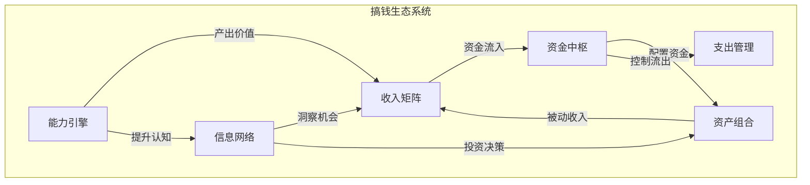
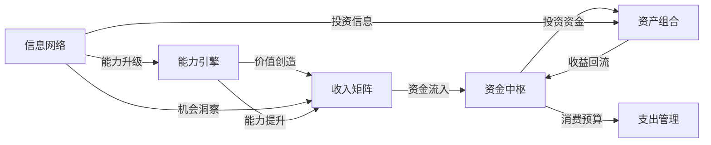

## 3.5 构建搞钱的生态系统

### 为什么需要"生态系统"思维

大多数人搞钱的方式是"单点突破"——找一份高薪工作，或者炒一支股票，或者开一家小店。这种模式有一个致命缺陷：**单点脆弱性**。一旦这个唯一的收入来源出问题——被裁员、股票暴跌、店铺倒闭——整个财务状况瞬间崩塌。

生态系统思维的核心是：**不依赖任何单一节点，而是让多个收入来源、资产类型、能力模块相互连接、相互支撑，形成一个自我强化的网络。** 就像一片森林，单棵树可能被风吹倒，但整个森林会越来越茂盛。

这个理念并非新概念。管理学大师彼得·德鲁克在《卓有成效的管理者》中强调"系统思维"的重要性——局部最优不等于整体最优，只有各个部分协同运作，整体效能才能最大化。搞钱也是如此：你的收入结构、支出管理、投资配置、能力积累、人脉网络、信息渠道，这些要素不是孤立的，而是一个有机系统。

### 生态系统的六大核心模块

一个完整的搞钱生态系统由六个模块组成，它们各自承担不同功能，又通过资金流、信息流、价值流相互连接。



#### 模块一：能力引擎

能力是整个生态系统的根基。没有能力，一切收入都是无源之水。

能力引擎分为三个层次：

| 层次 | 定义 | 示例 | 收入天花板 |
|------|------|------|-----------|
| 基础能力 | 可迁移的通用技能 | 写作、沟通、数据分析、项目管理 | 决定职业下限 |
| 专业能力 | 某个领域的深度技能 | 编程、法律、财务、设计 | 决定职业上限 |
| 杠杆能力 | 能放大规模的能力 | 管理、教学、内容创作、产品设计 | 突破时间换钱的瓶颈 |

关键原则：**能力要形成"T型结构"**——一专多能。在一个领域做到前10%，在多个领域做到前50%。这样既有核心竞争力，又有足够的跨界能力发现新机会。

能力引擎的构建方法：

1. **识别高价值技能**：观察你所在行业收入最高的人具备什么技能，这些就是值得投入的方向
2. **刻意练习**：不是简单重复，而是针对薄弱环节持续精进。安德斯·艾利克森在《刻意练习》中指出，1万小时定律的前提是刻意练习，否则10年经验可能只是1年经验重复了10次
3. **输出倒逼输入**：写文章、做分享、带团队——输出是最好的学习方式
4. **定期复盘**：每季度评估能力增长情况，调整学习方向

#### 模块二：收入矩阵

收入矩阵是生态系统中产生现金流的核心引擎。目标是建立**多维度、多时态、多风险等级**的收入结构。

按时间维度划分：

| 类型 | 定义 | 特征 | 示例 |
|------|------|------|------|
| 主动收入 | 用时间换钱 | 稳定但有上限，停止即中断 | 工资、咨询费、接单 |
| 半被动收入 | 前期投入时间，后期持续产出 | 有复利效应，边际成本递减 | 课程、版权、自媒体广告 |
| 被动收入 | 资产自动产生 | 不直接消耗时间，但需要资本或前期积累 | 股息、房租、版税、利息 |

健康的收入矩阵应该同时包含三种类型，且随着能力提升和资本积累，逐步提高被动收入占比。

**收入矩阵的构建路径：**

阶段一（0-3年）：以主动收入为主
- 把主业做到极致，争取薪资快速增长
- 用业余时间探索副业方向，但不要影响主业表现
- 目标：主动收入占90%以上，建立储蓄基础

阶段二（3-7年）：引入半被动收入
- 将专业能力转化为可复制的产品（课程、模板、工具）
- 建立个人品牌，积累影响力资产
- 目标：半被动收入占20-40%

阶段三（7年以上）：提升被动收入占比
- 用积累的资本进行投资（股票、基金、房产）
- 建立自动化运营的业务系统
- 目标：被动收入占30%以上，总收入是初始的3-5倍

#### 模块三：资金中枢

资金中枢是整个生态系统的"血液循环系统"，负责资金的归集、分配和调度。

**核心功能：**

1. **资金归集**：所有收入先进入一个"中央账户"，再统一分配
2. **预算分配**：按比例将资金分配到不同用途
3. **应急储备**：维持3-6个月生活费的流动资金
4. **投资调度**：定期将盈余资金配置到投资账户

**推荐的资金分配模型（532模型）：**

| 用途 | 比例 | 说明 |
|------|------|------|
| 生活必需 | 50% | 房租、饮食、交通、保险 |
| 投资增值 | 30% | 股票、基金、自我提升、副业启动 |
| 自由支配 | 20% | 娱乐、社交、弹性消费 |

这个比例不是固定的，可以根据个人情况调整。高收入者可以将投资比例提高到40-50%；刚毕业的年轻人可能生活必需占比更高。关键是**有比例、有纪律、有记录**。

**资金中枢的自动化设置：**

```text
工资到账日（每月5日）
  ├── 自动转账30% → 投资账户
  ├── 自动转账10% → 应急储备账户
  ├── 自动还款 → 信用卡/贷款
  └── 剩余 → 日常消费账户
```

把资金分配自动化，可以避免"月底没钱存"的问题。行为经济学家理查德·塞勒的"自动储蓄"研究表明，将储蓄设为默认选项后，参与率从49%提升到86%。

#### 模块四：资产组合

资产组合是生态系统中实现财富增值的核心模块。目标不是"炒股票赚快钱"，而是构建一个**风险可控、收益稳健、长期增长**的资产配置方案。

**资产分类与特征：**

| 资产类型 | 预期年化收益 | 风险等级 | 流动性 | 适合阶段 |
|---------|------------|---------|--------|---------|
| 货币基金 | 2-3% | 极低 | 极高 | 应急资金 |
| 债券/债券基金 | 3-6% | 低 | 高 | 稳健配置 |
| 指数基金 | 7-12% | 中 | 高 | 长期核心配置 |
| 优质个股 | 10-20% | 中高 | 高 | 有研究能力者 |
| 房产 | 3-8%（含租金） | 中 | 低 | 有一定资本后 |
| 股权投资 | 高（但不确定） | 极高 | 极低 | 高净值人群 |

**核心资产配置原则：**

1. **分散化**：不把鸡蛋放在一个篮子里。哈里·马科维茨的现代投资组合理论（MPT）证明，通过合理配置相关性低的资产，可以在不降低收益的情况下降低风险
2. **长期持有**：股市短期是投票机，长期是称重机（本杰明·格雷厄姆）。频繁交易不仅增加成本，还容易追涨杀跌
3. **定期再平衡**：每半年或一年调整一次资产比例，偏离目标超过5%时触发再平衡
4. **成本控制**：选择低费率的指数基金，避免频繁交易产生手续费

**不同阶段的资产配置建议：**

| 阶段 | 股票类 | 债券类 | 现金类 | 说明 |
|------|--------|--------|--------|------|
| 积累期（25-35岁） | 70% | 20% | 10% | 时间长，可承受波动 |
| 成长期（35-45岁） | 60% | 25% | 15% | 平衡增长与稳健 |
| 成熟期（45-55岁） | 45% | 35% | 20% | 降低波动，保护本金 |
| 收获期（55岁+） | 30% | 40% | 30% | 以现金流为主 |

#### 模块五：支出管理

支出管理不是"省钱"，而是**让每一分钱都产生最大价值**。

**支出的四象限分析：**

| | 高价值 | 低价值 |
|--|--------|--------|
| **必要** | 核心生活保障（饮食、住房、保险、医疗） | 税费、必要社交 |
| **非必要** | 自我提升（课程、书籍、工具）、健康投资 | 冲动消费、面子消费、过度娱乐 |

处理策略：
- **高价值+必要**：保障到位，不省
- **高价值+非必要**：值得投入，但设预算上限
- **低价值+必要**：优化但不消除，比如选择性价比更高的保险方案
- **低价值+非必要**：坚决削减或消除

**支出优化的具体方法：**

1. **记账**：不是为了省钱，而是为了"看见"钱的流向。推荐使用随手记、MoneyWiz等工具，至少坚持3个月
2. **大额消费决策框架**：超过月收入10%的消费，执行"72小时冷静期"——想买的东西先放购物车72小时，如果还想买再买
3. **订阅审计**：每季度审查一次所有订阅服务，取消不常用的
4. **社交支出优化**：用"共同体验"替代"共同消费"——一起跑步比一起吃饭更健康且更便宜

#### 模块六：信息网络

信息网络是生态系统的"神经系统"，负责收集、处理、传递有价值的信息，帮助你在正确的时间做出正确的决策。

**信息网络的三个层次：**

| 层次 | 作用 | 来源 |
|------|------|------|
| 认知层 | 理解世界运行规律 | 书籍、课程、深度文章 |
| 趋势层 | 发现行业和市场机会 | 行业报告、新闻、专业社区 |
| 实操层 | 获取具体操作方法 | 同行交流、导师指导、社群 |

**信息网络的构建方法：**

1. **建立信息漏斗**：海量信息 → 筛选 → 深度阅读 → 行动。不要试图读所有东西，而是建立高质量的信息源
2. **加入高质量社群**：找到你所在领域最优秀的3-5个社群，定期参与讨论。社群的价值不在于人数，而在于成员质量
3. **建立"智囊团"**：找到3-5个不同领域、认知水平高于你的朋友，定期交流。这不需要正式的形式，一顿饭、一次通话都可以
4. **输出倒逼输入**：写文章、做分享、教别人——输出是最好的信息处理方式，同时还能建立影响力

### 生态系统的连接与反馈循环

六个模块不是孤立的，它们通过三种"流"相互连接：



**正反馈循环示例：**

1. **能力→收入→投资→能力循环**：能力提升 → 收入增加 → 更多资金投入自我提升 → 能力进一步提升
2. **信息→机会→收入→信息循环**：信息网络发现机会 → 抓住机会创造收入 → 有更多资源建立更好的信息网络
3. **投资→被动收入→时间自由→投资循环**：投资产生被动收入 → 减少为钱工作的时间 → 有更多时间研究投资 → 投资收益提升

### 生态系统健康度评估

定期评估生态系统的健康状况，用以下指标体系：

| 维度 | 指标 | 健康值 | 警戒值 | 危险值 |
|------|------|--------|--------|--------|
| 收入结构 | 被动收入占比 | >30% | 15-30% | <15% |
| 收入结构 | 收入来源数量 | ≥3个 | 2个 | 1个 |
| 资金管理 | 储蓄率 | >30% | 15-30% | <15% |
| 资金管理 | 应急资金覆盖月数 | >6个月 | 3-6个月 | <3个月 |
| 资产配置 | 投资回报率 | >8% | 4-8% | <4% |
| 资产配置 | 资产分散度 | ≥3类资产 | 2类 | 1类 |
| 能力成长 | 年技能增长 | 明显进步 | 缓慢进步 | 停滞 |
| 信息网络 | 有效信息源数量 | ≥10个 | 5-10个 | <5个 |

建议每季度做一次完整评估，每月做一次关键指标检查。

### 常见误区与纠正

**误区一：追求"一夜暴富"的单一暴击**

很多人把搞钱等同于"找到一个暴富机会"——all in某支股票、梭哈某个项目、押注某个风口。这种策略的期望值计算如下：

- 假设成功概率10%，成功收益10倍，失败损失100%：期望收益 = 10% × 10 - 90% × 1 = 0.1 - 0.9 = -0.8（负期望值）

生态系统思维的核心不是寻找单一暴击，而是通过多个正期望值的小决策叠加，实现复利增长。

**纠正方法**：放弃"找到那个机会"的想法，转而构建多元化的收入和资产结构。10个年化10%的收入来源，远比一个"可能10倍也可能归零"的赌注更可靠。

**误区二：只关注收入，忽略支出和投资**

高收入不等于高净值。NBA球员平均年薪数百万美元，但退役5年后破产率高达60%。问题不在于收入多少，而在于支出管理和资产配置。

**纠正方法**：收入、支出、投资三管齐下。即使月入5000元，如果能做到50%储蓄率+合理投资，10年后的财务状况可能好过月入2万但月光的人。

**误区三：过度分散，每个方向都浅尝辄止**

有些人理解了"多元化"的概念后，同时开淘宝店、做自媒体、炒股票、搞加盟，每个都投入一点点精力，结果每个都做不好。

**纠正方法**：多元化是"资产层面"的策略，不是"精力层面"的策略。在能力引擎和收入矩阵的早期阶段，应该聚焦——先在一个方向做到前20%，再拓展第二个方向。

**误区四：忽视"隐性成本"**

很多人在评估项目时只看显性收益，忽略隐性成本：

- 时间成本：副业每天花3小时，时薪如果低于主业，不如用这个时间提升主业
- 机会成本：投资房产锁定了大量资金，可能错过更好的投资机会
- 心智成本：管理多个项目导致注意力分散，每个都做不好

**纠正方法**：任何投入都要计算"全成本回报率"，包括时间、精力、机会成本。

**误区五：照搬别人的生态系统**

每个人的能力、资源、风险偏好、所处阶段都不同，不存在"放之四海而皆准"的搞钱生态系统。别人的方法可以参考，但不能照搬。

**纠正方法**：理解原则，而非模仿形式。本章提供的六个模块是框架，具体的比例、方向、节奏需要根据个人情况定制。

### 实操：从零开始构建你的搞钱生态系统

**第一步：财务体检（1-2天）**

列出以下清单：
- 月收入明细（所有来源）
- 月支出明细（分类统计）
- 资产清单（现金、存款、投资、房产等）
- 负债清单（房贷、车贷、信用卡等）
- 能力清单（你会什么，什么做到什么水平）
- 信息渠道清单（你关注什么信息源）

**第二步：绘制当前生态系统地图（1天）**

用六个模块的框架，画出你当前的生态系统。诚实面对每个模块的状态——这是起点，不是终点。

**第三步：识别最薄弱的模块（1天）**

哪个模块是当前最大的瓶颈？优先改进它。常见的优先级顺序：
- 如果没有应急资金 → 先建立资金中枢
- 如果收入来源单一 → 先发展第二收入来源
- 如果有闲钱但不知道怎么投资 → 先学习资产配置

**第四步：制定90天行动计划（1天）**

不要试图一次改变所有事情。选择1-2个模块，制定90天的具体行动计划。每个计划应该包含：
- 具体目标（可量化）
- 每周行动项
- 检查节点
- 预期结果

**第五步：执行、复盘、迭代（持续）**

每周花30分钟复盘进展，每季度做一次完整评估。生态系统是活的，需要持续维护和优化。

### 进阶：生态系统自动化与规模化

当生态系统的基本框架搭建完成后，下一步是通过自动化和规模化提升效率。

**自动化策略：**

1. **资金流自动化**：设置自动转账、自动定投、自动还款，减少人工操作
2. **投资自动化**：使用基金定投、智能投顾等工具，减少情绪干扰
3. **信息处理自动化**：使用RSS订阅、信息聚合工具，提高信息获取效率

**规模化策略：**

1. **能力规模化**：把个人能力转化为可复制的产品（课程、工具、模板），突破"一个人一天只有24小时"的限制
2. **收入规模化**：通过团队、系统、技术手段，让业务不再完全依赖个人投入
3. **投资规模化**：当资产达到一定规模后，可以接触更多投资渠道（私募、风投、房产等）

**关键心态：** 生态系统的构建不是一蹴而就的。大多数人高估了一年能做的事情，低估了十年能取得的成就。保持耐心，持续行动，让复利为你工作。
