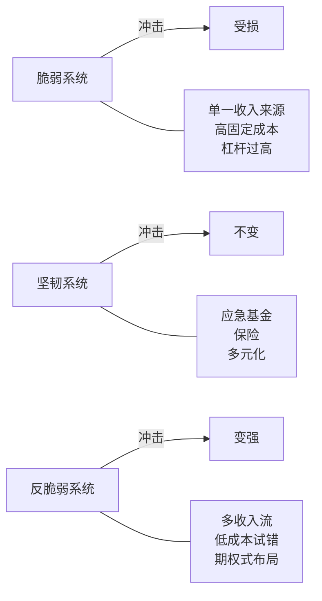
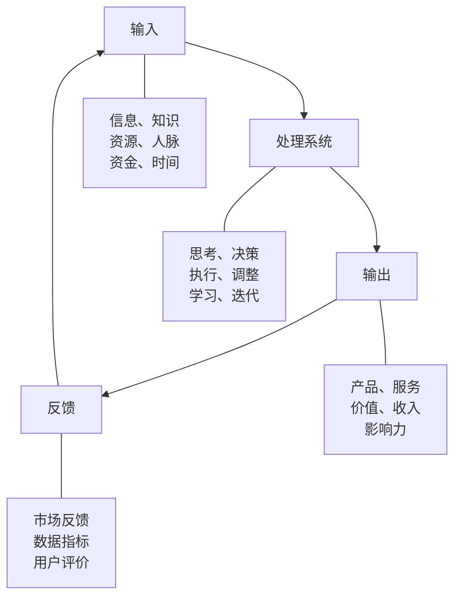
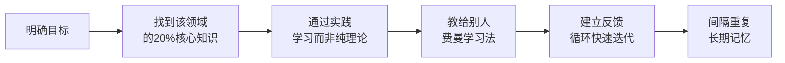
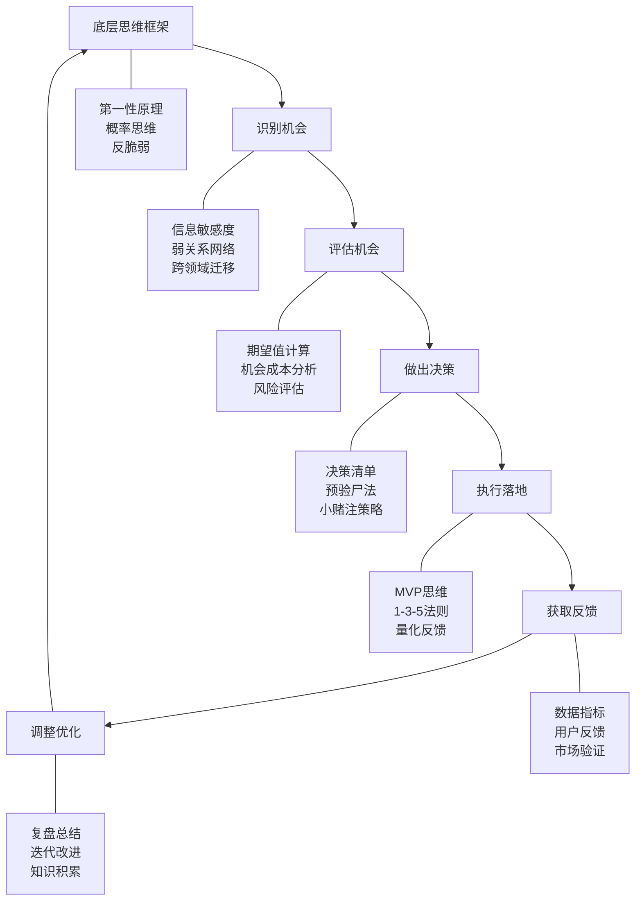

搞钱不是碰运气，而是一套可习得的思维系统。本章从认知科学、行为经济学和系统论出发，构建搞钱思维的底层框架——从"穷人思维 vs 富人思维"的表层对比，深入到第一性原理、概率思维、反脆弱等底层认知模型，再到可落地的元能力训练方法。掌握这套框架，你就拥有了在任何经济环境中识别机会、做出决策、持续变现的底层操作系统。

## 一、思维模式决定财富天花板

### 1.1 穷人思维 vs 富人思维：认知差异全景

"穷人思维"和"富人思维"不是贫富标签，而是两种截然不同的认知操作系统。哈佛商学院教授 Sendhil Mullainathan 在《稀缺》中指出：资源匮乏会占用认知带宽，导致决策质量下降——这解释了为什么"穷人思维"往往是一种处境驱动的恶性循环，而非性格缺陷。

以下从六个维度拆解两种思维模式的核心差异：

| 维度 | 穷人思维 | 富人思维 | 本质差异 |
|------|----------|----------|----------|
| **时间观念** | 用时间换钱，追求即时收入（今天多加班2小时多赚200块） | 用钱换时间，投资于能产生复利效应的事（花5000请助理，省下时间做战略决策） | 时间是消耗品 vs 时间是投资品 |
| **风险认知** | 害怕风险，追求100%确定性，宁可不做也不愿做错 | 管理风险，追求风险调整后的收益（Expected Value），接受"做10件事成3件" | 风险是威胁 vs 风险是成本 |
| **学习态度** | 学习是为了获得证书和学历——拿到文凭就停止学习 | 学习是为了解决问题和创造价值——学一个技能立刻用到实践中 | 学习有终点 vs 学习是终身习惯 |
| **社交方式** | 社交是消耗，需要投入时间和金钱，能省则省 | 社交是投资，能带来信息、机会和资源——每认识一个人就多一个信息节点 | 社交是成本 vs 社交是资产 |
| **金钱观念** | 钱是用来消费的，赚到手就花掉（享乐主义或生存驱动） | 钱是用来生钱的资本，每一分钱都是"员工"，要派出去工作 | 钱是终点 vs 钱是工具 |
| **对失败的态度** | 失败是耻辱，一次失败就否定自己，从此回避尝试 | 失败是数据，每次失败都在缩小"未知"的范围，是通向成功的必经之路 | 失败是终局 vs 失败是迭代 |

**关键认知**：思维模式不是非此即彼的二元对立。同一个人在不同领域可能表现出不同的思维模式——比如你在工作中是"富人思维"，但在投资中可能是"穷人思维"。意识到自己的思维盲区，是切换思维模式的第一步。

### 1.2 为什么思维模式比努力更重要

努力是必要条件，但不是充分条件。一个用"穷人思维"拼命努力的人，就像在跑步机上狂奔——很累，但始终在原地。

**经典案例：两个快递员的故事**

快递员A（穷人思维）：每天比别人多送30单，月入从8000涨到12000，但每天工作14小时，三年后身体出问题，收入回到原点。

快递员B（富人思维）：送快递的同时观察整个片区的商家配送需求，半年后摸清了B端客户的痛点（时效不稳定、价格不透明），用积蓄买了一辆小货车，承包了3家商户的同城配送，月入25000。两年后组建了5人小团队，月流水15万。

两人的区别不是努力程度，而是思维模式：A在系统内优化，B在重构系统本身。

### 1.3 思维模式的神经科学基础

认知神经科学研究发现，思维模式有生理基础：

- **固定型思维**（Fixed Mindset）：大脑在犯错时杏仁核（恐惧中心）活跃度高，倾向于回避错误而非从错误中学习。对应"穷人思维"中害怕失败的特征。
- **成长型思维**（Growth Mindset）：大脑前额叶皮层（理性决策区）在犯错时更活跃，会主动分析错误原因并调整策略。对应"富人思维"中把失败当数据的特征。

好消息是：大脑具有神经可塑性。通过刻意练习，你可以重塑自己的默认思维模式。后文会给出具体的训练方法。

## 二、搞钱的六大底层思维模型

"穷人思维 vs 富人思维"只是表层对比。真正决定搞钱能力的，是以下几个更底层的思维模型。查理·芒格说："一个人如果掌握100个思维模型，就能拥有普世智慧。"以下是搞钱最核心的六个。

### 2.1 第一性原理思维（First Principles Thinking）

**定义**：不依赖类比和经验，而是回到事物最本质的真理，从零开始推导结论。马斯克造火箭时，没有接受"火箭就是贵"的行业共识，而是把火箭拆解成原材料——铝、碳纤维、钛——发现材料成本只有市场价的2%，于是通过垂直整合和可回收技术，把发射成本降低了90%。

**搞钱应用**：

- **创业选赛道**：不要问"现在什么行业赚钱"（类比思维），要问"人类有哪些底层需求没有被满足？我能用什么方式以更低成本满足它？"（第一性原理）。
- **定价策略**：不要看竞争对手定价多少（类比），要算清楚你的成本结构+目标利润+客户感知价值（第一性原理）。
- **职业选择**：不要问"什么工作工资高"，要问"什么能力在市场上稀缺且需求持续增长？我如何获取这种能力？"

**实操练习——"5个为什么"法**：面对任何商业判断，连续问5个"为什么"，直到触及最底层的原理。例如：

1. 为什么这个产品卖不动？→ 因为用户觉得贵
2. 为什么用户觉得贵？→ 因为他们不了解价值
3. 为什么不了解价值？→ 因为我们的营销没有展示核心价值
4. 为什么没有展示？→ 因为我们自己也没搞清楚核心价值是什么
5. 为什么没搞清楚？→ 因为我们没有做过用户深度访谈

结论：不是降价的问题，是产品定位和用户研究的问题。

### 2.2 概率思维（Probabilistic Thinking）

**定义**：不追求"一定成功"，而是用概率评估每个决策的期望值，通过大量正期望值决策的累积来实现整体收益最大化。德州扑克世界冠军 Annie Duke 在《对赌》中指出：优秀决策者和糟糕决策者的区别，不在于单次结果，而在于决策质量——好的决策也可能失败，坏的决策也可能成功。

**搞钱应用**：

**期望值计算公式**：

```text
期望值 = 成功概率 × 成功收益 - 失败概率 × 失败损失
```

**案例**：你考虑花3个月开发一个SaaS产品。乐观估计：10%概率月入5万；中性估计：30%概率月入1万；悲观估计：60%概率月入0。同时你的机会成本是月薪2万的工作。

```text
期望值 = 0.1×50000 + 0.3×10000 + 0.6×0 = 8000元/月
机会成本 = 20000元/月
净期望值 = 8000 - 20000 = -12000元/月
```

结论：除非你能提高成功概率（比如先做MVP验证需求），否则这个决策的期望值为负。但这不意味着"不该做"——如果你能同时做多件事分散风险，或者这个项目的"失败经验"本身有学习价值（提升未来其他项目的成功概率），那决策可能翻转。

**关键原则**：
- 不要把所有鸡蛋放在一个篮子里——分散投资本质是概率管理
- 不要因为单次失败否定策略——要评估策略在100次执行后的整体期望值
- 不要混淆"不太可能"和"不可能"——小概率高赔率的机会值得关注

### 2.3 反脆弱思维（Antifragile Thinking）

**定义**：纳西姆·塔勒布在《反脆弱》中提出三种状态——脆弱（受冲击后受损）、坚韧（受冲击后不变）、反脆弱（受冲击后变强）。搞钱的目标不是追求"稳定"（坚韧），而是建立"反脆弱"系统——让不确定性成为你的朋友。

**搞钱应用**：



**构建反脆弱收入结构**：

- **杠铃策略**：把80%的资源放在极度安全的地方（工资、存款、低风险理财），把20%放在高风险高回报的地方（创业项目、天使投资、新技能学习）。中间地带（看似安全实则脆弱的"伪稳定"工作）尽量避免。
- **期权式思维**：每次投入都是一个"看涨期权"——最大损失是已知的（投入的时间和金钱），最大收益是未知的（可能非常大）。关键是控制每次投入的规模，确保任何单次失败都不会致命。
- **凸性检验**：对你做的每件事，问自己"如果这件事的结果比我预期好10倍，会怎样？如果比我预期差10倍，会怎样？"如果上行空间远大于下行空间，这件事就具有反脆弱性。

### 2.4 机会成本思维（Opportunity Cost Thinking）

**定义**：每一个选择的真实成本，不是你为之付出的钱和时间，而是你为此放弃的最佳替代方案的价值。经济学诺贝尔奖得主米尔顿·弗里德曼说："天下没有免费的午餐"——即使是"免费"的东西，你为之花费的时间也有机会成本。

**搞钱应用**：

**案例：要不要参加一个免费的创业沙龙？**

表面成本：0元（免费活动）

真实成本计算：
- 交通时间：1小时
- 活动时间：3小时
- 社交寒暄：1小时
- 总时间成本：5小时

如果你的时薪是200元（无论是工资折算还是你的项目预期收入），真实成本 = 5 × 200 = 1000元。

这笔"免费"活动值不值？取决于你能在活动中获得的信息和人脉是否值1000元。

**实操决策框架**：

面对任何选择，用这个三步法：
1. 列出你的时间/金钱/精力投入
2. 列出你放弃的最佳替代方案
3. 比较两者的价值，选择更高的那个

这个框架特别适用于：是否参加会议/社交、是否学习新技能、是否接一个新项目、是否继续一份工作。

### 2.5 边际思维（Marginal Thinking）

**定义**：决策应该基于"增量"分析——做这件事的额外收益是否大于额外成本？而不是看"平均"收益或"总量"收益。

**搞钱应用**：

**案例：要不要多接一个客户？**

你已经服务了10个客户，年收入50万，平均每个客户贡献5万。现在第11个客户来了，报价3万。

- 平均思维：我的客户平均贡献5万，3万低于平均，不接。
- 边际思维：服务第11个客户的边际成本是多少？如果只需要额外花10小时（现有系统能容纳），边际成本约2000元，边际收益3万，边际利润2.8万，当然要接。

**关键原则**：
- 不要用"平均值"做决策——平均值会掩盖边际变化的真实情况
- 沉没成本不应影响决策——已经花掉的钱不影响"接下来该怎么做"
- 关注边际收益递减点——做第1件事的收益可能很高，第100件就低了，找到最优投入量

### 2.6 系统思维（Systems Thinking）

**定义**：不把事物看作孤立的点，而是看作相互连接的系统。彼得·圣吉在《第五项修炼》中指出：大多数商业问题不是线性的因果关系，而是反馈循环和涌现效应。

**搞钱的系统模型**：



**正反馈循环（马太效应）**：
- 你做出好产品 → 客户好评 → 更多客户 → 更多收入 → 投入更多做出更好的产品 → 循环加强
- 你写了一篇好文章 → 被大V转发 → 粉丝增长 → 更多合作机会 → 更好的内容 → 循环加强

**负反馈循环（恶性循环）**：
- 收入下降 → 焦虑 → 决策质量下降 → 做出错误选择 → 收入进一步下降
- 产品质量下降 → 客户流失 → 收入减少 → 没钱投入产品质量 → 质量进一步下降

**搞钱的关键是**：识别并建立正反馈循环，同时识别并打破负反馈循环。具体方法见本章第三节"实操框架"。

## 三、复利思维的深度理解

复利是搞钱的第一原理。爱因斯坦（据传）说过："复利是世界第八大奇迹。"但大多数人对复利的理解停留在金融层面——实际上，复利适用于搞钱的方方面面。

### 3.1 金融复利：数学原理与实践

**复利公式**：

```text
终值 = 本金 × (1 + 收益率)^时间
```

**72法则**：资金翻倍所需年数 ≈ 72 ÷ 年收益率

| 年收益率 | 翻倍所需年数 | 10万本金20年后 |
|----------|-------------|---------------|
| 3%（银行存款） | 24年 | 18.1万 |
| 7%（指数基金长期） | 10.3年 | 38.7万 |
| 10%（优秀投资者） | 7.2年 | 67.3万 |
| 15%（顶级投资者） | 4.8年 | 163.7万 |
| 20%（巴菲特级别） | 3.6年 | 383.4万 |

**关键洞察**：收益率从7%提升到10%（仅3个百分点），20年后终值从38.7万变成67.3万——差了近一倍。这就是为什么"提高收益率"比"多存钱"更重要，也为什么学习投资是搞钱的核心技能。

### 3.2 知识复利：构建你的认知飞轮

每天学习1小时，看似微不足道，但知识之间会产生"连接效应"——心理学家称之为"迁移学习"。

**知识复利的三个阶段**：

1. **积累期**（0-1年）：学到的知识感觉用不上，但它们在你的大脑中建立了"钩子"。
2. **连接期**（1-3年）：新知识开始和旧知识产生连接，形成"知识网络"。你开始看到别人看不到的模式和机会。
3. **涌现期**（3年+）：知识网络足够密集后，创新开始"涌现"——你能把A领域的解决方案迁移到B领域，创造出别人想不到的东西。

**案例**：一个学了编程（A）+心理学（B）+营销（C）的人，能做出什么？→ 他可以设计基于行为心理学的用户增长系统（A+B+C的交叉），这是只懂其中一项的人做不出来的。

**实操建议**：
- 每天至少30分钟深度学习（不是刷短视频那种碎片学习）
- 学完一个概念后，问自己："这个概念还能用在哪里？"
- 定期做"知识连接练习"：随机选两个你学过的领域，试着找到交叉点

### 3.3 人脉复利：打造高价值社交网络

**邓巴数**：人类能维持的有效社交关系上限约150人。但关键不在于数量，而在于结构。

**弱关系理论**（社会学家格兰诺维特）：给你带来新机会的，往往不是你的亲密朋友（强关系），而是你不太熟的人（弱关系）——因为强关系的信息和你高度重叠，弱关系能带来你圈子之外的全新信息。

**搞钱社交策略**：
- 维护5-10个核心关系（强关系）：这些人是你的"董事会"，提供情感支持和深度建议
- 主动拓展30-50个弱关系：不同行业、不同背景的人，定期保持联系（每季度至少一次）
- 每次社交后记录：这个人能提供什么信息/资源？我能提供什么？下次什么时候跟进？

### 3.4 健康复利：被忽视的搞钱基础设施

健康不是搞钱的"附加项"，而是基础设施。一个每周感冒、注意力涣散、精力不足的人，搞钱效率可能只有健康状态的30%。

**健康复利的ROI计算**：
- 每天运动30分钟：投入0.5小时
- 效果：精力提升30%（根据《运动改造大脑》研究），注意力持续时间延长25%
- 假设你每天高效工作6小时，精力提升30% = 额外1.8小时的高效产出
- ROI = 1.8 / 0.5 = 360%

**最低有效剂量**：
- 运动：每周150分钟中等强度有氧（快走、游泳）+ 2次力量训练
- 睡眠：7-8小时，固定作息
- 饮食：减少精加工食品，增加蛋白质和蔬菜

## 四、搞钱的元能力体系

元能力是"能力的能力"——学习能力让你获得新技能，决策能力让你选择正确的方向，执行能力让你把想法变成现实。这四个元能力构成搞钱的底层操作系统。

### 4.1 元认知能力：监控自己的思维

**定义**：认知心理学家 John Flavell 提出的概念——"对认知的认知"，即你能跳出自己的思维过程，以旁观者的视角审视自己的思考方式。

**为什么对搞钱重要**：
- 你做投资决策时，能意识到自己正在被"损失厌恶"影响（行为经济学）
- 你选赛道时，能意识到自己正在被"从众心理"驱动
- 你和客户谈判时，能意识到自己正在被"锚定效应"操控

**训练方法**：

1. **决策日记**：每次做出重要决策后，记录：
   - 我做了什么决策？
   - 我当时的思考过程是什么？
   - 我可能受到了哪些认知偏差的影响？
   - 如果结果不好，我会后悔吗？
   
   3个月后回顾，你会发现自己的决策模式和常见偏差。

2. **预验尸法**（Pre-mortem）：在执行决策之前，假设这个决策已经失败了，然后倒推"为什么会失败"。这能帮你提前发现盲点。

3. **红队思维**：每次做出重大决策前，扮演自己的反对者，找3个理由说明这个决策可能是错的。

### 4.2 学习能力：快速掌握新领域的元技能

**学习效率的帕累托法则**：任何领域20%的核心知识能解决80%的问题。关键是找到这20%。

**快速学习框架**：



**实操步骤**：
1. **明确目标**：我要学这个是为了解决什么具体问题？
2. **找到核心20%**：找3个该领域的专家，问"如果只读一本书/只学一个技能，你推荐什么？"取交集。
3. **实践导向**：学到一个概念后，立刻用它解决一个实际问题。不要"先学完再实践"——学和做应该同步。
4. **费曼技巧**：试着用最简单的语言向一个外行解释你学到的东西。解释不清楚的地方，就是你没真正理解的地方。
5. **间隔重复**：学到新知识后的1天、3天、7天、30天各复习一次，长期记忆保持率从20%提升到90%。

### 4.3 决策能力：在不确定性中做出好决策

**决策的四个层次**：

| 层次 | 特征 | 方法 |
|------|------|------|
| 1. 确定性决策 | 信息完整，结果可预测 | 直接计算最优解 |
| 2. 风险决策 | 概率可知，结果有多种可能 | 期望值计算 + 风险对冲 |
| 3. 不确定性决策 | 概率不可知，但选项可列 | 情景分析 + 反脆弱策略 |
| 4. 模糊性决策 | 连选项都不清晰 | 探索 + 快速迭代 + 小规模试错 |

大多数搞钱决策属于第2-4层。**核心方法**：

- **10/10/10法则**：这个决策10分钟后我会怎么想？10个月后呢？10年后呢？帮助你跳出短期情绪。
- **反向决策**：不问"该做什么"，先问"绝对不该做什么"（查理·芒格的"反过来想"）。排除明显错误的选项，剩下的就是好的选项。
- **小赌注策略**：面对高度不确定的决策，不要"全押"，而是投入小赌注快速验证，根据结果决定是否加码。

### 4.4 执行能力：从想法到结果的最后一公里

想法不值钱，执行才值钱。同一个"开奶茶店"的想法，100个人想到了，10个人去做了，1个人做成了。

**执行力的三个障碍及对策**：

**障碍一：完美主义瘫痪**
- 症状：总觉得"还没准备好"，一直在规划但不开始
- 对策：采用"最简可行产品"（MVP）思维——先做一个60分的版本推向市场，再根据反馈迭代到80分、90分。发布60分的版本比永远在准备100分的版本更有价值。

**障碍二：注意力分散**
- 症状：同时做5件事，每件都只做到一半
- 对策：采用"1-3-5法则"——每天只做1件最重要的事、3件中等重要的事、5件小事。最重要的事必须在精力最旺盛的时间段完成。

**障碍三：反馈缺失**
- 症状：做了很久但不知道有没有效果，逐渐丧失动力
- 对策：建立量化反馈系统——把目标拆解为可衡量的指标（比如"搞钱"拆解为"月收入"，再拆解为"新客户数×客单价"），每周回顾数据。

## 五、实操框架：从思维到行动

### 5.1 搞钱决策清单

每次面临搞钱相关决策时，用这个清单检验：

```markdown
## 搞钱决策清单

### 第一层：底层检验
- [ ] 这个决策的期望值是否为正？（概率思维）
- [ ] 我的机会成本是什么？（机会成本思维）
- [ ] 如果最坏情况发生，我能承受吗？（反脆弱思维）

### 第二层：系统检验
- [ ] 这个决策是否能形成正反馈循环？（系统思维）
- [ ] 这个决策的边际收益是否大于边际成本？（边际思维）
- [ ] 这个决策是否基于第一性原理而非类比？（第一性原理）

### 第三层：执行检验
- [ ] 我是否有明确的执行计划和时间表？
- [ ] 我是否有衡量成功的具体指标？
- [ ] 我是否有应对失败的B计划？
```

### 5.2 思维模式切换练习

当你发现自己陷入"穷人思维"时，用以下步骤切换：

1. **暂停**：意识到自己正在用某种思维模式（元认知）
2. **标注**："我现在正在用穷人思维看这个问题"
3. **反转**：问自己"如果我是一个成功的创业者，他会怎么看这个问题？"
4. **行动**：按照反转后的视角，做出一个小决策并执行

**示例**：
- 场景：公司要裁员，你可能在名单上
- 穷人思维反应："完了，我要失业了，房贷怎么办？"（恐惧、灾难化）
- 暂停 → 标注 → 反转："如果是一个成功者，他会怎么看？"
- 富人思维反应："这可能是一个机会。我有3个月缓冲期，可以：①更新简历看市场机会；②探索一直想做的副业；③学习新技能提升竞争力。即使不被裁，这些动作也有价值。"

### 5.3 每日搞钱思维训练

| 时间 | 训练内容 | 时长 |
|------|---------|------|
| 早晨 | 写下今天最重要的3件事，按"机会成本"排序优先级 | 5分钟 |
| 工作中 | 遇到决策时用"期望值"快速计算，记录在决策日记 | 2分钟/次 |
| 晚上 | 回顾今天的决策，识别思维偏差，写决策日记 | 10分钟 |
| 每周日 | 回顾本周决策日记，总结思维模式的规律和改进点 | 30分钟 |

## 六、常见误区与纠正

### 误区一：把"富人思维"等同于"不花钱"

**真相**：富人思维不是不花钱，而是把钱花在能产生回报的地方。该花的钱一分不省（学习、健康、高价值社交），不该花的钱一分不花（面子消费、跟风消费）。

### 误区二：认为思维模式能一夜之间改变

**真相**：思维模式是长期形成的神经回路，改变需要至少3-6个月的刻意练习。不要因为偶尔"退回"旧模式就气馁——意识到了就是进步。

### 误区三：把思维模型当作万能钥匙

**真相**：思维模型是工具，不是真理。不同场景需要不同模型。用错模型比不用模型更危险——比如在需要快速决策的场景用第一性原理慢慢推导，就会错过时机。

### 误区四：忽视情绪对决策的影响

**真相**：人不是纯理性的决策机器。恐惧、贪婪、焦虑、兴奋都会影响决策质量。搞钱的高手不是"没有情绪"，而是能识别情绪并管理它——在情绪激动时不做重大决策，等冷静后再决定。

### 误区五：只学不用，知识无法转化为能力

**真相**：读100本搞钱的书不如用1个方法赚到第一块钱。知识只有通过实践才能转化为能力。每学一个思维模型，立刻找一个场景用它——哪怕是分析一个新闻事件或帮朋友做一个决策。

## 七、进阶内容：构建你的个人思维操作系统

### 7.1 查理·芒格的多元思维模型

芒格建议掌握大约100个跨学科的思维模型，以下是搞钱最相关的分类：

| 学科 | 核心模型 | 搞钱应用 |
|------|---------|---------|
| 数学 | 复利、概率、排列组合、贝叶斯定理 | 投资决策、风险评估 |
| 心理学 | 认知偏差、损失厌恶、锚定效应 | 营销、谈判、用户研究 |
| 经济学 | 供需、边际效用、机会成本、博弈论 | 定价、竞争策略、商业模式 |
| 系统论 | 反馈循环、涌现、杠杆点 | 组织设计、增长策略 |
| 进化论 | 自然选择、适应、变异 | 产品迭代、市场验证 |

### 7.2 建立你的"思维工具箱"

**步骤**：

1. **收集**：每周学习1个新思维模型，记录在笔记中
2. **理解**：用自己的话解释这个模型，并举3个例子
3. **应用**：本周内至少用1次这个模型做决策
4. **复盘**：记录使用效果，总结适用场景和局限性
5. **整合**：把新模型和已有模型建立连接，形成"模型网络"

### 7.3 从思维到财富的完整路径



**总结**：搞钱的底层框架不是一套僵化的规则，而是一个动态的思维操作系统。它由六大思维模型（第一性原理、概率思维、反脆弱、机会成本、边际思维、系统思维）和四大元能力（元认知、学习、决策、执行）构成。掌握这个系统，你就能在任何环境中识别机会、评估风险、做出决策、持续迭代——这才是真正的"搞钱能力"。

记住：思维框架是起点，不是终点。真正的搞钱能力来自于"学一个、用一个、精一个"的持续实践。从今天开始，选一个你最薄弱的思维模型，找一个场景用它——这就是你的搞钱思维升级之路的第一步。
