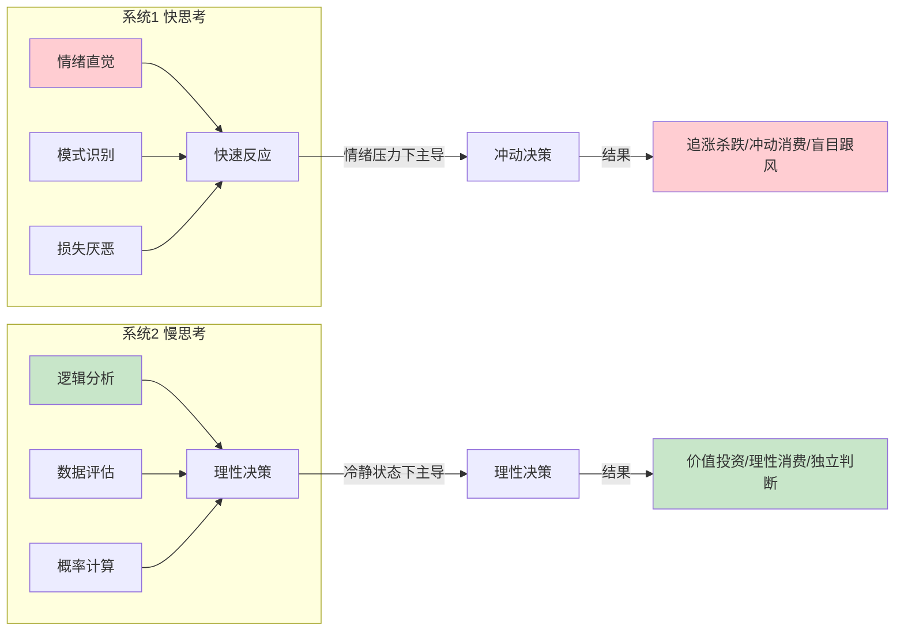
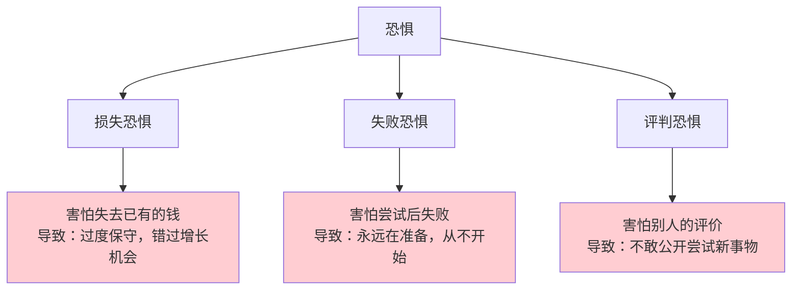
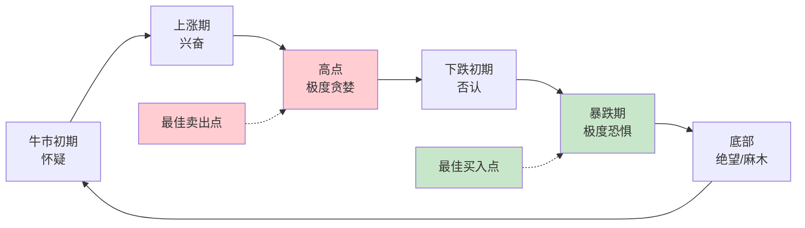
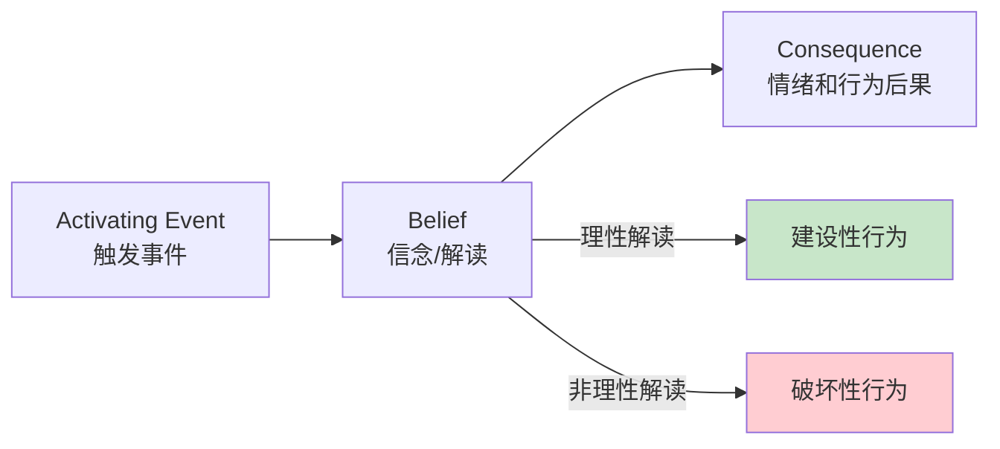
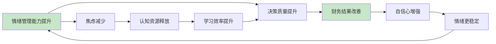

## 搞钱中的情绪管理

> "投资中最大的敌人不是市场，而是你自己。" —— 本杰明·格雷厄姆

搞钱本质上是一系列决策的叠加。而每一个决策的质量，都受到情绪状态的直接影响。哈佛商学院的研究表明，在投资决策中，情绪因素对最终收益的影响高达 **30%-50%**——超过了选股能力、择时技巧和信息优势的综合影响。换言之，一个情绪管理能力极强的普通人，其长期投资收益很可能超过一个情绪失控的金融专业人士。

情绪管理不是"压抑情绪"或"变得冷漠"，而是一套系统化的能力：识别情绪信号、理解情绪来源、在情绪和决策之间建立缓冲区、将情绪转化为行动力。本章将从神经科学原理出发，逐层拆解搞钱过程中最常见的情绪陷阱，并给出可落地的管理框架和实操工具。

---

### 一、情绪如何劫持你的钱袋：神经科学视角

#### 1.1 大脑的"双系统"与财务决策

诺贝尔经济学奖得主丹尼尔·卡尼曼在《思考，快与慢》中提出了大脑的双系统模型，这个模型对理解搞钱中的情绪至关重要：



**系统1（快思考）**：由杏仁核主导，反应速度极快（约0.1秒），擅长处理威胁和机会。当你看到某只股票暴涨时，系统1会在你还没来得及分析之前就发出"快买！要错过了！"的信号。

**系统2（慢思考）**：由前额叶皮层主导，反应较慢（需要数秒到数分钟），擅长逻辑分析和长期规划。但系统2有一个致命弱点——它消耗大量认知资源，容易疲劳，且在情绪激动时会被系统1"绑架"。

#### 1.2 杏仁核劫持：情绪失控的生理机制

哈佛心理学家丹尼尔·戈尔曼提出了"杏仁核劫持"（Amygdala Hijack）概念：当人面临强烈的情绪刺激时，杏仁核会绕过前额叶皮层，直接控制行为反应。

**在搞钱场景中的典型表现**：

| 触发场景 | 杏仁核反应 | 行为结果 | 财务损失 |
|---------|----------|---------|---------|
| 股票暴跌20% | 恐惧→逃跑本能 | 恐慌性卖出 | 卖在最低点 |
| 朋友说赚了100万 | 嫉妒→竞争本能 | 盲目跟风投资 | 高位接盘 |
| 商家限时折扣 | 焦虑→稀缺恐慌 | 冲动消费 | 买了不需要的东西 |
| 谈判中被激怒 | 愤怒→攻击本能 | 拒绝合理条件 | 损失合作机会 |
| 收入突然下降 | 恐惧→冻结反应 | 什么都不做 | 错过调整窗口期 |

#### 1.3 皮质醇与财务决策

压力激素皮质醇对财务决策的影响被严重低估。剑桥大学2017年的研究发现：

- 当皮质醇水平升高时，人的**风险偏好会发生两极化**：要么极度保守（什么都不投），要么极度激进（All in一个选项）
- 长期高皮质醇状态下，人的**延迟满足能力下降约40%**，更倾向于即时回报
- 皮质醇还会**削弱工作记忆**，使人难以处理复杂的财务信息

这意味着：如果你正处于高压状态（工作压力大、家庭矛盾、健康问题），你的财务决策质量会系统性地下降。此时最重要的情绪管理策略不是"做出更好的决策"，而是"减少决策数量"。

---

### 二、搞钱路上的六大情绪陷阱

#### 2.1 恐惧陷阱：不敢行动的代价

**表现形式**：
- "投资太危险了，我还是存银行吧"
- "万一亏了怎么办？"
- "现在市场不好，再等等"
- "我还没准备好，再学习一段时间"

**恐惧的三个层次**：



**恐惧的真实成本**：

假设你25岁时有10万元，因为恐惧只存银行（年化2%），而同龄人投资指数基金（年化8%）：

| 年龄 | 存银行 | 投资基金 | 差距 |
|------|--------|---------|------|
| 25岁 | 10万 | 10万 | 0 |
| 35岁 | 12.2万 | 21.6万 | 9.4万 |
| 45岁 | 14.9万 | 46.6万 | 31.7万 |
| 55岁 | 18.1万 | 100.6万 | 82.5万 |
| 65岁 | 22.0万 | 217.2万 | 195.2万 |

30年后，恐惧的代价是 **195万元**。这不是假设，这是复利数学。

**克服策略**：

1. **恐惧量化法**：把模糊的恐惧变成具体的数字。"万一亏了"→"如果我投5万，最坏情况亏30%，也就是1.5万。我能承受这1.5万的损失吗？"
2. **最小可行投资法**：用你完全亏得起的金额开始。1000元买一只基金，体验完整的"买入→波动→卖出"过程。恐惧来自未知，体验一次就消除大部分恐惧。
3. **预设最坏场景法**：在投资前写下"如果最坏的情况发生，我的应对方案是______"。有了Plan B，恐惧感会大幅降低。

#### 2.2 贪婪陷阱：过度冒险的代价

**表现形式**：
- "这只股票肯定会涨，我要All in"
- "杠杆放大收益，我要加满杠杆"
- "别人都赚了10倍，我也要"
- "再涨一点我就卖"（永远不卖）

**贪婪的神经机制**：

贪婪的本质是多巴胺的过度分泌。普林斯顿大学的研究发现，当人预期获得高额回报时，大脑伏隔核（快感中枢）的激活程度与吸食可卡因类似。这意味着追求高收益本身会产生"成瘾效应"——你需要越来越高的收益才能获得同样的快感。

**贪婪的典型后果**：

| 贪婪行为 | 短期感觉 | 长期结果 |
|---------|---------|---------|
| 满仓单只股票 | "集中力量办大事" | 一次黑天鹅归零 |
| 加杠杆炒币 | "以小博大" | 爆仓穿仓 |
| 不止盈 | "还能再涨" | 利润全部回吐 |
| 追热点概念 | "这次不一样" | 高位套牢 |
| 忽略风险提示 | "他们不懂" | 本金永久损失 |

**克服策略**：

1. **仓位铁律**：任何单一投资品种不超过总资产的20%。写下来，贴在电脑旁边。
2. **止盈纪律**：在买入时就设定卖出价格（盈利30%卖出一半，盈利60%全部卖出），并设置条件单自动执行。
3. **收益上限思维**：问自己"这个收益合理吗？"如果一个项目承诺年化50%以上，用"如果这么赚钱，为什么还需要我的钱？"来检验。
4. **定期"贪婪审计"**：每月检查一次自己的投资组合，问"哪些持仓是因为贪婪而非理性判断买入的？"

#### 2.3 FOMO陷阱：害怕错过的焦虑

**表现形式**：
- "比特币涨了10倍，我怎么没买？"
- "同事做副业月入5万，我也要做"
- "这个风口错过了就没了"
- "所有人都在赚钱，就我没赚到"

**FOMO的心理学本质**：

FOMO（Fear of Missing Out）本质上是社会比较心理和损失厌恶的叠加。当你看到别人赚钱时，你的大脑将其编码为"自己在亏损"——卡尼曼的前景理论告诉我们，损失的痛苦是同等收益快乐的 **2.5倍**。所以"别人赚了10万"给你的感觉是"自己亏了25万"。

**FOMO的决策陷阱**：

```mermaid
graph TD
    A[看到别人赚钱] --> B[产生FOMO焦虑]
    B --> C[仓促入场]
    C --> D{结果}
    D -->|赚了| E[强化"跟风有效"的错误认知]
    D -->|亏了| F[加倍焦虑，更想回本]
    E --> G[下次更大胆跟风]
    F --> H[更冲动的决策]
    G --> I[最终大亏]
    H --> I
    
    style I fill:#ffcdd2
    style B fill:#fff3e0
```

**克服策略**：

1. **24小时冷静期**：看到任何"机会"后，强制等待24小时再做决定。90%的FOMO冲动会在24小时内消退。
2. **机会成本思维**：每投入一个新机会，问自己"我为此放弃了什么？"你的时间、精力、资金都是有限的，追逐每一个"风口"意味着什么都做不好。
3. **个人赛道思维**：建立自己的投资/搞钱体系，而不是追逐别人的体系。巴菲特说过："在别人贪婪时恐惧，在别人恐惧时贪婪。"但前提是你要有自己的判断标准。
4. **信息断食**：定期（每周1-2天）远离财经新闻、投资群、赚钱社群。信息过载是FOMO的主要来源。

#### 2.4 后悔陷阱：被沉没成本绑架

**表现形式**：
- "我已经亏了这么多，不能卖"（死扛亏损股）
- "我花了3年学这个，不能放弃"（坚持错误方向）
- "我已经投入这么多钱了，不能半途而废"（追加沉没成本）
- "早知道就不该买"（反复自责，消耗精力）

**后悔厌恶的心理机制**：

心理学家发现，人对"做了后悔的事"的痛苦，远大于"没做后悔的事"。这种不对称导致两种极端行为：
- **不作为偏见**：为了避免"做了后悔"，选择什么都不做
- **沉没成本谬误**：为了证明"之前的决定没错"，继续投入更多资源

**克服策略**：

1. **定期清零法**：每季度问自己一个问题——"如果今天从零开始，我还会做同样的选择吗？"如果答案是否定的，立即调整。
2. **决策日记**：记录每次重要财务决策的理由和预期。当结果不好时，回头看决策过程是否合理。如果过程合理但结果不好，说明是运气问题，不需要自责。
3. **"未来价值"思维**：不要问"过去投入了多少"，要问"从现在起继续投入的边际价值是多少"。如果边际价值为负，立即止损。
4. **后悔最小化框架**：贝佐斯的"遗憾最小化框架"——想象80岁的自己回看今天，哪个选择会更少后悔？

#### 2.5 焦虑陷阱：过度担忧的内耗

**表现形式**：
- 每天看十几次账户余额
- 一点市场波动就睡不着觉
- 不断搜索负面新闻来"验证"自己的担忧
- 因为焦虑而频繁交易（越操作越亏）

**焦虑的恶性循环**：

焦虑→频繁查看账户→看到波动→更焦虑→做出冲动决策→亏损→更焦虑→更频繁查看→……

研究表明，**查看账户频率与投资收益呈显著负相关**。每天查看账户的投资者，其年化收益比每月查看一次的投资者低约 **3-5个百分点**，原因在于频繁查看会放大短期波动带来的情绪影响。

**克服策略**：

1. **设定查看频率**：根据投资期限设定查看频率。长期投资→每月查看一次；中期投资→每周查看一次。把查看频率写下来，严格执行。
2. **焦虑时间盒**：每天设定固定的15分钟"焦虑时间"，在这段时间里允许自己担忧、搜索、分析。其他时间如果出现焦虑念头，告诉自己"等到焦虑时间再处理"。
3. **自动化决策**：把能自动化的决策全部自动化——定投、止盈止损、定期再平衡。自动化是焦虑的最佳解药。
4. **身体锚定法**：当焦虑发作时，用5-4-3-2-1感官练习回到当下——看5个物体、摸4个表面、听3种声音、闻2种气味、尝1种味道。

#### 2.6 傲慢陷阱：过度自信的代价

**表现形式**：
- "我比市场聪明"（频繁择时）
- "这次我对了"（忽略之前的错误）
- "我的判断不会错"（不做风险控制）
- "我不需要分散投资"（集中持仓）

**过度自信的认知偏差**：

行为金融学研究发现，投资者普遍高估自己的判断准确率：
- 散户认为自己的选股准确率为 **70%**，实际仅为 **50%** 左右
- 交易越频繁的投资者，过度自信程度越高，实际收益越低
- 连续盈利3次后，过度自信程度会急剧上升（热手谬误）

**"牛市股神"现象**：在牛市中，几乎所有人都能赚钱，这会让人误以为是自己的能力而非市场趋势。当熊市来临时，这些"股神"往往会遭受最惨重的损失。

**克服策略**：

1. **记录每一笔交易**：包括买入理由、预期收益、实际结果。定期回顾时，你会发现自己的判断准确率远低于想象。
2. **预设错误率**：在做任何投资决策时，先假设"我有40%的概率是错的"，然后据此设置仓位和止损。
3. **寻找反面证据**：当你看好一个投资时，主动去搜索"为什么这个投资会失败"的理由。强迫自己看到对立面。
4. **设立"魔鬼代言人"**：找一个信任的朋友，在你做重大财务决策前，请他专门挑毛病。

---

### 三、不同搞钱场景的情绪管理

#### 3.1 投资中的情绪管理

**投资情绪周期图**：



| 市场阶段 | 大众情绪 | 正确做法 | 错误做法 |
|---------|---------|---------|---------|
| 牛市初期 | 怀疑、观望 | 逐步建仓 | 继续等待 |
| 上涨中期 | 兴奋、贪婪 | 持有+逐步止盈 | 追加杠杆 |
| 牛市顶峰 | 极度乐观 | 大幅减仓 | All in |
| 熊市初期 | 否认、侥幸 | 止损离场 | 死扛补仓 |
| 熊市中期 | 恐惧、焦虑 | 持有现金等待 | 恐慌性抛售 |
| 熊市底部 | 绝望、麻木 | 逢低分批建仓 | 彻底离场 |

**投资决策检查清单**（每次交易前必问）：

1. 我现在的情绪状态是什么？（平静/兴奋/恐惧/焦虑）
2. 如果我现在完全平静，还会做同样的决定吗？
3. 这个决定是基于数据还是基于感觉？
4. 如果这笔钱明天就亏50%，我能接受吗？
5. 我是否在追赶某个已经发生的趋势？

#### 3.2 创业/副业中的情绪管理

创业和副业带来的情绪挑战与投资不同——它涉及更长期的不确定性、更大的自我认同风险、以及更复杂的人际关系。

**创业情绪的四个阶段**：

| 阶段 | 时间 | 典型情绪 | 风险行为 | 应对策略 |
|------|------|---------|---------|---------|
| 蜜月期 | 0-3个月 | 过度乐观 | 花钱大手大脚 | 设定预算上限 |
| 挫折期 | 3-12个月 | 自我怀疑 | 过早放弃 | 设定阶段性小目标 |
| 瓶颈期 | 1-2年 | 倦怠、焦虑 | 盲目转型 | 找导师/同伴交流 |
| 突破期 | 2年+ | 信心恢复 | 过度扩张 | 保持敬畏，稳扎稳打 |

**创业中的关键情绪管理原则**：

1. **分离自我价值和业务价值**：业务失败不等于你这个人失败。很多成功企业家都经历过多次失败——马云被拒绝过30多次，史蒂夫·乔布斯被自己创办的公司开除过。
2. **设置"情绪止损点"**：和投资止损一样，给自己的情绪也设一个底线。比如"连续失眠3天就暂停项目，先处理情绪"。
3. **建立反馈机制**：定期（每周或每月）和信任的人复盘业务和情绪状态。外部视角能帮你看到自己的盲区。

#### 3.3 职场收入提升中的情绪管理

**薪资谈判中的情绪陷阱**：

- **讨好陷阱**：害怕破坏关系，不敢提加薪。事实上，合理的薪资谈判是专业行为，不会破坏关系。
- **愤怒陷阱**：对薪资不满而冲动离职。正确做法是先表达诉求，给双方调整的时间。
- **自卑陷阱**：觉得自己的价值不值更高的薪资。用市场数据和自己的业绩来对抗这种感觉。

**向上管理中的情绪管理**：

1. **接受"不公平"**：职场中存在大量不公平现象，情绪化应对只会让自己受损。
2. **聚焦可控因素**：你能控制的是自己的能力和表现，不能控制的是老板的偏好和公司的政治。
3. **建立"职业安全网"**：保持副业收入或投资收入，降低对单一收入来源的依赖，从而减少职场焦虑。

#### 3.4 消费中的情绪管理

**情绪性消费的触发模式**：

| 情绪状态 | 消费行为 | 消费结果 | 替代方案 |
|---------|---------|---------|---------|
| 压力大 | 购物减压 | 买了一堆不需要的东西 | 运动/冥想 |
| 心情差 | 报复性消费 | 信用卡账单爆表 | 和朋友倾诉 |
| 无聊 | 刷购物App | 无意识下单 | 找一个免费爱好 |
| 焦虑 | 买课程囤知识 | 买了100门课只看了3门 | 先学完手头的 |
| 社交压力 | 买名牌/请客 | 超出预算 | 学会说"不" |

**24小时+10-10-10消费决策法**：

对于任何超过月收入5%的非必要消费，执行两步检验：

第一步（24小时法则）：加入购物车，等待24小时。
第二步（10-10-10法则）：
- 10分钟后，买这个东西会让我多开心？（通常：很开心）
- 10个月后，我还会用/记得这个东西吗？（通常：不会）
- 10年后，这笔钱如果用来投资，值多少？（按8%年化：2.17倍）

---

### 四、情绪管理的系统化框架

#### 4.1 情绪ABC模型在搞钱中的应用

心理学家阿尔伯特·艾利斯提出的ABC模型，是管理搞钱情绪最实用的框架：



**关键洞察**：导致情绪反应的不是事件本身，而是你对事件的解读（信念）。改变解读方式，就能改变情绪反应。

**搞钱场景中的ABC应用实例**：

| 触发事件(A) | 非理性信念(B) | 情绪后果(C) | 理性替代信念(B') | 新的情绪后果(C') |
|------------|-------------|------------|----------------|----------------|
| 股票跌了20% | "我完了，钱全没了" | 恐慌性抛售 | "短期波动是正常的，我买的是长期价值" | 平静持有 |
| 朋友赚了100万 | "我太差了，永远追不上" | 自卑焦虑 | "他的路径和我不同，关注自己的进度" | 平静自省 |
| 副业3个月没收入 | "我不是这块料" | 放弃 | "大多数生意前3个月都没收入，这是正常的" | 继续优化 |
| 工资被降了 | "公司不认可我" | 愤怒离职 | "先了解原因，再决定是否调整" | 理性评估 |
| 冲动消费了5000元 | "我真没用" | 自责焦虑 | "这是一个学习机会，我来分析触发原因" | 积极复盘 |

**实操练习**：

准备一个"情绪-决策日志"，每当做出让自己后悔的财务决策时，填写以下模板：

```text
日期：____
触发事件：____
当时的情绪：____
当时的解读（信念）：____
做出的决策：____
事后看，这个解读合理吗？____
更理性的解读应该是：____
如果用更理性的解读，我会怎么做？____
```

#### 4.2 STOP情绪中断技术

当感受到强烈情绪时，使用STOP技术在情绪和行动之间建立缓冲：

- **S - Stop（停下来）**：无论在做什么，先暂停。不要发送那条消息，不要点击那个按钮，不要打那个电话。
- **T - Take a breath（深呼吸）**：做3次深呼吸（吸气4秒-屏息4秒-呼气6秒），激活副交感神经系统，降低心率和皮质醇水平。
- **O - Observe（观察）**：观察自己的情绪状态——"我现在是什么感觉？这个感觉在身体的哪个部位？强度从1到10是几分？"
- **P - Proceed mindfully（有意识地行动）**：问自己"基于理性分析，我现在应该做什么？"然后按照答案行动。

**STOP技术的应用场景**：

- 打开交易软件准备追涨时 → STOP → 理性评估后再决定
- 和客户谈判被激怒时 → STOP → 冷静后再回应
- 看到限时折扣准备下单时 → STOP → 24小时后再决定
- 收到同事高薪消息准备跳槽时 → STOP → 全面评估后再行动

#### 4.3 情绪觉察的四层漏斗

真正的情绪管理从觉察开始。大多数人只意识到最表面的情绪，而忽略了更深层的驱动因素：

```mermaid
graph TD
    A[第四层：表面情绪<br>愤怒、焦虑、兴奋] --> B[第三层：核心情绪<br>恐惧、悲伤、孤独]
    B --> B1["害怕失败 → 对未来的不确定感"]
    B --> B2["害怕被评判 → 对自我价值的怀疑"]
    B --> B3["害怕失去 → 对安全感的需求"]
    
    B --> C[第二层：核心信念<br>"我不够好""钱是肮脏的""我不配有钱"]
    C --> D[第一层：童年经历/文化影响<br>原生家庭的金钱观<br>社会文化的财富叙事]
    
    style A fill:#ffcdd2
    style B fill:#fff3e0
    style C fill:#e3f2fd
    style D fill:#e8f5e9
```

**深层觉察练习**：

1. **金钱传记**：写下你从小到大关于金钱的5个重要记忆，分析这些记忆如何塑造了你现在的金钱观。
2. **情绪溯源**：当你感到与金钱相关的强烈情绪时，问"这种感觉最早出现在什么时候？"
3. **信念审计**：列出你关于金钱的所有信念（"钱是万恶之源""赚钱很辛苦""有钱人都不快乐"），逐条检验其真实性。

---

### 五、日常情绪管理实操体系

#### 5.1 晨间情绪准备（5分钟）

每天早上花5分钟做"情绪准备"，为一天的财务决策打好基础：

```text
1. 深呼吸3次，清空杂念
2. 回顾今天的财务计划（有没有需要做的决策？）
3. 设定今天的情绪意图（"今天我要保持冷静和理性"）
4. 预演可能的情绪触发场景及应对方案
```

#### 5.2 决策前情绪检查（2分钟）

在做任何财务决策前，花2分钟做情绪检查：

```text
1. 我现在的情绪状态是什么？（用1-10分打分）
2. 如果情绪评分>7（激动）或<3（低落），推迟决策
3. 这个决策有时间压力吗？如果没有，等一等
4. 我是否在试图追赶某个已经发生的趋势？
5. 如果我最信任的人在旁边，我会怎么做？
```

#### 5.3 晚间情绪复盘（10分钟）

每天晚上花10分钟复盘当天的情绪和决策：

```text
1. 今天做了哪些财务相关的决策？
2. 每个决策时的情绪状态是什么？
3. 有没有因为情绪做出不理想的决策？
4. 如果重来一次，我会怎么做？
5. 明天需要特别注意什么？
```

#### 5.4 每周情绪周报

每周日花20分钟做一次情绪周报：

| 维度 | 本周评分(1-10) | 触发因素 | 改进措施 |
|------|---------------|---------|---------|
| 整体情绪稳定度 | | | |
| 投资决策理性度 | | | |
| 消费控制力 | | | |
| 焦虑/压力水平 | | | |
| 信心/动力水平 | | | |

#### 5.5 情绪管理工具箱

**即刻可用的减压工具**（当情绪即将失控时）：

| 工具 | 适用场景 | 操作方法 | 见效时间 |
|------|---------|---------|---------|
| 4-7-8呼吸法 | 焦虑、紧张 | 吸气4秒-屏息7秒-呼气8秒 | 30秒 |
| 冷水洗脸 | 愤怒、冲动 | 用冷水洗脸或冰敷手腕 | 10秒 |
| 散步 | 纠结、犹豫 | 出去走10分钟，不带手机 | 5分钟 |
| 书写释放 | 情绪积压 | 把所有感受写下来，不删改 | 10分钟 |
| 身体扫描 | 焦虑、不安 | 从头到脚逐步放松每个部位 | 5分钟 |

**中长期情绪管理习惯**：

| 习惯 | 频率 | 时长 | 核心收益 |
|------|------|------|---------|
| 冥想 | 每天 | 10-20分钟 | 提升情绪觉察力和自控力 |
| 运动 | 每周3-5次 | 30-60分钟 | 降低皮质醇，提升血清素 |
| 日记 | 每天 | 10分钟 | 梳理情绪，发现模式 |
| 自然接触 | 每周 | 2小时+ | 降低焦虑，恢复认知资源 |
| 社交支持 | 每周 | 不定 | 获得外部视角和情感支持 |

---

### 六、高级进阶：将情绪转化为搞钱动力

#### 6.1 情绪不是敌人，而是信号

真正的情绪管理不是消除情绪，而是将情绪转化为有价值的信息：

- **恐惧**告诉你："这里有你需要评估的风险"
- **贪婪**告诉你："这里有机会，但需要冷静分析"
- **焦虑**告诉你："你的准备可能不够充分"
- **愤怒**告诉你："你的边界被侵犯了"
- **嫉妒**告诉你："你内心深处真正想要的是什么"

**练习**：下次出现强烈情绪时，不要急着压制它，而是问——"这个情绪在试图告诉我什么？"

#### 6.2 建立"情绪免疫系统"

就像身体的免疫系统需要通过接触病原来建立抵抗力一样，情绪免疫系统也需要通过"可控的压力暴露"来建立：

1. **小额亏损训练**：用很小的金额（比如500元）去做一笔你知道可能亏损的投资，体验亏损的感觉，练习在亏损后保持理性。
2. **拒绝训练**：每周刻意让自己被拒绝一次（比如要求折扣、提出加薪），降低对"被拒绝"的情绪反应强度。
3. **不确定性训练**：刻意进入一些不确定的场景（比如尝试一个新的副业方向），练习在不确定中保持行动力。

#### 6.3 情绪管理的复利效应

情绪管理能力的提升同样会产生复利效应：



每一次成功管理情绪做出理性决策，都在强化你的"情绪肌肉"。这就是为什么有经验的投资者在市场波动时比新手更冷静——不是因为他们没有情绪，而是因为他们的情绪管理肌肉经过了反复训练。

---

### 七、常见误区与纠正

#### 误区一：情绪管理 = 压抑情绪

**错误认知**："我要控制自己的情绪，不能有负面情绪"

**正确理解**：压抑情绪会导致情绪反弹——越是压制的恐惧，爆发时越猛烈。情绪管理的目标是"觉察-理解-转化"，而不是"消灭"。

**纠正方法**：允许自己感受情绪，但不在情绪最强烈时做决策。给自己一个"情绪缓冲期"。

#### 误区二：理性决策 = 不需要情绪

**错误认知**："好的投资者/创业者应该完全理性"

**正确理解**：神经科学家安东尼奥·达马西奥的研究证明，完全没有情绪的人反而做不好决策——因为情绪提供了"直觉判断"这一重要信息来源。关键不是消除情绪，而是让情绪和理性协同工作。

**纠正方法**：把情绪当作一个"数据输入"，和逻辑分析一起纳入决策过程，但不要让情绪成为唯一的决策依据。

#### 误区三：一次情绪失控 = 情绪管理失败

**错误认知**："我又冲动交易了，我的情绪管理太差了"

**正确理解**：情绪管理是一个长期练习过程，偶尔失控是正常的。关键不是"从不失误"，而是"失误后如何恢复和学习"。

**纠正方法**：每次失控后做复盘——触发因素是什么？下次如何提前预防？把每次失控变成学习机会。

#### 误区四：情绪管理可以速成

**错误认知**："看了这篇文章/学了这个技巧，我就能管理好情绪了"

**正确理解**：情绪管理能力的建立需要长期练习，就像健身一样——知道怎么做和真正做到之间有巨大的鸿沟。

**纠正方法**：把情绪管理当作一个持续的练习项目，每天练习，每周复盘，每月评估进步。

#### 误区五：只关注投资情绪，忽略其他搞钱场景

**错误认知**："情绪管理只在炒股时需要"

**正确理解**：情绪管理贯穿搞钱的每一个环节——谈判、消费、学习、社交、创业都需要。

**纠正方法**：将情绪管理练习融入日常生活的方方面面，而不仅仅在投资时才想起来。

---

### 本节小结

情绪管理是搞钱的"底层操作系统"。所有具体的赚钱技巧——投资策略、谈判方法、创业计划——都运行在这个操作系统之上。操作系统不稳定，再好的应用也会崩溃。

**核心要点回顾**：

1. **理解机制**：大脑的双系统模型、杏仁核劫持、皮质醇影响——理解这些机制是管理情绪的第一步
2. **识别陷阱**：恐惧、贪婪、FOMO、后悔、焦虑、傲慢——六大情绪陷阱各有其应对策略
3. **场景化管理**：投资、创业、职场、消费——不同场景需要不同的情绪管理策略
4. **系统化框架**：ABC模型、STOP技术、情绪觉察漏斗——将情绪管理从"靠感觉"升级为"有方法"
5. **日常练习**：晨间准备、决策前检查、晚间复盘——情绪管理是每天的练习，不是偶尔的灵感
6. **转化利用**：情绪不是敌人而是信号——学会从情绪中提取有价值的信息

> **行动建议**：从今天开始，准备一个"情绪-决策日志"，记录你每一次重要的财务决策及其情绪背景。坚持30天，你会发现自己的情绪模式，这本身就是情绪管理能力提升的开始。
