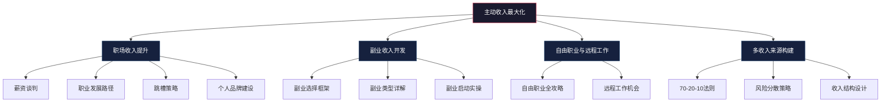
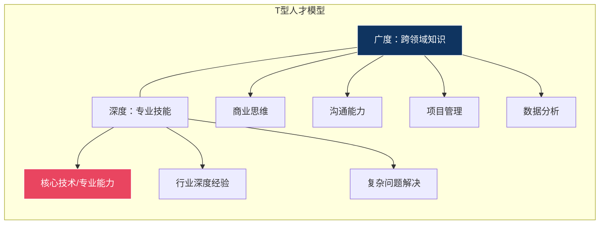
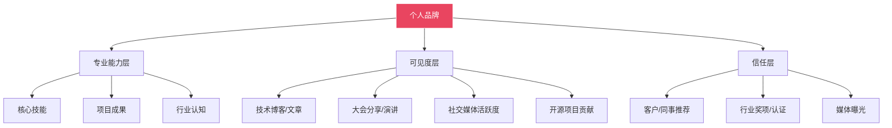
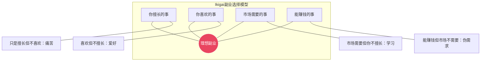
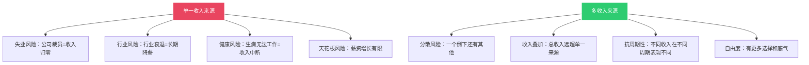
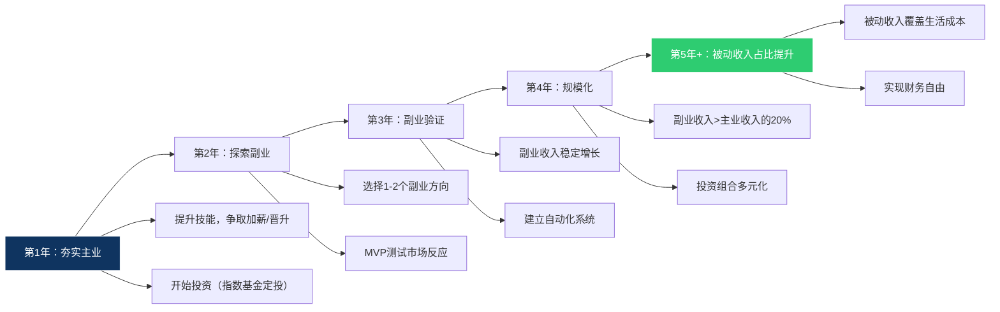

# 第四章：主动收入最大化

> "在你还没有被动收入之前，主动收入就是你的生命线。" —— 佚名

主动收入是大多数人财富积累的起点，也是后续一切财务自由策略的地基。本章将从**职场收入提升**、**副业收入开发**、**自由职业与远程工作**、以及**多收入来源构建**四个维度，系统讲解如何最大化你的主动收入。每一个维度都会从底层逻辑讲到具体操作，确保读者既能理解"为什么"，也能掌握"怎么做"。



---

## 4.1 职场收入提升策略

职场收入是大多数人最稳定、最可靠的第一桶金来源。提升职场收入不是靠"等"，而是靠系统性的策略执行。

### 4.1.1 薪资谈判的底层逻辑

薪资谈判的本质是一场**价值交换的博弈**。你提供劳动价值，公司支付对价。谈判的目标不是"说服"对方给你加薪，而是让对方**认识到你的价值高于当前价格**。

#### 锚定效应与框架效应

行为经济学中的**锚定效应**（Anchoring Effect）在薪资谈判中极为关键：人们在做决策时，会过度依赖第一个接收到的信息。这意味着：

- **先出价的一方掌握主动权**。如果你知道自己的市场价值，主动报出一个略高于期望的数字（留出谈判空间），这个数字会成为后续谈判的"锚点"。
- **报价策略**：期望薪资 × 1.15 ~ 1.25 作为首次报价。例如你期望月薪3万，可以报价3.4-3.75万。
- **框架效应**：同样一个数字，不同的表述方式效果截然不同。"年薪40万"比"月薪3.3万"听起来更有分量；"涨幅30%"比"涨6000元"更有冲击力。

#### BATNA：你的谈判底线

BATNA（Best Alternative To a Negotiated Agreement，最佳替代方案）是谈判理论的核心概念。你的BATNA越强，谈判筹码越大。

**如何构建强BATNA**：
1. **拿到外部offer**：这是最硬的BATNA，意味着你有明确的替代选择
2. **提升不可替代性**：掌握核心技术、关键客户关系、稀缺技能
3. **市场价值背书**：猎头的估值、同行的薪资水平、行业报告数据
4. **展示外部机会**：适度让领导知道你收到过猎头联系（但不要威胁）

**谈判中的话术框架**：

| 阶段 | 目的 | 话术模板 |
|------|------|----------|
| 开场 | 建立积极氛围 | "感谢公司给我这个机会，我很喜欢这里的工作环境和团队。我想和您讨论一下我的薪资情况。" |
| 展示价值 | 用数据证明贡献 | "过去一年，我完成了XX项目，为公司带来了XX收益，用户增长XX%。我也在不断学习新技能，比如XX。" |
| 提出要求 | 明确期望 | "根据我的贡献和市场行情，我希望薪资能调整到XX。" |
| 应对拒绝 | 保留谈判空间 | "我理解公司的预算限制。那我们可以讨论一下其他补偿方式吗？比如更多的假期、培训机会或者弹性工作时间？" |
| 应对拖延 | 设定时间线 | "我理解需要时间考虑。我们可以在两周后再讨论这个话题吗？" |

#### 了解你的市场价值

谈薪之前，你必须知道自己的"市场价"是多少。以下是四个核心信息来源及其使用方法：

| 信息来源 | 具体渠道 | 优势 | 局限 |
|----------|----------|------|------|
| 招聘网站 | 猎聘、BOSS直聘、拉勾网、脉脉 | 数据量大，更新快 | 报价区间宽，水分较大 |
| 薪资报告 | 各平台年度薪资报告（如猎聘薪酬报告、拉勾薪资白皮书） | 数据经过清洗，趋势清晰 | 滞后性强，通常为上年数据 |
| 猎头咨询 | 专业猎头顾问（如科锐国际、光辉国际） | 对特定岗位了解深入 | 猎头可能有倾向性 |
| 行业社群 | 脉脉职言区、知乎、行业微信群 | 真实度高，有细节 | 样本小，容易以偏概全 |
| 专业工具 | Glassdoor、Levels.fyi（技术岗）、职级对标工具 | 标准化程度高 | 部分岗位覆盖不足 |

**薪资构成分析**：不要只看月薪，要看总薪酬包。

```text
总薪酬 = 基本工资 + 绩效奖金 + 年终奖 + 股票/期权 + 福利
```

例如：某互联网公司高级工程师的完整薪酬包：
- 基本工资：3万/月
- 绩效奖金：0-6万/季度（取决于绩效等级）
- 年终奖：2-4个月工资（公司业绩好时4个月）
- 股票：价值50万，分4年归属（每年12.5万，折合月均约1万）
- 福利：餐补、交通补、补充医疗（价值约2000-3000元/月）
- **总年薪**：约 60-80万

**谈判时机的选择至关重要**：

| 最佳时机 | 原因 | 最差时机 | 原因 |
|----------|------|----------|------|
| 年度绩效评估后 | 公司已有预算预期，你的贡献有记录 | 刚入职时 | 尚未证明价值 |
| 完成重大项目后 | 有具体成果可展示 | 公司裁员期间 | 预算收紧，管理层自顾不暇 |
| 获得外部offer时 | BATNA最强 | 项目失败后 | 价值证据为负 |
| 公司业绩好时 | 预算充足 | 经济下行期 | 公司在缩减成本 |
| 承担新职责前 | 新职责 = 新价值，先定价再干活 | 领导忙于其他事务时 | 没有注意力给你 |

**非现金福利的争取**：

除了工资，还有很多高价值的非现金福利值得争取。这些福利的实际价值往往被低估：

| 福利类型 | 实际价值估算 | 争取难度 |
|----------|-------------|----------|
| 远程办公（每周1-2天） | 节省通勤时间+交通费，约500-1000元/月 | 低 |
| 弹性工作时间 | 提升生活质量，降低迟到压力 | 低 |
| 更多带薪假期 | 每多1天假期 ≈ 日薪的价值 | 中 |
| 培训和学习机会 | 优质培训市场价5000-50000元/年 | 中 |
| 补充医疗保险 | 覆盖门诊+牙科+眼科，约3000-8000元/年 | 低 |
| 住房/交通/餐饮补贴 | 每月1000-3000元不等 | 中 |
| 充电时间（如每周半天学习） | 技能提升的长期回报极高 | 高 |
| 头衔提升 | 跳槽时的市场价值锚点 | 中 |

**案例：一次成功的薪资谈判**

小李是一名产品经理，在公司工作2年，月薪2万。他觉得自己的薪资低于市场水平。

**准备阶段**（提前1个月）：
- 调研市场行情：同级别产品经理月薪2.5-3万（综合猎聘、BOSS直聘、3位猎头的反馈）
- 整理工作成果：主导了3个重要项目，用户增长50%，带来直接收入增长约200万
- 准备了一页纸的"个人价值报告"，用数据说话
- 确定BATNA：已有猎头推荐机会，预期薪资2.5万+

**谈判过程**：
1. 选择时机：年度绩效评估后（绩效为A，公司有调薪预算）
2. 先表达感谢和忠诚："我很认可公司的方向，也愿意长期发展"
3. 展示价值：用一页纸汇报工作成果，重点突出业务影响
4. 主动报价（运用锚定效应）："根据我的贡献和市场行情，我希望薪资能调整到3万"
5. 应对质疑："我理解预算限制，这是我的调研数据"（展示市场薪资报告）
6. 达成共识：最终薪资调整到2.6万，外加每季度5000元绩效奖金+培训预算

**结果**：月薪增加6000元+绩效奖金，年收入增加约9.2万。同时获得了公司报销的MBA课程，价值约10万。

### 4.1.2 职业发展路径规划

#### T型人才与技能叠加

现代职场最有竞争力的人才模型是**T型人才**：在某一领域有深度专业能力（T的竖线），同时在多个相关领域有广度知识（T的横线）。



**技能叠加**（Skill Stacking）理论：你不需要在单项技能上做到世界前1%，只需要在多项技能的**交叉点**上做到稀缺。例如：

- 程序员 + 写作能力 = 技术博主/技术布道师（薪资溢价30-50%）
- 设计师 + 商业思维 = 产品设计总监（薪资溢价50-100%）
- 销售 + 数据分析 = 增长专家（薪资溢价40-60%）
- 翻译 + 行业知识 = 同声传译/专业译者（时薪3000-8000元 vs 普通翻译100-300元/千字）

#### 技术路线详解

```text
初级工程师 → 中级工程师 → 高级工程师 → 技术专家/架构师 → 首席科学家/CTO
```

| 阶段 | 年限 | 核心能力 | 薪资范围（互联网） | 关键跃迁点 |
|------|------|----------|-------------------|-----------|
| 初级工程师 | 0-2年 | 掌握一门语言/框架，能独立完成模块开发 | 1-1.5万/月 | 从"需要指导"到"能独立干活" |
| 中级工程师 | 2-5年 | 独立负责一个子系统，有技术选型能力 | 2-3万/月 | 从"写代码"到"设计系统" |
| 高级工程师 | 5-8年 | 设计复杂系统，解决技术难题，带小团队 | 3-5万/月 | 从"做技术"到"定方向" |
| 技术专家/架构师 | 8-12年 | 技术战略规划，跨团队影响力，技术决策 | 5-8万/月 | 从"个人能力"到"组织影响力" |
| 首席科学家/CTO | 12年+ | 技术愿景，技术文化建设，商业技术融合 | 10万+/月 | 从"技术"到"技术+商业+管理" |

#### 管理路线详解

```text
个人贡献者 → 团队负责人 → 部门经理 → 总监 → VP → C-level
```

| 阶段 | 管理幅度 | 核心能力 | 薪资范围（互联网） | 关键跃迁点 |
|------|----------|----------|-------------------|-----------|
| 团队负责人 | 3-8人 | 任务分配、绩效反馈、一对一辅导 | 3-5万/月 | 从"自己干"到"让别人干" |
| 部门经理 | 10-30人 | 跨团队协调、资源调配、目标管理 | 5-8万/月 | 从"管人"到"管业务" |
| 总监 | 30-100人 | 战略规划、预算管理、组织建设 | 8-15万/月 | 从"执行"到"规划" |
| VP | 100-500人 | 公司级战略、董事会沟通、行业影响 | 15-30万/月 | 从"部门"到"公司" |
| C-level | 全公司 | 公司愿景、股东关系、行业格局 | 30万+/月 | 从"管理"到"领导" |

#### 复合路线：技术管理双通道

现代企业越来越倾向于**复合型人才**，即同时具备深度技术能力和管理能力的人。这类人才的薪资天花板远高于单一通道。

```text
专业技能 + 管理能力 + 商业思维 = 复合型人才（最高薪资天花板）
```

**优势**：
- 更多的职业选择：可以在技术和管理之间灵活切换
- 更高的薪资天花板：技术管理者往往比纯管理者或纯技术人员薪资更高
- 更强的抗风险能力：经济下行时，复合型人才更不容易被裁
- 更容易创业成功：既懂技术又懂商业的创业者成功率更高

**案例：一个程序员的10年职业发展路径**

小张是一名计算机专业毕业生，他的职业发展路径展示了如何从初级工程师成长为技术合伙人：

**第1-3年：技术积累期**
- 精通Java和Spring生态，参与5个以上项目
- 主动承担难题，成为团队中的"问题终结者"
- 月薪从1万涨到2万（一次内部调薪+一次跳槽）
- **关键动作**：每完成一个项目写技术总结，沉淀方法论

**第4-6年：技术专家期**
- 成为团队的技术骨干，主导了核心系统的架构重构
- 开始在技术社区写文章，积累了一定的行业影响力
- 带领3-5人的小团队，兼任技术管理
- 月薪涨到3.5万（一次晋升+一次跳槽到更大的平台）
- **关键动作**：开始建立个人技术品牌，参加技术大会分享

**第7-9年：技术管理期**
- 转型为技术经理，管理15人团队
- 负责多个产品线的技术架构和团队管理
- 月薪涨到5万+股票
- **关键动作**：补充管理知识（读MBA课程），培养商业思维

**第10年+：技术合伙人**
- 加入创业公司，成为技术合伙人（CTO）
- 负责技术团队搭建和产品开发
- 收入：工资+股权（股权潜在价值数百万）
- **关键动作**：选择有前景的赛道和靠谱的创始人

### 4.1.3 跳槽策略与时机选择

跳槽是提升薪资最直接的方式之一。数据显示，跳槽的平均薪资涨幅为20-30%，远高于内部调薪的5-15%。但跳槽也有风险，需要系统性的策略。

#### 跳槽决策矩阵

| 判断维度 | 适合跳槽 | 不适合跳槽 |
|----------|----------|-----------|
| 薪资差距 | 低于市场水平30%以上 | 已接近市场水平 |
| 成长空间 | 连续2年没有晋升或新技能学习 | 有明确的晋升路径 |
| 公司前景 | 业务下滑、裁员频繁 | 公司处于快速发展期 |
| 个人状态 | 简历和面试已准备好 | 刚入职不到1年 |
| 市场环境 | 行业景气，机会多 | 行业寒冬，机会少 |
| 项目状态 | 已完成当前项目交接 | 正负责重要项目的关键阶段 |

#### 跳槽频率的黄金节奏

- **前5年**：每2-3年跳一次。这是快速成长期，通过跳槽实现薪资和职级的跳跃式增长。但太频繁（不到1年）会被标记为"不稳定"。
- **5-10年**：每3-5年跳一次。此时需要在一家公司积累深度经验和管理经验，过于频繁不利于晋升到管理层。
- **10年+**：根据机会决定。此时你的市场价值已经很高，不需要为了涨薪而跳槽，而是为了更好的平台、更大的挑战或创业机会。

#### 公司类型选择分析

| 公司类型 | 优点 | 缺点 | 适合人群 | 薪资特点 |
|----------|------|------|----------|----------|
| 大厂（BAT、TMD等） | 薪资高、平台好、简历加分 | 竞争激烈、容易成为螺丝钉、加班多 | 追求稳定和品牌背书 | 基本工资+高年终+股票 |
| 中型公司 | 成长快、机会多、话语权大 | 风险较高、体系不完善 | 追求成长和挑战 | 基本工资+期权（有暴富可能） |
| 创业公司 | 期权、成长空间大、决策权大 | 风险最高、不稳定 | 追求高回报和自主权 | 低基本工资+高期权 |
| 外企 | 工作生活平衡、管理规范、国际视野 | 晋升天花板（玻璃天花板）、决策链长 | 追求生活品质和规范化 | 基本工资+固定奖金+福利好 |
| 国企/事业单位 | 稳定、福利好、退休保障 | 薪资较低、论资排辈 | 追求长期稳定 | 基本工资+各种补贴+隐性福利 |
| 互联网金融/新消费 | 薪资溢价高、成长快 | 泡沫风险、监管不确定性 | 愿意承担风险换高回报 | 基本工资+高绩效+期权 |

#### 跳槽谈薪的核心技巧

1. **不要先报价**：让对方先出价，你在对方的基础上加码。如果HR问你期望薪资，可以说"我更看重整体发展机会，薪资方面我相信公司会给一个合理的方案"。
2. **给出范围而不是具体数字**：说"期望25-30万年薪"比说"期望27万"更好——对方会倾向于你的范围的中上部分。
3. **考虑整体薪酬包**：基本工资只是其中一部分，年终奖、股票、福利、加班费都需要纳入考量。
4. **不要急于接受第一个offer**：可以说"感谢您的offer，我需要1-2天考虑一下"，这给了你谈判的空间。
5. **用现有offer谈其他offer**：如果你手上有多个offer，可以互相作为谈判筹码（但不要撒谎）。

**案例：一次跨行业的成功跳槽**

小王是一名数据分析师，在一家传统制造业企业工作3年，月薪1.5万。他决定跳槽到互联网行业。

**准备阶段**（3个月）：
- 学习互联网行业常用的数据分析工具（如GrowingIO、神策数据、SQL优化）
- 在GitHub上发布数据分析项目，建立作品集
- 投递简历到20+目标公司，拿到5个面试机会
- 研究目标公司的业务模式和数据需求

**面试过程**：
- 通过了3轮面试（技术面+业务面+总监面）
- 在业务面中，针对目标公司的产品提出了3个数据驱动的优化建议
- 展示了从数据采集→清洗→分析→可视化的完整项目

**谈判结果**：
- 新公司薪资：2.5万/月（涨幅67%）
- 年终奖：3个月（约7.5万）
- 股票：价值20万，分4年归属
- 总年薪：约40万（相比之前的18万，增长122%）

### 4.1.4 个人品牌建设

在信息时代，**个人品牌是你最有价值的职场资产**。一个好的个人品牌能让你获得更多的机会、更高的薪资、更强的议价能力。

#### 个人品牌的三层结构



#### 个人品牌建设的实操路径

| 阶段 | 时间 | 核心动作 | 预期效果 |
|------|------|----------|----------|
| 起步期 | 1-3个月 | 在知乎/掘金/公众号上每周发布1篇专业文章 | 积累100-500个关注者 |
| 成长期 | 3-12个月 | 参加行业社群，主动分享，争取小规模分享机会 | 积累1000-5000关注者，有猎头开始联系 |
| 成熟期 | 1-2年 | 参加行业大会演讲，出版专栏或电子书 | 成为细分领域的"知名人物"，薪资溢价30-50% |
| 专家期 | 2年+ | 出版书籍，成为行业顾问，开设课程 | 个人品牌直接变现，收入来源多元化 |

**关键提醒**：个人品牌建设不是一蹴而就的，需要持续投入。但它带来的回报是复利式的——越早开始，回报越大。

### 4.1.5 AI时代的职业策略

AI正在重塑几乎所有行业的职业格局。理解AI对职业的影响，并主动适应，是未来10年最重要的职业策略。

#### AI对不同职业的影响

| 影响程度 | 职业类型 | 具体例子 | 应对策略 |
|----------|----------|----------|----------|
| 高替代风险 | 规则明确、重复性高的工作 | 数据录入、基础翻译、简单客服、基础会计 | 转向需要判断力和创造力的岗位 |
| 中等影响 | 需要一定专业判断的工作 | 基础编程、基础设计、基础文案 | 学会使用AI工具提升效率10倍 |
| 低替代风险 | 需要深度创造力、情感交互、复杂决策的工作 | 战略咨询、心理咨询、高端销售、科学研究 | 成为AI的"指挥者"而非"被替代者" |

#### AI时代的核心能力

1. **AI协作能力**：学会使用AI工具（如ChatGPT、Copilot、Midjourney）提升工作效率
2. **提问能力**：好的提问比好的回答更有价值，这正是Prompt Engineering的本质
3. **批判性思维**：AI生成的内容需要人类的判断和验证
4. **跨领域整合能力**：AI擅长单一任务，人类擅长跨领域整合
5. **情商与领导力**：AI无法替代真正的人际关系和领导力

---

## 4.2 副业收入开发

副业不仅是额外的收入来源，更是探索个人潜力、降低职业风险、加速财富积累的重要途径。但副业的选择和执行需要系统性的方法。

### 4.2.1 副业选择的底层框架

#### 生涯Ikigai模型与副业选择

日本的Ikigai（生命的意义）模型可以完美应用于副业选择。理想的副业应该处于四个圆的交集：



**具体操作**：拿出一张纸，画出四个圆，分别填入：
- **你擅长的事**：列出你的硬技能和软技能
- **你喜欢的事**：列出你的兴趣爱好、让你进入心流状态的活动
- **市场需要的事**：列出人们愿意付费的需求
- **能赚钱的事**：列出有明确商业模式的方向

四者的交集就是你的理想副业。

#### 副业选择的四条核心原则

**原则一：与主业协同**

好的副业应该和主业有协同效应，形成正向循环。衡量标准是：副业中积累的能力、资源、人脉能否反哺主业。

| 类型 | 好的协同（相互增强） | 坏的协同（相互消耗） |
|------|---------------------|---------------------|
| 程序员 | 技术博客、开源项目、技术咨询 | 代购、餐饮、家教 |
| 设计师 | 设计教程、设计素材销售、设计工具开发 | 编程外包（非核心技能）、体力劳动 |
| 销售 | 客户培训、销售方法论课程、行业社群 | 与主业毫无关联的项目 |
| 教师 | 在线课程、教辅材料、教育咨询 | 完全不同领域的副业 |

**原则二：边际成本递减**

好的副业应该随着时间推移，单位收入的时间成本越来越低。这是副业能否实现"睡后收入"的关键。

| 边际成本特征 | 副业类型 | 具体例子 | 收入模型 |
|-------------|----------|----------|----------|
| 边际成本趋近于零 | 数字产品 | 在线课程、电子书、软件工具、设计模板 | 做一次，卖无数次 |
| 边际成本递减 | 内容创作 | 自媒体、播客、YouTube | 前期投入大，后期流量自动变现 |
| 边际成本不变 | 服务型 | 咨询、代驾、家教、代运营 | 每次都要花时间，无法规模化 |
| 边际成本递增 | 线下活动 | 手工制品、线下培训 | 受产能限制，扩展困难 |

**原则三：可扩展性强**

好的副业应该有扩展空间，能够从个人项目发展为系统化业务。

| 可扩展性 | 副业类型 | 从个人到团队的路径 |
|----------|----------|-------------------|
| 高扩展 | 自媒体/内容平台 | 个人创作 → 签约MCN → 成立工作室 → 建立内容矩阵 |
| 高扩展 | 电商 | 个人店铺 → 多平台运营 → 成立公司 → 建立供应链 |
| 高扩展 | SaaS工具 | 个人开发 → 小团队迭代 → 企业级产品 → 平台化 |
| 低扩展 | 个人咨询 | 受个人时间限制，除非发展为咨询公司 |
| 低扩展 | 个人服务 | 受个人精力限制，除非发展为服务平台 |

**原则四：风险可控**

好的副业应该风险可控，不会影响主业和生活。

**风险控制的具体指标**：
- 投入资金不超过存款的10%（防止财务风险）
- 投入时间不超过业余时间的50%（防止影响主业和健康）
- 不影响主业的工作质量（防止职业风险）
- 有明确的止损点（如连续3个月亏损则停止）
- 不违反公司竞业协议（防止法律风险）

### 4.2.2 副业类型深度解析

#### 技能型副业

利用你的专业技能赚取额外收入。这类副业的启动成本低，但天花板取决于你的技能深度。

**写作变现**：
| 平台 | 变现方式 | 收入范围 | 门槛 | 适合人群 |
|------|----------|----------|------|----------|
| 公众号 | 广告+赞赏+付费阅读 | 新手500-2000元/月，成熟号5万+/月 | 中等，需要持续输出 | 有观点、有文笔的人 |
| 知乎 | 知乎Live+付费咨询+品牌合作 | 1000-10000元/月 | 中等，需要专业深度 | 各领域专家 |
| 头条号 | 广告分成+付费专栏 | 500-5000元/月 | 低，适合大众内容 | 有持续产出能力的人 |
| 豆瓣/简书 | 赞赏+出版机会 | 200-2000元/月 | 低 | 文艺向写作者 |

**设计变现**：
| 平台 | 变现方式 | 收入范围 | 门槛 |
|------|----------|----------|------|
| 猪八戒/一品威客 | 接外包项目 | 500-5000元/项目 | 需要设计作品集 |
| 站酷/UI中国 | 设计素材销售+品牌合作 | 1000-10000元/月 | 需要高质量作品 |
| 千图/包图 | 设计模板销售 | 500-5000元/月 | 需要批量产出能力 |
| Figma/Canva | 模板插件销售 | 2000-20000元/月 | 需要产品化思维 |

**编程变现**：
| 平台 | 变现方式 | 收入范围 | 门槛 |
|------|----------|----------|------|
| 程序员客栈 | 接外包项目 | 1000-10000元/项目 | 需要编程能力和项目经验 |
| 开源众包 | 接开源项目 | 500-5000元/项目 | 需要开源贡献记录 |
| GitHub Sponsors | 开源项目赞助 | 100-5000美元/月 | 需要有价值的开源项目 |
| 独立开发 | 自己的产品/SaaS | 0-100000元/月 | 需要产品思维+技术能力 |

**翻译变现**：
| 平台 | 收入范围 | 门槛 |
|------|----------|------|
| 有道翻译 | 100-300元/千字 | 需要翻译能力测试 |
| Gengo | 0.05-0.12美元/词 | 需要通过能力测试 |
| TranslatorsCafe | 按项目定价 | 需要行业经验 |
| 自建客户 | 200-500元/千字 | 需要口碑积累 |

#### 资源型副业

利用你的信息差、人脉、渠道赚取收入。这类副业的启动成本可能较高，但一旦建立壁垒，收入会非常稳定。

**信息差变现**：
- 不同平台的价格差异（如跨境代购、比价工具）
- 不同地区的信息差异（如房产信息、招聘信息）
- 不同行业的知识差异（如技术顾问、行业咨询）

**人脉变现**：
- 做中介、经纪人（如房产经纪、猎头）
- 做资源对接（如商务BD、活动策划）
- 做社群运营（如行业社群、付费社群）

**渠道变现**：
- 做代理、分销（如保险代理、课程分销）
- 做跨境电商（如亚马逊、Shopee）
- 做供应链服务（如一件代发、仓储物流）

#### 平台型副业

利用平台的流量和工具赚取收入。这类副业的启动门槛低，但竞争激烈，需要找到差异化。

**电商副业**：
| 平台 | 特点 | 启动成本 | 收入潜力 | 适合人群 |
|------|------|----------|----------|----------|
| 淘宝/天猫 | 国内最大电商平台 | 1000-50000元 | 高 | 有供应链资源的人 |
| 拼多多 | 下沉市场，价格敏感 | 1000-10000元 | 中高 | 有低价货源的人 |
| 闲鱼 | 二手交易+新品试水 | 0-1000元 | 低中 | 想低成本试水的人 |
| 亚马逊 | 跨境电商，利润空间大 | 10000-50000元 | 高 | 有外贸经验的人 |
| 抖音小店 | 直播+短视频带货 | 5000-30000元 | 高 | 有内容创作能力的人 |

**内容创作副业**：
| 平台 | 变现方式 | 收入潜力 | 核心能力 |
|------|----------|----------|----------|
| 抖音/快手 | 直播打赏+电商+广告 | 头部月入百万，腰部月入3-10万 | 表现力+选品能力 |
| B站 | 充电+广告+品牌合作 | 头部月入50万+，腰部月入1-5万 | 内容深度+人设 |
| 小红书 | 品牌合作+电商+知识付费 | 头部月入20万+，腰部月入5000-3万 | 审美+种草能力 |
| YouTube | 广告分成+会员+品牌合作 | 头部月入10万美元+ | 内容质量+持续产出 |

#### 投资型副业（注意区分）

投资型副业本质上更接近于**资本收入**而非**劳动收入**，严格来说不属于"主动收入"范畴。但考虑到它需要前期投入大量时间学习和研究，我们在此简要提及。

**理财类**：
- 银行理财：年化2-4%，风险极低
- 基金投资：年化5-15%，风险中等
- 股票投资：年化-50%~100%+，风险高

**房产类**：
- 出租房产：租金回报率1-3%（一线城市）/3-6%（二三线城市）
- 房产投资：需要大额资金，流动性差
- REITs投资：门槛低，流动性好，年化分红3-8%

**重要提醒**：投资型副业需要大量的学习和实践，不建议新手贸然投入大额资金。详见本书后续章节。

### 4.2.3 副业启动的完整实操指南

#### Step 1：自我评估

列出你的全部资源清单：

| 资源类型 | 具体内容 | 评分（1-5） | 备注 |
|----------|----------|------------|------|
| 专业技能 | 你最擅长的3项技能 | | |
| 兴趣爱好 | 你愿意长期投入的活动 | | |
| 人脉资源 | 你能调动的人脉关系 | | |
| 可用时间 | 每天/每周可投入的时间 | | |
| 可用资金 | 可以投入的资金上限 | | |
| 独特优势 | 你有而别人没有的东西 | | |

#### Step 2：选择副业方向

根据评估结果，用以下评分矩阵选择1-2个方向：

| 评估维度 | 权重 | 方向A | 方向B | 方向C |
|----------|------|-------|-------|-------|
| 擂场需求（有没人买单？） | 30% | | | |
| 与主业协同度 | 20% | | | |
| 边际成本递减潜力 | 20% | | | |
| 个人兴趣和能力匹配 | 15% | | | |
| 启动难度和成本 | 15% | | | |
| **加权总分** | 100% | | | |

#### Step 3：市场调研

在投入时间和精力之前，必须做好市场调研：

1. **需求验证**：在小红书、知乎、抖音搜索相关关键词，看有多少人在讨论、有多少人在付费
2. **竞品分析**：找到5-10个竞品，分析他们的定价、内容、优缺点
3. **客户画像**：明确你的目标客户是谁、他们在哪里、他们的痛点是什么
4. **盈利模式**：明确你通过什么方式赚钱（广告、课程、咨询、产品销售）

#### Step 4：最小可行产品（MVP）

用最小的成本和时间，做出一个可以测试市场反应的产品或服务：

- **内容创作**：先发20篇内容，看数据反馈
- **在线课程**：先做一个免费的迷你课程（3-5节），看报名和反馈
- **电商**：先在闲鱼上架10个产品，测试选品和定价
- **咨询服务**：先免费为3-5个人做咨询，收集案例和口碑

#### Step 5：测试和迭代

根据MVP的反馈，快速迭代：

- 收集用户反馈（问卷、评论、私信）
- 分析数据（转化率、复购率、推荐率）
- 优化产品（调整定价、改进内容、增加功能）
- 扩大测试（从10个用户到100个用户）

#### Step 6：规模化

当验证了商业模式可行后，开始规模化：

- 扩大推广渠道（从一个平台到多个平台）
- 优化运营流程（建立SOP，减少重复劳动）
- 建立团队（外包低价值工作，聚焦高价值工作）
- 系统化运营（建立自动化系统，减少人工干预）

**案例：一个设计师的副业之路**

小刘是一名UI设计师，月薪1.5万。她用Ikigai模型评估后，选择了在小红书分享设计教程作为副业方向。

**评估结果**：
- 擅长：UI设计、平面设计、视频剪辑
- 喜欢：插画、手账、分享知识
- 市场需求：小红书上设计类内容非常受欢迎，有大量用户愿意付费学习
- 变现方式：广告+课程+素材销售

**执行时间线**：

| 时间 | 关键动作 | 收入 | 粉丝数 |
|------|----------|------|--------|
| 第1个月 | 学习小红书运营方法论，发布20篇设计教程笔记 | 0 | 200 |
| 第2个月 | 优化内容方向，聚焦"设计师日常"和"设计技巧" | 500元（小广告） | 1000 |
| 第3个月 | 接品牌广告，开始录制免费迷你课程 | 2000元 | 5000 |
| 第6个月 | 推出付费设计课程（定价199元），开始积累学员 | 8000元 | 2万 |
| 第9个月 | 推出设计素材包销售，建立学员社群 | 1.2万 | 3.5万 |
| 第12个月 | 矩阵运营（小红书+B站+公众号），课程升级 | 1.5万 | 5万 |

**关键经验**：
1. 前3个月是"冷启动期"，核心是积累内容和粉丝，不要急于变现
2. 第4-6个月是"验证期"，核心是测试变现方式，找到最优路径
3. 第7-12个月是"增长期"，核心是规模化和矩阵化
4. 全程投入时间：每天2-3小时，不影响主业

---

## 4.3 自由职业与远程工作

### 4.3.1 自由职业的全景分析

自由职业不是"逃避上班"的出路，而是一种需要更强自律能力、更全面技能的职业形态。

#### 自由职业的优势与挑战深度对比

| 维度 | 优势 | 挑战 | 应对策略 |
|------|------|------|----------|
| 时间 | 自己安排工作时间 | 需要极强的自律，容易拖延 | 建立固定的工作时间和仪式感 |
| 地点 | 在家或任何地方工作 | 家里干扰多，缺乏工作氛围 | 租共享办公空间或咖啡馆卡座 |
| 选择 | 选择自己喜欢的项目 | 可能没有选择权，有单就接 | 建立品牌后才有选择权 |
| 收入 | 收入上限更高 | 收入不稳定，可能有空窗期 | 建立6-12个月的应急资金 |
| 社保 | 无 | 需要自己缴纳社保和公积金 | 通过社保代缴公司或自己到社保局办理 |
| 社交 | 无 | 缺少同事和社交，容易孤独 | 加入自由职业者社群，定期参加线下活动 |
| 成长 | 每个项目都是学习机会 | 缺乏系统性的培训和晋升体系 | 自主学习，加入行业社群 |
| 税务 | 无 | 需要自己报税，了解税务政策 | 请会计或使用记账软件 |

#### 适合自由职业的技能评估

| 技能类型 | 代表技能 | 市场需求 | 竞争程度 | 收入潜力 | 适合指数 |
|----------|----------|----------|----------|----------|----------|
| 写作/翻译 | 文案、翻译、技术写作 | 高 | 高 | 中 | ★★★ |
| 设计/创意 | UI设计、平面设计、插画 | 高 | 高 | 中高 | ★★★★ |
| 技术开发 | 前端、后端、小程序开发 | 极高 | 中 | 高 | ★★★★★ |
| 咨询/教练 | 商业咨询、职业教练、心理咨询 | 中 | 低 | 高 | ★★★★ |
| 视觉/影像 | 摄影、视频制作、后期 | 中高 | 中高 | 中高 | ★★★ |
| 营销/运营 | 社媒运营、SEO、投放优化 | 高 | 中 | 中高 | ★★★★ |
| 教育/培训 | 在线课程、私教、企业培训 | 高 | 中 | 高 | ★★★★ |

### 4.3.2 从上班族到自由职业者的完整路径

#### 阶段一：准备工作（6-12个月）

在辞职之前，必须做好以下准备：

**财务准备**：
- 存够6-12个月的生活费（覆盖房租+饮食+社保+保险）
- 计算你的"生存成本"和"舒适成本"
- 存够3个月的业务启动资金（工具、推广、平台费用）

**客户准备**：
- 在平台上积累初始客户和好评
- 建立3-5个稳定的客户关系
- 积累至少10个可展示的案例

**作品集准备**：
- 整理过往作品，建立专业的作品集网站
- 准备不同风格/类型的作品，展示全面能力
- 收集客户推荐信和好评截图

**法律和税务准备**：
- 了解自由职业者的纳税政策（个人所得税、增值税）
- 了解是否需要注册个体工商户或公司
- 准备合同模板（服务协议、保密协议）
- 了解社保和公积金的自行缴纳方式

#### 阶段二：兼职起步（3-6个月）

不要直接辞职，先利用业余时间兼职做自由职业：

- **工作日晚上**：每天投入2-3小时
- **周末**：投入6-8小时
- **核心目标**：积累客户、验证商业模式、建立口碑

**收入目标**：
- 第1-3个月：月副业收入3000-5000元
- 第3-6个月：月副业收入8000-10000元

#### 阶段三：过渡期（1-3个月）

当副业收入稳定在主业收入的50%以上时，可以考虑过渡：

- **方案A**：和公司协商减少工作时间（如改为4天工作制）
- **方案B**：辞职，但保持和前公司的合作关系（接外包项目）
- **方案C**：辞职，但先做一段时间的兼职自由职业

#### 阶段四：全职自由职业

当副业收入稳定在主业收入的80%以上时，可以全职做自由职业：

- 建立固定的工作时间和工作地点
- 建立标准化的服务流程和定价体系
- 开始建立个人品牌和口碑
- 考虑是否需要注册公司（节税、接大单）

#### 自由职业者的定价策略

| 定价方式 | 适用场景 | 优势 | 缺点 |
|----------|----------|------|------|
| 按小时收费 | 咨询、辅导、临时任务 | 简单透明 | 收入受限于时间 |
| 按项目收费 | 设计、开发、写作 | 收入上限高 | 需要准确估算工作量 |
| 按价值收费 | 战略咨询、品牌策划 | 收入最高 | 需要强品牌背书 |
| 月度retainer | 长期合作、运营服务 | 收入稳定 | 需要持续交付价值 |
| 版税/分成 | 课程、内容、产品 | 长期收益 | 前期收入低 |

**定价计算公式**：
```text
项目报价 = 预估工时 × 时薪 × 难度系数(1.2-2.0) + 直接成本 + 利润率(20-30%)
```

其中，时薪 = 年收入目标 ÷ 有效工作天数 ÷ 每天有效工作小时数

例如：年收入目标50万，有效工作天数220天，每天有效工作6小时：
时薪 = 500000 ÷ 220 ÷ 6 ≈ 379元/小时

**案例：从上班族到自由撰稿人**

小陈是一名文案策划，月薪1.2万。她想成为自由撰稿人。

**准备阶段（6个月）**：
- 晚上和周末接稿，积累了10个稳定客户
- 在豆瓣、知乎等平台发表文章，建立了写作口碑
- 月副业收入：5000元
- 存够了8个月的应急资金（约10万）

**过渡阶段（3个月）**：
- 和公司协商，改为每周工作3天，收入7000元
- 月副业收入：8000元
- 月总收入：1.5万（和全职时持平）
- 验证了"半自由职业"模式可行

**全职阶段**：
- 辞职，全职做自由撰稿人
- 月收入：2-3万（有时更高）
- 工作时间：每天4-6小时（效率远高于上班时）
- 工作地点：家里、咖啡馆、图书馆轮换
- 注册了个体工商户，合法节税

**关键经验**：
1. 不要冲动辞职，至少兼职做6个月再决定
2. 建立稳定的客户关系比接新单更重要
3. 自由职业的收入是"波浪式"的，有高峰有低谷，要有心理准备
4. 自律是最大的挑战，建议使用番茄钟+每日复盘

### 4.3.3 远程工作的机会与实操

远程工作是介于传统就业和自由职业之间的"第三条路"——你有稳定的雇佣关系，但可以远程办公。

#### 远程工作平台大全

| 平台 | 类型 | 特点 | 适合人群 |
|------|------|------|----------|
| 电鸭社区（eleduck.com） | 国内远程 | 中文友好，机会多 | 国内远程工作者 |
| 远程客（yuanchengke.com） | 国内远程 | 远程工作信息聚合 | 国内远程工作者 |
| We Work Remotely | 海外远程 | 全球最大的远程工作平台之一 | 英语流利的技术人才 |
| Remote OK | 海远 | 工作机会多，薪资透明 | 英语流利的技术人才 |
| Toptal | 海外高端 | 筛选严格（前3%），薪资高 | 顶尖技术人才 |
| Upwork | 海外自由职业 | 项目制，竞争激烈 | 各领域自由职业者 |
| Fiverr | 海外自由职业 | 任务制，起步门槛低 | 各领域技能者 |
| AngelList（Wellfound） | 海外创业公司 | 远程创业公司机会 | 想加入创业公司的人 |

#### 远程工作的三种模式

| 模式 | 特点 | 收入稳定性 | 自由度 | 适合人群 |
|------|------|-----------|--------|----------|
| 全职远程 | 和公司签订远程工作合同，有固定薪资 | 高 | 中 | 追求稳定+自由的人 |
| 兼职远程 | 同时为多家公司工作，按小时/项目收费 | 中 | 高 | 技能多样、时间管理能力强的人 |
| 自由职业 | 以项目为单位工作，无固定雇主 | 低 | 极高 | 有稳定客户群的资深从业者 |

#### 远程工作的核心技能

1. **自律能力**：没有老板盯着，你必须能自我管理
2. **书面沟通能力**：远程工作90%的沟通是文字，清晰的书面表达至关重要
3. **异步协作能力**：学会在不同时区、不同时间节奏下协作
4. **工具熟练度**：熟练使用Slack、Notion、GitHub、Zoom、Figma等远程协作工具
5. **时间管理能力**：学会在家庭环境中保持专注，使用番茄钟、时间块等方法

**远程工作的收入对比**（同级别岗位）：

| 对比维度 | 国内远程 | 海外远程（为欧美公司） | 线下办公 |
|----------|----------|----------------------|----------|
| 薪资水平 | 与线下持平或略低 | 按当地标准（时薪$30-100+） | 标准薪资 |
| 薪资优势 | 节省通勤成本 | 赚美元/欧元，汇率优势巨大 | 有补贴和福利 |
| 生活成本 | 可选择低成本城市 | 可选择低成本国家/城市 | 通常在高成本城市 |

---

## 4.4 多收入来源构建

### 4.4.1 为什么要构建多收入来源？

多收入来源不是"锦上添花"，而是现代人应对不确定性的**必要策略**。

#### 单一收入来源的风险



#### 收入来源多样化的四大好处

1. **风险分散**：当你有3-5个收入来源时，任何一个来源出问题都不会影响你的整体生活
2. **收入增长**：多个来源的收入可以叠加，总收入远超单一来源
3. **抗风险能力**：经济下行时，不同收入来源受到的影响不同，整体更稳定
4. **自由度**：有更多的选择和可能性，不会被单一工作"绑架"

**案例：一个"月光族"的转变**

小周月薪2万，每月月光。后来，他开始构建多收入来源：

**转变前**：
- 主业收入：2万/月
- 总收入：2万/月
- 财务状态：月光，没有储蓄

**转变后（经过1年的努力）**：
- 主业收入：2.5万/月（通过加薪和跳槽提升）
- 副业收入：5000元/月（技术博客+技术咨询）
- 投资收入：2000元/月（基金分红+股票分红）
- 总收入：3.2万/月
- 收入增长60%，而且更加稳定

### 4.4.2 70/20/10收入分配法则

**70/20/10法则**是一种经过验证的收入分配策略，它帮你平衡稳定性、增长性和被动收入：

```text
总收入 = 70%主业收入 + 20%副业收入 + 10%投资收入
```

**70%：主业收入（基本盘）**：
- 这是你的收入基础，保证生活质量
- 专注于提升主业收入（加薪、跳槽、提升技能）
- 保持工作的稳定性和专业性

**20%：副业收入（增长点）**：
- 这是你的收入增长引擎
- 探索新的收入来源，培养新的技能
- 验证商业模式，为未来转型做准备

**10%：投资收入（被动收入种子）**：
- 这是你通向财务自由的种子
- 学习投资知识，开始小额投资
- 让钱为你工作，而不是你为钱工作

**应用示例**：

假设你的月收入目标是5万：

```text
主业收入：5万 × 70% = 3.5万
副业收入：5万 × 20% = 1万
投资收入：5万 × 10% = 5000元
```

**进阶：动态调整比例**

随着你的副业和投资能力的提升，可以逐步调整比例：

| 阶段 | 主业 | 副业 | 投资 | 适合人群 |
|------|------|------|------|----------|
| 起步期 | 90% | 10% | 0% | 刚毕业，需要先积累主业能力 |
| 成长期 | 70% | 20% | 10% | 工作3-5年，开始探索副业和投资 |
| 成熟期 | 50% | 30% | 20% | 副业已验证，投资有积累 |
| 财务自由期 | 20% | 30% | 50% | 被动收入已覆盖生活成本 |

### 4.4.3 收入来源的风险分散策略

#### 风险分散的四个维度

| 分散维度 | 原则 | 具体操作 | 反面案例 |
|----------|------|----------|----------|
| 行业分散 | 不要所有收入都来自同一个行业 | 主业互联网+副业教育+投资消费 | 互联网从业者，副业也是互联网外包 |
| 类型分散 | 主动收入、组合收入、被动收入都要有 | 工资+课程销售（组合）+基金分红 | 所有收入都是"用时间换钱" |
| 时间分散 | 收入要分布在不同的时间段 | 工资月结+课程持续销售+投资长期持有 | 所有收入都依赖于当月的工作 |
| 客户分散 | 不要过度依赖单个客户或渠道 | 多平台运营+多客户合作 | 一个客户占你收入的80% |

#### 收入来源矩阵

| 收入来源 | 类型 | 稳定性 | 增长性 | 时间投入 | 推荐优先级 |
|----------|------|--------|--------|----------|-----------|
| 主业工资 | 主动收入 | 高 | 低 | 高 | ★★★★★（基础） |
| 副业项目 | 主动收入 | 中 | 中 | 中高 | ★★★★ |
| 在线课程 | 组合收入 | 中 | 高 | 中（前期高，后期低） | ★★★★★ |
| 自媒体 | 组合收入 | 低 | 高 | 中 | ★★★★ |
| 设计素材/模板 | 被动收入 | 中 | 中 | 低（前期高） | ★★★★ |
| 基金/股票分红 | 被动收入 | 中 | 中 | 低 | ★★★ |
| 房租收入 | 被动收入 | 高 | 低 | 低 | ★★★（需要大额资金） |
| 版税/授权费 | 被动收入 | 中 | 低 | 低（前期高） | ★★★ |

### 4.4.4 案例：月入5万的多元收入结构设计

**背景**：小张，30岁，互联网行业产品经理，坐标北京

**收入结构**：

| 来源类型 | 具体来源 | 月收入 | 占比 | 类型 |
|----------|----------|--------|------|------|
| 主业收入 | 产品经理工资+绩效 | 3万 | 60% | 主动收入 |
| 副业收入 | 产品咨询（2-3个项目） | 5000 | 10% | 主动收入 |
| 副业收入 | 在线产品课程 | 5000 | 10% | 组合收入 |
| 副业收入 | 公众号+知乎自媒体 | 2000 | 4% | 组合收入 |
| 投资收入 | 指数基金+债券基金 | 5000 | 10% | 被动收入 |
| 投资收入 | 股票分红 | 2000 | 4% | 被动收入 |
| 投资收入 | 房租收入 | 1000 | 2% | 被动收入 |
| **合计** | | **5万** | **100%** | |

**资产配置**：

| 资产类型 | 金额 | 占比 | 具体配置 |
|----------|------|------|----------|
| 基金 | 80万 | 40% | 指数基金50万+债券基金20万+混合基金10万 |
| 股票 | 50万 | 25% | A股30万+港股10万+美股10万 |
| 房产 | 50万 | 25% | 出租房产首付（租金覆盖月供） |
| 现金 | 20万 | 10% | 应急资金（货币基金） |

**构建时间线**：
- **第1年**：主业提升+开始投资（指数基金定投）
- **第2年**：开始做产品咨询副业+积累客户
- **第3年**：录制在线课程+开始自媒体
- **第4年**：优化收入结构+扩大投资规模

**关键经验**：
1. **主业是基础**：先把主业做到极致，才有资本做副业
2. **副业要协同**：副业和主业要有协同效应（产品→咨询→课程→自媒体，形成闭环）
3. **投资要持续**：长期投资，不要频繁交易，让复利发挥作用
4. **风险要分散**：收入来源、资产配置都要分散
5. **时间线要现实**：不要期望一步到位，分3-5年逐步构建

### 4.4.5 多收入来源构建的行动路线图



---

## 本章总结

### 核心要点

1. **职场收入**：用锚定效应和BATNA理论武装薪资谈判；用T型人才模型规划职业发展；用跳槽策略实现薪资跳跃式增长；用个人品牌提升长期价值。
2. **副业收入**：用Ikigai模型选择副业方向；遵循"与主业协同+边际成本递减+可扩展+风险可控"四原则；按"评估→选择→调研→MVP→迭代→规模化"六步法执行。
3. **自由职业**：不是逃避上班的出路，而是需要更强自律和更全面技能的职业形态；按"准备→兼职→过渡→全职"四阶段稳步推进。
4. **多收入来源**：用70/20/10法则分配精力；从行业、类型、时间、客户四个维度分散风险；分3-5年逐步构建多元收入结构。

### 行动清单

- [ ] 用市场调研确定你的当前市场价值，准备薪资谈判
- [ ] 用T型人才模型评估你的技能结构，制定学习计划
- [ ] 用Ikigai模型评估并选择1-2个副业方向
- [ ] 按六步法启动副业MVP测试
- [ ] 评估自由职业的可行性（如果适用）
- [ ] 制定70/20/10收入分配计划
- [ ] 建立收入追踪表，每月复盘收入结构

### 推荐资源

**书籍**：
- 《副业赚钱之道》——系统介绍副业选择和执行方法
- 《自由职业者生存指南》——自由职业的全方位指南
- 《斜杠青年》——Susan Kuang，多重职业的生活方式
- 《知识变现》——知识经济时代的变现方法论
- 《个人品牌技能指南》——建立和运营个人品牌
- 《谈判力》——Roger Fisher，谈判的经典教材
- 《深度工作》——Cal Newport，专注力和效率提升

**平台**：
- 猪八戒（zbj.com）：外包平台，适合设计、开发、文案
- 一品威客（epwk.com）：外包平台，适合创意类项目
- 程序员客栈（proginn.com）：技术外包平台
- 电鸭社区（eleduck.com）：国内远程工作社区
- 小红书/知乎/B站：内容创作和知识付费平台

**工具**：
- 个人技能评估表（用本文的评估矩阵）
- 副业可行性分析模板（用Ikigai模型+评分矩阵）
- 收入追踪表（推荐用Notion或飞书多维表格）
- 时间追踪工具（Toggl、RescueTime）
- 记账工具（随手记、MoneyForward）

***

> **下一章预告**：我们将介绍投资理财的基础知识，包括核心原则、资产配置框架、投资工具概览、投资心理学和学习路径。
