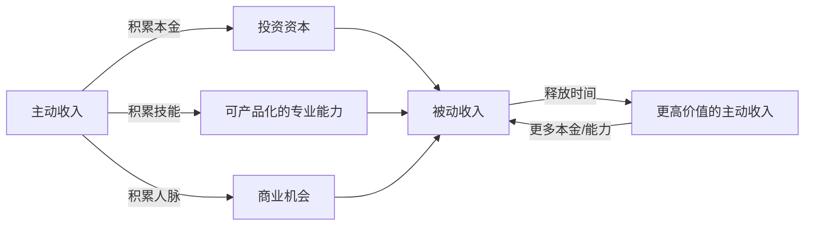
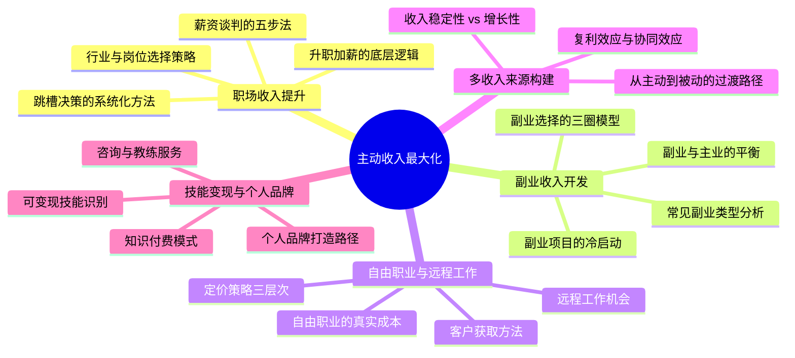
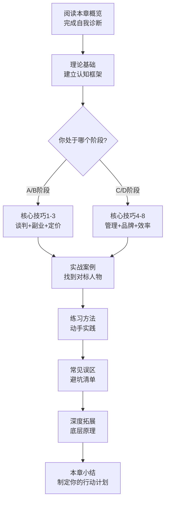

# 第四章：主动收入最大化

> "在你还没有被动收入之前，主动收入就是你的生命线。"

## 为什么主动收入是一切的起点

很多人在接触"财务自由"概念后，第一反应是去寻找"睡后收入"——股票、基金、房租、版税。这个想法没有错，但它忽略了一个前提：**被动收入需要本金，而本金来自主动收入**。

让我们用一组数字来说明这个关系：

| 被动收入目标（月） | 所需本金（年化4%） | 本金积累来源 |
|---|---|---|
| 5,000 元 | 150 万 | 主动收入 |
| 10,000 元 | 300 万 | 主动收入 |
| 30,000 元 | 900 万 | 主动收入 |
| 50,000 元 | 1,500 万 | 主动收入 |

没有一个稳定的、持续增长的主动收入，所谓的被动收入计划只是空中楼阁。

主动收入的另一个被低估的价值在于：**它是你认知世界、积累能力、建立人脉的主要通道**。一个年薪50万的人，他的视野、资源和机会，与一个月薪5000的人是完全不同的量级。主动收入的提升，不只是银行卡数字的变化，更是人生选择权的扩展。

### 主动收入 vs 被动收入：不是对立，而是接力

主动收入和被动收入不是二选一的关系，而是一个螺旋上升的过程。本章聚焦的是这个螺旋的起点——如何把主动收入这块"地基"打牢。

---

## 本章要解决的核心问题

读完本章，你将能够回答以下问题：

1. **我在人才市场上的真实价值是多少？** 如何用数据而非感觉来评估自己？
2. **怎样让老板心甘情愿给我加薪？** 薪资谈判的底层逻辑和具体话术是什么？
3. **副业到底值不值得做？** 如何计算副业的真实收益和机会成本？
4. **自由职业适合我吗？** 自由职业的真实成本和收入公式是什么？
5. **如何从"卖时间"升级为"卖价值"？** 收入增长的四个阶段分别是什么？
6. **多收入来源怎么构建？** 如何降低单一收入的风险，同时产生复利效应？

---

## 自我诊断：你目前处于哪个阶段？

在开始学习之前，先花5分钟完成这个自测，找到你的起点：

| 诊断维度 | A阶段（起步期） | B阶段（成长期） | C阶段（突破期） | D阶段（杠杆期） |
|---|---|---|---|---|
| 月收入 | < 8,000 | 8,000 - 20,000 | 20,000 - 50,000 | > 50,000 |
| 收入来源 | 仅工资 | 工资 + 偶尔兼职 | 工资 + 稳定副业 | 多个稳定收入流 |
| 核心能力 | 执行为主 | 独立完成项目 | 能带团队/交付方案 | 可变现的专业品牌 |
| 议价能力 | 几乎为零 | 有一定谈判空间 | 能主动选择机会 | 机会主动找上门 |
| 与市场的关系 | 被挑选 | 被动等待机会 | 主动寻找机会 | 定义市场规则 |

**找到你的阶段后，按以下路径阅读：**

- **A阶段（起步期）**：重点阅读 4.1 职场收入提升策略 + 4.5 技能变现与个人品牌，先把地基打好
- **B阶段（成长期）**：重点阅读 4.2 副业收入开发 + 核心技巧部分，找到第二增长曲线
- **C阶段（突破期）**：重点阅读 4.3 自由职业与远程工作 + 4.4 多收入来源构建，建立系统
- **D阶段（杠杆期）**：重点阅读理论基础部分 + 深度拓展，从底层逻辑重新审视自己的策略

---

## 本章知识地图

---

## 本章结构与内容导航

本章由四大部分组成：**理论基础**帮你建立认知框架，**核心技巧**给你可执行的方法，**实战案例**用真实故事验证理论，**深度拓展**为高级读者提供更深层的分析。

### 理论基础：建立底层认知

| 小节 | 核心内容 | 解决什么问题 |
|---|---|---|
| 4.1 主动收入的本质 | 主动收入的定义、局限性、进阶路径 | "我为什么要关注主动收入？" |
| 4.2 职场收入提升的底层逻辑 | 收入决定因素、市场价值四维度 | "我的薪资由什么决定？" |
| 4.3 副业的经济学分析 | 机会成本、选择矩阵、协同效应 | "副业到底划不划算？" |
| 4.4 自由职业的经济学 | 真实成本、定价策略、收入公式 | "自由职业能赚多少？" |
| 4.5 多收入来源的构建理论 | 多元化的必要性、分类、复利效应 | "为什么要有多收入来源？" |
| 4.6 从主动收入到被动收入的过渡 | 过渡路径、产品化、关键节点 | "什么时候该转向被动收入？" |
| 4.7 薪资谈判的深层策略 | 博弈论、锚定效应、信息不对称 | "谈判的底层逻辑是什么？" |

### 核心技巧：可执行的方法论

| 技巧 | 核心方法 | 适用阶段 |
|---|---|---|
| 技巧一：薪资谈判的五步法 | 知己知彼→选择时机→准备话术→应对异议→达成协议 | B/C 阶段 |
| 技巧二：副业选择的三圈模型 | 兴趣∩技能∩市场需求 = 最佳副业方向 | A/B 阶段 |
| 技巧三：自由职业定价技巧 | 成本定价→市场定价→价值定价的进阶路径 | C/D 阶段 |
| 技巧四：多收入来源管理 | 收入组合设计、现金流管理、风险控制 | C/D 阶段 |
| 技巧五：个人品牌打造 | 内容输出→影响力积累→商业变现 | B/C/D 阶段 |
| 技巧六：提升效率的时间管理法 | 番茄工作法、时间块、精力管理 | 全阶段 |
| 技巧七：跳槽决策的系统化方法 | 跳槽评估矩阵、薪酬对比模型 | B/C 阶段 |
| 技巧八：副业项目的冷启动方法 | MVP验证、最小可行产品、快速迭代 | A/B 阶段 |

### 实战案例：真实故事验证

本章收录了8个不同背景、不同路径的真实案例，覆盖了从基层员工到自由职业者的完整光谱：

| 案例 | 背景 | 路径 | 关键转折点 |
|---|---|---|---|
| 案例一：程序员小陈 | 月薪8K | 技术深耕→跳槽→管理 | 用项目成果说服老板 |
| 案例二：烘焙创业者李姐 | 全职妈妈 | 兴趣副业→品牌化→团队化 | 从朋友圈卖蛋糕开始 |
| 案例三：设计师小王 | 月薪1.5万 | 自由职业 | 用作品集打开市场 |
| 案例四：知识付费小刘 | 普通文员 | 技能外化→课程→社群 | 第一门课定价99元 |
| 案例五：餐饮创业者阿强 | 外卖骑手 | 积累行业认知→自建品牌 | 从骑手变老板 |
| 案例六：HRBP小赵 | 行政岗 | 跨领域转型→专业深耕 | 主动学习HRBP技能 |
| 案例七：自由翻译小孙 | 月薪5000 | 语言技能→自由翻译 | 建立稳定的客户群 |
| 案例八：短视频剪辑师阿明 | 工厂工人 | 自学技能→接单→团队化 | 花3个月自学剪辑 |

> **阅读建议**：不要只看和自己背景相似的案例。跨行业的案例往往能带来意想不到的启发——烘焙创业者的品牌思路可以用在技术博客上，外卖骑手的行业观察方法可以用在任何领域。

---

## 学习路径建议

### 每个阶段的具体行动清单

**读完理论基础后（第1天）：**
- [ ] 完成自我诊断，确定你的阶段
- [ ] 用公式计算你的"时薪"（月收入 ÷ 实际工作小时数）
- [ ] 列出你当前收入的构成（基本工资、奖金、其他）

**读完核心技巧后（第2-3天）：**
- [ ] 选择最适合你阶段的2-3个技巧
- [ ] 按照技巧中的步骤，制定具体的行动计划
- [ ] 设定一个30天的小目标（比如：完成一次薪资谈判、启动一个副业MVP）

**读完实战案例后（第4天）：**
- [ ] 找到与你最相似的案例，分析他的关键决策
- [ ] 找到与你最不同的案例，提取可借鉴的思路
- [ ] 记录3个你从案例中学到的具体方法

**完成练习和误区后（第5天）：**
- [ ] 完成所有练习
- [ ] 对照误区清单，检查自己是否有类似行为
- [ ] 制定一个90天的主动收入提升计划

---

## 关键概念速查

在开始阅读之前，先理解以下核心概念，它们会贯穿整章：

| 概念 | 一句话定义 | 为什么重要 |
|---|---|---|
| 主动收入 | 用时间、技能和劳动换取的收入 | 它是财富积累的起点和安全网 |
| 市场价值 | 你在人才市场上的"价格" | 提升市场价值是增加主动收入的根本方法 |
| 技能溢价 | 因为稀缺技能而获得的额外收入 | 解释了为什么同样岗位薪资差距可达3-5倍 |
| 机会成本 | 做一件事而放弃的最高价值的替代选择 | 判断副业是否值得的核心工具 |
| 价值定价 | 基于你为客户创造的价值来定价 | 从"卖时间"到"卖价值"的关键转变 |
| 收入复利 | 多个收入来源增长的叠加效应 | 解释了为什么多收入来源比单一高薪更有潜力 |
| 个人品牌 | 你在特定领域的专业形象和声誉 | 它是你最强的议价筹码和获客渠道 |
| 收入产品化 | 将一次性服务转化为可重复销售的产品 | 从主动收入过渡到被动收入的桥梁 |

---

## 本章金句

> "你的收入，与你解决问题的难度成正比。" —— T.哈维·艾克

> "不要用战术上的勤奋，掩盖战略上的懒惰。"

> "最好的投资，是投资自己。" —— 沃伦·巴菲特

> "自由不是想做什么就做什么，而是不想做什么就不做什么。" —— 康德

---

## 预计学习时间

| 学习内容 | 阅读时间 | 练习时间 | 合计 |
|---|---|---|---|
| 理论基础（7节） | 60-90 分钟 | 30 分钟 | 90-120 分钟 |
| 核心技巧（8个） | 45-60 分钟 | 45-60 分钟 | 90-120 分钟 |
| 实战案例（8个） | 40-50 分钟 | 15 分钟 | 55-65 分钟 |
| 常见误区 + 练习方法 | 20-30 分钟 | 30 分钟 | 50-60 分钟 |
| 深度拓展 | 30-45 分钟 | — | 30-45 分钟 |
| **总计** | **3.5-5 小时** | **2-2.5 小时** | **5.5-7.5 小时** |

> **阅读建议**：不需要一次读完。建议分3-5天完成，每天1-2小时。理论和技巧交替阅读，读完一个技巧就尝试应用，效果最佳。完成每节的练习，将知识转化为行动——这才是本章真正的价值所在。
