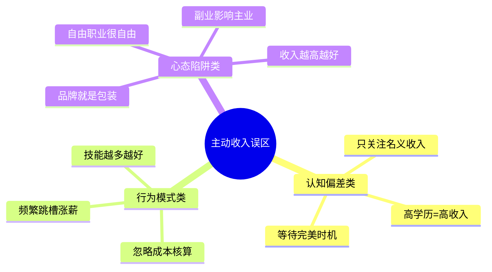
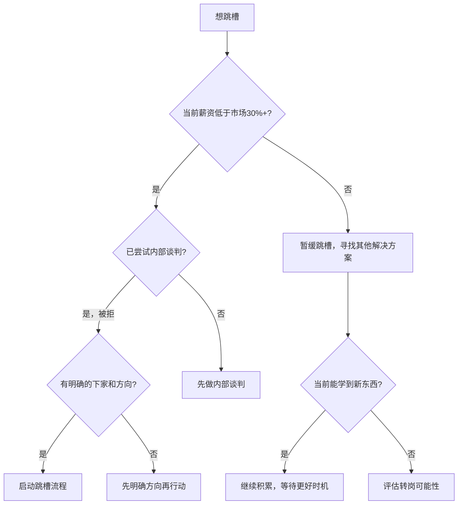
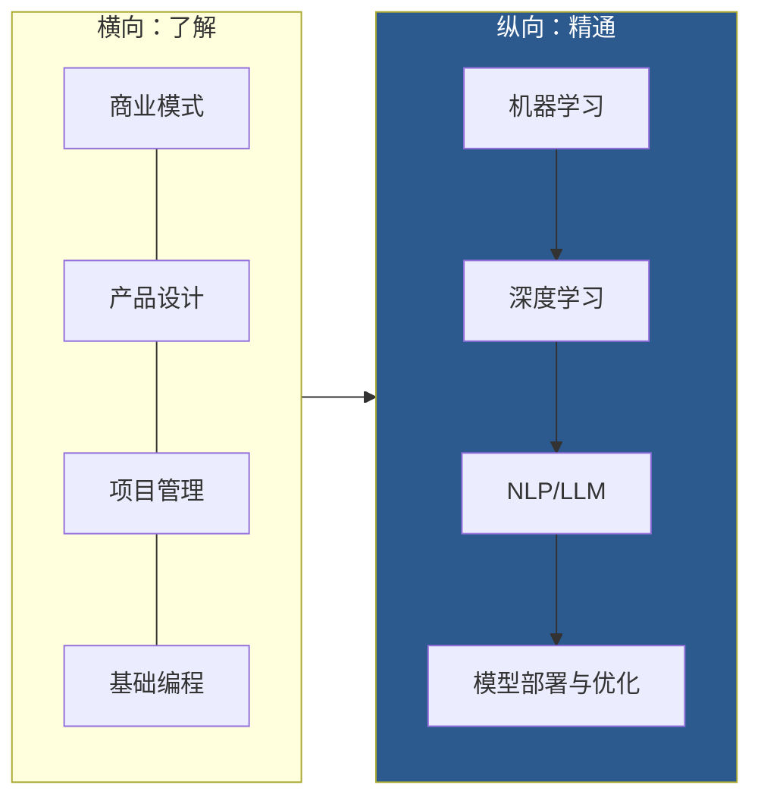

# 第四章：主动收入最大化 —— 常见误区

## 为什么误区比无知更危险

无知可以学习，但误区会让人**用错误的方式努力**。你以为自己走在正确的路上，实际上每一步都在远离目标。更可怕的是，误区往往披着"常识"的外衣——周围人都这么说，你也就不假思索地相信了。

本节梳理主动收入领域最常见的10个误区，逐一拆解它们的成因、危害和纠正方法。每个误区都不是简单的"对错判断"，而是帮你建立一套**理性决策框架**，让你在面对职业和收入选择时，不再被直觉和情绪绑架。



***

## 误区一：频繁跳槽才能涨薪

### 表面逻辑

"在同一家公司加薪幅度有限，跳槽直接涨30%-50%，为什么不跳？"

这个逻辑在某些场景下确实成立，但它忽略了一个关键变量：**时间维度**。

### 深层真相

**跳槽涨薪的本质是什么？**

薪资是市场对你能力和经验的定价。跳槽涨薪有两种截然不同的情况：

| 类型 | 机制 | 可持续性 | 风险 |
|------|------|----------|------|
| 价值回归型 | 原公司严重低估你，新公司按市场价付薪 | 高 | 低 |
| 信息不对称型 | 新公司不了解你的真实能力，高估了你的价值 | 低 | 高 |
| 行业套利型 | 从低薪行业跳到高薪行业 | 中 | 中 |

频繁跳槽者往往靠的是第二类——信息不对称。短期内确实能涨薪，但长期来看，HR不是傻子。

**频繁跳槽的真实代价：**

1. **简历信号恶化**：猎头和HR筛选简历时，平均每份停留6-8秒。如果你5年换了4家公司，第一反应就是"稳定性差"。据LinkedIn 2023年数据，平均每份工作任期不足18个月的候选人，面试通过率比稳定候选人低40%。

2. **能力积累断裂**：一个项目从启动到看到完整成果，通常需要12-18个月。你刚摸清业务就走了，永远只能做执行层的事情，无法积累"带项目、扛结果"的完整经验。

3. **人脉资产归零**：职场中最有价值的不是你在哪家公司，而是谁认识你、信任你。频繁跳槽意味着你还没建立深度信任关系就离开了。那些能在关键时刻推荐你、给你机会的人，通常需要2年以上的共处才能形成。

4. **薪资涨幅递减**：第一次跳槽涨40%，第二次涨25%，第三次可能只有15%——因为市场会逐渐识别出你的真实能力水平。

### 什么时候该跳槽

**不跳槽才是默认选项**，跳槽需要充分理由。以下是可以考虑跳槽的信号：

- 你的薪资低于市场价30%以上，且公司短期内无调薪计划
- 你已经连续2年以上没有学到新东西
- 公司业务萎缩，你的岗位面临被优化的风险
- 你有一个明确的职业发展方向，而当前公司无法提供

**以下不是好的跳槽理由：**

- 和直属领导闹了矛盾（换个部门可能就解决了）
- 仅仅因为涨了10-20%的薪水
- 同事都在跳槽，跟风心理
- 刚入职3个月还不适应

### 正确做法：跳槽决策矩阵

在考虑跳槽时，用以下框架评估：



**跳槽前的三个必答问题：**

1. **这次跳槽能让我的能力上一个台阶吗？** 如果只是做同样的事情拿更多钱，那就是"水平移动"而非"向上移动"。
2. **新公司的业务前景如何？** 跳到一个正在走下坡路的行业，涨薪只是暂时的。
3. **我能接受最坏的情况吗？** 新公司试用期不过、文化不适应、业务方向调整——这些都有概率发生。

***

## 误区二：副业会影响主业

### 表面逻辑

"我每天工作已经很累了，哪有精力做副业？副业万一被公司发现怎么办？"

### 深层真相

这个误区的根源是**把副业和主业对立起来**。实际上，好的副业不仅不影响主业，还能反过来增强主业。关键在于你选择什么样的副业，以及如何管理时间和边界。

**副业对主业的三种影响模式：**

| 模式 | 特征 | 结果 | 示例 |
|------|------|------|------|
| 正协同 | 副业技能与主业互补 | 互相促进 | 程序员做技术博客 |
| 零协同 | 副业与主业无关 | 互不影响 | 上班族周末摆摊 |
| 负协同 | 副业与主业冲突 | 互相消耗 | 销售去做竞品代理 |

只有负协同的副业才会影响主业。而正协同的副业，反而可能成为你在职场中的差异化优势。

**真实案例**：某互联网公司的产品经理，业余时间运营一个产品经理社群（3000+成员）。这个副业不仅带来了每月5000-8000元的额外收入，更重要的是：
- 社群的交流让他接触到了不同公司的产品方法论，反哺了主业
- 社群影响力让他在行业内的知名度大增，猎头主动联系
- 跳槽时，社群运营经历成了他简历上的亮点

### 如何选择与主业协同的副业

**协同副业的选择公式：**

```text
副业价值 = 直接收入 + 技能溢出 + 人脉积累 + 个人品牌

好的副业至少在3个维度上有正收益
```

| 主业 | 高协同副业 | 中协同副业 | 低协同副业 |
|------|-----------|-----------|-----------|
| 程序员 | 技术咨询、开源项目、技术培训 | 技术写作、技术社群 | 网约车、外卖 |
| 设计师 | 设计接单、设计课程、UI Kit售卖 | 设计比赛、设计博客 | 代购、直播 |
| 销售 | 销售培训、行业顾问、客户资源对接 | 销售方法论写作 | 餐饮、零售 |
| 教师 | 一对一家教、在线课程、教材编写 | 教育自媒体 | 电商、微商 |

### 时间管理的硬性边界

副业不影响主业的前提是**严格的时间隔离**：

1. **绝对不在工作时间处理副业事务**——包括回副业消息、接副业电话
2. **不使用公司资源做副业**——包括公司电脑、公司邮箱、公司人脉
3. **设定每周副业时间上限**——建议不超过15小时，否则主业质量必然下降
4. **主业关键期暂停副业**——项目冲刺、绩效考核期间，副业让路

### 法律风险提示

- 仔细阅读劳动合同中的**竞业限制条款**和**兼职限制条款**
- 如果副业与公司业务有利益冲突，可能构成违约甚至违法
- 副业收入超过一定金额需要**依法纳税**

***

## 误区三：自由职业很自由

### 表面逻辑

"不用上班打卡，想几点起床就几点起床，在咖啡厅工作多潇洒。"

### 深层真相

自由职业的"自由"是有代价的。这个代价被社交媒体上那些"数字游民"的美好画面掩盖了。

**自由职业的四大隐性成本：**

| 成本类型 | 具体内容 | 量化估算（月） |
|----------|---------|--------------|
| 社保成本 | 自己缴纳五险一金（公司+个人部分） | 2000-5000元 |
| 空窗期成本 | 项目间隙无收入（平均15-25%的时间） | 收入损失15-25% |
| 获客成本 | 营销推广、商务应酬、平台抽成 | 收入的10-30% |
| 心理成本 | 焦虑、孤独、缺乏归属感 | 难以量化但真实存在 |

**自由职业收入的真实计算公式：**

```text
自由职业实际年收入 = 项目总收入 × 0.75（扣除空窗期）
                   - 社保成本（3-6万/年）
                   - 获客成本（项目总收入 × 15%）
                   - 办公成本（设备、软件、场地，1-3万/年）

例如：
项目总收入：50万/年
实际到手：50×0.75 - 5 - 50×0.15 - 2 = 37.5 - 5 - 7.5 - 2 = 23万
折合月薪：约1.9万
```

50万的项目收入，实际到手可能只有23万。这就是自由职业的真相——你需要用**更高的账面收入**来维持和全职工作同等的生活水平。

**自由职业的心理挑战：**

自由职业者最常见的心理问题不是"赚不到钱"，而是**不确定性带来的焦虑**。即使你这个月赚了5万，下个月可能一个项目都没有。这种持续的不确定性，会消耗大量心理能量。

一个真实的调研数据：自由职业平台Upwork的报告显示，自由职业者平均需要**6-12个月**才能建立稳定的客户流，而在这段时间里，收入波动率高达50-80%。

### 正确做法：自由职业的准入条件

在辞掉全职工作之前，确保你满足以下条件：

1. **有稳定的初始客户**：至少有2-3个愿意持续合作的客户，而非一锤子买卖
2. **有6个月以上的应急基金**：覆盖所有生活开支，不是"能撑6个月"而是"舒适地撑6个月"
3. **有明确的商业模式**：知道自己的服务卖给谁、卖什么、怎么定价
4. **有极强的自律能力**：能在一个没有外力约束的环境下保持高效
5. **有副业验证**：已经在业余时间做自由职业至少6个月，且收入稳定

**最佳过渡策略**：先兼职做，等副业收入连续3个月达到主业收入的70%以上，再考虑全职转型。

***

## 误区四：个人品牌就是"包装"

### 表面逻辑

"我只要把简历写漂亮点、多发点朋友圈、找人推荐一下就行了。"

### 深层真相

**个人品牌不是"包装"，而是"信号"。**

在信息不对称的市场中，买方（雇主、客户）无法直接观察你的能力。个人品牌就是你持续发出的**能力信号**。信号必须有实质内容支撑，否则就是噪音。

**真实品牌 vs 虚假品牌的对比：**

| 维度 | 真实品牌 | 虚假品牌 |
|------|---------|---------|
| 基础 | 真实能力和成果 | 夸大和吹嘘 |
| 形成方式 | 持续输出有价值的内容 | 短期集中营销包装 |
| 检验方式 | 经得起同行审视和实践检验 | 一旦深入合作就露馅 |
| 持久性 | 随时间增强 | 随时间衰减 |
| 转化率 | 高——找到你的人多数会合作 | 低——好看但不实用 |

**一个关键认知**：个人品牌的核心不是"让别人知道你"，而是"让别人在需要某种能力时第一时间想到你"。

### 个人品牌的真实构建路径

**第一阶段：能力积累（0-6个月）**

不要急着输出，先确保你有真东西可以说。这个阶段的核心任务：
- 在你的领域做到前30%的水平
- 积累3-5个拿得出手的项目案例
- 建立自己的方法论框架

**第二阶段：内容输出（6-18个月）**

开始系统性地输出内容，建立认知：
- **文章**：每周1篇，坚持6个月以上（质量>数量）
- **回答问题**：在知乎、SegmentFault等平台回答专业问题
- **开源/分享**：把自己的工具、模板、方法论免费分享

**第三阶段：口碑积累（18个月+）**

让别人替你说话：
- 客户案例和推荐信
- 行业活动中的分享和交流
- 同行之间的相互推荐

**关键指标**：你的内容被同行引用、转发，或者有陌生人主动找你咨询，说明品牌开始生效。

### 常见的品牌建设错误

1. **只发鸡汤不发干货**——"坚持就是胜利"这种话谁都会说，没有信息量
2. **过度包装头衔**——"XX领域第一人""XX专家"，如果名不副实，反而损害信任
3. **只展示不交付**——发了100篇文章但从不接项目，别人会认为你是"理论派"
4. **急于求成**——3个月没效果就放弃，品牌建设是以年为单位的

***

## 误区五：收入越高越好

### 表面逻辑

"年薪50万当然比30万好，有什么好讨论的？"

### 深层真相

**收入只是手段，不是目的。** 追求收入最大化本身没有错，但如果你不考虑以下因素，高收入可能是以更大的代价换来的。

**收入的真实评估公式：**

```text
收入满意度 = (实际可支配收入 × 支配时间) / (压力指数 × 健康损耗)

说明：
- 实际可支配收入：扣除社保、个税、通勤、应酬等成本后的到手收入
- 支配时间：每天可自由支配的小时数（工作日扣除通勤、加班后的剩余时间）
- 压力指数：1-10分，来自工作压力
- 健康损耗：1-10分，来自久坐、熬夜、缺乏运动等
```

**案例对比：**

| 指标 | 小李（互联网大厂） | 小张（外企中层） |
|------|-------------------|-----------------|
| 年薪 | 80万 | 45万 |
| 每日工作时长 | 12小时 | 8小时 |
| 通勤时长 | 2小时 | 1小时 |
| 自由支配时间 | 2小时/天 | 7小时/天 |
| 偶尔加班 | 经常 | 很少 |
| 年假 | 名义15天，实际用5天 | 15天全部能休 |
| 压力指数 | 8/10 | 4/10 |
| 健康损耗 | 7/10 | 3/10 |

```text
小李：收入满意度 = (80万×2) / (8×7) = 160万 / 56 ≈ 2.86万
小张：收入满意度 = (45万×7) / (4×3) = 315万 / 12 ≈ 26.25万
```

从这个角度看，小张的收入满意度是小李的9倍。当然，这个公式是简化的，但它揭示了一个重要道理：**收入数字不等于生活质量**。

### 追求"足够好"而非"最高"

**什么是"足够好"的收入？**

1. 覆盖所有生活开支，且有30%以上的储蓄率
2. 能支撑你和家人应对突发情况（医疗、失业）
3. 有余力投资自己（学习、健康、社交）
4. 在这个收入水平上，你不需要牺牲健康和家庭

每个人的具体数字不同，但框架是明确的：先达到"足够好"的底线，然后在底线之上追求**收入与其他生活要素的最优平衡**。

### 机会成本思维

每个选择都有机会成本。选择高薪但高压的工作，你放弃的是：
- 陪家人的时间
- 发展副业和被动收入的精力
- 健康的身体（长期压力会增加心血管疾病风险30-50%）
- 学习新技能的余裕

**一个反直觉的结论**：很多人在高薪岗位上"赚了钱但存不下钱"——因为高压工作导致冲动消费（"工作这么辛苦，犒劳一下自己"），反而不如收入稍低但心态平和的人积累得快。

***

## 误区六：技能越多越好

### 表面逻辑

"技多不压身，多学点总没坏处。"

### 深层真相

技能的价值不在于数量，而在于**深度**和**稀缺性**。经济学里有一个基本原理：价格由供给和需求共同决定。一个谁都会的技能，供给量巨大，价格自然低。

**技能的市场定价逻辑：**

```text
技能溢价 = 技能稀缺性 × 技能需求量 × 你的技能深度

其中：
- 稀缺性：市场中掌握该技能的人数（越少越高）
- 需求量：市场对该技能的需求程度（越大越高）
- 技能深度：你在该技能上的水平（越深越高）
```

**技能类型与收入关系：**

| 技能类型 | 供给量 | 需求量 | 稀缺性 | 典型收入 | 举例 |
|----------|--------|--------|--------|----------|------|
| 通用技能 | 极高 | 高 | 极低 | 低 | Office、打字、基础英语 |
| 专业技能 | 中 | 高 | 中 | 中 | 特定编程语言、会计 |
| 稀缺技能 | 低 | 高 | 高 | 高 | AI/ML、安全攻防、芯片设计 |
| 复合技能 | 极低 | 高 | 极高 | 极高 | 技术+商业、设计+数据 |

**"二八定律"在技能中的体现：**

你80%的收入来自你20%的核心技能。如果你有10个技能但每个都是60分，你的市场价值远低于只有2个技能但每个95分的人。

这不是假设——LinkedIn的数据显示，简历上列出超过15项技能的候选人，被HR认为"定位不清"的概率比只列5-8项技能的候选人高2.3倍。

### T型人才策略

最优的技能结构是"T型"：



**具体做法：**

1. **选准一个方向深入**：这个方向要满足三个条件——你有兴趣、市场有需求、你能做到前10%
2. **横向了解相关领域**：不需要精通，但要能和相关领域的人对话
3. **构建"技能组合"而非"技能清单"**：技能之间要有化学反应，而不是简单的堆砌

**如何判断技能投资方向：**

| 评估维度 | 问题 | 权重 |
|----------|------|------|
| 市场需求 | 这个技能3年后还有需求吗？ | 30% |
| 稀缺性 | 掌握这个技能的人多吗？ | 25% |
| 个人匹配 | 我的背景和兴趣适合学这个吗？ | 20% |
| 变现路径 | 学完之后怎么赚钱？ | 15% |
| 学习成本 | 我需要投入多少时间才能达到可用水平？ | 10% |

***

## 误区七：等待"完美时机"

### 表面逻辑

"现在竞争太激烈了，等市场好一点再说。""等我存够100万再创业。""等我想清楚了再行动。"

### 深层真相

**完美时机是大脑编造的借口。**

心理学上，这种行为叫做"分析瘫痪"（Analysis Paralysis）。大脑倾向于高估行动的风险，低估不行动的风险。等待"完美时机"本质上是在**用思考代替行动**，而思考会给你一种"在做事"的错觉。

**等待的真实成本：**

```text
等待成本 = 放弃的收益 + 竞争加剧 + 能力折旧

假设你晚1年行动：
- 放弃的收益：1年的副业收入、经验积累、人脉积累
- 竞争加剧：又多了N个竞争者
- 能力折旧：你的技能在原地踏步，而市场在进步
```

**历史数据的启示：**

- Airbnb成立于2008年金融危机期间——当时所有人都说"旅游行业完了"
- Uber成立于2009年——"谁会在经济衰退时打车？"
- 微信2011年推出——"即时通讯已经被QQ垄断了"
- 拼多多2015年成立——"电商已经是红海了"

这些案例的共同点：创始人**没有等待完美时机**，而是在"看起来不好"的时机中找到了机会。

### 为什么"不好"的时机反而是好时机

1. **竞争减少**：大多数人在等待，你的竞争对手变少了
2. **资源便宜**：经济低谷期，人才、场地、流量成本都更低
3. **市场空白**：大公司收缩时，小玩家有了进入的机会
4. **逆向信号**：在困难时期坚持的人，往往在复苏期获得最大回报

### 正确做法：最小可行行动

不要一步到位，用"最小可行行动"（Minimum Viable Action）来打破等待：

| 你想做的事 | 完美计划 | 最小可行行动 |
|-----------|---------|------------|
| 辞职创业 | 准备100万，辞职，全职做 | 先用业余时间做一个MVP |
| 做自媒体 | 买全套设备，想好定位，再开始 | 用手机拍第一条视频 |
| 学新技能 | 报一个3万的培训班 | 先看免费教程，做一个小项目 |
| 转行 | 等拿到新领域的学位 | 先在新领域接一个小单 |

**关键心态转变**：

- ❌ "我要准备好再开始"
- ✅ "我要在开始中准备好"

准备永远不充分，因为你不知道自己需要准备什么——直到你真正开始做。

***

## 误区八：只关注收入，不关注成本

### 表面逻辑

"我月薪3万了！"

但你有没有算过，为了这3万的月薪，你付出了多少？

### 深层真相

**名义收入和实际收入之间，存在巨大的鸿沟。**

**主动收入的四层成本：**

| 成本层次 | 包含项目 | 常被忽略程度 |
|----------|---------|-------------|
| 第一层：税费 | 个人所得税、社保个人部分、公积金个人部分 | 低 |
| 第二层：通勤 | 交通费、通勤时间的机会成本 | 中 |
| 第三层：职场消费 | 职业装、应酬、午餐、咖啡、人情往来 | 高 |
| 第四层：机会成本 | 你的时间本可以用来做别的事情 | 极高 |

**实际收入计算示例：**

```text
名义收入：30,000元/月

第一层扣除：
- 社保个人部分：2,400
- 公积金个人部分：3,600
- 个人所得税：2,990
小计：-8,990

第二层扣除：
- 地铁/公交/打车：800
- 通勤时间：每天2小时×22天 = 44小时
  （按时薪170元计算，机会成本：7,480）
小计：-8,280

第三层扣除：
- 午餐：1,500
- 职业装/形象：300
- 应酬/人情：500
- 工作日咖啡/零食：400
小计：-2,700

实际月收入：30,000 - 8,990 - 800 - 2,700 = 17,510元
实际时薪：17,510 ÷ (8小时×22天 + 44小时通勤) = 72元/小时
```

30,000的月薪，实际可支配收入只有17,510元，实际时薪72元。和你想象中的差距大吗？

### 正确做法：建立"实际收入"思维

1. **计算你的真实时薪**：用实际可支配收入除以总工作时间（含通勤、加班），这个数字才是你时间的真实价格
2. **用真实时薪评估所有机会**：如果一个副业的时薪低于你的真实时薪，它在经济上不划算
3. **优化成本结构**：远程办公可以省下通勤成本和时间，灵活工作制可以减少职场消费
4. **将"隐性成本"纳入决策**：两个offer，A公司月薪3万但通勤2小时，B公司月薪2.5万但步行10分钟——算上隐性成本，B可能更优

***

## 误区九：高学历必然等于高收入

### 表面逻辑

"读个名校MBA，年薪就能翻倍。""博士学位肯定比硕士学位赚得多。"

### 深层真相

学历是**入场券**，不是**定价器**。在职业发展初期，学历确实有显著的筛选效应——名校毕业生的起薪平均比普通院校高30-50%。但随着工作年限增加，学历的影响力迅速衰减，被**能力、经验和成果**取代。

**学历溢价的衰减曲线：**

| 工作年限 | 学历对薪资的影响 | 能力/经验对薪资的影响 |
|----------|----------------|-------------------|
| 0-2年 | 60% | 40% |
| 3-5年 | 30% | 70% |
| 5-10年 | 15% | 85% |
| 10年+ | 5% | 95% |

**数据支撑**：根据猎聘2023年薪酬报告，工作10年后，985/211毕业生与普通院校毕业生的薪资差距从入职时的45%缩小到12%。而那些在10年内实现薪资5倍以上增长的人中，只有30%来自985/211，剩下70%来自普通院校——因为他们把别人读书的时间用在了实战上。

**读研/读博的机会成本：**

```text
假设：
- 本科毕业起薪：8,000/月
- 研究生毕业起薪：12,000/月（高50%）
- 研究生期间：2-3年无收入（或低收入）

机会成本计算：
- 放弃的工作收入：8,000 × 36个月 = 288,000
- 读研费用：学费+生活费约 50,000
- 总成本：338,000

读研带来的额外收入：
- 每月多赚：4,000
- 回本时间：338,000 ÷ 4,000 = 84.5个月（约7年）
```

这意味着你要工作7年才能回本。如果读研期间你在工作中学到了同等价值的技能，7年后可能早就超过了研究生的起点。

### 什么时候学历确实重要

- **特定行业门槛**：医生、律师、科研人员，学历是硬性要求
- **体制内晋升**：很多体制内岗位的晋升需要学历背书
- **转行跳板**：从一个完全不相关的行业转行时，学历可以作为入场券
- **深度专业知识**：某些前沿领域确实需要系统的学术训练

### 正确做法

- **不要为了学历而读学历**——先想清楚读完之后怎么变现
- **在职提升优于全职读书**——除非你需要的是硬性门槛
- **实战经验 + 短期证书 > 学历**——在大多数商业领域，一个有说服力的项目案例比一个学位更有分量
- **持续学习 ≠ 持续考证**——学习的目标是提升能力，不是收集证书

***

## 误区十：被动收入不需要前期投入

### 表面逻辑

"被动收入就是躺赚——建好管道，钱就自己来了。"

### 深层真相

**被动收入的"被动"是结果，不是过程。**

所有被动收入的源头都是**大量的前期投入**——时间、精力、金钱，或者三者的组合。那些告诉你"轻松躺赚"的人，要么在卖课，要么在卖焦虑。

**各种被动收入的真实投入：**

| 被动收入类型 | 前期投入 | 达到稳定所需时间 | 前期月均投入 |
|-------------|---------|---------------|------------|
| 写书/出版 | 6-12个月全职写作 | 1-2年 | 200-400小时 |
| 在线课程 | 3-6个月课程开发 | 6-12个月 | 100-200小时 |
| 投资理财 | 大量学习+初始资本 | 3-5年 | 50-100小时+资金 |
| 自媒体 | 12-18个月持续更新 | 1-2年 | 60-100小时/月 |
| 软件/SaaS | 3-12个月产品开发 | 6-18个月 | 200-500小时 |
| 房产出租 | 大量初始资金 | 立即但回报率低 | 资金沉淀 |

**"被动"收入的维护成本：**

即使管道建好了，也不是完全不用管：

- **在线课程**：需要定期更新内容、回复学员问题、处理退款
- **自媒体**：不持续更新就会掉粉、掉流量
- **软件产品**：需要维护bug、更新功能、处理客服
- **投资理财**：需要定期检视和调整

真正的"被动"更准确的描述是"**半被动**"——前期需要大量投入，之后需要少量持续维护。

### 正确做法

1. **把被动收入看作一个项目**——设定目标、预算、时间线，而不是"做着试试"
2. **用主业养副业**——在主业收入稳定的情况下，用业余时间构建被动收入管道
3. **设定合理预期**——大多数被动收入管道需要12-24个月才能产生有意义的收入
4. **不要ALL IN**——在被动收入稳定之前，不要放弃主动收入

**被动收入的真实时间线：**


***

## 如何系统性地避免这些误区

### 误区背后的认知偏差

每个误区都有其心理学根源。了解这些偏差，才能从根本上避免它们：

| 误区 | 背后偏差 | 偏差描述 |
|------|---------|---------|
| 频繁跳槽 | 损失厌恶 | 对当前不满被放大，对新机会风险视而不见 |
| 副业影响主业 | 现状偏见 | 倾向于维持现状，不愿承担改变的成本 |
| 自由职业很自由 | 光环效应 | 只看到美好的一面，忽略隐藏的代价 |
| 品牌就是包装 | 确认偏误 | 用投机取巧的方式验证"包装有用"的假设 |
| 收入越高越好 | 锚定效应 | 被"高薪"数字锚定，忽略其他维度 |
| 技能越多越好 | 收集偏好 | 满足于"拥有"而非"精通" |
| 等待完美时机 | 分析瘫痪 | 用过度思考代替行动 |
| 只关注名义收入 | 框架效应 | 只看到表面数字，忽略隐性成本 |
| 高学历=高收入 | 权威偏见 | 盲信学历/证书的定价能力 |
| 被动收入躺赚 | 幸存者偏差 | 只看到成功案例，看不到大量失败者 |

### 自检清单

每月用以下清单审视自己的收入决策：

- [ ] 我最近一次涨薪是因为能力提升还是因为跳槽？如果是跳槽，这次跳槽能让我学到新东西吗？
- [ ] 我的副业和主业是正协同还是负协同？我有没有严格的时间隔离？
- [ ] 如果我要做自由职业，我的应急基金够6个月吗？我有稳定的客户来源吗？
- [ ] 我的个人品牌有没有真实的能力和成果支撑？还是只有包装？
- [ ] 我追求的收入水平，是在以健康和家庭为代价吗？
- [ ] 我的核心技能是什么？我有没有做到前10%？
- [ ] 我是否在等待一个"完美时机"来开始某个事情？如果是，我能做的最小可行行动是什么？
- [ ] 我有没有计算过自己的真实时薪？我了解自己的隐性成本吗？
- [ ] 我是否过度依赖学历/证书来提升收入？
- [ ] 我对被动收入的预期是否现实？我是否了解其真实的时间和精力投入？

### 决策原则

面对任何收入相关的决策，用以下原则过滤：

1. **长期主义**：这个选择3年后回头看，还是正确的吗？
2. **可逆性**：如果这个选择是错的，我还能回到原来的状态吗？
3. **信息充分**：我是在掌握足够信息后做的决定，还是在焦虑驱动下做的？
4. **反脆弱性**：这个选择是让我的收入结构更脆弱，还是更抗风险？

> **核心提醒**：意识到误区只是第一步。真正的改变来自于在每次决策时有意识地运用这些原则，直到它们成为你的思维本能。定期回顾这个清单，确保自己走在理性的道路上。
