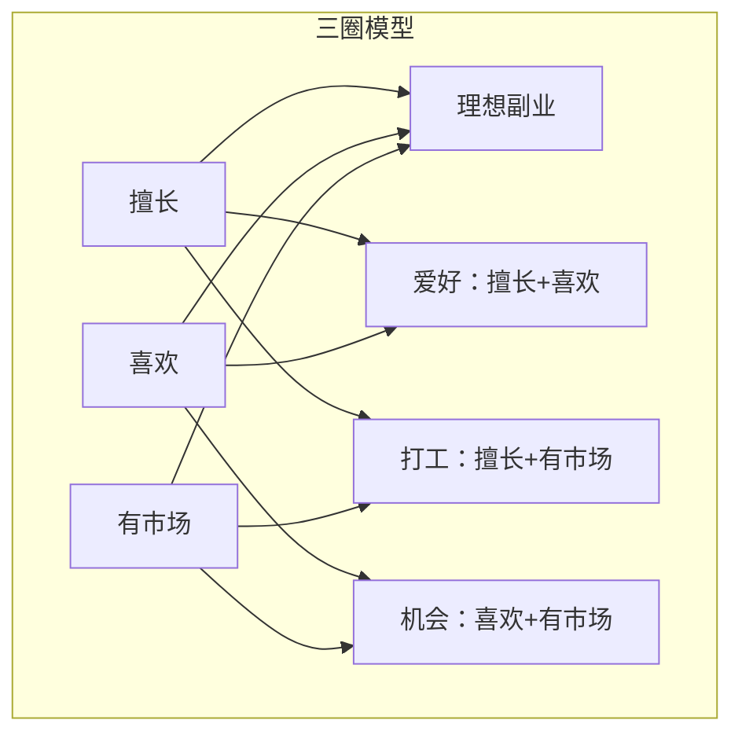
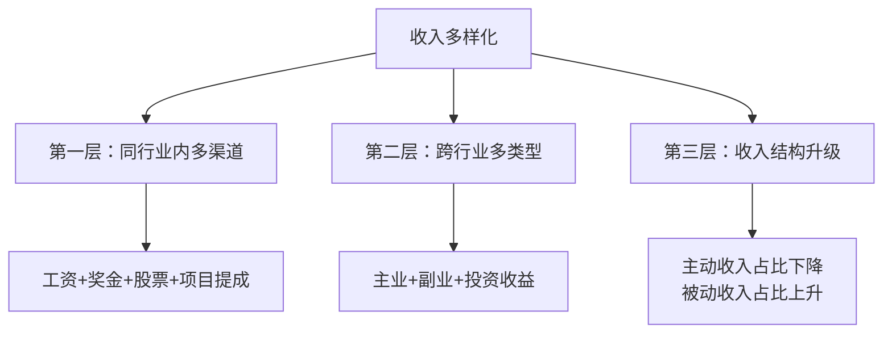

# 第四章：主动收入最大化 —— 练习方法

> 本章六个练习覆盖主动收入的核心能力：认知自身价值、发现机会、谈判博弈、分散风险、管理时间、建立影响力。每个练习包含理论框架、操作步骤、真实案例和常见误区，按顺序完成效果最佳，也可根据自身短板选择性练习。

---

## 练习一：市场价值评估

### 为什么要做这个练习

大多数人对自己的市场价值存在两种系统性偏差：**邓宁-克鲁格效应**（能力低者高估自己）和**冒充者综合征**（能力强者低估自己）。2023年猎聘调研显示，63%的职场人对自身薪资定位偏差超过20%。没有客观数据支撑的薪资谈判，要么错失机会，要么底气不足。

市场价值评估的目的不是给自己"定价"，而是建立一个**可量化的参照系**，让你在谈判桌上有据可依，在职业规划中有方向可循。

### 第一步：收集市场数据

单看一个渠道的数据容易失真，需要交叉验证。

| 渠道 | 操作方法 | 数据特点 | 可信度 |
|------|----------|----------|--------|
| BOSS直聘 | 搜索同岗位，记录薪资区间中位数 | 实时招聘数据，偏招聘方视角 | ★★★★ |
| 猎聘 | 查看薪资报告，筛选城市+年限+行业 | 样本量大，有趋势分析 | ★★★★ |
| 脉脉"职言" | 搜索公司名+岗位，看匿名爆料 | 真实但可能夸大 | ★★★ |
| 看准网 | 查看公司薪资详情和面试经验 | 有公司维度数据 | ★★★ |
| 行业社群 | 微信群/QQ群中询问同行 | 最真实但样本小 | ★★★★ |
| 猎头 | 直接联系2-3个猎头，了解行情 | 最专业，但有利益倾向 | ★★★★★ |
| 招聘网站薪酬报告 | 搜索"2024互联网薪酬报告"等 | 宏观趋势，非个体数据 | ★★★ |

**数据收集模板：**

```text
岗位：_______________
城市：_______________
行业：_______________

数据采集（至少采集10条）：
| 序号 | 来源 | 公司规模 | 薪资范围 | 备注 |
|------|------|----------|----------|------|
| 1    |      |          |          |      |
| 2    |      |          |          |      |
| ...  |      |          |          |      |

统计结果：
- 25分位值（偏低）：____元/月
- 中位值（市场中等）：____元/月
- 75分位值（偏高）：____元/月
- 90分位值（顶部）：____元/月
```

**关键技巧：** 薪资数据要按**城市×行业×年限×公司规模**四个维度筛选。一个3年经验的Java开发，在北京互联网大厂和在成都传统企业，薪资可能差2-3倍。泛泛地搜索"Java开发薪资"没有意义。

### 第二步：评估你的竞争力

竞争力不是"我觉得我行"，而是**可被第三方验证的事实**。下面的评估维度每一项都需要具体证据支撑：

| 维度 | 评分(1-10) | 评估标准 | 你的证据 |
|------|------------|----------|----------|
| 专业技能深度 | | 能独立解决该岗位90%的问题 = 7分；能创新方法论 = 9分 | |
| 专业技能广度 | | 掌握上下游相关技能的数量 | |
| 工作年限质量 | | 不是看年头，而是看成长曲线和项目复杂度 | |
| 项目成果量化 | | 有数据支撑的成果：提升XX%、节省XX万、服务XX用户 | |
| 教育背景 | | 学历、证书、培训，但权重通常不超过15% | |
| 行业人脉 | | 能直接联系到的行业关键人物数量 | |
| 个人品牌 | | 技术博客阅读量、开源项目star数、演讲邀请等 | |
| 稀缺性 | | 你的技能组合在市场上有多稀缺 | |

**评分示例：**

```text
张工，5年Java开发，某电商平台：
- 专业技能深度：8分（独立设计过日千万级交易系统）
- 专业技能广度：7分（懂架构、DevOps、数据分析）
- 工作年限质量：7分（从CRUD到架构，成长曲线陡）
- 项目成果量化：8分（主导的支付系统支撑了双11峰值）
- 教育背景：6分（211本科，无硕士）
- 行业人脉：5分（认识几个大厂架构师）
- 个人品牌：4分（有一个GitHub项目800+ star）
- 稀缺性：7分（高并发+支付领域的组合不常见）

综合评分：(8+7+7+8+6+5+4+7) / 8 = 6.5
```

### 第三步：计算市场价值并制定提升计划

```text
市场价值 = 岗位基准中位薪资 × 竞争力系数

竞争力系数参考：
- 综合评分 8-10：1.3-1.5（你是行业头部，薪资应高于市场30-50%）
- 综合评分 6-8：1.0-1.3（你略高于市场平均）
- 综合评分 4-6：0.8-1.0（接近市场平均）
- 综合评分 1-4：0.6-0.8（低于市场，需要快速提升）
```

**真实案例：**

```text
李明，前端开发，杭州，3年经验：
- 市场中位薪资（3年前端，杭州）：18,000元/月
- 综合竞争力评分：7.2 → 系数约1.15
- 估算市场价值：18,000 × 1.15 = 20,700元/月
- 当前薪资：16,000元/月
- 差距：29%偏低 → 有充分理由要求涨薪或跳槽

李明的差距分析：
- 最短板：个人品牌(3分)、行业人脉(4分)
- 行动计划：写技术博客(3个月积累)、参加线下meetup(每月1次)
- 预期效果：6个月后综合评分提升到7.8，系数1.2，目标薪资21,600
```

### 常见误区

| 误区 | 为什么错 | 正确做法 |
|------|----------|----------|
| 只看招聘网站的最高薪资 | 招聘JD的薪资上限往往取不到 | 取中位数，重点看"大部分人拿多少" |
| 把工作年限等同于经验 | 1年经验重复5次 ≠ 5年经验 | 看项目复杂度和成长轨迹 |
| 忽略城市差异 | 同样的岗位，一线和三线差2-3倍 | 必须按城市筛选 |
| 自我评分时参考朋友意见 | 朋友通常会客气地说高分 | 用客观证据（项目成果、数据）评分 |
| 评估完就束之高阁 | 市场在变，你的价值也在变 | 每6个月重新评估一次 |

---

## 练习二：副业方向探索

### 为什么要做这个练习

盲目开始副业是最大的浪费。2022年的一项调研显示，尝试过副业的人中，72%在6个月内放弃，主要原因是**方向选错**（38%）、**时间不够**（29%）和**看不到收入**（23%）。方向选错的根本原因是没有系统评估，凭直觉或跟风。

这个练习帮助你用结构化的方法找到**既擅长、又喜欢、还有市场**的副业方向，而不是拍脑袋决定。

### 第一步：深度能力盘点

能力盘点不是写简历，而是挖掘你**自己可能都没意识到的优势**。

```text
能力盘点清单（每个问题至少写3个答案）：

【专业技能类】
1. 我的工作中，哪些任务我完成得比同事快/好？
   ________________
2. 我掌握哪些别人需要付费学习的技能？
   ________________
3. 别人向我请教最多的问题是什么？
   ________________

【隐性能力类】
4. 我能把复杂的事情讲得让外行听懂吗？（教学能力）
   ________________
5. 我经常能发现别人忽视的问题吗？（分析能力）
   ________________
6. 我能把零散的信息整合成系统性的方案吗？（整合能力）
   ________________

【兴趣与热情类】
7. 周末没有任何安排时，我会主动做什么？
   ________________
8. 我可以不计报酬连续做5小时的事情是什么？
   ________________
9. 我经常主动搜索/学习的领域是什么？
   ________________

【资源与人脉类】
10. 我认识的最有价值的3个人分别在什么领域？
    ________________
11. 我所在的行业有哪些"信息差"或"资源差"？
    ________________
12. 我的社交圈中，谁最可能成为我的第一个客户？
    ________________
```

**辅助工具：** 如果不确定自己的优势，可以用盖洛普优势测评（CliftonStrengths）或VIA性格优势测评，获得更客观的能力画像。

### 第二步：三圈模型深度分析

三圈模型（擅长×喜欢×有市场）是经典的副业方向筛选框架，但大多数人只画了三个圈就完事了。关键在于**对每个候选方向进行压力测试**。



**三圈匹配示例：**

| 候选方向 | 擅长(1-10) | 喜欢(1-10) | 有市场(1-10) | 总分 | 验证方法 |
|----------|------------|------------|--------------|------|----------|
| Python自动化脚本代写 | 9 | 7 | 8 | 24 | 在闲鱼/淘宝搜同类服务的销量和定价 |
| 技术博客写作 | 7 | 8 | 6 | 21 | 查看同类博客的流量变现方式 |
| 编程教学短视频 | 6 | 5 | 9 | 20 | 在B站搜编程教学的播放量和粉丝数 |
| 技术面试辅导 | 8 | 6 | 8 | 22 | 在小红书搜面试辅导的定价和需求 |

### 第三步：市场验证（最关键的一步）

**不要一上来就做产品，先验证需求是否存在。**

验证方法清单：

| 验证层级 | 方法 | 时间投入 | 验证标准 |
|----------|------|----------|----------|
| Level 1：需求存在 | 在知乎/小红书搜索相关问题的浏览量和互动量 | 1小时 | 相关话题总浏览量 > 10万 |
| Level 2：有人愿意付费 | 在淘宝/闲鱼搜索同类服务，看销量 | 1小时 | 有卖家月销 > 100单 |
| Level 3：你能切入 | 找3个目标客户聊需求，问他们现在怎么解决的 | 3小时 | 至少2人表示有兴趣 |
| Level 4：最小可行产品 | 用最简方式交付1单，哪怕免费 | 1周 | 对方愿意推荐或复购 |

**真实案例：**

```text
王芳，3年产品经理，想做副业：
1. 盘点能力：需求分析、竞品分析、原型设计
2. 三圈匹配：竞品分析报告代写（擅长9，喜欢6，市场8=23分）
3. 验证过程：
   - Level 1：知乎"竞品分析"话题浏览量280万，需求存在 ✓
   - Level 2：淘宝"竞品分析报告"有多家店铺，最高月销500+ ✓
   - Level 3：找了5个创业者聊，3个表示需要，预算200-500元/份 ✓
   - Level 4：给1个创业者免费做了一份，对方主动发朋友圈推荐 ✓
4. 结果：第一月接了8单，收入2400元；第三月稳定在15单，收入6000元
```

### 第四步：90天行动计划（细化到周）

```text
副业90天计划：

第1个月（验证期）：
├── 第1周：完成能力盘点和三圈匹配，确定2-3个候选方向
├── 第2周：对每个方向做Level 1-2验证，淘汰不靠谱的
├── 第3周：找3-5个目标客户深度访谈，做Level 3验证
├── 第4周：做Level 4验证，交付第一个最小可行产品
└── 月末目标：确定1个方向，完成首单交付

第2个月（优化期）：
├── 第5-6周：根据首单反馈优化服务流程和交付质量
├── 第7周：建立标准化交付模板，提升效率
├── 第8周：建立获客渠道（闲鱼/朋友圈/社群）
└── 月末目标：月收入达到主业收入的10-20%

第3个月（扩大期）：
├── 第9-10周：复盘哪些获客渠道最有效，集中投入
├── 第11周：考虑是否需要提价或扩展服务品类
├── 第12周：建立老客户复购和转介绍机制
└── 月末目标：月收入达到主业收入的20-30%，有稳定的获客渠道
```

### 常见误区

| 误区 | 后果 | 正确做法 |
|------|------|----------|
| 看别人赚钱就跟风 | 进入红海，没有差异化 | 从自己的优势出发，做差异化定位 |
| 一上来就投入大量资金 | 亏损风险高 | 先用最小成本验证，有了收入再投入 |
| 副业影响主业 | 丢了西瓜捡芝麻 | 每周副业时间控制在10-15小时以内 |
| 追求完美再发布 | 永远也发布不了 | 先完成再完美，用MVP快速试错 |
| 只做不学 | 低水平重复 | 每周花2小时学习同行的优秀做法 |

---

## 练习三：薪资谈判模拟

### 为什么要做这个练习

薪资谈判是**投资回报率最高的技能之一**。一次成功的谈判可能让你年薪增加3-10万元，而你为此投入的时间可能只有几个小时。假设你花10小时准备谈判，最终月薪涨了3000元，你的"时薪"是3000×12÷10=3600元/小时——这比任何副业的时薪都高。

然而，大多数人从未系统练习过谈判。2023年智联招聘数据显示，只有23%的职场人在入职/涨薪时主动谈判过，其中只有不到一半达成了预期目标。

### 谈判前的准备工作

#### 信息收集清单

```text
必须掌握的信息：
□ 岗位市场薪资范围（来自练习一的数据）
□ 公司的薪资结构（基本工资、绩效、年终奖、股票/期权比例）
□ 公司的调薪周期和惯例（年度普调、晋升调薪、特殊调薪）
□ 你的直属领导的权限（他能批多少？需要找谁审批？）
□ 公司当前的经营状况（盈利？裁员？扩张？）
□ 你手上是否有外部offer（最强谈判筹码）
```

#### 设定三层目标

```text
薪资目标设定：

理想目标（Happy Price）：____元/月
→ 这是你最满意的结果，谈判时先报这个数

期望目标（Target Price）：____元/月
→ 这是你真正期望拿到的，给自己留出谈判空间

底线目标（Walk-away Price）：____元/月
→ 低于这个数你就会考虑离开，绝对不能退让

注意：理想目标应该比期望目标高15-20%，
     期望目标应该比底线目标高10-15%
```

#### 谈判筹码排序

```text
我的谈判筹码（按力度排序）：
1. [最强] ________________________________
2. [强]   ________________________________
3. [中]   ________________________________
4. [弱]   ________________________________

筹码力度参考：
- 外部offer（有具体数字）→ 最强
- 重大项目成果（有数据）→ 强
- 市场行情数据 → 中
- 工作态度和忠诚度 → 弱
```

### 六大谈判场景模拟

#### 场景一：年度调薪谈判

```text
背景：你在公司工作2年，刚完成一个核心项目，为公司节省了200万/年。
你的目标：月薪从15,000涨到20,000（33%涨幅）

【你的开场白】
"领导，感谢您抽时间。过去一年我负责的XX项目已经上线运行，
根据财务部门的反馈，每年能为公司节省约200万的运营成本。
另外我了解到目前市场上同类岗位的薪资中位数在18,000-22,000之间。
我希望能和您聊聊薪资调整的事情。"

【领导可能的反应及应对】

反应1："公司今年预算有限。"
→ 应对："我理解公司的处境。那我们能否分两步走？
   先调到18,000，项目二期上线后再调到20,000？"

反应2："你还需要再证明自己。"
→ 应对："您觉得我还需要在哪些方面达到什么标准？
   我们能设定一个明确的考核目标吗？"

反应3："你的薪资在团队里已经不低了。"
→ 应对："我理解团队平衡的重要性。但我的薪资应该反映我的个人贡献，
   而不是团队平均值。我带来的价值是可量化的。"
```

#### 场景二：跳槽谈判

```text
背景：你拿到一个offer，薪资比现在高40%，但你想再争取一下。

【话术模板】
"非常感谢贵公司的offer，我对这个岗位和团队都很感兴趣。
不过我想坦诚地聊聊薪资方面。基于我过去XX年的经验，
以及我在XX领域的专业能力，我期望的薪资是XX。
我相信我能为团队带来的价值会远超这个数字。"

【注意事项】
- 跳槽谈判比内部涨薪更容易成功，因为招聘方已经投入了筛选成本
- 不要撒谎说有其他offer，但可以暗示"同时在看其他机会"
- 除了薪资，还可以谈：签字费、股票/期权、入职时间、title
```

#### 场景三：试用期转正谈判

```text
背景：试用期3个月即将结束，表现优秀，想争取更高的转正薪资。

关键点：试用期是公司对你的"试用"，也是你对公司的"试用"。
转正时是天然的谈判窗口，错过就只能等年度调薪了。

"领导，试用期这三个月，我完成了XX、XX和XX。
我非常认可团队和公司的文化，希望能长期发展。
关于转正后的薪资，我有一些想法想和您聊聊。"
```

#### 场景四：晋升谈判

```text
背景：你被提名晋升，但你觉得title涨了薪资没跟上。

"感谢公司的认可，我很期待在新角色中承担更多责任。
不过我注意到新岗位的薪资范围和我目前的差距不大。
考虑到职责和scope的变化，我觉得XX的薪资更匹配新角色的要求。"

关键点：晋升谈判时，一定要谈薪资，不要觉得"升职了就别计较"。
很多公司的晋升调薪幅度只有10-15%，而跳槽涨幅通常30%以上。
```

#### 场景五：绩效不佳时的谈判

```text
背景：绩效评估不理想，但你认为有客观原因，不想被降薪或冻结调薪。

"我理解这次绩效评估的结果。我想和您分享一些背景信息：
Q3期间我负责的XX项目因为客户方原因延期了2个月，
但这并不是我团队的执行问题。在XX和XX方面，我的产出是符合预期的。
我希望我们能基于客观事实来评估我的表现。"

关键点：不要情绪化，用数据和事实说话。
```

#### 场景六：远程/灵活工作谈判

```text
背景：你想谈远程办公或弹性工作制，作为薪资之外的补偿。

"我一直在思考如何提升工作效率。我发现我在家办公时，
因为减少了通勤和干扰，产出效率提升了约30%。
我希望能申请每周2天远程办公，作为提升效率的尝试。
如果3个月后产出没有提升，我们可以恢复原来的安排。"

关键点：远程工作是一种"隐性加薪"，计算一下你省下的通勤成本和时间价值。
```

### 谈判心理学要点

```text
1. 锚定效应：先报价的人设定了谈判的参照点。
   → 如果你有数据支撑，主动报价；如果不确定，让对方先出价。

2. 互惠原则：给对方一些"让步"，对方会觉得需要回报。
   → 先报高一点，再"让步"到你真正期望的数字。

3. 损失厌恶：人对"失去"的痛感是"获得"快感的2倍。
   → 强调"如果我不被认可，可能会影响我的积极性"比"我想要更多"更有效。

4. 社会认同：引用市场数据和同行案例更有说服力。
   → "我了解到XX公司的同岗位薪资是XX"比"我觉得我值XX"更有力。

5. 沉没成本：公司已经投入了培训和时间成本，不愿意重新招人。
   → 跳槽谈判时，强调你已经熟悉业务，新人需要3-6个月才能上手。
```

### 谈判复盘模板

```text
谈判复盘（谈判后24小时内填写）：

基本信息：
- 谈判日期：____
- 谈判对象：____
- 谈判类型：□调薪 □跳槽 □晋升 □转正 □其他

过程回顾：
1. 我的开场如何？对方的第一反应是什么？
   ________________________________
2. 对方最强的反驳是什么？我如何应对的？
   ________________________________
3. 我是否坚持了自己的底线？哪个环节我让步了？
   ________________________________
4. 最终结果：____（对比我的三层目标）

关键教训：
5. 我做得最好的一点是什么？
   ________________________________
6. 我做得最差的一点是什么？
   ________________________________
7. 下次谈判我会改变什么？
   ________________________________
```

---

## 练习四：收入来源多样化规划

### 为什么要做这个练习

2020年疫情期间，依赖单一工资收入的人受到的冲击最大。经济学中的**投资组合理论**同样适用于个人收入：将收入来源分散到低相关性的渠道，可以显著降低整体风险。

**收入多样化的三个层次：**



### 第一步：收入现状诊断

```text
当前收入来源分析：

| 来源 | 类型 | 月均收入 | 占比 | 稳定性(1-5) | 增长性(1-5) | 每月投入时间 |
|------|------|----------|------|-------------|-------------|--------------|
| 工资 | 主动 | | | | | 176h |
| | | | | | | |
| | | | | | | |
| 总计 | | | 100% | | | |

健康度评估：
- 单一收入占比 > 80%：高风险，需要立刻行动
- 单一收入占比 60-80%：中等风险，1年内应改善
- 单一收入占比 < 60%：较健康，继续优化

风险信号：
□ 所有收入来自同一个雇主
□ 所有收入依赖同一个行业
□ 没有任何被动收入来源
□ 收入增长完全依赖加薪
```

### 第二步：收入结构目标规划

```text
1-3年收入结构目标：

| 收入来源 | 类型 | 当前月收入 | 目标月收入 | 时间线 | 需要的能力/资源 | 第一步行动 |
|----------|------|------------|------------|--------|-----------------|------------|
| 主业工资 | 主动 | | | | | |
| 项目提成/奖金 | 主动 | | | | | |
| 副业收入 | 主动 | | | | | |
| 投资收益 | 被动 | | | | | |
| 知识产品 | 被动 | | | | | |
| 总计 | | | | | | |

目标比例（3年后）：
- 主动收入：____%（当前____%）
- 被动收入：____%（当前____%）
```

### 第三步：优先级排序矩阵

不是所有收入渠道都值得投入。用**投入产出比**和**风险**两个维度来排序：

```text
| 候选渠道 | 启动成本 | 每月投入时间 | 预期月收入 | 投入产出比 | 风险等级 | 优先级 |
|----------|----------|--------------|------------|------------|----------|--------|
| 基金定投 | 低(1000元起) | 2h | 长期8-12%/年 | 中 | 中 | |
| 技术咨询 | 低(0元) | 10h | 3000-8000 | 高 | 低 | |
| 知识付费课程 | 中(设备+时间) | 20h制作 | 5000+ | 高(后期) | 中 | |
| 电商代发 | 中(1000-5000) | 15h | 2000-5000 | 中 | 中 | |
| 自媒体 | 低(0元) | 10h | 0→3000+ | 低→高 | 低 | |

优先级判断：
1. 先做"低启动成本+低风险+高投入产出比"的
2. 再做"中等投入+有增长空间"的
3. 高风险的用"不影响生活的钱"试水
```

### 第四步：税务与合规意识

```text
不同收入类型的税务要点：

| 收入类型 | 税率 | 关键规则 |
|----------|------|----------|
| 工资薪金 | 3-45%累进 | 由公司代扣代缴 |
| 劳务报酬 | 20-40% | 单次800元以下免税，年度汇算可能退税 |
| 经营所得 | 5-35%累进 | 注册个体户可享受小规模纳税人优惠 |
| 投资收益 | 0-20% | 股票转让暂免个税，分红20% |
| 稿酬所得 | 实际约11.2% | 有70%的减免优惠 |

建议：副业收入达到一定规模后（月均>5000元），
咨询专业会计，了解注册个体户/公司的节税方案。
```

### 常见误区

| 误区 | 为什么危险 | 正确做法 |
|------|------------|----------|
| 同时开始3个以上副业 | 精力分散，每个都做不好 | 一次只做1个，做到稳定后再加 |
| 用杠杆（借钱）投资 | 血本无归的风险极大 | 只用闲钱投资，先建立应急基金 |
| 忽视合规和税务 | 罚款和法律风险 | 副业收入也要合法申报 |
| 把被动收入当"躺赚" | 前期需要大量投入 | 被动收入是"前期苦后期甜" |
| 只关注收入不关注成本 | 看似赚钱实际亏了 | 计算净收益（扣除时间成本和资金成本） |

---

## 练习五：时间价值计算与优化

### 为什么要做这个练习

大多数人知道"时间就是金钱"，但很少有人真正计算过自己的时间值多少钱。当你知道自己1小时值200元时，你还会花2小时比价省50元吗？你还会参加一个没有议程的会议吗？

**时间价值计算的核心作用：** 让你在"花钱省时间"还是"花时间省钱"之间做出理性决策。

### 第一步：计算你的真实时薪

名义时薪（工资÷工作时间）只是一个参考值。真实时薪需要扣除所有工作相关成本，并考虑隐性工作时间。

```text
真实时薪计算：

A. 月名义收入：____元
B. 工作相关成本（每月）：
   - 社保公积金个人部分：____元
   - 个税：____元
   - 通勤费用（交通+停车）：____元
   - 工作餐费用（比在家吃的差额）：____元
   - 职业装/工具：____元（月均）
   - 通勤时间的机会成本：____元
   - 合计：____元
C. 月实际收入 = A - B = ____元
D. 实际工作时间（每月）：
   - 在公司时间：____小时
   - 通勤时间：____小时
   - 加班时间：____小时
   - 在家处理工作的时间：____小时
   - 合计：____小时
E. 真实时薪 = C ÷ D = ____元/小时
```

**真实案例：**

```text
小陈，月薪15,000，看起来不错？
实际计算：
- 月名义收入：15,000元
- 社保公积金个税：-3,200元
- 通勤（地铁+偶尔打车）：-400元
- 工作餐差额：-600元
- 月实际收入：10,800元

- 在公司时间：8.5h × 22天 = 187小时
- 通勤时间：1.5h × 22天 = 33小时
- 加班时间：约30小时
- 在家工作：约10小时
- 合计：260小时

真实时薪：10,800 ÷ 260 = 41.5元/小时

结论：小陈的时间每小时值41.5元。
→ 花2小时比价省30元？不值得。
→ 花50元打车省1小时通勤？值得（前提是有更有价值的事可做）。
→ 参加一个2小时的无效会议？浪费了83元。
```

### 第二步：时间审计——记录一周的时间使用

```text
时间审计表（每天花5分钟填写，坚持一周）：

日期：____

| 时间段 | 实际活动 | 价值分类 | 可替代性 | 备注 |
|--------|----------|----------|----------|------|
| 7:00-8:00 | | 高/中/低 | 可/不可 | |
| 8:00-9:00 | | | | |
| 9:00-10:00 | | | | |
| 10:00-11:00 | | | | |
| 11:00-12:00 | | | | |
| 12:00-13:00 | | | | |
| 13:00-14:00 | | | | |
| 14:00-15:00 | | | | |
| 15:00-16:00 | | | | |
| 16:00-17:00 | | | | |
| 17:00-18:00 | | | | |
| 18:00-19:00 | | | | |
| 19:00-20:00 | | | | |
| 20:00-21:00 | | | | |
| 21:00-22:00 | | | | |

价值分类标准：
- 高价值：直接创造收入、深度学习、核心关系维护
- 中价值：必要沟通、常规工作、健康管理
- 低价值：无目的刷手机、被动等待、无效社交、重复性事务

可替代性：
- 可替代：可以外包、自动化、委托他人
- 不可替代：必须你亲自做
```

### 第三步：时间优化策略

基于一周的时间审计结果，找出优化空间：

```text
优化策略矩阵：

1. 【消除】低价值且可替代的时间
   → 直接不做或大幅减少
   → 示例：卸载短视频App、退出无意义的群聊

2. 【外包】低价值但必须做的事情
   → 花钱买时间
   → 示例：家务请保洁（50元/3小时=16.7元/小时，远低于你的真实时薪）
   → 判断标准：如果外包成本 < 你的真实时薪 × 花费时间 → 值得外包

3. 【自动化】重复性的中价值工作
   → 用工具/脚本替代
   → 示例：报表自动生成、邮件模板化、流程标准化

4. 【批量处理】碎片化的中价值工作
   → 集中时间段处理同类任务
   → 示例：每天只在固定2个时段看消息，而不是随时响应

5. 【保护】高价值时间
   → 设置不可打扰的时间段
   → 示例：每天上午9-11点设为"深度工作时间"，关掉所有通知

6. 【升级】低价值→高价值
   → 把被动消费变为主动创造
   → 示例：刷技术文章→写技术文章，看教学视频→做教学视频
```

### 时间价值决策模型

```text
遇到"花钱还是花时间"的决策时：

外包成本 vs 真实时薪 × 时间

例：请人搬家300元 vs 自己搬4小时
如果你的真实时薪 > 75元/小时 → 请人搬
如果你的真实时薪 < 75元/小时 → 自己搬（顺便锻炼）

例：买洗碗机2000元 vs 每天手洗30分钟
洗碗机寿命5年，每天省30分钟 = 912小时
2000 ÷ 912 = 2.2元/小时
如果你的真实时薪 > 2.2元/小时 → 买（几乎所有人都该买）
```

### 常见误区

| 误区 | 后果 | 正确做法 |
|------|------|----------|
| 所有时间都要"有用" | burnout，失去创造力 | 留出真正的休息和娱乐时间 |
| 把忙碌当成高效 | 假勤奋，产出低 | 关注产出而非投入时间 |
| 不会拒绝 | 时间被别人支配 | 学会说"不"或"我看看日程" |
| 忽视精力管理 | 高价值时间被低精力占据 | 把最难的事放在精力最充沛的时段 |
| 只优化工作时间 | 生活质量下降 | 生活时间也需要优化（但方向不同） |

---

## 练习六：个人品牌打造计划

### 为什么要做这个练习

个人品牌是最强大的"被动获客"工具。当你的名字在行业内有辨识度时，机会会主动找上门：更好的工作邀请、更高的咨询费率、更多的合作机会。

**个人品牌的本质是：用内容建立信任，用信任降低交易成本。**

一个有5000精准粉丝的技术博主，比一个没有品牌的技术专家，在薪资谈判、副业获客、职业发展上都有显著优势。

### 第一步：精准定位

个人品牌定位不是"我什么都会"，而是"我在XX领域解决XX问题"。

```text
个人品牌定位画布：

1. 专业领域（越窄越好）：
   大领域：________________
   细分领域：________________
   再细分：________________
   
   示例：编程 → Python → Python自动化 → 企业级RPA流程自动化

2. 目标受众（越具体越好）：
   ________________________________
   
   示例：中小型电商公司的运营负责人，每天花3小时做重复性数据整理

3. 能解决的核心问题：
   ________________________________
   
   示例：帮他们用Python自动化80%的数据整理工作，每天省2.5小时

4. 独特价值主张（USP）：
   ________________________________
   
   示例：5年电商运营经验 + Python技术，既懂业务又懂技术的自动化专家

5. 一句话定位：
   "我是____，帮助____解决____问题。"

6. 竞品分析（找到你的差异化）：
   | 同领域大V | 他们的定位 | 他们的内容风格 | 我的差异化 |
   |-----------|------------|----------------|------------|
   | | | | |
   | | | | |
```

### 第二步：平台策略

不同平台的用户群体、内容形式和变现路径完全不同。不要贪多，选择1-2个主平台深耕。

| 平台 | 适合领域 | 内容形式 | 用户画像 | 变现方式 | 起步难度 |
|------|----------|----------|----------|----------|----------|
| 知乎 | 专业深度内容 | 长文、回答 | 25-40岁，高学历 | 知乎Live、付费咨询、引流 | ★★★ |
| 微信公众号 | 深度文章、系列教程 | 图文 | 广泛，偏职场 | 付费阅读、广告、课程 | ★★★★ |
| B站 | 教程、演示、分析 | 视频 | 18-30岁 | 充电、广告、带货 | ★★★★ |
| 小红书 | 实用技巧、经验分享 | 图文/短视频 | 20-35岁，女性多 | 品牌合作、引流 | ★★ |
| 抖音 | 知识点、案例、故事 | 短视频 | 广泛 | 广告、直播、课程 | ★★★★★ |
| GitHub | 技术项目、工具 | 代码+文档 | 开发者 | Star→影响力→工作机会 | ★★★ |
| 掘金/CSDN | 技术教程 | 图文 | 开发者 | 引流、付费专栏 | ★★ |

**选择建议：**

```text
如果你擅长写作 → 知乎/公众号（长期价值高）
如果你擅长表达 → B站/抖音（爆发力强）
如果你是程序员 → GitHub + 掘金（技术圈认可度高）
如果你做消费品 → 小红书/抖音（种草效果好）

最佳组合：1个长内容平台（建立深度）+ 1个短内容平台（获取流量）
```

### 第三步：内容策略

```text
内容类型金字塔：

         /\
        /  \     1. 定义性内容（1-2篇）
       /    \    → 你的"代表作"，展示你的核心观点和方法论
      /------\
     /        \  2. 教程型内容（40%）
    /          \ → 解决具体问题，建立专业信任
   /------------\
  /              \ 3. 案例型内容（30%）
 /                \ → 真实故事，展示你的实战经验
/------------------\
                    4. 观点型内容（20%）
                    → 对行业趋势的看法，引发讨论

                    5. 互动型内容（10%）
                    → 问答、投票、挑战，提升粉丝粘性
```

**内容创作效率提升：**

```text
批量创作法：
1. 每月花2小时做内容规划，列出当月所有选题
2. 每周花1个半天集中写作/录制，一次产出2-3篇内容
3. 一鱼多吃：一篇深度文章 → 拆成3-5条短内容 → 做成1个视频脚本
4. 建立内容素材库：好文章、数据、案例、金句随时收藏
5. 复盘数据：每周看哪类内容效果好，调整方向
```

### 第四步：增长与变现路径

```text
个人品牌增长阶段：

阶段1：冷启动期（0-1000粉丝）
├── 核心策略：高质量内容 + 积极互动
├── 时间投入：每天1-2小时
├── 关键动作：
│   - 回答热门问题/参与热门话题
│   - 在评论区积极互动，引流到自己的主页
│   - 找同领域但不同定位的人互推
└── 目标：找到你的"内容感觉"，确定最受欢迎的内容类型

阶段2：增长期（1000-10000粉丝）
├── 核心策略：爆款内容 + 系列化内容
├── 时间投入：每天1-2小时
├── 关键动作：
│   - 分析爆款内容的规律，复制成功模式
│   - 推出系列内容（如"Python自动化100讲"）
│   - 开始建立私域（微信群/知识星球）
└── 目标：稳定产出，粉丝持续增长

阶段3：变现期（10000+粉丝）
├── 核心策略：产品化 + 社群运营
├── 变现方式：
│   - 付费咨询/教练（1对1，高客单价）
│   - 付费课程/专栏（规模化，中客单价）
│   - 品牌合作/广告（被动收入）
│   - 社群/会员（持续收入）
│   - 引流到主业/副业（间接变现）
└── 目标：建立可持续的收入模型
```

### 第五步：90天行动计划

```text
个人品牌90天启动计划：

第1个月（基础建设）：
├── 第1周：完成定位画布，确定1个主平台
├── 第2周：研究平台上同领域TOP20账号，分析他们的内容策略
├── 第3周：产出第1篇"定义性内容"（你的代表作）
├── 第4周：产出3篇教程/案例内容，建立内容模板
└── 月末目标：发布4-6篇内容，积累前100个粉丝

第2个月（内容迭代）：
├── 第5-6周：根据数据反馈调整内容方向和形式
├── 第7周：尝试一鱼多吃，同一主题产出多种形式
├── 第8周：开始积极互动，回复每一条评论
└── 月末目标：累计发布12-15篇内容，粉丝达到300-500

第3个月（增长突破）：
├── 第9周：策划一个"系列内容"或"挑战"
├── 第10周：找2-3个同领域账号互推或合作
├── 第11周：分析数据，找出增长最快的内容类型
├── 第12周：优化内容策略，为下阶段做规划
└── 月末目标：累计发布20+篇内容，粉丝达到800-1500
```

### 常见误区

| 误区 | 后果 | 正确做法 |
|------|------|----------|
| 追求粉丝数量 | 1万泛粉不如1千精准粉 | 定位精准，服务特定人群 |
| 内容太杂没有主题 | 粉丝不知道你是干什么的 | 聚焦1-2个核心话题 |
| 只发不互动 | 粉丝觉得你高冷 | 每条评论都回复，主动私信感谢铁粉 |
| 等到"完美"再发 | 永远也发不出去 | 先完成再完美，边做边学 |
| 一开始就想变现 | 急功近利，失去信任 | 先免费输出价值，再谈变现 |
| 抄袭/洗稿 | 名声尽毁，得不偿失 | 原创为主，引用要注明出处 |

---

## 练习进度总览

```text
| 练习名称 | 核心价值 | 建议用时 | 难度 | 开始日期 | 完成日期 | 核心收获 |
|----------|----------|----------|------|----------|----------|----------|
| 市场价值评估 | 知道自己值多少钱 | 3-5天 | ★★ | | | |
| 副业方向探索 | 找到对的方向 | 2-4周 | ★★★ | | | |
| 薪资谈判模拟 | 提升谈判能力 | 1周 | ★★★ | | | |
| 收入多样化规划 | 降低收入风险 | 1周 | ★★ | | | |
| 时间价值计算 | 理性决策基础 | 1周 | ★ | | | |
| 个人品牌打造 | 长期影响力 | 持续 | ★★★★ | | | |
```

> **行动指南：** 不要试图同时做完所有练习。先从你最薄弱的环节开始，一个练习做完、用上、见到效果后，再进入下一个。练习的目的是**形成肌肉记忆**——当你不需要刻意想起这些方法时，它们就真正属于你了。
