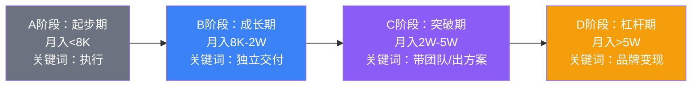
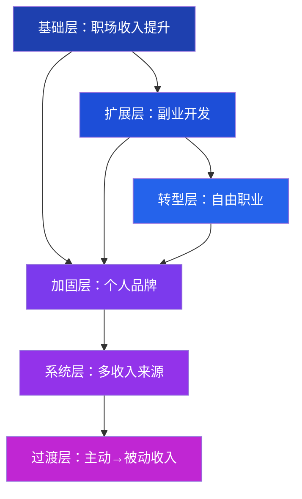
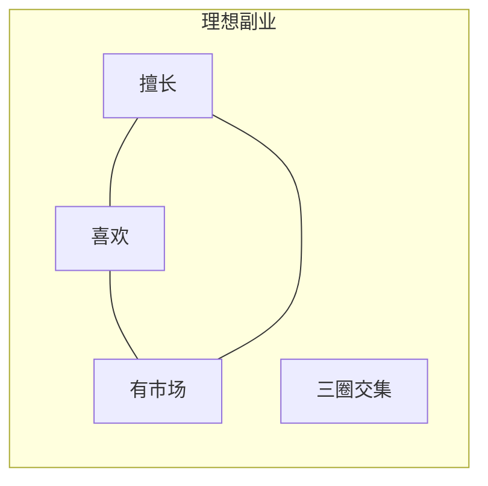
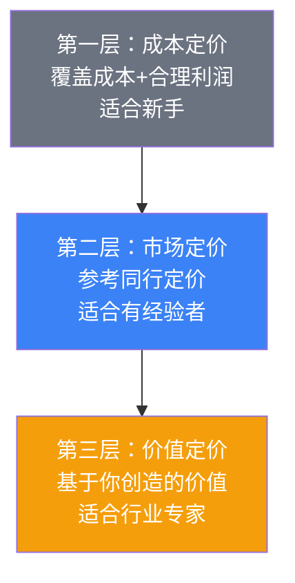
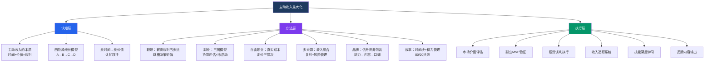

# 第四章：主动收入最大化 —— 本章小结

> "主动收入是财富大厦的地基。地基不牢，上面盖得再高也是危楼。"

本章用了七节理论、八个技巧、八个实战案例，从底层逻辑到上手操作，系统拆解了"主动收入最大化"这个命题。本小结不是简单复述，而是帮你把散落的知识点**串联成体系**，形成可执行的行动框架。

---

## 一、核心认知框架：主动收入的底层逻辑

### 1.1 主动收入的本质公式

主动收入不是一个简单的"干活换钱"的关系，而是由三个变量共同决定的：

```text
主动收入 = 市场价值 × 有效时间投入 × 谈判系数

其中：
  市场价值 = 专业深度 × 稀缺性 × 个人品牌溢价
  有效时间投入 = 总工作时间 × 效率系数 × 专注度
  谈判系数 = 信息对称性 × 谈判技巧 × BATNA强度
```

这三个变量不是孤立的——提升任何一个，都会对另外两个产生正向溢出。比如提升专业深度（市场价值↑）会增强谈判信心（谈判系数↑），同时因为效率提高（有效时间↑），同样的产出需要的时间更少。

### 1.2 收入增长的四个阶段

本章贯穿始终的一个核心模型是收入增长的四阶段路径。理解你处于哪个阶段，决定了你应该把精力放在哪里：



| 阶段 | 核心任务 | 主要瓶颈 | 突破方法 |
|------|---------|---------|---------|
| A→B | 从"被安排"到"能独立" | 技能不足，缺乏项目经验 | 刻意练习，主动请缨承担完整项目 |
| B→C | 从"做事"到"带人做事" | 缺乏管理视角和全局思维 | 学习项目管理，主动做跨部门协调 |
| C→D | 从"卖时间"到"卖价值" | 收入上限被时间锁死 | 个人品牌、产品化、杠杆工具 |

**关键洞察**：大多数人在B阶段停留最久。原因不是能力不够，而是**缺少从"执行者"到"价值创造者"的认知跃迁**。你需要学会的不只是"把事做好"，而是"让对的事发生"。

### 1.3 "卖时间"到"卖价值"的本质转变

这是本章最核心的认知升级。传统思维是"我每小时值多少钱"，进阶思维是"我解决的这个问题值多少钱"。

举个例子：一个程序员帮客户修复一个导致每天损失5万元的系统Bug，花了2小时。如果按时间收费，可能收2000元；如果按价值收费，收5万元完全合理——因为你为客户消除了持续的损失。

这个转变不是一蹴而就的，它需要三个前提条件：

1. **你能识别问题的价值**——需要对客户业务有深入理解
2. **你能交付确定的结果**——需要足够的专业积累和案例背书
3. **客户认可你的价值**——需要个人品牌和信任积累

---

## 二、六大核心策略的系统回顾

### 2.1 策略总览

本章围绕主动收入最大化，展开了六大策略方向。它们不是并列关系，而是层层递进的：



### 2.2 策略一：职场收入提升

**核心逻辑**：你的薪资不由你的努力决定，而由你的**市场价值**和**议价能力**共同决定。

**薪资谈判五步法**回顾：

| 步骤 | 核心动作 | 常见错误 |
|------|---------|---------|
| 第一步：知己知彼 | 用招聘网站、猎头、同行了解市场行情，计算自己的真实时薪 | 凭感觉估价，要么低估自己要么漫天要价 |
| 第二步：选择时机 | 绩效考核后、项目成功交付后、公司业绩好时 | 在公司裁员期或自己刚犯错时提加薪 |
| 第三步：准备话术 | 用数据和成果说话，量化你为公司创造的价值 | 说"我需要钱"或"别人给我开了更高工资" |
| 第四步：应对异议 | 提前准备对方可能的反驳，准备B计划 | 被拒绝后情绪化或立刻辞职 |
| 第五步：达成协议 | 争取非现金福利（期权、培训、弹性工时） | 只盯着基本工资，忽略总体薪酬包 |

**跳槽决策的系统化方法**：不跳槽是默认选项。跳槽前必须回答三个问题——能力能上台阶吗？新公司业务在增长吗？能接受最坏情况吗？跳槽涨薪有三种类型（价值回归型、信息不对称型、行业套利型），只有第一种是可持续的。

### 2.3 策略二：副业开发

**三圈模型**是副业选择的核心工具：



- **擅长 ∩ 喜欢** = 但没市场 → 当爱好，别指望赚钱
- **擅长 ∩ 有市场** = 但不喜欢 → 能赚钱但不可持续，容易倦怠
- **喜欢 ∩ 有市场** = 但不擅长 → 需要先投入学习成本，风险较高
- **三圈交集** = 最佳副业方向 → 既有动力又有能力还能变现

**副业与主业的协同关系**是另一个关键判断维度。好的副业应该在至少三个维度产生正收益：直接收入、技能溢出、人脉积累、个人品牌。只有"负协同"的副业（如销售去做竞品代理）才真正会影响主业。

**冷启动方法**：不要一上来就投入大量资源。用MVP（最小可行产品）验证——先花最少的时间和金钱做出一个"够用"的版本，投放到市场测试反馈，再决定是否加大投入。

### 2.4 策略三：自由职业

**自由职业的真实成本**被严重低估。50万的项目年收入，扣除空窗期（25%）、社保（5万）、获客成本（15%）、办公成本（2万），实际到手可能只有23万，折合月薪不到2万。

**定价策略的三个层次**：



**最佳过渡策略**：先兼职做，等副业收入连续3个月达到主业收入的70%以上，再考虑全职转型。在此之前，不要冲动辞职。

### 2.5 策略四：多收入来源

多收入来源的核心价值不只是"多赚一份钱"，而是**降低风险**和**产生复利效应**。

**收入来源的分类**：

| 类型 | 特征 | 示例 | 风险等级 |
|------|------|------|---------|
| 主动型 | 用时间换钱，收入与投入时间正相关 | 工资、咨询费、接单 | 低（稳定但有上限） |
| 杠杆型 | 借助杠杆放大单位时间价值 | 带团队、做课程、写书 | 中（前期投入大） |
| 被动型 | 一次投入持续产出 | 投资收益、版税、租金 | 中高（依赖市场） |
| 复合型 | 多种收入流相互增强 | 个人品牌带来的多元变现 | 低-中（最健康的结构） |

**过渡路径**：从主动收入到被动收入不是"跳过去"，而是"搭桥过去"——先用主动收入积累本金和技能，再逐步把主动收入"产品化"为可重复销售的产品或服务。

### 2.6 策略五：个人品牌

个人品牌不是"包装"，而是"信号"。在信息不对称的市场中，它是你持续发出的能力信号。信号必须有实质内容支撑，否则就是噪音。

**品牌建设三阶段**：

1. **能力积累期（0-6个月）**：不急着输出，先做到领域前30%，积累3-5个拿得出手的案例
2. **内容输出期（6-18个月）**：每周1篇高质量文章，回答专业问题，分享方法论和工具
3. **口碑积累期（18个月+）**：让客户替你说话，让同行替你推荐

**品牌建设的核心指标**：你的内容被同行引用、有陌生人主动找你咨询——说明品牌开始生效。急于求成是最大的敌人，品牌建设是以年为单位的工程。

### 2.7 策略六：效率与时间管理

时间是主动收入最稀缺的资源。提升效率不是"加班"，而是**提升单位时间的价值产出**。

**核心方法**：
- **番茄工作法**：25分钟专注+5分钟休息，适合需要深度思考的工作
- **时间块管理**：把一天分为不同功能块（深度工作、沟通、学习、休息）
- **精力管理**：把最重要的工作安排在精力最充沛的时段，而不是最空闲的时段
- **80/20法则**：识别那20%产出80%成果的高价值活动，优先投入

---

## 三、八大实战案例的核心启示

本章收录了8个真实案例，覆盖了从基层员工到自由职业者的完整光谱。把这些案例放在一起看，可以提炼出几个共性规律：

### 3.1 案例速览

| 案例 | 起点 | 终点 | 关键转折 | 核心方法 |
|------|------|------|---------|---------|
| 程序员小陈 | 月薪8K | 年薪50万 | 用项目成果说服老板 | 技术深耕+成果可视化 |
| 烘焙创业者李姐 | 全职妈妈 | 月入3万 | 从朋友圈卖蛋糕开始 | 兴趣副业→品牌化→团队化 |
| 设计师小王 | 月薪1.5万 | 自由职业年入40万 | 用作品集打开市场 | 自由职业的定价升级 |
| 知识付费小刘 | 普通文员 | 年入60万 | 第一门课定价99元 | 技能外化→课程→社群 |
| 餐饮创业者阿强 | 外卖骑手 | 月入数万 | 从骑手变老板 | 行业认知→自建品牌 |
| HRBP小赵 | 行政岗 | 年薪35万 | 主动学习HRBP技能 | 跨领域转型+专业深耕 |
| 自由翻译小孙 | 月薪5000 | 年入30万 | 建立稳定的客户群 | 语言技能+客户关系管理 |
| 短视频剪辑师阿明 | 工厂工人 | 月入2万 | 花3个月自学剪辑 | 自学稀缺技能+接单→团队化 |

### 3.2 从案例中提炼的五条铁律

**铁律一：起点不决定终点，认知决定终点。** 阿强从外卖骑手到餐饮创业者，阿明从工厂工人到月入2万的剪辑师——他们的起点都不高，但他们都做对了一件事：在工作中积累行业认知，而不是机械地完成任务。

**铁律二：先验证再投入，不要一步到位。** 李姐从朋友圈卖蛋糕开始，小刘第一门课只定价99元——都是用最小成本验证市场反应。成功后再加大投入，失败了损失也可控。

**铁律三：技能要"专"不要"多"。** 小孙只靠翻译一项技能就实现了收入6倍增长，阿明只靠剪辑一项技能就从工厂跳到了月入2万。深度远比广度重要。

**铁律四：副业和主业可以正向循环。** 程序员小陈的技术博客增强了行业影响力，反过来帮助了职场晋升。小刘的文员工作锻炼了写作能力，为知识付费打下了基础。

**铁律五：从"做事"到"做品牌"是质变。** 李姐从卖蛋糕到建立烘焙品牌，阿强从送外卖到经营餐饮品牌——当你的名字本身成为信任符号时，收入模式就从线性增长变成了指数增长。

---

## 四、十大常见误区的速查清单

本章"常见误区"一节拆解了10个最具迷惑性的认知陷阱。这里做一个速查对照表，帮你在决策时快速自检：

| 误区 | 错误认知 | 正确认知 | 自检问题 |
|------|---------|---------|---------|
| 频繁跳槽涨薪 | 跳槽是涨薪最快的方式 | 只有价值回归型跳槽可持续 | 我的简历会不会显得不稳定？ |
| 副业影响主业 | 做副业就会分心 | 正协同副业反而增强主业 | 这个副业能给主业带来什么？ |
| 自由职业很自由 | 不用打卡就是自由 | 自由职业的隐性成本极高 | 我算过真实到手收入吗？ |
| 品牌就是包装 | 简历漂亮就行 | 品牌是持续的能力信号 | 我的内容经得起同行审视吗？ |
| 收入越高越好 | 年薪高就是赢家 | 收入满意度才是关键 | 我为此牺牲了什么？ |
| 技能越多越好 | 技多不压身 | 深度+稀缺性才是溢价来源 | 我的哪项技能能排进前10%？ |
| 等待完美时机 | 条件成熟再行动 | 最小可行行动打破等待 | 如果只做最小的一步，是什么？ |
| 只看收入不看成本 | 月薪3万就是3万 | 名义收入和实际收入差距巨大 | 我算过实际时薪吗？ |
| 高学历=高收入 | 学历越高赚越多 | 学历是入场券不是定价器 | 我的能力能跟学历匹配吗？ |
| 收入越高消费越高 | 赚得多花得多正常 | 储蓄率才是财富积累的关键 | 我的储蓄率是多少？ |

---

## 五、关键工具箱

### 5.1 个人市场价值评估模板

```text
第一步：收集数据
  - 在BOSS直聘、猎聘、拉勾搜索你的岗位，记录薪资范围
  - 找3-5个同行业同岗位的朋友，了解他们的薪资水平
  - 联系1-2个猎头，获取专业评估

第二步：计算你的市场价值
  市场价值 = 行业基准薪资 × 能力系数 × 稀缺性系数

  行业基准薪资：招聘网站中位数
  能力系数：0.8（低于平均）/ 1.0（平均）/ 1.2（高于平均）/ 1.5（顶尖）
  稀缺性系数：0.8（供过于求）/ 1.0（供需平衡）/ 1.3（供不应求）

第三步：计算你的实际时薪
  实际时薪 = 月到手收入 ÷ (每月实际工作天数 × 每天实际工作小时数)
  
  注意：实际工作小时数包括加班、通勤时间的分摊
```

### 5.2 副业评估矩阵

在决定做哪个副业之前，用以下维度打分（每项1-5分）：

| 评估维度 | 权重 | 你的评分 | 加权得分 |
|---------|------|---------|---------|
| 与主业协同度 | 25% | ___ | ___ |
| 市场需求量 | 20% | ___ | ___ |
| 启动成本 | 15% | ___ | ___ |
| 收入天花板 | 15% | ___ | ___ |
| 个人兴趣 | 15% | ___ | ___ |
| 时间灵活性 | 10% | ___ | ___ |
| **总分** | **100%** | | **___** |

总分 > 3.5：值得尝试 | 总分 2.5-3.5：谨慎评估 | 总分 < 2.5：不建议

### 5.3 薪资谈判准备清单

```markdown
□ 市场行情调研完成（至少3个数据源）
□ 自己的核心成果清单（量化数据）
□ 对方可能的异议和应对话术
□ 我的BATNA（最佳替代方案）明确
□ 非现金福利的期望清单（期权、培训、弹性工时等）
□ 谈判的时间和场景选择
□ 最低可接受的底线
□ 理想目标和让步空间
```

### 5.4 收入来源健康度自检

每月花15分钟检查以下指标：

```text
1. 收入集中度 = 最大单一收入来源 ÷ 总收入
   > 80% → 高风险，需要尽快开发第二来源
   60-80% → 中等风险，有改善空间
   < 60% → 健康状态

2. 收入增长率 = (本月收入 - 上月收入) ÷ 上月收入
   持续负增长 → 需要立即排查原因
   零增长 → 需要寻找增长点
   正增长 → 继续保持

3. 时间投入回报率 = 收入 ÷ 总工作时间
   逐月下降 → 效率出了问题或定价需要调整
   持续提升 → 你在正确的轨道上
```

---

## 六、本章金句精选

> "你的收入，与你解决问题的难度成正比。" —— T.哈维·艾克

这句话的深意是：不要追求"做更多的事"，而要追求"做更难的事"。难度越高，愿意做的人越少，你的稀缺性就越高，收入自然水涨船高。

> "最好的投资，是投资自己。" —— 沃伦·巴菲特

投资自己的回报率远超任何金融产品。一个年收入从10万提升到30万的人，"收益率"是200%——而且这个收益是终身的、可复利的。

> "不要用战术上的勤奋，掩盖战略上的懒惰。"

每天加班到12点不如花1小时想清楚：我在做的事情，是离目标更近了还是只是在原地打转？

> "你的收入是你周围5个人的平均值。" —— 吉姆·罗恩

这不是鸡汤，而是信息网络效应。你周围的人决定了你能获得的信息质量、机会数量和思维层次。主动升级你的社交圈，是提升收入的隐性杠杆。

---

## 七、行动清单：从知识到行动

### 立即行动（今天就做）

- [ ] **计算你的真实时薪**：月到手收入 ÷ (工作天数 × 每天总投入时间)，记住要算上通勤和加班
- [ ] **评估你的阶段**：对照本章概览中的四阶段诊断表，确定你目前处于A/B/C/D哪个阶段
- [ ] **列出你的3个可变现技能**：写下你擅长的、市场有需求的、可以独立交付成果的技能

### 本周行动

- [ ] **完成市场价值评估**：在至少3个招聘平台搜索你的岗位薪资，计算市场中位数
- [ ] **用三圈模型评估副业方向**：画出擅长、喜欢、有市场的三个圈，找到交集
- [ ] **模拟一次薪资谈判**：找朋友扮演老板，练习用数据和成果说话

### 本月行动

- [ ] **制定收入多样化规划**：设计你的收入来源组合（至少包含1个主业+1个可发展的副业方向）
- [ ] **启动个人品牌建设**：选择一个内容平台，发布第一篇专业文章
- [ ] **执行一个副业MVP**：用最小成本验证一个副业想法（投入不超过100元和10小时）

### 本季度行动

- [ ] **完成一次薪资谈判或跳槽评估**：用本章的五步法和决策矩阵
- [ ] **建立收入追踪系统**：每月记录各收入来源的金额、时间投入、增长趋势
- [ ] **完成至少一个技能的深度学习**：选择你评估出的最高价值技能，投入100小时刻意练习

---

## 八、下一章预告

下一章我们进入**投资理财基础**，这是从"赚钱"到"钱生钱"的关键跃迁。你将学习：

1. **建立正确的投资理念**：为什么大多数人投资亏钱？常见的心理陷阱有哪些？
2. **了解基本的投资工具**：基金、股票、债券、保险——它们各自的特征、风险和适合人群
3. **制定资产配置策略**：如何根据你的年龄、收入和风险偏好分配资金
4. **开始你的第一笔投资**：从零开始的实操指南，包括开户、选基金、定投策略

> **核心过渡逻辑**：主动收入是财富积累的起点，但不是终点。当你有了稳定的主动收入后，下一步就是让钱为你工作。记住第四章概览中的那张表——月被动收入5000元需要150万本金，月被动收入3万元需要900万本金。这些本金从哪里来？来自主动收入的持续积累和合理储蓄。第五章会告诉你，积累下来的钱如何安全、稳健地增长。

---

## 九、知识体系全景图

最后，用一张图把本章所有核心概念串联起来，形成完整的知识体系：



这张图也是你的行动路线图：先在认知层建立正确的框架，再在方法层选择适合你的策略，最后在执行层一步步落地。

主动收入的最大化不是一个终点，而是一个持续迭代的过程。每提升一个阶段，你对世界的理解、对财富的认知、对人生的选择权都会发生质的变化。

**现在就开始行动。从今天的三个"立即行动"清单开始。**
