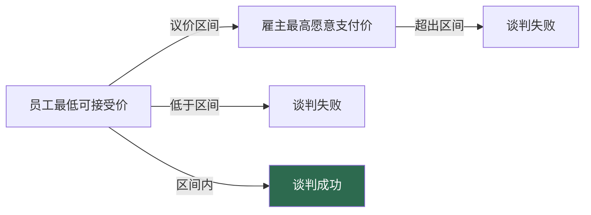
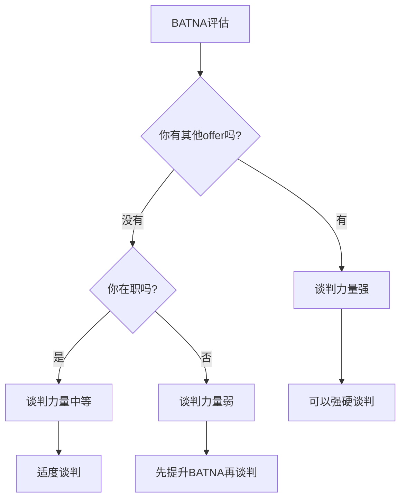
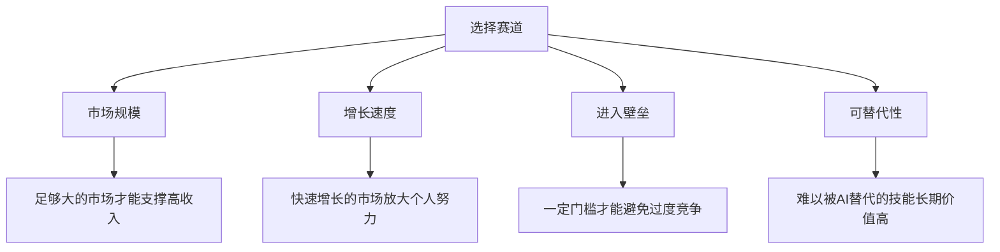
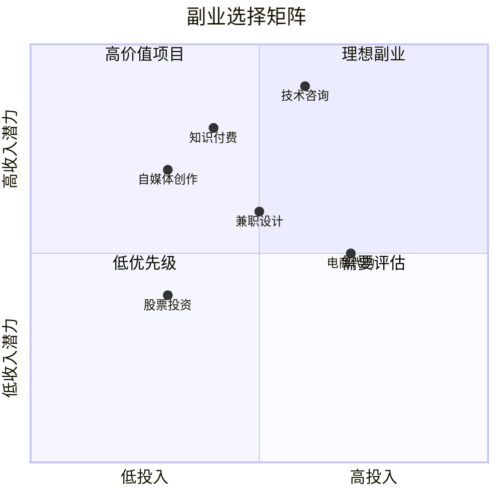
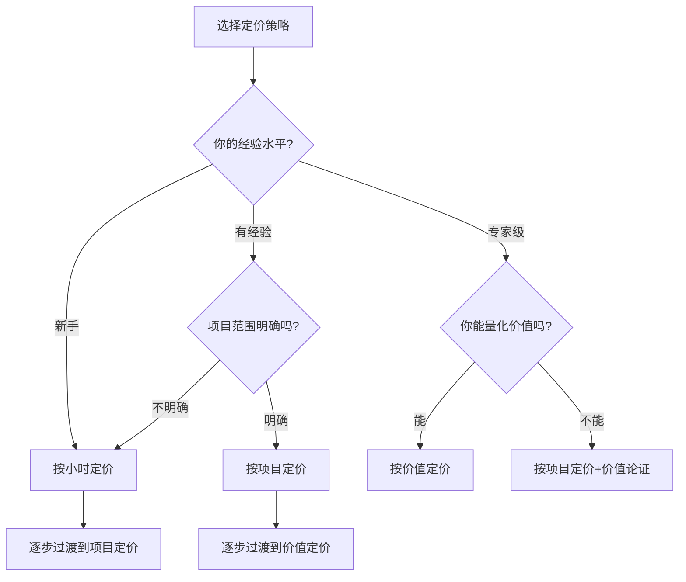
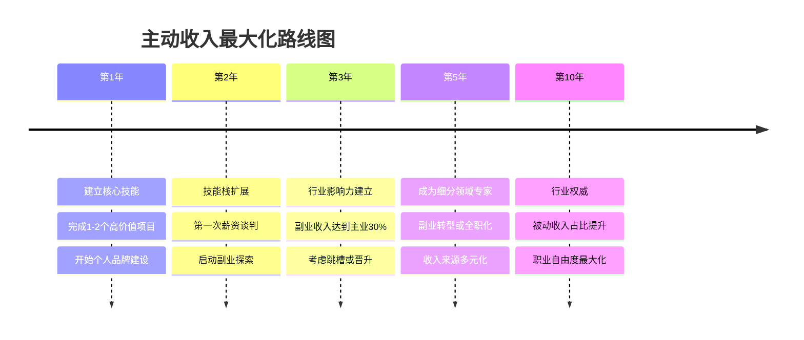

# 深度拓展：主动收入最大化

本章将系统性地拆解主动收入最大化的核心策略——从薪资谈判的博弈技巧，到职业发展的长期规划，从高收入技能的精准选择，到副业与自由职业的经济学。每一个板块都遵循"道法术器"的逻辑：先理解底层原理，再掌握方法论，最后落实到可执行的操作。

---

## 一、薪资谈判的博弈论分析

### 1.1 谈判的本质：价值分配的博弈

薪资谈判本质上是一个"分配博弈"（Distributive Bargaining）——雇主和员工就一块"蛋糕"的分配比例进行协商。然而，与零和博弈不同的是，优秀的谈判者能够通过创造性的方式将"蛋糕做大"，实现双赢。

博弈论中有一个经典概念叫"议价区间"（Bargaining Zone）：雇主心中有一个"最高愿意支付"的价格，员工心中有一个"最低愿意接受"的价格，两者之间的区域就是议价区间。只有当议价区间为正（雇主最高价 > 员工最低价）时，谈判才有可能成功。



**信息不对称的关键**：在薪资谈判中，最大的武器不是口才，而是信息。你需要尽可能了解：

| 信息维度 | 具体内容 | 获取渠道 |
|---------|---------|---------|
| 市场薪资范围 | 该职位在行业中的薪资区间 | 招聘网站（Boss直聘、猎聘）、行业报告、猎头 |
| 公司薪资结构 | 基本工资、奖金、股权、福利比例 | 脉脉匿名区、前员工、Glassdoor |
| 个人保留价格 | 你最低可接受的薪资 | 计算生活成本+机会成本 |
| 对方议价空间 | 公司的薪酬预算和盈利状况 | 财报（上市公司）、行业对标、内部消息 |

### 1.2 锚定效应在谈判中的应用

行为经济学中的"锚定效应"在薪资谈判中尤为重要。研究表明，**首先出价的一方通常能够将谈判结果"锚定"在对自己有利的范围内**。

经典实验：哥伦比亚大学商学院的亚当·加林斯基（Adam Galinsky）和马塞尔·穆塞拉（Mussweiler）进行了一个模拟谈判实验。结果发现，首先出价的参与者获得的最终结果，平均比等待对方出价的参与者高出约15%。

**具体策略**：

- **如果你有足够的信息**：首先出价，而且报价要略高于你的"理想薪资"——这会将对方的心理锚点拉向你设定的范围。建议报价比理想薪资高10-15%。
- **如果你缺乏信息**：可以先探问对方的预算范围，但避免自己首先出价——"我对这个职位非常感兴趣，我想了解一下贵公司这个职位的薪资范围是怎样的？"
- **报价的"精确性"**：研究表明，使用精确的数字（如"93,500元/月"）比使用整数（如"95,000元/月"）更能增加报价的可信度，因为精确的数字暗示了更深入的市场研究。

**锚定效应的反制**：当对方先出价时，你需要主动"重置锚点"。具体做法是：
1. 不要对对方的报价表现出惊讶或失望
2. 立即引入一个新的参考框架："根据我了解到的市场行情和我的经验..."
3. 用具体数据支撑你的反锚定

### 1.3 BATNA：谈判的终极筹码

在谈判理论中，BATNA（Best Alternative to a Negotiated Agreement，最佳替代方案）是你在谈判中最核心的筹码。简单来说，你的BATNA越好，你的谈判力量越强。



**如何增强你的BATNA**：
- 在开始薪资谈判之前，先获得其他公司的offer——即使你不想去那家公司
- 持续维护你的外部职业网络和市场价值
- 培养可迁移的高价值技能，确保你在就业市场上始终具有竞争力
- 建立足够多的被动收入来源，降低对单一工资收入的依赖

**BATNA的"隐性信号"**：你不需要明确告诉对方你有其他offer（除非真的有），但你的整体气场——自信、不急不躁、有选择权——会自然传达出你有良好BATNA的信号。这就是为什么"在职跳槽"通常比"失业后找工作"能获得更好的薪资条件。

### 1.4 整合式谈判：做大蛋糕

高级的薪资谈判不仅仅是"讨价还价"，更是"创造性解决问题"。整合式谈判（Integrative Negotiation）的核心是找到能够满足双方核心需求的创新方案。

**非薪资谈判筹码**：

| 筹码类型 | 对公司成本 | 对员工价值 | 适用场景 |
|---------|-----------|-----------|---------|
| 签约奖金（Sign-on Bonus） | 一次性支出，不影响长期结构 | 高 | 跳槽时 |
| 绩效奖金 | 与业绩挂钩，公司风险低 | 中高 | 销售、管理岗位 |
| 股权/期权 | 现金流压力小 | 高（长期） | 创业公司、科技公司 |
| 弹性工作制 | 成本极低 | 高 | 远程友好的岗位 |
| 培训和发展预算 | 可计入人力成本 | 中高 | 技术岗位 |
| 额外假期 | 不增加直接成本 | 高 | 所有岗位 |
| 职位头衔 | 零成本 | 中（长期价值） | 管理岗位 |

### 1.5 谈判中的常见陷阱

**陷阱一：过于关注基本工资**。研究表明，总体薪酬包（Total Compensation Package）中，基本工资可能只占60-70%。忽略奖金、股权、福利等其他组成部分，可能导致你选择了一个"看起来工资高但实际总包更低"的选项。

**陷阱二：接受得太快**。即使对方开出的薪资已经超出你的预期，也不要立刻接受。表达感谢和兴趣，但要求一点时间考虑——"这个offer让我非常兴奋，我需要一两天时间仔细考虑一下。"这不仅是给自己留出评估的时间，也向对方传达了你是一个"慎重的决策者"。

**陷阱三：过于对抗性的态度**。薪资谈判的目标是达成双方都满意的协议，而不是"赢"。过于强硬或咄咄逼人的态度可能在短期内获得更高的薪资，但可能损害你在公司的长期关系和声誉。

**陷阱四：没有书面确认**。口头承诺不具有法律效力。所有谈判达成的条件——薪资、奖金、股权、福利、工作条件——都必须以书面形式（offer letter或合同）确认。

**陷阱五：忽略长期增长潜力**。一份起薪较低但有明确晋升路径和薪资增长机制的工作，可能在3-5年后总收益超过起薪较高但增长停滞的工作。评估时要看"薪资增长曲线"，而不仅仅是起薪点。

---

## 二、职业发展的复利效应

### 2.1 职业资本的积累

"职业资本"（Career Capital）是卡尔·纽波特（Cal Newport）在《优秀到不能被忽视》（So Good They Can't Ignore You）中提出的核心概念。他认为，真正有意义的"激情"不是天生的，而是通过积累稀缺且有价值的技能（即职业资本）逐步发展出来的。

职业资本的积累具有复利效应：
- **技能叠加**：每掌握一项新技能，不仅增加了你的直接价值，还与已有的技能产生"化学反应"。例如，编程+写作=技术博客影响力；数据分析+行业知识=商业智能咨询能力。
- **机会吸引**：高水平的职业资本会自动吸引更好的机会——更高的薪资、更重要的项目、更有价值的人脉。
- **杠杆效应**：随着职业资本的增加，你的每一小时工作时间能够创造更多的价值——这就是为什么资深专家的时薪可能是初级员工的10-50倍。

**职业资本的四个维度**：

| 维度 | 内容 | 如何积累 |
|------|------|---------|
| 技能资本 | 专业知识、技术能力、方法论 | 持续学习、项目实践、认证考试 |
| 人脉资本 | 行业关系、合作伙伴、导师 | 行业活动、社群参与、主动链接 |
| 声誉资本 | 个人品牌、行业影响力、口碑 | 内容输出、公开演讲、案例积累 |
| 财务资本 | 储蓄、投资、被动收入 | 理财规划、副业收入、投资收益 |

### 2.2 职业发展的T型策略

**T型能力结构**是指在一个领域有深度专长（T的垂直笔画），同时在多个领域有基本了解（T的水平笔画）。

研究表明，最成功的职业发展通常遵循以下模式：
- **前5年**：专注于建立深度专长，成为某个细分领域的"专家"
- **5-10年**：在保持专业深度的同时，扩展横向知识和技能
- **10年以上**：利用深度专长和广度知识的结合，向管理岗位或创业方向发展

**选择"赛道"的考量**：



### 2.3 职业发展的非线性回报

职业发展的回报不是线性的，而是呈阶梯式跳跃。大多数人的职业生涯中，会有几个关键的"跳跃点"——每次跳跃都带来收入和地位的显著提升。

**常见的跳跃点包括**：
- 第一次成为团队负责人
- 第一次获得关键项目的所有权
- 第一次成功的行业转型
- 第一次获得股权激励
- 第一次成功创业或上市

关键在于：**在两次跳跃之间，你可能看不到明显的收入增长——这就是"欺骗期"**。很多人在这个阶段感到沮丧，转而频繁跳槽或转行，从而错过了即将到来的跳跃。保持耐心和持续投入，是实现职业发展的"指数增长"的关键。

### 2.4 个人品牌建设：声誉资本的复利

在信息时代，个人品牌是最被低估的职业资产。它不需要任何金钱投入，但回报是指数级的。

**个人品牌的三个层次**：

1. **基础层：专业能力展示**
   - 维护一份专业的LinkedIn/脉脉档案
   - 定期更新项目成果和技能清单
   - 获取行业认可的证书和资质

2. **进阶层：内容输出**
   - 在行业媒体或个人博客发表专业文章
   - 在技术社区（GitHub、Stack Overflow、知乎）回答问题
   - 制作教程、分享工具、开源项目

3. **高阶层：思想领导力**
   - 在行业会议发表演讲
   - 出版专业书籍或白皮书
   - 成为媒体引用的行业专家

**内容输出的复利公式**：每篇文章/视频/项目都是一个"资产"——它会持续为你带来曝光、机会和人脉。100篇高质量内容 = 一个自动运转的"机会吸引机器"。

### 2.5 导师关系：职业发展的加速器

导师（Mentor）是职业发展中最高效的加速器。一个好的导师可以帮你：
- 避免重复踩坑（节省数年弯路）
- 获得内部视角和隐性知识
- 打开人脉网络的大门
- 在关键时刻提供决策支持

**如何找到导师**：
1. **明确你的需求**：你需要什么类型的指导？技术深度？行业洞察？管理经验？
2. **从现有网络开始**：前领导、同事、校友、行业活动中认识的人
3. **提供价值先行**：不要直接问"你能做我的导师吗"，而是先提供帮助——分享信息、协助项目、介绍人脉
4. **保持定期联系**：每月至少一次有意义的互动，而不是只在需要帮助时才联系
5. **接受多个导师**：不同维度的问题找不同的人，不依赖单一导师

---

## 三、高收入技能的市场分析

### 3.1 技能市场的供需经济学

从经济学角度看，个人收入水平由三个因素决定：

**技能的稀缺性（Supply）**：掌握某项技能的人越少，该技能的市场价格越高。这就是为什么小众但高需求的技术技能（如某些编程语言的专家）能获得极高的报酬。

**技能的需求量（Demand）**：市场对某项技能的需求越大，该技能的价格越高。需求量取决于该技能能解决的问题的重要性和紧迫性。

**技能的可迁移性（Transferability）**：技能越能跨行业、跨地域应用，其价值越高。例如，编程技能几乎在所有行业都有需求，而某些行业特定的技能可能只能在一个行业使用。

**技能定价公式**：

```text
技能价值 = (稀缺性 × 需求量 × 可迁移性) ÷ 学习门槛
```

这个公式的含义是：即使一项技能非常稀缺且需求量大，如果学习门槛极低（比如很快就能被AI替代），其长期价值也会下降。

### 3.2 当前及未来高收入技能分析

**技术类技能**：

| 技能 | 当前市场热度 | 未来5年前景 | 入门难度 | 收入潜力 | 学习路径 |
|------|------------|------------|---------|---------|---------|
| AI/机器学习 | ★★★★★ | ★★★★★ | 高 | 极高 | 数学基础→Python→ML框架→深度学习→大模型 |
| 云计算/DevOps | ★★★★☆ | ★★★★☆ | 中高 | 高 | Linux→Docker→K8s→CI/CD→云平台认证 |
| 网络安全 | ★★★★☆ | ★★★★★ | 中高 | 高 | 网络基础→渗透测试→安全审计→应急响应 |
| 数据工程 | ★★★★☆ | ★★★★☆ | 中 | 高 | SQL→Python→ETL→数据仓库→实时处理 |
| 区块链开发 | ★★★☆☆ | ★★★★☆ | 高 | 高 | 密码学→Solidity→智能合约→DeFi协议 |

**商业类技能**：

| 技能 | 当前市场热度 | 未来5年前景 | 入门难度 | 收入潜力 | 学习路径 |
|------|------------|------------|---------|---------|---------|
| 产品管理 | ★★★★★ | ★★★★☆ | 中 | 高 | 用户研究→需求分析→项目管理→数据驱动 |
| 增长营销 | ★★★★☆ | ★★★★☆ | 中 | 中高 | 内容营销→SEO/SEM→数据分析→A/B测试 |
| 数据分析 | ★★★★★ | ★★★★☆ | 中低 | 中高 | Excel→SQL→Python→可视化→业务洞察 |
| 商业谈判 | ★★★★☆ | ★★★★☆ | 中 | 高 | 心理学基础→案例学习→模拟练习→实战 |
| 跨境电商运营 | ★★★★☆ | ★★★★☆ | 中 | 中高 | 平台规则→选品→供应链→广告投放 |

**创意类技能**：

| 技能 | 当前市场热度 | 未来5年前景 | 入门难度 | 收入潜力 | 学习路径 |
|------|------------|------------|---------|---------|---------|
| 视频制作/剪辑 | ★★★★★ | ★★★★☆ | 中低 | 中高 | 拍摄基础→剪辑软件→叙事技巧→商业化 |
| UX/UI设计 | ★★★★☆ | ★★★☆☆ | 中 | 中高 | 设计原理→Figma→用户研究→交互设计 |
| AI提示工程 | ★★★★★ | ★★★★☆ | 低 | 中高 | LLM原理→提示设计→自动化→Agent开发 |
| 内容创作 | ★★★★★ | ★★★★☆ | 低 | 中-极高 | 写作技巧→平台运营→变现模式→IP打造 |

### 3.3 技能组合的"乘数效应"

单一技能的收入上限是有限的，但多项技能的组合可以产生"乘数效应"。斯科特·亚当斯（Scott Adams，《呆伯特》漫画作者）提出了"技能栈"（Talent Stack）的概念：**你不必在任何一项技能上成为世界前1%，但如果你在2-3项技能上都能达到前25%，你就能成为这些技能交叉领域的顶尖人才**。

**高价值技能组合示例**：

| 技能组合 | 交叉领域 | 年收入潜力 | 入门策略 |
|---------|---------|-----------|---------|
| 编程 + 金融知识 | 量化交易开发 | 100-500万+ | 先学Python，再学金融建模 |
| 写作 + 营销 + 行业知识 | 知名行业KOL | 50-1000万+ | 先建立专业博客，再做内容营销 |
| 设计 + 编程 + 商业理解 | 独立产品开发者 | 50-200万+ | 先做UI设计，再学前端开发 |
| 数据分析 + 业务理解 + 沟通能力 | 商业智能总监 | 80-200万 | 先做数据分析，再学业务知识 |
| AI + 垂直行业知识 | 行业AI解决方案 | 100-300万+ | 先学AI基础，再深入行业 |
| 法律 + 技术背景 | 数据合规/隐私保护 | 60-150万 | 先学法律基础，再学技术合规 |

### 3.4 技能投资的ROI评估

不是所有技能都值得投入时间学习。在决定学习一项新技能之前，用以下框架评估其投资回报率：

**技能投资评估矩阵**：

| 评估维度 | 权重 | 评分标准（1-10分） |
|---------|------|-------------------|
| 市场需求 | 30% | 招聘需求量、薪资水平、增长趋势 |
| 学习成本 | 20% | 时间投入、金钱投入、学习曲线 |
| 迁移价值 | 20% | 跨行业适用性、与其他技能的组合性 |
| 抗AI能力 | 15% | 被AI替代的难度、人机协作的增值空间 |
| 个人适配 | 15% | 兴趣、天赋、现有基础 |

**评估公式**：
```text
技能ROI = (市场需求 × 0.3 + 迁移价值 × 0.2 + 抗AI能力 × 0.15 + 个人适配 × 0.15) ÷ (学习成本 × 0.2)
```

---

## 四、副业与主业的平衡策略

### 4.1 副业的经济学分析

从经济学角度看，副业是一种"风险分散"策略——就像投资中的资产配置一样，不把所有鸡蛋放在一个篮子里。

**副业的经济价值**：
- **收入多元化**：降低对单一收入来源的依赖
- **技能拓展**：学习主业中接触不到的技能
- **市场测试**：验证创业想法的可行性，风险可控
- **谈判筹码**：副业收入增加了你的BATNA，增强了薪资谈判力量
- **安全网**：在失业或行业衰退时提供缓冲

**副业的机会成本**：
- **时间成本**：用于副业的时间无法用于休息、学习或主业精进
- **精力成本**：分心可能导致主业表现下降
- **法律风险**：某些劳动合同包含竞业限制或禁止副业条款
- **税务复杂性**：多来源收入可能增加税务申报的复杂性

### 4.2 副业选择的决策框架

**矩阵分析法**：

将潜在的副业按照两个维度进行评估：
- **投入程度**（低→高）：需要投入的时间、金钱和精力
- **收入潜力**（低→高）：短期和长期的收入上限



**最佳副业的特征**：
- 与主业有协同效应（利用相同的技能和人脉）
- 可以逐步从主动收入转化为被动收入
- 投入灵活（可以根据主业的工作量进行调整）
- 有明确的退出条件和止损线
- 不违反劳动合同的相关条款

### 4.3 时间分配的策略

**80/20法则的应用**：帕累托法则表明，80%的成果来自20%的努力。在主业和副业的时间分配中，识别并专注于那20%的高价值活动至关重要。

**时间块管理（Time Blocking）**：将一周的时间划分为不同的"块"，每个块专注于一个特定的任务：
- 工作日白天：主业（8-10小时）
- 工作日晚上：学习和自我提升（1-2小时）
- 周末上午：副业发展（3-4小时）
- 周末下午：休息和社交

**季节性调整**：根据主业的工作量周期性地调整副业投入：
- 主业淡季时增加副业投入
- 主业旺季时减少副业投入，专注于维护现有客户/项目
- 在主业项目截止日前后的2-4周内，可以暂停副业

### 4.4 从副业到主业的过渡策略

当副业收入持续达到主业收入的50%以上，并且副业具有明确的增长轨迹时，可以考虑逐步过渡：

**阶段一：副业与主业并行**（0-12个月）
- 维持主业收入稳定
- 用业余时间发展副业
- 目标：副业月收入达到主业的30%

**阶段二：主业转为兼职或远程**（12-24个月）
- 与雇主协商减少工作时间或转为远程
- 增加副业投入时间
- 目标：副业月收入达到主业的70%

**阶段三：全职投入副业**（24个月+）
- 在副业收入稳定超过主业收入的120%后考虑全职
- 确保有6-12个月的应急储蓄
- 确保副业有明确的增长计划和客户基础

**过渡的风险管理**：
- 在过渡期间保持技能更新，确保可以随时回到职场
- 建立副业的"护城河"——独特的技能、稳定的客户、品牌认知
- 设定明确的"回撤条件"——如果副业收入连续3个月低于某个阈值，启动回撤计划

---

## 五、自由职业的经济学

### 5.1 自由职业的定价策略

自由职业者的定价策略直接影响其收入水平和市场定位。常见的定价模式包括：

**按小时定价**：最简单的模式，但存在明显的收入天花板——你的时间是有限的。适合刚入行的自由职业者，或项目范围不确定的情况。

**按项目定价**：根据项目的复杂度和预期价值来定价，不受实际工作时间的限制。如果你能在更短的时间内完成同样的工作，你的有效时薪就越高。适合有经验的自由职业者。

**按价值定价**：根据你为客户创造的价值来定价，而非你的工作时间。例如，如果你的营销策略能为一个客户带来100万元的额外收入，收取10-20万元的费用是完全合理的。这是最高级的定价策略，需要你能够量化和展示你创造的价值。

**订阅制/保留制定价**：客户按月支付固定费用，获得你的持续服务。这种模式提供了稳定的收入流，减少了"寻找新客户"的不确定性。

**定价策略选择决策树**：



### 5.2 自由职业的财务管理

自由职业者面临独特的财务挑战：

**收入波动性**：自由职业者的收入通常高度波动，需要比固定薪资员工更多的应急储蓄（建议6-12个月的生活费用）。

**税务管理**：自由职业者需要自行处理税务申报，包括预缴税款、发票管理、费用扣除等。建议使用专业的会计软件或聘请兼职会计。

**保险和退休规划**：没有雇主提供的社保和公积金，需要自行购买商业保险和规划退休储蓄。这是自由职业者最容易忽视但最重要的财务事项之一。

**定价与成本**：自由职业者的"成本"不仅是直接工作成本，还包括：
- 非计费时间（营销、行政、学习等）
- 假期和病假的"无收入"成本
- 设备和软件的更新成本
- 持续学习和技能提升的成本

**定价公式详解**：

```text
理想时薪 = (年度收入目标 + 年度运营成本 + 保险和退休储蓄) ÷ 可计费小时数
```

**计算示例**：
- 年度收入目标：50万元
- 年度运营成本：10万元（软件、设备、办公空间）
- 保险和退休储蓄：10万元
- 每年可计费小时数：1000小时（假设50周 × 20小时/周）
- **理想时薪 = (50万 + 10万 + 10万) ÷ 1000 = 700元/小时**

**重要提醒**：可计费小时数通常只占总工作时间的50-60%。其余时间用于营销、行政、学习、沟通等"隐形工作"。因此，如果你每周工作40小时，只有20-24小时是可计费的。

### 5.3 自由职业的客户获取与留存

**客户获取渠道**：

| 渠道 | 成本 | 转化率 | 适合阶段 |
|------|------|--------|---------|
| 口碑推荐 | 零 | 高 | 所有阶段 |
| 自由职业平台（猪八戒、Upwork） | 低 | 中 | 新手期 |
| 行业社群/论坛 | 低 | 中高 | 建立专业形象后 |
| 内容营销（博客、视频） | 中 | 中高 | 长期策略 |
| 冷邮件/冷电话 | 低 | 低 | 需要大量客户时 |
| 合作伙伴推荐 | 低 | 高 | 建立合作关系后 |

**客户留存策略**：
1. **超预期交付**：在预算内多做10%的工作，让客户感到"物超所值"
2. **主动沟通**：定期汇报进度，不要等客户来问
3. **建立信任**：遵守承诺的时间和质量标准
4. **提供增值服务**：在项目之外提供有价值的建议和资源
5. **长期关系**：将一次性项目转化为长期合作

### 5.4 自由职业的长期发展路径

**路径一：规模化**——从个人贡献者发展为小型工作室或代理机构，雇佣其他自由职业者来扩大产能。这条路径的风险在于管理复杂度增加，利润率可能因雇佣成本而下降。

**路径二：产品化**——将重复性的服务打包成标准化产品（如在线课程、SaaS工具、模板资源），实现"做一次，卖多次"的被动收入模式。这条路径需要前期较大的时间投入，但长期来看收入上限更高。

**路径三：专家化**——在某个细分领域建立绝对权威，成为"行业顶尖专家"。当你的名字本身就是一个品牌时，你可以收取极高的溢价（如顶级咨询师的日费可达数万元）。

**路径四：混合模式**——以上三种路径的组合。例如，保留少量高端客户的一对一咨询（专家化），同时销售在线课程（产品化），偶尔承接团队项目（规模化）。

### 5.5 自由职业者常见陷阱

**定价过低**：新手自由职业者最常见的错误是定价过低——不仅直接降低了收入，还向客户传达了"低质量"的信号。研究表明，适当提高价格反而可能增加客户的感知价值和购买意愿。

**忽略"隐形工作"**：自由职业者的时间只有约50-60%是实际计费时间，其余时间用于营销、行政、学习、沟通等"隐形工作"。定价时必须将这些时间成本纳入考虑。

**忽视现金流管理**：在项目完成和收到付款之间往往存在时间差。自由职业者需要严格管理现金流，确保在"等待付款"期间有足够的流动资金。

**缺乏边界感**：自由职业者容易陷入"随时在线"的状态，导致工作与生活的界限模糊。设定明确的工作时间、沟通规则和项目范围，是保持长期可持续发展的关键。

**没有合同**：每个项目都必须有书面合同，明确工作范围、交付标准、付款条件、知识产权归属、违约责任。口头协议是自由职业者最大的法律风险。

---

## 六、跳槽策略与时机选择

### 6.1 跳槽的经济学分析

跳槽是职场人实现薪资跳跃最直接的方式。数据显示，跳槽的平均薪资涨幅为20-30%，而内部调薪通常只有5-10%。但跳槽也有隐性成本：

**跳槽的收益**：
- 薪资跳跃（通常20-30%，稀缺技能可达50%+）
- 新的挑战和成长机会
- 扩大人脉网络
- 获得更好的平台资源

**跳槽的成本**：
- 适应期的生产力损失（通常3-6个月）
- 失去现有公司的资历和信任积累
- 可能失去未兑现的股权/奖金
- 新环境的不确定性风险

### 6.2 最佳跳槽时机

**该跳槽的信号**：
- 薪资增长停滞（连续2年涨幅低于通胀率）
- 技能成长停滞（重复性工作，无新挑战）
- 晋升通道堵塞（组织结构扁平，无上升空间）
- 公司文化不匹配（价值观冲突，工作环境负面）
- 行业衰退信号（公司裁员、业务收缩）

**不该跳槽的时机**：
- 刚入职不满1年（简历会被标记为"不稳定"）
- 正在参与关键项目（完成后再走，积累案例）
- 情绪化决策（和领导吵架后冲动跳槽）
- 仅为小幅薪资涨幅（低于15%的涨幅通常不值得）

### 6.3 跳槽的谈判技巧

**在拿到offer后谈判**：
1. 不要透露当前薪资（在很多地区，询问当前薪资已被禁止）
2. 基于市场价值和目标薪资谈判，而非当前薪资
3. 如果对方坚持要当前薪资，可以说"我更关注的是这个职位的市场价值"
4. 拿到多个offer后再做决定——竞争是最好的谈判筹码

---

## 七、远程工作与全球化机会

### 7.1 远程工作的收入优势

远程工作打破了地理限制，让你可以为全球高薪市场工作，同时享受低成本地区的生活。这是"地理套利"（Geoarbitrage）的核心逻辑。

**远程工作的收入差异**：

| 工作模式 | 收入水平 | 生活成本 | 实际购买力 |
|---------|---------|---------|-----------|
| 本地公司，本地办公 | 中等 | 中等 | 中等 |
| 远程国内大厂 | 高 | 中低 | 高 |
| 远程外企/国际公司 | 极高 | 中低 | 极高 |
| 自由职业，全球客户 | 波动大 | 中低 | 高（潜力） |

### 7.2 远程工作的技能要求

远程工作对自律性和沟通能力的要求远高于办公室工作：
- **异步沟通能力**：清晰的书面表达，减少不必要的会议
- **自我管理能力**：时间管理、任务优先级、进度汇报
- **工具熟练度**：Slack、Notion、GitHub、Zoom等协作工具
- **跨文化沟通**：与不同文化背景的团队协作

### 7.3 全球化收入的机会

- **跨境自由职业平台**：Upwork、Toptal、Fiverr（面向全球客户）
- **远程招聘平台**：Remote OK、We Work Remotely、AngelList
- **开源贡献**：通过GitHub贡献获得国际公司的关注和offer
- **技术写作**：为国际技术媒体撰稿（Medium、Dev.to）

---

## 八、行动总结

### 8.1 立即行动清单

1. **评估你的市场价值**：通过招聘网站、行业报告和人脉网络，了解你的技能在当前市场上的真实价值
2. **制定技能提升计划**：选择1-2项高价值技能，制定6-12个月的学习计划
3. **准备薪资谈判**：收集信息、明确BATNA、练习谈判技巧
4. **评估副业机会**：使用矩阵分析法评估潜在的副业，选择与主业有协同效应的领域
5. **建立财务缓冲**：确保有6-12个月的应急储蓄，为职业转变提供安全网
6. **持续投资自己**：每天至少投入30分钟在技能提升和学习上
7. **记录和展示成果**：建立个人"成就档案"，记录你创造的价值和取得的成果

### 8.2 长期发展路线图



### 8.3 常见误区与纠正

| 误区 | 纠正 |
|------|------|
| "只要技术好就能高薪" | 技术只是基础，沟通、谈判、品牌同样重要 |
| "跳槽才能涨薪" | 跳槽是手段之一，不是唯一手段；内部晋升+谈判同样有效 |
| "副业会影响主业" | 关键是选择有协同效应的副业，而非完全不相关的领域 |
| "自由职业=自由" | 自由职业需要更强的自律性和商业能力 |
| "技能越多越好" | 深度比广度重要，先精通一个领域再扩展 |
| "等待机会降临" | 主动创造机会：输出内容、建立人脉、展示价值 |
