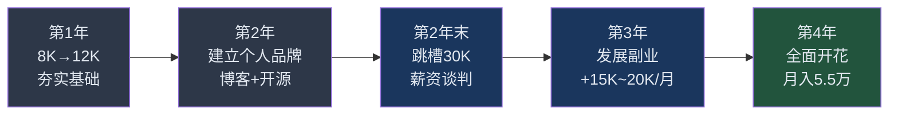
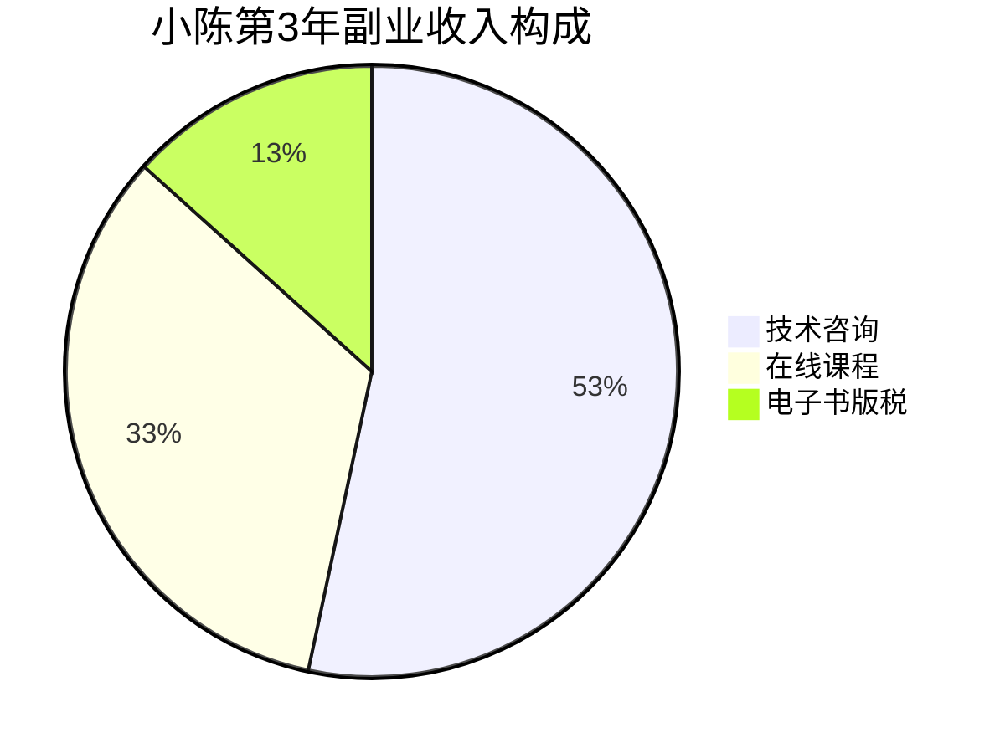

## 案例一：从月薪8K到年薪50万的程序员小陈

### 案例概览

小陈的故事是一个典型的"技术型人才通过系统化策略实现收入跃迁"的案例。他没有名校光环，没有大厂背景，靠的是一套清晰的五年规划和极强的执行力，从月薪8000元的小公司程序员，成长为年收入66万的技术多面手。这个案例的可复制性很强，因为它不依赖于天赋或运气，而是依赖于可习得的方法论。

**基本信息一览：**

| 维度 | 初始状态（2019年） | 最终状态（2023年） |
|------|---------------------|---------------------|
| 年龄 | 26岁 | 30岁 |
| 学历 | 普通二本计算机 | 不变 |
| 月薪 | 8,000元 | 40,000元（主业） |
| 年总收入 | 约10万 | 约66万 |
| 收入来源 | 单一工资 | 主业+咨询+课程+版税 |
| 职级 | 初级开发工程师 | 高级技术专家 |
| 行业影响力 | 无 | 技术社区知名博主 |

### 时间线与收入增长轨迹



### 第一阶段：夯实基础（第1年）

#### 背景与处境

2019年，小陈入职一家30人规模的小型软件公司，负责Java后端开发。公司技术栈老旧（SSH框架），团队没有代码规范，技术氛围薄弱。月薪8000元在二线城市勉强够用，但距离他"30岁前年薪50万"的目标差距巨大。

这个起点非常普通——普通二本、小公司、老技术栈。很多人在这种环境下会陷入"温水煮青蛙"的陷阱：工作内容重复、技术成长停滞、薪资涨幅缓慢。小陈的关键决策在于：**他没有等待环境改变自己，而是主动设计了一条成长路径。**

#### 核心策略：用"刻意练习"替代"被动积累"

小陈意识到，在小公司工作最大的问题不是薪资低，而是**技术天花板低**。如果只是完成日常工作，三年后他依然是一个"会用SSH框架的初级开发"，在市场上毫无竞争力。因此他制定了一个明确的学习计划：

**每日学习时间表（工作日）：**

| 时间段 | 内容 | 目的 |
|--------|------|------|
| 18:30-19:30 | LeetCode刷题（每日1-2题） | 算法思维+面试准备 |
| 19:30-20:30 | 技术书籍/课程 | 系统性知识补充 |

**他选择的技术书单（第1年）：**
- 《Java编程思想》——补基础
- 《Effective Java》——写更好的代码
- 《高性能MySQL》——理解数据库优化
- 《Redis设计与实现》——掌握缓存原理
- 《深入理解Java虚拟机》——JVM调优

#### 具体行动拆解

**1. 主动承担高难度任务**

小陈在公司采取了一个策略：每当有"没人愿意做"的技术难题时，他主动请缨。这些任务包括：

- 数据库慢查询优化（将一个报表查询从12秒优化到200毫秒）
- 系统从单体架构拆分为微服务的可行性调研
- 引入CI/CD流水线，搭建Jenkins自动化部署
- 接入ELK日志系统，解决线上问题排查困难

这些任务的技术难度远超日常CRUD开发，但正是这些经历让他的简历在一年后有了质的飞跃。

**2. 建立"问题-解决方案"知识库**

小陈用Notion建立了一个技术知识库，每解决一个问题就记录下来：

```text
## 问题：线上MySQL主从延迟导致数据不一致

### 现象
用户下单后立即查询订单状态，偶尔显示"未支付"

### 排查过程
1. 检查支付回调日志 → 回调正常
2. 检查数据库 → 主库已更新，从库未同步
3. 监控从库延迟 → 峰值延迟3.2秒

### 根因
大促期间批量写入导致从库SQL线程积压

### 解决方案
1. 短期：关键查询强制走主库
2. 长期：引入半同步复制 + 读写分离中间件

### 触类旁通
- 半同步复制 vs 异步复制的取舍
- ProxySQL的读写分离配置
```

这个习惯的价值不仅在于知识积累，更在于培养了**系统化的问题分析能力**——这是高级工程师的核心素质。

**3. 向高手请教的正确方式**

小陈没有盲目"请教"，而是遵循了一个有效的模式：

- **先自己尝试**：遇到问题先Google/Stack Overflow，尝试至少30分钟
- **带着方案问**：不是问"这个怎么做"，而是问"我有A和B两个方案，你觉得哪个更好？为什么？"
- **事后复盘**：请教后整理成文档，下次遇到类似问题不再问

这种方式让他在同事中建立了"靠谱"的印象，技术好的同事也愿意带他。

#### 阶段成果与数据

| 指标 | 第1年初 | 第1年末 |
|------|---------|---------|
| 月薪 | 8,000元 | 12,000元 |
| LeetCode刷题量 | 0 | 280+ |
| 主动承担的高难度项目 | 0 | 6个 |
| 技术知识库条目 | 0 | 150+ |
| 职级 | 初级开发 | 中级开发（团队技术骨干） |

**涨薪50%的关键因素：** 不是"加班多"或"听话"，而是他主导的数据库优化项目为公司节省了一台服务器的费用（年省约5万元），并推动团队引入了代码审查流程，减少了线上bug率约40%。**用业务成果证明技术价值，是技术岗涨薪最有效的路径。**

### 第二阶段：建立个人品牌（第2年）

#### 核心认知：为什么技术人员需要个人品牌？

很多人觉得"写博客是浪费时间，不如多写代码"。这个认知在2015年之前或许成立，但在2020年之后，个人品牌已经成为技术人员最重要的隐性资产。原因有三：

1. **信息不对称消除**：招聘方通过你的博客/开源项目可以快速评估你的技术水平，降低了双方的信任成本
2. **被动机会获取**：有影响力的技术人平均每月收到2-3个猎头主动联系，而普通投简历的回复率不到5%
3. **复利效应**：一篇高质量技术文章可以持续带来流量和机会，边际成本趋近于零

#### 具体行动拆解

**1. 技术博客：从0到50万阅读量的方法**

小陈选择的平台组合：

| 平台 | 定位 | 发布频率 | 单篇平均阅读 |
|------|------|----------|-------------|
| 掘金 | 主阵地，深度技术文 | 每周1篇 | 2,000-5,000 |
| CSDN | SEO流量，入门教程 | 每周1篇 | 1,000-3,000 |
| 知乎 | 回答技术问题引流 | 每周2-3个回答 | 500-2,000 |

**选题策略：** 小陈没有写"Java入门教程"这类饱和内容，而是聚焦于**自己实际解决问题的过程**。这类内容有两个优势：一是内容真实具体，二是搜索引擎竞争小。

他的爆款文章类型：
- "我们公司是如何将单体架构拆分为微服务的"——实战经验，阅读量1.2万
- "MySQL慢查询优化：从12秒到200毫秒"——具体案例，阅读量8,000
- "二本程序员如何准备大厂面试"——共鸣类，阅读量2.5万

**2. GitHub开源项目的运营策略**

小陈开源了一个自己工作中开发的工具——一个轻量级的Java日志脱敏组件（log-mask）。这个项目解决了一个真实的痛点：日志中打印用户敏感信息（手机号、身份证号）时自动脱敏。

**项目增长策略：**

```text
第1个月：完善README，添加使用文档和示例
第2个月：写一篇技术博客介绍项目原理和使用场景
第3个月：在V2EX、掘金等社区分享，邀请试用
第6个月：根据issue反馈迭代3个版本，star破500
第12个月：被几家公司生产环境采用，star破2000
```

**关键动作：** 小陈在README中放了一行"如果对你有帮助，请给个star"，这简单的一句话比什么都不写的效果好3倍。

**3. 技术分享与社群运营**

- 参加本地技术meetup（每月1-2次），主动申请分享
- 加入3-5个高质量技术微信群，定期输出有价值的观点
- 在公司内部做技术分享（这也为后续内部涨薪提供了依据）

#### 阶段成果与数据

| 指标 | 数值 |
|------|------|
| 博客总阅读量 | 50万+ |
| GitHub项目star | 2,000+ |
| 技术分享次数 | 12次 |
| 猎头主动联系 | 累计20+次 |
| 个人品牌建立耗时 | 10-12个月 |

**这个阶段最大的收获不是数字，而是"被动吸引力"的形成。** 从前是海投简历石沉大海，现在是面试官主动说"我看过你的博客"。

### 第三阶段：薪资谈判与跳槽（第2年末）

#### 跳槽决策的触发条件

小陈在第二年末评估了留在现公司的天花板：

- 公司规模小，技术预算有限，薪资上限约15K
- 技术栈陈旧，无法接触分布式、高并发等高价值技术
- 团队缺乏技术成长氛围

**结论：** 留在现公司，能力增长和薪资增长都会遇到天花板。跳槽不是因为"不喜欢"，而是因为"上限到了"。

#### 薪资谈判的实操过程

**1. 多offer策略**

小陈在2个月内密集面试了6家公司，最终拿到3个offer：

| 公司类型 | offer薪资 | 优劣势 |
|----------|-----------|--------|
| 中型互联网公司A | 30K×14薪 | 技术栈新，成长空间大 |
| 大厂外包岗位B | 28K×13薪 | 背书好但天花板低 |
| 创业公司C | 35K×13薪 | 薪资最高但风险大 |

**2. 谈判技巧**

- **先让对方报价**：不要在简历上写期望薪资，等HR问时给出一个范围（28K-35K）
- **用数据说话**：展示掘金粉丝数、GitHub star、技术博客阅读量，证明市场价值
- **拿offer当筹码**：向公司A透露"我还有一个35K的offer，但我更看好你们的技术方向，能否在薪资上有所体现？"
- **关注总包而非base**：年终奖、股票期权、加班补贴都要算进去

最终选择了公司A（30K×14薪），年包约42万。虽然不是最高的offer，但技术成长空间最大，为后续副业发展也提供了更好的背书。

#### 这个阶段的关键教训

**教训一：** 跳槽前至少提前3-6个月开始准备，包括刷题、复习八股文、整理项目经历。

**教训二：** 面试是双向选择。小陈拒绝了几个"给钱多但技术栈落后"的offer，因为他清楚地知道：短期多赚5K，不如长期技术成长带来的复利。

**教训三：** 面试中被问到"你为什么在小公司待了两年"时，小陈的回答是："我在小公司主导了6个技术改造项目，这些经历在大公司可能需要5年才能获得。"——**把劣势重新定义为优势。**

### 第四阶段：发展副业（第3年）

#### 副业选择的逻辑

小陈选择副业遵循了一个核心原则：**边际成本递减**。也就是说，投入一次精力，可以持续产生收入。他排除了以下副业方向：

| 方向 | 排除原因 |
|------|----------|
| 接私活写代码 | 时间换钱，无法规模化，与主业冲突 |
| 做外包项目 | 管理成本高，客户沟通耗时 |
| 做自媒体博主 | 非核心能力，且技术赛道变现难 |

最终确定了三个方向：**技术咨询、在线课程、技术写作**，它们的共同特点是"一次产出，多次变现"。

#### 副业一：技术咨询（时薪500元）

**如何获得第一批客户：**

1. 在博客中注明"技术咨询可联系"，留邮箱
2. 在知乎/掘金回答问题时，对复杂问题引导私聊
3. 前3个客户免费咨询，换取推荐和好评

**咨询场景举例：**

- 帮一家电商公司review技术架构，发现数据库设计问题，提出优化方案（2小时，收费1,000元）
- 为一个创业团队做技术选型建议，对比了3种方案的优劣（1.5小时，收费750元）
- 帮一个传统企业评估"是否需要上微服务"（3小时，收费1,500元）

**定价策略：** 小陈没有按"市场价"定价，而是按"价值定价"。他问自己：这个咨询能为客户节省或创造多少价值？如果一个架构建议能帮客户省10万的服务器成本，收1,500元是合理的。

#### 副业二：在线课程（月均收入5,000元）

**课程制作流程：**

```text
1. 选题：从博客阅读量最高的3篇文章中选1个做课程
2. 大纲：拆解为10-15节课，每节15-30分钟
3. 录制：周末集中录制，用OBS + 麦克风
4. 上架：选择慕课网/网易云课堂/B站
5. 推广：在博客和社交媒体发布课程预告
6. 迭代：根据学员反馈更新内容
```

**小陈的课程数据：**

| 课程名称 | 课时 | 定价 | 累计学员 | 月均收入 |
|----------|------|------|----------|----------|
| Java性能优化实战 | 15节 | 199元 | 800+ | 3,000元 |
| MySQL调优从入门到精通 | 12节 | 149元 | 500+ | 2,000元 |

#### 副业三：技术写作（版税收入）

小陈将博客内容系统化，整理成一本电子书《Java后端工程师进阶指南》，在掘金小册和知识星球上架，定价49.9元，累计销售1,200+份。

**写书的关键技巧：**
- 不要从零开始写，而是从已有的博客文章中提炼和扩展
- 目录结构要清晰，让读者知道"学完能获得什么"
- 每章结尾加"本章小结"和"思考题"，提升完读率

#### 副业收入结构（第3年月均）



**副业月均收入：15,000-20,000元**，约占总收入的35%。

### 第五阶段：全面开花（第4年）

#### 收入结构全景

到第4年，小陈的收入来源已经从"单一工资"变成了四条并行的收入线：

| 收入来源 | 月均收入 | 年收入 | 性质 |
|----------|----------|--------|------|
| 主业工资（40K×14薪） | 约46,700元 | 560,000元 | 主动收入 |
| 技术咨询 | 8,000元 | 96,000元 | 半被动收入 |
| 在线课程 | 5,000元 | 60,000元 | 被动收入 |
| 电子书+其他 | 2,000元 | 24,000元 | 被动收入 |
| **合计** | **约55,000元** | **约660,000元** | — |

#### 主业薪资从30K涨到40K的过程

第3年中，小陈在公司主导了一个核心项目——将订单系统从单库单表改造为分库分表架构，支撑了双11期间10倍的流量峰值。这个项目让他在年度晋升中从P6升到P7（高级技术专家），薪资从30K涨到40K。

**晋升答辩中的关键陈述：**
- "主导的分库分表项目，支撑了双11峰值QPS从5,000提升到50,000"
- "建立的代码审查流程，使团队线上bug率下降40%"
- "维护的开源项目star数2,000+，提升了公司的技术品牌"

**用数字说话，用业务成果证明技术价值。**

### 关键成功因素深度分析

#### 因素一：持续学习的"飞轮效应"

小陈的学习不是"三天打鱼两天晒网"，而是建立了一个正向循环：


**这个飞轮的关键启动点是"写博客"。** 没有输出的学习是低效的，因为你永远不知道自己"以为懂了"和"真的懂了"之间的差距。

#### 因素二：内容输出的"复利曲线"

小陈的博客阅读量增长曲线：

| 月份 | 累计阅读量 | 增长原因 |
|------|-----------|----------|
| 第1-3月 | 5,000 | 初期积累，几乎无人问津 |
| 第4-6月 | 30,000 | SEO开始生效，旧文章持续获流 |
| 第7-9月 | 150,000 | 出现2篇爆款文章 |
| 第10-12月 | 500,000 | 形成品牌效应，新文章自带流量 |

**前3个月是最痛苦的——投入大量时间，几乎没有回报。** 大多数人在这个阶段放弃了。小陈坚持下来的原因是：他把写博客当作"学习笔记"，而不是"追求流量"。即使没人看，写博客本身也在加深他对技术的理解。

#### 因素三：主业与副业的"协同效应"

小陈的副业不是"另起炉灶"，而是主业的延伸：

- **副业→主业**：技术咨询接触了不同行业的技术方案，反过来提升了主业中的架构能力
- **主业→副业**：主业中的项目经验成为博客和课程的核心素材
- **副业→副业**：博客引流到课程，课程学员成为咨询客户

这种协同效应使得副业不会"分散精力"，反而让主业和副业互相促进。

#### 因素四：跳槽时机的"窗口判断"

小陈选择在第2年末跳槽，而不是第1年末或第3年末，原因如下：

- **第1年末跳槽**：技术积累不足，面试竞争力弱，大概率只能涨到15-18K
- **第2年末跳槽**：有了一年的技术积累+一年的个人品牌，面试时有"故事"可讲，能谈到30K
- **第3年末跳槽**：在新公司还没做出足够的成绩，跳槽风险大

**判断跳槽时机的核心标准：** 当前环境的成长速度是否已经放缓？如果是，且你的市场价值已经高于当前薪资30%以上，就是跳槽的好时机。

### 可复制的方法论总结

小陈的成功不是个例，而是一套可复制的方法论：

| 步骤 | 具体动作 | 预期周期 | 预期收益 |
|------|----------|----------|----------|
| 1. 技术深扎 | 每天2小时刻意练习+主动承担难题 | 12个月 | 薪资涨幅30-50% |
| 2. 个人品牌 | 每周2篇技术博客+GitHub开源 | 12个月 | 被动获得面试机会 |
| 3. 薪资谈判 | 多offer策略+用数据证明价值 | 2-3个月 | 薪资涨幅100-200% |
| 4. 副业开发 | 咨询+课程+写作，边际成本递减 | 6-12个月 | 月增收1-2万 |
| 5. 协同放大 | 主业与副业互相促进 | 持续 | 复利增长 |

### 常见误区与避坑指南

**误区一："我学历不好，没机会"**

小陈是普通二本，但这并没有阻止他拿到30K的offer。在技术行业，**能力和作品说话**。当你有2,000 star的开源项目和50万阅读量的技术博客时，学历会被自动忽略。

**误区二："写博客没用，浪费时间"**

真相是：写博客是"一鱼多吃"的最佳实践。同一篇内容可以同时作为：博客文章→面试谈资→课程素材→电子书章节。投入1小时写博客，产出的是4种不同形式的价值。

**误区三："副业会影响主业"**

小陈的副业总收入约20万/年，但他每周花在副业上的时间不超过8小时（周末集中处理）。关键在于：副业内容源于主业经验，不需要"额外学习"，而是"已有知识的变现"。

**误区四："跳槽就是背叛"**

小陈在第一家公司的同事至今还是他的朋友。跳槽不是背叛，而是市场化的正常流动。关键是要做到：交接好工作、保持好关系、不在背后说前东家坏话。

**误区五："等我准备好了再开始"**

小陈写第一篇博客时，文章质量一般，阅读量不到100。但他没有等到"写得很好"才开始，而是"先开始，再变好"。**完美主义是行动力的最大敌人。**

### 进阶思考：从这个案例中提炼的底层规律

1. **收入增长的本质是"价值创造能力"的增长。** 小陈的薪资从8K涨到40K，不是因为"他更有经验了"，而是因为他能解决更复杂的问题、创造更大的价值。

2. **个人品牌是技术人员的"第二简历"。** 在信息不对称的市场中，个人品牌能大幅降低信任成本，让机会主动找上门。

3. **副业的核心是"边际成本递减"。** 选择那些"做一次，卖多次"的副业模式（课程、书籍、工具），而不是"做一次，卖一次"的模式（私活、外包）。

4. **时间是最稀缺的资源。** 小陈每天只比别人多投入2小时学习，一年就是730小时——相当于多出了3个月的工作经验。五年下来，差距是指数级的。

5. **系统思维比单点突破更重要。** 小陈不是靠某个"神操作"实现跃迁的，而是靠一个持续运转的系统：学习→输出→反馈→优化→再学习。
