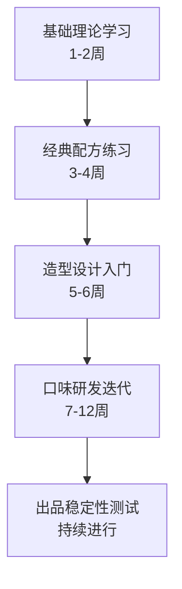
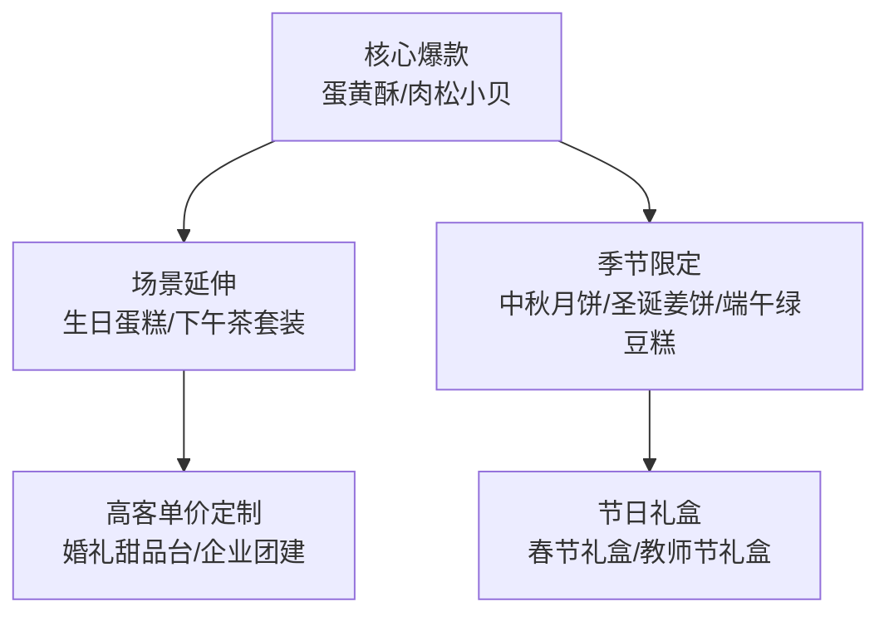
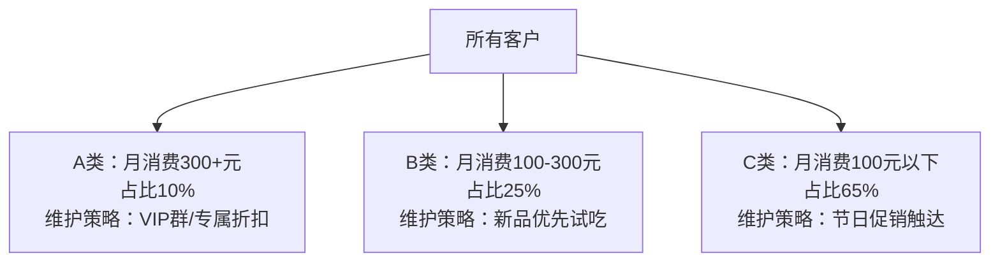
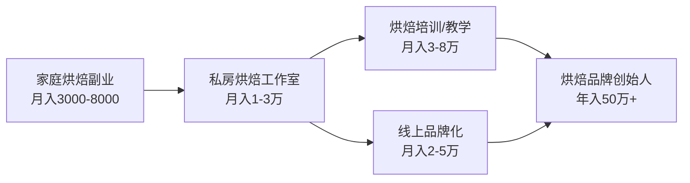

## 案例二：从全职妈妈到月入3万的烘焙创业者李姐

### 案例背景

#### 人物画像

李姐，35岁，坐标二线城市成都，大专学历，曾在外企做行政文员，月薪4500元。2020年怀孕后辞职在家，成为全职妈妈。丈夫是IT工程师，月薪1.2万，家庭月收入勉强覆盖房贷（4800元）、奶粉尿布（1500元）和日常开销，几乎无储蓄。

#### 困境分析

| 维度 | 具体状况 | 影响 |
|------|----------|------|
| 经济压力 | 家庭月结余不足2000元，孩子早教班费用3000元/季度难以承担 | 焦虑感强烈，家庭矛盾增多 |
| 社交隔离 | 全职带娃两年，与职场脱节，老同事联系断了 | 自我价值感持续下降 |
| 技能焦虑 | 原有行政技能市场价值低，年龄增长导致求职竞争力弱 | 担心未来无法重返职场 |
| 时间碎片化 | 孩子白天睡2小时、晚上9点后才有整块时间 | 常规工作模式无法适配 |

#### 为什么选择烘焙

李姐并非盲目选择烘焙，而是经过了系统的需求-能力-市场三维评估：

**需求维度（内部驱动力）：**
- 孩子辅食阶段开始接触烘焙，对食品安全有强烈敏感度
- 丈夫爱吃甜食，家庭本身有烘焙消费场景
- 全职妈妈社群中，烘焙是最容易产生话题和社交资本的技能

**能力维度（已有基础）：**
- 母亲开过早餐店，耳濡目染有基本的厨房操作能力
- 在辅食制作过程中已掌握烤箱基础操作
- 性格细心耐心，适合烘焙这种需要精确配比的工艺

**市场维度（外部验证）：**
- 2021年成都私房烘焙市场规模年增长超30%，市场远未饱和
- 社区妈妈群、业主群有大量生日蛋糕、节日礼盒的需求
- 烘焙创业门槛低：一台家用烤箱（800-3000元）+基本原料即可启动

> **关键判断**：李姐的选择逻辑值得所有副业创业者学习——先从"我有什么"出发，再看"市场要什么"，最后找到两者的交集。这比"什么火做什么"的策略靠谱得多。

---

### 执行过程：四个阶段的完整复盘

#### 第一阶段：技能奠基期（第1-3个月）

**目标：从"能做"到"做好"，建立产品基础能力。**

##### 1. 系统学习而非碎片化试错

李姐没有像大多数人一样直接刷短视频跟着做，而是采用了一套结构化学习路径：



**学习资源选择：**
- **免费层**：下厨房APP、小红书烘焙教程（学基础操作）
- **付费层**：购买了2个线上烘焙课程，总花费680元（学系统理论和配方原理）
- **线下层**：在本地烘焙工作室参加了一次裱花课，费用380元（学手法和细节）

**总计学习投入：1060元**

##### 2. 用"日志法"记录每次出品

李姐准备了一个烘焙笔记本，每次制作都记录：

| 记录项 | 示例 |
|--------|------|
| 日期 | 2021年3月15日 |
| 产品 | 戚风蛋糕 |
| 配方 | 蛋5个/糖60g/低筋面粉85g/玉米油40g/牛奶40g |
| 烤箱温度 | 上火150℃/下火140℃，中层45分钟 |
| 成品评价 | 轻微塌顶，口感偏干 |
| 问题分析 | 蛋白打发过度，出炉未倒扣 |
| 下次改进 | 蛋白打至硬性发泡即停，出炉立即倒扣 |

这个习惯看似简单，却是李姐后来能稳定出品的核心原因。三个月积累了80多条记录，相当于一个个人配方数据库。

##### 3. "免费试吃"验证市场反馈

李姐没有急于卖货，而是先做了两周的免费试吃：
- 第一周：做了6款产品（戚风、曲奇、肉松小贝、蛋黄酥、毛巾卷、杯子蛋糕），每款2-3份
- 分送给邻居、小区妈妈群、丈夫同事
- 收集反馈：用微信群接龙投票"你最想买哪款"

**数据结果：**

| 排名 | 产品 | 得票 | 反馈关键词 |
|------|------|------|------------|
| 1 | 蛋黄酥 | 23票 | "馅料足""不甜腻""比外面好吃" |
| 2 | 肉松小贝 | 19票 | "孩子爱吃""沙拉酱好" |
| 3 | 戚风蛋糕 | 15票 | "松软""不油" |
| 4 | 杯子蛋糕 | 12票 | "造型好看""适合送人" |
| 5 | 曲奇 | 8票 | "酥脆""偏甜" |
| 6 | 毛巾卷 | 6票 | "奶油多""夏天怕化" |

> **决策依据**：蛋黄酥和肉松小贝得票最高，且复购理由明确（"馅料足""孩子爱吃"），确定为初期主打产品。戚风蛋糕作为生日蛋糕的引流款保留。曲奇和毛巾卷暂不上架。

---

#### 第二阶段：冷启动期（第4-6个月）

**目标：从零到1，建立稳定的初期客群。**

##### 1. 定价策略：成本加成+竞品对标

李姐的定价方法论：

**成本计算公式：**
```text
单品售价 = (原料成本 + 包装成本 + 人工时间成本) × 加价系数
其中：人工时间成本 = 制作时长 × 时薪（初期按30元/小时计算）
加价系数：引流款1.8-2.0倍，利润款2.5-3.0倍
```

**核心产品定价表：**

| 产品 | 原料成本 | 包装成本 | 制作时长 | 时薪成本 | 售价 | 毛利率 |
|------|----------|----------|----------|----------|------|--------|
| 蛋黄酥（6枚装） | 12元 | 3元 | 2小时 | 60元 | 38元 | 60.5% |
| 肉松小贝（6个装） | 8元 | 2元 | 1.5小时 | 45元 | 28元 | 64.3% |
| 6寸戚风蛋糕 | 15元 | 5元 | 1.5小时 | 45元 | 58元 | 65.5% |
| 生日蛋糕（6寸裱花） | 25元 | 10元 | 3小时 | 90元 | 128元 | 73.4% |

> **定价智慧**：蛋黄酥定价38元（vs 市场同类45-55元），用性价比打开市场；生日蛋糕定价128元（vs 市场同类150-200元），用定制化和食品安全做差异化。

##### 2. 获客渠道矩阵

李姐采用"三圈获客法"，由内向外逐层渗透：


**核心圈（第1个月）：**
- 在小区业主群发布"家庭烘焙开业优惠"，前10单8折
- 请帮忙试吃的邻居在群里自发推荐
- 第一个月订单：28单，收入1120元

**扩散圈（第2-3个月）：**
- 加入5个本地妈妈群，先做"内容贡献者"（分享育儿辅食烘焙技巧），再适度软性推广
- 制作产品图卡，统一视觉风格（用手机拍摄，统一白色背景+自然光）
- 在小区门口张贴手写海报（成本0元，效果超出预期）
- 第三个月订单：67单，收入2840元

**外延圈（第4-6个月）：**
- 注册小红书账号"李姐的烘焙日记"，每周发布3条笔记
- 内容策略：60%产品展示 + 25%制作过程 + 15%生活感悟
- 爆款笔记《全职妈妈靠蛋黄酥月入3000+》获赞1200+，带来大量私信咨询
- 开始接生日蛋糕定制订单，客单价显著提升

**冷启动期数据汇总：**

| 月份 | 订单数 | 营收 | 客户数 | 复购率 |
|------|--------|------|--------|--------|
| 第4个月 | 42单 | 1860元 | 28人 | - |
| 第5个月 | 58单 | 2650元 | 39人 | 35% |
| 第6个月 | 73单 | 3280元 | 48人 | 42% |

---

#### 第三阶段：增长期（第7-15个月）

**目标：从月入3000到月入3万，实现规模化运营。**

##### 1. 产品线扩展策略

李姐没有盲目扩张品类，而是采用"树状延伸法"：



**产品线扩展时间表：**

| 时间节点 | 新增产品 | 推出动因 | 效果 |
|----------|----------|----------|------|
| 第7个月 | 生日蛋糕定制 | 客户主动询问 | 客单价从32元提升到128元 |
| 第9个月 | 下午茶4人套餐 | 办公室下午茶场景 | 企业订单占比15% |
| 第10个月 | 中秋蛋黄酥礼盒 | 季节性爆发 | 单月新增营收8000元 |
| 第12个月 | 婚礼甜品台 | 朋友婚礼合作 | 单笔订单2000-5000元 |
| 第14个月 | 企业下午茶年卡 | 复购客户升级 | 锁定3家企业长期合作 |

##### 2. 流程优化：从"一个人做所有事"到"系统化生产"

随着订单增长，李姐的生产流程经历了三次重大优化：

**第一次优化（第7个月）：批量化生产**
- 问题：每天做10+款不同产品，频繁切换导致效率低下
- 方案：实行"主题日"制度
  - 周一/周四：蛋黄酥日（批量制作，当天做50+枚）
  - 周二/周五：肉松小贝/蛋糕日
  - 周三：生日蛋糕定制日
  - 周六：接单+配送日
  - 周日：休息+采购原料

**第二次优化（第10个月）：半成品预制**
- 问题：蛋黄酥酥皮制作耗时最长（揉面+醒面+开酥共需3小时）
- 方案：周末集中预制酥皮和馅料，冷藏保存，工作日只需包制+烘烤
- 效果：单次制作时间从3小时缩短到1.5小时，日产能翻倍

**第三次优化（第13个月）：工具升级**
- 购入商用级设备：

| 设备 | 投入 | 产出提升 |
|------|------|----------|
| 商用烤箱（40L双层） | 2800元 | 日产量从30份提升到80份 |
| 厨师机（和面/打蛋） | 1500元 | 节省每日2小时体力劳动 |
| 食品真空包装机 | 380元 | 产品保质期延长，可支持快递 |
| 冷藏展示柜 | 1200元 | 拍照/摆摊时展示效果好 |

**设备总投入：5880元，约1.5个月即可回本。**

##### 3. 客户运营体系

李姐建立了自己的客户管理方法论：

**客户分层模型：**



**核心运营动作：**

1. **微信群运营**：建了3个群（小区群/妈妈群/VIP群），每日发布制作过程短视频（15秒），营造"看得见的新鲜感"
2. **复购激励**：累计消费满500元升级VIP，享9折+新品免费试吃
3. **转介绍机制**：老客户推荐新客户，双方各得一份小点心（成本约5元）
4. **节日营销**：提前2周在群内发起接龙预订，制造紧迫感

**复购率变化曲线：**

| 阶段 | 复购率 | 关键动作 |
|------|--------|----------|
| 第4-6个月 | 35-42% | 产品品质驱动 |
| 第7-9个月 | 50-55% | VIP体系建立 |
| 第10-12个月 | 58-63% | 节日礼盒拉动 |
| 第13-15个月 | 65-68% | 企业客户锁定 |

---

#### 第四阶段：稳定期（第16个月至今）

**目标：月入稳定3万+，工作生活平衡。**

##### 收入结构拆解

| 收入来源 | 月均金额 | 占比 | 稳定性 |
|----------|----------|------|--------|
| 日常零售（蛋黄酥/小贝/曲奇） | 12000元 | 40% | 高 |
| 生日蛋糕定制 | 6000元 | 20% | 中 |
| 企业下午茶/团建订单 | 5000元 | 17% | 高 |
| 节日礼盒（季节性均摊） | 4000元 | 13% | 波动 |
| 甜品台/婚礼定制 | 3000元 | 10% | 低 |
| **月均总收入** | **30000元** | **100%** | - |

##### 成本结构

| 成本项 | 月均金额 | 占收入比 |
|--------|----------|----------|
| 原料采购 | 7500元 | 25% |
| 包装耗材 | 1500元 | 5% |
| 设备折旧 | 300元 | 1% |
| 配送/交通 | 800元 | 2.7% |
| 营销推广 | 500元 | 1.7% |
| **月均总成本** | **10600元** | **35.3%** |
| **月均净利润** | **19400元** | **64.7%** |

> **对比参考**：李姐之前做行政文员月薪4500元，现在净利润19400元，是原来的4.3倍。更重要的是，她能兼顾带娃，工作时间完全自主安排。

---

### 成果数据全景

| 指标 | 起步时（第1个月） | 半年后 | 一年后 | 成熟期（第16个月+） |
|------|-------------------|--------|--------|---------------------|
| 月收入 | 1120元 | 3280元 | 18000元 | 30000元 |
| 月净利润 | 680元 | 1950元 | 11200元 | 19400元 |
| 客户总数 | 20人 | 48人 | 220人 | 380人 |
| 月订单数 | 28单 | 73单 | 280单 | 450单 |
| 复购率 | - | 42% | 63% | 68% |
| 日均工作时长 | 3小时 | 4小时 | 5小时 | 5小时 |
| 小红书粉丝 | 0 | 800 | 5200 | 12000 |

---

### 经验总结：六条可复制的方法论

#### 方法论一：先验证再投入

李姐最大的智慧在于"不急"。很多人一上来就花几千块买设备、租场地，结果做了两个月发现卖不动。李姐的做法是：
- 花1000元学习 → 免费试吃验证 → 获得第一批订单 → 用利润再投入
- 整个冷启动阶段，总投入不超过2000元

#### 方法论二：产品为王，不追求多而追求精

李姐的SKU长期控制在8-12个，核心爆款只有3个（蛋黄酥、肉松小贝、生日蛋糕）。她的原则是：
- 一个新品必须经过至少20次试做、10人以上试吃反馈，才能上架
- 如果一个产品月销量低于10份，果断下架
- 每个季度只新增1-2个产品，同时淘汰1个表现差的

#### 方法论三：用内容建立信任，而非用广告获客

李姐的小红书从不硬广，核心内容策略是：
- **制作过程透明化**：让客户看到原料、看到制作环境，建立食品安全信任
- **真实生活共鸣**：分享带娃和创业的日常，让客户觉得"她和我一样"
- **客户好评晒单**：定期转发客户反馈，形成社交证明

> 这种"内容获客"模式的获客成本几乎为零，但需要持续投入时间。李姐每天花30分钟拍视频、写文案，长期坚持下来效果远超付费推广。

#### 方法论四：把客户变成"朋友"而非"流量"

李姐记得每个VIP客户的口味偏好（张姐不吃奶油、王姐儿子花生过敏、赵姐喜欢少糖），这种个性化服务是大型烘焙店无法提供的。她在客户管理系统中记录的信息包括：

| 字段 | 用途 |
|------|------|
| 姓名/称呼 | 沟通称呼 |
| 所在小区 | 配送路线规划 |
| 口味偏好 | 推荐产品时参考 |
| 过敏信息 | 食品安全保障 |
| 生日/纪念日 | 提前提醒定制蛋糕 |
| 累计消费额 | VIP等级判定 |
| 上次购买日期 | 复购提醒触发点 |

#### 方法论五：从副业到事业的心态转变

李姐在第10个月时注册了个体工商户（营业执照+食品经营许可证），这个转变至关重要：
- 合法经营才能进入企业采购渠道
- 有执照才能上外卖平台和小程序
- 食品经营许可证是客户信任的基础门槛

**注册流程和费用：**
- 个体工商户营业执照：免费，3个工作日
- 食品经营许可证（小作坊备案）：免费，需现场核查
- 健康证：体检费约80元
- 总计花费：80元，用时约2周

#### 方法论六：设置收入天花板，拒绝无限扩张

当订单多到接不过来时，李姐面临两个选择：雇人扩张 or 控制规模。她选择了后者，原因是：
- 雇人意味着管理成本、培训成本、品质失控风险
- 她的核心竞争力是"家庭手作"的温度感，规模化会稀释这个价值
- 月入3万已经是她的时间-收入最优平衡点

她的做法是：
- 设定每月接单上限（450单左右）
- 超出产能时优先服务VIP客户
- 适当提价来过滤价格敏感客户，提升利润质量

---

### 常见误区与避坑指南

| 误区 | 正确做法 | 李姐踩过的坑 |
|------|----------|--------------|
| 一上来就买最贵的设备 | 先用家用设备验证需求，有稳定订单再升级 | 第2个月冲动买了裱花转台，结果3个月后才发现自己更擅长做中式点心 |
| 定价靠"感觉" | 必须计算完整成本（含时间成本），再参考竞品定价 | 初期定价过低，做了两个月发现"越忙越不赚钱" |
| 什么都做，SKU越多越好 | 聚焦3-5个核心产品，做到极致再扩展 | 第5个月同时上架12款产品，结果每款都做不精 |
| 只在朋友圈发广告 | 内容营销（教程/过程/故事）+ 社群运营 | 初期每天在朋友圈刷屏发产品图，被多人屏蔽 |
| 不办证照"省事" | 尽早办理营业执照和食品经营许可 | 第8个月被同行举报无证经营，差点被罚款 |
| 来者不拒，什么单都接 | 筛选客户，拒绝不合理要求 | 接过一单婚礼甜品台，客户临时改方案3次，亏了500元 |

---

### 进阶思考：从个人案例到可复制模型

#### 烘焙副业适配性自检表

想复制李姐的路径？先回答以下问题：

| 检查项 | 达标标准 | 权重 |
|--------|----------|------|
| 每天可投入时间 | ≥2小时碎片时间 | ★★★ |
| 厨房基础能力 | 能独立完成戚风蛋糕 | ★★★ |
| 所在城市人口 | 二线及以上城市为佳 | ★★ |
| 社交圈层 | 有50人以上的本地社交群 | ★★★ |
| 初始投入预算 | 可承受2000元以内试错 | ★★ |
| 抗压能力 | 能接受前3个月几乎不赚钱 | ★★★ |

**评分标准：** 6项中至少4项达标，才建议启动烘焙副业。

#### 不同城市的启动策略差异

| 维度 | 一线城市 | 二三线城市 | 县城/乡镇 |
|------|----------|------------|-----------|
| 客单价 | 较高（50-150元） | 中等（30-80元） | 较低（20-50元） |
| 竞争强度 | 激烈，需要差异化 | 适中，机会较多 | 低，蓝海市场 |
| 核心获客渠道 | 小红书/大众点评 | 微信群/小区业主群 | 熟人推荐/赶集摆摊 |
| 建议主打产品 | 高颜值西点/低糖健康款 | 生日蛋糕/节日礼盒 | 传统糕点/性价比爆款 |
| 物流配送 | 可接入外卖平台 | 自配送为主 | 自配送/自提为主 |

#### 烘焙创业的长期进化路径



李姐目前处于B阶段（私房烘焙工作室），下一步的进阶方向包括：
- **烘焙培训**：将自己的一套方法论包装成课程，面向其他想做副业的全职妈妈
- **线上品牌化**：开发标准化产品（如冷冻蛋黄酥半成品），通过快递覆盖全国
- **私域电商**：将380个客户转化为烘焙原料/工具的分销渠道

> **核心启示**：李姐的成功不是因为她有多高的烘焙天赋，而是因为她用正确的方法论（验证→聚焦→迭代→系统化）把一个普通技能变成了可持续的收入来源。这个方法论适用于任何技能型副业——写作、摄影、手工、健身教练、家教辅导……底层逻辑都是一样的：**找到你擅长的事，验证市场愿意付费，然后用系统化的方式交付价值。**
