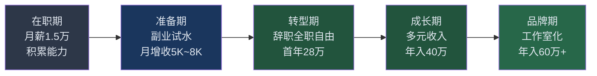
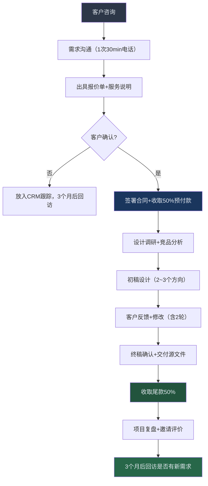
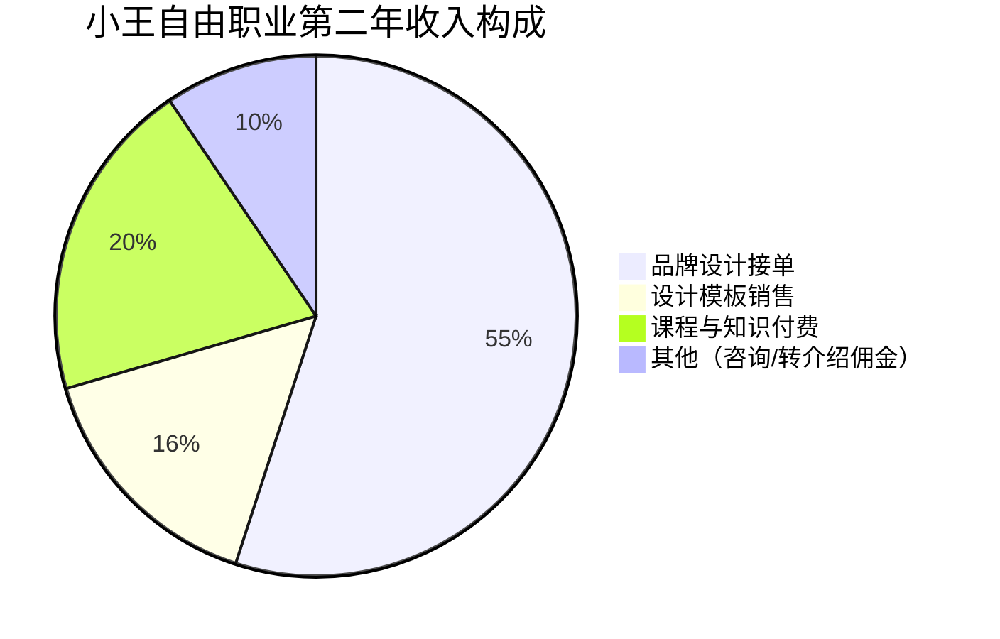
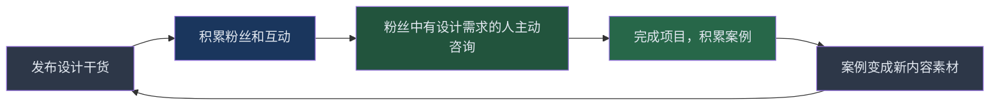

## 案例三：从月薪1.5万到自由职业年入40万的设计师小王

### 案例概览

小王的故事是"创意型人才通过系统化转型实现自由职业收入跃迁"的典型案例。她没有海归背景，没有4A广告公司经历，毕业于一所普通一本的视觉传达设计专业，在一家中型互联网公司做了三年UI设计师后，选择了一条大多数设计师想走却不敢走的路——全职自由职业。从月薪1.5万的"稳定工作"，到自由职业第一年收入28万、第二年突破40万，她用了不到两年时间完成了从"公司螺丝钉"到"独立设计品牌"的蜕变。

这个案例的核心价值在于：**自由职业不是"辞职接单"那么简单，而是一套完整的商业系统搭建过程。** 小王的成功不靠运气，靠的是转型前18个月的系统准备、清晰的商业模型设计和持续的个人品牌投资。

**基本信息一览：**

| 维度 | 初始状态（2020年） | 转型准备期（2021年） | 自由职业第1年（2022年） | 自由职业第2年（2023年） |
|------|---------------------|----------------------|--------------------------|--------------------------|
| 年龄 | 25岁 | 26岁 | 27岁 | 28岁 |
| 身份 | UI设计师（在职） | UI设计师+副业接单 | 全职自由设计师 | 独立设计工作室主理人 |
| 月收入 | 15,000元 | 15,000+5,000~8,000元 | 约23,000元 | 约33,000元 |
| 年收入 | 约20万（含年终） | 约25万 | 约28万 | 约40万 |
| 客户数 | 0（公司内部） | 3~5个零散客户 | 12个稳定客户 | 20+客户（含2个长期retainer） |
| 收入结构 | 单一工资 | 工资+零散接单 | 自由接单为主 | 接单+课程+模板销售 |
| 工作时间 | 996 | 白天上班+晚上/周末副业 | 自主安排（约6小时/天） | 自主安排（约5小时/天） |

### 时间线与收入增长轨迹

### 第一阶段：在职积累期（2020年，月薪1.5万）

#### 背景与处境

2020年，小王在一家200人规模的互联网公司担任UI设计师，负责公司旗下两款App的界面设计和品牌物料输出。月薪15,000元，加上年终奖约2个月，年收入约20万。工作内容逐渐变成重复性的需求对接——产品经理提需求，小王出图，开发还原，周而复始。

小王面临的核心困境是大多数设计师都会遇到的"三重天花板"：

1. **薪资天花板**：UI设计师在非一线城市，月薪1.5万~2万基本就是上限，除非转向管理岗或进入大厂
2. **成长天花板**：日常工作以执行为主，缺乏品牌策略、用户研究等高阶能力的锻炼机会
3. **价值天花板**：在公司体系内，设计师的产出被视为"成本"而非"投资"，话语权有限

小王意识到：**如果继续在公司体系内按部就班，五年后她依然是一个月薪2万的执行层设计师，而市场上的应届生只需要8000元就能做同样的事。**

#### 核心策略：在公司"偷师学艺"

小王没有立刻辞职，而是用在职身份做了三件关键的事：

**1. 系统梳理自己的技能树**

小王用一周时间，把自己的设计能力拆解为一个技能矩阵：

| 技能维度 | 当前水平 | 市场需求度 | 自由职业变现潜力 |
|----------|----------|------------|-------------------|
| UI界面设计 | ★★★★☆ | 高 | ★★★☆☆（竞争激烈，价格内卷） |
| 品牌视觉设计（Logo/VI） | ★★★☆☆ | 高 | ★★★★★（溢价空间大） |
| 运营设计（Banner/海报） | ★★★★☆ | 高 | ★★☆☆☆（单价低，量大） |
| 插画设计 | ★★☆☆☆ | 中高 | ★★★★☆（差异化强） |
| 3D视觉设计 | ★☆☆☆☆ | 上升中 | ★★★★★（稀缺性高） |
| 动效设计 | ★★☆☆☆ | 中高 | ★★★★☆（附加价值高） |
| Figma/Sketch组件库搭建 | ★★★★☆ | 中 | ★★★☆☆（可产品化） |
| 用户研究/体验优化 | ★★☆☆☆ | 高 | ★★★★★（咨询属性，溢价极高） |

**分析结论：** 纯UI执行设计的自由职业溢价空间有限，客户容易比价。必须向"策略层"（品牌设计、用户体验）和"稀缺层"（3D视觉、动效）延伸，才能建立定价权。

**2. 在公司内部主动争取高价值项目**

小王采取了和案例一小陈类似的策略——**主动承接没人愿意做或做不好的高价值任务：**

- 公司品牌升级项目：主动请缨参与品牌视觉焕新，借此学习品牌设计的完整流程（品牌调研→品牌定位→视觉语言→落地规范）
- 产品改版中的用户调研：不是等产品经理给设计稿，而是自己做用户访谈和可用性测试，用数据支撑设计方案
- 公司宣传视频的动效设计：自学After Effects，为公司制作产品宣传动效，积累了第一批动效作品

**3. 建立设计作品的"个人版权意识"**

小王在公司项目中会额外做两个动作：

- **脱敏版作品集**：在不泄露公司商业机密的前提下，整理项目的视觉展示版，用于未来个人作品集（提前和主管沟通获得许可）
- **方法论文档化**：每个项目结束后，整理设计思路、决策过程、效果数据，形成完整的案例描述——这是自由设计师报价的核心筹码

#### 阶段成果

| 指标 | 年初 | 年末 |
|------|------|------|
| 薪资 | 15,000元/月 | 15,000元/月（未跳槽） |
| 新增可展示作品集 | 0 | 8个完整项目案例 |
| 方法论文档 | 0 | 12篇设计方法论笔记 |
| 新增技能 | 无 | 品牌设计入门、AE动效基础、用户调研基础 |
| 副业收入 | 0 | 0（本阶段专注积累） |

### 第二阶段：副业试水期（2021年，月增收5,000~8,000元）

#### 转型前的"最小可行性测试"

小王没有盲目辞职，而是先用业余时间测试市场的反应。这个阶段的核心目标是：**验证"我的设计能力在自由市场上值多少钱"，以及"我能否持续获取客户"。**

#### 渠道搭建：从零开始获取客户

小王用了三个月时间，搭建了四个获客渠道：

**渠道一：设计平台接单（低门槛启动）**

| 平台 | 入驻方式 | 平均客单价 | 特点 |
|------|----------|------------|------|
| 猪八戒网 | 注册认证 | 500~3,000元 | 量大但竞争激烈，比价严重 |
| 站酷 | 发布作品+接单 | 2,000~8,000元 | 设计师社区，客户质量较高 |
| 特赞 | 申请入驻 | 5,000~20,000元 | 品牌客户为主，门槛较高 |
| 小红书/朋友圈 | 内容引流 | 3,000~15,000元 | 信任度高，转化率最好 |

**小王的策略：** 不在猪八戒上打价格战，而是用站酷和小红书做"内容获客"——发布设计过程拆解、改版前后对比、设计趋势分析等内容，吸引有设计需求的客户主动联系。

**渠道二：设计师社群与圈子**

小王加入了3个高质量的设计师付费社群（年费500~2000元），这些社群的价值不在于"学技术"，而在于：

- 群内经常有"溢出需求"——大公司设计师忙不过来时会把小单子转给群友
- 群主会定期组织供需对接，相当于一个小型设计经纪人
- 同行之间的转介绍是自由设计师最优质的客户来源（信任成本最低）

**渠道三：老东家和前同事转介绍**

小王离职前就和主管、产品同事保持了良好关系。她做了一件很聪明的事：**离职前主动帮公司培养了一个接替她的设计师，并整理了完整的设计规范文档。** 这让前东家在她离职后依然对她心存感激，后来多次把公司溢出的设计需求介绍给她。

**渠道四：垂直领域精准获客**

小王发现，与其做"什么都能做"的通才设计师，不如聚焦某个垂直领域成为专家。她选择了"新消费品牌视觉设计"作为切入点：

- 新消费品牌（奶茶、咖啡、零食、护肤等）正处于爆发期，品牌设计需求旺盛
- 这类客户预算中等（5,000~30,000元/单），但决策快、复购率高
- 一旦做出一个成功案例，同品类客户会自动找上门

#### 定价策略：从"按工时"到"按价值"

小王在试水期犯过一个典型错误——按工时报价：

| 错误定价方式 | 问题 |
|-------------|------|
| "这个Logo设计大概需要3天，每天500元，总共1500元" | 客户会觉得"你3天就值1500？"，实际上可能3天做完是因为你经验丰富 |
| "改一版加200元" | 导致客户无限修改，因为"反正加200就行" |

后来小王切换到**价值定价法**：

| 定价项目 | 报价范围 | 定价逻辑 |
|----------|----------|----------|
| 品牌Logo设计 | 5,000~15,000元 | 按品牌阶段：初创品牌5K，成长品牌10K，升级品牌15K |
| 品牌VI系统 | 15,000~50,000元 | 按应用场景数量和复杂度 |
| App/小程序UI设计 | 20,000~80,000元 | 按页面数量和交互复杂度 |
| 运营设计（月度retainer） | 5,000~15,000元/月 | 固定月费，包含N张图+N次修改 |
| 设计咨询（品牌诊断） | 3,000~8,000元/次 | 2~4小时深度诊断+报告 |

**价值定价的核心话术：** "我们的报价不是按天数计算的，而是基于这个设计能为您的品牌带来的价值。一个好的品牌视觉系统可以帮助您在招商、融资、获客等场景中建立信任感，这远超过设计本身的成本。"

#### 副业期的收入数据

| 月份 | 接单数 | 月收入 | 主要项目类型 |
|------|--------|--------|-------------|
| 第1~2月 | 1单 | 3,000元 | Logo设计（朋友介绍） |
| 第3~4月 | 2单 | 6,500元 | Logo+名片+基础VI |
| 第5~6月 | 3单 | 9,000元 | 品牌设计+运营图 |
| 第7~9月 | 4~5单 | 12,000~15,000元 | 品牌全案+UI设计 |
| 第10~12月 | 3~4单 | 10,000~18,000元 | 品牌设计为主 |

**副业年收入约8~10万，月均约7,500元。** 加上主业工资，年总收入约28万。

#### 阶段关键决策：什么时候辞职？

小王在试水期满6个月时，用以下标准评估是否可以辞职：

| 评估维度 | 达标标准 | 小王实际情况 | 是否达标 |
|----------|----------|-------------|----------|
| 副业月收入稳定在主业50%以上 | 7,500元/月 | 月均7,500元 | ✅ |
| 连续3个月有稳定客户来源 | 不低于3个/月 | 3~5个/月 | ✅ |
| 存款覆盖6个月生活开支 | 6×8,000=48,000元 | 存了7万 | ✅ |
| 至少2个客户有复购意向 | 口头或书面确认 | 3个客户明确表示有后续需求 | ✅ |
| 家庭/伴侣支持 | 无重大反对 | 男友支持（同为自由职业者） | ✅ |

**五项全部达标后，小王在2021年底正式提出辞职。**

### 第三阶段：全职自由职业第一年（2022年，年入28万）

#### 辞职后的前三个月：生存期

自由职业的第一个月是心理冲击最大的时期。小王描述："以前月薪1.5万是铁定到账的，现在每天醒来第一件事是看手机有没有新客户消息。没有消息的日子，焦虑感会吞噬你。"

**生存期的核心策略：**

**1. 建立"收入安全垫"**

小王给自己设定了一个硬性规则：**副业收入连续3个月低于1.5万就重新找工作。** 这个底线让她不至于在焦虑中做出错误决策（比如接大量低价单把自己累垮）。

**2. 用"时间块"管理代替"朝九晚五"**

| 时间段 | 内容 | 说明 |
|--------|------|------|
| 9:00~10:00 | 回复消息、处理行政 | 客户沟通、报价、合同、发票 |
| 10:00~12:30 | 深度设计工作 | 核心产出时间，关闭所有消息 |
| 12:30~14:00 | 午餐+休息 | 必须休息，否则下午效率暴跌 |
| 14:00~16:30 | 深度设计工作 | 第二个核心产出时间块 |
| 16:30~17:30 | 客户沟通、修改反馈 | 集中处理修改意见 |
| 17:30~18:30 | 内容输出、个人品牌 | 写小红书、更新作品集、维护社群 |
| 晚上 | 不工作 | 保护精力，避免自由职业变成007 |

**3. 建立标准化的服务流程**

小王意识到，自由职业不是"一个人做所有事"，而是"一个人运营一家公司"。她设计了标准化的项目流程：

**关键细节：**

- **必须收预付款**：小王曾经遇到过做完设计客户"消失"的情况，损失了近万元。从此50%预付款成为铁律
- **合同模板**：使用专业设计服务合同，明确修改次数、交付标准、版权归属、延期条款
- **修改次数限制**：标准报价含2轮修改，超出部分按200元/次计费。这不是"斤斤计较"，而是保护双方权益

#### 收入结构分析（第一年）

| 收入来源 | 月均收入 | 年收入 | 占比 |
|----------|----------|--------|------|
| 品牌设计项目（Logo/VI） | 12,000元 | 144,000元 | 51% |
| UI/UX设计项目 | 6,000元 | 72,000元 | 26% |
| 运营设计retainer（月度客户） | 4,000元 | 48,000元 | 17% |
| 设计咨询 | 1,200元 | 14,400元 | 5% |
| 其他（模板销售等） | 400元 | 4,800元 | 2% |
| **合计** | **约23,600元** | **约283,000元** | **100%** |

#### 第一年的关键教训

**教训一：不要用低价换客户**

自由职业初期，小王犯过一个错误：为了"不丢单"，把一个品牌VI项目从报价2万降到了1.2万。结果客户反而质疑她的专业度——"你降价这么痛快，说明你之前的报价有水分"。

**正确做法：** 宁可丢掉一个低价客户，也不要用低价破坏自己的定价体系。如果客户预算确实不够，可以缩减服务范围（比如只做Logo不做全套VI），而不是打折。

**教训二：警惕"大客户依赖症"**

小王在年中接了一个甲方的大项目（8万元，持续2个月），这段时间她没有精力开发其他客户。项目结束后，收入断崖式下跌。

**应对方案：** 单一客户收入不超过月总收入的40%；在大项目期间也要维护老客户关系，每周至少花2小时在客户开发上。

**教训三：自由职业需要"带薪假期"思维**

小王第一个全年无休地工作了11个月，到第12月时身心俱疲，做出来的设计质量明显下降。她后来学会了给自己"放假预算"——每个月预留2天作为休息日，即使那天"少赚了1000元"，但换来的是长期的可持续产出。

### 第四阶段：收入突破期（2023年，年入40万）

#### 从"接单"到"产品化"的转型

自由职业第二年，小王意识到一个关键瓶颈：**纯接单模式的收入天花板是"时间×单价"。** 一天只有那么多工作小时，单价也不可能无限提高。要突破40万年收入，必须引入"可规模化"的收入来源。

#### 收入来源一：高端品牌设计接单（年收入约22万）

经过第一年的口碑积累，小王的客户质量明显提升：

| 维度 | 第一年 | 第二年 |
|------|--------|--------|
| 平均客单价 | 8,000元 | 15,000元 |
| 月均接单量 | 3单 | 2单（减少数量，提升质量） |
| 客户来源 | 平台接单为主（60%） | 转介绍为主（70%） |
| 复购率 | 30% | 55% |
| 客户行业 | 零散 | 聚焦新消费+科技 |

**客单价提升的核心原因：**

1. **作品集升级**：有了10+个高质量的完整案例，每个案例都有"设计思路→竞品分析→方案推导→落地效果"的完整叙事
2. **行业聚焦带来的溢价**：当小王在新消费品牌领域积累了5个成功案例后，同品类客户愿意付更高的价格——因为"你懂我们行业"
3. **报价心态转变**：从"怕客户觉得贵"到"我值这个价"。小王现在报价时会附上一份"价值说明"，解释设计方案如何帮助客户在招商会、融资路演等场景中建立品牌信任

#### 收入来源二：设计模板与素材销售（年收入约6万）

小王把自己做项目过程中积累的设计资源产品化：

| 产品 | 定价 | 年销量 | 年收入 |
|------|------|--------|--------|
| 新消费品牌VI模板包（站酷/小红书） | 299元/套 | 80套 | 23,920元 |
| Figma品牌设计组件库 | 199元/套 | 120套 | 23,880元 |
| 设计提案PPT模板 | 99元/套 | 150套 | 14,850元 |
| **合计** | — | — | **约62,650元** |

**模板销售的关键策略：**

- **选题来自真实项目**：不做"为了卖而做的模板"，而是把做得好的项目抽象成可复用的模板
- **定价锚定**：对标同类产品定价，但提供更多的场景示例和使用说明
- **持续更新**：每季度更新一次，老客户免费升级，新客户看到"最近更新"会更有购买意愿

#### 收入来源三：设计课程与知识付费（年收入约8万）

小王在小红书积累了1.2万粉丝后，开始做知识付费产品：

| 产品 | 平台 | 定价 | 销量 | 收入 |
|------|------|------|------|------|
| "品牌设计师入门到接单"录播课 | 小鹅通 | 399元 | 100人 | 39,900元 |
| "设计提案与客户沟通"小课 | 小红书专栏 | 99元 | 200人 | 19,800元 |
| 设计师1v1咨询（月度） | 微信 | 500元/次 | 约40次 | 20,000元 |
| **合计** | — | — | — | **约79,700元** |

**课程制作的核心方法论：**

小王没有从零写课程，而是复用了"三步转化法"：

1. **第一步：小红书内容测试** — 先发一系列设计干货笔记，观察哪类内容互动率最高
2. **第二步：深度文章验证** — 把互动最高的3个主题写成深度长文，看是否有读者主动问"有没有课程"
3. **第三步：课程制作上架** — 只有当"主动问课程"的人超过10个时，才投入精力做课程

这个方法确保了课程的市场需求是被验证过的，而不是"自嗨型"产品。

#### 第二年收入结构全景

| 收入来源 | 年收入 | 占比 | 性质 | 每周投入时间 |
|----------|--------|------|------|-------------|
| 品牌设计接单 | 220,000元 | 55% | 主动收入 | 约20小时 |
| 设计模板销售 | 62,000元 | 15.5% | 被动收入 | 约2小时（维护更新） |
| 课程与知识付费 | 80,000元 | 20% | 半被动收入 | 约3小时（答疑+更新） |
| 其他 | 38,000元 | 9.5% | 混合 | 约2小时 |
| **合计** | **400,000元** | **100%** | — | **约27小时/周** |

**关键数据：** 小王每周实际工作约27小时，日均5.4小时。相比在职时的996，工作时间减少了一半，但收入翻了一倍。这就是自由职业的核心价值——**用效率换自由，用专业换溢价。**

### 关键成功因素深度分析

#### 因素一：转型前的"安全期"准备（18个月）

小王没有冲动辞职，而是用了整整18个月做准备。这18个月被分为三个阶段：

| 阶段 | 时间 | 核心任务 | 成果 |
|------|------|----------|------|
| 能力补齐 | 第1~6个月 | 学习品牌设计、动效、用户调研 | 技能矩阵全面升级 |
| 副业验证 | 第7~12个月 | 接单测试市场反应，搭建获客渠道 | 月均副业收入7,500元 |
| 辞职准备 | 第13~18个月 | 存够6个月生活费、建立合同模板、培育种子客户 | 五项辞职标准全部达标 |

**这个"安全期"的价值在于：** 即使自由职业失败，小王也不会陷入经济困境。有退路的人反而更能做出理性决策。

#### 因素二：从"通才"到"专家"的聚焦策略

小王在转型初期犯过一个错误——什么设计都做。结果是：

- 每个领域都是"还行"，没有一个是"顶尖"
- 客户选择她只是因为"便宜"，而不是"专业"
- 无法形成口碑传播——"她做什么的？""什么都做吧"，这种描述无法转介绍

聚焦新消费品牌设计后，效果立竿见影：

| 聚焦前后对比 | 聚焦前 | 聚焦后 |
|-------------|--------|--------|
| 客户选择理由 | "价格合适" | "你做过很多新消费品牌，懂我们" |
| 平均客单价 | 5,000~8,000元 | 12,000~20,000元 |
| 客户转介绍率 | 15% | 45% |
| 同行竞争压力 | 大（通才太多） | 小（垂直专家稀缺） |
| 作品集叙事 | 零散 | 聚焦有力 |

#### 因素三：内容营销的"飞轮效应"

小王在小红书的内容营销形成了一个正向循环：

**小王的小红书内容策略：**

| 内容类型 | 频率 | 目的 | 示例 |
|----------|------|------|------|
| 设计改版对比（Before/After） | 每周1篇 | 展示专业能力，互动率最高 | "帮一个奶茶店重新设计了品牌，老板说客人多了一倍" |
| 设计过程拆解 | 每两周1篇 | 建立专业深度 | "一个Logo从草图到定稿的完整过程" |
| 设计趋势/行业观察 | 每月1篇 | 建立行业影响力 | "2023年新消费品牌设计的5个趋势" |
| 自由职业经验分享 | 每月1篇 | 吸引同行关注+潜在客户 | "自由设计师如何定价？我的3年经验" |

#### 因素四：现金流管理的"三个账户"体系

自由职业最大的风险不是"没有能力"，而是"现金流断裂"。小玛建立了一个严格的资金管理体系：

| 账户 | 用途 | 月存入比例 | 最低余额 |
|------|------|-----------|----------|
| 运营账户 | 日常接单成本（软件订阅、素材购买、差旅） | 15% | 5,000元 |
| 生活账户 | 个人生活开支（房租、餐饮、交通） | 50% | 按实际需要 |
| 安全账户 | 应急储备（6个月生活费） | 20% | 60,000元（达标后可减少存入） |
| 发展账户 | 学习投资、设备升级、课程制作 | 15% | 10,000元 |

**关键规则：** 每笔项目收入到账后，先按比例分配到四个账户，再从生活账户中支取生活费。这避免了"收入到手就花光"的陷阱。

### 自由职业设计师的工具箱

小王日常使用的工具栈（按功能分类）：

| 功能 | 工具 | 费用 | 说明 |
|------|------|------|------|
| 设计工具 | Figma（主力）+ Adobe全家桶 | 约300元/月 | Figma用于UI/品牌，PS/AI用于精细化处理 |
| 项目管理 | Notion | 免费 | 管理项目进度、客户信息、收入记录 |
| 合同签署 | e签宝/法大大 | 按份计费 | 电子合同，具有法律效力 |
| 发票与财务 | 自然人电子税务局+记账App | 免费/低价 | 月度开票、年度汇算清缴 |
| 客户沟通 | 微信+腾讯会议 | 免费 | 微信日常沟通，腾讯会议远程提案 |
| 内容创作 | Canva+剪映 | 免费/低价 | 小红书封面、短视频制作 |
| 作品集 | 个人网站（Notion/WordPress） | 约500元/年 | 展示案例和客户评价 |
| 文件管理 | 坚果云+百度网盘 | 约200元/年 | 项目文件同步和交付 |

### 常见误区与避坑指南

**误区一："自由职业=想什么时候工作就什么时候工作"**

真相：自由职业的"自由"指的是你可以选择**在哪里工作、为谁工作、做什么项目**，而不是"不工作"。小王每天至少工作5小时，而且是高度专注的5小时——因为没有老板盯着你，自律反而比上班时更重要。

**误区二："只要有好作品就能获得客户"**

真相：好作品只是基础，获客能力才是自由职业的命脉。小王见过很多比她技术更好的设计师，因为不懂营销、不懂沟通、不懂定价，自由职业半年后灰溜溜回去上班了。**自由职业者既是设计师，也是销售、客服、财务和CEO。**

**误区三："辞职后再开始准备"**

真相：辞职后没有收入来源，焦虑会让你做出很多错误决策——比如疯狂接低价单"先活下来"，或者把所有时间花在找客户上而没有时间提升作品质量。小王18个月的"在职准备期"是她成功的关键前提。

**误区四："自由职业不需要社保和税务规划"**

真相：自由职业者需要自己缴纳社保（以灵活就业身份），需要自行申报个税。小王在第一年因为没有做好税务规划，多缴了近8000元的税。建议自由职业者：

- 在当地社保局办理灵活就业社保（养老+医疗）
- 了解个人所得税的"经营所得"申报方式（比劳务报酬税率更优）
- 年收入超过一定额度时，考虑注册个体工商户或个人独资企业

**误区五："接到大项目就等于赚到大钱"**

真相：大项目的风险也大。小王接过一个3万元的品牌全案，客户修改了8轮，项目周期从1个月拖到3个月，实际时薪不到100元。**项目越大，越要在合同中明确交付标准、修改次数和延期条款。**

### 进阶思考：从设计师到设计品牌

小王的故事还在继续。2024年，她开始探索"工作室化"的路径——不再是一个人接单，而是组建一个2~3人的小团队，承接更大的品牌全案项目。

这个方向的核心逻辑是：

1. **从"卖时间"到"卖团队"**：一个人一天最多产出8小时，但一个团队可以并行处理多个项目
2. **从"执行者"到"策略者"**：小王逐渐从"亲自做设计"转向"把控设计方向+管理项目"，把执行工作交给团队成员
3. **从"设计师品牌"到"设计工作室品牌"**：当品牌价值不再绑定于个人时，工作室就有了独立的商业价值

**从这个案例中提炼的底层规律：**

1. **自由职业的本质是"把自己当作一家公司来经营"。** 你需要产品（设计服务）、营销（内容获客）、销售（报价谈判）、财务（收入管理）和运营（项目流程）——这些能力缺一不可。

2. **转型的最佳时机是"准备好了"，而不是"受不了了"。** 在情绪驱动下辞职和在理性评估后辞职，结果天差地别。

3. **垂直聚焦是自由职业者最强的护城河。** 什么都做的设计师很容易被替代，但某个领域的专家很难被替代——因为客户找专家时，价格不是第一考量。

4. **被动收入是自由职业的"第二曲线"。** 纯接单模式的时间天花板是硬约束，必须通过产品化（模板、课程、工具）来突破这个天花板。

5. **内容营销是自由设计师最划算的获客投入。** 一篇小红书笔记可能在6个月后依然带来客户咨询，而一次广告投放的效果在预算花完后立刻归零。
