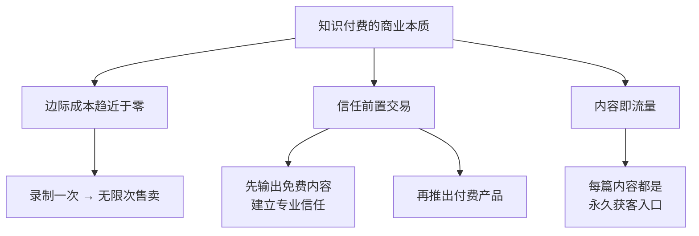
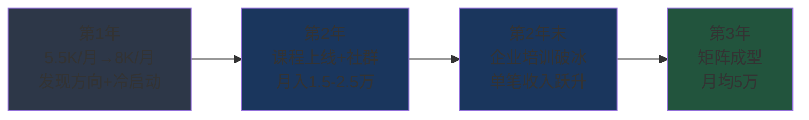
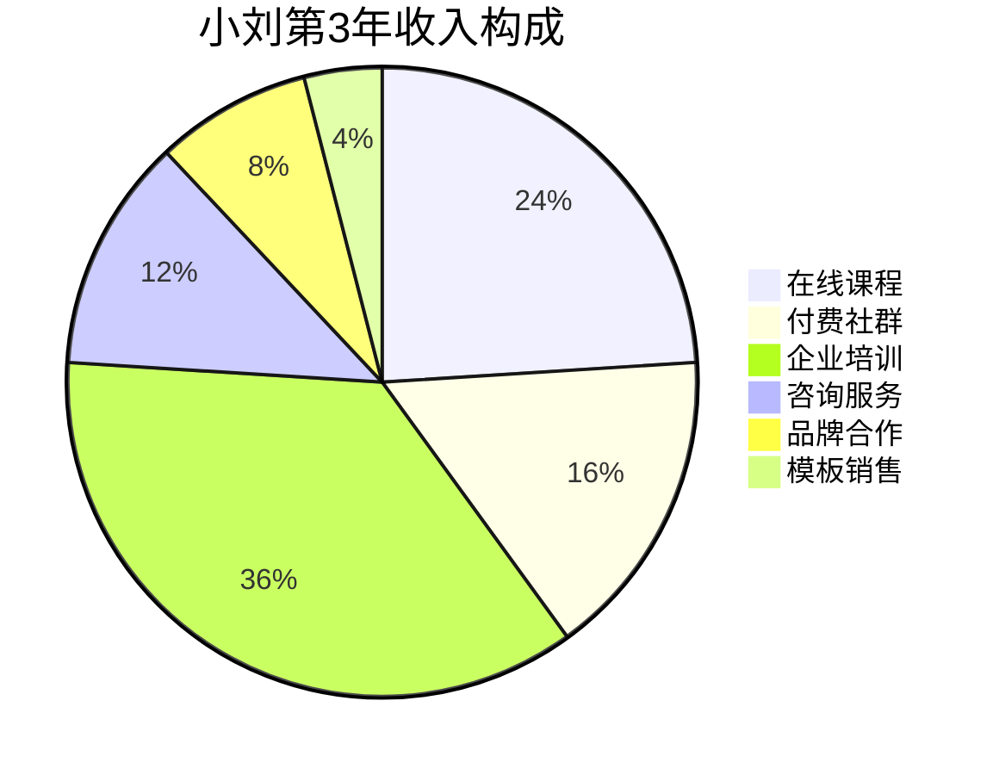
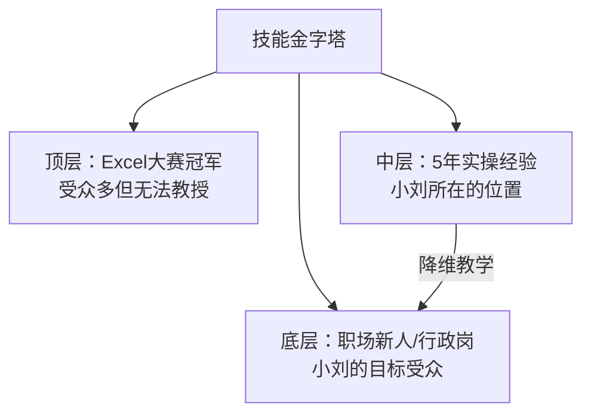
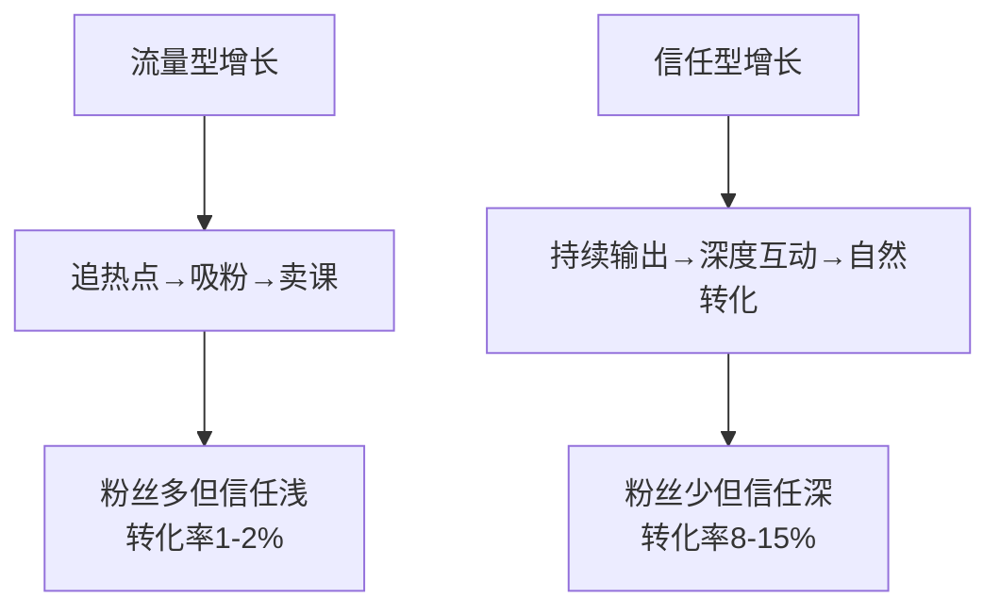

## 案例四：从普通文员到知识付费年入60万的小刘

### 案例概览

小刘的故事是"知识付费时代普通人逆袭"的典型样本。她没有名校学历，没有专业技术背景，只是一个每天处理Excel表格和会议纪要的普通行政文员。但她找到了一条独特的路径——**将职场中积累的"软技能"产品化**，从一门99元的在线课程起步，用了三年时间构建起一个包含课程、社群、咨询和企业培训的完整知识付费矩阵，年收入突破60万元。

这个案例的特殊价值在于：它证明了**知识付费不一定是"专家"的专利**。你不需要是行业顶尖高手，你只需要比你的目标受众多走几步路，并且能把这段路讲清楚。

**基本信息一览：**

| 维度 | 初始状态（2020年） | 最终状态（2023年） |
|------|---------------------|---------------------|
| 年龄 | 27岁 | 30岁 |
| 学历 | 普通本科（中文系） | 不变 |
| 职业 | 行政文员 | 知识付费创业者 |
| 月薪 | 5,500元 | 约50,000元（月均） |
| 年总收入 | 约7万 | 约60万 |
| 收入来源 | 单一工资 | 课程+社群+咨询+企业培训 |
| 行业影响力 | 无 | 职场效率领域5万+粉丝 |

### 知识付费行业的底层逻辑

在进入小刘的具体故事之前，有必要先理解知识付费的底层商业模型，因为小刘的每一步决策都建立在这个模型之上。



**知识付费 vs 传统服务的本质区别：**

| 维度 | 传统服务（如咨询） | 知识付费（如课程） |
|------|---------------------|---------------------|
| 收入模式 | 1份时间 → 1份收入 | 1份时间 → N份收入 |
| 规模天花板 | 受限于个人时间 | 受限于流量和转化率 |
| 边际成本 | 线性增长 | 趋近于零 |
| 复购驱动力 | 服务质量 | 内容更新+社群黏性 |
| 启动门槛 | 需要深度专业能力 | 比受众多走几步即可 |

### 时间线与收入增长轨迹



### 第一阶段：发现方向（第1-6个月）

#### 背景与困境

2020年初，小刘在一家中型贸易公司做行政文员，月薪5500元。工作内容琐碎而重复：整理报销单、安排会议、写会议纪要、做周报月报、管理办公用品。每天加班到晚上8点是常态，但做的事情几乎没有技术含量，可替代性极高。

**小刘的核心困境：**

| 困境维度 | 具体表现 | 深层影响 |
|----------|----------|----------|
| 收入瓶颈 | 行政岗薪资天花板约8000元，涨幅缓慢 | 经济安全感低 |
| 能力焦虑 | 工作内容无壁垒，应届生培训两周即可上手 | 随时可能被替代 |
| 成长停滞 | 日常工作不涉及核心业务，接触不到高价值技能 | 简历无法增值 |
| 时间困境 | 加班多但做的事情"不值钱"，没时间提升自己 | 陷入死循环 |

小刘尝试过几种"常见副业"，但都没有走通：

- **刷单/薅羊毛**：收入极低（月入200-500元），且有法律风险，果断放弃
- **微商卖货**：发了两周朋友圈，只卖出2单给亲戚，社交流量不等于商业流量
- **写作投稿**：投了10篇稿子，中了1篇，稿费200元，时薪不到10元

#### 关键转折：发现"可变现的非专业技能"

小刘的转折点来自一个偶然事件。2020年6月，公司来了一个实习生，连最基本的Excel函数都不会用，领导让小刘"带一下"。小刘花了一个下午教实习生VLOOKUP、数据透视表和条件格式。实习生感激地说："刘姐，你教得比网上的教程清楚多了，那些教程太学术了，听不懂。"

这句话点醒了小刘。她开始认真分析自己的"技能资产"：

**技能资产盘点表：**

| 技能 | 掌握程度 | 市场需求 | 变现可能性 |
|------|----------|----------|------------|
| Excel/数据处理 | 精通（5年实操经验） | 极高 | ★★★★★ |
| PPT制作 | 熟练（每月做5-8份汇报PPT） | 高 | ★★★★ |
| 会议纪要/公文写作 | 精通（公司"一支笔"） | 中 | ★★★ |
| 时间管理/效率提升 | 自学实践，形成个人方法论 | 高 | ★★★★ |
| 职场沟通 | 5年跨部门协调经验 | 高 | ★★★★ |

**关键发现：** 小刘意识到，她的技能虽然在公司内部"不值钱"（因为行政岗薪资低），但对于**职场新人和基层员工**来说，这些技能是非常有价值的。她不需要成为Excel大赛冠军，她只需要比受众多走几步路。

#### 市场验证：用最小成本测试需求

小刘没有急于"做课程"，而是先做了三件事来验证市场需求：

**第一步：搜索平台调研（1周）**

小刘在知乎、小红书、B站、抖音四个平台上搜索"职场效率""Excel教程""PPT制作"等关键词，记录了以下数据：

| 平台 | 搜索关键词 | 内容数量 | 高赞内容特征 |
|------|------------|----------|--------------|
| 知乎 | "Excel怎么学" | 5000+回答 | 问题导向、场景化 |
| 小红书 | "职场效率提升" | 10万+笔记 | 视觉化、清单式 |
| B站 | "Excel入门到精通" | 2000+视频 | 系统化、系列课 |
| 抖音 | "办公技巧" | 50万+视频 | 短平快、炫技式 |

**调研结论：** 市场需求巨大，但大多数内容要么太学术（学不会），要么太碎片（用不上），要么太炫技（不实用）。存在一个明确的缺口——**"场景化、即学即用"的职场效率内容**。

**第二步：免费内容测试（4周）**

小刘在小红书上注册了账号"小刘的效率笔记"，用4周时间发布了16条笔记：

| 周次 | 笔记内容 | 互动数据 | 反馈关键词 |
|------|----------|----------|------------|
| 第1周 | Excel快捷键合集、PPT配色方案 | 平均50赞 | "收藏了""实用" |
| 第2周 | 会议纪要模板、周报写作技巧 | 平均120赞 | "终于找到模板了" |
| 第3周 | "我用Excel帮领导做了一个自动报表" | 580赞 | "求教程""怎么做的" |
| 第4周 | "行政文员如何在3年内月入过万" | 1200赞 | "太有共鸣了""求方法" |

**数据验证了三点：**
1. 职场效率内容有大量受众（第3、4周数据爆发）
2. "我做到了"的故事比"教你怎么做"更有吸引力
3. 受众愿意为"系统化的方法"付费（评论区大量"求教程"）

**第三步：付费意愿验证（2周）**

小刘在小红书粉丝达到2000时，发布了一条笔记："我整理了一套《职场效率工具包》，包含50个即用模板+30个快捷操作清单，定价9.9元，需要的私信我。"

**结果：** 2周内收到87个私信，实际付费62人，收入613.8元。

这个数字看起来不多，但它的意义在于：**验证了"有人愿意为小刘整理的效率工具付费"这个核心假设**。9.9元的定价几乎没有决策门槛，62个付费用户就是62个市场信号。

---

### 第二阶段：冷启动——第一门课程（第7-12个月）

#### 课程选题：从"什么都会"到"聚焦一个点"

小刘面临知识付费最常见的选题陷阱：觉得自己什么都能教，想做一门"大而全"的课程。她最初的课程大纲是这样的：

```text
❌ 初版大纲（过于宽泛）：
第一章：Excel从入门到精通（20节课）
第二章：PPT制作完全指南（15节课）
第三章：职场写作全攻略（10节课）
第四章：时间管理方法论（8节课）
第五章：职场沟通技巧（8节课）
总计：61节课，定价299元
```

这个大纲的问题在于：
1. **范围太大**——61节课的制作周期至少需要6个月，冷启动阶段耗不起
2. **定位模糊**——"职场全能课"没有记忆点，无法在信息洪流中被识别
3. **竞争激烈**——每个子领域都有大量成熟课程，正面竞争毫无胜算

经过反复思考和粉丝调研（在粉丝群发问卷，回收127份），小刘重新定位：

```text
✅ 最终大纲（聚焦场景）：
课程名称：《行政岗Excel效率课：从加班到准点下班》
定位：专为行政/文员/助理岗位设计的Excel实战课
课程结构：
  模块一：行政必备函数TOP10（6节课）
  模块二：数据透视表实战（4节课）
  模块三：自动化报表制作（4节课）
  模块四：行政场景模板库（4节课）
总计：18节课，每节15-25分钟
定价：99元
```

**选题策略的核心逻辑：**

| 策略维度 | 具体做法 | 原因 |
|----------|----------|------|
| 聚焦人群 | 只做行政/文员/助理 | 人群画像清晰，内容精准 |
| 聚焦场景 | "行政岗的Excel"而非"Excel" | 场景化降低学习门槛 |
| 聚焦痛点 | "从加班到准点下班" | 痛点明确，承诺具体 |
| 低定价 | 99元 | 降低首次付费决策门槛 |

#### 课程制作：零成本起步的方法

小刘没有专业的录制设备和场地，她的"录制工作室"是这样的：

**设备清单（总投入：347元）：**

| 设备 | 型号 | 价格 | 用途 |
|------|------|------|------|
| 麦克风 | 博雅MM1领夹麦 | 89元 | 收音 |
| 补光灯 | 桌面环形灯 | 58元 | 面部补光 |
| 手机支架 | 桌面俯拍架 | 35元 | 拍摄屏幕操作 |
| 背景布 | 纯色遮光布 | 25元 | 简化背景 |
| 软件 | OBS Studio | 免费 | 录屏+录制 |
| 软件 | 剪映 | 免费 | 视频剪辑 |
| 软件 | Canva免费版 | 免费 | 课程封面/PPT |
| 场地 | 自家书房（晚上10点后） | 0元 | 安静录制环境 |

**录制流程标准化：**

```text
每节课的制作流程（总计约4-5小时/节）：

1. 写逐字稿（1.5小时）
   - 先列出本节的知识点清单
   - 用口语化的方式写出完整讲解词
   - 标注需要演示操作的时间点

2. 准备素材（30分钟）
   - 制作演示用的Excel文件
   - 准备"前后对比"截图
   - 设计2-3个练习题

3. 录制（40-60分钟）
   - 通常需要录制2-3遍才能满意
   - 保留"自然口误"的部分，不要追求完美
   - 每录完一段就检查音频质量

4. 剪辑（1-1.5小时）
   - 删除长时间停顿和明显口误
   - 添加字幕（剪映自动识别，人工校对）
   - 添加章节标记和关键点标注

5. 发布前检查（20分钟）
   - 在手机上播放一遍，检查字幕和画面
   - 确认音量适中，画面清晰
```

**18节课的制作周期：** 利用工作日晚上（10点-12点）和周末，总计花了6周完成。

#### 上架与定价策略

小刘选择了**荔枝微课**作为首发平台，原因如下：

| 平台 | 分成比例 | 门槛 | 适合阶段 | 小刘的选择 |
|------|----------|------|----------|------------|
| 荔枝微课 | 平台抽成10% | 几乎零门槛 | 冷启动期 | ✅ 首发 |
| 千聊 | 平台抽成10-20% | 需审核 | 冷启动期 | 备选 |
| 小鹅通 | 年费制（基础版4800元/年） | 需年费 | 成长期 | 后期迁移 |
| 网易云课堂 | 分成30-50% | 需资质审核 | 成熟期 | 未使用 |
| B站课堂 | 分成30% | 需UP主认证 | 成长期 | 后期上架 |

**定价策略的三层思考：**

1. **成本锚定**：18节课×5小时制作=90小时投入，按时薪50元计算，沉没成本约4500元。99元定价需要卖出46份才能回本——这是一个可实现的目标
2. **心理锚定**：99元在知识付费中属于"轻决策"价位（低于一顿饭钱），转化率远高于199元或299元
3. **战略锚定**：第一门课的目的不是赚钱，而是**验证产品、积累口碑、获取种子用户**

#### 冷启动推广：从0到500个付费用户

小刘的推广策略分为四个阶段：

**阶段一：私域启动（第1-2周）**

- 在自己的小红书账号发布课程上线预告（阅读量3200，转化47人）
- 在个人朋友圈发布课程介绍（转化12人）
- 在之前购买9.9元工具包的62人中定向推荐（转化28人）
- **小计：87人，收入8,613元**

**阶段二：内容种草（第3-6周）**

小刘制作了一系列"钩子内容"来引流到课程：

| 内容类型 | 发布平台 | 具体内容 | 引流效果 |
|----------|----------|----------|----------|
| 免费公开课 | 荔枝微课 | "行政岗必会的5个Excel函数"（30分钟） | 328人观看，转化62人 |
| 拆解文章 | 小红书 | "我用一个Excel公式，把3小时的活变成了10分钟" | 阅读量8700，转化89人 |
| 对比视频 | B站 | "Excel小白vs熟手：同一个任务的两种做法" | 播放量1.2万，转化56人 |
| 问答引流 | 知乎 | 回答"行政文员如何提升自己"获高赞 | 转化34人 |

**小计：241人，收入23,859元**

**阶段三：口碑裂变（第7-10周）**

小刘设计了一个"老带新"机制：
- 老学员推荐新学员，老学员获得30元返现
- 新学员通过推荐链接购买，享受89元优惠价（原价99元）
- **实际效果：** 约35%的新学员来自老学员推荐

**小计：142人，收入约12,638元**

**阶段四：长尾流量（持续）**

课程上线后，小刘之前发布的小红书笔记和B站视频持续带来流量。尤其是那条"我用Excel帮领导做了一个自动报表"的笔记，在搜索结果中长期排名靠前，每月稳定带来20-30个新学员。

**第一门课半年数据汇总：**

| 指标 | 数值 |
|------|------|
| 累计付费学员 | 523人 |
| 总收入 | 约49,800元 |
| 完课率 | 68%（行业平均约30%） |
| 好评率 | 94% |
| 退款率 | 2.1% |
| 课程制作成本 | 347元（设备） |
| 时间投入 | 约120小时（制作+推广） |

**关键数据解读：** 68%的完课率远高于行业平均水平，这说明课程内容质量过硬。小刘后来总结原因：一是课程短（18节×20分钟），不劝退；二是每节课都有"即学即用"的练习，学员有成就感。

---

### 第三阶段：产品矩阵构建（第2年）

#### 第二门课程：从"教Excel"到"教效率"

第一门课的成功让小刘明确了方向：**她的核心价值不是"会用Excel"，而是"能让行政岗的人更高效地工作"**。Excel只是工具，效率才是本质。

基于学员反馈中最高频的需求，小刘在第2年上线了第二门课：

```text
课程名称：《行政岗效率全攻略：从被动执行到主动管理》
课程结构：
  模块一：任务管理与优先级排序（5节课）
  模块二：高效会议管理（4节课）
  模块三：职场写作与汇报（5节课）
  模块四：跨部门沟通技巧（4节课）
  模块五：向上管理基础（3节课）
总计：21节课，每节20-30分钟
定价：199元
```

**课程内容的差异化策略：**

| 维度 | 市面上的效率课 | 小刘的课程 |
|------|----------------|------------|
| 视角 | 管理者/创业者视角 | 基层执行者视角 |
| 案例 | 通用场景 | 行政岗真实场景 |
| 难度 | 偏理论，需要"悟" | 每个方法都有SOP |
| 工具 | 提到但不深入 | 提供可直接用的模板 |
| 语言 | 学术化/鸡汤化 | 口语化，像同事聊天 |

#### 社群运营：从"卖课"到"卖圈子"

小刘在第2年中期启动了付费社群，这是她收入结构中最重要的转折点之一。

**社群定位与定价：**

| 社群层级 | 年费 | 权益 | 目标人数 |
|----------|------|------|----------|
| 基础会员群 | 199元/年 | 每周答疑+模板更新+学员交流 | 500人 |
| 进阶会员群 | 499元/年 | 基础权益+每月1次直播课+1v1问题诊断 | 100人 |
| 企业会员 | 1999元/年 | 进阶权益+定制模板+专属顾问 | 20人 |

**社群运营的日常节奏：**

```text
每日：
  - 早上8:30 发一条"效率小贴士"（1分钟可读完）
  - 中午12:00 回复群内问题（30分钟）
  - 晚上20:00 分享一个实用模板或技巧

每周：
  - 周三晚20:00 直播答疑（1小时，仅进阶/企业会员）
  - 周五发布本周精华问答合集

每月：
  - 第一周：发布新模板/新工具
  - 第二周：主题分享（邀请优秀学员分享经验）
  - 第三周：案例拆解（分析真实的行政工作难题）
  - 第四周：月度复盘+下月预告
```

**社群的核心价值不是"知识"，而是"陪伴感"和"确定性"。** 学员加入社群后，不再是一个人在摸索，而是有一个"随时可以问"的专家和一群"同路人"。这种归属感是单门课程无法提供的。

#### 个人品牌升级：从"小红书博主"到"行业IP"

小刘在第2年有意识地进行了品牌升级：

**内容矩阵重构：**

| 平台 | 定位 | 更新频率 | 内容类型 | 粉丝增长 |
|------|------|----------|----------|----------|
| 小红书 | 主阵地，日常内容 | 每天1条 | 技巧/模板/故事 | 2000→18000 |
| B站 | 深度教程 | 每周1条 | 长视频教程 | 0→8000 |
| 公众号 | 深度文章+课程入口 | 每周2篇 | 方法论/案例分析 | 0→5000 |
| 知乎 | 问答引流 | 每周3-5个回答 | 问题解答 | 0→3000 |

**爆款内容的创作方法论：**

小刘总结了她最受欢迎的三类内容模式：

```text
模式一："我做到了"型
标题模板：我用[方法]，把[痛苦的事]变成了[好的结果]
示例：我用一个Excel模板，把月度报表从做3天变成了2小时
关键：必须有真实数据和前后对比

模式二："你不知道的"型
标题模板：90%的[人群]不知道，[工具/方法]还能这样用
示例：90%的行政不知道，Word还能自动生成会议纪要
关键：信息差要真实，不能是烂大街的技巧

模式三："别再踩坑了"型
标题模板：[常见做法]其实是错的，正确的方法是[新方法]
示例：做PPT还在套模板？高手都在用这个方法
关键：要能自圆其说，不能为了反常识而反常识
```

#### 第2年收入结构拆解

| 收入来源 | 月均收入 | 年收入 | 占比 |
|----------|----------|--------|------|
| Excel课程（持续销售） | 4,500元 | 54,000元 | 25% |
| 效率课程（新上线） | 6,000元 | 72,000元 | 33% |
| 付费社群 | 5,500元 | 66,000元 | 30% |
| 小红书品牌合作 | 1,500元 | 18,000元 | 8% |
| 定制模板/资料包 | 1,000元 | 12,000元 | 4% |
| **合计** | **约18,500元** | **约222,000元** | **100%** |

---

### 第四阶段：矩阵成型与规模化（第3年）

#### 企业培训：收入跃升的关键

小刘在第3年初迎来了收入的最大一次跃升——企业培训。

**契机：** 一个社群学员是某公司行政主管，公司要进行"行政团队效能提升"培训，她推荐了小刘。小刘以8000元的价格做了第一场半天的企业内训。

**企业培训的准备过程：**

```text
1. 制作企业培训专用PPT（30页，精简版）
2. 设计互动环节（现场练习+小组竞赛）
3. 准备培训后的"工具包"（Excel模板+操作手册）
4. 设计培训效果评估表（问卷星）

培训时长：半天（3小时）
培训形式：线下授课+现场练习
培训费用：8000-15000元/场（根据企业规模浮动）
```

**企业培训的获客渠道：**

| 渠道 | 占比 | 具体方式 |
|------|------|----------|
| 社群学员推荐 | 40% | 学员在公司内部推荐 |
| 小红书/公众号引流 | 25% | 发布企业培训案例和效果数据 |
| 培训平台合作 | 20% | 入驻"培训宝""淘课"等平台 |
| 老客户转介绍 | 15% | 做过的企业HR互相推荐 |

**企业培训的关键数据：**

| 指标 | 数值 |
|------|------|
| 全年培训场次 | 18场 |
| 平均单场费用 | 12,000元 |
| 企业培训年收入 | 216,000元 |
| 客户复购率 | 55%（做过的企业有55%续订了进阶培训） |
| 最大单笔订单 | 35,000元（某互联网公司的3天集训） |

#### 第3年完整收入结构

| 收入来源 | 月均收入 | 年收入 | 占比 | 性质 |
|----------|----------|--------|------|------|
| 在线课程（2门） | 12,000元 | 144,000元 | 24% | 被动收入 |
| 付费社群 | 8,000元 | 96,000元 | 16% | 半被动收入 |
| 企业培训 | 18,000元 | 216,000元 | 36% | 主动收入 |
| 咨询/诊断服务 | 6,000元 | 72,000元 | 12% | 主动收入 |
| 品牌合作/广告 | 4,000元 | 48,000元 | 8% | 半被动收入 |
| 模板/资料销售 | 2,000元 | 24,000元 | 4% | 被动收入 |
| **合计** | **约50,000元** | **约600,000元** | **100%** | — |



**收入结构的健康度分析：**

- **被动/半被动收入占比：52%**（课程+社群+品牌合作+模板），这意味着即使小刘停止推广，仍有稳定收入
- **主动收入占比：48%**（企业培训+咨询），这部分需要小刘投入时间，但时薪极高（企业培训时薪约4000元）
- **收入来源数量：6个**，单一来源占比最高36%，风险分散度良好

---

### 关键成功因素深度分析

#### 因素一：精准的"技能降维"定位

小刘最核心的竞争力不是"Excel多厉害"，而是**她找到了一个精准的"技能落差"**。



**"降维教学"的核心原则：**

1. **不需要是最顶尖的专家**——你需要比你的目标受众领先2-3年，而不是20年
2. **经验比证书更有说服力**——"我在行政岗用了5年Excel"比"我有微软认证"更能赢得行政岗受众的信任
3. **教学能力 > 专业深度**——能把复杂的事讲简单，比自己能做到复杂的事更重要

> **关键洞察：** 知识付费市场最大的误区是"我还不够格教别人"。真相是，你只需要比你的目标受众多走几步路，并且能清晰地告诉他们你是怎么走过来的。

#### 因素二：内容即产品的飞轮效应

小刘的业务增长依赖一个自循环的飞轮：


**飞轮的关键节点：**

- **免费内容 → 低价产品**：转化率约3-5%（小红书粉丝中3-5%会购买9.9元工具包）
- **低价产品 → 核心课程**：转化率约45-55%（工具包用户中近一半会购买课程）
- **核心课程 → 社群**：转化率约25-30%（课程学员中约四分之一加入社群）
- **社群 → 企业培训**：每年约10-15%的社群学员会在公司内部推荐小刘

#### 因素三：复购率是知识付费的生命线

小刘的社群年续费率高达72%，远高于行业平均的30-40%。她的秘诀是**持续提供"增量价值"**：

| 续费驱动因素 | 具体做法 | 效果 |
|--------------|----------|------|
| 内容持续更新 | 每月发布新模板/新工具 | 学员觉得"一直在获得新东西" |
| 社群活跃度 | 每日互动+每周直播 | 形成习惯性使用 |
| 人脉价值 | 学员之间互相帮助、推荐工作 | 社群成为"职场人脉池" |
| 专属感 | 进阶会员有专属1v1诊断 | 觉得"被重视" |
| 情感连接 | 记住学员的名字和情况 | 从"用户"变成"朋友" |

#### 因素四：从"内容创作者"到"商业运营者"的思维转变

小刘在第2年中期经历了一次重要的思维升级。之前她把自己定位为"做内容的人"，所有精力都花在"写笔记、录课程"上。但当社群规模扩大到300人时，她发现**运营能力比内容能力更重要**。

**思维转变前后对比：**

| 维度 | 转变前（内容思维） | 转变后（商业思维） |
|------|---------------------|---------------------|
| 核心指标 | 阅读量、点赞数 | 转化率、复购率、客单价 |
| 时间分配 | 80%做内容，20%运营 | 40%做内容，40%运营，20%战略 |
| 收入来源 | 依赖课程销售 | 课程+社群+培训+合作 |
| 增长方式 | 线性增长（内容→流量→销售） | 飞轮增长（多产品互相引流） |
| 护城河 | 内容质量（可被模仿） | 品牌+社群+口碑（难以复制） |

---

### 成果数据全景

| 指标 | 第1年末 | 第2年末 | 第3年末 |
|------|---------|---------|---------|
| 月均收入 | 8,300元 | 18,500元 | 50,000元 |
| 年总收入 | 约10万 | 约22万 | 约60万 |
| 全网粉丝 | 5,000 | 28,000 | 52,000 |
| 付费学员累计 | 523人 | 2,100人 | 4,800人 |
| 社群会员 | 0 | 320人 | 680人 |
| 企业客户 | 0 | 4家 | 18家 |
| 收入来源数 | 2个 | 5个 | 6个 |
| 日均工作时长 | 5小时（含全职） | 6小时（已辞职） | 7小时 |

**关键里程碑时间点：**

- **第10个月**：课程收入首次超过主业工资，开始考虑辞职
- **第12个月**：正式辞职，全职投入知识付费
- **第18个月**：社群+课程收入稳定在1.5万/月以上，确认商业模式可行
- **第24个月**：企业培训成为最大收入来源，单笔收入突破万元
- **第30个月**：年收入突破50万，开始考虑团队化

---

### 常见误区与避坑指南

**误区一："我还不够格教别人"**

小刘最常被问到的问题就是："你又不是Excel大师，凭什么教别人？"她的回答是：**"我不需要是大师，我只需要比我的学生多走几步路。"** 一个有5年实操经验的行政文员，对于刚入职的新人来说，就是最好的老师。那些"大师级"的课程往往太深、太理论，新人根本听不懂。

**误区二："课程要做得很完美才上线"**

小刘的第一门课，前5节课的画面质量、音频质量都一般，PPT设计也很朴素。但她选择了"先上线，再迭代"。事实证明，学员更在意的是**内容是否有用**，而不是画面是否精美。小刘后来根据学员反馈，分三次更新了课程内容和制作质量，每次更新都带来一波新销售。

**误区三："定价越低越好卖"**

小刘最初想把课程定价49元，但经过计算发现：49元需要卖1000份才能赚到5万，而99元只需要卖500份。更重要的是，**99元的课程比49元的课程看起来"更值得学"**——价格本身就是价值信号。后来小刘的第二门课定价199元，销量反而不比第一门差。

**误区四："有了课程就能躺赚"**

知识付费不是"录完课程就等着收钱"。小刘每周花在推广、运营、答疑上的时间，比制作新内容的时间还多。她的时间分配是：30%内容制作、40%运营推广、20%社群维护、10%战略规划。**课程是产品，但运营才是生意。**

**误区五："抄袭/搬运能走捷径"**

小刘发现有人搬运她的笔记内容到其他平台，起初很愤怒，后来想通了：**真正的护城河不是内容本身，而是信任关系和社群黏性。** 别人可以抄你的文字，但抄不走你的学员对你的真实评价，抄不走社群里的互动氛围，抄不走企业客户对你的信任。

**误区六："要等粉丝多了才能变现"**

小刘在粉丝只有2000人时就开始变现（9.9元工具包），在粉丝5000人时上线了99元课程。很多人等到粉丝10万才开始考虑变现，白白浪费了大量的流量和信任。**早变现不是"割韭菜"，而是"验证需求"。** 如果你的粉丝连9.9元都不愿意付，说明你的内容定位有问题，早发现比晚发现好。

**误区七："一个人能做完所有事"**

小刘在第3年下半年意识到，自己已经达到了个人产能的天花板。她开始外包以下工作：

| 外包内容 | 外包方式 | 月成本 | 释放的时间 |
|----------|----------|--------|------------|
| 视频剪辑 | 兼职大学生 | 2000元 | 每周8小时 |
| 社群日常运营 | 兼职助理 | 3000元 | 每周10小时 |
| 企业培训课件设计 | 设计师按项目 | 500元/次 | 每月4小时 |
| 财务/税务 | 代理记账 | 300元/月 | 每月3小时 |

**总计月成本：约5800元，但释放的时间让小刘能专注在高价值工作上（课程研发、企业客户开发），收入增长远超成本增加。**

---

### 进阶思考：知识付费的底层规律

#### 规律一：知识付费的本质是"降低学习成本"

学员付费买的不是"知识"（知识在网上是免费的），而是**"有人帮我省时间"**。小刘的课程之所以卖得动，是因为她帮学员完成了三件事：

1. **筛选**：从海量信息中挑出行政岗真正需要的内容
2. **翻译**：把专业术语翻译成行政岗能理解的语言
3. **组织**：把碎片知识组织成可执行的体系

**如果你的知识付费产品做不到这三件事中的至少两件，它就很难卖动。**

#### 规律二：信任资产比流量更重要

小刘的5万粉丝，转化率远高于很多10万粉丝的博主。原因是她的粉丝是通过**长期、持续、高质量的免费内容**积累起来的，每一个粉丝都对她有基本的信任。



#### 规律三：知识付费的终局是"社群+服务"

单纯卖课程的天花板很低——一门课卖完就没了。小刘的模式之所以能到年入60万，关键在于**她把"课程"变成了"社群"和"服务"**：

- 课程是一次性交易（买完就走）
- 社群是持续交易（年费续订）
- 服务是高客单价交易（企业培训/咨询）

**这三者的关系是：课程引流→社群沉淀→服务变现。** 缺少任何一个环节，收入模型都不完整。

#### 规律四：可复制的路径框架

如果你也想走知识付费这条路，以下是从小刘案例中提炼的可复制框架：

| 阶段 | 时间 | 核心任务 | 收入预期 |
|------|------|----------|----------|
| 技能盘点 | 第1-2周 | 识别你的"可变现非专业技能" | 0 |
| 市场验证 | 第3-6周 | 发布免费内容，验证受众存在 | 0 |
| 冷启动 | 第2-4个月 | 上线第一门低价课程（99元以内） | 1000-5000元/月 |
| 产品扩展 | 第5-12个月 | 第二门课+社群启动 | 5000-15000元/月 |
| 矩阵成型 | 第13-24个月 | 多产品+企业客户 | 15000-30000元/月 |
| 规模化 | 第25-36个月 | 团队化+品牌化 | 30000-50000元/月 |

> **核心启示：** 小刘的成功不是因为她有多特殊，而是因为她做对了一件事——**把工作中"不值钱"的软技能，用知识付费的方式卖给了需要它的人**。这个逻辑适用于所有拥有3年以上工作经验的职场人。你觉得自己"没什么可教的"，很可能只是因为你还没找到那个"比你少走几步路"的人群。
