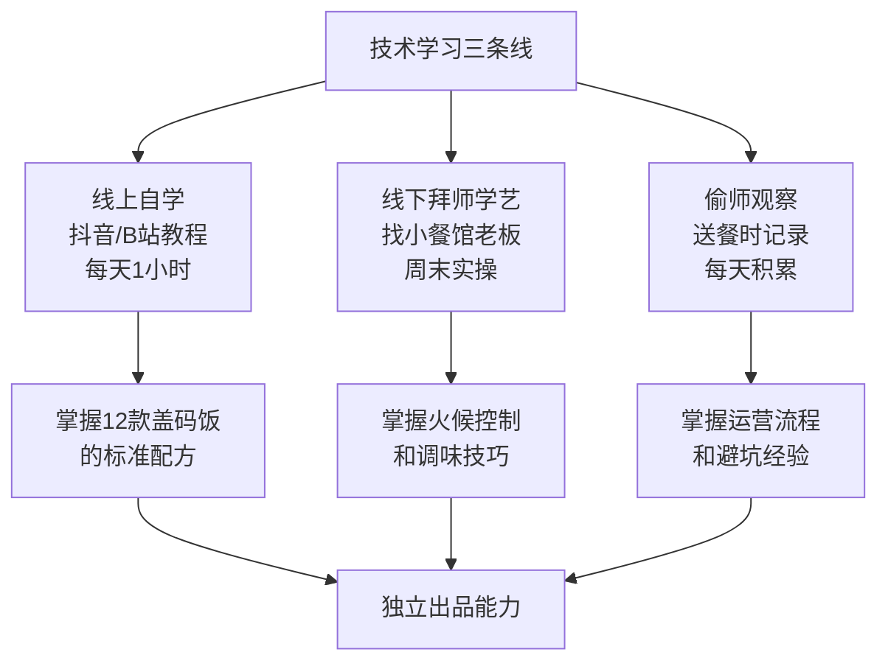
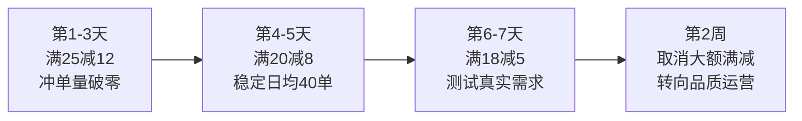
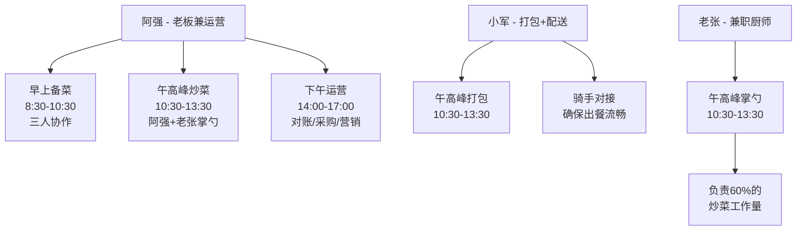
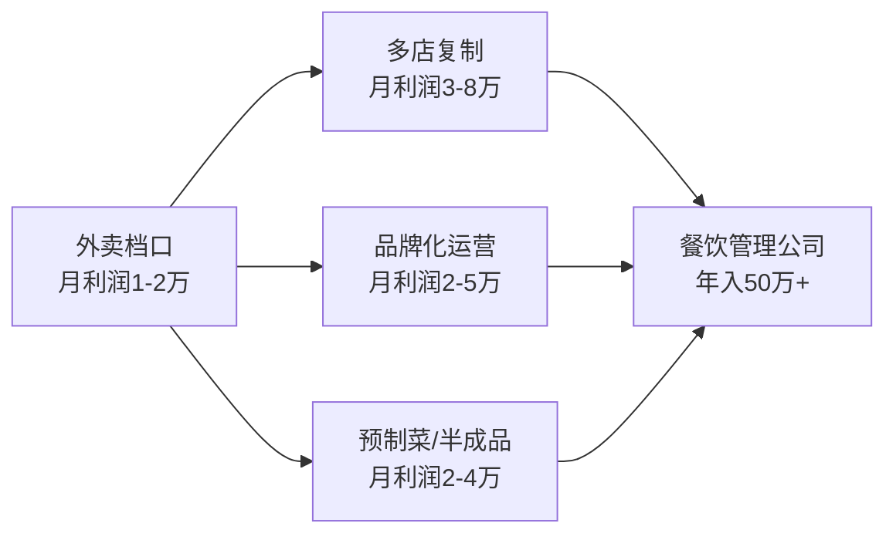

## 案例五：从外卖骑手到餐饮创业者的阿强

### 案例背景

#### 人物画像

阿强，26岁，坐标二线城市长沙，高中学历，2019年从湖南老家来到长沙，在工厂流水线上干了两年，月收入4000-4500元。2021年初工厂效益下滑裁员，阿强转行做外卖骑手，加入美团专送，日均跑单12-14小时，月收入6000-7500元（含高峰补贴和恶劣天气奖励）。

#### 困境分析

| 维度 | 具体状况 | 影响 |
|------|----------|------|
| 收入天花板 | 骑手收入完全依赖体力和时间，日均12小时已是极限，月入难以突破8000元 | 看不到未来增长空间 |
| 身体透支 | 每天骑行80-120公里，膝盖和腰椎开始出现问题，冬天冻疮、夏天中暑 | 职业寿命有限，最多干3-5年 |
| 零积累 | 纯体力劳动不积累任何可迁移的技能、人脉或资产 | 离开平台后什么都没有 |
| 社会认同低 | "送外卖的"标签导致相亲屡屡被拒，自尊心受挫 | 心理压力大，急于改变 |
| 存款微薄 | 月入7000元，房租800+生活费1500+寄回家1000，月存仅3500元，总存款约2万 | 启动资金极其有限 |

#### 为什么选择餐饮创业

阿强的转型并非灵光一现，而是源于他在送外卖过程中长达8个月的系统性观察：

**观察一：看到了餐饮行业的真实数据**

送外卖让阿强获得了一个独特视角——他每天进出几十家餐厅后厨，亲眼看到哪些店爆单、哪些店冷清，哪些店从开业到倒闭只用了3个月。他开始有意识地记录数据：

| 观察维度 | 记录方式 | 发现 |
|----------|----------|------|
| 各店日均单量 | 跑单时注意取餐排队情况 | 品类比装修重要，一家破旧的盖饭店日均200+单 |
| 出餐速度 | 从下单到取餐的等待时间 | 出餐快的店评分高、复购率高，3分钟内出餐是黄金标准 |
| 客单价分布 | 看订单小票金额 | 15-25元区间订单量最大，占总单量60%以上 |
| 差评原因 | 旁听商家处理投诉 | "量少""不好吃""配送洒漏"是三大差评原因 |
| 包装设计 | 观察哪些包装不易洒漏 | 带密封盖的PP盒+独立汤碗的组合差评率最低 |

**观察二：发现了"盖码饭"这个品类机会**

长沙是盖码饭（盖浇饭的地方叫法）的主战场。阿强在送餐过程中发现了一个规律：

- **高频刚需**：盖码饭是长沙白领午餐的第一选择，日均单量稳定，不像奶茶有明显的季节波动
- **出餐极快**：现炒盖码饭从点单到出餐只需2-3分钟（因为浇头是提前炒好的大锅菜，只需现炒码子）
- **毛利可观**：一份盖码饭食材成本4-6元，售价16-22元，毛利率65-75%
- **门槛适中**：不需要大厨级别的技术，核心是配方和火候，可以标准化
- **外卖友好**：米饭+码子的组合不易洒漏，适合外卖配送

**观察三：找到了可学习的标杆**

阿强锁定了他配送区域内一家叫"老刘盖码饭"的小店。这家店只有15平米，没有堂食，专做外卖，但日均单量超过250单。阿强利用取餐的机会，前后去了200多次，悄悄观察并记录了以下信息：

- 菜单结构：12个SKU，分为8个常规款+4个季节限定款
- 出餐流程：一人炒菜、一人打包，流水线作业
- 高峰应对：11:00前完成80%的备菜，高峰期只做"炒+装"两个动作
- 定价策略：主力款定价16-18元，利润款定价22-25元

> **关键洞察**：阿强的优势不在于他有多少钱或多少经验，而在于他每天都在行业一线，拥有最真实的市场数据。这种"用脚做调研"的方式，比花几万块去学餐饮加盟课程靠谱得多。

---

### 执行过程：四个阶段的完整复盘

#### 第一阶段：筹备期（第1-4个月）

**目标：在不辞职的情况下完成全部准备工作，降低试错成本。**

##### 1. 系统学习烹饪技术

阿强知道自己炒菜水平仅限于"能做熟"，需要系统提升。他的学习路径分三条线并行：

**线上自学（投入：0元）：**
- 每天下班后花1小时看B站和抖音上的炒菜教程
- 重点关注"盖码饭"相关内容，收藏了47个教学视频
- 用手机备忘录整理出12款盖码饭的标准配方（食材种类、克数、调味料比例）

**线下学艺（投入：0元，但花了人情）：**
- 通过送餐认识了一家小餐馆的老板"周哥"
- 主动提出周末免费帮厨，换取学习机会
- 连续8个周末在周哥店里帮忙，从切菜、备料到掌勺，逐步上手
- 周哥教了他三个关键技巧：①铁锅养锅方法 ②大火快炒的火候判断 ③码子的标准化调味

**偷师观察（投入：0元，利用工作时间）：**
- 每次到"老刘盖码饭"取餐，刻意多停留2-3分钟观察
- 用手机偷拍了出餐流程（后在正式学习时主动向老板请教，获得许可）
- 记录了该店的菜单设计、定价区间、包装方式、高峰出餐节奏

**三个月学习成果：**
- 掌握了12款盖码饭的制作（辣椒炒肉、小炒黄牛肉、酸辣鸡杂、红烧肉、番茄炒蛋、农家小炒肉、剁椒鱼头、啤酒鸭、酸菜鱼、木耳炒肉、青椒肉丝、紫苏田螺）
- 经过20次以上的试做，出品稳定性达到90%以上
- 请朋友和同事试吃，收集了50+份反馈，根据意见调整了口味（长沙人偏好重油重辣，但年轻白领偏好"香辣"而非"死辣"）

##### 2. 商业计划与资金准备

阿强做了一份极其详细的启动预算（他称之为"算账本"）：

**启动资金预算表：**

| 项目 | 明细 | 金额 | 优先级 |
|------|------|------|--------|
| 房租 | 外卖档口（10-15㎡），押一付三 | 8000元 | 必须 |
| 设备 | 双头燃气灶（1200）+商用油烟机（800）+冰柜（1500）+操作台（600） | 4100元 | 必须 |
| 首批食材 | 米、油、调料、肉类、蔬菜 | 2000元 | 必须 |
| 包装耗材 | PP餐盒（500个）+汤碗（200个）+筷子+袋子 | 800元 | 必须 |
| 证照办理 | 营业执照+食品经营许可证+健康证 | 200元 | 必须 |
| 外卖平台 | 美团/饿了么入驻保证金 | 2000元 | 必须 |
| 流动资金 | 前两个月的房租和食材周转 | 5000元 | 必须 |
| 营销推广 | 平台新店推广+朋友圈宣传物料 | 1500元 | 建议 |
| 预备金 | 意外支出缓冲 | 2000元 | 建议 |
| **合计** | - | **25600元** | - |

**资金来源：**
- 个人存款：20000元（送外卖8个月的积蓄）
- 向堂哥借款：6000元（约定半年内无息归还）
- 总启动资金：26000元（略有盈余）

> **阿强的决策逻辑**：他拒绝了朋友"合伙出资5万开大店"的提议，坚持用最小成本启动。他的原话是："亏2万我能承受，亏5万我就得回工厂了。"

##### 3. 选址与证照办理

**选址策略——"跟着订单密度走"：**

阿强利用自己的骑手身份，调取了平台上长沙各区域的外卖订单热力图，确定了选址的三个核心标准：

| 选址标准 | 具体要求 | 阿强的判断依据 |
|----------|----------|----------------|
| 外卖订单密度 | 周边3公里内写字楼/工厂密集 | 送餐经验：城南工业园区午餐时段订单最密集 |
| 租金可控 | 月租不超过2500元 | 不需要临街铺面，只需要带水电的档口 |
| 竞品密度 | 同品类不超过5家 | 实地蹲点3天，数竞品数量和单量 |

最终选定的位置：城南工业园区附近一条巷子里的档口，月租2000元，面积12平方米。这个位置的优势是：
- 周边1.5公里内有4个写字楼园区、2个工厂，午间人口超过2万人
- 巷子里租金便宜，但外卖配送不受影响（骑手看的是定位，不是门面）
- 周边盖码饭店只有3家，且出品一般，存在差异化空间

**证照办理（耗时2周，花费180元）：**
- 个体工商户营业执照：免费，3个工作日
- 食品经营许可证：免费，需现场核查（主要查操作间卫生、设备是否齐全）
- 健康证：体检费80元
- 消防备案：免费

---

#### 第二阶段：冷启动期（第5-7个月）

**目标：日均单量从0突破到80单，实现盈亏平衡。**

##### 1. 开业前的"试运营"

阿强没有急着在外卖平台上线，而是先做了两周的"朋友圈试运营"：

- 在骑手群、工友群发布消息："兄弟自己开了个盖码饭档口，开业前免费请大家试吃提意见"
- 每天限量20份，只收取食材成本价（8元/份）
- 收集反馈，重点记录三个指标：口味评分（1-10分）、分量满意度、最想吃什么码子

**试运营数据（14天）：**

| 指标 | 数据 |
|------|------|
| 总份数 | 220份 |
| 口味平均分 | 7.8分（满分10分） |
| 分量满意度 | 85%（"够吃"和"偏多"的比例） |
| 最受欢迎码子TOP3 | 辣椒炒肉（38%）、小炒黄牛肉（22%）、酸辣鸡杂（18%） |
| 收到的改进建议 | "再辣一点"（32人）、"米饭要好一点"（18人）、"加个卤蛋"（15人） |

根据反馈，阿强做了三个关键调整：
- 辣椒用量增加20%，并在菜单中标注"可选微辣/中辣/重辣"
- 大米从散装米换成品牌长粒香米（每斤成本增加0.5元，但口感提升明显）
- 增加卤蛋（2元/个）和饮料（3元/瓶）作为加购项，提升客单价

##### 2. 外卖平台上线策略

**双平台同时上线**，但策略不同：

| 平台 | 策略 | 目的 |
|------|------|------|
| 美团外卖 | 主战场，投入70%推广预算 | 长沙美团市占率约65%，是主要流量来源 |
| 饿了么 | 辅助战场，投入30%推广预算 | 覆盖剩余客群，避免单一平台依赖 |

**新店开业七天冲刺计划：**

**关键操作细节：**

- **定价策略**：设置较高的菜品原价（辣椒炒肉标价22元），再通过满减活动实现实际售价16-18元。这样做的好处是：满减活动在平台上显示更吸引眼球，同时为后期减少满减留出空间
- **配送范围**：初期设定为3公里（而非默认的5公里），确保出餐到送达控制在30分钟内，保证菜品温度和口感
- **营业时间**：只做午市（10:30-13:30），集中精力做好一个时段
- **差评应对**：每条差评30分钟内回复，态度诚恳+提出补偿方案（重做/退款/送券）

**冷启动期数据：**

| 周 | 日均单量 | 日均营收 | 日均推广费 | 日均净利润 | 评分 |
|----|----------|----------|------------|------------|------|
| 第1周 | 18单 | 306元 | 80元 | -45元（亏损） | 4.8 |
| 第2周 | 35单 | 595元 | 60元 | 52元 | 4.7 |
| 第3周 | 52单 | 884元 | 50元 | 138元 | 4.8 |
| 第4周 | 68单 | 1156元 | 40元 | 245元 | 4.9 |
| 第5周 | 78单 | 1326元 | 30元 | 328元 | 4.9 |
| 第6周 | 85单 | 1445元 | 20元 | 396元 | 4.9 |

> **里程碑**：第4周日均单量突破60单时，阿强正式辞去了骑手工作，全职投入自己的盖码饭店。他回忆说："那天晚上我坐在档口里算账，日净利润245元，月利润就是7000多，比我送外卖还多。我知道这条路走对了。"

##### 3. 第一次危机：出餐瓶颈

上线第3周，日均单量突破50单时，阿强遇到了第一个重大问题——出餐跟不上。

**问题诊断：**
- 午高峰（11:30-12:30）集中了70%的订单
- 一个人既要炒菜又要打包，日均50单已是极限
- 平台数据显示：平均出餐时间为8分钟（行业优秀标准是3-5分钟）
- 因出餐慢导致的差评开始增加："等了40分钟""催了两次还没出"

**解决方案：**

阿强没有急着雇人（成本太高），而是通过流程优化来提升效率：

| 优化措施 | 具体做法 | 效果 |
|----------|----------|------|
| 提前备菜 | 10:00前完成所有食材的清洗、切配、分装 | 减少高峰期备料时间 |
| 码子预制 | 9:30-10:30集中炒制8款常规码子，保温存放 | 高峰期只需"舀码+装盒+打包" |
| 动线优化 | 操作台按"取盒→盛饭→舀码→封盖→装袋"的顺序排列 | 每单打包时间从90秒降到40秒 |
| 订单分流 | 设置"接单后5分钟自动确认"，给自己缓冲时间 | 避免手忙脚乱 |

优化后，出餐时间从8分钟降到3.5分钟，日均产能上限从50单提升到100单。

---

#### 第三阶段：增长期（第8-14个月）

**目标：日均单量突破150单，月净利润突破2万元。**

##### 1. 菜单迭代与产品力提升

阿强在菜单管理上遵循一个原则：**每个月只动一次菜单，但每次都基于数据决策。**

**菜单迭代记录：**

| 时间 | 调整内容 | 数据依据 | 效果 |
|------|----------|----------|------|
| 第8个月 | 新增"小炒黄牛肉盖饭"（定价22元） | 试吃反馈中呼声最高的新品 | 上线首周日均出单25份，成为利润款TOP1 |
| 第9个月 | 下架"紫苏田螺盖饭" | 月销量<50单，备料浪费大 | 减少备料种类，降低损耗率3% |
| 第10个月 | 推出"双码盖饭"（任选两种码子） | 客户反馈"选择困难" | 客单价从17元提升到21元，日均增收200元 |
| 第11个月 | 增加"加饭免费""加辣免费" | 竞品已提供此服务 | 差评率降低40%（"量少"类差评消失） |
| 第12个月 | 推出"周套餐"（5天午餐，周一定、每天送） | 企业客户需求 | 锁定3家公司的固定订单，日均+25单 |

**最终稳定菜单（14个SKU）：**

| 类型 | 产品 | 定价 | 日均销量 | 角色 |
|------|------|------|----------|------|
| 流量款 | 辣椒炒肉盖饭 | 16元 | 65份 | 引流，薄利多销 |
| 流量款 | 番茄炒蛋盖饭 | 14元 | 35份 | 引流，覆盖不吃辣群体 |
| 利润款 | 小炒黄牛肉盖饭 | 22元 | 40份 | 高毛利核心产品 |
| 利润款 | 红烧肉盖饭 | 20元 | 30份 | 高客单价 |
| 特色款 | 酸辣鸡杂盖饭 | 18元 | 28份 | 差异化竞争 |
| 特色款 | 啤酒鸭盖饭 | 20元 | 18份 | 季节性爆款（秋冬） |
| 加购项 | 卤蛋/卤豆腐/卤鸡腿 | 2-5元 | 日均80份 | 提升客单价 |
| 加购项 | 饮料（可乐/王老吉/酸梅汤） | 3元 | 日均60份 | 高毛利附加收入 |

##### 2. 团队扩张：从一个人到三个人

第10个月，日均单量稳定在120单以上，阿强一个人已经忙不过来了。他做出了关键的用人决策：

**第一位员工——表弟小军：**
- 关系：阿强的表弟，20岁，刚从老家出来找工作
- 角色：帮厨+打包员
- 薪资：月薪4000元+包吃
- 培训方式：阿强手把手教了3天打包流程，7天后独立上岗
- 关键协议：虽然是亲戚，但签订了正式劳动合同，明确工作内容和薪资

**第二位员工——厨师老张：**
- 来源：周哥介绍的一位退休厨师，55岁，手艺好但不想全职
- 角色：兼职炒菜师傅，每天10:00-13:30
- 薪资：时薪35元，月结约3500元
- 核心价值：分担了炒菜工作，阿强可以腾出手来做运营和管理

**团队分工：**

**人力成本变化：**

| 阶段 | 人力投入 | 月人力成本 | 日均产能 |
|------|----------|------------|----------|
| 单干期（第5-10月） | 阿强1人 | 0元 | 80-100单 |
| 二人期（第11-12月） | 阿强+小军 | 4000元 | 120-140单 |
| 三人期（第13月起） | 阿强+小军+老张 | 7500元 | 160-200单 |

##### 3. 差评管理与口碑建设

阿强对差评的重视程度远超一般餐饮老板。他建了一个"差评分析表"，每周汇总一次：

**差评分类与应对策略：**

| 差评类型 | 占比 | 具体原因 | 应对措施 | 改善效果 |
|----------|------|----------|----------|----------|
| 口味问题 | 25% | "太咸""太辣""码子太少" | 统一调味标准，码子定量勺 | 月差评数从12条降到4条 |
| 出餐慢 | 30% | 高峰期积压 | 流程优化+增加人手 | 平均出餐时间3.5分钟 |
| 配送洒漏 | 20% | 汤汁外溢 | 升级密封餐盒，汤汁单独包装 | 洒漏差评降为0 |
| 分量不足 | 15% | "吃不饱" | 米饭免费加，推出大份选项 | 此类差评减少80% |
| 其他 | 10% | 态度/卫生等 | 严格卫生标准，小军培训服务话术 | 逐案处理 |

**阿强的"差评30分钟响应法则"：**
1. 看到差评后5分钟内阅读并判断类型
2. 15分钟内拟定回复话术（诚恳道歉+具体补偿方案）
3. 30分钟内完成回复
4. 严重问题（食品安全类）立即私信客户，电话沟通，必要时全额退款+送优惠券

> 阿强说："一条差评如果不处理，会影响后面100个潜在客户的下单决策。处理好一条差评，反而能变成一次口碑传播。"

---

#### 第四阶段：稳定期（第15个月至今）

**目标：月净利润稳定在2万+，建立可持续的经营模式。**

##### 收入结构拆解

| 收入来源 | 月均金额 | 占比 | 稳定性 |
|----------|----------|------|--------|
| 外卖平台日常订单 | 42000元 | 70% | 高 |
| 企业周套餐订单 | 9000元 | 15% | 高 |
| 加购项（卤蛋/饮料/小吃） | 5400元 | 9% | 高 |
| 节日团体订餐 | 3600元 | 6% | 波动 |
| **月均总营收** | **60000元** | **100%** | - |

##### 成本结构

| 成本项 | 月均金额 | 占收入比 |
|--------|----------|----------|
| 食材采购 | 16800元 | 28% |
| 房租 | 2000元 | 3.3% |
| 人力成本 | 7500元 | 12.5% |
| 包装耗材 | 2400元 | 4% |
| 平台抽成（约18%） | 10800元 | 18% |
| 水电燃气 | 1500元 | 2.5% |
| 推广费用 | 1200元 | 2% |
| 杂项（设备维护/清洁用品） | 800元 | 1.3% |
| **月均总成本** | **43000元** | **71.7%** |
| **月均净利润** | **17000元** | **28.3%** |

> **补充说明**：以上为保守估算。旺季（秋冬，盖码饭需求旺盛）月净利润可达22000-25000元；淡季（盛夏，食欲下降）约13000-15000元。年均净利润约20万元。

##### 成果数据全景

| 指标 | 起步时（第1个月） | 半年后 | 一年后 | 成熟期（第15月+） |
|------|-------------------|--------|--------|-------------------|
| 月营收 | 1800元 | 22000元 | 48000元 | 60000元 |
| 月净利润 | -800元（亏损） | 6500元 | 14000元 | 17000元 |
| 日均单量 | 18单 | 85单 | 160单 | 200单 |
| 平台评分 | 4.7分 | 4.8分 | 4.9分 | 4.9分 |
| 复购率 | - | 38% | 52% | 58% |
| 团队人数 | 1人 | 1人 | 2人 | 3人 |
| 企业客户数 | 0 | 0 | 2家 | 5家 |

---

### 经验总结：六条可复制的方法论

#### 方法论一：在打工中做"行业侦察兵"

阿强最大的优势是他在送外卖的8个月里，不是机械地跑单，而是带着创业者的视角在观察。他总结了一套"骑手观察法"：

- **看什么**：哪些品类单量高、哪些店出餐快、哪些包装不洒漏、哪些店差评多
- **怎么记**：每天晚上花15分钟在手机备忘录里记录当天的观察
- **多久见效**：坚持记录3个月以上，就能形成对一个品类的系统性认知

> **底层逻辑**：任何行业的一线从业者都有信息优势，关键是你有没有意识去把它转化为创业洞察。服务员可以观察翻台率，快递员可以观察社区消费特征，客服可以观察用户痛点——每个岗位都是一座未被开采的信息金矿。

#### 方法论二：最小成本验证，不要赌上全部身家

阿强的启动资金2.6万元，在餐饮行业算是极低的。他的策略是：

- **不租临街旺铺**：外卖为主的生意，只需要一个带水电的档口
- **不装修**：白墙+干净操作台即可，消费者看不到你的装修
- **不雇人**：前6个月一个人干所有事，等生意稳定了再加人
- **不过度备货**：每天根据前一天的数据调整备料量，将损耗控制在5%以内

#### 方法论三：用数据驱动每一个决策

阿强不是靠感觉在经营，而是建立了完整的数据记录体系：

- **每日必看数据**：单量、营收、好评率、出餐时间、食材损耗率
- **每周复盘**：哪款产品卖得最好、哪个时段订单最多、差评集中在哪些问题
- **每月调整**：根据数据决定菜单调整、价格优化、推广策略变化

他用一个Excel表格记录了从开业至今的所有经营数据，"这个表就是我的经营指南针"。

#### 方法论四：平台规则要吃透

外卖平台的运营规则直接影响流量和收入，阿强在这一点上下了苦功夫：

| 平台规则 | 阿强的应对策略 | 效果 |
|----------|----------------|------|
| 评分权重 | 评分4.9以上获得流量加权，重点维护好评 | 搜索排名稳定在区域前10 |
| 出餐速度 | 平台算法优先推荐出餐快的店 | 平均出餐3.5分钟，获"快速出餐"标签 |
| 活动参与 | 积极参加平台满减/折扣活动 | 获得活动页面的额外曝光位 |
| 营业时长 | 稳定营业时间有助于积累权重 | 周一到周六固定10:30-13:30营业 |
| 商家回复 | 及时回复客户评价（好评和差评都回复） | "商家服务好"标签，提升转化率 |

#### 方法论五：从"做菜"到"做系统"的思维跃迁

阿强最大的认知转变发生在第10个月。当时他忙得焦头烂额，每天工作14小时，但利润增长却放缓了。他意识到问题在于：**他把自己当成了"最贵的厨师"，而不是"最便宜的管理者"。**

转变后的做法：
- 把炒菜工作标准化，培训表弟和兼职厨师分担
- 自己专注于三件事：菜品研发、客户运营、成本控制
- 每周只亲自炒菜2天（用于保持手感和发现品质问题），其余时间做管理

**这个转变的直接结果：**
- 阿强的工作时间从每天14小时降到8小时
- 日均产能从100单提升到200单
- 他终于有了周末——这是他送外卖以来从未有过的

#### 方法论六：用"人情味"建立竞争壁垒

在盖码饭这个高度同质化的品类里，阿强找到了自己的差异化——人情味：

- **记住老客户的口味**：常点辣椒炒肉的王工不要香菜，李姐的番茄炒蛋要多放糖，张叔喜欢加辣——小军的打包台上贴满了便签纸
- **恶劣天气送温暖**：暴雨天在每个餐盒里放一张手写纸条"雨天路滑，慢慢吃"，成本几乎为零，但客户朋友圈晒单率极高
- **企业客户的定制服务**：为合作企业提供"员工生日餐"服务，当月过生日的员工免费加一个卤鸡腿

> **阿强的原话**："大品牌靠系统，小店靠人情。我记不住1000个客户的口味，但我能记住100个常客的。这100个人就是我的基本盘。"

---

### 常见误区与避坑指南

| 误区 | 正确做法 | 阿强踩过的坑 |
|------|----------|--------------|
| 一上来就想开"大店" | 外卖档口起步，用最小成本验证需求 | 曾被朋友拉去看30㎡的商铺，月租6000元，幸好没签 |
| 盲目追求SKU数量 | 聚焦10-15个SKU，做到极致 | 第2个月贪心上了20个菜，结果备料浪费严重，果断砍到12个 |
| 只看营收不看利润 | 关注食材成本率和净利润率 | 第3个月日营收过千元很开心，月底算账发现净利润只有2000多（食材损耗太高） |
| 忽视平台规则 | 花时间研究平台算法和运营技巧 | 前两个月不懂冲单量，搜索排名一直在第3页 |
| 对差评"无所谓" | 每条差评都是改进机会 | 第5个月一条"菜里有头发"的差评没及时处理，被截图传播，单量掉了20% |
| 用人全靠信任 | 亲戚也要签合同、定标准 | 表弟小军第一个月偷懒被客户投诉，因为没有书面制度无法有效管理 |
| 外卖包装省钱 | 好包装=低差评率=高复购率 | 初期用最便宜的餐盒，洒漏率高达15%，换成密封盒后降到1%以下 |

---

### 进阶思考：从个人案例到可复制模型

#### 餐饮外卖创业适配性自检表

想复制阿强的路径？先回答以下问题：

| 检查项 | 达标标准 | 权重 |
|--------|----------|------|
| 餐饮基本功 | 能独立完成3道以上家常菜，口味获得5人以上好评 | ★★★ |
| 体力与时间 | 能接受每天8-12小时的高强度工作（至少前6个月） | ★★★ |
| 所在城市外卖渗透率 | 美团/饿了么日活跃用户量大（二线及以上城市优先） | ★★★ |
| 启动资金 | 可支配2-3万元（含3个月的生活费储备） | ★★ |
| 行业观察期 | 有至少3个月的餐饮行业一线观察或工作经验 | ★★★ |
| 心理韧性 | 能接受前3个月的亏损期和持续的高强度压力 | ★★★ |
| 选址能力 | 能找到月租2000元以下的外卖档口 | ★★ |

**评分标准**：7项中至少5项达标，才建议启动餐饮外卖创业。

#### 不同餐饮创业模式对比

| 维度 | 外卖档口（阿强模式） | 社区小店 | 堂食+外卖 |
|------|----------------------|----------|-----------|
| 启动资金 | 2-3万元 | 5-10万元 | 15-30万元 |
| 月租 | 1500-3000元 | 3000-8000元 | 8000-20000元 |
| 人员需求 | 1-3人 | 2-4人 | 4-8人 |
| 日均单量上限 | 150-250单 | 100-150单 | 200-400单 |
| 毛利率 | 60-70% | 55-65% | 50-60% |
| 核心风险 | 平台依赖、流量波动 | 选址失误、客流不稳 | 资金链断裂 |
| 适合人群 | 资金有限、擅长运营 | 有手艺、想做口碑 | 有资金、有团队 |

#### 外卖餐饮的长期进化路径

阿强目前处于A阶段（单店稳定运营），下一步的进阶方向包括：

- **多店复制**：在长沙其他工业园区再开2-3个同类型档口，用标准化流程复制成功模式
- **品牌化**：注册"阿强盖码饭"商标，统一视觉形象和产品标准
- **预制菜探索**：将招牌码子做成预制菜包，通过社区团购渠道销售

> **核心启示**：阿强的成功不是因为他有什么特殊资源，而是因为他把送外卖这个"纯体力劳动"变成了"行业调研"，把有限的2万块启动资金用到了刀刃上，用数据驱动决策而不是凭感觉赌运气。他的故事告诉我们：**最好的创业学校不是商学院，而是行业一线。** 在任何领域打工的过程中，只要你带着创业者的眼光去观察、记录、分析，你就已经比90%的创业者拥有了更真实的信息优势。从骑手到老板的距离，不是钱的问题，而是认知的问题。
