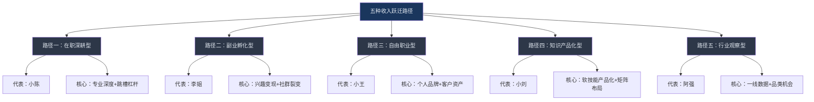
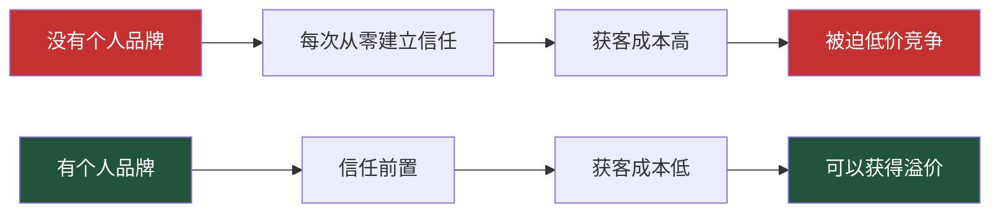
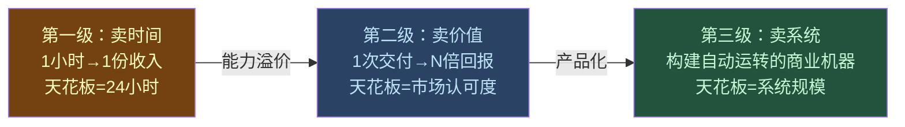
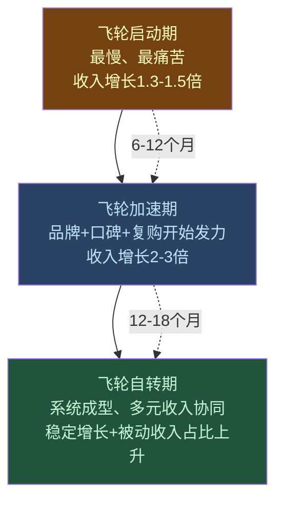
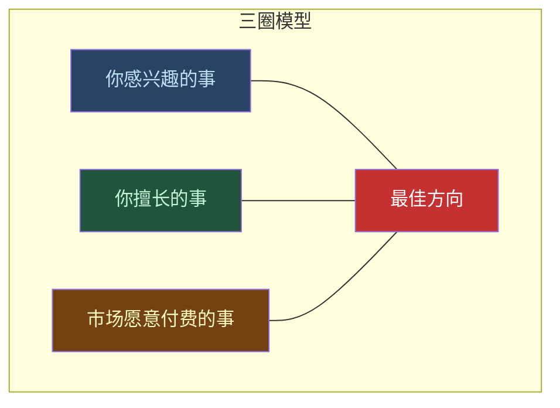
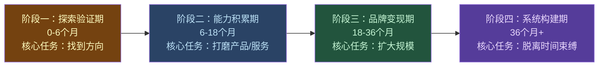
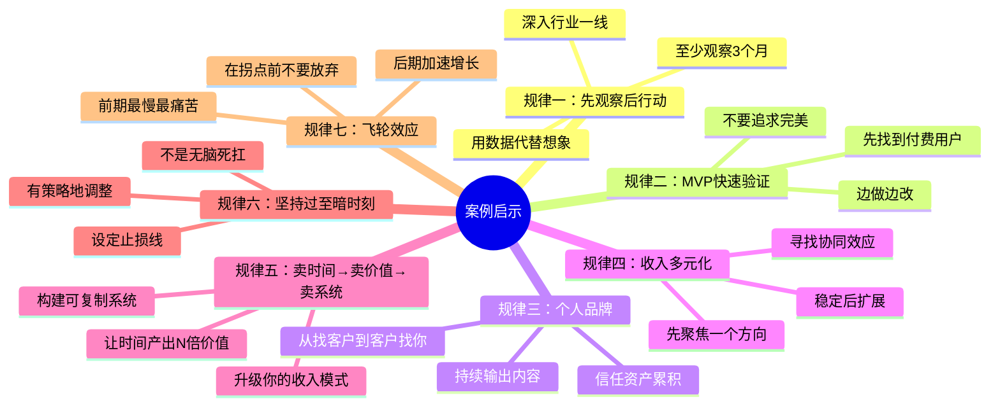

## 从这些案例中我们可以学到什么

五个案例，五种完全不同的起点和路径，却通向了同一个终点——收入的系统性跃迁。在逐一了解了程序员小陈、烘焙创业者李姐、设计师小王、知识付费创业者小刘和餐饮创业者阿强的故事之后，我们需要做的不是简单地"被激励"，而是**提炼出可复制的底层规律**。

本节将从三个维度展开分析：**横向对比**（找出共性规律）、**纵向深挖**（构建通用模型）、**个体应用**（落到你的行动方案）。

---

### 一、五位主角的全景对比：数据说话

在分析规律之前，先把五个案例的关键数据放在同一张表里，让数据自己"说话"。

#### 1.1 起点与终点的硬数据对比

| 维度 | 小陈（程序员） | 李姐（烘焙） | 小王（设计师） | 小刘（知识付费） | 阿强（餐饮） |
|------|---------------|-------------|--------------|----------------|-------------|
| **起步年龄** | 26岁 | 35岁 | 25岁 | 27岁 | 26岁 |
| **起步学历** | 普通二本 | 大专 | 普通一本 | 普通本科 | 高中 |
| **起步收入** | 月薪8,000 | 0（全职妈妈） | 月薪15,000 | 月薪5,500 | 月入6,500 |
| **最终收入** | 年66万 | 月入3万 | 年40万 | 年60万 | 月入2万+ |
| **收入倍数** | 6.9倍 | ∞（从0起步） | 3.3倍 | 8.6倍 | 3倍 |
| **转型周期** | 4年 | 1.5年 | 2年 | 3年 | 2年 |
| **收入来源数** | 4个 | 2个 | 3个 | 4个 | 2个 |
| **启动资金** | 几乎为零 | 约5,000元 | 几乎为零 | 几乎为零 | 约2万元 |

#### 1.2 转型路径的分类



**关键发现**：五个人没有一个人是"靠运气"成功的。每条路径背后都有清晰的方法论支撑，区别仅在于起点不同，所以选择的路径不同。**这意味着：无论你处在什么位置，都至少有一条路径适合你。**

---

### 二、七大共性规律：所有成功者的底层操作系统

逐一对比五个案例后，我提炼出七个反复出现的核心规律。这些规律不是"鸡汤式感悟"，而是从具体行动中抽象出来的、可验证、可复制的行为模式。

#### 规律一：先观察，后行动——"用脚做调研"远胜于"用脑做假设"

**证据汇总：**

| 案例 | 观察行为 | 观察周期 | 观察成果 |
|------|----------|----------|----------|
| 小陈 | 每天在技术社区观察热门方向、薪资趋势、招聘需求 | 持续1年 | 锁定云原生方向，精准跳槽 |
| 李姐 | 在妈妈社群观察消费偏好、定价承受力、复购节点 | 3个月 | 确定私房烘焙定位和主力产品 |
| 小王 | 用在职身份观察公司设计流程、客户需求、行业报价体系 | 18个月 | 建立完整的自由职业商业模型 |
| 小刘 | 在文员岗位观察同事的效率痛点、愿意付费解决的问题 | 1年 | 找到"职场效率"这个知识付费切入点 |
| 阿强 | 送外卖200+次进出同一家店，记录出餐数据、菜单结构、差评原因 | 8个月 | 发现盖码饭品类机会，复制成功模型 |

**深层机制**：大多数人失败不是因为能力不够，而是因为**用想象代替了数据**。"我觉得这个方向有前途"和"我用8个月的数据证明这个方向有前途"之间的成功率差距，可能超过10倍。

> **核心原则**：在你投入任何时间、金钱和精力之前，先用最低成本获取真实市场数据。观察期不应该少于3个月，最好能深入到行业一线。

**具体方法：如何做"低成本市场调研"**

| 调研方式 | 适用场景 | 成本 | 信息质量 |
|----------|----------|------|----------|
| 蹲点观察 | 餐饮、零售等线下业态 | 时间 | ★★★★★（一手数据） |
| 社群潜伏 | 任何面向C端的业务 | 时间 | ★★★★（用户真实需求） |
| 平台数据 | 电商、知识付费、自由职业 | 时间 | ★★★★（市场容量+竞品） |
| 朋友访谈 | 任何领域 | 一顿饭 | ★★★（初步验证） |
| 付费咨询 | 高决策成本的转型 | 500-2000元 | ★★★（专家视角） |
| 问卷调查 | 产品/服务验证 | 时间 | ★★★（定量数据） |

#### 规律二：从最小可行产品（MVP）起步——不要等到"完美"再出发

**证据汇总：**

| 案例 | MVP版本 | MVP成本 | 从MVP到规模化的时间 |
|------|---------|---------|---------------------|
| 小陈 | 写第一篇技术博客 | 0元，3小时 | 6个月后开始接到咨询邀约 |
| 李姐 | 在朋友圈卖第一个生日蛋糕 | 原料费约80元 | 3个月后月入稳定过万 |
| 小王 | 在闲鱼接第一个设计单 | 0元 | 12个月后客户主动上门 |
| 小刘 | 上线第一门99元课程 | 0元（用免费平台录制） | 18个月后月入过5万 |
| 阿强 | 在自家厨房做第一份盖码饭外卖 | 原料费约50元 | 6个月后日均150单 |

**深层机制**：MVP的核心价值不是"省钱"，而是**快速获取真实反馈**。你可以花6个月"准备"，也可以花6个月"边做边改"——后者的学习速度是前者的5-10倍。因为真实市场给你的反馈，比你自己的任何推演都更准确。

**MVP的设计原则——三要三不要：**

| 要做的 | 不要做的 |
|--------|----------|
| 要快速上线，哪怕粗糙 | 不要花3个月"打磨产品" |
| 要找到愿意付费的第一批用户 | 不要追求"免费用户数" |
| 要收集详细反馈并迭代 | 不要凭自己的想象判断好不好 |

**各领域的MVP清单：**

```text
如果你要做技术副业：
□ 发布第一篇技术文章（掘金/知乎/公众号）→ 0成本
□ 在GitHub创建第一个开源项目 → 0成本
□ 接第一个付费咨询单（100-500元）→ 0成本

如果你要做内容变现：
□ 录制第一节课（手机+免费平台）→ 0成本
□ 写第一篇干货文章发小红书 → 0成本
□ 建一个50人的免费社群 → 0成本

如果你要做服务型副业：
□ 为朋友免费做一单（换真实评价）→ 时间成本
□ 在闲鱼/淘宝挂出第一个服务链接 → 0成本
□ 在目标客户社群发一篇自我介绍 → 0成本

如果你要做线下生意：
□ 先摆摊/在家试做 → 500元以内
□ 在朋友圈/社群预售 → 0成本
□ 找对标门店蹲点观察1个月 → 时间成本
```

#### 规律三：个人品牌是最强的"杠杆资产"——它让你从"找客户"变成"客户找你"

**证据汇总：**

| 案例 | 品牌建设动作 | 品牌带来的具体收益 |
|------|-------------|-------------------|
| 小陈 | 技术博客+GitHub开源项目+技术社区活跃 | 跳槽时有3家公司主动邀约，薪资溢价40%；咨询客户主动上门 |
| 李姐 | 朋友圈持续输出烘焙作品+妈妈社群口碑 | 90%客户来自转介绍，获客成本趋近于零 |
| 小王 | 站酷作品集+设计师社群影响力 | 客户主动找上门，报价权从客户转到自己手中 |
| 小刘 | 免费干货内容（公众号+小红书）→付费课程 | 5万粉丝=持续稳定的获客漏斗，获客成本低于行业均值70% |
| 阿强 | 本地口碑+美团好评率98% | 复购率60%以上，高峰期日均200+单 |

**深层机制**：个人品牌的本质是**将你的信任资产外化和累积**。没有品牌时，每次获客都是"冷启动"，你需要从零建立信任。有品牌后，客户带着信任来找你，你的转化率和客单价都会大幅提升。



**个人品牌建设的"三步阶梯"：**

| 阶段 | 目标 | 具体动作 | 周期 |
|------|------|----------|------|
| 第一步：让别人知道你 | 在目标领域有存在感 | 每周输出1-2篇专业内容；在垂直社群活跃发言；帮别人免费解决问题 | 3-6个月 |
| 第二步：让别人信任你 | 被认为是"靠谱的专业人士" | 积累成功案例和客户评价；输出有深度的原创观点；在行业活动中露面 | 6-12个月 |
| 第三步：让别人追随你 | 成为领域内的"意见领袖" | 出版/系统化课程/公开演讲；建立自己的社群/圈子；被媒体/行业引用 | 12-24个月 |

> **关键提醒**：个人品牌不是"人设"，不是包装出来的假象。它建立在**持续的真实输出**之上。小陈的技术博客写了4年，李姐的烘焙作品每天更新，小王的作品集持续迭代——没有捷径。

#### 规律四：收入多元化是"抗风险"和"加速增长"的双重引擎

**证据汇总：**

| 案例 | 起步时收入来源 | 成熟后收入来源 | 收入结构变化 |
|------|---------------|---------------|-------------|
| 小陈 | 工资（100%） | 工资+咨询+课程+版税 | 单一→四元 |
| 李姐 | 0 | 个人订单+团购/企业订单 | 零→二元 |
| 小王 | 工资（100%） | 接单+课程+模板销售 | 单一→三元 |
| 小刘 | 工资（100%） | 课程+社群+咨询+企业培训 | 单一→四元 |
| 阿强 | 0 | 外卖订单+堂食+团购 | 零→三元 |

**深层机制**：收入多元化的价值有两个层面：

1. **风险对冲**：任何单一收入来源都可能因为市场变化、平台政策、个人状态等原因中断。多个收入来源意味着"东方不亮西方亮"。
2. **增长加速**：不同收入来源之间会产生"协同效应"。小陈的技术博客（品牌）为他的课程（产品）和咨询（服务）持续导流；小刘的免费内容为付费课程和社群持续获客。每个收入来源都在为其他来源"打工"。

**收入多元化的正确顺序（不要一开始就追求多元化）：**

```text
阶段一：聚焦（0→月入1万）
  只做一个方向，集中100%精力把它做到能稳定变现
  
阶段二：扩展（月入1万→3万）
  在第一个方向稳定后，基于已有的能力和客户，发展第二个相关方向
  
阶段三：矩阵（月入3万→5万+）
  多个方向形成协同网络，每个方向为其他方向导流和赋能

关键原则：第二个方向必须和第一个方向有"协同关系"，
而不是完全独立的。否则你只是在做两份工作，而不是在建一个系统。
```

**协同关系的四种类型：**

| 协同类型 | 说明 | 案例 |
|----------|------|------|
| 品牌协同 | 同一个个人品牌为多个产品导流 | 小刘：公众号粉丝→课程+社群+咨询 |
| 能力协同 | 同一套核心能力用于不同场景 | 小王：设计能力→接单+课程+模板 |
| 客户协同 | 同一批客户有多种需求 | 小陈：技术读者→课程学员→咨询客户 |
| 内容协同 | 同一份内容在多个渠道变现 | 李姐：烘焙教程→个人订单+企业团建 |

#### 规律五：从"卖时间"到"卖价值"再到"卖系统"——收入升级的三级火箭

这是五个案例中最深层、最本质的共性规律。每个人的收入跃迁，本质上都经历了三个阶段的跃迁。



**五位主角在三个阶段的具体表现：**

| 案例 | 卖时间（起步） | 卖价值（进阶） | 卖系统（高阶） |
|------|---------------|---------------|---------------|
| 小陈 | 在公司写代码，按月领工资 | 用稀缺技术能力获得高薪+按项目收费的咨询 | 技术博客持续吸引读者→课程自动售卖→版税收入 |
| 李姐 | 亲手做一个蛋糕赚一个蛋糕的钱 | 品牌溢价：同样的蛋糕比市面贵30%仍有稳定客源 | 企业团购+节日礼盒的批量订单（一次谈下→持续出货） |
| 小王 | 接一单做一单，按项目收费 | 用作品集和口碑获得"报价权"，客单价提升3倍 | 设计模板在线售卖（做一次→无限次销售）+课程 |
| 小刘 | 在公司做文员，按月领工资 | 把"职场效率"经验包装成99元课程 | 课程+社群+企业培训的矩阵自动运转 |
| 阿强 | 送外卖，按单赚钱 | 用行业认知找到高毛利品类 | 标准化流程→出餐系统可复制→考虑加盟/开分店 |

> **核心洞察**：大多数人在"卖时间"阶段就停了下来——他们只是在找"更高单价的时间"（比如从月薪5000变成月薪2万），而没有思考"如何让同一份时间产出N倍价值"。真正的收入跃迁，发生在你从"卖时间"切换到"卖价值"的那一刻。

**你的升级路线图：**

```text
诊断：你现在在哪个阶段？

卖时间阶段的特征：
- 收入直接等于"单价 × 时间"
- 停止工作就停止收入
- 想赚更多就必须投入更多时间
- 收入天花板 = 你能工作的最大小时数 × 最高时薪

卖价值阶段的特征：
- 收入取决于你解决问题的价值大小
- 同样的技能，不同场景收费可以差10倍
- 开始有"溢价"：客户愿意为你多付钱
- 收入天花板 = 市场上你能解决的最高价值问题

卖系统阶段的特征：
- 收入开始脱离你个人的时间投入
- 有可复制的流程或可重复售卖的产品
- 系统在你睡觉时也在为你赚钱
- 收入天花板 = 系统的规模和效率
```

#### 规律六：每一个成功者都经历过"至暗时刻"——坚持的本质是"有策略地扛"

**证据汇总：**

| 案例 | 至暗时刻 | 具体表现 | 如何度过 |
|------|----------|----------|----------|
| 小陈 | 跳槽被拒+技术瓶颈 | 投了20份简历只有2个面试，连续3个月技术没有突破 | 回归基础，系统补课；扩大投递范围；接受降维打击的offer作为跳板 |
| 李姐 | 第一个月几乎零订单 | 朋友圈发了30条动态，只卖出3个蛋糕，丈夫开始质疑 | 免费送试吃装收集反馈；调整定价策略；加入妈妈社群做口碑 |
| 小王 | 自由职业第3个月收入断崖 | 两个大客户同时终止合作，月收入从2万跌到5千 | 紧急开拓新渠道（平台接单）；降低生活开支；反思客户结构问题 |
| 小刘 | 第一门课上线3个月只有47人购买 | 投入大量时间制作的课程无人问津，怀疑自己方向选错 | 收集学员反馈重做课程大纲；加大免费内容引流；用社群增强粘性 |
| 阿强 | 开业第2个月差评潮 | 出餐速度跟不上订单量，3天收到15条差评，评分跌到3.8 | 暂停接新单，优化备菜流程；亲自给差评客户打电话道歉+补偿 |

**深层机制**：坚持不是"无脑死扛"，而是**在正确方向上用正确策略扛过低谷期**。五位主角在至暗时刻的共同点是：

1. **没有怀疑方向**——他们之前的市场调研给了他们信心
2. **积极调整策略**——不是重复同样的方法，而是分析问题后换策略
3. **有最低生存底线**——小陈没有裸辞，李姐有丈夫收入兜底，小王有存款缓冲

> **关键认知**：如果你在做一件事的前3个月就看到了明显效果，那这件事大概率已经被很多人做了，竞争会很激烈。**真正有壁垒的机会，往往需要6-12个月才能看到回报**。这期间你需要的不是"信心"，而是"数据"——用数据告诉你方向对不对，而不是凭感觉。

**度过至暗时刻的"三问自检法"：**

```text
当你想放弃时，问自己三个问题：

问题一：我收集到足够多的数据了吗？
- 如果你的样本量<30（比如只发了10篇文章、只做了5个客户），
  你的结论可能是"小样本偏差"
- 行动：再坚持到样本量过50再做判断

问题二：是我的方向错了还是方法错了？
- 方向=你选择的赛道和目标客户
- 方法=你在这个赛道里的具体打法
- 如果方向对但方法错→换方法
- 如果方向错→及时止损，换方向

问题三：我是否有一个"止损线"？
- 给自己设定一个明确的时间/金钱止损线
- 比如："投入不超过6个月+不超过5000元，如果还没起色就换方向"
- 有止损线反而能让你更冷静地坚持
```

#### 规律七：收入跃迁的"飞轮效应"——前期最慢，后期越来越快

**证据汇总：**

| 案例 | 第一年收入增长 | 第二年收入增长 | 第三年收入增长 | 加速倍数 |
|------|---------------|---------------|---------------|----------|
| 小陈 | 8K→12K（1.5倍） | 12K→30K（2.5倍） | 30K→55K（1.8倍） | 从1.5到2.5 |
| 李姐 | 0→8K/月 | 8K→2万/月（2.5倍） | 2万→3万/月（1.5倍） | 从0到2.5 |
| 小王 | 15K→19K（1.3倍） | 19K→33K（1.7倍） | 稳定在33K+ | 从1.3到1.7 |
| 小刘 | 5.5K→8K（1.5倍） | 8K→25K（3倍） | 25K→50K（2倍） | 从1.5到3 |
| 阿强 | 0→8K/月 | 8K→15K/月（1.9倍） | 15K→2万+/月（1.3倍） | 从0到1.9 |



**深层机制**：收入增长不是线性的，而是指数型的——前期很慢，因为你在积累品牌、客户、口碑、经验这些"飞轮燃料"。当这些积累达到临界点后，增长会突然加速。**大多数人恰恰在飞轮即将加速的时候放弃了**——他们觉得自己"努力了半年还没有效果"，殊不知再坚持3个月可能就迎来拐点。

---

### 三、八种起点，八条路径——不同背景的差异化策略

五个案例覆盖了不同背景和起点，但现实中你的情况可能和他们都不完全一样。下面根据"起点条件"进行分类，给出最适合你的策略建议。

#### 3.1 起点分类与路径匹配

| 你的起点条件 | 对标案例 | 最适合的路径 | 第一步行动 | 预期回报周期 |
|-------------|----------|-------------|-----------|-------------|
| 有技术/专业技能，在职 | 小陈 | 在职深耕→副业变现 | 梳理技能树，找到稀缺方向，开始输出内容 | 6-12个月 |
| 有手艺/兴趣，时间碎片化 | 李姐 | 兴趣变现→社群裂变 | 在朋友圈/社群展示你的作品，收集反馈 | 3-6个月 |
| 有创意技能（设计/写作/视频），在职 | 小王 | 副业接单→自由职业 | 在平台接第一单，建立作品集 | 6-12个月 |
| 有软技能（沟通/效率/管理），在职 | 小刘 | 知识外化→产品化 | 把你的经验写成文章/录制短视频 | 6-18个月 |
| 低学历/低技能，但有行动力 | 阿强 | 行业观察→找到切入点 | 进入目标行业的一线岗位，边干边观察 | 6-12个月 |
| 高学历，薪资偏低 | 小陈+小王 | 专业深度+个人品牌 | 跳槽到更高平台，同时建立个人品牌 | 3-6个月 |
| 有技能但没有客户 | 小王+李姐 | 内容输出+平台接双管齐下 | 每周发2篇内容+在平台接1单 | 3-6个月 |
| 有客户但没有时间 | 小刘+小王 | 提价+产品化 | 立刻提价20%，同时把服务模板化 | 1-3个月 |

#### 3.2 "三圈模型"快速定位你的方向

在选择具体路径之前，用"三圈模型"找到你的最佳切入点——**兴趣、技能和市场需求的交集**。



**五位主角的三圈分析：**

| 案例 | 兴趣圈 | 技能圈 | 市场需求圈 | 交集 |
|------|--------|--------|-----------|------|
| 小陈 | 对技术有好奇心 | Java开发+算法能力 | 云原生人才稀缺 | 技术深度内容+高端咨询 |
| 李姐 | 喜欢烘焙和美食 | 厨房基本功+细心 | 社区烘焙需求旺盛 | 私房烘焙+社群服务 |
| 小王 | 热爱设计创作 | UI设计+视觉表达 | 中小企业设计需求大 | 自由设计+课程+模板 |
| 小刘 | 喜欢整理和分享 | Excel+沟通+组织能力 | 职场效率焦虑普遍 | 知识付费+咨询+培训 |
| 阿强 | 无特别兴趣（但有强烈改变欲望） | 吃苦耐劳+数据敏感 | 餐饮外卖需求稳定 | 盖码饭外卖 |

**找到你的三圈交集——实操练习：**

```text
步骤一：列出你的兴趣（至少5项）
  1. _______________
  2. _______________
  3. _______________
  4. _______________
  5. _______________

步骤二：列出你的技能（至少5项，包括工作技能和生活技能）
  1. _______________
  2. _______________
  3. _______________
  4. _______________
  5. _______________

步骤三：验证市场需求
  对每项兴趣和技能：
  - 在小红书/抖音搜索相关内容，看点赞量和评论数
  - 在淘宝/闲鱼搜索相关服务，看销量和价格
  - 在招聘平台搜索相关岗位，看薪资范围
  - 在你的社交圈里问3个人："你愿意为___付费吗？"

步骤四：找到交集
  选择1-2个同时满足"我喜欢、我擅长、市场愿意付费"的方向
  作为你的起步方向
```

---

### 四、从案例中提炼的"收入跃迁路线图"

把五个案例的共同阶段抽象出来，形成一张通用的收入跃迁路线图。无论你选择哪条路径，都会经历以下四个阶段。

#### 4.1 四阶段模型



| 阶段 | 核心任务 | 关键动作 | 典型收入 | 最常见的放弃点 |
|------|----------|----------|----------|---------------|
| 探索验证期 | 找到方向，验证可行性 | 市场调研+MVP测试+收集反馈 | 0-3000元/月 | "做了2个月没效果" |
| 能力积累期 | 打磨产品/服务，积累口碑 | 持续输出+优化迭代+建立案例库 | 3000-10000元/月 | "收入太低不值得继续" |
| 品牌变现期 | 扩大规模，多元化收入 | 个人品牌+提价+开发新产品 | 1万-5万元/月 | "太忙了没时间扩展" |
| 系统构建期 | 构建可脱离个人时间的系统 | 团队化+产品化+自动化 | 5万元/月+ | "管理太累了" |

#### 4.2 每个阶段的"里程碑"和"红线"

**阶段一：探索验证期（0-6个月）**

| 里程碑（达到说明方向对了） | 红旗（达到应该考虑换方向） |
|--------------------------|--------------------------|
| 有至少10个陌生人愿意了解你的产品/服务 | 投入3个月仍无人问津（连免费试用都没人要） |
| 至少有1个人愿意付费（哪怕只付1元） | 连续2个月投入时间>20h/周但零收入 |
| 收集到至少20条具体反馈 | 负面反馈集中指向"方向性问题"而非"执行细节" |
| 你能用一句话说清楚"我为谁解决什么问题" | 你无法回答"你的目标客户是谁" |

**阶段二：能力积累期（6-18个月）**

| 里程碑（达到说明走在正确轨道上） | 红旗（需要调整策略） |
|--------------------------------|---------------------|
| 稳定客户数超过10个 | 客户数始终<5，增长停滞 |
| 复购率超过30% | 复购率<10%，客户用完就走 |
| 月收入稳定超过5000元 | 月收入波动超过50%（忽高忽低） |
| 客户开始主动给你转介绍 | 100%靠自己找客户，无转介绍 |

**阶段三：品牌变现期（18-36个月）**

| 里程碑（达到说明品牌开始发力） | 红旗（需要加大品牌投入） |
|------------------------------|------------------------|
| 有客户主动找上门 | 100%靠自己找客户 |
| 能够提价20%以上且不流失客户 | 提价就流失客户，说明品牌价值不够 |
| 月收入稳定超过2万元 | 收入增长主要靠"做更多单"而非"提价+复购" |
| 至少有2个收入来源 | 仍然100%依赖单一收入来源 |

**阶段四：系统构建期（36个月+）**

| 里程碑（达到说明系统成型） | 红旗（说明还在"卖时间"） |
|--------------------------|------------------------|
| 被动/半被动收入占比超过30% | 100%收入都需要你亲自参与 |
| 有团队或外包帮你处理执行层工作 | 所有事情都自己做 |
| 你能离开2周业务不受影响 | 你休息1天收入就下降 |
| 月收入稳定超过5万元 | 收入天花板明显，增长停滞 |

---

### 五、案例背后的"反面教训"——成功者差点犯的错误

除了正面规律，五个案例中也暴露了一些"差点翻车"的时刻，这些反面教训同样值得警惕。

#### 5.1 五个差点致命的错误

| 案例 | 差点犯的错误 | 后果（如果没纠正） | 纠正方法 |
|------|-------------|-------------------|----------|
| 小陈 | 前期只顾技术深度，忽略了"软技能"和影响力 | 变成"很牛但没人知道"的工程师，薪资天花板依然很低 | 在提升技术的同时开始写博客、做分享 |
| 李姐 | 前期定价太低，"友情价"亏本卖 | 越做越累，入不敷出，最终放弃 | 用"成本+合理利润"公式重新定价 |
| 小王 | 自由职业初期接了太多低价单，把自己累垮 | 收入看似不错但时薪低于打工，失去自由职业的意义 | 设定最低接单价，拒绝低于底线的单子 |
| 小刘 | 第一门课追求"大而全"，做了100节课 | 制作周期过长（6个月），市场窗口期错过 | 先做10节课的"迷你课"，验证后再扩展 |
| 阿强 | 开业初期没有做标准化，全凭手感 | 质量不稳定导致差评，口碑崩塌 | 建立标准化操作手册（SOP），控制出品质量 |

#### 5.2 最常见的五大思维陷阱

```text
陷阱一："等我准备好了再开始"
  → 你永远不会"准备好"。先开始，边做边学。
  → 小刘的第一门课只录了10节就上线了；阿强只存了2万就开干了。

陷阱二："这个方向已经有人做了，我没法做"
  → 有竞争说明有市场。没人做的方向可能根本没需求。
  → 李姐做烘焙时，她所在的城市已经有上千家私房烘焙，但她照样做到了月入3万。

陷阱三："我要先学会所有技能再开始"
  → 学习永远是"边做边学"效率最高。
  → 阿强之前没有任何餐饮经验，他是在送外卖的过程中学会了餐饮经营。

陷阱四："收入增长应该是线性的"
  → 实际增长是指数型：前期很慢，后期加速。
  → 小刘第一年几乎没赚钱，第三年才爆发到年入60万。

陷阱五："我需要很多钱/资源/人脉才能开始"
  → 五个人中四个是零成本或极低成本起步。
  → 小陈写博客0成本，小王接单0成本，小刘录课0成本。
```

---

### 六、立即行动：从"看完"到"做完"的落地指南

看再多案例，不如迈出第一步。以下是根据你当前状态设计的"最小行动清单"。

#### 6.1 今天的行动（10分钟）

```text
□ 写下你最擅长的3个技能（工作技能、生活技能都算）
□ 写下你最感兴趣的3个领域
□ 用三圈模型画出交集（拿张纸画三个圆）
□ 选择1个最有潜力的方向
```

#### 6.2 本周的行动（2小时）

```text
□ 在小红书/抖音/知乎搜索你选定方向的热门内容
  - 记录10个热门内容的标题和数据（点赞、评论、收藏）
  - 分析：他们在解决什么问题？受众是谁？
□ 找到3个和你背景相似的成功案例
  - 研究他们是怎么起步的
  - 记录他们的第一个"产品"是什么
□ 写出你的MVP方案：
  - 我要为谁（目标客户）
  - 解决什么问题（核心价值）
  - 用什么方式（产品/服务形态）
  - 收多少钱（起步定价）
```

#### 6.3 本月的行动（10小时）

```text
□ 学习你选定方向的基础知识（看3-5篇深度文章或1门入门课）
□ 制作/准备你的MVP
□ 找到你的第一批"种子用户"（至少5个人）
□ 获得你的第一笔收入（哪怕只有1元）
□ 收集反馈，写一份"第一周复盘报告"
□ 根据反馈调整策略，决定是否继续
```

#### 6.4 三个月后的检查清单

```text
□ 你是否有稳定的客户/受众？
□ 你的月收入是否超过1000元？
□ 你是否收到了正面反馈和转介绍？
□ 你是否有清晰的"下一步"计划？

如果4个都是YES → 继续加码，进入"能力积累期"
如果3个是YES → 调整细节，再坚持1个月
如果2个以下是YES → 认真评估是否需要换方向
```

---

### 七、本节小结：一张图记住所有规律



> **最后的话**：这五个案例中最让我印象深刻的不是谁赚了多少钱，而是他们起步时的"普通"——二本程序员、全职妈妈、小公司设计师、行政文员、外卖骑手。没有一个人有"先天优势"。他们唯一的共同点是：**在别人还在"想"的时候，他们已经开始"做"了**。完成永远比完美更重要。先开始，再优化。
