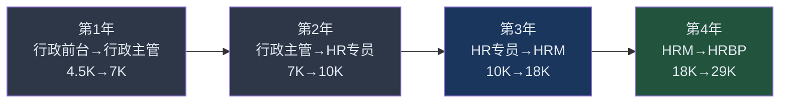
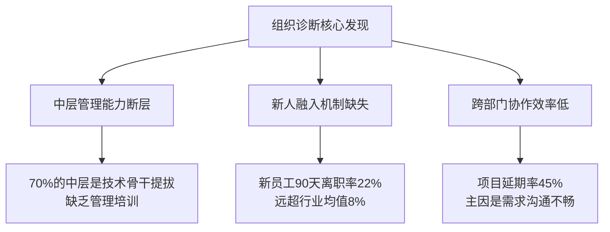
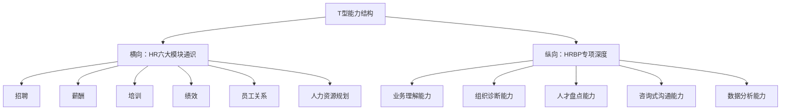

## 案例六：从行政到年薪35万的HRBP小赵

### 案例概览

小赵的故事是"职能岗位跨界转型"的教科书级案例。她没有人力资源管理专业背景，没有名校光环，从一个月薪4500元的行政前台起步，用四年时间完成了一条被很多HR从业者认为"不可能"的路径——转型为年薪35万的HRBP（人力资源业务伙伴）。这个案例的核心价值在于：**它展示了一条清晰的、可复制的"行政→HR→HRBP"进阶路径**，每一步都有明确的能力要求、学习方法和时间节点。

HRBP是近年来人力资源领域最热门的岗位方向，也是HR从业者的高薪赛道。根据猎聘2023年数据，一线城市资深HRBP年薪中位数在30-50万之间，远高于传统HR模块（招聘、薪酬、培训）的同级别岗位。小赵的转型路径揭示了一个关键认知：**HRBP的核心竞争力不是HR专业知识，而是业务理解能力+人际影响力+问题解决能力**——这些恰恰是行政岗位能够积累的隐性能力。

**基本信息一览：**

| 维度 | 初始状态（2019年） | 最终状态（2023年） |
|------|---------------------|---------------------|
| 年龄 | 24岁 | 28岁 |
| 学历 | 普通本科（公共管理） | 不变 |
| 职业 | 行政前台 | HRBP（互联网行业） |
| 月薪 | 4,500元 | 约29,000元（含绩效） |
| 年总收入 | 约5.4万 | 约35万 |
| 收入构成 | 单一工资 | 基本工资+绩效奖金+年终奖 |
| 核心能力 | Excel基础、会务安排 | 组织诊断、人才盘点、业务赋能 |
| 行业影响力 | 无 | HR社群活跃贡献者 |

### 转型全景：四年路径总览

### 第一阶段：行政前台的破局（第1年）

#### 背景与困境

2019年，小赵入职一家200人规模的B2B软件公司，担任行政前台。月薪4500元，工作内容是接电话、收快递、订会议室、做考勤统计。这份工作的天花板肉眼可见——同公司的行政主管月薪也不过7000元，而且岗位流动性低，晋升空间几乎为零。

小赵面临的困境具有普遍性：

| 困境维度 | 具体表现 | 深层影响 |
|----------|----------|----------|
| 技能可替代性高 | 前台工作标准化程度高，培训3天即可上手 | 议价能力几乎为零 |
| 职业天花板低 | 行政线最高就是行政总监，薪资天花板约1.5万 | 收入增长空间有限 |
| 信息茧房 | 前台接触的多是事务性工作，缺乏业务视角 | 难以建立核心竞争力 |
| 社交定位模糊 | 全公司都认识你，但没有人把你当"专业人才" | 个人品牌被定义为"打杂的" |

#### 关键决策：不转行，而是"借壳转型"

小赵最初考虑过转行做销售、考公务员，甚至学编程。但她最终选择了一条更聪明的路径：**不离开公司，而是在现有岗位上主动拓展HR相关工作**。

这个决策的底层逻辑是：

1. **转换成本最低**：不需要辞职、不需要脱产学习、不需要从零开始
2. **机会成本最优**：行政工作本身就有大量与HR交叉的内容（考勤、入离职手续、培训组织）
3. **信任资本可复用**：公司已经认识你，比外部求职者多了"信任红利"

> **核心认知**：很多人把"转行"理解为"从A行业跳到B行业"，但更高效的策略是"在现有平台上做能力迁移"。小赵没有换公司，而是换了岗位——这让她省去了至少1年的适应期。

#### 具体行动拆解

**1. 重新定义行政工作的边界**

小赵做的第一件事，是把行政工作中所有与HR交叉的部分找出来，然后主动承接：

| 行政工作 | 拓展为HR工作的切入点 | 具体动作 |
|----------|----------------------|----------|
| 考勤统计 | → 考勤制度优化建议 | 统计迟到/早退规律，提出弹性工时建议 |
| 入离职手续办理 | → 员工体验优化 | 设计入职欢迎包，优化入职流程SOP |
| 培训会议室预订 | → 培训组织与执行 | 主动承担培训签到、反馈收集、培训档案管理 |
| 办公用品采购 | → 员工福利管理 | 调研员工满意度，优化节日福利方案 |
| 会务安排 | → 企业文化活动策划 | 策划年会、团建、生日会 |

**关键动作举例：** 入职第三个月，小赵主动向行政总监提出："我想把入职流程标准化，做一个新员工入职手册。"这个手册涵盖了从offer发放到入职第一天的所有环节，包括：IT设备申请清单、工位布置指南、公司文化手册、各部门联络人名单。这份手册后来被全公司采用，也成为小赵简历上的第一个"HR项目"。

**2. 系统学习HR专业知识**

小赵利用下班时间开始系统学习HR知识，她的学习路径经过精心设计：

| 时间段 | 学习内容 | 学习资源 | 产出 |
|--------|----------|----------|------|
| 第1-2月 | HR六大模块概论 | 《人力资源管理》（加里·德斯勒） | 整理思维导图，建立知识框架 |
| 第3-4月 | 劳动法基础 | 《劳动合同法实务操作》+中国法院网案例 | 整理常见劳动纠纷应对清单 |
| 第5-6月 | Excel进阶+数据分析 | B站"王佩丰Excel"全集 | 能独立做薪酬分析、人员结构分析 |
| 第7-8月 | 招聘全流程 | 《聘谁》+实操模拟 | 练习结构化面试，设计面试评估表 |
| 第9-12月 | 考证：企业人力资源管理师（三级） | 教材+刷题 | 获得证书，系统补全知识短板 |

**学习方法的关键细节：**

小赵没有"只看书不动手"。她每学一个模块，就在公司里找机会实践：

- 学完招聘模块后，主动帮HR部门筛选简历（当时公司HR部门只有3人，招聘压力大）
- 学完薪酬模块后，用Excel做了一份公司薪资结构分析报告（匿名化处理），发现了薪资倒挂问题
- 学完培训模块后，设计了一份"新员工30天融入计划"并提交给HR部门

**3. 用"借力"策略突破岗位限制**

小赵面临一个现实问题：行政前台没有HR部门的正式编制，如何获得HR工作的"入场券"？

她的策略是**先成为HR部门的"编外助手"**：

- 每天中午和HR部门的人一起吃饭，了解她们的工作痛点
- 主动帮忙处理HR部门的事务性工作（如批量打印合同、整理档案）
- 参加HR部门的周会（以"行政配合"的名义旁听）
- 在公司内部培训中担任HR部门的活动协调人

三个月后，HR部门缺人手时，小赵成为第一人选。不是因为她"关系好"，而是因为**她已经证明了自己的HR工作能力**。

#### 阶段成果

| 指标 | 第1年初 | 第1年末 |
|------|---------|---------|
| 岗位 | 行政前台 | 行政主管 |
| 月薪 | 4,500元 | 7,000元 |
| HR相关项目参与 | 0个 | 5个 |
| 专业证书 | 无 | 企业人力资源管理师三级 |
| HR知识体系 | 零基础 | 六大模块基本框架 |

**涨薪关键：** 小赵从4500涨到7000，不是因为"加班多"，而是因为她主导的入职流程标准化项目让新员工入职时间从2天缩短到半天，HR部门的工作量减少约40%。**用效率提升证明价值，是行政岗最有效的涨薪路径。**

---

### 第二阶段：正式进入HR赛道（第2年）

#### 转岗的关键时刻

第2年初，公司经历了一轮组织架构调整，HR部门从3人扩编到6人。小赵凭借过去一年积累的HR实操经验，成功转岗为HR专员，负责招聘和员工关系模块。

**转岗谈判的实操细节：**

小赵没有被动等待机会，而是主动出击：

1. **准备了一份"能力证明档案"**：将过去一年参与的所有HR项目、完成的工作成果、获得的证书整理成一份PPT
2. **找对了关键决策人**：不是找HR总监（对方可能有自己想招的人），而是找用人部门的业务负责人（他们更看重"能干活"）
3. **提出了"试用期方案"**：主动提出"先以借调形式参与HR工作3个月，如果表现不达标，我回行政岗"——降低了决策风险

> **转岗策略的核心**：不要问"我能不能转"，而要证明"我已经在做了"。小赵转岗时，HR部门的人已经习惯了她的存在，转岗只是"走个手续"。

#### HR专员阶段的能力构建

成为HR专员后，小赵负责两个模块：招聘（60%精力）和员工关系（40%精力）。

**招聘模块的突破：**

小赵做招聘和传统HR有一个本质区别——**她从行政岗来，天然理解"候选人体验"**。

| 传统HR招聘方式 | 小赵的改进方式 | 效果 |
|---------------|---------------|------|
| 电话邀约只说时间和地点 | 增加公司文化介绍+面试官背景+交通指引 | 爽约率从30%降到12% |
| 面试当天才安排会议室 | 提前1天发送面试提醒+公司WIFI密码+茶水安排 | 候选人满意度评分4.8/5 |
| 面试后2周才给结果 | 3个工作日内反馈，无论通过与否 | 公司在招聘平台评分从3.2升到4.5 |
| 入职当天办手续 | 提前3天发送入职大礼包清单，安排入职伙伴 | 新员工30天留存率提升25% |

**员工关系模块的深入：**

小赵在这个模块做了两件关键的事：

**第一，建立了"员工情绪温度计"机制。** 每月匿名收集一次员工满意度（用问卷星），覆盖：工作环境、直属上级、薪资福利、职业发展四个维度。她会将结果整理成可视化报告，标注"红灯指标"（满意度低于60%的维度），提交给管理层。

**第二，处理了第一起劳动纠纷。** 公司辞退一名试用期员工，对方申请劳动仲裁。小赵主动承担了这个case的全流程处理：从证据收集（考勤记录、绩效评估表）、法律条文检索（劳动合同法第39条）、到与对方的协商谈判。最终以调解方式解决，公司仅支付了法定最低补偿。这件事让她在管理层中建立了"靠谱"的形象。

#### 薪资谈判与职级跃迁

第2年末，小赵进行了入职以来最重要的一次薪资谈判。她的策略：

1. **量化工作成果**：
   - 全年完成42个岗位的招聘，平均到岗周期从35天缩短到22天
   - 设计的候选人体验流程使offer接受率从65%提升到85%
   - 处理的劳动纠纷为公司避免了约8万元的仲裁赔偿
   - 建立的员工满意度机制提前发现并解决了3个团队的管理问题

2. **展示"超出岗位要求"的能力**：
   - 主导编写了《员工手册》2.0版本
   - 设计了公司中层管理者的领导力培训课程
   - 建立了HR数据月报体系

3. **提出明确的薪资目标**：不是"希望涨薪"，而是"根据市场调研，HR专员的75分位薪资是10K，我目前的工作产出已达到HRM的水平，期望调整到12K"

最终结果：月薪从7000元调整到10000元。

#### 阶段成果

| 指标 | 第2年初 | 第2年末 |
|------|---------|---------|
| 岗位 | HR专员 | HR专员（储备HRM） |
| 月薪 | 7,000元 | 10,000元 |
| 招聘完成量 | — | 42个岗位/年 |
| 劳动纠纷处理 | 0起 | 3起（全部妥善解决） |
| 专业证书 | 三级 | 二级（企业人力资源管理师） |

---

### 第三阶段：晋升HRM，建立模块化管理能力（第3年）

#### 晋升背景

第3年初，公司业务快速增长（从200人扩张到450人），原来的HR经理因家庭原因离职。公司没有外招，而是内部提拔了小赵担任HRM（人力资源经理）。这个决定背后的原因：

1. 小赵过去两年的表现已经被管理层认可
2. 公司正处于快速扩张期，需要一个"了解公司文化和业务"的HR负责人
3. 外部招聘的HRM需要6个月以上的适应期，而小赵可以立即上手

#### HRM阶段的核心挑战

从HR专员到HRM，最大的变化不是"管更多人"，而是**思维方式从"执行"转向"规划"**。

| 维度 | HR专员思维 | HRM思维 |
|------|-----------|---------|
| 工作导向 | 完成分配的任务 | 主动发现并解决组织问题 |
| 关注焦点 | 单一模块（如招聘） | 六大模块的协同运转 |
| 决策依据 | 领导指示 | 数据分析+业务需求 |
| 影响范围 | 个人KPI | 团队KPI+组织效能 |
| 沟通对象 | 同级、候选人 | 高管、业务负责人 |

#### 小赵在HRM阶段的三大关键动作

**动作一：搭建HR数据体系**

小赵意识到，HR部门在公司的"话语权"低，根本原因是**缺乏数据支撑**。业务部门说"招不到人"，HR只能说"我们在努力"；老板问"人力成本怎么样"，HR只能说"大致还行"。

她用三个月时间建立了一套HR数据看板：

| 数据维度 | 具体指标 | 用途 |
|----------|----------|------|
| 招聘效率 | 各渠道简历转化率、到岗周期、offer接受率 | 优化招聘渠道投放 |
| 人力成本 | 人均产值、人力成本占比、各部门HC使用率 | 支撑预算决策 |
| 人才流动 | 主动离职率、关键岗位流失率、离职原因分布 | 提前预警人才风险 |
| 组织效能 | 人均产出趋势、管理幅度、跨部门协作满意度 | 诊断组织健康度 |
| 培训ROI | 培训覆盖率、课后评估分数、行为改变率 | 证明培训投资回报 |

这套看板让HR部门从"花钱的部门"变成了"用数据说话的部门"。老板在季度review时第一次主动问："你们HR的数据分析做得不错，下个季度的人力规划做得怎么样了？"

**动作二：主导第一次组织诊断**

公司从200人扩张到450人后，出现了典型的"规模病"：部门墙严重、沟通效率下降、新老员工融合困难。小赵主动发起了一次组织诊断项目。

**诊断方法：**
- 一对一深度访谈：覆盖各部门负责人和核心骨干，共32人
- 匿名问卷：全员发放，回收率87%
- 数据分析：离职数据、绩效数据、跨部门项目完成率
- 标杆对比：与同规模同行业的3家公司做组织效能对比

**诊断发现（关键结论）：**

**解决方案与执行：**
- 针对中层管理：设计了"管理者90天加速营"，涵盖目标管理、绩效面谈、团队激励三个模块
- 针对新人融入：升级为"新员工180天陪伴计划"，增加入职伙伴制、30/60/90天check-in
- 针对跨部门协作：引入OKR体系，用目标对齐机制替代"部门KPI各自为政"

**动作三：薪资体系重构**

公司快速扩张期间出现了严重的"薪资倒挂"问题——新招的人薪资比老员工高20-30%，导致核心老员工不满。小赵主导了一次薪资体系重构：

1. **市场调研**：采购了2家薪酬调研报告（中智、太和），对标同行业同规模企业
2. **岗位价值评估**：用海氏评估法（Hay Method）对所有岗位进行价值排序
3. **宽带薪酬设计**：将原来的"固定薪资"改为"宽带薪酬"，每个岗位设置P25-P50-P75三个分位值
4. **调薪规则制定**：明确年度调薪的触发条件（绩效+司龄+能力评估）和调薪幅度
5. **过渡方案**：对现有"薪资倒挂"的员工进行一次性调整，分3个月平滑过渡

这套方案实施后，核心岗位的主动离职率从18%降到8%，年节省的招聘成本约15万元（按每人招聘成本5000元计算）。

#### 阶段成果

| 指标 | 第3年初 | 第3年末 |
|------|---------|---------|
| 岗位 | HR专员 | HRM |
| 月薪 | 10,000元 | 18,000元 |
| 团队规模 | 无 | 4人（招聘1人+HRBP助理1人+薪酬1人+培训1人） |
| 管理幅度 | — | 450人公司的HR全模块 |
| 关键项目 | 0 | 组织诊断+薪资重构+管理者培训 |
| 专业证书 | 二级 | 一级（企业人力资源管理师） |

---

### 第四阶段：转型HRBP，实现年薪35万（第4年）

#### HRBP与传统HRM的本质区别

小赵在第3年末做了一个关键的自我评估：**HRM的能力天花板在哪里？**

她发现，传统HRM的核心能力是"模块管理"——做好招聘、薪酬、培训、员工关系等HR职能工作。但这种能力在互联网行业正在被两个趋势冲击：

1. **HR三支柱模型的普及**：越来越多的公司采用COE（专家中心）+ SSC（共享服务中心）+ HRBP（业务伙伴）的模式，传统HRM的模块管理工作被COE和SSC承接，HRM如果不转型，会逐渐被边缘化
2. **AI对事务性HR工作的替代**：简历筛选、考勤统计、薪资核算等工作正在被AI工具替代，纯事务型HR的价值在下降

**HRBP的核心价值在于：不是"做HR的事"，而是"用HR的方法解决业务的问题"。**

| 维度 | 传统HRM | HRBP |
|------|---------|------|
| 工作导向 | HR专业模块 | 业务需求驱动 |
| 核心能力 | HR专业知识 | 业务理解+HR专业+咨询能力 |
| 价值体现 | "HR工作做得好" | "帮业务解决了问题" |
| 薪资天花板 | 20-25万（二线城市） | 35-60万（二线城市） |
| 不可替代性 | 中（事务性工作易被替代） | 高（需要深度业务理解） |

#### 小赵的转型策略

**策略一：选择一个业务线"贴身服务"**

小赵没有"什么都管"，而是选择了公司的核心业务线——销售部门（占公司营收80%）作为自己的HRBP试点。

**为什么选销售部门？**
- 销售部门是公司最"痛"的地方：流动率高（年化50%+）、招聘量大、绩效管理复杂
- 销售团队的数据最透明：成交额、转化率、客户满意度都有清晰数据，HRBP的价值容易量化
- 销售总监是公司最有话语权的业务负责人之一，搞定他就等于"被业务认可"

**具体做法：**
- 每周参加销售部门的周会，了解业务痛点
- 和销售团队一起拜访客户（每月1-2次），理解业务本质
- 分析销售部门的人员数据：哪些人业绩好？哪些人快离职了？离职原因是什么？

**策略二：用"业务语言"替代"HR语言"**

小赵做了一个重要的调整：不再用HR术语和业务负责人沟通，而是用业务指标来呈现HR工作的价值。

| HR语言（低效） | 业务语言（高效） |
|---------------|-----------------|
| "我们优化了招聘流程" | "销售新人到岗周期从45天缩到25天，预计本月多产出30万营收" |
| "我们做了员工满意度调查" | "销售团队满意度最低的3个维度直接影响了22%的离职率" |
| "我们设计了培训课程" | "新人销售的3个月留存率从55%提升到78%，节省重复招聘成本约12万" |
| "我们调整了绩效方案" | "新绩效方案上线后，Top Sales的月均成交额提升了18%" |

**策略三：主导"销售铁军"项目**

小赵在HRBP岗位上主导的第一个战略级项目，是"销售铁军"——一个覆盖销售团队选、育、用、留全周期的人才管理体系。

**项目内容：**

**1. 选（精准招聘）**
- 通过分析Top Sales的画像（性格测试、背景特征、面试表现），建立了"销售人才胜任力模型"
- 用这个模型优化面试评估表，将销售新人的3个月留存率从55%提升到78%
- 建立了"销售人才蓄水池"：与3所高校建立实习合作，提前锁定潜力人才

**2. 育（系统培训）**
- 设计了"销售新人90天训练营"，涵盖产品知识、客户沟通、谈判技巧、CRM使用四个模块
- 引入"师徒制"：每个新人配一个Top Sales作为导师，导师带教成果纳入导师的绩效考核
- 建立了"销售案例库"：将成功和失败的销售案例标准化，作为培训教材

**3. 用（绩效优化）**
- 重新设计了销售绩效方案：从"纯提成制"改为"底薪+阶梯提成+季度奖金"
- 引入了"销售漏斗管理"：用CRM数据监控每个销售的过程指标（拜访量、方案量、成交率）
- 建立了"绩效面谈机制"：每月一次一对一面谈，帮助销售找到业绩瓶颈

**4. 留（人才保留）**
- 识别了"离职预警信号"：连续2个月业绩下滑+出勤异常+满意度评分降低
- 设计了"关键人才保留计划"：对Top 20%的销售提供额外的股权激励、培训机会和职业发展通道
- 建立了"离职面谈标准化流程"：每个离职员工都进行深度面谈，数据汇总后形成"组织改进建议"

**项目成果数据：**

| 指标 | 项目前 | 项目后 | 改善幅度 |
|------|--------|--------|----------|
| 销售部门年化离职率 | 52% | 28% | -46% |
| 新人3个月留存率 | 55% | 78% | +42% |
| 人均月销售额 | 8.5万 | 12.3万 | +45% |
| 招聘到岗周期 | 45天 | 25天 | -44% |
| 销售团队满意度 | 3.2/5 | 4.3/5 | +34% |

**这个项目让小赵在公司内部"一战成名"。** CEO在季度全员大会上专门提到了"销售铁军"项目，称其为"公司年度最具价值的HR项目"。

#### 年薪35万的薪资构成

小赵的年薪35万并非"基本工资35万"，而是一个合理的薪酬组合：

| 薪酬组成 | 金额 | 说明 |
|----------|------|------|
| 月基本工资 | 22,000元 | 12个月，共264,000元 |
| 月绩效奖金 | 7,000元 | 按季度考核发放，全年约84,000元 |
| 年终奖 | 约2个月工资 | 根据公司业绩和个人绩效，约44,000元 |
| **年度总包** | — | **约392,000元** |

实际到手约35万（扣除五险一金和个税后）。

---

### 关键成功因素深度分析

#### 因素一：行政经验的"隐性复利"

很多人把行政工作视为"没有价值的打杂"，但小赵的经历揭示了行政岗的三个隐性优势：

**1. 全公司视角**
行政前台是公司里唯一"每天和所有部门打交道"的岗位。小赵在做前台时，就知道哪个部门加班最多、哪个部门离职率最高、哪个领导最难相处。这种"全局视角"是HRBP最需要的能力。

**2. 服务意识**
行政工作的本质是"服务"——让其他人工作更顺畅。这种服务意识迁移到HRBP工作中，就是"以业务需求为中心"的工作方式，而不是"以HR专业为中心"的本位主义。

**3. 细节敏感度**
做行政的人对细节的敏感度远高于其他岗位。小赵后来做候选人体验优化、入职流程设计时，那些"贴心的细节"都源于行政工作培养的本能。

#### 因素二：能力积累的"T型结构"

小赵的能力发展呈现一个清晰的"T型"结构：

**横向宽度**保证了她能理解HR各模块的运转逻辑，不会"只懂招聘不懂薪酬"；**纵向深度**保证了她在HRBP这个方向上有足够的专业壁垒。

#### 因素三：每个阶段都有"标志性成果"

回顾小赵四年的路径，每个阶段都有一个"标志性成果"——这是她能持续晋升的核心原因：

| 阶段 | 标志性成果 | 证明的能力 |
|------|-----------|-----------|
| 第1年 | 入职流程标准化+三级证书 | 学习能力+主动性 |
| 第2年 | 候选人体验优化+劳动纠纷处理 | HR专业能力+问题解决 |
| 第3年 | 组织诊断+薪资体系重构 | 系统思维+变革管理 |
| 第4年 | "销售铁军"项目 | 业务理解+战略HRBP |

> **核心认知**：在职能岗位上，"做了什么"比"做了多久"重要100倍。没有标志性成果的10年经验，不如有成果的3年经验值钱。

#### 因素四：精准的"借势"策略

小赵四年内实现了三次关键"借势"：

1. **借公司扩张之势**：公司从200人到450人的快速增长，创造了HR部门扩编的机会
2. **借前任离职之势**：HR经理离职创造了内部晋升的机会
3. **借组织变革之势**：公司引入HR三支柱模型创造了HRBP岗位的机会

**这不是"运气好"，而是"在正确的位置等风来"。** 如果小赵没有在行政岗上主动积累HR能力，当机会出现时她不会是候选人。

---

### 常见误区与避坑指南

**误区一："我是行政出身，HR不认我"**

真相：HR行业没有严格的"专业门槛"。根据智联招聘数据，约35%的HR从业者是非人力资源专业出身。小赵用行动证明：一个有HR证书+实操经验+业务理解能力的行政人，比一个只有人力资源管理学位但没有实操能力的应届生更有竞争力。

**误区二："考了证就能转型"**

真相：证书是必要条件，但远不是充分条件。小赵考了一级人力资源管理师证书，但她明确说："证书帮我建立了知识框架，但真正让我拿到HRBP offer的是'销售铁军'项目的实战成果。"很多HR考证族的困境是：证书一堆，简历上却写不出一个有数据支撑的项目经历。

**误区三："HRBP就是HR懂业务"**

真相：HRBP的真正难点不是"懂业务"，而是"让业务信任你"。小赵花了整整半年时间"贴身服务"销售部门，不是为了"学业务知识"，而是为了建立信任关系。没有信任基础的HRBP，给业务提任何建议都会被视为"外行指导内行"。

**误区四："做了HR就不能回行政了"**

真相：小赵的转型不是"烧桥式"的——她和行政线的同事关系依然很好。事实上，她的行政经验后来成为HRBP工作的独特优势。**转型不是非此即彼，而是能力的叠加和迁移。**

**误区五："薪资谈判靠口才"**

真相：小赵每次涨薪都用数据说话。她的"薪资谈判工具包"包含：
- 个人工作成果量化表（用数字呈现价值）
- 市场薪资调研数据（用外部标准锚定目标）
- 同行业同岗位薪资分位数据（用对标证明合理性）

**没有数据支撑的薪资谈判，本质上是在"求施舍"；有数据支撑的薪资谈判，是在"平等交换"。**

---

### 行政岗转型HR的可复制方法论

小赵的路径虽然有其特殊性，但核心方法论是可以复制的：

#### 转型准备度自评表

在决定转型前，用以下维度评估自己的准备度：

| 评估维度 | 1分（未准备） | 3分（部分准备） | 5分（充分准备） |
|----------|--------------|-----------------|-----------------|
| HR知识储备 | 完全不了解HR六大模块 | 了解概念但未系统学习 | 已考取HR证书或系统学完课程 |
| 实操经验 | 只做过事务性行政工作 | 做过1-2个HR交叉项目 | 有3个以上HR项目完整经历 |
| 业务理解 | 不了解公司业务模式 | 了解本部门业务 | 理解公司商业模式和行业竞争格局 |
| 数据分析 | 只会基础Excel | 能做数据透视表和图表 | 能独立做人力数据分析报告 |
| 人际关系 | 只认识行政线同事 | 与HR部门有日常接触 | 与HR部门和1-2个业务部门有信任关系 |
| 学习能力 | 每周学习时间<2小时 | 每周学习2-5小时 | 每周稳定学习5小时以上 |

**总分20分以上：可以开始转型行动**
**总分15-19分：需要3-6个月的准备期**
**总分15分以下：建议先在现有岗位上积累6-12个月**

#### 四步转型路径

| 步骤 | 目标 | 关键动作 | 时间周期 |
|------|------|----------|----------|
| 第一步 | 在行政岗位上建立HR能力 | 主动承接HR交叉工作+考取HR证书 | 6-12个月 |
| 第二步 | 获得HR岗位的正式机会 | 内部转岗或跳槽到HR专员/助理 | 3-6个月 |
| 第三步 | 建立HR专业深度 | 主导1-2个HR项目+形成模块化管理能力 | 12-18个月 |
| 第四步 | 转型HRBP | 选择一个业务线深度服务+用业务语言呈现价值 | 12-24个月 |

#### 行政岗可直接积累的HR能力清单

不要等到"转了HR岗位"才开始积累。以下能力可以在行政岗上直接培养：

| 能力 | 行政岗的培养方式 | 对应HRBP能力 |
|------|-----------------|-------------|
| 流程优化 | 优化办公用品采购流程、会议室管理流程 | 流程设计与变革管理 |
| 数据统计 | 考勤数据统计、费用报销数据分析 | 人力资源数据分析 |
| 活动策划 | 年会、团建、生日会策划执行 | 培训组织与企业文化建设 |
| 沟通协调 | 跨部门协调、来访接待、会议安排 | 跨部门沟通与影响力 |
| 制度编写 | 编写行政管理制度、SOP | 制度设计与员工手册编写 |
| 问题解决 | 处理突发事件（设备故障、访客投诉等） | 员工关系处理与危机管理 |

---

### 进阶思考：HRBP赛道的长期价值

**1. HRBP是HR领域薪资天花板最高的方向**

根据猎聘2023年数据，HR各方向的薪资天花板（二线城市）：

| HR方向 | 资深级别年薪 | 天花板原因 |
|--------|-------------|-----------|
| 招聘专员/经理 | 15-25万 | 工作标准化程度高，易被AI和猎头替代 |
| 薪酬绩效经理 | 20-30万 | 专业性强但影响范围有限 |
| 培训经理 | 15-25万 | 效果难以量化，ROI证明困难 |
| HRM（全模块） | 25-40万 | 承上启下但缺乏业务深度 |
| HRBP | 35-60万 | 直接创造业务价值，不可替代性高 |
| HRD/CHRO | 60-150万 | 战略层，需要HRBP经验作为基础 |

**2. HRBP是通往HRD/CHRO的必经之路**

几乎所有HRD（人力资源总监）和CHRO（首席人力资源官）的简历中都有HRBP经历。原因很简单：只有做过HRBP的人，才真正理解"业务需要什么样的HR支持"。

**3. HRBP的能力模型具有高迁移性**

HRBP的核心能力——业务理解、组织诊断、人才管理、咨询式沟通——不仅适用于HR领域，也适用于管理咨询、组织发展（OD）、企业培训等方向。即使未来不在HR领域发展，这些能力也是高价值的通用能力。

**4. AI时代HRBP的不可替代性**

2024年后的HR行业正在经历AI冲击：
- AI可以筛选简历、生成JD、做薪酬对标——替代了HR专员的部分工作
- AI可以分析员工数据、预测离职风险——替代了HR分析师的部分工作
- **AI无法替代的是：与业务负责人的深度对话、组织文化的塑造、复杂人际关系的处理、变革管理中的情绪安抚**——这些恰恰是HRBP的核心工作

> **结论：小赵选择HRBP方向，不仅是当下高薪的选择，更是面向未来的高确定性职业路径。** 对于行政岗从业者来说，"行政→HR→HRBP"是一条风险可控、回报可观的转型路径。关键在于：不要只做"岗位转换"，而要做"能力升级"——每一步都要有标志性的成果证明自己的价值。
