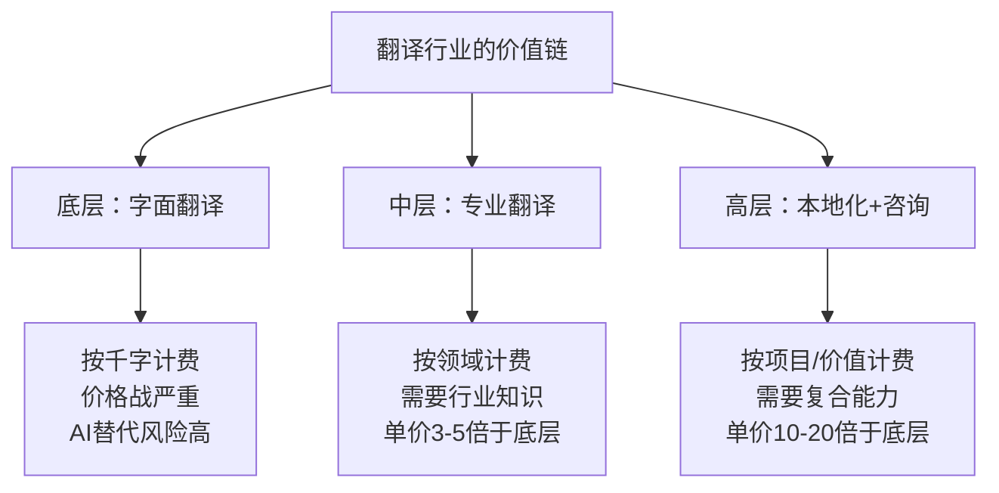
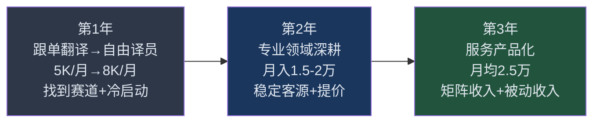
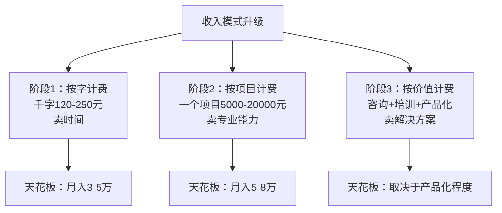
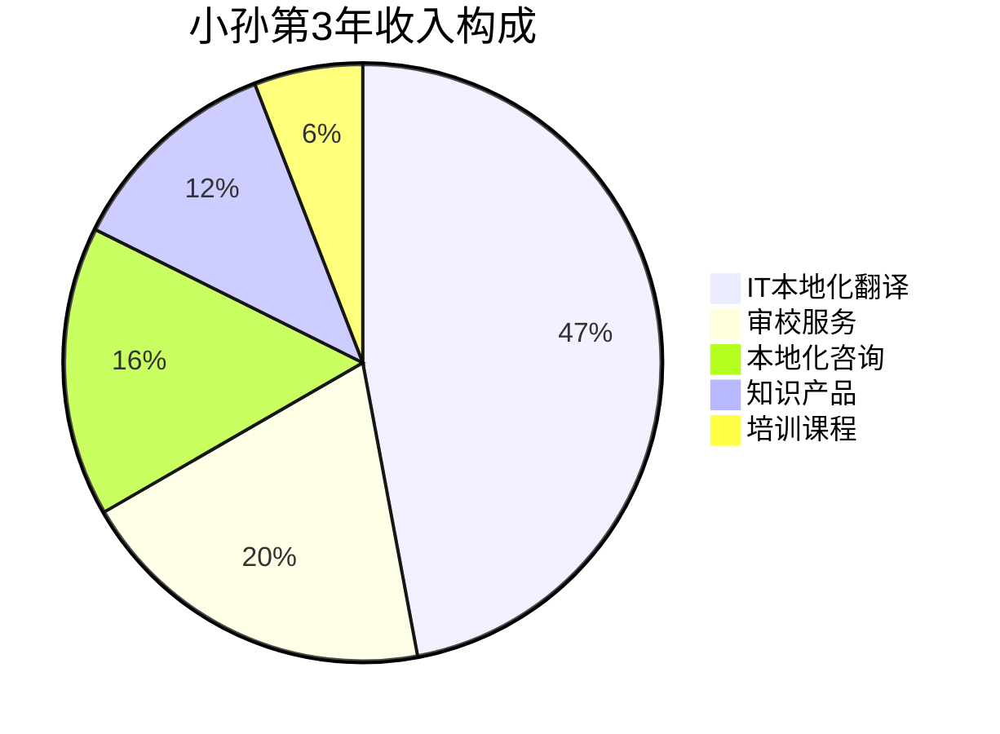
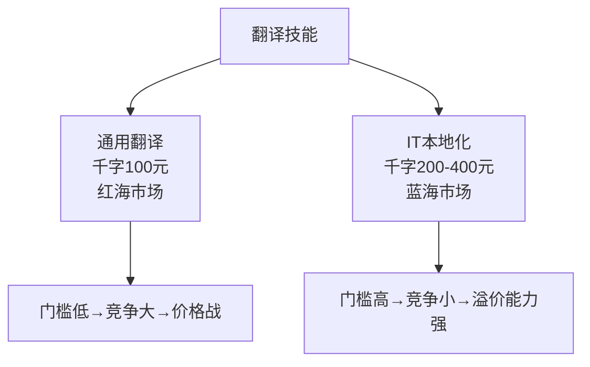
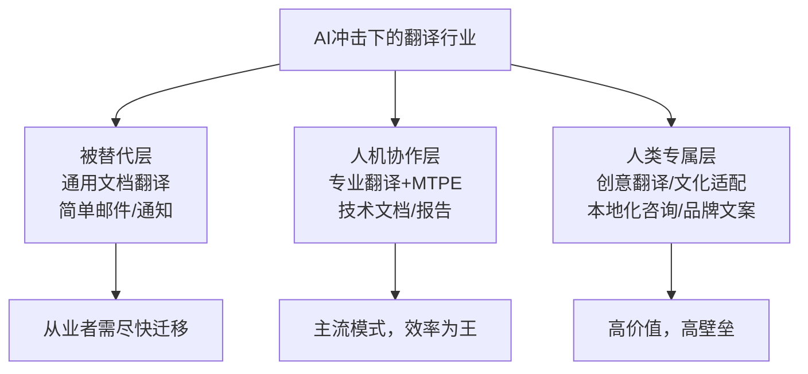

## 案例七：从月薪5000到自由翻译年入30万的小孙

### 案例概览

小孙的故事是"语言技能变现"的典型样本。她是英语专业毕业生，在一家小型外贸公司做跟单翻译，月薪5000元，工作内容机械重复，几乎没有成长空间。但她找到了一条清晰的路径——**从"被动接单翻译"到"主动构建自由翻译事业"**，用三年时间将年收入从6万提升到30万，并且实现了时间自由。

这个案例的特殊价值在于：它证明了**语言技能的变现天花板远高于大多数人的想象**。翻译行业不是"死工资"的代名词，关键在于你选择哪条赛道、用什么策略获客、以及如何构建产品化的服务模式。小孙的路径对所有拥有外语技能（英语、日语、韩语等）的人都有直接参考意义。

**基本信息一览：**

| 维度 | 初始状态（2021年） | 最终状态（2024年） |
|------|---------------------|---------------------|
| 年龄 | 25岁 | 28岁 |
| 学历 | 普通本科（英语专业） | 不变 |
| 职业 | 外贸公司跟单翻译 | 自由翻译+本地化顾问 |
| 月薪 | 5,000元 | 约25,000元（月均） |
| 年总收入 | 约6万 | 约30万 |
| 收入来源 | 单一工资 | 译稿+审校+本地化咨询+培训 |
| 工作时间 | 996坐班 | 自主安排，日均6-7小时 |
| 行业影响力 | 无 | 翻译社群活跃成员，有固定客户群 |

### 翻译行业的底层商业逻辑

在进入小孙的具体故事之前，有必要先理解翻译行业的商业本质，因为小孙的每一步决策都建立在这个认知之上。



**翻译行业的三层金字塔：**

| 层级 | 典型工作 | 千字价格 | 年收入天花板 | AI替代风险 |
|------|----------|----------|-------------|-----------|
| 底层：通用翻译 | 一般文档、邮件、通知 | 60-120元 | 8-12万 | 极高 |
| 中层：专业翻译 | 法律合同、医学文献、技术手册、金融报告 | 150-400元 | 20-40万 | 中等 |
| 高层：本地化+咨询 | 软件本地化、游戏本地化、品牌文案、翻译项目管理 | 300-800元+ | 40-80万+ | 较低 |

小孙的转型路径，本质上是从底层向中层、再向高层攀升的过程。

### 时间线与收入增长轨迹



---

### 第一阶段：破局——从"翻译打工人"到"自由译员"（第1年）

#### 背景与困境

2021年初，小孙在一家小型外贸公司做跟单翻译，月薪5000元。工作内容包括：翻译客户邮件、产品说明书、合同条款，偶尔陪同老板参加展会做口译。每天工作10小时以上，周末经常加班，但收入纹丝不动。

**小孙的核心困境：**

| 困境维度 | 具体表现 | 深层影响 |
|----------|----------|----------|
| 收入瓶颈 | 行业内跟单翻译薪资天花板约7000元 | 经济压力大，存款几乎为零 |
| 技能天花板 | 日常翻译内容重复，技术含量低 | 三年工作经验≈一年经验重复三次 |
| 时间困境 | 996坐班制，没有时间拓展副业 | 无法验证外部市场需求 |
| 价值错配 | 公司认为翻译是"辅助岗位"，不产生直接收入 | 晋升无望，涨薪困难 |
| AI焦虑 | ChatGPT等工具已能处理简单翻译 | 担心被替代，但不知如何升级 |

小孙尝试过的"副业"没有走通：

- **兼职翻译平台接单**：在某翻译平台注册，千字报价80元，扣掉平台佣金后时薪不到30元，比上班还低
- **教英语**：在某在线教育平台兼职，每课时50元，一周只能排2-3节课
- **代购/微商**：发了一个月朋友圈，只成交了3单，发现自己不适合销售

#### 关键转折：重新定义"翻译"的价值

小孙的转折点来自一次偶然的行业接触。2021年4月，公司接了一个医疗器械出口项目，需要翻译FDA申报材料。小孙的直属领导（外贸经理）问她能不能做，小孙坦白说没做过。领导花了15000元请了一家专业翻译公司完成。

这件事让小孙意识到两个关键事实：

1. **同样是"翻译"，FDA材料翻译的千字价格是普通文档翻译的10倍以上**
2. **专业领域的翻译需求旺盛，但能做的人少**

她开始系统调研翻译行业的细分赛道：

| 翻译细分领域 | 市场需求 | 从业者数量 | 千字价格 | 入门难度 | 小孙评估 |
|-------------|---------|-----------|---------|---------|---------|
| 法律翻译 | 高 | 多 | 150-300元 | 高（需法律知识） | 暂不考虑 |
| 医学/医药翻译 | 高 | 少 | 200-500元 | 高（需医学背景） | 中期目标 |
| 金融/财务翻译 | 高 | 中 | 150-350元 | 中（需金融术语） | 备选 |
| IT/软件本地化 | 极高 | 少 | 180-400元 | 中（需技术理解） | ⭐首选 |
| 游戏本地化 | 高 | 少 | 150-350元 | 中低 | 备选 |
| 电商产品文案 | 极高 | 多 | 80-200元 | 低 | 短期过渡 |

**选择IT/软件本地化的理由：**

1. **市场需求最大**：中国软件出海浪潮（SaaS、游戏、工具类App），本地化需求爆发式增长
2. **从业者少**：IT本地化需要"懂技术+英语好"的复合能力，纯英语专业的人做不了
3. **AI替代难度高**：软件本地化涉及上下文理解、文化适配、UI适配，不是简单的文字翻译
4. **小孙有切入点**：她在外贸公司接触过产品说明书翻译，有一定技术文档基础

#### 市场验证：用最小成本测试

小孙没有贸然辞职，而是利用下班时间做了四项验证：

**第一步：学习IT本地化基础知识（2周）**

| 学习内容 | 资源 | 花费 | 产出 |
|----------|------|------|------|
| 本地化行业概论 | 《本地化入门》（本地化世界网） | 0元 | 建立行业认知框架 |
| CAT工具入门 | memoQ/Trados免费试用版 | 0元 | 掌握翻译记忆库、术语库基本操作 |
| IT术语积累 | Microsoft语言门户（免费术语库） | 0元 | 整理500+常用IT术语对照表 |
| 本地化实操 | B站"本地化翻译实战"系列 | 0元 | 了解软件翻译的实际工作流 |

**第二步：无偿/低价试译（3周）**

小孙在三个渠道找到了试译机会：

- **翻译公司试译**：向5家翻译公司投递简历+试译稿，3家通过（试译稿免费）
- **众包平台**：在Gengo、Translated等国际平台上完成入门测试，获得接单资格
- **朋友介绍**：通过大学同学介绍，帮一个创业团队免费翻译了App的200条UI文本

**试译结果：** 3家翻译公司中有2家开始给小孙派单，千字报价120-150元。国际平台上的订单时薪约50-80元（按实际翻译速度计算）。

**第三步：验证收入天花板（4周）**

小孙用一个月时间测试了自由翻译的实际收入能力：

| 周次 | 工作时间 | 翻译字数 | 收入 | 时薪 |
|------|---------|---------|------|------|
| 第1周 | 每晚3小时+周末8小时 | 12,000字 | 1,680元 | 约52元/小时 |
| 第2周 | 每晚3小时+周末10小时 | 15,000字 | 2,100元 | 约55元/小时 |
| 第3周 | 每晚4小时+周末10小时 | 18,000字 | 2,520元 | 约53元/小时 |
| 第4周 | 每晚3小时+周末8小时 | 14,000字 | 1,960元 | 约54元/小时 |

**月副业收入：约8,260元**，已经超过主业的5000元。而且这只是用下班和周末的碎片时间做的。

**第四步：评估辞职可行性**

小孙做了一个理性的财务评估：

| 评估维度 | 具体数据 | 结论 |
|----------|---------|------|
| 月基本开支 | 房租2500+生活费2000+其他500=5000元 | 自由翻译月入8000+即可覆盖 |
| 应急储蓄 | 当时存款约15,000元 | 可支撑3个月零收入 |
| 收入增长预期 | 第2-3个月稳定月入8000-10000元 | 可预期 |
| 机会成本 | 主业月薪5000，几乎无增长空间 | 辞职的机会成本很低 |
| 社保问题 | 可以灵活就业身份自缴 | 月缴约1200元 |

**决策：辞职，全职做自由翻译。**

---

### 第二阶段：深耕——建立专业壁垒（第1年下半年至第2年）

#### 辞职后的前三个月：最危险的时期

小孙在2021年8月正式辞职。她后来回忆说，辞职后的前三个月是最焦虑的时期——没有固定收入、没有同事、没有明确的方向感。

**前三个月的实际情况：**

| 月份 | 翻译字数 | 收入 | 客户来源 | 主要挑战 |
|------|---------|------|---------|---------|
| 第1个月 | 35,000字 | 5,250元 | 辞职前积累的翻译公司客户 | 收入不稳定，焦虑感强 |
| 第2个月 | 48,000字 | 7,680元 | +2家新翻译公司 | 开始建立日常节奏 |
| 第3个月 | 55,000字 | 9,350元 | +1个直接客户 | 找到稳定的翻译速度 |

**小孙应对焦虑的具体方法：**

1. **建立"上班"节奏**：每天9:00-12:00、14:00-18:00固定工作，避免自由散漫
2. **每日翻译日志**：记录每天的翻译字数、收入、耗时，用数据对抗焦虑
3. **加入翻译社群**：在微信群、豆瓣小组里和其他自由译员交流，获得归属感
4. **设定最低收入线**：月入低于6000元就启动"紧急方案"（回到翻译公司上班）

#### 选定细分赛道：IT/软件本地化

经过前3个月的"什么都接"阶段后，小孙开始有意识地聚焦。

**聚焦的过程：**

小孙统计了自己过去3个月的翻译订单，发现一个有趣的规律：

| 翻译类型 | 订单占比 | 平均千字价格 | 翻译速度 | 时薪 |
|----------|---------|-------------|---------|------|
| 一般商务文档 | 35% | 100元 | 2500字/小时 | 250元/小时 |
| IT技术文档 | 30% | 160元 | 1800字/小时 | 288元/小时 |
| 软件UI文本 | 20% | 180元 | 1200字/小时 | 216元/小时 |
| 电商产品描述 | 15% | 80元 | 3000字/小时 | 240元/小时 |

**关键发现：** IT技术文档的时薪最高，而且客户满意度也最高（因为小孙的翻译质量好，术语准确）。这意味着她在IT本地化领域有比较优势。

**聚焦策略：**

1. **逐步拒绝低价订单**：从第4个月开始，不再接千字100元以下的一般文档翻译
2. **主动学习IT知识**：系统学习软件开发基础概念（前端/后端/API/SDK/数据库），理解技术文档的上下文
3. **积累术语库**：在memoQ中建立了专门的IT术语库，包含2000+术语对
4. **研究竞品**：分析大厂（Google、Microsoft、Apple）的中文本地化风格，建立自己的翻译风格指南

#### 从翻译公司到直接客户：获客体系搭建

自由翻译的收入天花板取决于客户结构。小孙花了6个月时间，逐步从"依赖翻译公司派单"过渡到"拥有直接客户"。

**客户结构演变：**

| 阶段 | 翻译公司客户 | 直接客户 | 平均千字价格 | 月收入 |
|------|------------|---------|-------------|--------|
| 第1-3个月 | 100% | 0% | 120元 | 5,000-9,000元 |
| 第4-6个月 | 70% | 30% | 150元 | 10,000-13,000元 |
| 第7-12个月 | 40% | 60% | 180元 | 14,000-18,000元 |
| 第13-18个月 | 20% | 80% | 220元 | 18,000-22,000元 |

**获取直接客户的四个渠道：**

**渠道一：LinkedIn个人品牌**

小孙在LinkedIn上建立了专业的翻译者档案，重点做了三件事：

1. **完善Profile**：标题写"IT/Software Localization Specialist | EN→ZH"，而非"Freelance Translator"
2. **定期发布内容**：每周发1-2条关于本地化行业洞察、翻译技巧的帖子（英文）
3. **主动连接目标客户**：搜索"Localization Manager""Internationalization Lead"等岗位的人，发送个性化连接请求

**效果：** 6个月内，LinkedIn带来了8个直接客户，其中3个成为长期客户，月均贡献收入约5000元。

**渠道二：翻译社群+口碑推荐**

小孙加入了多个翻译行业的社群（Proz.com、翻译圈微信群、豆瓣翻译小组），在社群中做三件事：

1. **分享专业知识**：解答新手翻译的问题，分享IT术语翻译经验
2. **互助推荐**：当自己的时间排满时，把订单推荐给同行，同行也会回推
3. **参与行业活动**：参加线上翻译行业沙龙，认识了几个做本地化项目管理的同行

**效果：** 口碑推荐是小孙最稳定的客户来源，占直接客户的40%。"老客户推荐新客户"的获客成本为零，而且信任度最高。

**渠道三：翻译平台的高端定位**

小孙在Proz.com（国际最大的翻译行业平台）上建立了详细档案，并做了差异化定位：

| 普通译员的做法 | 小孙的做法 |
|--------------|-----------|
| 简历写"英语翻译" | 写"IT/Software Localization Specialist" |
| 报价千字60-100元 | 报价千字180-250元 |
| 只展示语言能力 | 展示CAT工具技能+IT行业经验+客户评价 |
| 被动等订单 | 主动投标高价值项目 |

**效果：** Proz.com上带来了5个稳定客户，其中包括2家国际翻译公司（报价高于国内翻译公司30-50%）。

**渠道四：内容营销（中期启动）**

从第8个月开始，小孙在知乎和微信公众号上发布IT本地化相关的文章，主题包括：

- 《软件本地化入门指南：从翻译到本地化的思维转变》
- 《IT术语翻译的10个常见陷阱》
- 《自由翻译如何定价？我的三年定价策略复盘》
- 《AI会取代翻译吗？一个从业者的深度思考》

**效果：** 文章带来了少量直接客户，但更重要的是建立了专业形象，提升了报价的说服力。"你写的那篇本地化指南我看过，很专业"——这句话在客户沟通中出现了很多次。

#### 翻译效率与质量的平衡术

自由翻译的收入公式很简单：**收入 = 千字价格 × 日翻译字数 × 工作天数**。小孙在这三个变量上同时发力。

**翻译效率的提升路径：**

| 阶段 | 日翻译字数 | 翻译方法 | 关键工具 |
|------|-----------|---------|---------|
| 初期 | 4,000-5,000字 | 逐句翻译，查词典 | 有道词典+Google |
| 中期 | 6,000-8,000字 | CAT工具+翻译记忆库 | memoQ+术语库 |
| 成熟期 | 8,000-12,000字 | MTPE（机器翻译后编辑）+记忆库 | DeepL/memoQ+自定义引擎 |

**MTPE（Machine Translation Post-Editing）是小孙效率飞跃的关键。** 她发现，对于IT技术文档，机器翻译（DeepL、Google Translate）的质量已经能达到70-80%的准确率。她的工作从"翻译"变成了"审校+润色"，效率提升了50-80%。

**MTPE工作流程：**

```text
1. 机器翻译初稿（5分钟）
   - 将原文批量导入DeepL/Google Translate
   - 导出机器翻译结果

2. 逐段审校（主要工作量）
   - 检查术语准确性（对照术语库）
   - 修正语法和表达（使译文自然流畅）
   - 处理上下文一致性（同一术语前后统一）
   - 调整格式和排版

3. 通读校对（20-30分钟）
   - 快速通读全文，检查遗漏和不一致
   - 确认格式符合客户要求
```

**质量控制的四个层次：**

| 层次 | 检查内容 | 工具/方法 |
|------|---------|----------|
| 术语一致性 | 同一术语是否前后统一 | memoQ术语库自动检查 |
| 语法正确性 | 基础语法错误 | Grammarly（英文）+人工校对 |
| 表达自然度 | 译文是否读起来像"原生中文" | 朗读法（读出声来检查流畅度） |
| 上下文适配 | 是否理解了原文的技术含义 | 查阅技术文档+与客户确认 |

---

### 第三阶段：产品化——从"卖时间"到"卖价值"（第2年下半年至第3年）

#### 核心认知转变

小孙在第2年末遇到了一个新的瓶颈：**收入增长放缓**。

她发现，自由翻译的收入公式有一个天然天花板——**个人时间有限**。即使她每天翻译10,000字、千字报价250元，月收入上限也只有约5万元（每天工作10小时、每月20天）。而且高强度翻译导致身体和精神疲劳，不可持续。

**破局的关键认知：从"按字计费"到"按价值计费"。**



#### 服务产品化：三个新收入来源

**收入来源一：审校服务（质量把关者角色）**

小孙发现，很多翻译公司和企业需要的不只是"翻译"，更需要"审校"——检查现有译文的质量。审校的时薪远高于翻译：

| 服务类型 | 计费方式 | 小孙的报价 | 时薪 |
|----------|---------|-----------|------|
| 普通翻译 | 千字180-250元 | — | 约300-400元 |
| 专业审校 | 千字100-150元 | 千字120元 | 约500-700元 |
| 质量评估报告 | 按项目500-2000元/份 | 1000元/份 | 约800-1000元 |

**审校服务的获客方式：** 面向翻译公司（它们经常需要外部审校）和有内部翻译团队的企业（需要外部质量监督）。

**收入来源二：本地化咨询（方案设计者角色）**

随着小孙对IT本地化领域的深入理解，她开始提供本地化咨询服务：

| 咨询服务 | 内容 | 定价 | 目标客户 |
|----------|------|------|---------|
| 本地化流程诊断 | 评估企业现有翻译流程的效率和质量 | 3,000-5,000元/次 | 出海SaaS公司 |
| 本地化方案设计 | 制定翻译规范、术语表、风格指南 | 5,000-15,000元/项目 | 中型出海企业 |
| 翻译工具选型 | 评估和推荐CAT/TMS工具 | 2,000-3,000元/次 | 初创公司 |
| 本地化团队搭建顾问 | 帮助企业建立内部翻译团队 | 10,000-20,000元/项目 | 快速成长的出海公司 |

**一个典型的咨询案例：** 某SaaS公司计划将产品推向东南亚市场，但不知道如何做多语言本地化。小孙用2周时间完成了：目标市场语言分析、本地化流程设计、翻译工具推荐、供应商评估标准制定。项目收费12,000元，实际工作时间约30小时，时薪400元。

**收入来源三：知识产品（被动收入）**

小孙在第3年开始将积累的经验产品化：

| 产品 | 形式 | 定价 | 销售渠道 | 月均收入 |
|------|------|------|---------|---------|
| 《IT本地化实战指南》 | 电子书（PDF+epub） | 99元 | 知识星球+微信 | 1,500-2,500元 |
| 翻译效率工具包 | memoQ模板+术语库+SOP | 49元 | 微信公众号 | 800-1,200元 |
| 本地化入门训练营 | 4节直播课+社群 | 299元 | 小鹅通 | 3,000-5,000元（开课时） |

#### 第3年完整收入结构

| 收入来源 | 月均收入 | 年收入 | 占比 | 性质 |
|----------|---------|--------|------|------|
| IT本地化翻译 | 12,000元 | 144,000元 | 48% | 主动收入 |
| 审校服务 | 5,000元 | 60,000元 | 20% | 主动收入（高时薪） |
| 本地化咨询 | 4,000元 | 48,000元 | 16% | 主动收入（高价值） |
| 知识产品销售 | 3,000元 | 36,000元 | 12% | 半被动收入 |
| 培训课程 | 1,500元 | 18,000元 | 6% | 半被动收入 |
| **合计** | **约25,000元** | **约306,000元** | **100%** | — |



**收入结构的健康度分析：**

- **主动收入占比：84%**（翻译+审校+咨询），但时薪从初期的50元提升到了300-400元
- **半被动收入占比：16%**（知识产品+培训），这部分收入不需要持续投入时间
- **收入来源数量：5个**，单一来源占比最高48%，风险分散度良好
- **客户集中度：** 最大单一客户贡献不超过总收入的15%，避免了"大客户依赖"

---

### 关键成功因素深度分析

#### 因素一：精准的"赛道切换"——从通用翻译到IT本地化

小孙最核心的竞争力不是"英语有多好"，而是**她选择了一个高价值赛道并持续深耕**。



**赛道选择的决策框架：**

| 评估维度 | 通用翻译 | IT本地化 | 小孙的选择理由 |
|----------|---------|---------|--------------|
| 市场需求增速 | 低（已被AI冲击） | 高（出海浪潮） | 顺势而为 |
| 供给端竞争 | 激烈 | 温和 | 蓝海优于红海 |
| 价格弹性 | 低（客户比价严重） | 高（客户看重质量） | 有提价空间 |
| 技能壁垒 | 低（会外语就行） | 中高（需懂技术） | 可建立护城河 |
| AI替代风险 | 高 | 中低 | 长期安全 |

#### 因素二：效率工具的深度应用——MTPE方法论

小孙的收入提升有相当一部分来自效率工具的使用。她不是"抗拒AI"，而是"驾驭AI"。

**MTPE（机器翻译后编辑）的投入产出分析：**

| 指标 | 纯人工翻译 | MTPE模式 | 提升幅度 |
|------|-----------|---------|---------|
| 日翻译字数 | 5,000-6,000字 | 8,000-12,000字 | +60-100% |
| 千字耗时 | 20-25分钟 | 10-15分钟 | -40-50% |
| 日收入（千字200元） | 1,000-1,200元 | 1,600-2,400元 | +60-100% |
| 疲劳度 | 高（持续高强度思考） | 中（审校模式更轻松） | 显著降低 |

**小孙的工具链：**

| 工具 | 用途 | 费用 |
|------|------|------|
| DeepL Pro | 机器翻译引擎 | 约150元/月 |
| memoQ translator pro | CAT工具（翻译记忆+术语管理） | 约2000元/年 |
| Grammarly Premium | 英文语法检查 | 约900元/年 |
| Notion | 项目管理+客户CRM | 免费版 |
| Toggl Track | 时间追踪+效率分析 | 免费版 |

#### 因素三：客户结构的持续优化

小孙用了三年时间，将客户结构从"翻译公司派单"优化为"直接客户为主+多元收入来源"。

**客户结构优化的三个原则：**

1. **减少中间层**：每减少一个中间环节，千字价格提升30-50%
2. **提升客户质量**：从"谁给单都接"到"只接匹配度高的客户"
3. **延长客户生命周期**：通过高质量交付和主动沟通，将一次性客户转化为长期客户

**小孙的客户管理方法：**

| 客户等级 | 标准 | 服务策略 | 占比 |
|----------|------|---------|------|
| S级客户 | 月均订单>5000元，合作>1年 | 优先排期、主动沟通、节日问候 | 20% |
| A级客户 | 月均订单>2000元或合作>6个月 | 正常排期、定期回访 | 30% |
| B级客户 | 偶尔下单、合作时间短 | 按标准流程服务 | 40% |
| C级客户 | 低价客户、沟通困难 | 逐步淘汰或转介绍 | 10% |

#### 因素四：持续学习与行业洞察

小孙保持竞争力的关键是持续学习。她的学习分为三个维度：

**维度一：语言能力精进**

- 每天阅读英文技术博客（TechCrunch、Hacker News）30分钟
- 每周翻译一篇高质量英文文章（非工作内容，纯粹练习）
- 每月复盘自己的翻译作品，找出可以改进的表达

**维度二：行业知识积累**

- 关注出海行业动态（36氪出海、白鲸出航）
- 学习软件开发基础知识（了解开发者的工作方式和语言习惯）
- 参加本地化行业会议（Localization World、TAUS）

**维度三：商业能力提升**

- 学习自由职业者财务管理（税务筹划、收入规划）
- 学习个人品牌营销（LinkedIn运营、内容营销）
- 学习客户沟通与谈判技巧

---

### 常见误区与避坑指南

**误区一："翻译是夕阳行业，AI会取代一切"**

真相：AI确实会取代底层的、重复性的翻译工作（如一般文档翻译），但高端本地化工作（需要文化理解、上下文判断、创意适配）在可预见的未来仍然需要人类译者。小孙的策略是**主动拥抱AI工具，用MTPE提升效率，而非与AI竞争**。翻译行业的未来不是"人vs机器"，而是"会用AI的译者vs不会用AI的译者"。

**误区二："自由翻译=自由散漫"**

真相：自由翻译需要极强的自律能力。小孙在辞职后的前三个月差点"自由散漫"到崩溃。她的应对方法是：**建立固定的"上班"时间、设定每日最低产出目标、使用时间追踪工具监控效率**。自由职业的"自由"是指"自由选择做什么"，而不是"自由选择不做什么"。

**误区三："价格越低越好接单"**

真相：低价策略是翻译行业最大的陷阱。千字80元的订单不仅利润微薄，而且吸引的都是"比价型"客户——他们不关心质量，只关心价格，忠诚度为零。小孙的策略是**持续提价，用专业能力和服务质量支撑价格**。千字250元的客户对质量的要求更高，但他们的沟通更专业、付款更及时、复购率也更高。

**误区四："只做翻译就够了"**

真相：如果小孙只做翻译，她的年收入天花板大约在20-25万。突破30万的关键是**服务产品化**——审校、咨询、培训、知识产品。这些服务的时薪远高于纯翻译，而且能建立更强的客户粘性和行业影响力。

**误区五："自由翻译不需要社交"**

真相：自由翻译看似"一个人在家工作"，但获客和口碑完全依赖社交网络。小孙40%的新客户来自同行推荐，30%来自LinkedIn社交。**不社交的自由翻译，等于坐等订单枯竭。**

---

### 自由翻译启动的可复制方法论

#### 转型准备度自评表

| 评估维度 | 1分（未准备） | 3分（部分准备） | 5分（充分准备） |
|----------|--------------|-----------------|-----------------|
| 语言能力 | 仅通过CET-6 | 专八或同等水平，有翻译经验 | CATTI二级或同等，有专业翻译经验 |
| CAT工具 | 从未使用 | 了解基本操作 | 熟练使用1-2种CAT工具 |
| 专业领域 | 无专业背景 | 了解1个行业 | 在1个行业有2年以上翻译经验 |
| 客户资源 | 无 | 有1-2个兼职客户 | 有3个以上稳定客户 |
| 财务准备 | 无储蓄 | 3个月应急储蓄 | 6个月以上应急储蓄 |
| 自律能力 | 需要外部监督 | 能独立安排工作 | 有自由职业/远程工作经验 |

**建议：总分≥15分再考虑全职转型；12-15分建议先做兼职过渡；<12分需要继续积累。**

#### 冷启动的12周计划

```text
第1-2周：市场调研
  - 确定目标翻译领域（IT/法律/医学/金融）
  - 调研该领域的千字价格和客户需求
  - 分析竞争对手的定位和服务

第3-4周：能力准备
  - 注册CAT工具（memoQ/trados免费试用版）
  - 建立目标领域的术语库（至少500个术语）
  - 准备翻译样本（3-5个不同类型的译文）

第5-6周：平台注册与试译
  - 注册Proz.com、Gengo等翻译平台
  - 向5-10家翻译公司投递简历+试译
  - 在LinkedIn上建立专业档案

第7-8周：首批订单
  - 接受翻译公司派单（千字120-150元起步）
  - 在翻译平台接单（积累评价和信誉）
  - 建立翻译日志，记录字数/收入/耗时

第9-10周：效率优化
  - 引入MTPE流程（机器翻译+人工审校）
  - 优化翻译工作流（术语库+记忆库+模板）
  - 测试不同时间段的翻译效率

第11-12周：评估与决策
  - 统计12周的平均月收入
  - 评估是否达到辞职标准（月收入>基本开支×1.5）
  - 制定下一阶段的客户拓展和涨价计划
```

#### 自由翻译的财务模型

| 收入阶段 | 千字价格 | 日翻译字数 | 月工作天数 | 月收入 | 年收入 |
|----------|---------|-----------|-----------|--------|--------|
| 起步期（1-6个月） | 120-150元 | 5,000字 | 22天 | 13,200-16,500元 | 15-20万 |
| 成长期（7-18个月） | 180-220元 | 7,000字 | 22天 | 27,700-33,900元 | 25-35万 |
| 成熟期（18个月+） | 200-300元+ | 8,000字+ | 20天 | 32,000-48,000元 | 35-50万+ |

**注意：** 以上为纯翻译收入。如果加上审校、咨询、知识产品等收入来源，成熟期的年收入可以达到40-60万。

---

### AI时代自由翻译的生存策略

小孙的案例发生在一个特殊的时间窗口——AI翻译工具快速崛起的时期。她对AI的态度和应对策略，值得每个语言工作者参考。

**小孙的AI应对策略：**

| 策略 | 具体做法 | 效果 |
|------|---------|------|
| 拥抱而非抗拒 | 主动学习MTPE，将AI作为效率工具 | 翻译效率提升60-100% |
| 向上迁移 | 从"翻译"向"审校+咨询"升级 | 时薪从300元提升到500-1000元 |
| 建立不可替代性 | 深耕垂直领域，积累行业知识 | 客户因"懂行业"而选择她 |
| 差异化服务 | 提供AI无法做到的文化适配、创意翻译 | 高端客户愿意付溢价 |

**AI时代翻译行业的三层分化：**



小孙的核心观点：**AI不会取代翻译，但会取代不会用AI的翻译。** 未来的翻译从业者，核心竞争力不是"翻译速度"（AI更快），而是"专业判断力"（AI做不到）、"行业理解力"（AI缺乏）、和"客户关系"（AI无法建立）。
