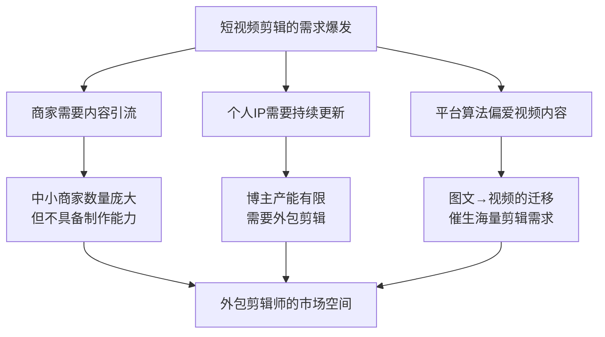
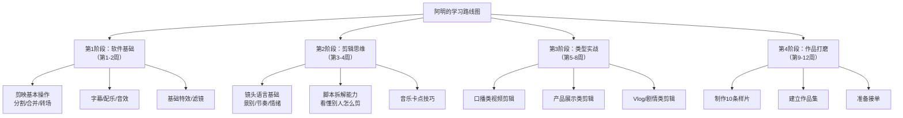
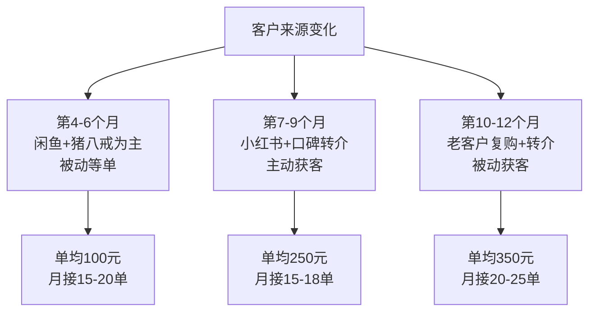
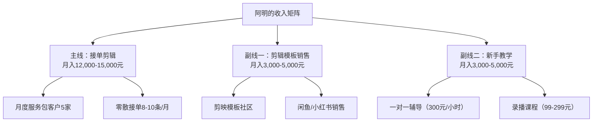

## 案例八：从工厂工人到月入2万的短视频剪辑师阿明

### 案例概览

阿明的故事是"零基础蓝领通过数字技能实现收入跃迁"的典型案例。他没有大学学历，没有任何设计或影视基础，在电子厂流水线上干了四年，每天重复同一个动作800次。但他用了一年半的时间，从完全不会剪辑到月入稳定2万+，成为抖音和小红书上多个中小商家的固定视频供应商。

这个案例的特殊价值在于：**短视频剪辑是当前门槛最低、需求量最大、变现路径最清晰的数字技能之一**。它不需要美术功底，不需要编程能力，不需要大量启动资金，只需要一部手机或一台普通电脑，加上系统性的学习和持续的实践。

**基本信息一览：**

| 维度 | 初始状态（2022年初） | 最终状态（2023年末） |
|------|----------------------|----------------------|
| 年龄 | 25岁 | 27岁 |
| 学历 | 高中（中专） | 不变 |
| 职业 | 电子厂流水线工人 | 自由职业短视频剪辑师 |
| 月薪 | 4,800元（含加班） | 约22,000元（月均） |
| 年总收入 | 约5.8万 | 约26万 |
| 收入来源 | 单一工资 | 多元客户接单+模板销售+教学 |
| 工作时间 | 每天10-12小时，单休 | 每天6-8小时，周末自由安排 |

### 短视频剪辑行业的底层逻辑

在进入阿明的具体故事之前，需要先理解短视频剪辑这个赛道的商业逻辑，因为阿明的每一步选择都建立在对这个逻辑的理解之上。



**短视频剪辑的市场结构：**

| 层级 | 客户类型 | 单条报价 | 月需求量 | 要求 |
|------|----------|----------|----------|------|
| 底层 | 微商/小商家/个人 | 50-150元 | 10-30条 | 基础剪辑+字幕+配乐 |
| 中层 | 中小品牌/本地商家/知识博主 | 200-800元 | 8-20条 | 创意脚本+精细剪辑+特效 |
| 高层 | 品牌方/MCN机构 | 1,000-5,000元 | 按项目计 | 专业调色+动态图形+创意策划 |
| 顶层 | 影视/广告/大型制作 | 5,000元+ | 按项目计 | 专业团队协作 |

**阿明的定位：** 从中层起步，逐步向上层渗透。他最终的客户结构是中层占70%、高层占30%。

**短视频剪辑 vs 其他副业的对比：**

| 维度 | 短视频剪辑 | 自媒体写作 | 电商带货 | 知识付费 |
|------|------------|------------|----------|----------|
| 启动门槛 | 低（1-2周可入门） | 低（但见效慢） | 中（需要选品和资金） | 高（需要深度专业能力） |
| 见效速度 | 快（1-3个月可接单） | 慢（3-6个月） | 中（2-4个月） | 慢（6-12个月） |
| 收入天花板 | 高（月入3-5万不难） | 中（月入1-3万） | 高但波动大 | 极高但极难 |
| 时间自由度 | 高（远程、灵活） | 高 | 中（需要客服和发货） | 中（需要互动和更新） |
| 技能迁移性 | 强（可转导演/运营/电商） | 中 | 中 | 强 |
| 竞争激烈度 | 中（有技术门槛） | 高（谁都能写） | 高（红海） | 中 |

---

### 时间线与收入增长轨迹


---

### 第一阶段：发现方向与自学入门（第1-3个月）

#### 背景与困境

2022年初，阿明在东莞一家电子厂做流水线工人，负责手机屏幕的质检工位。每天工作10-12小时（含2-3小时加班），月薪4,800元。工厂实行两班倒，白班7:30-19:30，夜班19:30-7:30，每两周轮换一次。

**阿明的核心困境：**

| 困境维度 | 具体表现 | 深层影响 |
|----------|----------|----------|
| 收入瓶颈 | 工厂普工薪资4,000-5,500元，加班才有5,000+，涨幅每年不到200元 | 攒不下钱，看不到未来 |
| 身体损耗 | 久坐+盯屏幕+重复动作，颈椎病和视力下降 | 25岁已经有了职业病 |
| 社交封闭 | 工厂宿舍-食堂-车间三点一线，接触不到外部信息 | 认知局限，不知道外面有什么机会 |
| 技能零积累 | 流水线操作不产生任何可迁移技能 | 离开工厂后什么都不会 |
| 年龄焦虑 | 电子厂偏好18-22岁的年轻工人，25岁已经被叫"老员工" | 3-5年内可能被淘汰 |

#### 关键转折：一条抖音改变命运

阿明的转折点来自一个普通的夜班间隙。2022年3月，他在刷抖音时看到一条视频：一个20出头的小伙子，展示自己用手机剪辑的一条汽车短视频，评论区全是"接单吗""怎么收费"。这条视频的播放量超过50万。

阿明当时的想法很朴素："这人看起来也不比我强多少，他能做，我为什么不能？"

但他没有冲动辞职，而是做了一件很关键的事——**花了两周时间做行业调研**：

**第一步：搜索行业信息（3天）**

阿明在抖音、小红书、知乎上搜索"短视频剪辑""剪辑接单""视频剪辑副业"等关键词，整理出以下信息：

| 信息维度 | 调研发现 | 对阿明的意义 |
|----------|----------|--------------|
| 市场需求 | 抖音日活7亿+，商家号月增50万+，大部分不会剪辑 | 需求巨大且持续增长 |
| 学习成本 | 剪映（免费）可满足80%需求，B站免费教程大量 | 不需要花钱学 |
| 接单渠道 | 猪八戒、闲鱼、小红书、抖音评论区、微信群 | 获客渠道多元 |
| 收入区间 | 新手50-100元/条，熟手200-500元/条，高手1000+元/条 | 收入天花板高 |
| 时间投入 | 入门需要1-2个月，稳定接单需要3-6个月 | 不是速成，但也不遥遥无期 |

**第二步：评估自身条件（3天）**

阿明对自己做了一次诚实的盘点：

| 评估项 | 阿明的情况 | 是否达标 |
|--------|------------|----------|
| 硬件设备 | 有一部红米Note 10 Pro（2021年买的） | ✅ 基本够用 |
| 时间 | 白班后有2-3小时空闲，夜班白天有5-6小时 | ✅ 可以学习 |
| 学习能力 | 中专学过计算机基础，会基本操作 | ✅ 能跟上 |
| 美术基础 | 完全没有 | ⚠️ 短板，但可以弥补 |
| 英语水平 | 基本为零 | ⚠️ 软件界面需要适应，但剪映是中文 |
| 启动资金 | 可支配3,000元 | ✅ 足够（实际只花了200元） |

**第三步：制定学习计划（2天）**

阿明没有在网上随便搜教程东一榔头西一棒子地学，而是制定了一份详细的学习路线图：



#### 自学阶段的具体执行

**学习资源（全部免费）：**

| 资源 | 平台 | 学习内容 | 投入时间 |
|------|------|----------|----------|
| "剪映小助手"官方教程 | 抖音 | 剪映基础操作 | 8小时 |
| "百万剪辑师"系列 | B站 | 剪辑思维+进阶技巧 | 20小时 |
| "PR自学网" | B站 | Premiere Pro入门（后期提升用） | 15小时 |
| "拉片分析"系列 | B站 | 拆解热门视频的剪辑手法 | 12小时 |
| 各类热门短视频 | 抖音/小红书 | 临摹练习素材 | 持续进行 |

**每日学习节奏（白班日）：**

```text
19:30  下班回宿舍，吃饭洗漱
20:00  看教程视频（1.5小时）
21:30  实操练习（1.5小时，跟着教程做）
23:00  刷热门视频，分析剪辑手法（30分钟）
23:30  休息
```

**每日学习节奏（夜班日，白天有大块时间）：**

```text
8:00   起床吃早餐
8:30   看教程视频（2小时）
10:30  实操练习（3小时，临摹热门视频）
13:30  午饭+午休
15:00  拉片分析（1小时，拆解一条热门视频的剪辑节奏）
16:00  自由创作（2小时，尝试独立剪一条视频）
18:00  晚饭+准备上夜班
```

**关键学习方法——"拆解-临摹-创造"三步法：**

阿明发现，单纯看教程学不会剪辑，因为"看懂了"和"做出来"之间有巨大的鸿沟。他摸索出了一套高效的学习方法：

**第一步：拆解（每天1条）**
- 找一条播放量10万+的短视频
- 用0.5倍速逐帧观看，记录每个镜头的时长、景别、转场方式
- 分析配乐节奏和画面切换的对应关系
- 记录字幕出现的时机和动画效果

**第二步：临摹（每天1条）**
- 找一条结构简单的热门视频
- 用类似的素材（自己拍或用免费素材库），按照原视频的节奏1:1复刻
- 重点关注节奏感和转场流畅度
- 对比原视频，找出差距

**第三步：创造（每周2-3条）**
- 自己选题、拍摄、剪辑一条完整视频
- 不追求完美，追求"完成"
- 发到自己的抖音号上，观察数据反馈

**三个月的学习成果：**

| 技能项 | 入门时 | 3个月后 | 评估方式 |
|--------|--------|---------|----------|
| 剪映操作 | 完全不会 | 精通所有基础功能+大部分进阶功能 | 能独立完成一条3分钟视频的全流程 |
| 剪辑速度 | 无 | 30秒口播视频：20分钟；1分钟产品视频：1小时 | 计时练习 |
| 镜头语言 | 不懂 | 能识别8种基本景别和12种常用转场 | 拉片测试 |
| 音乐卡点 | 不懂 | 能根据音乐节奏调整画面切换时机 | 作品展示 |
| 调色能力 | 不懂 | 掌握基础调色和滤镜使用 | 作品展示 |
| 作品数量 | 0 | 自己剪了47条视频，临摹了80+条 | 作品集 |

---

### 第二阶段：低价接单与技能打磨（第4-6个月）

#### 接单前的准备

阿明没有急于接单，而是先做了三件事：

**第一件事：建立作品集**

他花了一周时间，从之前剪的47条视频中精选出8条最好的，重新精剪，组成一个3分钟的作品集视频。这8条视频覆盖了最常见的客户需求类型：

| 序号 | 视频类型 | 时长 | 展示能力 |
|------|----------|------|----------|
| 1 | 口播类（知识分享） | 20秒 | 字幕+配乐+节奏把控 |
| 2 | 产品展示（美妆） | 25秒 | 转场+调色+特写镜头 |
| 3 | 美食探店 | 30秒 | 氛围感+音乐卡点 |
| 4 | 服装穿搭 | 20秒 | 快节奏剪辑+文字动画 |
| 5 | 剧情短片 | 35秒 | 叙事节奏+情绪把控 |
| 6 | Vlog日常 | 30秒 | 生活感+自然转场 |
| 7 | 产品开箱 | 25秒 | 细节展示+信息密度 |
| 8 | 混剪卡点 | 15秒 | 节奏感+视觉冲击 |

**第二件事：定价策略**

阿明的定价逻辑很清晰——**初期不赚钱，赚的是经验和口碑**：

| 阶段 | 定价（30秒视频） | 定价（1分钟视频） | 目的 |
|------|------------------|------------------|------|
| 练手期（第1-10单） | 30元 | 50元 | 积累案例和好评 |
| 成长期（第11-30单） | 80元 | 150元 | 验证市场需求，提升速度 |
| 稳定期（第31-50单） | 150元 | 300元 | 开始盈利，筛选优质客户 |
| 成熟期（第51单起） | 200-500元 | 400-1,000元 | 正常市场价格 |

**第三件事：确定接单渠道**

| 渠道 | 注册/发布 | 获客方式 | 阿明的实际效果 |
|------|-----------|----------|----------------|
| 闲鱼 | 发布"短视频剪辑"服务链接 | 搜索流量 | 第一个月成交6单，是最好的冷启动渠道 |
| 小红书 | 发布剪辑教程+作品展示 | 内容引流 | 第二个月开始有客户私信 |
| 剪映模板社区 | 上传可复用的剪辑模板 | 模板引流 | 第三个月开始有商家主动联系 |
| 微信群/朋友圈 | 在副业群、创业群里展示 | 社交传播 | 稳定来源，复购率最高 |
| 猪八戒网 | 注册服务商 | 平台流量 | 成交3单后放弃（平台抽成高、比价严重） |

#### 低价接单期的关键数据

**前30单的完整记录：**

| 指标 | 数据 |
|------|------|
| 总接单数 | 30单 |
| 总收入 | 3,150元 |
| 平均单价 | 105元 |
| 客户类型分布 | 淘宝/抖音小商家（60%）、个人博主（25%）、微商（15%） |
| 视频类型分布 | 产品展示（45%）、口播（30%）、探店/Vlog（15%）、其他（10%） |
| 平均制作时间 | 45分钟/条（从拿到素材到交付成片） |
| 平均修改次数 | 1.8次（大部分客户改1次就满意） |
| 好评率 | 97%（30单中29单好评，1单中评） |
| 复购客户数 | 8人（占27%，这些客户后来成为了核心客户） |

**阿明在低价期踩过的坑：**

| 坑 | 具体情况 | 教训 |
|----|----------|------|
| 需求不清就开工 | 第5单，客户说"帮我剪个视频"，阿明剪完后客户说"不是我要的风格" | 接单前必须确认：风格参考、时长、配乐偏好、字幕要求 |
| 不签协议吃哑巴亏 | 第12单，客户反复改了5次（从30秒改到1分钟），阿明只收了50元 | 后来制定了"修改次数+超范围加价"的服务协议 |
| 素材质量差影响成片 | 第18单，客户给的原始视频画质极差、抖动严重，怎么剪都不好看 | 后来接单前先检查素材质量，不合格的告知客户或加收修复费 |
| 不会拒绝"顺便帮忙" | 第22单，客户做完视频后要求"顺便帮我做个封面图"，阿明不好意思拒绝 | 后来明确了服务边界：剪辑是剪辑，封面设计是另外的价格 |

#### 从接单中总结的"客户需求分类表"

经过30单的实践，阿明发现中小商家的短视频需求可以归纳为5种模式：

| 需求模式 | 占比 | 典型客户 | 核心诉求 | 制作要点 |
|----------|------|----------|----------|----------|
| "帮我剪一下"型 | 35% | 小商家、微商 | 快速出片，不讲究 | 速度优先，标准模板化 |
| "像那谁一样"型 | 25% | 个人博主 | 模仿某个爆款视频 | 找到参考视频，1:1临摹 |
| "帮我做好看点"型 | 20% | 餐饮/服装商家 | 提升视觉质感 | 调色+配乐+节奏感 |
| "定期更新"型 | 15% | 有持续需求的商家 | 稳定产出，风格统一 | 建立模板，批量制作 |
| "帮我策划+剪辑"型 | 5% | 有预算的品牌方 | 全流程服务 | 溢价空间最大，但需要综合能力 |

**阿明的策略：** 初期全部通吃（积累经验），中期筛选前四种（效率最高），后期主攻第四和第五种（利润最高）。

---

### 第三阶段：稳定客源与收入爬坡（第7-12个月）

#### 客源结构升级

经过半年的低价接单，阿明的客户结构发生了质变：



**关键转折点——建立"月度服务包"：**

阿明在第8个月遇到了一个关键客户——一家本地连锁火锅店的运营负责人张总。张总的需求是每周3条抖音视频，但每次单独下单太麻烦。阿明提出了一个方案：

```text
月度服务包：
- 每月12条短视频（每周3条）
- 包含基础剪辑+字幕+配乐+封面
- 月费3,000元（折合250元/条）
- 每月可免费修改3次，超出部分50元/次
- 素材由甲方提供，阿明负责剪辑和优化
```

张总当场答应了。这个月度服务包的意义远不止3,000元收入——它给了阿明**稳定的现金流和可预期的工作量**。

**月度服务包的推广策略：**

阿明把"月度服务包"作为获客的核心产品，针对不同客户设计了三档：

| 套餐 | 月视频数 | 月费 | 单价 | 适合客户 |
|------|----------|------|------|----------|
| 基础版 | 8条 | 1,600元 | 200元/条 | 刚起步的个人博主 |
| 标准版 | 12条 | 3,000元 | 250元/条 | 有持续更新需求的商家 |
| 进阶版 | 20条 | 4,500元 | 225元/条 | 日更需求的品牌方 |

到第12个月，阿明的月度服务包客户达到了4家，固定月收入12,000元，再加上零散接单，月均收入稳定在15,000元左右。

#### 效率提升：从手工到模板化

随着接单量增加，阿明面临一个核心矛盾：**收入增长受限于个人时间**。他的解决方案是建立"剪辑模板库"。

**模板库建设过程：**

| 模板类型 | 数量 | 适用场景 | 制作耗时 | 复用效率 |
|----------|------|----------|----------|----------|
| 口播类模板 | 5套 | 知识分享、产品讲解 | 每套2小时 | 从40分钟/条降到15分钟/条 |
| 产品展示模板 | 8套 | 美妆、食品、服装、数码 | 每套3小时 | 从60分钟/条降到25分钟/条 |
| 探店/美食模板 | 4套 | 餐饮、旅游、体验 | 每套2.5小时 | 从50分钟/条降到20分钟/条 |
| 活动/促销模板 | 6套 | 开业、打折、节日 | 每套2小时 | 从45分钟/条降到15分钟/条 |
| 卡点/混剪模板 | 3套 | 氛围感、品牌宣传 | 每套3小时 | 从90分钟/条降到30分钟/条 |

**模板化带来的效率提升：**

| 指标 | 模板化前 | 模板化后 | 提升幅度 |
|------|----------|----------|----------|
| 平均每条制作时间 | 45分钟 | 22分钟 | 效率提升51% |
| 日均产能 | 4-5条 | 8-10条 | 产能翻倍 |
| 月度服务包客户数 | 2家 | 5家 | 接单能力提升 |
| 月接单总量 | 15-18条 | 30-35条 | 总量翻倍 |

---

### 第四阶段：矩阵收入与稳定月入2万+（第13-18个月）

#### 收入结构的多元化

阿明在第13个月之后，不再把所有鸡蛋放在"接单"这一个篮子里。他构建了三条收入线：



**收入线一：接单剪辑（月均13,500元）**

| 客户类型 | 数量 | 月费/月均 | 月收入 |
|----------|------|-----------|--------|
| 月度服务包客户 | 5家 | 2,500-4,500元 | 11,000元 |
| 零散接单 | 8-10条 | 250-400元/条 | 2,500元 |
| **小计** | - | - | **13,500元** |

**收入线二：模板销售（月均4,000元）**

阿明把自己积累的26套剪辑模板打包成产品：

| 产品 | 定价 | 月销量 | 月收入 |
|------|------|--------|--------|
| 单套模板（剪映） | 9.9-29.9元 | 80-120套 | 1,500元 |
| 模板合集包（10套） | 99元 | 15-20份 | 1,800元 |
| 全套模板包（26套） | 199元 | 3-5份 | 700元 |
| **小计** | - | - | **4,000元** |

**收入线三：新手教学（月均4,500元）**

阿明在小红书上积累了8,000+粉丝后，开始做付费教学：

| 产品 | 定价 | 月销量 | 月收入 |
|------|------|--------|--------|
| 一对一视频辅导 | 300元/小时 | 6-8小时 | 2,100元 |
| 录播入门课（10节） | 99元 | 15-20份 | 1,700元 |
| 接单实战营（7天） | 299元 | 2-3期 | 700元 |
| **小计** | - | - | **4,500元** |

#### 成熟期完整收入数据

| 指标 | 第1个月 | 第6个月 | 第12个月 | 第18个月（成熟期） |
|------|---------|---------|----------|-------------------|
| 月总收入 | 0元 | 3,150元 | 15,000元 | 22,000元 |
| 接单数量 | 0条 | 30条（累计） | 18条/月 | 30-35条/月 |
| 平均单价 | - | 105元 | 350元 | 400元 |
| 月度服务包客户 | 0家 | 0家 | 4家 | 5家 |
| 模板销售收入 | 0元 | 0元 | 1,200元 | 4,000元 |
| 教学收入 | 0元 | 0元 | 800元 | 4,500元 |
| 小红书粉丝 | 0 | 800 | 5,000 | 8,000 |
| 日均工作时间 | 4小时（学习） | 5小时 | 6小时 | 7小时 |
| 时薪 | 0元 | 21元 | 83元 | 105元 |

**收入结构健康度分析：**

- **被动/半被动收入占比：38%**（模板销售+录播课程），这部分收入不需要逐条投入时间
- **主动收入占比：62%**（接单剪辑+一对一辅导），但单位时间产出很高（时薪105元）
- **收入来源数量：4个**，单一来源占比最高61%（接单），风险分散度中等
- **相比工厂收入：4.6倍**（从4,800元到22,000元）

---

### 关键成功因素深度分析

#### 因素一：精准选择"低门槛高需求"赛道

阿明选择短视频剪辑而非其他数字技能（如编程、设计、写作），背后有清晰的判断逻辑：

| 判断维度 | 短视频剪辑 | 编程开发 | 平面设计 | 自媒体写作 |
|----------|------------|----------|----------|------------|
| 入门时间 | 1-2个月 | 6-12个月 | 3-6个月 | 1-3个月 |
| 需求体量 | 极大（7亿日活） | 大 | 中 | 大 |
| 供给竞争 | 中（有技术门槛） | 高 | 高 | 极高（无门槛） |
| 可见度 | 高（作品即广告） | 低（代码不可展示） | 中 | 中 |
| 变现速度 | 快（1-3个月可接单） | 慢（需要项目经验） | 中 | 慢 |

**核心逻辑：** 选择一个"入门门槛低但不零门槛"的赛道——太低（如写作）意味着无限竞争，太高（如编程）意味着见效太慢。短视频剪辑恰好在"1-2个月可入门"的甜蜜点上。

#### 因素二：用"作品集思维"替代"简历思维"

阿明从一开始就明白，在自由职业市场，**作品集比任何简历、证书、学历都有说服力**。他的做法是：

- 每剪一条视频就存入作品集文件夹，按类型分类
- 定期更新作品集视频（每3个月重做一次精选）
- 在所有接单平台上展示作品集链接
- 用作品集数据说话："这条视频帮客户涨了5,000粉""这条视频播放量10万+"

#### 因素三：从"按条收费"到"按月收费"的商业模式升级

阿明收入突破万元的关键转折，是把计费模式从"单条结算"升级为"月度服务包"。这个转变的本质是：

| 维度 | 按条收费 | 月度服务包 |
|------|----------|------------|
| 收入稳定性 | 波动大，有淡旺季 | 稳定，可预期 |
| 客户黏性 | 低，随时可能换人 | 高，切换成本大 |
| 沟通成本 | 每单都要重新沟通需求 | 一次沟通，持续执行 |
| 工作节奏 | 被动等单，不稳定 | 主动安排，节奏可控 |
| 溢价空间 | 低，客户会比价 | 高，打包优惠但总价更高 |

#### 因素四：模板化是时间自由的关键

阿明能同时服务5个月度客户+接零散单的核心原因，是他建立了26套可复用的剪辑模板。模板化的本质是**把重复劳动固化为可复用资产**：

- 每种视频类型都有对应的模板（片头、字幕样式、转场、配乐、片尾）
- 接到新需求时，先判断类型，再套模板，只需微调细节
- 模板本身还可以作为商品销售，形成二次收入

---

### 常见误区与避坑指南

| 误区 | 正确做法 | 阿明踩过的坑 |
|------|----------|--------------|
| 一上来就买高价课程 | 免费教程足够入门，先学3个月再考虑付费进阶 | 差点花3,980元报一个"7天剪辑速成班"，幸好先搜了评价发现是割韭菜 |
| 追求"高大上"的软件 | 剪映能满足80%的需求，先精通剪映再学PR/AE | 第2个月就去学Premiere Pro，浪费了两周时间在软件操作上，对实际接单毫无帮助 |
| 只学不练 | 每学一个技巧就立刻实操一条视频 | 前两周看了50个教程但没动手，后来发现全忘了 |
| 低价竞争到底 | 低价是策略不是目的，30单后必须提价 | 第40单还收50元/条，被一个客户提醒"你这个质量完全可以收200" |
| 不做作品集 | 作品集是自由职业者的"简历"，必须精心维护 | 前3个月没有作品集，接单全靠口头描述，转化率极低 |
| 接单不签协议 | 每单都确认需求文档，写清楚修改次数和加价规则 | 第12单被客户无限改稿，做了一周只收50元 |
| 忽视客户关系 | 老客户是最优质的获客渠道，维护好复购和转介 | 前6个月只顾接新单，没有主动维护老客户关系 |
| 不关注平台规则 | 小红书、抖音的算法和规则经常变化，必须跟进 | 一次小红书违规（引流到微信被限流），损失了一个月的流量 |

---

### 短视频剪辑副业适配性自检表

想复制阿明的路径？先回答以下问题：

| 检查项 | 达标标准 | 权重 |
|--------|----------|------|
| 视觉审美 | 能分辨"好看"和"不好看"的视频，有一定画面感知力 | ★★★ |
| 学习耐心 | 能坚持每天2小时学习+实操，持续3个月以上 | ★★★ |
| 设备条件 | 有一部2020年后的手机或一台普通电脑 | ★★ |
| 时间投入 | 每天能保证2-4小时的学习/工作时间 | ★★★ |
| 沟通能力 | 能理解客户需求，耐心处理修改意见 | ★★ |
| 抗压能力 | 能接受前3个月的低收入期和偶尔的差评 | ★★★ |
| 互联网敏感度 | 经常刷抖音/小红书，了解短视频的流行趋势 | ★★ |

**评分标准**：7项中至少5项达标，才建议进入短视频剪辑赛道。

#### 不同入行路径对比

| 维度 | 自学接单（阿明模式） | 报班学习 | 加入工作室 | 做自媒体号 |
|------|----------------------|----------|------------|------------|
| 启动成本 | 0-200元 | 2,000-8,000元 | 0元（但分成低） | 0元 |
| 入门时间 | 2-3个月 | 1-2个月 | 即刻 | 3-6个月 |
| 收入上限 | 月入2-5万 | 取决于后续接单 | 月入0.5-1.5万（受分成限制） | 不确定（取决于流量） |
| 自由度 | 极高 | 高 | 低（受管理约束） | 极高 |
| 核心风险 | 前期收入低、需要自律 | 课程质量参差不齐 | 收入低、成长受限 | 变现周期长、不确定性高 |
| 适合人群 | 自律、愿意投入时间 | 预算充足、想快速入门 | 零基础、想边学边赚 | 有创意、想做个人IP |

#### 短视频剪辑的长期进化路径

| 阶段 | 时间 | 能力要求 | 收入区间 | 转型方向 |
|------|------|----------|----------|----------|
| 入门期 | 0-6个月 | 基础剪辑+字幕+配乐 | 0-5,000元 | 专注技能打磨 |
| 成长期 | 6-12个月 | 类型化剪辑+模板化+客户管理 | 5,000-15,000元 | 建立个人品牌 |
| 成熟期 | 12-24个月 | 创意策划+团队协作+多渠道收入 | 15,000-30,000元 | 转型视频运营/导演 |
| 高阶期 | 24个月+ | 视觉导演+品牌顾问+团队管理 | 30,000元+ | 开工作室/成为品牌视频总监 |

阿明目前处于"成熟期"，正在向"高阶期"迈进。他的下一步计划是组建一个2-3人的小团队，承接更大的项目，同时把自己的接单经验系统化成一门完整的课程，实现从"卖时间"到"卖系统"的跃迁。

---

### 阿明的核心语录

> "工厂教会我的唯一一件事就是——重复做同一件事可以很快。我把这个能力用在了剪辑上，每条视频都是重复练习，但每条都比上一条好一点。"

> "接单最大的门槛不是技术，是脸皮。前三个月我发了200条闲鱼，成交了6单。大部分人发了10条没人理就放弃了。"

> "月度服务包改变了一切。有了固定客户，我不用每天焦虑'明天有没有单接'，可以安心提升技术和探索新方向。"

> "模板不是偷懒，是聪明。大品牌用模板做海报，连锁餐厅用模板做菜品，我用模板做视频——原理是一样的。"
