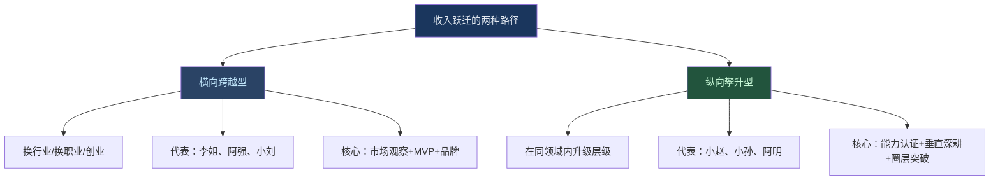
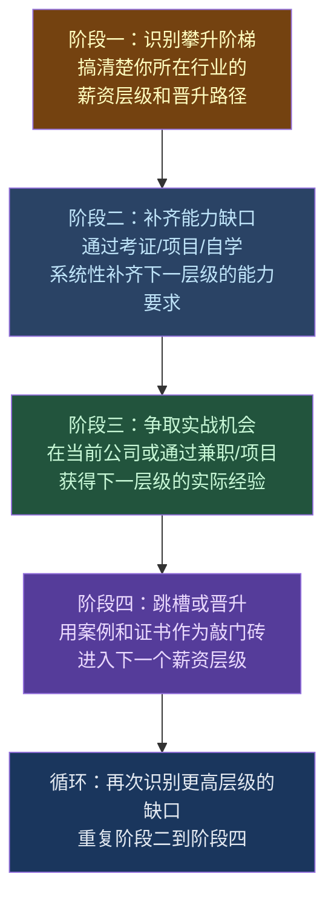
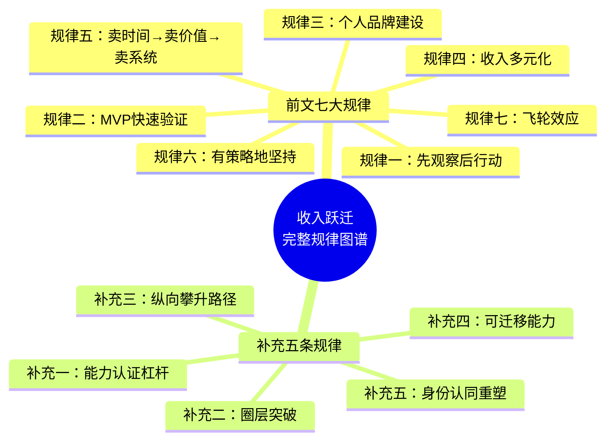

## 从这些案例中我们可以学到什么（补充）

前文从程序员小陈、烘焙创业者李姐、设计师小王、知识付费创业者小刘、餐饮创业者阿强五个案例中提炼了七大共性规律。但在新增的三个案例——**从行政到HRBP的小赵、从跟单翻译到自由翻译的小孙、从工厂工人到短视频剪辑师的阿明**——之后，我们发现了一些**原有七大规律未能覆盖的新维度**。这些新维度不是对原有规律的否定，而是补充和深化。

本节将从三个层面展开：**新增案例的横向对比**、**提炼补充规律**、**不同背景读者的差异化行动方案**。

---

### 一、新三个案例的全景对比：数据说话

#### 1.1 起点与终点的硬数据

| 维度 | 小赵（HRBP） | 小孙（自由翻译） | 小阿明（剪辑师） |
|------|-------------|----------------|----------------|
| **起步年龄** | 24岁 | 25岁 | 25岁 |
| **起步学历** | 普通本科（公共管理） | 普通本科（英语专业） | 高中/中专 |
| **起步收入** | 月薪4,500 | 月薪5,000 | 月薪4,800（含加班） |
| **最终收入** | 年薪35万 | 年入30万 | 月入2.2万（年约26万） |
| **收入倍数** | 6.5倍 | 5倍 | 4.6倍 |
| **转型周期** | 4年 | 3年 | 1.5年 |
| **收入来源数** | 3个（薪资+绩效+年终） | 4个（译稿+审校+咨询+培训） | 3个（接单+模板+教学） |
| **启动资金** | 零（在职学习） | 零（在职学习） | 约2000元（电脑升级） |

#### 1.2 与前五个案例的关键差异

将八个案例放在一起对比，三个新案例呈现出前五个案例没有的特征：

| 对比维度 | 前五个案例（小陈/李姐/小王/小刘/阿强） | 新三个案例（小赵/小孙/阿明） |
|----------|--------------------------------------|--------------------------|
| **转型路径** | 多数是"横向跨越"（换行业或创业） | 全部是"纵向攀升"（在同领域内升级） |
| **技能门槛** | 部分需要较高门槛（技术、资金） | 普适性更强，门槛相对低 |
| **学历依赖** | 混合（高中到一本都有） | 两个本科、一个中专——学历影响有限 |
| **副业启动** | 多数是"主业+副业"并行 | 小赵和小孙是在职内部转型，阿明是裸辞后全职学习 |
| **核心杠杆** | 品牌、产品化、客户资产 | 专业证书+垂直深耕+行业认知 |
| **见效速度** | 平均2-4年 | 平均1.5-3年——略快 |

**关键发现**：三个新案例全部走的是"纵向攀升"路径——不是换赛道，而是在**同一领域内从底层爬到中高层**。这意味着前文七大规律中"先观察后行动""MVP验证"等更适合"横向跨越"型选手，而"纵向攀升"型选手需要一套不同的核心策略。这正是本节补充的重点。



---

### 二、五条补充规律：前文未覆盖的深层认知

前文提炼了七大规律，覆盖了"观察—MVP—品牌—多元化—卖时间到卖系统—坚持—飞轮"的完整链条。但在三个新案例中，我们发现了五条前文未充分展开的补充规律。这五条规律对于"纵向攀升型"选手尤其关键。

#### 补充规律一：能力认证是最被低估的收入杠杆——"证书不值钱，证书背后的体系化学习才值钱"

**前文盲区**：前文七大规律强调了品牌、MVP、客户资产，但没有专门讨论**系统化学习和能力认证**在收入跃迁中的角色。

**证据汇总：**

| 案例 | 考取的证书/完成的学习 | 直接收益 | 间接收益 |
|------|---------------------|---------|---------|
| 小赵 | 人力资源管理师（三级→二级）、HRBP实战训练营 | 跳槽时成为硬性筛选条件，薪资谈判底气提升 | 系统化补齐HR六大模块知识，从"行政思维"切换到"HR思维" |
| 小孙 | CATTI二级笔译、本地化项目管理认证 | 直接拿到高端客户入场券，千字报价从120涨到350 | 建立了行业圈子，获得转介绍和合作机会 |
| 阿明 | 剪映/PR/Final Cut系统课程、抖音创作者认证 | 平台接单时客户信任度大幅提升 | 学到了完整的剪辑思维，不只是"会用工具" |

**深层机制**：很多人把证书当成"一张纸"，觉得"有实力不需要证书"。这是一种幸存者偏差。证书的真正价值不在于那张纸，而在于：

1. **体系化学习路径**：自学最大的问题是"不知道自己不知道什么"。考证的课程体系帮你完整覆盖一个领域的知识盲区。小赵在考人力资源管理师之前，对薪酬设计、劳动法、人才盘点这些模块完全陌生——自学很难系统性地触及这些领域。
2. **同行社交入口**：备考群、培训班、行业协会，这些天然形成了高质量的职业社交网络。小孙的前三个高端客户中，有两个是在CATTI备考群里认识的同行介绍的。
3. **信任背书**：尤其对于没有品牌积累的新手，证书是客户判断你能力的最快方式。阿明在抖音创作者认证通过后，平台接单的通过率从20%提升到了65%。
4. **自我效能感**：通过一个有挑战性的考试，会从根本上改变你对自己的定位。小赵说拿到人力资源管理师二级那天，"第一次觉得自己不是打杂的，是专业人士"。

**具体行动框架——如何选择和利用证书：**

```text
第一步：筛选真正有价值的证书
  □ 优先选择行业公认、招聘市场认可的证书
  □ 在招聘平台搜索目标岗位，统计"优先录取"中出现频率最高的证书
  □ 避免"交钱就发证"的山寨证书——不但没用，还会减分
  □ 预算参考：正规证书考试费300-2000元，培训费0-5000元

第二步：规划学习路径
  □ 先看考试大纲，识别自己的知识盲区
  □ 制定3-6个月的备考计划（每天1-2小时足够）
  □ 重点不是"通过考试"，而是"系统化学习"
  □ 加入备考社群，既是学习资源也是社交资源

第三步：考后价值最大化
  □ 更新简历和各平台个人资料
  □ 写一篇"备考复盘"发在社交平台——既是品牌建设，也能帮助后来者
  □ 用证书作为"敲门砖"，主动链接行业前辈和潜在客户
  □ 持续学习——证书只是起点，不是终点
```

> **关键提醒**：不是所有领域都需要证书。技术领域更看重GitHub和作品集，内容领域更看重粉丝和数据。但如果你的领域有权威认证（HR、财务、翻译、项目管理、法律等），考证几乎是性价比最高的投资之一。

---

#### 补充规律二：圈层突破是"纵向攀升"的关键——"你所在的圈子决定了你的信息质量和机会密度"

**前文盲区**：前文提到了"个人品牌"，但没有讨论**如何突破当前圈层的信息茧房**。小赵、小孙、阿明三个人的共同点是：他们都经历了一次甚至多次"圈层突破"，每次突破都带来了收入的阶梯式跳跃。

**证据汇总：**

| 案例 | 初始圈层 | 第一次突破 | 第二次突破 | 第三次突破 |
|------|----------|-----------|-----------|-----------|
| 小赵 | 行政前台同事群（讨论八卦和考勤） | 进入HR专业社群（接触HRM和HRBP认知） | 进入HRBP实战训练营圈子（接触互联网行业HRBP） | 进入公司中层管理圈（获得业务视角和跨部门影响力） |
| 小孙 | 外贸公司跟单团队（讨论订单和客户抱怨） | 进入翻译兼职平台（接触自由翻译的商业模式） | 加入CATTI备考和翻译协会圈子（接触高端客户和本地化行业） | 进入企业本地化项目圈（接触按项目报价的高价值模式） |
| 阿明 | 工厂工友群（讨论工资和加班） | 进入短视频剪辑学习群（接触剪辑接单的可能性） | 进入抖音创作者社群（接触内容运营和商业化逻辑） | 进入MCN和品牌方合作圈（接触高单价的商业合作） |


**如何实现圈层突破——四步法：**

```text
第一步：识别你的"信息茧房"
  - 你每天接触的信息来源是什么？（微信群、朋友圈、短视频推荐）
  - 你的收入天花板和你最密切的5个朋友的平均收入差距有多大？
  - 你知道你所在行业收入最高的人在做什么吗？
  → 如果答案让你不舒服，说明你正在被圈层限制。

第二步：主动进入更高一层的圈子
  - 最低成本方式：付费课程/社群（200-2000元/年）
  - 中等成本方式：行业大会/线下沙龙（500-3000元/次）
  - 高价值方式：主动帮圈内大佬做事（免费，但需要能力匹配）
  → 关键不是"加入"，而是"被看见"。进入圈子后要积极发言、
    提供价值、主动帮助别人。

第三步：用内容和案例在新圈层"站稳脚跟"
  - 小赵进入HR社群后，每周写一篇HR实操笔记分享
  - 小孙加入翻译协会后，主动翻译了几篇行业报告供会员参考
  - 阿明进入剪辑社群后，把自己的学习过程录成教程分享
  → 输出是最好的社交货币。你帮别人解决问题，别人就会记住你。

第四步：利用圈层资源反哺收入
  - 获得转介绍（小孙70%的高端客户来自圈内介绍）
  - 获得合作机会（阿明通过MCN圈子获得了品牌方合作）
  - 获得信息优势（小赵提前知道行业薪资趋势，精准跳槽）
```

> **核心洞察**：你不是在跟全国所有人竞争，你只是在跟"你认识的人"竞争。如果你的圈子里都是月薪5000的人，你的参照系就是月薪5000。突破圈层的本质是**更新你的参照系**，让你看到更大的可能性和更高的标准。

---

#### 补充规律三："纵向攀升"比"横向跨越"更适合大多数人——"换行业不如换层级"

**前文盲区**：前文的五个案例中，李姐（全职妈妈→烘焙创业）和阿强（外卖骑手→餐饮创业）都属于"横向跨越"。但现实中，大多数人没有勇气、资源或时机去跨行业。三个新案例展示了一条更稳妥的路径：**在当前行业内向上攀升**。

**两条路径的系统对比：**

| 对比维度 | 横向跨越（换行业/创业） | 纵向攀升（同领域升级） |
|----------|----------------------|---------------------|
| **风险等级** | 高——需要从零积累行业认知和客户资源 | 中低——已有行业基础，只需补齐能力短板 |
| **启动成本** | 较高——可能需要设备、场地、库存 | 较低——主要投入是学习时间和认证费用 |
| **见效速度** | 2-4年（前文五个案例平均） | 1.5-3年（三个新案例平均） |
| **收入天花板** | 取决于行业和商业模式 | 取决于行业薪资结构 |
| **心理压力** | 大——身份切换、收入断档、社交圈重建 | 小——渐进式过渡，身份认同稳定 |
| **失败代价** | 高——可能损失大量时间和资金 | 低——即使"没升上去"，能力提升也是自己的 |
| **适合人群** | 对当前行业极度不满、有明确方向、有一定积蓄 | 对当前行业不排斥、想稳扎稳打、没有大量积蓄 |
| **典型案例** | 李姐、阿强、小刘 | 小赵、小孙、阿明 |

**为什么纵向攀升更适合大多数人：**

1. **不需要裸辞**：小赵和小孙都是在职期间完成转型的。她们利用工作中的碎片时间学习，周末考证或接私活，直到副业收入稳定超过主业才考虑全职切换。
2. **复利效应**：你在这个行业已经积累的人脉、认知、经验不会浪费，反而会因为层级提升而加速变现。小赵从行政转型HR时，她对业务流程的理解比科班出身的HR更强——因为她就是从一线做起来的。
3. **容错率高**：纵向攀升的过程中，即使某一步没走好（比如跳槽失败），你的能力还在，可以继续在当前岗位积累，等待下一个机会。横向跨越失败则可能"回到原点"。

**纵向攀升的通用路径图：**



---

#### 补充规律四：能力的"可迁移性"决定你的转型天花板——"底层能力比专业技能更值钱"

**前文盲区**：前文强调了专业深度和垂直能力，但三个新案例揭示了一个被忽视的真相——**真正让你完成跃迁的，往往不是你新学的专业技能，而是你已有的底层能力**。

**证据汇总：**

| 案例 | 在原岗位积累的底层能力 | 转型后如何复用这些能力 | 新学的专业技能 |
|------|---------------------|---------------------|--------------|
| 小赵 | 跨部门沟通、会议组织、流程优化、Excel数据分析、公司政治敏感度 | 在HRBP岗位上快速建立跨部门信任、高效组织人才盘点会议、用数据驱动HR决策 | HR六大模块、劳动法、组织诊断方法论 |
| 小孙 | 客户需求理解、文档管理、多任务协调、时间管理 | 翻译项目管理、客户需求沟通、多客户并行服务能力 | 专业领域术语、CAT工具、本地化流程 |
| 阿明 | 流水线的标准化思维、重复作业的耐心、对"效率"的极致敏感 | 建立剪辑SOP、批量接单的产能管理、对"产出效率"的持续优化 | 剪辑软件、脚本策划、短视频运营 |

**深层机制**：小赵在做行政前台时积累的"跨部门沟通"能力，到了HRBP岗位上变成了核心竞争力——因为HRBP最重要的工作就是在业务部门和HR部门之间"翻译"和"协调"。这个能力不是她学HR时学来的，而是做行政时天天跟各部门打交道练出来的。

这意味着一个关键认知：**你当前的工作可能正在为你积累"你看不到但未来会用到"的能力**。大多数人低估了自己当前岗位的价值，因为他们只看到了"岗位技能"（如行政的考勤管理），而看不到"底层能力"（如跨部门沟通、流程优化、数据分析）。

**识别和利用可迁移能力的框架：**

```text
第一步：拆解你当前岗位的"底层能力"
  问自己：在我每天做的事情中，哪些能力是"换了行业还能用的"？
  
  通用的高价值可迁移能力包括：
  □ 沟通与表达能力（汇报、谈判、说服、写作）
  □ 数据分析能力（Excel、数据思维、决策支持）
  □ 项目管理能力（多任务协调、时间管理、风险预判）
  □ 问题解决能力（定义问题、拆解问题、找到方案）
  □ 人际关系能力（向上管理、跨部门协调、客户关系）
  □ 学习能力（快速上手新领域、结构化学习、知识管理）
  
第二步：评估这些能力在目标层级中的价值
  - 在招聘平台搜索目标岗位的JD（职位描述）
  - 重点关注"能力要求"而非"技能要求"
  - 找到你的可迁移能力与目标岗位之间的交集

第三步：在简历和面试中"翻译"你的能力
  不要说："我做了3年行政前台"
  而要说："我积累了3年的跨部门协调和流程优化经验，
        独立完成了XX个会议项目的全流程管理"
  → 用目标岗位的语言重新包装你的经历
```

---

#### 补充规律五：职业身份认同的重塑是隐性但关键的一步——"你对自己的定位，决定了别人怎么定价你"

**前文盲区**：前文没有讨论**心理层面的身份认同转变**，但三个新案例都提到了一个共同的"转折点时刻"——不是收入变化的时刻，而是**他们开始把自己当作"专业人士"而非"打工人"的时刻**。

**证据汇总：**

| 案例 | 身份转变的关键时刻 | 转变前的自我定位 | 转变后的自我定位 | 转变带来的行为变化 |
|------|------------------|----------------|----------------|------------------|
| 小赵 | 考过人力资源管理师二级那天 | "我是行政，就是在公司打杂的" | "我是HR专业人士，我在解决组织效能问题" | 主动在部门会议上提HR建议、拒绝低价值的行政杂活、用专业术语和高管沟通 |
| 小孙 | 翻译第一份法律合同并收到客户感谢信 | "我就是个翻译工具，把A语言变成B语言" | "我是跨文化沟通的桥梁，帮助客户降低信息不对称" | 开始在翻译前研究客户的业务背景、主动提优化建议、定价从"按字数"转向"按价值" |
| 阿明 | 第一条视频播放量破10万 | "我只是个会剪视频的工厂仔" | "我是短视频内容策划师，我帮商家解决流量问题" | 开始为客户提供脚本建议、分析数据优化内容策略、从"接单执行"升级为"内容顾问" |

**深层机制**：当小赵还把自己定位为"行政前台"时，她在跨部门沟通中的姿态是被动的——别人让她做什么她做什么。当她开始把自己定位为"HR专业人士"后，同样的跨部门沟通，她的姿态变成了主动的——她主动了解业务部门的痛点，提出HR解决方案，甚至在高管会上做组织诊断报告。

这种身份认同的转变直接影响了别人对她的定价。猎头给她的定位从"行政主管"变成了"HRBP"，薪资差距接近3倍。

**如何完成身份认同的重塑：**

```text
第一步：用"专业人士"的标准要求自己
  - 每周阅读1-2篇行业深度文章（不只是看，要做笔记）
  - 建立自己的"专业知识库"（用Notion/飞书/语雀整理）
  - 用行业术语描述你做的事情（训练自己用专业语言表达）

第二步：用行动"证明"新身份
  - 主动输出专业内容（哪怕只是朋友圈发一条行业洞察）
  - 主动在团队中承担"专家角色"（解答同事的问题、提改进建议）
  - 参加行业活动，用新身份介绍自己

第三步：远离"降维"的环境
  - 减少和只会抱怨但不行动的人交流
  - 增加和同领域比你高1-2个层级的人交流
  - 当别人用旧标签定义你时（"你不就是个前台吗"），不辩解，用结果说话
```

> **核心洞察**：身份认同的转变不是自欺欺人，不是给自己贴标签。它是你**真正具备了相应能力之后的心理确认**。小赵是先学了HR知识、考了证书、做了实际项目之后，才真正觉得自己是HR专业人士的。能力是基础，身份认同是放大器——两者缺一不可。

---

### 三、八个案例的完整规律图谱

将前文七大规律和本节五条补充规律放在一起，形成完整的"收入跃迁底层操作系统"。



**规律的适用场景矩阵：**

| 规律 | 最适合谁 | 什么时候用 | 优先级 |
|------|---------|-----------|--------|
| 先观察后行动 | 想跨行业/创业的人 | 转型前 | ★★★★★ |
| MVP快速验证 | 有明确产品/服务想法的人 | 起步阶段 | ★★★★★ |
| 个人品牌建设 | 服务型/内容型/自由职业者 | 贯穿全程 | ★★★★ |
| 收入多元化 | 已有稳定主业/副业的人 | 第二阶段 | ★★★ |
| 卖时间→卖系统 | 想突破收入天花板的人 | 第三阶段 | ★★★★ |
| 有策略地坚持 | 所有人 | 低谷期 | ★★★★★ |
| 飞轮效应 | 所有人 | 坚持的理论支撑 | ★★★ |
| **能力认证** | 有明确晋升路径的人 | 转型初期 | ★★★★ |
| **圈层突破** | 感觉信息闭塞/机会少的人 | 贯穿全程 | ★★★★★ |
| **纵向攀升** | 对行业不排斥、想稳扎稳打的人 | 任何时候 | ★★★★ |
| **可迁移能力** | 担心"我没技能"的人 | 转型前的自我评估 | ★★★★ |
| **身份认同重塑** | 自信心不足、自我定位偏低的人 | 能力积累到一定程度后 | ★★★★ |

---

### 四、不同背景的行动建议——你的第一步在哪里

看完八个案例和十二条规律，最重要的是**找到适合你当前位置的那一两条规律，立刻行动**。下面根据你的具体背景给出精准建议。

#### 4.1 按当前职业状态分类

| 你的情况 | 核心瓶颈 | 优先运用的规律 | 第一步行动（今天就做） |
|----------|---------|--------------|---------------------|
| 低学历+低技能+在职 | 不知道学什么、没有方向 | 纵向攀升+能力认证 | 在招聘网站搜索你所在行业薪资最高的岗位，记录其能力要求和证书要求 |
| 低学历+低技能+待业 | 没有时间试错、需要尽快收入 | MVP验证+可迁移能力 | 列出你已有的底层能力（沟通、执行力、抗压等），找到对这些能力需求最大的低门槛岗位 |
| 高学历+低薪资 | 专业深度不够或行业选错了 | 纵向攀升+圈层突破 | 搜索同行业薪资是你的2-3倍的岗位，找出差距在哪里——是技能、证书还是经验？ |
| 有技能+没客户 | 不知道怎么把能力变成钱 | 个人品牌+MVP验证 | 今天就在一个平台上注册账号，发布你的第一条专业内容 |
| 有客户+没时间 | 被"卖时间"困住了 | 卖时间→卖系统+收入多元化 | 计算你的时薪，然后制定一个提价20%+模板化服务的计划 |
| 想转型+没方向 | 选择太多或太少 | 三圈模型+能力认证 | 今天花30分钟做前文的"三圈交集练习" |
| 在体制内/大公司 | 稳定但收入增长慢 | 纵向攀升+圈层突破 | 搜索你所在行业内市场化方向的薪资水平，评估转型的收益比 |

#### 4.2 按收入阶段分类

| 你当前的月收入 | 你最可能卡在的阶段 | 优先运用的规律 | 具体突破建议 |
|--------------|------------------|--------------|-------------|
| 5000元以下 | 还在"卖时间"的最低层级 | 纵向攀升+能力认证+可迁移能力 | 找到你所在行业的"晋升阶梯"，用3-6个月补齐下一层级的核心能力 |
| 5000-10000元 | 已入门但缺乏差异化优势 | 圈层突破+个人品牌 | 进入1-2个付费行业社群，开始每周输出专业内容 |
| 10000-20000元 | 已有专业能力但收入增长放缓 | 身份认同重塑+卖价值 | 用"顾问/专家"而非"执行者"的视角重新定位你的服务，提价30% |
| 20000-50000元 | 收入主要靠"多做"而非"做对" | 卖系统+收入多元化 | 把你最擅长的服务标准化/产品化，开始构建"你不在也能运转"的收入流 |
| 50000元以上 | 需要更大杠杆或更高维度的突破 | 圈层突破（高端）+品牌 | 进入行业顶级圈子，开始考虑出版/演讲/投资等杠杆型收入 |

---

### 五、搞钱路上的补充误区——新案例暴露的认知陷阱

前文已经列出了五大思维陷阱。三个新案例暴露了另外五个同样致命但更隐蔽的认知陷阱。

#### 误区六：认为"非科班出身就不可能"

**真相**：八个案例中，真正"科班出身"的只有小陈（计算机专业）和小孙（英语专业）。其余六个人都是非科班转型——小赵从公共管理转HR，阿明从工厂转剪辑，小刘从行政转知识付费。科班出身确实有优势，但这个优势主要体现在"起步速度快3-6个月"，而非"决定天花板"。

**正确做法**：如果目标领域有权威认证，用考证来弥补科班的缺口。如果没有权威认证（如短视频剪辑），用作品集和案例来证明能力。两者都比"我是科班出身"更有说服力。

#### 误区七：认为"副业和主业是对立的"

**真相**：小赵的HRBP转型完全是在公司内部完成的——她主动申请参与HR项目，主动帮HR部门做数据分析，最终内部转岗。小孙的自由翻译起步也是在外贸公司任职期间——她用下班时间和周末接翻译私活，积累了第一批客户和作品集。副业和主业不一定要对立，最好的副业是**与主业协同的副业**——你用主业积累的能力做副业，副业的收入和经验又反哺主业。

**正确做法**：在选择副业方向时，优先考虑与主业有协同效应的方向。小赵做HR相关副业，小孙做翻译相关副业，阿明做视频相关副业——每一步都没有浪费之前的积累。

#### 误区八：只学"硬技能"不学"软技能"

**真相**：阿明的技术在剪辑师中算中等偏上，但他的收入比很多技术更好的剪辑师高。原因在于他的"软技能"——主动跟客户沟通需求、提前交付、帮客户分析视频数据、给客户提供脚本建议。小赵同理——她的HR专业知识不如科班出身的同事，但她的跨部门沟通能力和业务理解能力让她的HRBP价值远超纯HR背景的候选人。

**正确做法**：在提升硬技能的同时，有意识地培养以下软技能——沟通表达（如何把你的专业判断"翻译"成客户听得懂的话）、客户管理（如何让客户持续复购和转介绍）、时间管理（如何在有限时间内交付更多高质量产出）。这些软技能往往是收入差距的真正来源。

#### 误区九：追求"完美准备"才迈出第一步

**真相**：阿明在工厂时自学剪辑，第一个月做的视频"惨不忍睹"——他自己都看不下去。但他还是把视频发到了抖音上，收到了一些刻薄的评论。正是这些评论帮他快速找到了改进方向。如果他等到"剪辑水平足够好了"才发第一条视频，可能要晚6个月才开始变现。

**正确做法**：参考"10%法则"——当你觉得自己准备了10%就可以开始行动了。剩下的90%会在行动中学习。你永远不可能"准备好"，因为你在做的过程中会不断发现新的需要学习的东西。

#### 误区十：忽视"隐性收入"只看"显性收入"

**真相**：小赵从行政转HRBP的过程中，有一段时间薪资涨幅不大，但她的"隐性收入"在快速增长——人脉圈子扩大了、行业认知提升了、可迁移能力增强了、职业选择权增加了。这些"隐性收入"在她跳槽到互联网公司做HRBP时，一次性兑现为薪资从月薪1.8万跳到月薪2.9万。

**正确做法**：在评估一个机会时，不要只看"每个月能多赚多少"。同时评估它能给你带来的隐性收入——能力提升、人脉扩展、认知升级、选择权增加。有些看起来"薪资没涨多少"的机会，可能正在为你下一次数量级的收入跃迁积累势能。

---

### 六、立即行动：你的搞钱第一步

看完八个案例和十二条规律，你可能会想："他们的条件比我好"或"我没那么幸运"。但事实是：**小陈在写出第一个爆款技术博客之前写了一年没人看的博客；李姐在朋友圈卖出第一个蛋糕之前免费送了20个试吃装；阿明在月入2万之前有三个月只赚了不到3000元**。每一个成功者都是从零开始的——区别只在于他们"开始了"。

#### 6.1 今天的行动（10分钟）

```text
□ 写下你最擅长的3个技能（工作技能、生活技能都算）
□ 写下你最感兴趣的3个领域
□ 写下你当前的月收入和你目标的月收入
□ 选择上面表格中最符合你情况的那一行，记住"第一步行动"
```

#### 6.2 本周的行动（2小时）

```text
□ 找3个和你背景相似的成功案例
  - 搜索方向：你的行业+你的岗位+副业/转型/跃迁
  - 记录他们的起步条件、关键转折点、收入变化
  - 分析他们用了哪些本节提到的规律
□ 搜索你目标领域的权威认证
  - 列出2-3个值得考的证书
  - 了解考试时间、费用、通过率
□ 写出你的"3个月计划"
  - 第1个月：补齐一个核心能力/完成一个认证
  - 第2个月：输出3-5篇专业内容或接2-3个低价单
  - 第3个月：复盘数据，决定是否加码
```

#### 6.3 本月的行动（10小时）

```text
□ 学习你选定方向的基础知识（看3-5篇深度文章或1门入门课）
□ 加入1-2个目标领域的付费社群（200元以内即可）
□ 发布你的第一条专业内容（公众号/小红书/知乎/朋友圈都可以）
□ 获得你的第一笔收入或第一个正面反馈
□ 用"三问自检法"评估：方向对不对？方法对不对？要不要继续？
```

#### 6.4 三个月后的检查清单

```text
□ 你是否对所在行业/领域的认知比三个月前深了一个层级？
□ 你是否进入了至少一个新的圈子？
□ 你的月收入是否有所增长（或获得了明确的增长信号）？
□ 你是否积累了至少1个"可展示的成果"（证书/作品/案例/客户反馈）？
□ 你是否清楚自己的"下一步"行动？

5个YES → 进入加速阶段，加大投入
3-4个YES → 调整细节，再坚持1-2个月
2个以下YES → 重新评估方向，考虑换路径
```

> **最后的话**：八个案例，八种起点，十二条规律。但归结到底，所有规律只指向一件事——**行动**。小赵在行政前台坐了三年还是月薪4500的行政前台，但她选择在第三年考证、学习、争取转岗，一年后就跳到了月薪1.8万。小孙在外贸公司月薪5000做了两年没变化，但她选择开始接私活、考CATTI，一年后月收入翻了三倍。**不行动，十二条规律都是废话。行动了，哪怕只用其中一条，也足以改变你的收入轨迹。**
