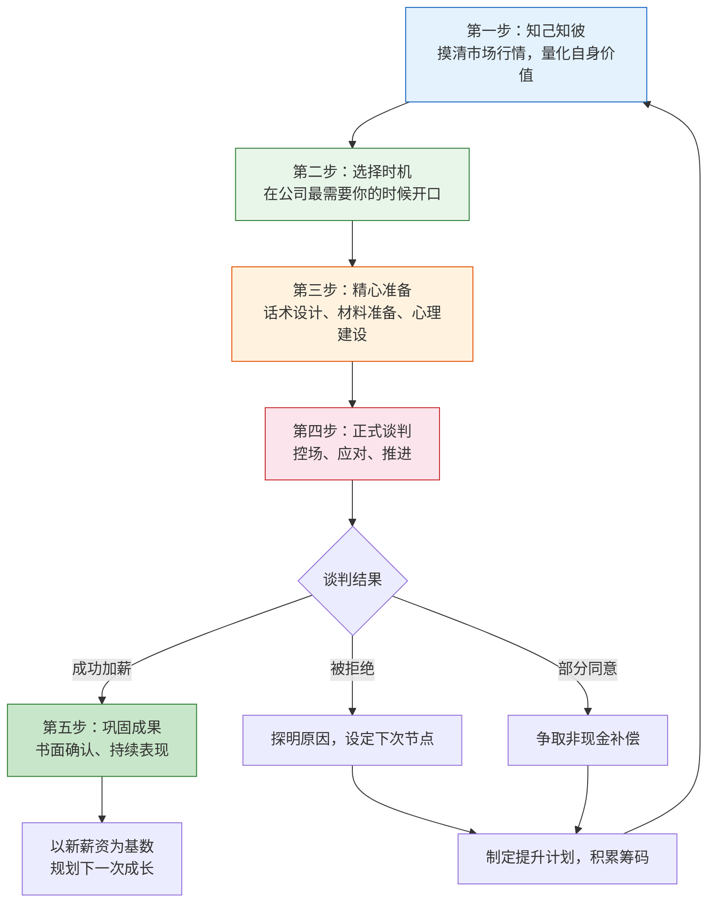
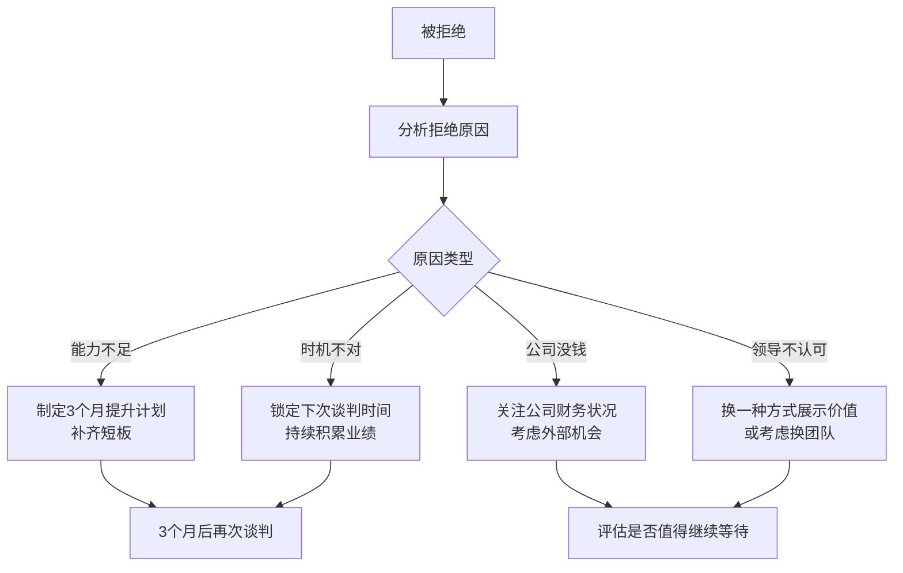

## 技巧一：薪资谈判的五步法

薪资谈判是职场中回报率最高的技能之一。一次成功的谈判可能让你的年薪增加数万元，而这个增量会以复利方式累积——未来每一次跳槽、每一次涨薪，都以这个更高的基数为起点。然而，大多数职场人从未系统学习过谈判，仅凭直觉和"勇气"上阵，结果往往不尽如人意。

本节将薪资谈判拆解为五个可操作的步骤，从底层心理学原理到具体话术模板，帮助你从"不敢谈"进阶到"谈得好"。

### 为什么薪资谈判如此重要

先看一组数据：

| 指标 | 主动谈判者 | 从不谈判者 | 差距 |
|------|-----------|-----------|------|
| 年均涨幅 | 15-20% | 5-8% | 10%+ |
| 10年累计收入差距 | — | — | 约30-50万 |
| 谈判成功率 | 67%获得加薪 | — | — |
| 心理满意度 | 更高（掌握主动权） | 更低（被动接受） | — |

> 数据来源：猎聘《2024职场薪酬调研报告》、智联招聘《职场人薪资谈判行为调研》

**关键认知**：不谈判本身就是一种谈判——你在用沉默告诉对方"我对当前薪资完全满意"。公司每年的普调预算有限（通常5-10%），而主动谈判的涨幅往往远超这个数字。

**谈判的心理学基础**：

1. **锚定效应（Anchoring Effect）**：人类在做决策时，会过度依赖第一个接触到的数字。谁先出价，谁就在设定"锚点"。如果你先提出一个合理的高数字，最终结果往往会围绕这个数字波动。

2. **损失厌恶（Loss Aversion）**：人对损失的痛感是获得同等收益快感的2倍。当你暗示"如果薪资不匹配，我可能会考虑其他机会"时，公司在心理上感受到的"损失"远大于"再招一个人的成本"。

3. **BATNA原则（Best Alternative To a Negotiated Agreement）**：你的谈判力量取决于你的最佳替代方案。有外部offer的人，谈判底气完全不同。即使不打算离开，拥有BATNA也能让你在谈判中保持冷静和自信。

4. **互惠原则（Reciprocity）**：当你主动展示自己的价值和忠诚时，对方会产生回报的心理压力。先给予，再索取，效果远好于单方面要求。

### 五步法总览



### 第一步：知己知彼——摸清行情，量化价值

这一步的核心是回答两个问题：**"市场上我这样的人值多少钱？"** 和 **"我为公司创造了多少价值？"**

#### 1.1 市场薪资调研

不要凭感觉判断自己的薪资是否合理，要用数据说话。以下是按可靠度排序的信息来源：

**第一梯队：权威薪资报告**

| 平台/来源 | 特点 | 适用场景 | 获取方式 |
|-----------|------|---------|---------|
| 猎聘薪资报告 | 覆盖一线至三线城市，按行业/岗位/年限细分 | 了解整体薪资区间 | 猎聘App → 薪资查询 |
| BOSS直聘薪酬查询 | 数据量大，更新快 | 了解当前市场实时价位 | BOSS直聘App → 薪酬查询 |
| 脉脉职言区 | 真实员工爆料，含隐性收入 | 了解目标公司实际薪资 | 脉脉App → 搜索公司名+薪资 |
| 看准网 | 含薪资、面试、评价 | 综合了解目标公司 | 看准网搜索 |
| 国家统计局数据 | 官方数据，按行业/地区分 | 了解行业整体水平 | stats.gov.cn |

**第二梯队：直接信息源**

- **同行交流**：加入行业社群（微信群、知识星球），在建立信任后自然地聊薪资话题。注意：直接问"你工资多少"很突兀，更好的方式是"我最近在看机会，想了解一下行情，咱们这个岗位大概在什么区间？"
- **猎头**：猎头是薪资信息的金矿。在脉脉或LinkedIn上联系几位猎头，表达你对市场行情的好奇（不一定真的要跳槽），他们会很乐意分享市场数据来建立关系。
- **前同事**：已经离开公司的前同事更愿意分享真实薪资，而且他们可能了解竞品公司的薪资水平。
- **面试**：即使不打算跳槽，定期参加面试是了解自身市场价值的最直接方式。面试中HR给出的薪资范围就是市场对你当前能力的真实定价。

**第三梯队：间接参考**

- 招聘网站上的薪资范围（JD中标注的往往有20-30%的弹性空间）
- 行业自媒体的薪资分析文章
- 社交媒体上的薪资讨论帖

**调研模板**——建议用表格记录你的发现：

```text
岗位名称：_______________
城市：_______________
工作年限：_______________
学历：_______________

数据来源1：________  薪资区间：____-____  样本量：____
数据来源2：________  薪资区间：____-____  样本量：____
数据来源3：________  薪资区间：____-____  样本量：____

市场中位数：________
市场75分位：________
市场90分位：________

我当前薪资：________
我当前薪资在市场中的分位：________
```

#### 1.2 量化你的价值

市场薪资告诉你"别人值多少"，价值量化告诉你"你对公司值多少"。后者才是谈判的核心武器。

**价值量化公式**：

```text
你的谈判价值 = 直接创造的收入 + 节省的成本 + 带来的隐性收益
```

不同岗位的价值量化方式不同：

| 岗位类型 | 量化维度 | 具体指标示例 |
|---------|---------|------------|
| 销售 | 直接收入 | 个人业绩占团队比例、客户续约率、新客户开发数 |
| 技术 | 效率/质量 | 项目交付周期缩短X%、系统故障率降低X%、代码质量指标 |
| 产品 | 业务增长 | DAU增长X%、用户留存提升X%、营收贡献 |
| 运营 | 成本/效率 | 获客成本降低X%、转化率提升X%、流程效率提升 |
| 职能 | 成本节约 | 招聘成本降低X%、流程优化节省工时、合规风险降低 |

**量化示例**（假设你是Java后端开发）：

```text
过去一年的核心贡献：
1. 主导XX系统重构，系统响应时间从800ms降至120ms
   → 用户流失率降低15%，按日活10万计算，年挽回收入约XX万
2. 开发自动化部署工具，部署时间从2小时缩短至15分钟
   → 每周节省团队10小时，按5人团队计算，年节省人力成本约XX万
3. 带领3人小组完成XX项目，提前2周交付
   → 项目提前上线带来额外收入约XX万
```

**注意**：即使你的贡献很难直接换算成金额，也要尽量找到关联。比如"提升了用户体验"可以关联到"用户满意度评分从4.2提升到4.7"，"NPS（净推荐值）提升了12个点"。

#### 1.3 准备你的谈判筹码

谈判筹码是你在谈判桌上的"弹药"。筹码越多，你的议价能力越强。

**筹码清单**（按威力从高到低排列）：

1. **外部offer**（最强筹码）：拿到一个真实的、薪资更高的offer。这不是威胁，而是事实——你有了选择权。使用时注意措辞，不要说"不加钱我就走"，而要说"我收到了一个机会，薪资比现在高30%，但我更想留在这里，所以想和您聊聊我的薪资是否能调整"。

2. **不可替代性**：如果你正在负责核心项目，或者你是某个技术领域的唯一专家，这本身就是筹码。不需要说出来，公司心里清楚。

3. **可量化的业绩**：如上所述的量化数据，用数字说话。

4. **行业人脉和资源**：如果你有客户资源、行业人脉、或能为公司带来合作机会，这些都是隐性价值。

5. **未来承诺**：表明你愿意承担更多责任、带团队、拓展业务，让公司看到投资你的未来回报。

### 第二步：选择时机——在正确的时间说正确的话

时机选择错误，即使内容再好也可能事倍功半。谈判时机的选择本质上是在回答：**什么时候公司最不愿意失去你，最愿意投资你？**

#### 2.1 最佳时机窗口

**S级时机（成功率最高）**：

- **拿到外部offer时**：你有了真实的替代方案，心态最从容，筹码最充足。关键是要在正式接受offer之前和当前公司谈——一旦接受了新offer再反悔，对两边都不好。
- **刚完成重大项目并获得好评时**：你的价值刚被验证，领导对你的印象最正面。不要等热度过去。
- **领导主动找你谈未来发展时**：这是最自然的谈判窗口，领导已经打开心扉，你顺势提出薪资问题水到渠成。

**A级时机（成功率较高）**：

| 时机 | 窗口期 | 操作要点 |
|------|-------|---------|
| 年度绩效评估后 | 评估结果公布后1-2周 | 如果绩效优秀，趁热打铁 |
| 公司获得融资/业绩大涨后 | 消息公布后1个月内 | 公司有钱且士气高 |
| 团队有人离职，你的职责扩大时 | 领导安排新工作后的1周内 | 你刚承担了更多责任 |
| 试用期转正时 | 转正面谈中 | 最自然的薪资调整窗口 |
| 工作满1年/2年等整数节点时 | 周年前后 | 有仪式感，领导不好拒绝 |

**B级时机（可以谈但成功率一般）**：

- 公司日常运营平稳期——没有特别好也没有特别差的借口
- 年中调薪窗口（如果公司有固定调薪周期）

**绝对要避开的时机**：

- 公司裁员/降薪期间：不是你不够好，是公司真的没钱
- 你刚犯了重大错误之后：筹码为负
- 领导压力极大/焦头烂额时：他会把你的要求当成添乱
- 周五下午快下班时：情绪准备不足，容易草率决定
- 刚入职不到6个月：还没有足够业绩支撑

#### 2.2 如何创造谈判时机

有时候你等不到"完美时机"，需要自己创造：

- **主动承担高价值项目**：项目完成后自然有了谈判的筹码和时机
- **定期汇报工作成果**：让领导持续意识到你的价值，而不是到谈薪时才"突然发现"
- **在1:1会议中铺垫**：先聊职业发展，再自然过渡到薪资——"我很喜欢现在的工作，也在思考长期发展，想了解一下公司在薪资方面是怎么考虑的？"

### 第三步：精心准备——话术设计与心理建设

#### 3.1 谈判前的材料准备

**价值证明材料包**（建议整理成1-2页文档）：

```text
一、核心业绩总结（过去6-12个月）
  1. [量化成果1]：具体数据 + 业务影响
  2. [量化成果2]：具体数据 + 业务影响
  3. [量化成果3]：具体数据 + 业务影响

二、额外贡献
  - 带教新人X人
  - 主导/参与跨部门项目X个
  - 获得的表彰/奖项

三、未来计划
  - 计划承担的新职责
  - 预期能带来的新价值
  - 个人成长方向与公司发展的契合点

四、市场薪资参考（可选，视公司文化决定是否展示）
  - 市场同岗位薪资区间
  - 竞品公司同岗位薪资水平
```

**注意**：这份材料不一定在谈判桌上直接展示，但整理的过程本身就是在梳理你的"故事线"，让你在谈判时更加自信和有条理。

#### 3.2 话术设计

**开场话术——建立积极基调**：

```text
"领导，感谢您抽出时间。我想和您聊聊我的职业发展和薪资方面的想法。
我来公司已经X年了，这段时间我一直在努力为团队创造价值，
也想借这个机会和您同步一下我的情况，听听您的看法。"
```

**要点**：不要一上来就谈钱，先表达感谢和对工作的投入，让对方放松警惕。

**核心陈述——用STAR法则展示价值**：

```text
"过去一年，我在几个方面取得了比较明显的成果：

第一个是XX项目（Situation/Task），
当时面临XX挑战，我负责XX工作（Action），
最终实现了XX结果，为公司带来了XX收益（Result）。

第二个是……

基于这些贡献，我期望薪资能调整到XX-XX的范围，
这个范围也是我参考了市场行情后得出的。"
```

**锚定技巧——如何报出你的期望数字**：

| 策略 | 操作 | 适用场景 |
|------|------|---------|
| 区间锚定 | 报一个范围，底线是你的真实期望 | 大多数场景 |
| 高锚定 | 报市场75-90分位，留出谈判空间 | 筹码充足时 |
| 精确数字 | 报18,500而非18,000 | 精确数字显得更有依据 |

**关键原则**：让对方先出价对你有利（如果对方先报价，你可以直接判断是否满意），但很多时候对方会反过来让你先说。此时你的报价区间底线应该高于你的真实期望——给自己留出"让步空间"。

#### 3.3 心理建设

谈判前最常见的心理障碍及应对：

| 心理障碍 | 纠正认知 |
|---------|---------|
| "我怕被拒绝" | 被拒绝不会失去任何东西，最坏的结果就是维持现状 |
| "谈钱很俗/不好意思" | 薪资是专业话题，谈薪是职业素养的体现 |
| "领导会觉得我只认钱" | 用业绩和数据说话，展示的是专业而非贪婪 |
| "公司有制度，谈也没用" | 制度是底线，不是天花板；特殊贡献可以突破制度 |
| "我怕影响关系" | 成功的谈判反而会让领导更尊重你——你展现了自信和专业 |

**谈判前的自信心建设清单**：

- [ ] 我有至少3个可量化的业绩成果
- [ ] 我知道市场同岗位的薪资区间
- [ ] 我有清晰的期望数字和底线数字
- [ ] 我已经演练过至少2次（找朋友模拟）
- [ ] 我准备好了被拒绝后的应对方案
- [ ] 我知道如果谈崩了，我的替代方案是什么

### 第四步：正式谈判——控场、应对、推进

#### 4.1 谈判的节奏控制

一场典型的薪资谈判大约持续15-30分钟，可以分为三个阶段：


**暖场阶段**（5分钟）：
- 感谢领导的时间
- 简要表达你对工作的热爱和投入
- 自然过渡到"今天想聊聊薪资方面的想法"

**核心阶段**（10-20分钟）：
- 用STAR法则陈述你的核心贡献（3-5分钟）
- 报出你的期望薪资范围（1分钟）
- **然后闭嘴**——不要急着解释或自我否定，让对方消化
- 倾听对方的回应，根据情况灵活应对

**收尾阶段**（5分钟）：
- 无论结果如何，都要表达感谢和积极态度
- 如果达成了共识，确认下一步（"那这个调整大概什么时候生效？"）
- 如果没有达成，约定下次讨论时间

#### 4.2 常见场景的应对策略

**场景一：领导说"我需要考虑一下"**

```text
你的回应：
"完全理解，这确实需要慎重考虑。您大概什么时候能有结果？
我可以在X天后再来和您同步吗？"
→ 目的：锁定一个明确的时间节点，避免被无限期拖延
```

**场景二：领导说"公司有制度，统一调薪"**

```text
你的回应：
"我理解公司的制度安排。不过我觉得我的贡献可能超出了
当前职级的标准范围，比如[具体例子]。
不知道是否有破格调整的可能？
或者我们是否可以讨论一下职级晋升的路径？"
→ 目的：不否定制度，但指出制度之外的空间
```

**场景三：领导说"你的表现还不够好"**

```text
你的回应：
"感谢您的反馈，我非常想知道具体哪些方面需要提升。
您能举一些具体的例子吗？
如果我在这些方面有所改善，我们是否可以在X个月后再讨论？"
→ 目的：把模糊的否定变成具体的标准，同时锁定下次谈判时间
```

**场景四：领导反问"你期望多少"**

```text
你的回应：
"根据我的调研和对自身价值的评估，我期望的薪资范围是XX-XX。
当然，我也很想听听您对这个数字的看法。"
→ 目的：给出范围而非精确数字，留出谈判空间
```

**场景五：领导直接拒绝**

```text
你的回应：
"我理解公司可能有各方面的考量。
那除了薪资之外，是否可以在其他方面做一些调整？
比如更多的年假、培训预算、或者弹性工作时间？
另外，如果X个月后我的表现达到XX标准，我们是否可以再谈？"
→ 目的：不空手而归，争取其他补偿 + 锁定下次谈判
```

#### 4.3 非现金补偿的谈判清单

当薪资无法调整时，以下每一项都有实际的经济价值：

| 补偿类型 | 经济价值估算 | 谈判难度 | 建议话术 |
|---------|------------|---------|---------|
| 更多年假 | 每天=日薪 | 低 | "我希望每年能多X天假期" |
| 弹性工作/远程 | 节省通勤时间和成本 | 低 | "希望能每周X天远程办公" |
| 培训/认证预算 | 5000-30000元/年 | 低 | "我希望能参加XX认证培训" |
| 职级晋升 | 为下次涨薪铺路 | 中 | "我希望能明确晋升路径和时间表" |
| 股票/期权 | 潜在高收益 | 高 | "是否可以考虑股权激励？" |
| 交通/住房补贴 | 直接现金收益 | 中 | "是否有补贴政策可以申请？" |
| 年终奖保底 | 降低收入不确定性 | 中 | "年终奖是否有保底机制？" |
| 学历提升支持 | 长期价值 | 低 | "公司是否支持在职读研/MBA？" |

### 第五步：巩固成果——让谈判收益持续放大

#### 5.1 谈判成功后的关键动作

很多人谈完就完了，但最后一步同样重要：

**立即行动**（24小时内）：

- **书面确认**：给领导发一封邮件或消息，总结谈判结果
```text
  主题：关于薪资调整的沟通确认

  领导您好，

  感谢今天和我的沟通。根据我们的讨论，确认以下内容：
  1. 薪资从XX调整至XX，自XX月起生效
  2. [其他补偿条件]

  如有遗漏或需要补充的地方，请随时告知。

  谢谢！
  ```
  这不仅是确认，更是留下书面记录——口头承诺有时会被"遗忘"。

- **感谢**：无论涨幅多少，表达真诚的感谢。让领导觉得这次谈判是双赢。

**后续行动**（1-3个月）：

- **加倍努力**：涨薪后的3个月是你需要证明"物有所值"的关键期。领导会暗中观察你是否"涨了钱就松懈"。
- **持续汇报**：继续定期汇报工作成果，强化领导"这次加薪是对的"的认知。
- **铺垫下一次**：在日常工作中持续积累业绩，为下一次谈判（或晋升）做准备。

#### 5.2 谈判被拒后的行动计划

被拒绝不是终点，而是一个新的起点：



**3个月提升计划模板**：

```text
目标：在3个月内提升XX能力，达到XX标准

第1个月：
- 学习XX技能（具体课程/书籍）
- 主动承担XX类型的工作
- 寻找一位导师/mentor

第2个月：
- 在实际项目中应用新技能
- 记录量化成果
- 参加行业交流，扩展人脉

第3个月：
- 整理3个月的成果报告
- 和领导做中期review
- 为下次谈判做准备
```

### 高级技巧：超越基础五步法

#### 谈判心理学进阶

**1. 框架效应（Framing Effect）**

同样的诉求，不同的表达方式效果截然不同：

| 低效表达 | 高效表达 | 原理 |
|---------|---------|------|
| "我觉得我的工资太低了" | "我期望薪资能匹配我的市场价值" | 前者是抱怨，后者是专业诉求 |
| "不加钱我就走" | "我有一个机会，但更想留在这里" | 前者是威胁，后者是忠诚+选择权 |
| "别人都比我高" | "我关注的是我个人的价值匹配" | 前者是攀比，后者是专业 |
| "我需要钱" | "这个调整能让我更专注地投入工作" | 前者是个人需求，后者是对公司的承诺 |

**2. 让步策略**

- **不要一次让到底**：如果你期望20K，开口报25K，对方说太高了，你立刻降到20K——对方会觉得20K还不是底线。正确的做法是第一次让步到23K，给对方"赢了"的感觉。
- **让步要越来越小**：25K → 23K（让2K） → 22K（让1K） → 21.5K（让500）。这传递的信号是"我已经接近底线了"。
- **每次让步都要换取什么**："如果薪资可以降到22K，我希望年终奖能有一个保底承诺"——不要无条件让步。

**3. 沉默的力量**

报出你的期望数字后，**闭嘴**。大多数人在沉默中会感到不安，然后开始自我解释、自我降价。但你需要忍住——沉默是一种强大的谈判工具，它把压力转移到了对方身上。

#### 不同场景的特殊策略

**场景A：跳槽时的薪资谈判**

跳槽是薪资跳跃最大的机会（通常20-50%涨幅），但也是最容易踩坑的场景：

- **永远不要先报当前薪资**（在一些城市已立法禁止公司询问）：如果HR问"你现在的薪资是多少"，可以说"我更关注这个岗位的市场价值和我能带来的贡献，我们先聊聊这个岗位的薪资范围好吗？"
- **用"期望薪资"替代"当前薪资"**：如果必须给数字，给你的期望范围，而非当前数字。
- **同时拿到多个offer**：这是最理想的状态，你有了真实的市场定价和选择权。

**场景B：内部晋升的薪资谈判**

晋升通常伴随涨薪，但涨幅可能不如你的预期：

- **提前了解晋升后的薪资范围**：和HR或已晋升的同事打听
- **如果涨幅不达预期，明确表达**："我很高兴获得晋升，不过我对薪资调整有一些想法，希望能和您详细聊聊"
- **注意时间窗口**：晋升宣布后1-2周是最佳谈判窗口

**场景C：应届生/职场新人的首次谈判**

新人的筹码相对少，但仍有机会：

- **用实习/项目经历证明潜力**
- **强调你的学习速度和适应能力**
- **关注总包而非基本工资**：签字费、股票、住房补贴等可能比基本工资更有弹性

#### 高频误区与纠正

| 误区 | 为什么错 | 正确做法 |
|------|---------|---------|
| 用"我生活成本高"当理由 | 公司买的是你的价值，不是你的账单 | 用业绩和市场数据说话 |
| 拿同事薪资说事 | 暴露信息来源，显得不专业 | 聚焦于你自己的市场价值 |
| 发邮件谈薪资 | 缺乏即时互动，容易被忽略或误读 | 面对面（或视频），其次电话 |
| 谈完就等结果 | 被动等待可能被拖延 | 主动约定明确的回复时间 |
| 一次没谈成就放弃 | 第一次往往是铺垫 | 设定计划，3个月后再来 |
| 把谈判当对抗 | 对抗性态度会让双方都紧张 | 把它当成一次"共同探讨" |
| 过早亮出底线 | 对方会直接锚定你的底线 | 给出高于底线的区间 |
| 只关注基本工资 | 总包（base+bonus+stock+福利）才重要 | 综合评估所有补偿项 |

### 谈判清单：出门前对照检查

```text
□ 信息准备
  □ 市场薪资区间（至少3个数据源）
  □ 自身价值量化（至少3个量化成果）
  □ 目标公司/部门的薪资结构了解
  □ 领导的性格和沟通风格分析

□ 材料准备
  □ 价值证明材料（业绩总结1-2页）
  □ 期望薪资范围（含底线和理想值）
  □ 非现金补偿备选清单
  □ 邮件模板（谈判后确认用）

□ 心理准备
  □ 至少模拟演练2次
  □ 预设了被拒绝的应对方案
  □ 明确了自己的BATNA（最佳替代方案）
  □ 心态：这是一次专业对话，不是乞求

□ 时机确认
  □ 领导今天状态良好
  □ 没有紧急事务打断
  □ 预留了至少30分钟的谈话时间
  □ 选择了私密的沟通环境
```

### 本节小结

薪资谈判的本质不是"要钱"，而是一次**价值确认的专业对话**。你的目标是让公司清楚地认识到你的价值，并愿意为此支付合理的对价。

五步法的核心逻辑：

1. **知己知彼**——用数据武装自己，消除信息不对称
2. **选择时机**——在公司最认可你价值的时刻出手
3. **精心准备**——话术、材料、心理三重准备
4. **正式谈判**——控场、应对、灵活推进
5. **巩固成果**——书面确认、持续表现、铺垫未来

记住：**每一次谈判都是下一次谈判的起点**。无论这次结果如何，你都在积累经验、建立形象、为未来铺路。从今天开始，把薪资谈判当作一项需要持续精进的专业技能来对待。
