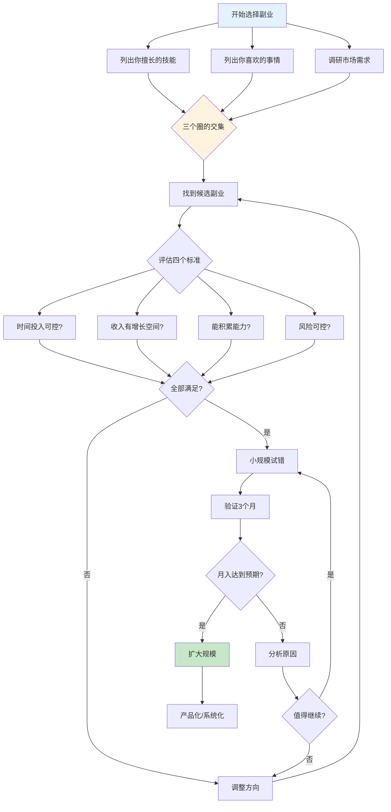
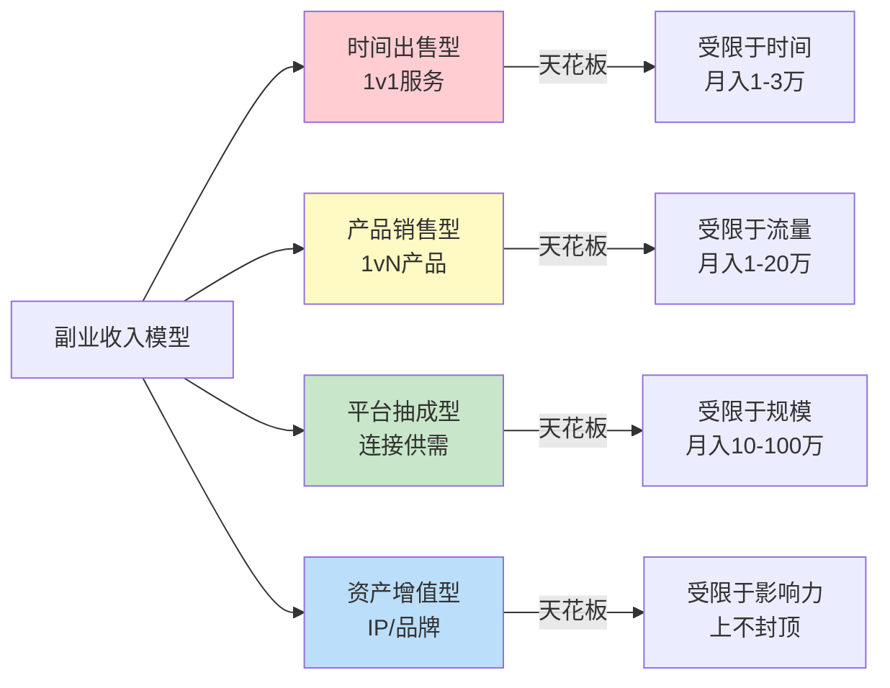
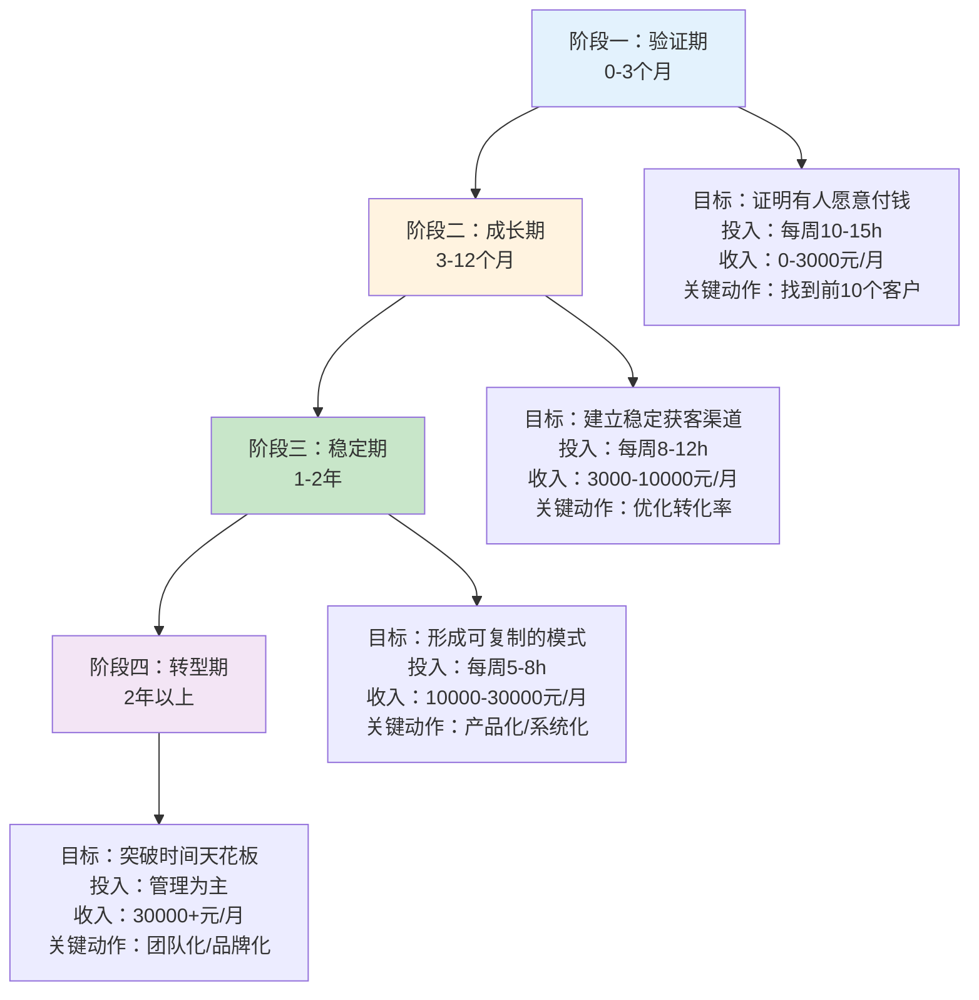
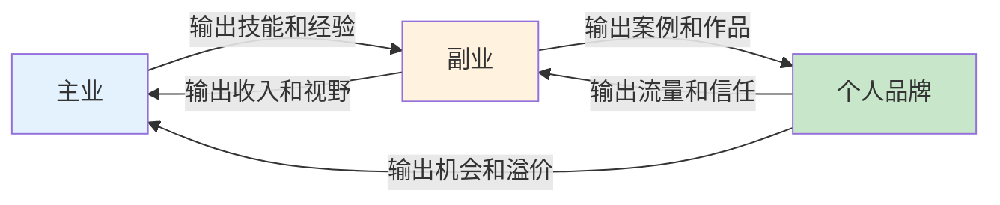

## 技巧二：副业选择的"三圈模型"

> **核心观点**：最好的副业不是"什么火做什么"，而是在你擅长的事、你喜欢的事、市场需要的事三者交集中找到的那个点。这个交集越大，副业的成功率越高、持续性越强、天花板越高。

### 为什么需要一个模型来选副业？

大多数人选副业的方式是错误的。他们要么跟风——"听说做自媒体赚钱，我也去做"；要么凭感觉——"我喜欢打游戏，那就做游戏主播吧"；要么被割韭菜——"花 3999 元学了短视频带货，结果一单没出"。

这些方式失败的根本原因相同：**只考虑了一个维度**。跟风只看了市场，凭感觉只看了兴趣，被割韭菜只看了别人的能力（而非自己的）。

三圈模型的理论基础来自日本管理学家�的"Ikigai"（生き甲斐）概念，以及斯坦福大学设计学院的"人生设计"框架。两者都指向同一个结论：**可持续的事业一定建立在多个维度的交集之上**。



### 三圈模型详解

选择副业时，需要找到以下三个圈的交集：

```text
         ┌───────────────────┐
         │     擅长的        │
         │     (能力圈)      │
         │                   │
         │    ┌───────────┐  │
         │    │  喜欢的   │  │
         │    │  (热情圈) │  │
         │    │  ┌─────┐  │  │
         │    │  │交集区│  │  │
         │    │  └─────┘  │  │
         │    └───────────┘  │
         │         ┌─────────┤
         │         │有市场的 │
         │         │(需求圈) │
         └─────────┴─────────┘
```

三个圈各自代表什么？怎么找到自己在每个圈里的位置？下面逐一拆解。

#### 第一圈：擅长的（能力圈）

**定义**：你比大多数人做得好的事情。注意，"擅长"不等于"专业"，也不等于"有证书"。擅长的判断标准是：**做这件事时，你比周围 80% 的人效率更高或质量更好**。

**自我诊断的三种方法**：

1. **回想法**：回忆过去 3 年，同事/朋友/家人主动找你帮忙的事情是什么？别人主动找你，说明他们认可你在这方面的能力。比如总有人找你修电脑、改文案、做 PPT、选餐厅——这些都是能力信号。

2. **测评法**：使用盖洛普优势识别器（CliftonStrengths）或 VIA 性格优势测评，获得系统化的能力画像。盖洛普 34 项主题中排名前 5 的就是你的核心优势。

3. **记录法**：连续两周记录每天的工作内容，标注哪些任务你完成得又快又好、哪些任务让你觉得吃力。前者就是你的能力区。

**能力圈的层次**：

| 层次 | 描述 | 副业可行性 | 示例 |
|------|------|------------|------|
| 业余水平 | 比完全不懂的人强 | 低，需要先提升 | 会用 Photoshop 做简单修图 |
| 中级水平 | 比多数非专业人士强 | 中，可以做入门级服务 | 能独立完成品牌 VI 设计 |
| 专家水平 | 比多数同行做得好 | 高，可以做高端服务/教学 | 设计作品获过行业奖项 |
| 头部水平 | 行业内有知名度 | 极高，可以做IP/品牌 | 设计师粉丝10万+ |

> **关键洞察**：副业不需要你是顶尖专家。中级水平就可以开始变现——因为你的客户是完全不懂的人，而不是同行。一个 PPT 做得比同事好的人，就能教完全不会做 PPT 的人。

#### 第二圈：喜欢的（热情圈）

**定义**：让你愿意在下班后还花时间去做的事情。判断标准不是"想想觉得挺有意思"，而是"你已经在没有报酬的情况下主动做过"。

**区分"真喜欢"和"假喜欢"**：

| 维度 | 真喜欢 | 假喜欢 |
|------|--------|--------|
| 行为证据 | 已经自发做了半年以上 | 只是想想，没实际做过 |
| 遇到困难时 | 想办法解决，不轻易放弃 | 遇到困难就放弃 |
| 时间感知 | 做起来忘了时间 | 做一会儿就想刷手机 |
| 谈论时 | 能滔滔不绝讲细节 | 只能泛泛而谈 |
| 不做时 | 会惦记、会想念 | 不做也不想 |

**热情的来源分类**：

- **创造型热情**：喜欢从无到有创造东西（写作、编程、设计、手工、烹饪）
- **帮助型热情**：喜欢帮助别人解决问题（教学、咨询、社群运营）
- **探索型热情**：喜欢研究和发现新事物（测评、攻略、研究分析）
- **表达型热情**：喜欢展示和分享（演讲、直播、内容创作）
- **竞争型热情**：喜欢挑战和超越（销售、竞技、优化排名）

> **常见误区**：很多人把"喜欢消费"当成"喜欢这个领域"。喜欢看电影不等于喜欢做影评，喜欢打游戏不等于喜欢做游戏解说。消费和生产是完全不同的活动。你需要确认自己喜欢的是"做这件事的过程"，而不是"享受这件事的成果"。

#### 第三圈：有市场的（需求圈）

**定义**：有人愿意为这件事付钱。注意是"愿意付钱"，不是"觉得不错"。很多人在网上发内容收到点赞就以为有市场，但点赞和付费之间隔着巨大的鸿沟。

**验证市场需求的五种方法**：

1. **搜索验证法**：在百度指数、微信指数、抖音搜索中查看相关关键词的搜索量。搜索量持续上升说明需求在增长。搜索量大但优质内容少说明供给不足——这就是机会。

2. **平台验证法**：在淘宝/闲鱼/小红书/知乎/抖音搜索你的副业方向，看看：
   - 有没有人在卖类似的服务/产品？（有 = 需求存在）
   - 他们的销量/评价如何？（销量高 = 需求旺盛）
   - 他们的定价是多少？（决定你的收入天花板）
   - 差评里客户抱怨什么？（你的差异化机会）

3. **社群验证法**：加入 3-5 个相关社群（微信群/QQ群/豆瓣小组/贴吧），观察：
   - 群里最常被问的问题是什么？（痛点）
   - 有没有人在群里卖东西/接单？（变现路径）
   - 群友的付费意愿如何？（购买力）

4. **预售验证法**：在正式投入前，先发一条朋友圈或小红书，说"我准备提供 XX 服务，有兴趣的私信我"。如果 3 天内有 5 个人以上私信，说明需求存在。如果无人问津，要么方向错了，要么你的表达有问题。

5. **竞品分析法**：找到 3-5 个已经在做这件事的人，分析他们的：
   - 粉丝量/阅读量（市场容量）
   - 变现方式（广告/带货/课程/咨询/接单）
   - 定价策略（你的定价参考）
   - 更新频率（投入时间参考）
   - 内容质量（你的差异化空间）

**市场规模判断矩阵**：

| | 单价低（<100元） | 单价中（100-1000元） | 单价高（>1000元） |
|---|---|---|---|
| **需求量大** | 走量模式，适合自动化 | 理想区间，优先选择 | 高端市场，需要品牌 |
| **需求量中** | 不推荐，收入天花板低 | 可以尝试，注意获客成本 | 需要精准定位客户 |
| **需求量小** | 不推荐 | 不推荐 | 除非单价极高，否则不推荐 |

### 三圈交集的实操方法

知道了三个圈是什么，接下来是关键问题：怎么找到它们的交集？

#### 第一步：头脑风暴（30 分钟）

准备三张纸（或三个文档），分别写下：

- **能力清单**：至少写 10 项你擅长的事，从工作技能到生活技能都可以
- **兴趣清单**：至少写 10 项你喜欢做的事，包括已经做的和想做的
- **需求清单**：至少写 10 个你观察到的市场需求，来自日常观察、新闻、朋友圈

#### 第二步：交叉匹配（20 分钟）

把三张纸并排放，找出同时出现在两张纸上的项目，然后检查第三张纸：

```text
能力: Excel很强 → 兴趣: 喜欢教人 → 需求: 很多人想学Excel
交集: Excel教学/培训 ✓

能力: 英语好 → 兴趣: 喜欢旅行 → 需求: 出境游定制
交集: 境外旅行定制顾问 ✓

能力: 会剪视频 → 兴趣: 喜欢美食 → 需求: 餐厅需要推广
交集: 美食探店视频制作 ✓
```

通常能找到 3-5 个候选方向。

#### 第三步：评分排序（15 分分钟）

对每个候选方向，用 1-5 分评估以下维度：

| 评估维度 | 权重 | 方向A | 方向B | 方向C |
|----------|------|-------|-------|-------|
| 能力匹配度 | 25% | ? | ? | ? |
| 兴趣持久度 | 20% | ? | ? | ? |
| 市场需求量 | 25% | ? | ? | ? |
| 启动难度（越低越好） | 15% | ? | ? | ? |
| 收入天花板 | 15% | ? | ? | ? |
| **加权总分** | 100% | ? | ? | ? |

加权总分最高的方向，就是你的首选副业方向。

### 四个评估标准详解

在流程图中，候选副业需要通过四个标准的检验。这里详细解释每个标准。

#### 标准一：时间投入可控

**核心问题**：这个副业每周需要多少小时？你能持续投入吗？

副业的时间投入分为三个阶段：

| 阶段 | 每周时间 | 持续时间 | 主要任务 |
|------|----------|----------|----------|
| 启动期 | 10-15 小时 | 1-3 个月 | 学习技能、搭建平台、产出第一批内容 |
| 成长期 | 8-12 小时 | 3-6 个月 | 持续产出、获取客户、优化流程 |
| 稳定期 | 5-8 小时 | 持续 | 维护运营、迭代产品、扩大规模 |

**判断标准**：如果你每周连 8 小时都拿不出来（每天 1 小时多一点），那就选择"异步型"副业——不需要实时在线，可以利用碎片时间做的。比如写文章、做课程、卖模板，而不是直播、咨询、接急单。

**时间投入对照表**：

| 副业类型 | 最低时间投入 | 时间灵活性 | 适合人群 |
|----------|-------------|------------|----------|
| 自媒体内容 | 每周 5-8h | 高，可提前批量制作 | 有表达欲的人 |
| 技术外包 | 每周 10-15h | 中，有截止日期 | 有硬技能的人 |
| 在线课程 | 前期 40-60h，后期几乎不花时间 | 极高 | 有教学能力的人 |
| 咨询顾问 | 每次 1-2h，按需 | 低，需要实时沟通 | 有行业经验的人 |
| 电商/代购 | 每天 1-2h | 低，需要处理订单 | 有供应链资源的人 |
| 知识付费社群 | 每周 3-5h | 中 | 有粉丝基础的人 |

#### 标准二：收入有增长空间

**核心问题**：这个副业的收入是线性的（干一小时赚一小时的钱），还是可以指数增长的？

副业收入模型分为四种：



- **时间出售型**（咨询、接单、家教）：收入 = 单价 × 时间。时间有上限，收入有天花板。初期适合，但要尽早转型。
- **产品销售型**（课程、模板、电子书）：做一次，卖无数次。收入上限取决于流量和转化率。
- **平台抽成型**（社群、中介、撮合）：连接供给和需求，从中抽成。需要规模效应。
- **资产增值型**（个人IP、品牌、专利）：前期投入大，后期复利效应强。天花板最高。

> **策略建议**：从时间出售型起步（验证需求、积累经验），逐步转型到产品销售型（把服务产品化），最终走向资产增值型（建立个人品牌）。

#### 标准三：能积累能力

**核心问题**：做这个副业 1 年后，你获得了什么可迁移的能力？

好的副业应该让你越做越强。判断标准：

- **技能可迁移**：副业中学到的技能，在主业中也能用。比如做自媒体锻炼的写作和表达能力，对任何职业都有帮助。
- **资源可积累**：副业过程中积累的客户、人脉、作品集，未来可以复用。
- **认知可提升**：副业让你接触到主业接触不到的信息和视角。

**反面案例**：刷单、点赞、做问卷这类"兼职"，不积累任何能力，做 3 年和做 3 天没有区别。它们的本质是出卖时间换取微薄报酬，不是副业，是消耗。

#### 标准四：风险可控

**核心问题**：最坏情况下，你会损失什么？

副业风险评估框架：

| 风险类型 | 评估问题 | 可接受范围 |
|----------|----------|------------|
| 财务风险 | 需要投入多少启动资金？ | 不超过 1 个月工资 |
| 时间风险 | 失败后损失多少时间？ | 不超过 3 个月的业余时间 |
| 法律风险 | 是否有合规问题？ | 无灰色地带 |
| 声誉风险 | 失败会影响主业/个人品牌吗？ | 不会 |
| 机会风险 | 做这个会错过更好的机会吗？ | 机会成本可接受 |

**红线**：以下副业方向绝对不碰——需要大量前期投入（囤货、加盟费）、涉及法律灰色地带（刷单、灰产）、会与主业产生利益冲突（竞业限制）。

### 副业方向探索清单

#### 从"擅长"出发

| 你的技能 | 副业方向 | 启动成本 | 月收入潜力 | 成长路径 |
|----------|----------|----------|------------|----------|
| 编程 | 技术咨询、外包项目、技术博客 | 近零 | 5K-50K | 接单→课程→技术IP |
| 设计 | 设计接单、设计模板、设计教程 | 近零 | 3K-30K | 接单→模板→设计品牌 |
| 写作 | 自媒体、文案代写、出版书籍 | 近零 | 2K-100K | 代写→自媒体→知识IP |
| 翻译 | 翻译接单、字幕翻译、本地化 | 近零 | 3K-20K | 接单→专业领域→翻译公司 |
| 营销 | 营销顾问、社群运营、广告投放 | 近零 | 5K-50K | 代运营→顾问→营销品牌 |
| 教学 | 在线课程、家教、培训 | 低 | 3K-30K | 1v1→小班→在线课程 |
| 数据分析 | 数据咨询、报表制作、数据可视化 | 近零 | 5K-30K | 接单→自动化工具→数据产品 |
| Excel | 模板制作、培训课程、代做报表 | 近零 | 2K-15K | 代做→模板商城→课程 |

#### 从"喜欢"出发

| 你的兴趣 | 副业方向 | 启动成本 | 月收入潜力 | 成长路径 |
|----------|----------|----------|------------|----------|
| 摄影 | 约拍、摄影教程、图库销售 | 中（器材） | 3K-30K | 约拍→教程→摄影品牌 |
| 健身 | 私教、健身博主、健身课程 | 低 | 3K-50K | 私教→自媒体→健身品牌 |
| 烹饪 | 美食博主、烹饪课程、私厨 | 低 | 2K-30K | 探店→教程→美食IP |
| 旅行 | 旅行博主、旅行定制、导游 | 中 | 3K-50K | 游记→定制→旅行品牌 |
| 游戏 | 游戏主播、游戏陪玩、游戏攻略 | 低 | 1K-100K | 陪玩→直播→游戏IP |
| 手工 | 手工教程、手工艺品销售 | 低 | 2K-20K | 作品→教程→手工品牌 |
| 宠物 | 宠物博主、宠物摄影、寄养 | 低 | 2K-20K | 内容→服务→宠物品牌 |

#### 从"市场"出发

| 市场需求 | 副业方向 | 启动成本 | 月收入潜力 | 成长路径 |
|----------|----------|----------|------------|----------|
| AI应用 | AI工具教学、AI应用开发、AI代运营 | 近零 | 5K-100K | 教学→开发→AI品牌 |
| 短视频 | 短视频代运营、视频剪辑 | 低 | 3K-30K | 剪辑→代运营→MCN |
| 跨境电商 | 选品、运营、客服 | 中 | 5K-100K | 代运营→自营→品牌 |
| 知识付费 | 课程制作、社群运营 | 低 | 3K-50K | 单课→系列→教育品牌 |
| 企业服务 | 财务、法务、人力外包 | 低 | 5K-30K | 个人→团队→公司 |
| 银发经济 | 老年人手机教学、健康咨询、陪伴服务 | 近零 | 2K-15K | 1v1→社区→平台 |
| 宠物经济 | 宠物用品、宠物摄影、宠物寄养 | 中 | 3K-20K | 单项→综合→品牌 |

### 从副业到事业：四阶段进化路径

选好方向只是开始。真正的挑战在于如何从零起步，一步步做大。



#### 阶段一：验证期（0-3 个月）

**核心目标**：用最小成本证明这个方向可行。

**具体行动**：

1. **定义你的 MVP（最小可行产品）**：
   - 服务型副业：先免费帮 3 个人做，收集反馈和案例
   - 产品型副业：先做一个最简单的版本，测试市场反应
   - 内容型副业：先发 30 条内容，看数据反馈

2. **找到前 10 个客户**：
   - 朋友圈发布（最直接，转化率最高）
   - 在相关社群提供免费试用
   - 在闲鱼/淘宝上架低价体验服务
   - 在小红书/抖音发内容引流

3. **收集反馈并迭代**：
   - 每个客户完成后做 5 分钟回访
   - 记录客户最满意和最不满意的点
   - 根据反馈调整服务内容和定价

**验证期的通过标准**：3 个月内获得 10 个付费客户，且复购率超过 30%。

#### 阶段二：成长期（3-12 个月）

**核心目标**：建立稳定的获客渠道，形成标准化的服务流程。

**具体行动**：

1. **选定 1-2 个主力获客渠道**：
   - 不要同时做 5 个平台，集中精力做好 1-2 个
   - 选择标准：你的目标客户最集中在哪里？你最擅长哪种内容形式？

2. **建立标准化流程**：
   - 把重复性工作模板化（报价模板、交付模板、售后模板）
   - 把高频问题整理成 FAQ
   - 建立客户管理系统（哪怕只是一个 Excel 表格）

3. **提升客单价**：
   - 从低价入门产品升级到中价标准产品
   - 增加增值服务（比如设计接单 + 品牌咨询）
   - 建立案例库，用作品说话

#### 阶段三：稳定期（1-2 年）

**核心目标**：把服务产品化，减少对个人时间的依赖。

**具体行动**：

1. **产品化**：
   - 把 1v1 服务中重复出现的需求，做成标准化产品（模板、课程、工具）
   - 产品可以 24 小时销售，不受你的时间限制

2. **建立被动收入管道**：
   - 课程放在平台上自动销售
   - 模板/素材放在商城自动交付
   - 内容持续带来自然流量

3. **优化效率**：
   - 把低价值工作外包出去
   - 使用工具自动化重复流程
   - 建立 SOP（标准操作流程），让别人可以代你执行

#### 阶段四：转型期（2 年以上）

**核心目标**：从个人副业转型为可规模化的事业。

到了这个阶段，你需要做一个关键决策：**是继续做副业，还是把它变成主业？**

决策框架：

| 维度 | 继续做副业 | 转为主业 |
|------|-----------|----------|
| 收入 | 副业收入 < 主业收入 | 副业收入 ≥ 主业收入的 1.5 倍 |
| 增长 | 增长稳定但缓慢 | 增长加速，天花板高 |
| 热情 | 作为兴趣保持 | 愿意 all-in |
| 风险 | 双保险，风险低 | 需要 6 个月以上的生活费储备 |
| 时机 | 市场还在早期 | 市场已经成熟，竞争加剧 |

> **建议**：除非副业收入连续 6 个月超过主业收入的 1.5 倍，且你有 6 个月以上的生活费储备，否则不要轻易辞职。

### 副业选择的常见误区

#### 误区一：什么火做什么

**表现**：看到别人做短视频赚钱就去做短视频，看到 AI 火就去做 AI。

**问题**：等到你看到别人赚钱的时候，红利期往往已经过了。而且你可能既不擅长也不喜欢这个方向，坚持不了 3 个月就放弃。

**纠正**：用三圈模型从自身出发选方向，而不是从市场热点出发。市场热点可以作为参考，但不能作为唯一依据。

#### 误区二：只看收入不看成长

**表现**：选择"来钱快"但不积累能力的副业，比如刷单、做任务、薅羊毛。

**问题**：这类"副业"不积累任何能力，做 3 年和做 3 天没有区别。而且很多是灰色地带，存在法律风险。

**纠正**：每个副业方向都要问自己："做 1 年后，我获得了什么可迁移的能力？"如果答案是"没有"，那就不是副业，是消耗。

#### 误区三：准备好了再开始

**表现**："我还不够专业，等我再学半年""我还没有准备好，等我买了设备再说"。

**问题**：你永远不会"准备好"。市场不会等你，而且很多东西只有在做的过程中才能学会。

**纠正**：用"最小可行产品"思维，先做最简单的版本。帮人做 PPT 不需要你是设计大师，能做出比客户自己做好看的就行。

#### 误区四：同时做太多方向

**表现**：今天写文章，明天拍视频，后天做咨询，每个都只做了两周。

**问题**：精力分散，每个方向都做不出成绩，最后什么也没得到。

**纠正**：一次只做一个方向，至少坚持 3 个月再做评估。3 个月是验证一个副业方向的最低时间。

#### 误区五：只靠热情不看市场

**表现**："我喜欢手账，我要做手账博主""我喜欢读书，我要做读书博主"。

**问题**：喜欢不等于有市场。手账和读书是小众领域，变现难度大，除非你能找到差异化的切入点。

**纠正**：在热情的基础上，一定要验证市场。方法很简单：看看同领域的人赚到钱了吗？如果头部玩家都赚不到钱，你大概率也赚不到。

#### 误区六：忽视合规风险

**表现**：做代购不交税、做咨询没有资质、用公司资源做副业。

**问题**：轻则被公司辞退，重则面临法律诉讼。

**纠正**：开始前确认三点——(1) 是否违反劳动合同中的竞业限制？(2) 是否需要特定资质或许可？(3) 收入如何合规报税？

### 高级策略：主业与副业的协同飞轮

> **副业选择的黄金法则**：最好的副业是与主业协同的副业。程序员做技术博客，设计师做设计教程，销售做销售课程。这样副业的经验可以反哺主业，形成正向循环。据统计，与主业协同的副业成功率是随机副业的 3 倍。



**协同飞轮的三个层次**：

1. **技能协同**：副业直接使用主业的技能。比如程序员做技术外包，设计师做设计接单。启动成本最低，见效最快。

2. **经验协同**：副业输出主业积累的经验和认知。比如做了 5 年产品经理的人做产品咨询，做了 3 年销售的人做销售培训。需要把隐性知识显性化。

3. **品牌协同**：副业建立的个人品牌反哺主业。比如技术博主更容易获得好的工作机会，行业 KOL 更容易获得客户信任。这是最高层次的协同。

**反面案例**：程序员去做微商、设计师去做代购、教师去做网约车——这些副业和主业完全不协同，不仅不积累主业能力，还会分散精力。短期可能赚点小钱，长期来看是亏的。

### 工具推荐

| 用途 | 工具 | 说明 |
|------|------|------|
| 自我评估 | 盖洛普优势测评 | 付费，但非常精准 |
| 市场调研 | 百度指数、微信指数 | 免费，查看关键词趋势 |
| 竞品分析 | 新榜、蝉妈妈 | 查看各平台博主数据 |
| 需求验证 | 闲鱼、小红书 | 看同类型服务的销量和评价 |
| 客户管理 | 飞书多维表格、Notion | 免费，管理客户和订单 |
| 内容创作 | Canva、剪映 | 免费，降低内容制作门槛 |
| 时间管理 | 滴答清单、番茄钟 | 帮助平衡主业和副业时间 |
| 财务管理 | 记账APP（随手记等） | 记录副业收支，方便报税 |

### 本章小结

三圈模型的核心逻辑是：**从自身出发，而不是从市场出发**。

1. 先搞清楚自己擅长什么、喜欢什么（内因）
2. 再验证市场需不需要（外因）
3. 找到三者的交集（最优解）
4. 用四个标准做最终筛选（可行性验证）
5. 小规模试错，3 个月验证（降低风险）
6. 验证通过后逐步扩大（持续成长）

记住：选对方向比努力重要 10 倍。方向错了，越努力越痛苦。方向对了，你会享受这个过程，成功只是时间问题。

**下一步行动**：

1. 花 30 分钟完成能力清单、兴趣清单、需求清单
2. 花 20 分钟做交叉匹配，找出 3-5 个候选方向
3. 花 15 分钟用评分矩阵排序
4. 选择排名第一的方向，本周内完成市场验证
5. 如果验证通过，下周开始 MVP 测试
