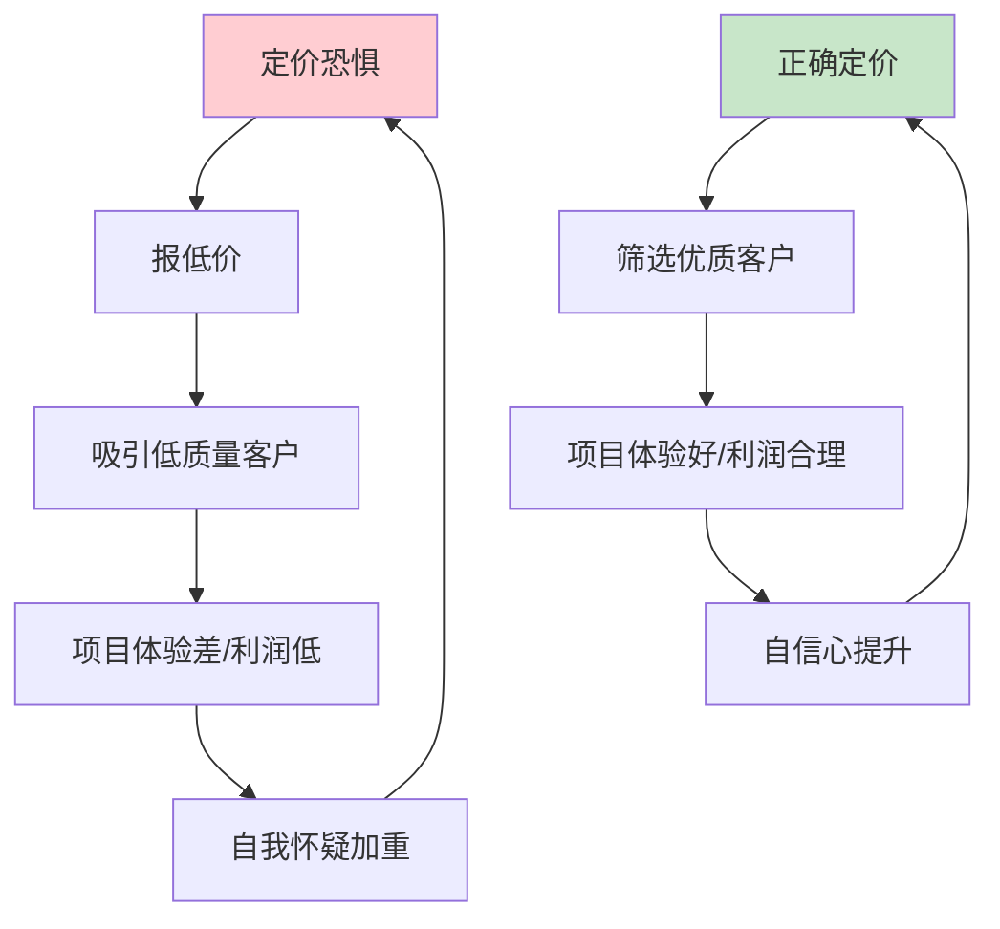
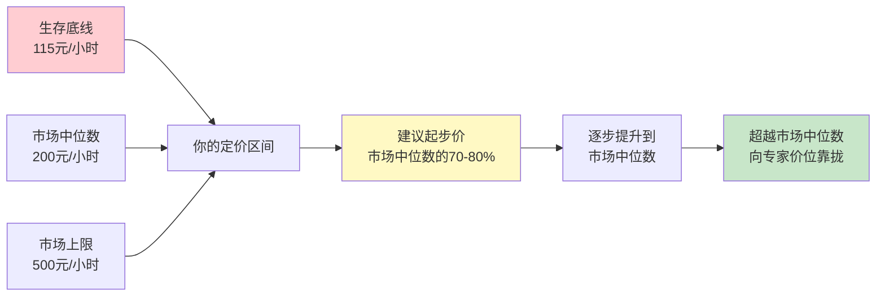
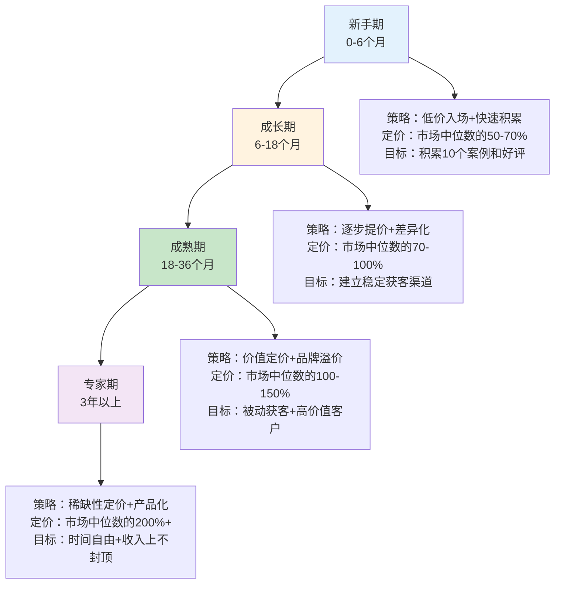
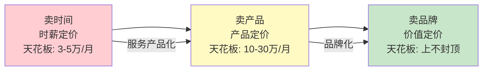

## 技巧三：自由职业定价技巧

> **核心观点**：自由职业的定价不是"拍脑袋报个数"，而是一套系统化的能力——它决定了你是在"卖时间"还是在"卖价值"。定价能力是自由职业者最重要的商业能力，没有之一。同一个设计师，定价策略不同，年收入可能相差 5-10 倍。

### 为什么定价是自由职业的第一难题？

自由职业者面临的第一个现实问题不是"我能做什么"，而是"我该收多少钱"。定高了，客户跑掉；定低了，自己亏本。大多数人在这两个极端之间反复摇摆，最终要么低价内卷，要么因报价太高吓走客户后丧失信心。

定价之所以困难，根本原因有三个：

**第一，信息不对称。** 你不知道同行收多少钱，客户也不知道你的服务值多少钱。市场缺乏透明的定价标准，导致双方都在猜。猜的结果通常是：自由职业者往低了猜，客户也往低了猜，最终成交价远低于服务的真实价值。

**第二，价值难以量化。** 一个 Logo 设计值多少钱？50 元的淘宝店也能做，50 万元的 4A 公司也做。同一个交付物，价格相差 1000 倍。问题不在于 Logo 本身，而在于它能为客户创造多少商业价值——而这恰恰是最难评估的。

**第三，心理障碍。** 很多自由职业者有"定价恐惧症"：觉得自己不够好、不配收那么多钱、害怕被拒绝。这种心理障碍比技术能力更致命——它直接导致系统性低价，而低价又反过来强化了"我不值钱"的自我认知，形成恶性循环。



### 四种定价模型：选对框架是第一步

自由职业的定价模型主要有四种，每种适用场景、优劣势和操作方式完全不同。选错模型，再努力也是低效的。

#### 模型一：按小时计费

**定义**：按实际工作小时数收费，用时薪乘以工作时长得出总价。

**适用场景**：
- 工作范围不明确、需要灵活调整的项目
- 咨询类、顾问类、辅导类服务
- 刚入行、尚无法准确估算项目工时的阶段
- 客户需要随时追加需求的场景

**定价公式**：

```text
时薪 = (目标年收入 + 运营成本 + 税费 + 利润) ÷ 有效工作小时数

举例：
- 目标年收入：30 万元
- 年运营成本（软件/设备/办公）：3 万元
- 税费（约 15%）：5 万元
- 利润缓冲（10%）：3.8 万元
- 合计：41.8 万元
- 有效工作小时数：52 周 × 5 天 × 6 小时 = 1560 小时
  （注意：不是 2080 小时，因为自由职业者只有约 60-70% 的时间是可计费的）
- 时薪 = 418,000 ÷ 1560 ≈ 268 元/小时
```

**关键提醒**：自由职业者的"有效工作时间"远低于想象。一天 8 小时中，真正能向客户计费的时间通常只有 4-6 小时，其余时间用于沟通、行政、营销、学习。按 2080 小时（全年无休 8 小时制）计算时薪，是新手最常犯的错误——它会让你的时薪低 30-40%。

**按小时计费的陷阱**：

| 陷阱 | 描述 | 后果 |
|------|------|------|
| 效率惩罚 | 你做得越快，赚得越少 | 反向激励拖慢速度 |
| 收入天花板 | 一天只有 24 小时 | 收入有硬性上限 |
| 客户焦虑 | 客户盯着时钟，担心你"磨洋工" | 关系紧张，信任缺失 |
| 范围蔓延 | 需求不断增加，但客户觉得"反正按小时算" | 项目失控 |

#### 模型二：按项目计费

**定义**：根据项目整体报价，不论实际耗时多少，交付成果即获得约定金额。

**适用场景**：
- 工作范围清晰、交付标准明确的项目
- 设计、开发、翻译、文案等有明确产出的服务
- 你对该类项目有丰富经验、能准确估算工时
- 客户更关心结果而非过程

**定价公式**：

```text
项目报价 = 预估工时 × 时薪 × 风险系数 × 利润系数

举例：
- 预估工时：40 小时
- 时薪：268 元
- 风险系数：1.2（需求可能变动 20%）
- 利润系数：1.15（合理利润空间）
- 项目报价 = 40 × 268 × 1.2 × 1.15 ≈ 14,794 元
- 取整报价：15,000 元
```

**风险系数参考表**：

| 风险等级 | 系数 | 适用场景 |
|----------|------|----------|
| 低风险 | 1.1 | 老客户、需求非常明确、做过类似项目 |
| 中风险 | 1.2-1.3 | 新客户、需求基本明确、有一定不确定性 |
| 高风险 | 1.4-1.6 | 需求模糊、客户决策链长、涉及新技术 |
| 极高风险 | 1.8-2.0 | 政府/大企业项目、流程繁琐、付款周期长 |

**按项目计费的优势**：效率高的人收益大——如果你 20 小时完成了预估 40 小时的项目，你的实际时薪翻倍。这正向激励你提升效率、建立模板、复用经验。

#### 模型三：价值定价法

**定义**：不按你花了多少时间收费，而按你的服务能为客户创造多少价值收费。这是定价的最高境界。

**核心逻辑**：同样的 Logo 设计，给一家小餐馆做可能只值 2000 元，给一家融资千万的科技公司做可能值 20 万元——因为后者用这个 Logo 去融资、去获客、去建立品牌，它能撬动的商业价值完全不同。

**价值定价的三步法**：

1. **量化客户收益**：你的服务能帮客户多赚多少钱、省多少钱、避免多少损失？
2. **确定价值分成**：通常取客户预期收益的 10-30% 作为你的报价
3. **用客户语言报价**：不说"设计费 5 万"，说"这个品牌升级项目预计能帮你提升 20% 的转化率，按你目前的营收规模，年增收约 50 万。项目投资 5 万，相当于 10:1 的回报比。"

**价值定价案例对比**：

| 服务类型 | 成本定价 | 时薪定价 | 价值定价 |
|----------|----------|----------|----------|
| 帮电商优化详情页 | 2000 元（2天工作量） | 4000 元（20小时×200） | 20,000 元（预计提升转化率15%，年增收200万） |
| 写商业计划书 | 3000 元（3天工作量） | 5000 元（25小时×200） | 30,000 元（帮客户拿到500万融资，收6%） |
| 做企业培训 | 5000 元（1天工作量） | 8000 元（含备课40小时×200） | 50,000 元（200人团队效率提升20%，年省人力成本100万） |

**价值定价的前提条件**：
- 你必须深入了解客户的业务和痛点
- 你必须有能力量化你的服务带来的收益
- 你必须有案例或数据支撑你的价值主张
- 你的客户必须是决策者，能理解投资回报逻辑

> **进阶提醒**：价值定价不是"忽悠"。它建立在你真正能交付价值的基础上。如果你承诺帮客户提升 20% 转化率，你最好真的能做到。做不到的价值定价就是诈骗——不仅会退款赔钱，还会毁掉你的职业声誉。

#### 模型四：保留制/订阅制

**定义**：客户按月/按季支付固定费用，获得你一定时间或一定范围内的服务。

**适用场景**：
- 长期持续的服务需求（月度内容、定期设计、持续维护）
- 客户需要随时能找到你
- 你希望获得稳定的现金流

**定价公式**：

```text
月度保留费 = 每月预估工时 × 时薪 × 0.85（长期客户折扣）

举例：
- 客户每月需要约 15 小时的设计支持
- 时薪：268 元
- 月度保留费 = 15 × 268 × 0.85 ≈ 3,417 元
- 取整报价：3,500 元/月
```

**保留制的优势与风险**：

| 维度 | 优势 | 风险 |
|------|------|------|
| 收入 | 现金流稳定可预期 | 可能被客户"占便宜"——实际用量远超约定 |
| 关系 | 长期合作，沟通成本递减 | 关系固化后难以提价 |
| 效率 | 深入了解客户业务，效率高 | 可能产生惰性，缺乏新刺激 |
| 自由 | — | 时间被锁定，灵活性降低 |

**保留制的防坑要点**：
- 合同中明确约定每月最大服务时长或服务范围
- 超出约定范围的部分按标准时薪另外计费
- 设置最短合作期限（通常 3 个月），避免客户随时取消
- 每季度回顾一次实际用量，必要时调整保留费

### 如何确定你的定价？——六步定价法

知道了四种模型之后，具体怎么给自己定价？以下是系统化的六步流程。

#### 第一步：计算你的"生存底线"

这是你定价的绝对下限——低于这个数字，你就无法维持运营。

```text
月度生存底线 = 个人生活开支 + 业务运营成本 + 税费预留 + 社保

示例明细：
- 房租/房贷：5,000 元
- 日常生活：3,000 元
- 软件订阅（设计工具/项目管理/云存储）：500 元
- 设备折旧（电脑/相机/手机月均）：400 元
- 社保/公积金（自缴）：1,500 元
- 税费预留（约 10%）：1,000 元
- 应急储备（5%）：570 元
- 合计：11,970 元/月

折算为时薪（按月有效计费 104 小时）：
11,970 ÷ 104 ≈ 115 元/小时
```

这就是你的"不亏本价格"。任何低于 115 元/小时的报价，你都是在倒贴。

#### 第二步：调研市场行情

你的定价不能脱离市场。以下是获取定价信息的渠道：

**直接渠道**：
- 在自由职业平台（猪八戒、一品威客、Upwork、Fiverr）搜索同类服务的价格区间
- 在闲鱼/淘宝搜索同类服务，看卖家的定价和销量
- 加入行业社群，观察同行的报价（很多社群有"报价交流"话题）

**间接渠道**：
- 看同行的公开报价页面（很多自由职业者有个人网站）
- 假装客户去询价，了解市场真实报价（注意：不要恶意比价）
- 招聘网站上同类全职岗位的薪资，除以有效工作小时数，折算为时薪参考

**市场行情参考表（2024-2025 年国内市场）**：

| 服务类型 | 新手时薪 | 中级时薪 | 专家时薪 | 备注 |
|----------|----------|----------|----------|------|
| UI/UX 设计 | 80-150 | 150-350 | 350-800 | 品牌设计高于UI设计 |
| 前端开发 | 100-200 | 200-400 | 400-1000 | React/Vue 热门框架溢价 |
| 后端开发 | 120-250 | 250-500 | 500-1200 | 架构师级别更高 |
| 文案写作 | 50-150 | 150-400 | 400-1500 | 商业文案高于内容文案 |
| 视频剪辑 | 60-150 | 150-300 | 300-800 | 含特效/动画的溢价高 |
| 翻译 | 80-200 | 200-500 | 500-1500 | 小语种/专业领域溢价 |
| 咨询顾问 | 200-500 | 500-1500 | 1500-5000 | 行业经验是核心溢价因素 |
| 数据分析 | 100-200 | 200-400 | 400-1000 | 含建模/算法的溢价 |
| 摄影 | 100-300 | 300-800 | 800-3000 | 商业摄影远高于个人摄影 |

> **注意**：以上是时薪参考，不是项目报价。项目报价还需乘以工时和风险系数。此外，一线城市的价格通常比二三线城市高 30-50%，但随着远程工作普及，地域差异正在缩小。

#### 第三步：定位你的价格区间

结合底线和市场行情，确定你的价格区间：



**定价策略矩阵**：

| | 经验少 | 经验丰富 |
|---|---|---|
| **竞争激烈** | 低于市场中位数 20-30% 起步，靠速度和态度取胜 | 市场中位数，用案例和口碑差异化 |
| **竞争较少** | 市场中位数起步，用稀缺性弥补经验不足 | 高于市场中位数 30-50%，甚至更高 |

**重要原则**：永远不要成为最便宜的那个。最低价吸引的是最难伺候的客户——他们对价格最敏感、对质量要求最高、对你的尊重最少。宁可少接几个单，也不要低价内卷。

#### 第四步：建立报价清单

不要每次都从零开始报价。建立一套标准化的报价清单，按服务类型和复杂度分级：

**报价清单模板（以设计服务为例）**：

| 服务项目 | 基础版 | 标准版 | 高级版 |
|----------|--------|--------|--------|
| Logo 设计 | 3,000 元<br/>3 个概念方案<br/>2 次修改<br/>7 天交付 | 8,000 元<br/>5 个概念方案<br/>5 次修改<br/>品牌色彩/字体规范<br/>14 天交付 | 20,000 元<br/>完整品牌识别系统<br/>无限修改<br/>品牌使用指南<br/>30 天交付 |
| 名片设计 | 500 元 | 1,000 元 | 2,000 元 |
| 海报设计 | 800 元 | 2,000 元 | 5,000 元 |
| 画册设计 | 3,000 元/16P | 8,000 元/16P | 20,000 元/16P |

**三档定价的心理学依据**：
- **基础版**：让预算有限的客户也能合作，降低决策门槛
- **标准版**：大多数人会选择中间档（锚定效应），这是你的主力利润来源
- **高级版**：筛选出高预算客户，同时让标准版显得"性价比高"

#### 第五步：学会"报价话术"

报价不只是报一个数字，更是一次价值传达。同样的价格，说法不同，成交率天差地别。

**错误的报价方式**：
> "这个项目大概需要 40 小时，我时薪 300，所以报价 12,000 元。"

客户听到的是："你要花 40 小时，每小时收我 300。"——他开始算你到底值不值这个价。

**正确的报价方式**：
> "根据你描述的需求，我会提供以下交付物：完整的品牌 Logo（含 5 个概念方案）、品牌色彩体系、字体规范、以及品牌使用指南。这套品牌系统可以统一你所有的对外形象，提升品牌辨识度。项目投资 12,000 元，包含 5 次修改，预计 14 个工作日内完成。"

客户听到的是："我花 12,000 元能得到什么。"——他开始评估这些交付物对他的价值。

**报价话术的核心原则**：
1. 先说价值，再说价格
2. 用"投资"代替"费用"、"成本"
3. 列出具体的交付物，让客户知道钱花在哪里
4. 提供选择（三档报价），而不是一个"要或不要"
5. 报价时自信平静，不要加"大概""可能""如果觉得贵可以商量"

#### 第六步：定期复盘和调价

定价不是一劳永逸的。你需要每 3-6 个月复盘一次定价策略：

**复盘清单**：
- 最近 3 个月的成交率是多少？（低于 30% 可能定价偏高，高于 70% 可能定价偏低）
- 客户砍价的频率和幅度是多少？（频繁砍价说明市场预期低于你的报价）
- 你的有效时薪是多少？（实际收入 ÷ 实际工作小时数）
- 你的产能利用率是多少？（实际计费时间 ÷ 可用时间）
- 同行的价格有什么变化？

**调价信号**：

| 信号 | 含义 | 行动 |
|------|------|------|
| 连续 3 个月成交率 > 70% | 定价可能偏低 | 提价 10-20% |
| 连续 3 个月成交率 < 30% | 定价可能偏高 | 降价值得考虑，但先排查营销和信任问题 |
| 客户从不砍价 | 定价偏低 | 提价 15-25% |
| 技能提升/作品集更新 | 价值增加 | 提价 10-30% |
| 行业需求增加 | 市场行情上涨 | 提价 10-20% |
| 获得行业认证/奖项 | 稀缺性提升 | 提价 20-50% |

### 定价心理学：影响客户决策的六个原理

定价不只是数学题，更是心理学。以下是六个经过验证的定价心理原理，以及在自由职业中的应用方法。

#### 原理一：锚定效应

**原理**：人们对价格的判断不是绝对的，而是基于参照物（锚点）的。先出现的数字会影响后续的判断。

**应用方法**：
- 报价时先报最高档，再报中档和低档。客户会以最高档为锚点来评估其他选项
- 在报价前，提到"这个级别的服务市场价通常在 XX 到 XX 之间"，设置一个较高的锚点
- 展示你的"标准报价"和"优惠价"，让客户觉得获得了优惠

#### 原理二：损失厌恶

**原理**：人们对"失去"的痛感是"获得"快感的 2 倍。与其强调"用了我的服务能得到什么"，不如强调"不用我的服务会损失什么"。

**应用方法**：
- "如果品牌视觉不统一，每多一天就多一天在浪费你的营销预算"
- "这个优惠价格本周有效，下周恢复原价"
- "目前我的排期还有空位，下个月开始需要排队 2-3 周"

#### 原理三：价格信号效应

**原理**：价格本身传递质量信号。人们对低价产品的质量预期天然更低。

**应用方法**：
- 不要用低于市场均价的价格来竞争，它会让你的服务被"低质量"归类
- 在你的网站/作品集上不要公开标注价格——让客户先了解你的价值，再谈价格
- 如果你降价，一定要给一个合理理由（新客户优惠、季度促销），而不是直接标低价

#### 原理四：选择架构

**原理**：给客户三个选项时，大多数人会选中间那个。中间选项是你的主力利润区。

**应用方法**：
- 始终提供三档报价（基础/标准/高级）
- 让标准版成为性价比最高的选择
- 高级版的作用不是卖出去，而是让标准版显得合理

#### 原理五：沉没成本效应

**原理**：已经投入的时间和精力越多，人们越不愿意放弃。

**应用方法**：
- 免费咨询/诊断是很好的前端策略——客户投入了时间讨论需求，更倾向于继续合作
- 分阶段报价：先报一个小项目（如需求分析 2000 元），完成后再报大项目
- 让客户参与决策过程（选方案、选配色），增加他的投入感

#### 原理六：社会认同

**原理**：人们倾向于参考他人的行为来做决策。

**应用方法**：
- 展示"已服务 XX 位客户""好评率 XX%"
- 提供客户案例和评价，尤其是知名客户的背书
- "这个套餐是最受欢迎的选择"——利用从众心理引导决策

### 提价策略：如何安全地提高价格？

提价是自由职业者最焦虑的事情之一。以下是经过验证的安全提价方法。

#### 方法一：新客户新价格，老客户老价格

**操作方式**：对新客户直接使用新价格，老客户在下一次合作时再适用新价格。

**优点**：不破坏现有合作关系，逐步过渡。

**话术**："基于最近的项目经验和市场需求变化，我的服务价格从下个月起会有一定调整。作为老客户，这次合作我们还是按原来的价格，下次合作时我会提前通知你新的报价。"

#### 方法二：服务升级同步提价

**操作方式**：增加服务内容或提升服务质量的同时提价。让客户感受到"加价 = 加量"。

**举例**：
- 原来 Logo 设计 3000 元，现在 5000 元但包含品牌色彩规范和字体建议
- 原来文案写作 500 元/篇，现在 800 元/篇但包含 SEO 优化和数据追踪

#### 方法三：阶梯式提价

**操作方式**：每次提价 10-20%，每 6-12 个月提一次。不要一次性提价 50% 以上。

**提价节奏参考**：

| 阶段 | 时间 | 时薪 | 提价幅度 |
|------|------|------|----------|
| 起步 | 第 1-6 月 | 150 元 | — |
| 成长 | 第 7-12 月 | 180 元 | +20% |
| 进阶 | 第 13-18 月 | 220 元 | +22% |
| 成熟 | 第 19-24 月 | 280 元 | +27% |
| 专家 | 第 25-36 月 | 400 元 | +43% |

#### 方法四：用"提价过滤器"筛选客户

**操作方式**：主动提价到市场中位数以上，过滤掉低质量客户，把时间留给高价值客户。

**本质**：这不叫"流失客户"，叫"客户升级"。失去 3 个 2000 元的项目，腾出时间接 1 个 15000 元的项目——总收入更高，工作量更少，客户质量更好。

### 报价谈判实战技巧

客户说"太贵了"不一定是真的觉得贵——它可能只是一种谈判习惯。以下是应对常见砍价场景的策略。

#### 场景一：客户说"太贵了"

**不要立即降价。** 降价只会让客户觉得你的报价有水分。

**正确回应**：
1. 先问清原因："您觉得哪个部分超出了预期？是整体预算的问题，还是对某项服务的价值有疑问？"
2. 如果是预算问题：调整服务范围，而不是降低单价。"如果预算有限，我们可以先做核心部分，其余的后续再加。"
3. 如果是价值认知问题：补充案例和数据，强化价值感知。"这个价格包含了 XX 和 XX，上次客户用了之后效果是 XX。"

#### 场景二：客户拿别人的价格压你

**正确回应**：
1. 不要贬低竞争对手："市面上确实有不同价位的服务，这是正常的。"
2. 强调差异化："我的服务和 XX 的区别在于……（案例/方法/交付标准/售后保障）"
3. 把决策权还给客户："您可以根据您的需求和预算来选择最适合的方案。"

**绝对不要说的话**："那他那么便宜你找他啊。"——这会直接丢单。

#### 场景三：客户要求免费试做/样品

**正确回应**：
1. 展示现有作品集："我之前的作品可以在这里查看（链接），风格和质量跟您需要的类似。"
2. 提供低价诊断服务："我可以先做一次付费的需求诊断（500 元），帮您梳理清楚需求和方案，之后如果合作，这笔费用抵扣项目款。"
3. 底线表态："我的工作原则是不免费试做，因为我相信我的作品集已经充分展示了我的能力。不过我可以提供 XX 的保证（比如不满意退款、免费修改等）。"

#### 场景四：客户要求打包价/长期折扣

**正确回应**：
1. 接受合理的打包优惠："如果签订季度保留协议，我可以给 10% 的折扣。"
2. 设置折扣底线："最多 15% 的折扣，超过这个幅度就会影响服务质量了。"
3. 交换条件："折扣可以，但我需要您提前预付 50%，并且排期优先级会低于全价客户。"

### 不同阶段的定价策略

自由职业者的定价策略应该随经验积累而动态调整。



#### 新手期（0-6 个月）：速度优先

- **核心目标**：快速获得第一批客户和案例，而不是赚大钱
- **定价策略**：市场中位数的 50-70%，甚至可以做 2-3 个免费项目来积累作品
- **注意**：低价是临时策略，不是长期定位。给自己设定明确的提价时间表

#### 成长期（6-18 个月）：逐步提价

- **核心目标**：建立稳定获客渠道，提升客单价
- **定价策略**：市场中位数的 70-100%，每 3-6 个月提价一次
- **注意**：每次提价前确保作品集和案例库已经更新，用作品证明涨价的合理性

#### 成熟期（18-36 个月）：价值定价

- **核心目标**：从"卖时间"转向"卖价值"
- **定价策略**：市场中位数的 100-150%，引入价值定价法
- **注意**：开始细分客户群，对高价值客户提供高端服务

#### 专家期（3 年以上）：稀缺性定价

- **核心目标**：用品牌和稀缺性支撑高价
- **定价策略**：市场中位数的 200% 以上，或者直接采用项目/价值定价
- **注意**：到了这个阶段，你可能需要拒绝 70% 以上的询价——因为你的产能有限，应该只接最有价值的项目

### 自由职业定价的常见误区

#### 误区一：按全职薪资倒算时薪

**错误逻辑**："全职月薪 15,000 元，每月工作 22 天 × 8 小时 = 176 小时，时薪 = 15,000 ÷ 176 ≈ 85 元。"

**问题**：自由职业者没有带薪假期、没有社保补贴、没有免费的办公场地和设备、没有稳定的客户来源。你需要在时薪中覆盖所有这些成本。自由职业的时薪至少应该是全职时薪的 2-3 倍。

#### 误区二：只算工作时间，不算隐形时间

**问题**：你以为一天工作 8 小时，但实际只有 4-5 小时在做可计费的工作。其余时间在回邮件、开会、找客户、处理行政事务。

**纠正**：按"有效计费率"计算——自由职业者的有效计费率通常是 50-70%。用这个比例来修正你的时薪计算。

#### 误区三：用价格来竞争

**错误逻辑**："别人都收 500，我收 300，这样客户就会选我。"

**问题**：低价确实能吸引客户，但吸引的是最差的客户——他们对价格最敏感，对质量要求最多，付款最不积极。你用低价抢来的客户，别人用更低的价格就能抢走。

**纠正**：用价值、用案例、用专业度来竞争，而不是用价格。宁可少接 10 个低价单，也不要错过 1 个匹配的高价单。

#### 误区四：不敢报价，怕客户跑掉

**问题**：还没报价就开始自我矮化，"如果太贵了我们可以再商量""你觉得多少合适？"

**纠正**：客户跑掉不一定是因为贵——可能是你的报价方式不对、价值传达不清晰、或者这个客户本来就不是你的目标客户。报价自信，反而会让客户更信任你的专业度。

#### 误区五：所有客户同一个价格

**问题**：给大企业和小店铺报同样的价，给紧急项目和常规项目报同样的价。

**纠正**：根据客户类型、项目复杂度、时间紧迫度、风险等级灵活定价。紧急加价 30-50%，大企业加价 20-30%（因为沟通成本更高），老客户给 10% 的忠诚折扣。

#### 误区六：签合同前不收定金

**问题**：做完全部工作才收款，客户可能拖延付款甚至赖账。

**纠正**：自由职业的标准付款节奏是"5-3-2"或"5-5"：
- **5-3-2 模式**：签约时收 50%，中期交付收 30%，最终验收收 20%
- **5-5 模式**：签约时收 50%，交付时收 50%
- **小项目**（<5000 元）：100% 预付

没有定金的合作，不做。这不是信任问题，是商业纪律。

### 定价工具箱

以下是实际操作中用得上的工具和模板。

#### 报价单模板要素

一份专业的报价单应该包含：

1. **项目概述**：用 2-3 句话描述客户需求和你的理解
2. **服务范围**：明确列出包含什么、不包含什么
3. **交付物清单**：具体列出每个交付物和交付标准
4. **报价明细**：按服务项目分项报价，不要只给一个总数
5. **时间计划**：关键里程碑和交付日期
6. **付款条款**：付款方式、分期比例、付款时间
7. **有效期**：报价的有效期限（通常 7-15 天）
8. **附录**：你的作品集链接、客户评价、资质证明

#### 常用定价计算公式速查

```text
# 基础时薪计算
时薪 = (目标年收入 + 年运营成本) ÷ (52 × 每周有效计费小时数)

# 项目报价
项目报价 = 预估工时 × 时薪 × 风险系数(1.1-2.0) × 利润系数(1.1-1.3)

# 价值定价
报价 = 客户预期收益 × 价值分成比例(10%-30%)

# 保留制月费
月费 = 每月预估工时 × 时薪 × 长期折扣系数(0.8-0.9)

# 紧急加价
紧急报价 = 标准报价 × 紧急系数(1.3-1.5)

# 涨价幅度计算
新价格 = 旧价格 × (1 + 提价比例)
```

#### 定价决策检查清单

在确定最终报价前，逐项检查：

- [ ] 报价高于我的生存底线？
- [ ] 报价在市场合理区间内？
- [ ] 我能清晰地向客户解释这个价格的依据？
- [ ] 付款条款中有定金/预付款？
- [ ] 合同中明确了服务范围和修改次数？
- [ ] 报价单中有有效期？
- [ ] 考虑了项目风险并设置了相应的缓冲？
- [ ] 我有信心以这个价格成交，而不是心虚？

### 进阶：从定价到商业模式

当你掌握了定价技巧之后，下一步是思考：如何从"定价"升级到"商业模式"？

**初级模式**：你卖时间。你的收入 = 时薪 × 工作时间。天花板清晰——一天只有 24 小时。

**中级模式**：你卖标准化产品。把反复出现的服务打包成固定产品（模板、课程、SOP），做一次卖无数次。收入上限取决于市场容量和获客能力。

**高级模式**：你卖系统和品牌。建立个人品牌后，可以授权、加盟、带团队，甚至退出日常执行。收入上限取决于你的影响力和商业运营能力。



**每一次定价，都是在回答一个根本问题：你认为自己值多少钱？** 这个问题的答案，不仅决定了你的收入，更决定了你会吸引什么样的客户、做什么样的项目、成为什么样的自由职业者。定价能力的提升，本质上是自我认知和商业思维的提升——它值得你花时间去学习、去练习、去迭代。
