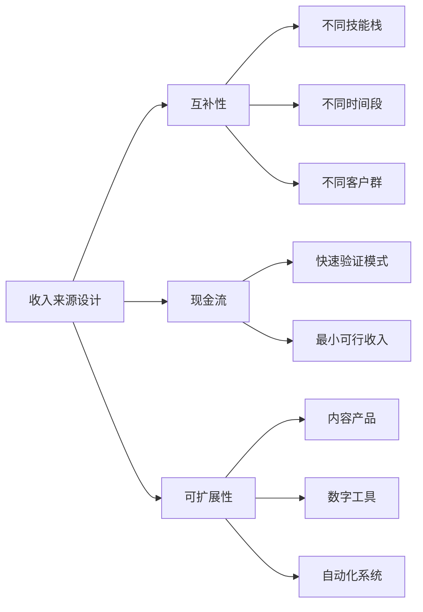
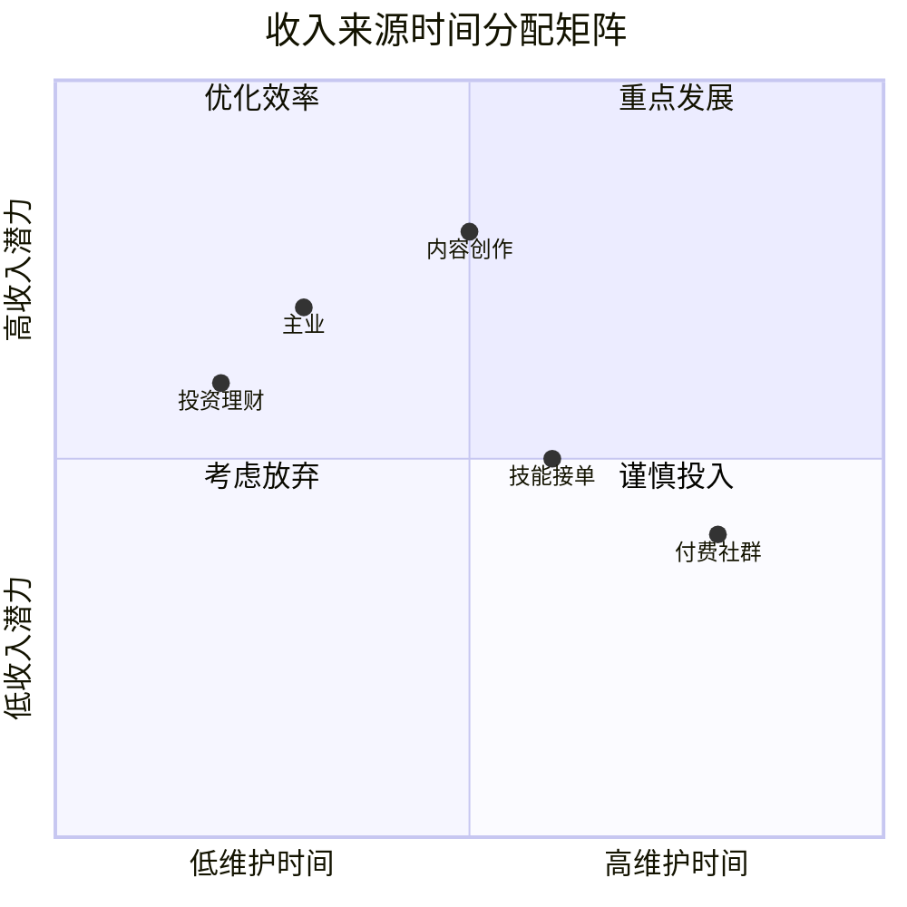
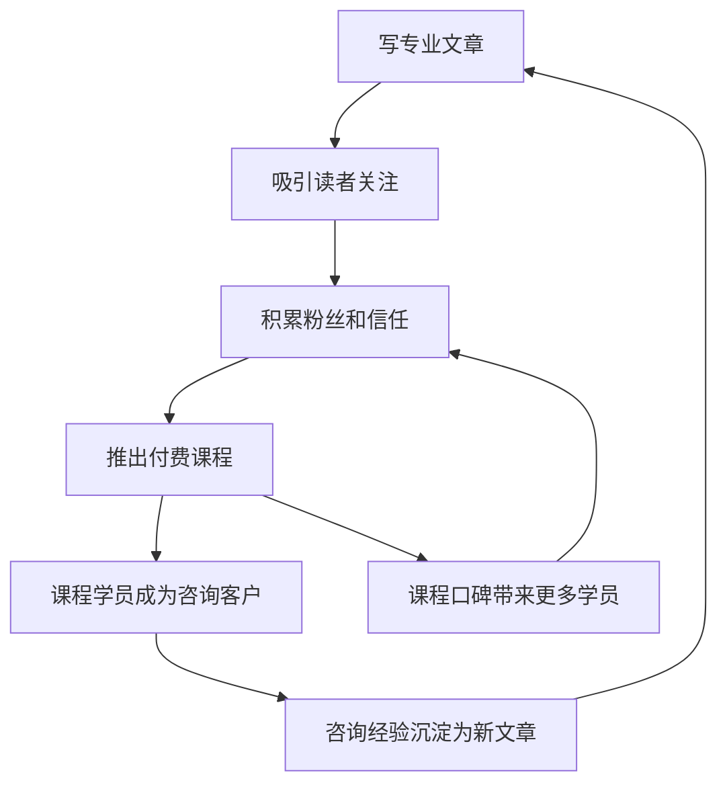

## 技巧四：多收入来源管理

单一收入来源意味着单一故障点。当你依赖一份工资、一个客户或一项业务时，任何意外——裁员、客户流失、政策变动——都可能让收入归零。多收入来源管理不是"做很多事"，而是有策略地构建一个互相支撑的收入组合，让整体抗风险能力远超各部分之和。

### 1. 为什么要建立多收入来源

#### 1.1 单一收入的脆弱性

假设你月薪 15,000 元，全部收入来自一家公司。以下任何一种情况发生，你的收入都会立刻归零：

- 公司裁员或倒闭
- 行业整体下行（如 2021 年教培行业）
- 个人健康问题导致无法工作
- 与直属领导关系恶化
- 公司搬迁到另一个城市

这不是危言耸听。2020 年疫情初期，中国城镇调查失业率从 5.2% 飙升到 6.2%，数千万人在数周内失去全部收入来源。那些有副业、投资收益或自由职业收入的人，受到的冲击明显更小。

#### 1.2 多收入来源的数学优势

假设你有 3 个独立收入来源，每个来源中断的概率是 10%：

- 单一来源：收入中断概率 = 10%
- 三个独立来源同时中断概率 = 0.1 × 0.1 × 0.1 = 0.1%

这就是组合效应。即使每个来源都不如单一工资稳定，组合后的整体稳定性反而更高。

#### 1.3 收入来源的分类

理解收入类型是管理的前提：

| 收入类型 | 定义 | 典型例子 | 特征 |
|---------|------|---------|------|
| 主动劳动收入 | 用时间换取报酬 | 工资、接单、咨询 | 有上限，停止即止 |
| 半被动收入 | 前期投入精力，后期维护即可 | 网课、电子书、付费社群 | 边际成本递减 |
| 被动收入 | 资产自动产生收益 | 股息、房租、版税 | 需要前期资本或积累 |
| 组合收入 | 多种方式组合 | 自媒体+电商+课程 | 协同效应 |

理想状态是：主动收入养活当下，半被动收入构建未来，被动收入保障长期。

### 2. 多收入来源规划框架

#### 2.1 个人资源盘点

在规划之前，先盘点你手上的牌：

**技能盘点清单：**

- 专业技能：你的本职工作技能是什么？能否对外变现？
- 兴趣技能：你有什么爱好达到可变现水平？
- 学习技能：你学新东西的速度如何？
- 社交技能：你能链接多少人？有什么人脉资源？

**资源盘点清单：**

- 时间：每周能投入多少小时给副业？
- 资金：有多少启动资金？能承受多少亏损？
- 设备：有什么硬件/软件资源？
- 人脉：认识哪些潜在客户、合作伙伴、导师？

**用以下表格做自我评估：**

```text
┌─────────────────────────────────────────────────┐
│ 个人资源盘点表                                    │
├──────────┬──────────┬──────────┬────────────────┤
│ 资源类型  │ 具体内容  │ 可用程度  │ 变现潜力(1-5) │
├──────────┼──────────┼──────────┼────────────────┤
│ 核心技能  │          │          │                │
│ 兴趣爱好  │          │          │                │
│ 每周时间  │    小时   │          │                │
│ 启动资金  │    元     │          │                │
│ 人脉资源  │          │          │                │
│ 设备工具  │          │          │                │
└──────────┴──────────┴──────────┴────────────────┘
```

#### 2.2 收入来源设计的三条原则

**原则一：互补而非竞争**

每个收入来源应该消耗不同的资源，而不是互相抢夺同一份时间和精力。

错误示范：白天做程序员写代码，晚上接外包还是写代码。技能单一，时间冲突，身体垮掉。

正确示范：程序员白天写代码，周末录制编程教程（消耗表达能力而非编码能力），同时定投指数基金（消耗零时间）。

**原则二：现金流优先**

新收入来源的第一目标不是赚大钱，而是产生正向现金流。哪怕月入 100 元，也证明了模式可行。

**原则三：可扩展性评估**

选择那些边际成本递减的方向。写一篇文章、录一门课程、开发一个工具——这些工作做一次，可以卖很多次。而接单、咨询、代运营则每次都要重新投入时间。



#### 2.3 收入组合矩阵

根据你的情况，选择适合的组合模式：

| 组合模式 | 适合人群 | 典型组合 | 难度 | 月收入潜力 |
|---------|---------|---------|------|-----------|
| 工资+投资 | 上班族入门 | 工资 + 基金定投 + 理财 | ★☆☆☆☆ | 工资+被动收益 |
| 工资+技能变现 | 有一技之长的上班族 | 工资 + 自由职业接单 | ★★☆☆☆ | 工资+3000-15000 |
| 工资+内容创作 | 有表达欲的人 | 工资 + 自媒体 + 付费内容 | ★★★☆☆ | 工资+5000-50000 |
| 自由职业+产品 | 全职自由职业者 | 咨询 + 课程 + 工具 | ★★★★☆ | 15000-100000 |
| 创业+投资 | 企业主 | 主营业务 + 投资 + 版税 | ★★★★★ | 无上限 |

### 3. 多收入来源的实操建设

#### 3.1 第一收入来源：稳固主业

主业通常是最大、最稳定的现金流。在副业收入超过主业之前，不要轻易放弃主业。稳固主业的策略：

- 持续提升专业能力，确保不可替代性
- 建立内部人脉，了解公司动向
- 积累行业资源，为未来可能的转型做准备
- 把主业中的经验沉淀为可复用的知识体系

#### 3.2 第二收入来源：技能变现

这是大多数人最容易启动的副业方向。

**启动流程：**

1. **识别可变现技能**：回顾你的工作和生活中，别人经常找你帮忙的事情。如果很多人愿意为你的某项技能付费，这就是变现信号。
2. **选择变现平台**：
   - 设计类：猪八戒、站酷、Dribbble
   - 开发类：程序员客栈、Upwork、Freelancer
   - 翻译类：有道翻译、Gengo
   - 写作类：稿定设计、各公众号约稿
   - 咨询类：在行、知乎付费咨询
3. **定价策略**：初期可以低于市场价 20-30% 获取第一批客户和评价，验证模式后逐步提价。
4. **时间管理**：每周固定 5-10 小时用于副业，不影响主业质量。

**关键指标追踪：**

| 指标 | 目标值 | 追踪频率 |
|------|-------|---------|
| 每周投入时间 | 5-10小时 | 每周 |
| 月收入 | 第3个月>2000元 | 每月 |
| 客户满意度 | >4.5/5 | 每单 |
| 复购率 | >30% | 每季度 |
| 时薪 | >主业时薪 | 每月 |

#### 3.3 第三收入来源：内容资产

内容资产是实现"睡后收入"的核心路径。

**选择内容形式：**

| 内容形式 | 制作成本 | 维护成本 | 天花板 | 适合人群 |
|---------|---------|---------|-------|---------|
| 公众号文章 | 低 | 低 | 中 | 有写作能力的人 |
| 短视频 | 中 | 中 | 高 | 有表现力的人 |
| 长视频教程 | 高 | 低 | 高 | 有深度专业知识的人 |
| 电子书/专栏 | 高 | 低 | 中 | 有体系化知识的人 |
| 付费社群 | 中 | 高 | 高 | 有影响力的人 |
| 在线课程 | 高 | 中 | 高 | 有教学能力的人 |

**内容资产建设的时间线：**

- 第 1-2 个月：选择平台，确定定位，发布 20-30 篇内容测试反馈
- 第 3-4 个月：根据数据调整方向，形成固定更新节奏
- 第 5-6 个月：积累 500-1000 粉丝，开始尝试付费内容
- 第 7-12 个月：打磨付费产品，建立复购和口碑
- 第 12 个月以后：内容资产开始产生半被动收入

#### 3.4 第四收入来源：投资收入

投资收入是真正的被动收入，但需要前期资本积累和持续学习。

**从零开始的投资路径：**

1. **紧急备用金**（3-6个月生活费，放货币基金）
2. **指数基金定投**（沪深300、中证500，每月定额投入）
3. **学习资产配置**（股债搭配，理解风险收益关系）
4. **拓展投资品类**（REITs、可转债、港股/美股）
5. **构建投资系统**（定期再平衡，纪律性执行）

投资收益的复利效应：假设每月投入 3000 元，年化收益 8%：

| 年限 | 累计投入 | 资产总值 | 收益部分 |
|------|---------|---------|---------|
| 3年 | 108,000 | 121,000 | 13,000 |
| 5年 | 180,000 | 220,000 | 40,000 |
| 10年 | 360,000 | 547,000 | 187,000 |
| 20年 | 720,000 | 1,760,000 | 1,040,000 |

20 年后，投资收益本身已经超过本金——这就是复利的力量。

### 4. 多收入来源的管理系统

#### 4.1 时间分配矩阵

管理多个收入来源，最稀缺的资源是时间。使用以下矩阵分配精力：



**时间分配建议（每周 10 小时副业时间）：**

- 核心收入来源：60%（6 小时）——正在产生收入的方向
- 探索收入来源：30%（3 小时）——有潜力但未验证的方向
- 学习和规划：10%（1 小时）——提升认知和调整方向

#### 4.2 财务追踪系统

每个收入来源需要独立核算，否则你不知道哪个赚钱、哪个亏钱。

**收入追踪表模板：**

```text
月份：____年____月
┌──────────┬──────────┬──────────┬──────────┬──────────┐
│ 收入来源  │ 收入(元)  │ 成本(元)  │ 净利润    │ 时间投入  │
├──────────┼──────────┼──────────┼──────────┼──────────┤
│ 主业工资  │          │          │          │    h     │
│ 技能接单  │          │          │          │    h     │
│ 内容创作  │          │          │          │    h     │
│ 投资收益  │          │          │          │    h     │
│ 其他      │          │          │          │    h     │
├──────────┼──────────┼──────────┼──────────┼──────────┤
│ 合计      │          │          │          │    h     │
└──────────┴──────────┴──────────┴──────────┴──────────┘
时薪 = 净利润 ÷ 时间投入
```

**关键决策规则：**

- 如果某收入来源时薪 < 50 元且无增长趋势，考虑放弃或转型
- 如果某收入来源时薪 > 主业时薪的 2 倍，考虑投入更多时间
- 如果某收入来源连续 3 个月亏损，必须做出调整决策

#### 4.3 工具推荐

| 管理需求 | 免费工具 | 付费工具 | 说明 |
|---------|---------|---------|------|
| 时间追踪 | Toggl Track | RescueTime | 记录每项工作的时间投入 |
| 财务记账 | 随手记、MoneyForward | YNAB | 分账户追踪各来源收支 |
| 项目管理 | Notion、飞书 | Asana、Monday | 管理各来源的任务和进度 |
| 客户管理 | 飞书多维表格 | HubSpot、纷享销客 | 追踪客户和订单 |
| 数据分析 | Google Sheets | FineBI、Tableau | 可视化收入趋势和占比 |

### 5. 多收入来源的协同策略

#### 5.1 飞轮效应

最好的多收入来源组合不是各自独立运转，而是形成飞轮——每个来源推动其他来源增长。

**飞轮示例（内容创作者版）：**



每一步都在为下一步蓄力，形成自加速循环。

#### 5.2 内容复用策略

一次创作，多次变现：

| 原始内容 | 复用形式 | 变现方式 |
|---------|---------|---------|
| 一篇深度文章 | 拆成 5 条短视频脚本 | 广告/带货 |
| 一场直播分享 | 剪辑成精华片段 + 整理成图文 | 付费回放 + 公众号 |
| 一个系列课程 | 提炼成电子书 + 社群讨论素材 | 书籍销售 + 社群年费 |
| 一次客户咨询 | 匿名化后写成案例分析 | 吸引更多咨询客户 |
| 一个工具/模板 | 录制使用教程 + 开发付费版本 | 模板销售 + 教程流量 |

#### 5.3 信任资产积累

所有收入来源共享一个底层资产：信任。你在任何一个渠道建立的专业形象和口碑，都会溢出到其他渠道。

具体做法：

- 统一个人品牌形象（头像、简介、风格）
- 在各平台互相引流但保持各自独立价值
- 对所有渠道的客户保持一致的服务标准
- 定期在公开渠道分享专业见解和成功案例

### 6. 风险管理与常见陷阱

#### 6.1 多收入来源的五大陷阱

**陷阱一：贪多嚼不烂**

同时启动 5 个副业方向，每个都浅尝辄止。正确做法是：一次只启动一个新收入来源，稳定后再开下一个。

**陷阱二：用时间堆收入**

所有收入来源都是"接单型"，本质是打了两份工。正确做法是：至少一个来源具备半被动或被动特征。

**陷阱三：忽视税务合规**

多收入来源意味着更复杂的税务情况。在中国：
- 工资收入由公司代扣代缴
- 劳务报酬超过 800 元需缴纳个税（预扣 20-40%）
- 经营所得需要自行申报
- 年度汇算清缴时多退少补

建议：当副业月收入超过 5000 元时，咨询专业税务顾问。

**陷阱四：主业副业冲突**

副业影响主业表现，甚至违反竞业协议。注意事项：
- 检查劳动合同中的竞业限制条款
- 不使用公司资源（电脑、时间、客户信息）做副业
- 确保副业不影响工作状态和产出
- 避免与公司业务产生直接竞争

**陷阱五：忽视健康管理**

多线程工作的最大代价是健康。长期睡眠不足、缺乏运动、精神紧张，最终会导致所有收入来源同时崩溃。底线规则：每天睡眠不少于 7 小时，每周运动不少于 3 次。

#### 6.2 各收入来源的风险评估

| 风险类型 | 主业工资 | 技能接单 | 内容创作 | 投资收入 |
|---------|---------|---------|---------|---------|
| 市场风险 | 行业下行 | 需求变化 | 平台政策 | 市场波动 |
| 竞争风险 | 被替代 | 价格战 | 算法变化 | 信息不对称 |
| 法律风险 | 劳动纠纷 | 合同纠纷 | 版权争议 | 合规风险 |
| 健康风险 | 加班过劳 | 时间冲突 | 创作倦虑 | 决策压力 |
| 缓解策略 | 持续学习 | 差异化 | 多平台分散 | 资产配置 |

#### 6.3 退出机制

不是所有收入来源都值得持续投入。建立明确的退出标准：

- **硬退出**：连续 3 个月亏损且无改善趋势
- **软退出**：时薪低于主业时薪的 50%，且无增长潜力
- **战略退出**：发现更好的机会，需要释放时间资源
- **被动退出**：政策变化、平台关闭等不可控因素

退出时的注意事项：
- 妥善处理未完成的订单和承诺
- 将已积累的资产（内容、客户关系、品牌）转移到新方向
- 复盘总结经验教训，为下一个方向做准备

### 7. 进阶：从多收入到收入系统

#### 7.1 收入系统思维

初级阶段是"多份工作"，高级阶段是"收入系统"。区别在于：

| 维度 | 多份工作 | 收入系统 |
|------|---------|---------|
| 本质 | 用更多时间换更多钱 | 用系统自动产生收入 |
| 可持续性 | 停止即止 | 可自我运转 |
| 扩展性 | 受限于个人时间 | 可无限扩展 |
| 核心能力 | 执行力 | 系统设计能力 |
| 典型特征 | 接单、兼职、代运营 | 内容资产、自动化工具、投资组合 |

#### 7.2 构建收入系统的步骤

1. **选择一个已验证的收入来源**（月入 5000+ 且有增长趋势）
2. **拆解其价值链**：哪些环节必须你亲自做？哪些可以外包或自动化？
3. **逐步外包非核心环节**：客服、运营、交付可以交给兼职或工具
4. **建立标准化流程**：将你的经验写成 SOP，让任何人按流程执行
5. **监控关键指标**：收入、利润率、客户满意度、复购率
6. **用释放的时间探索新方向**：系统运转后，你的时间用来开拓下一个收入来源

#### 7.3 长期愿景：财务自由的收入结构

财务自由的标准是：被动收入 ≥ 生活支出。

实现路径：


每个阶段都需要不同的策略和能力。关键是不要跳级——先稳定当前阶段，再向下一阶段迈进。

### 8. 案例：从零到三个收入来源的实战路径

**案例背景：** 小王，28 岁，互联网公司产品经理，月薪 18,000 元，有写作和数据分析能力。

**第 1-3 个月：启动第二收入**

- 方向：在知乎和公众号写产品分析文章
- 投入：每周 6 小时（周末）
- 结果：3 个月积累 2000 粉丝，获得第一笔稿费 800 元

**第 4-6 个月：稳定第二收入 + 探索第三收入**

- 内容方向：从免费文章过渡到付费专栏（定价 99 元/年）
- 第三收入启动：用数据分析技能在闲鱼出售 Excel 模板
- 结果：付费专栏 60 人订阅（5,940 元），Excel 模板月销 30 份（900 元/月）

**第 7-12 个月：飞轮转动**

- 内容升级：录制产品经理入门课程（定价 299 元）
- 飞轮效应：文章读者→专栏订阅→课程购买→咨询请求
- 结果：月均副业收入 8,000-12,000 元，时薪约 150 元

**第 13-18 个月：系统化**

- 外包：请兼职编辑协助文章排版和发布
- 新增：指数基金定投（月投 5,000 元）
- 结果：月均总收入 25,000+ 元（工资 18,000 + 副业 7,000+），投资组合 9 万元

**关键启示：**

- 每个阶段只专注一件事，不要贪多
- 先验证再投入，不要一开始就大量投资
- 飞轮效应一旦启动，增长会加速
- 时薪是衡量价值的核心指标

### 9. 自检清单

在推进多收入来源建设前，逐项确认：

- [ ] 已完成个人资源盘点（技能、时间、资金、人脉）
- [ ] 主业稳定，不影响主业表现和职业发展
- [ ] 已检查劳动合同中的竞业限制和副业条款
- [ ] 第二收入来源已选定方向且通过小规模验证
- [ ] 每周有固定的副业时间（至少 5 小时）
- [ ] 已建立财务追踪系统，分来源核算收支
- [ ] 了解多收入来源的税务申报要求
- [ ] 有明确的退出标准和止损线
- [ ] 健康管理不受影响（睡眠、运动、社交）
- [ ] 家人理解并支持你的多收入计划
