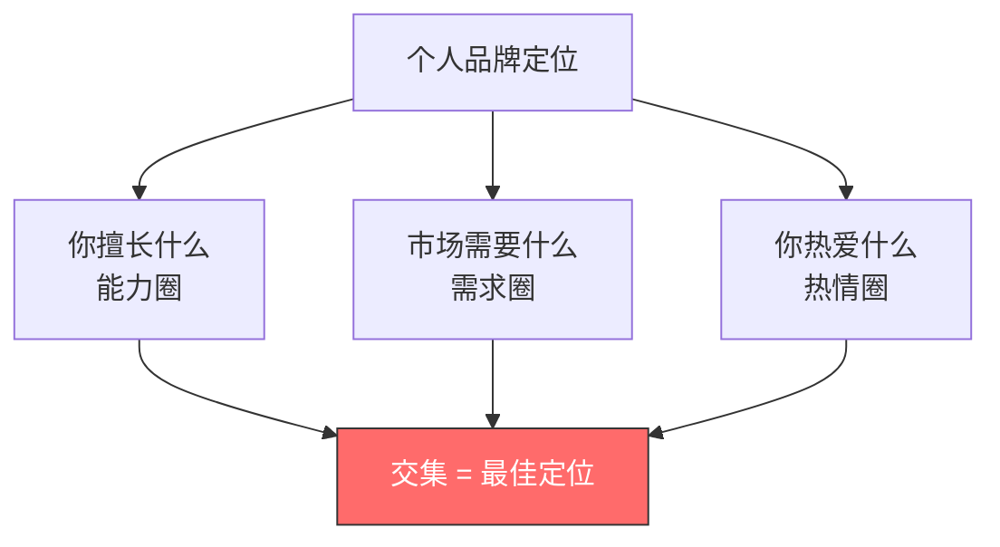
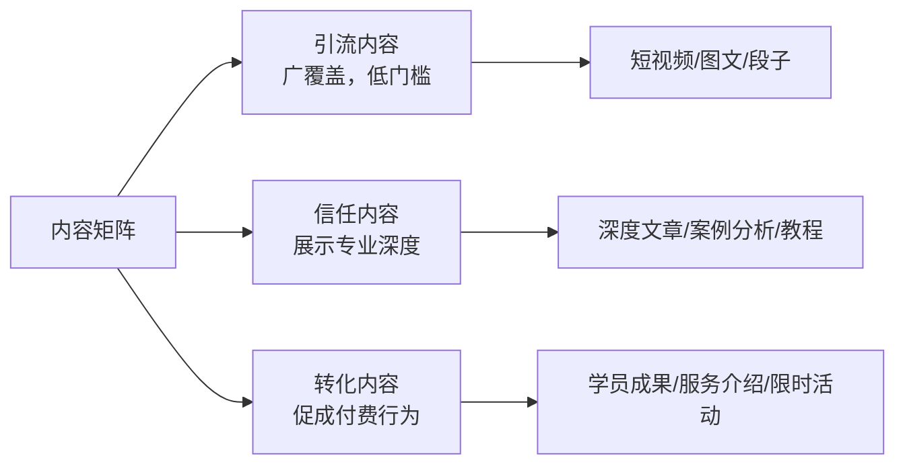
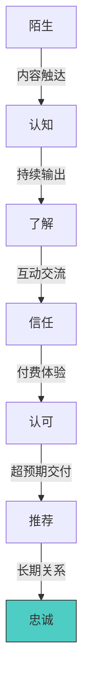
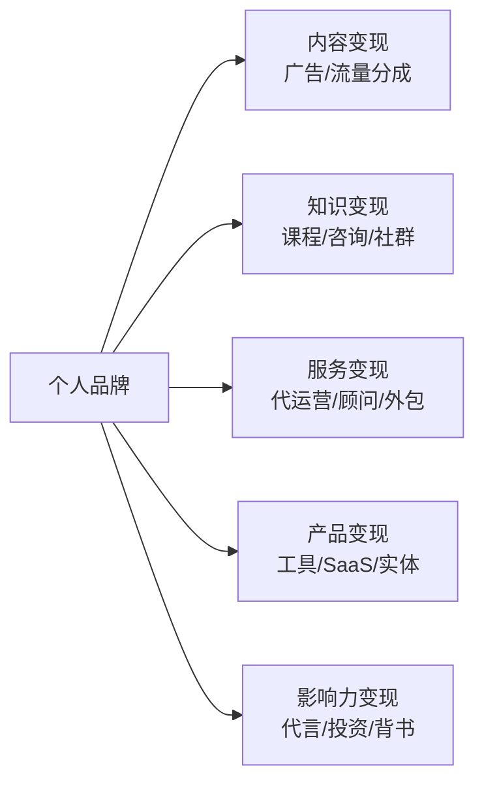
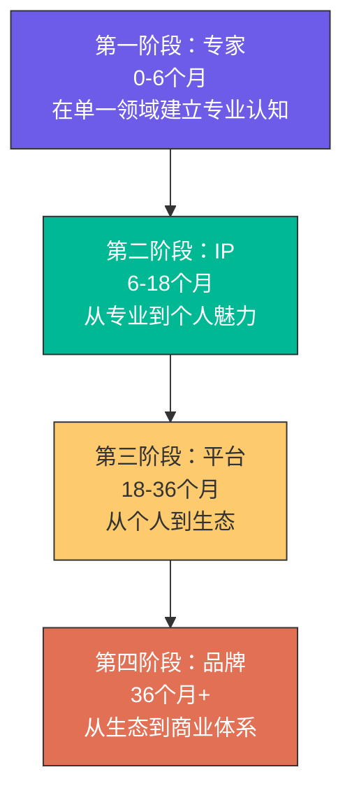

## 技巧五：个人品牌打造

个人品牌是你在职业市场中最重要的无形资产。它不是 logo、不是 slogan、不是朋友圈人设——它是**别人提到你名字时脑海中浮现的全部印象总和**。在信息过载的时代，拥有清晰个人品牌的人，获客成本趋近于零，溢价能力远超同行。

### 一、理解个人品牌的本质

#### 1.1 什么是个人品牌

个人品牌 = **专业能力 × 可见度 × 一致性**。

三个因子缺一不可：
- **专业能力**：你能解决什么问题，解决得多好
- **可见度**：多少人知道你能解决这个问题
- **一致性**：你在所有渠道传递的信息是否统一

只有能力没有可见度，是"怀才不遇"；只有可见度没有能力，是"人设崩塌"；有能力和可见度但不一致，是"精神分裂"。

#### 1.2 个人品牌的底层逻辑

从经济学角度看，个人品牌解决的是**信息不对称**问题：

| 场景 | 没有品牌 | 有品牌 |
|------|----------|--------|
| 客户选择 | 比价、犹豫、多方咨询 | 直接找你，信任溢价 |
| 定价能力 | 随行就市，打价格战 | 自主定价，高溢价 |
| 获客成本 | 投广告、发传单、求推荐 | 客户主动上门 |
| 议价地位 | 被甲方压价 | 甲方配合你的节奏 |
| 抗风险能力 | 一单断了就焦虑 | 排队等你空档期 |

核心公式：**品牌价值 = 你能解决的问题的市场价值 × 知道你能解决这个问题的人数 × 这些人对你的信任度**。

#### 1.3 个人品牌 vs 公司品牌

| 维度 | 个人品牌 | 公司品牌 |
|------|----------|----------|
| 信任载体 | 人格魅力+专业能力 | 组织背书+规模效应 |
| 建设速度 | 快（3-6个月可见效） | 慢（需要长期投入） |
| 转移性 | 跟着人走，离职即带走 | 留在组织内 |
| 天花板 | 受限于个人产能 | 可规模化 |
| 最佳路径 | 先建个人品牌，再以此为核心建公司 | — |

### 二、个人品牌定位：找到你的生态位

#### 2.1 定位三要素模型



三个圈的交集就是你的最佳品牌定位。只有擅长+需要，容易倦怠；只有擅长+热爱，没有市场；只有需要+热爱，能力不够。

#### 2.2 定位的四个步骤

**第一步：能力盘点**

列出你所有的技能、经验、知识领域，然后按以下维度打分（1-10分）：

| 技能 | 熟练度 | 市场需求 | 独特性 | 热情度 | 综合分 |
|------|--------|----------|--------|--------|--------|
| 技能A | 8 | 9 | 6 | 7 | 30 |
| 技能B | 6 | 7 | 9 | 9 | 31 |
| ... | ... | ... | ... | ... | ... |

独特性是关键差异化因素。"会Python"的人很多，"会Python且懂量化交易且能写技术教程"的人就少得多。

**第二步：市场需求验证**

用以下方法验证市场需求是否存在：

1. **搜索指数验证**：在百度指数、微信指数搜索相关关键词，看搜索量趋势
2. **平台需求验证**：在知乎、小红书、B站搜索相关问题，看问题数量和回答质量
3. **付费意愿验证**：在知识星球、得到、知乎Live看同类产品定价和销量
4. **直接验证**：发一条相关内容，看互动量和私信咨询量

**第三步：差异化定位公式**

```text
我是 [目标人群] 的 [具体问题] 专家，通过 [独特方法/视角] 帮助他们 [具体结果]
```

反面案例："我是做营销的"——太模糊。
正面案例："我是B2B SaaS公司的内容营销顾问，通过数据驱动的内容策略帮助他们降低获客成本50%以上"——精准、可量化、有画面感。

**第四步：一句话测试**

把你的一句话定位讲给10个朋友听，如果超过7个人能在24小时后复述出来，说明定位够清晰。

#### 2.3 定位的常见误区

| 误区 | 正确做法 |
|------|----------|
| 定位太宽："我是搞互联网的" | 越窄越容易建立认知："我是跨境电商独立站SEO专家" |
| 定位太虚："我是人生导师" | 越具体越可信："我是帮助35岁+职场人转型管理岗的职业教练" |
| 定位跟风：什么火做什么 | 选择长期赛道，品牌需要时间积累 |
| 定位一成不变 | 初期可以窄，随能力扩展逐步拓宽 |

### 三、个人品牌内容体系搭建

#### 3.1 内容矩阵设计



三类内容的比例建议：引流 60%、信任 30%、转化 10%。

#### 3.2 内容选题方法

**方法一：问题库驱动**

从以下渠道收集目标人群的真实问题：
- 知乎高赞问题
- 行业社群高频提问
- 客户咨询记录
- 评论区互动
- 行业报告中的痛点描述

每个问题就是一个选题。按"搜索量 × 竞争度 × 与你的定位匹配度"排序优先级。

**方法二：热点嫁接**

把行业热点与你的专业领域结合：
- 某政策出台 → 从你的专业角度解读影响
- 某大事件发生 → 从你的领域分析底层逻辑
- 某工具/技术发布 → 从你的场景给出实操指南

**方法三：知识体系化**

把你领域的完整知识体系拆解为系列内容：
1. 画出该领域的知识地图
2. 按难度分层：入门→进阶→高级→专家
3. 每个知识点一篇内容
4. 系列内容之间互相引用，形成内容网络

#### 3.3 内容创作SOP

```yaml
内容创作标准流程:
  1. 选题确认:
    - 目标人群画像是否明确
    - 搜索量/需求量是否足够
    - 与品牌定位是否匹配
  2. 素材收集:
    - 行业数据/报告
    - 真实案例/故事
    - 专家观点/引用
    - 反面案例/对比
  3. 大纲撰写:
    - 开头：痛点共鸣或反常识钩子
    - 中间：论点+论据+案例，层层递进
    - 结尾：总结+行动指南+互动引导
  4. 内容创作:
    - 每段不超过4行
    - 关键信息加粗
    - 用案例替代说教
    - 加入可视化元素（图/表/流程图）
  5. 标题优化:
    - 数字化："3个方法"比"几个方法"更吸引
    - 具体化："月入过万"比"赚钱"更吸引
    - 痛点化："别再犯这5个错误"比"注意事项"更吸引
  6. 发布优化:
    - 选择目标人群活跃时间发布
    - 首图/封面要有冲击力
    - 标签覆盖核心关键词+长尾词
```

### 四、核心平台运营策略

#### 4.1 平台选择矩阵

| 平台 | 内容形式 | 适合领域 | 变现路径 | 建设周期 |
|------|----------|----------|----------|----------|
| 公众号 | 长文/深度分析 | 专业服务/B2B | 广告/课程/咨询 | 3-6个月 |
| 小红书 | 图文/短视频 | 生活方式/消费/女性向 | 品牌合作/电商 | 1-3个月 |
| B站 | 中长视频 | 教程/科普/测评 | 广告/充电/课程 | 3-12个月 |
| 抖音 | 短视频 | 娱乐/知识/带货 | 直播/电商/广告 | 1-6个月 |
| 知乎 | 问答/文章 | 专业/深度内容 | 知识付费/咨询 | 3-6个月 |
| 视频号 | 短视频/直播 | 微信生态/本地生活 | 打赏/电商/私域 | 2-6个月 |
| Twitter/X | 短文本/Thread | 技术/海外/Web3 | 社区/课程/SaaS | 2-4个月 |

#### 4.2 平台选择策略

**不要全平台铺开**。初期选1-2个主平台深耕，理由如下：
- 每个平台的算法、用户习惯、内容形态完全不同
- 精力分散会导致每个平台都做不深
- 1个万粉账号的变现能力 > 10个千粉账号

选择标准：
1. 你的内容形式与平台匹配（写作者选公众号/知乎，拍视频选B站/抖音）
2. 你的目标用户在这个平台活跃
3. 你在这个平台有一定基础或愿意投入学习

#### 4.3 各平台核心运营要点

**公众号运营**
- 首图决定打开率，标题决定分享率
- 推送频率：每周2-3篇 > 每天水文
- 互推涨粉：找同量级、同领域但不直接竞争的号互推
- 菜单栏和自动回复是转化入口，必须精心设计

**小红书运营**
- 封面是第一生产力：3:4竖版、大字标题、对比色
- 标题公式：数字+痛点+解决方案，如"3个穿搭技巧，让矮个子穿出大长腿的感觉"
- 关键词布局：标题、正文前两行、标签都要包含核心关键词
- 评论区互动率直接影响推荐量

**B站运营**
- 完播率是核心指标，前30秒决定命运
- 封面+标题的点击率（CTR）直接影响推荐
- 弹幕和评论互动越多，推荐越强
- 固定更新频率（如每周三晚8点）培养用户习惯

**知乎运营**
- 回答高关注量问题，蹭流量
- 长文回答获得的赞同和收藏远高于短回答
- 持续输出同一领域内容，获得"优秀回答者"标识
- 文章和回答相互引流

### 五、信任体系建设

#### 5.1 信任金字塔



每提升一层信任，转化率提升3-5倍。

#### 5.2 快速建立信任的五种方法

**方法一：案例证明**
- 最有说服力的信任状是"我帮XX做到了XX"
- 案例要有具体数据、前后对比、客户评价
- 初期可以免费/低价做几个标杆案例

**方法二：专业背书**
- 行业认证、学历、工作经历
- 媒体报道、出版物、演讲经历
- 知名客户/合作方logo

**方法三：过程透明**
- 公开你的工作方法论
- 分享真实的数据和复盘
- 展示失败和教训（比成功更有说服力）

**方法四：持续在场**
- 固定时间、固定频率出现在用户视野中
- 品牌认知需要7次以上触达才能建立
- 中断超过2周，前面积累的认知衰减50%

**方法五：社交证明**
- 学员/客户的真实评价和成果
- 关注者数量、互动数据
- 与知名人士/品牌的关联

#### 5.3 信任维护的关键细节

- **及时回应**：评论区和私信24小时内回复
- **言行一致**：承诺的交付标准、时间、质量必须兑现
- **主动承担**：出问题时先道歉、先补偿，再解释原因
- **保持谦逊**：承认不知道的，不夸大能力边界

### 六、个人品牌变现路径

#### 6.1 变现矩阵



#### 6.2 各变现模式详解

**模式一：知识付费**

| 产品形态 | 定价区间 | 交付方式 | 适合阶段 |
|----------|----------|----------|----------|
| 电子书/手册 | 9-99元 | 自动交付 | 初期 |
| 音频课 | 99-299元 | 录播 | 初期 |
| 视频课 | 299-1999元 | 录播 | 成长期 |
| 训练营 | 999-4999元 | 直播+作业+辅导 | 成长期 |
| 私教/1对1 | 3000-50000元 | 定制化服务 | 成熟期 |
| 会员社群 | 199-2999元/年 | 持续服务 | 成长期 |

知识付费的关键：**先免费验证需求，再付费深度交付**。

**模式二：咨询服务**

按小时收费或按项目收费：
- 初期：500-1000元/小时，先积累案例
- 成长期：1000-3000元/小时，有案例背书
- 成熟期：3000-10000元/小时，行业知名度
- 专家级：按项目收费，单项目5万-50万

**模式三：品牌合作**

适合有一定粉丝基础的创作者：
- 公众号头条广告：粉丝数 × 1-3元（垂直领域溢价更高）
- 小红书种草笔记：粉丝数 × 0.05-0.15元
- B站视频植入：粉丝数 × 0.1-0.3元
- 抖音星图：粉丝数 × 0.03-0.1元

#### 6.3 变现路径选择建议

根据你的领域和优势选择：
- **文字功底强** → 公众号/知乎 → 课程+咨询
- **表达能力强** → B站/抖音 → 课程+品牌合作
- **专业能力深** → 知乎/公众号 → 咨询+培训
- **审美能力强** → 小红书 → 品牌合作+电商

### 七、个人品牌的长期经营

#### 7.1 品牌进化路线图



每个阶段的核心任务：

| 阶段 | 核心任务 | 关键指标 | 常见陷阱 |
|------|----------|----------|----------|
| 专家 | 深耕一个细分领域 | 内容质量、搜索排名 | 什么都想写，没有主线 |
| IP | 加入个人特色和故事 | 粉丝粘性、互动率 | 只顾人设忘了专业 |
| 平台 | 团队化、多渠道 | GMV、合作品牌数 | 扩张太快质量下降 |
| 品牌 | 商业体系化 | 利润率、复购率 | 品牌老化，失去新鲜感 |

#### 7.2 品牌危机管理

**预防措施**
- 不做夸大承诺，不过度营销
- 涉及金钱、健康、法律的内容务必严谨
- 重要声明保留证据链（截图、录音、合同）
- 定期检查口碑，搜索自己的名字+负面关键词

**应对步骤**
1. **快速响应**：24小时内公开回应，沉默=默认
2. **事实核查**：先搞清楚事情全貌，不急于反驳
3. **真诚道歉**：如果是你的问题，直接道歉+补偿方案
4. **有理反驳**：如果是误解或恶意攻击，用事实和证据回应
5. **后续跟进**：公开整改措施和执行进度

#### 7.3 避免品牌老化的策略

- **持续学习**：每年至少深入学习一个新领域
- **内容创新**：定期尝试新的内容形式和表达方式
- **用户共创**：邀请粉丝参与内容选题和产品设计
- **跨界合作**：与不同领域的人碰撞新火花
- **适时转型**：当市场环境变化时，主动调整定位而非被动适应

### 八、个人品牌工具箱

#### 8.1 内容创作工具

| 类别 | 工具 | 用途 |
|------|------|------|
| 文案写作 | ChatGPT/Claude/Kimi | 辅助写作、改写、翻译 |
| 图片设计 | Canva/创客贴/稿定设计 | 封面、海报、信息图 |
| 视频剪辑 | 剪映/PR/达芬奇 | 短视频和中长视频制作 |
| 思维导图 | XMind/ProcessOn | 知识体系梳理 |
| 排版工具 | 秀米/135编辑器 | 公众号排版 |

#### 8.2 数据分析工具

| 类别 | 工具 | 用途 |
|------|------|------|
| 平台数据 | 各平台创作者后台 | 内容数据、粉丝画像 |
| 搜索趋势 | 百度指数/微信指数 | 选题热度判断 |
| 竞品分析 | 新榜/飞瓜/灰豚 | 同行数据对标 |
| 用户反馈 | 问卷星/腾讯问卷 | 需求调研 |

#### 8.3 效率管理工具

| 类别 | 工具 | 用途 |
|------|------|------|
| 内容日历 | Notion/飞书多维表格 | 选题排期、进度管理 |
| 素材收集 | Cubox/Notion Web Clipper | 随时保存灵感和素材 |
| 数据看板 | 飞书/钉钉仪表盘 | 关键指标可视化 |

### 九、实战案例拆解

#### 案例一：技术博主的品牌建设路径

**背景**：某后端开发工程师，3年经验，擅长Go语言和分布式系统。

**定位**："帮助后端开发者从CRUD走向架构师的实战教程博主"

**执行路径**：
1. **第1-3个月**：在掘金和知乎持续输出Go语言实战文章（每周2篇），积累初始读者
2. **第4-6个月**：开始在B站做技术讲解视频，把文章内容视频化
3. **第7-9个月**：推出免费的"Go语言实战训练营"（7天），积累300+学员
4. **第10-12个月**：推出付费课程"分布式系统设计实战"（定价699元），首期50人

**结果**：
- 1年内知乎粉丝2万+，B站粉丝5万+
- 付费课程累计收入40万+
- 收到3家公司的技术顾问邀请

**关键动作**：始终围绕"从CRUD到架构师"这条主线，不发散。

#### 案例二：宝妈的生活方式品牌

**背景**：某全职宝妈，孩子2岁，擅长收纳整理和家庭理财。

**定位**："帮助0-3岁宝宝家庭省钱省空间的实用生活指南"

**执行路径**：
1. **第1-2个月**：小红书发布"30天收纳挑战"系列图文，每天一个角落
2. **第3-4个月**：出"宝宝用品红黑榜"系列，真实测评+对比
3. **第5-6个月**：建立"宝妈省钱群"，分享优惠信息和理财心得
4. **第7-12个月**：接品牌合作+推出自己的收纳工具团购

**结果**：
- 6个月小红书粉丝3万+
- 品牌合作月收入5000-15000元
- 团购佣金月均3000元

**关键动作**：真实、接地气、有实用价值，不装不演。

### 十、常见误区与纠正

#### 误区一：先把内容做好，品牌自然就来了

**现实**：好内容+没有分发策略=自嗨。你必须主动让更多人看到你的内容。

**纠正**：内容创作和分发推广的时间分配至少应该是 5:5，初期甚至 4:6。

#### 误区二：等我足够厉害了再开始

**现实**：你永远觉得不够厉害。而且教是最好的学——教别人的过程会加速你自己的成长。

**纠正**：比你的目标受众领先3-6个月就可以开始分享。你不需要是世界顶尖，只需要比他们多走几步。

#### 误区三：模仿大V就能成功

**现实**：大V的成功是结果，你看到的只是冰山一角。他们的资源、时机、运气无法复制。

**纠正**：学习大V的方法论和底层逻辑，但用自己的风格和定位去执行。

#### 误区四：粉丝数=品牌价值

**现实**：1万精准粉丝 > 100万泛粉丝。品牌价值取决于你能影响的人的购买力和信任度。

**纠正**：关注精准粉丝数、互动率、转化率，而不是总粉丝数。

#### 误区五：个人品牌就是包装自己

**现实**：过度包装会导致人设崩塌。品牌的核心是真实的价值交付。

**纠正**：基于真实能力和经历去放大优势，而不是虚构人设。

### 十一、自检清单

完成以下检查，确保你的个人品牌基础牢固：

- [ ] 我能用一句话说清楚我是做什么的、帮谁解决什么问题
- [ ] 我确定了1-2个核心平台，并制定了内容发布计划
- [ ] 我有至少3个可以展示的案例或成果
- [ ] 我的内容选题来自真实用户需求，而不是自嗨
- [ ] 我有清晰的变现路径，知道下一步该做什么产品
- [ ] 我设置了数据追踪，知道哪些内容效果好
- [ ] 我了解竞品在做什么，但有自己的差异化
- [ ] 我有危机预案，知道出了问题怎么应对

如果以上有任何一项打不上勾，那就是你下一步要重点解决的问题。
