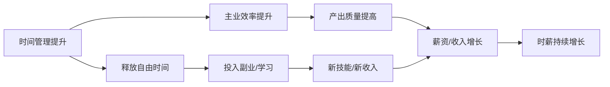
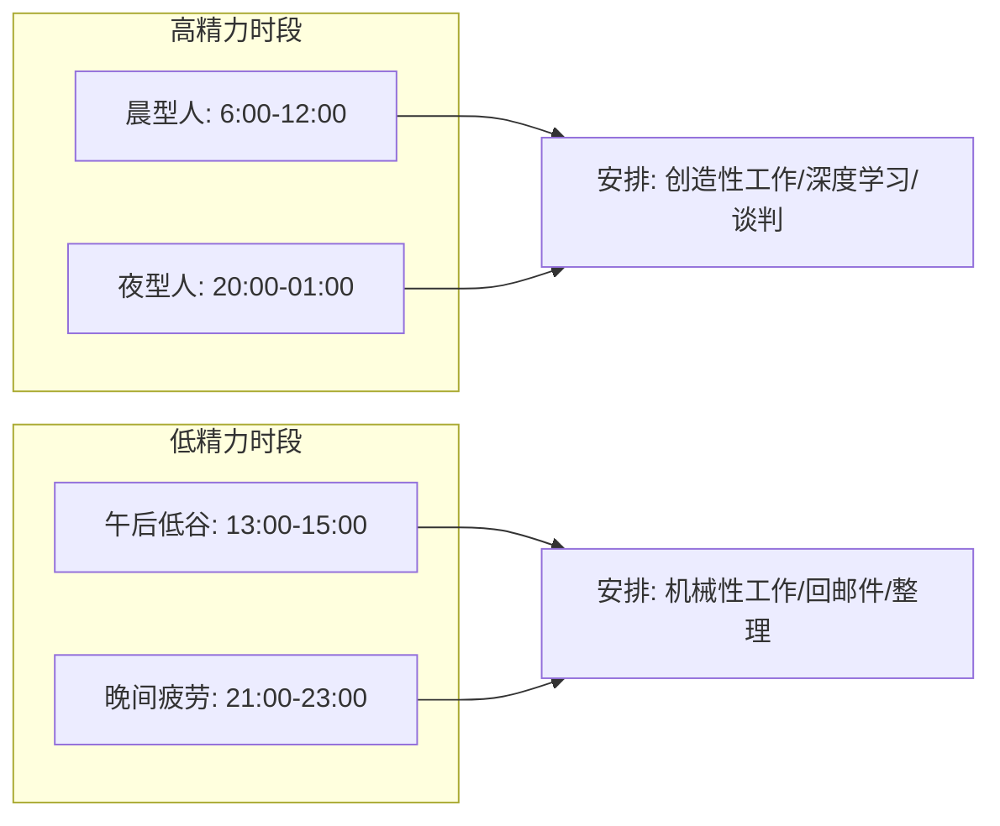
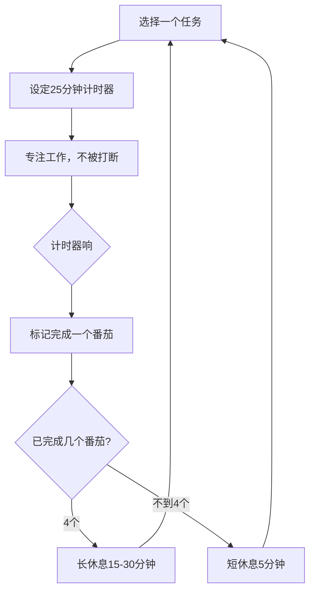
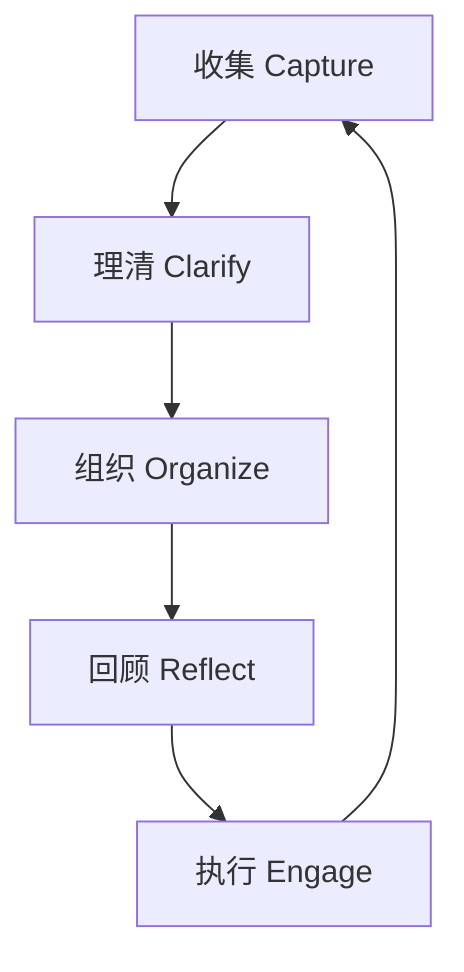

## 技巧六：提升效率的时间管理法

> "时间是唯一对所有人都公平的资源——每个人每天都只有24小时。差距不在于谁拥有更多时间，而在于谁把同样的时间用出了更高的价值。"

### 为什么时间管理是主动收入最大化的底层操作系统

前面五个技巧教你如何谈判加薪、选择副业、定价、管理多收入来源、打造个人品牌。但所有这些技巧都有一个隐含前提：**你有足够的时间和精力去执行它们**。

一个残酷的现实是：大多数人的有效工作时间远低于他们自以为的数字。

| 类型 | 自以为的 | 实际的 | 浪费率 |
|------|----------|--------|--------|
| 全职员工（8小时工作制） | 8小时 | 3.5-4.5小时 | 44%-56% |
| 自由职业者（在家办公） | 10小时 | 4-5.5小时 | 45%-60% |
| 副业时间（下班后） | 3小时 | 1-1.5小时 | 50%-67% |

数据来源：RescueTime 对18,000+用户的工作行为追踪研究（2023年报告）

这意味着，**你不缺时间，你缺的是把时间转化为价值的能力**。时间管理的本质不是"做更多事"，而是"用同样的时间赚更多钱"。

#### 时间管理与收入的关系公式

$$
时薪 = \frac{总收入}{总投入时间}
$$

提升时薪有且仅有两条路径：
1. **提高总收入**：做更高价值的事（前面5个技巧解决的问题）
2. **减少总投入时间**：用更少的时间完成同样的事（本技巧解决的问题）

两条路径同时推进，时薪才能指数级增长。一个年薪30万的人，如果能把有效工作时间从每天6小时压缩到4小时（通过效率提升），他的"真实时薪"就从167元提升到了250元——**同样的收入，多出了2小时/天可以投入副业或学习**，形成正向飞轮。



---

### 一、时间管理的四个层次

大多数人只做到了前两个层次，而真正的效率革命发生在第三和第四层。

#### 1.1 第一层：任务管理——"把事做完"

这是最基础的层次。核心问题是：**我有哪些事情要做，哪些先做哪些后做？**

**工具：艾森豪威尔矩阵（四象限法）**

|  | 紧急 | 不紧急 |
|--|------|--------|
| **重要** | 第一象限：立即做（危机、截止日期） | 第二象限：计划做（学习、规划、健康） |
| **不重要** | 第三象限：委托/快速处理（大部分会议、某些邮件） | 第四象限：尽量不做（刷手机、无效社交） |

关键洞察：**大多数人把80%的时间花在第一象限（救火）和第三象限（伪忙碌），而真正能提升收入的第二象限活动（学习新技能、建立人脉、规划副业）永远被推迟**。

实操方法：
1. 每天早上花5分钟，把当天所有任务写下来
2. 用四象限分类，每个任务标注象限编号
3. 第一象限任务直接做，限时完成
4. 第二象限任务至少安排1小时固定时间块
5. 第三象限任务能推就推，不能推的限时5分钟内处理
6. 第四象限任务直接删除

#### 1.2 第二层：时间分配——"把时间花对地方"

有了任务列表后，下一个问题是：**这些任务分别需要多少时间？我有没有把时间花在最高价值的地方？**

**工具：时间审计**

在做任何优化之前，先做一次为期一周的时间审计，记录你每30分钟在做什么。大多数人第一次做这个练习时会震惊于以下发现：

- 每天花在社交媒体上的时间：2-3小时（自以为只有30分钟）
- 每天花在"准备开始工作"上的时间：45-60分钟
- 每天花在低价值沟通（无效会议、闲聊群消息）上的时间：1.5-2小时

**时间审计模板：**

```text
日期：____月____日（周__）
06:00-06:30 | 起床洗漱           | 类别：生活
06:30-07:00 | 刷手机看消息        | 类别：消遣 ← 标红
07:00-07:30 | 通勤               | 类别：通勤（可利用）
07:30-08:00 | 到公司后刷网页       | 类别：消遣 ← 标红
08:00-08:30 | 回复邮件             | 类别：低价值工作
08:30-09:00 | 开会               | 类别：会议（评估有效性）
...
```

连续记录5个工作日后，将所有时间归入以下类别并统计占比：

| 类别 | 你的占比 | 建议目标 | 差距 |
|------|----------|----------|------|
| 高价值工作（直接产出成果） | __% | 40-50% | |
| 中价值工作（必要的沟通协调） | __% | 20-25% | |
| 低价值工作（可委托/自动化） | __% | 10-15% | |
| 消遣（刷手机、闲聊、发呆） | __% | <5% | |
| 学习成长 | __% | 10-15% | |
| 生活（吃饭、通勤、家务） | __% | 25-30%（固定） | |

#### 1.3 第三层：精力管理——"在对的时间做对的事"

这一层是大多数人忽略的关键。时间管理的真正瓶颈不是"没有时间"，而是"有时间但没精力"。

**精力的四种类型（来自吉姆·洛尔《精力管理》）：**

| 精力类型 | 来源 | 消耗信号 | 恢复方式 |
|----------|------|----------|----------|
| 体能精力 | 睡眠、饮食、运动 | 犯困、身体沉重 | 运动、小睡、营养补充 |
| 情绪精力 | 积极情绪、安全感 | 焦虑、烦躁、自我怀疑 | 社交、感恩练习、独处 |
| 注意力精力 | 专注力、意志力 | 走神、拖延、决策疲劳 | 番茄钟、环境切换、冥想 |
| 意义精力 | 目标感、使命感 | 迷茫、动力丧失 | 回顾目标、与导师交流 |

**精力曲线与任务匹配：**

每个人的精力在一天中不是均匀分布的。找到你的精力曲线，并据此安排任务：



**判断你是晨型人还是夜型人：**
- 不设闹钟，连续3天自然入睡和醒来
- 记录你自然清醒且精力充沛的时间段
- 如果你早上8点前自然醒且状态好→晨型人
- 如果你深夜11点后进入高效状态→夜型人

**实操：精力-任务匹配表**

| 你的精力时段 | 适合安排的高价值任务 | 不适合安排的任务 |
|--------------|---------------------|-----------------|
| 早晨高精力（起床后2-3小时） | 写代码/写方案/深度阅读/重要谈判准备 | 回邮件/开会/刷信息流 |
| 上午中精力（10:00-12:00） | 项目推进/客户沟通/团队协作 | 学习新技能（注意力不够集中） |
| 午后低谷（13:00-15:00） | 整理文档/回邮件/行政事务/散步 | 创造性工作/重要决策 |
| 下午回升（15:00-17:00） | 会议/头脑风暴/协作任务 | 独立深度工作（容易被打断） |
| 晚间（因人而异） | 副业时间/学习/复盘 | 处理复杂情绪问题 |

#### 1.4 第四层：系统设计——"让效率自动运行"

最高层次的时间管理不是靠自律，而是靠**系统**。自律是有限资源，系统是永久配置。

**系统设计的三个原则：**

1. **环境设计**：让正确的行为变容易，让错误的行为变困难
   - 想专注工作？把手机放到另一个房间
   - 想每天学习？把书放在枕头旁边
   - 想减少刷手机？卸载抖音/B站，需要时用网页版

2. **默认选项设计**：把好的行为变成默认选项
   - 每天固定时间做固定的事（例：20:00-21:30永远是副业时间）
   - 设置浏览器首页为工作相关页面
   - 手机首屏只放工具类App，社交App藏到第三屏

3. **反馈循环设计**：让进展可见
   - 每天记录"今日产出"（不是"今日忙碌"）
   - 用日历追踪高价值时间块
   - 每周回顾：本周最有价值的3件事是什么？

---

### 二、六大核心时间管理方法（详解+实操）

#### 2.1 番茄工作法——对抗拖延和走神的利器

**原理：** 人类的注意力集中周期约为25分钟。超过这个时间，注意力会自然衰退。番茄工作法利用这个规律，将工作切割为25分钟的专注块+5分钟的休息。

**标准流程：**



**进阶实操技巧：**

1. **番茄的粒度选择**
   - 25分钟适合：写作、编程、学习等需要持续专注的工作
   - 45分钟适合：进入心流状态后不想中断的工作
   - 15分钟适合：处理积压的小任务（批量回邮件、整理文件）

2. **被打断怎么办**
   - 内部打断（突然想到别的事）：快速写在便签纸上，继续当前番茄
   - 外部打断（有人找你）：告诉对方"我5分钟后回复你"，记录打断次数
   - 如果一天被打断超过5次/番茄，说明你的环境需要重新设计

3. **番茄数量目标**
   - 普通工作日：6-8个番茄（实际专注2.5-3.5小时）
   - 高产出日：10-12个番茄（实际专注4-5小时）
   - 不要追求12个以上——超过这个数字说明你在注水

**适用人群：** 拖延症患者、注意力容易分散的人、刚开始建立工作节奏的新手

**不适用场景：** 需要长时间沉浸在心流中的创造性工作（如写长文、编程架构设计），可以在进入心流后切换为90分钟深度工作块。

#### 2.2 时间块（Time Blocking）——掌控你每一天的结构

**原理：** 将一天的时间预先分配给特定类型的任务，而不是"到时候再看做什么"。没有计划的时间最容易被浪费。

**时间块 vs 待办清单的区别：**

| 维度 | 待办清单 | 时间块 |
|------|----------|--------|
| 关注点 | "要做什么" | "什么时候做，做多久" |
| 时间感知 | 模糊（总觉得还有时间） | 清晰（这个时间块用完就没了） |
| 执行力 | 容易拖延（没截止感） | 更强（有时间压力） |
| 适合场景 | 任务种类少、节奏稳定 | 任务多样、需要平衡主业+副业 |

**实操模板（以全职+副业的人为例）：**

```text
06:30-07:00 | 晨间例行（运动/冥想/回顾目标）
07:00-07:30 | 学习时间块（读专业书/看课程）
07:30-08:00 | 通勤（听播客/音频课程）
08:00-10:00 | 【深度工作块】主业核心任务
10:00-10:15 | 休息+回复紧急消息
10:15-12:00 | 【深度工作块】主业核心任务续
12:00-13:00 | 午餐+休息
13:00-14:00 | 【浅度工作块】邮件/会议/沟通
14:00-16:00 | 【协作时间块】会议/项目讨论
16:00-17:30 | 【收尾时间块】整理/复盘/次日计划
17:30-18:30 | 通勤（听有声书/规划副业）
18:30-19:30 | 晚餐+家庭时间
19:30-21:30 | 【副业时间块】副业核心工作
21:30-22:00 | 复盘+明日准备
22:00-23:00 | 自由时间（阅读/娱乐/社交）
```

**关键原则：**
- 每天至少保留2个"深度工作块"（各2小时），用于高价值产出
- 浅度工作集中处理，不要散落在全天
- 副业时间块必须固定——"有空再做"等于"永远不会做"
- 每周留出1个"空白时间块"处理意外事务

#### 2.3 两分钟法则——消灭碎片任务的积压

**原理（来自David Allen的GTD方法）：** 如果一件事能在2分钟内完成，立刻做掉，不要放入待办清单。

**为什么要立刻做：** 记录一件事需要30秒，稍后找到它需要30秒，重新理解上下文需要1分钟，执行需要2分钟——总成本3.5分钟。而立刻做只需要2分钟。更重要的是，未完成的小任务会占据你的"心理内存"，消耗注意力精力。

**两分钟法则的扩展应用：**

| 任务 | 处理方式 |
|------|----------|
| 回复一条简短消息 | 立刻回复，不超过2分钟 |
| 确认一个会议时间 | 立刻回复确认 |
| 签署一个简单文件 | 立刻签 |
| 记录一个想法 | 立刻写入笔记App |
| 删除/归档不需要的邮件 | 立刻处理 |
| 预约/改期一个会议 | 立刻操作 |
| 但——写一封需要思考的长邮件 | 放入待办，安排时间块 |

#### 2.4 批量处理法——减少上下文切换的损耗

**原理：** 每次在不同任务之间切换时，大脑需要15-23分钟才能恢复到之前的专注水平（加州大学尔湾分校Gloria Mark教授研究）。如果你一天处理30次"只看一眼消息"，就浪费了7-11小时的潜在深度工作时间。

**实操方法：**

1. **消息批量处理**
   - 设定每天3个固定时间查看和回复消息（如9:00、12:00、17:00）
   - 关闭所有App的实时推送通知
   - 告诉同事/客户你的回复节奏："我每天9点、12点、17点集中回复消息，紧急事项请打电话"

2. **邮件批量处理**
   - 每天只打开邮箱2-3次
   - 采用"4D"原则：Delete（删除）、Do（2分钟内完成）、Delegate（转交）、Defer（放入待办）

3. **会议批量处理**
   - 将会议集中在1-2天（如周二和周四）
   - 其余时间保持"无会议日"，用于深度工作
   - 每个会议必须有议程和时长限制，否则拒绝参加

4. **采购/行政批量处理**
   - 每周固定一个时间处理所有行政事务（采购、报销、文件整理）
   - 不要在工作时间穿插处理这些事

#### 2.5 深度工作法——产出高价值成果的核心能力

**原理（来自Cal Newport《深度工作》）：** 深度工作是在无干扰状态下进行的高认知需求的专业活动。它能创造新价值，提升技能，且难以复制。与之对应的是"浅度工作"——不需要太多认知投入的事务性工作。

**深度工作的价值对比：**

| 维度 | 浅度工作 | 深度工作 |
|------|----------|----------|
| 例子 | 回邮件、开会、填表、聊天 | 写方案、编程、写书、战略思考 |
| 可替代性 | 高（实习生也能做） | 低（需要专业知识和经验） |
| 收入贡献 | 低（维持运转） | 高（创造价值） |
| 技能提升 | 几乎没有 | 显著 |
| 对应收入阶段 | A阶段（执行层） | B/C/D阶段（价值创造层） |

**深度工作的四个哲学（选择适合你的）：**

1. **禁欲主义哲学**：完全切断浅度工作来源。适合：自由职业者、作家、研究人员。比如，作家尼尔·斯蒂芬森不提供邮箱地址，因为他认为回复邮件会打断写作。

2. **双峰哲学**：将时间分为"深度期"和"浅度期"。适合：有阶段性项目的人。比如，将每个月分为"深度创作周"（前2周）和"沟通协调周"（后2周）。

3. **节奏哲学**：每天固定时间段做深度工作。适合：上班族。比如，每天早上8:00-10:00是雷打不动的深度工作时间。

4. **新闻记者哲学**：随时在碎片时间切换到深度模式。适合：已经训练出强大注意力的人。不建议初学者尝试。

**深度工作实操清单：**

- [ ] 确定你的深度工作哲学（推荐：节奏哲学）
- [ ] 每天设定1-3个深度工作时间段，总计至少2小时
- [ ] 深度工作期间：手机静音放另一个房间，关闭所有通知
- [ ] 设定明确的产出目标（"写完方案的第三章"而不是"写方案"）
- [ ] 使用仪式化动作启动深度工作（如：泡一杯咖啡→戴上耳机→打开特定BGM→开始）
- [ ] 深度工作结束后，记录实际产出和时长
- [ ] 每周复盘：深度工作总时长和总产出

#### 2.6 GTD（Getting Things Done）——管理复杂任务的系统框架

**原理（来自David Allen）：** 你的大脑是用来产生想法的，不是用来储存想法的。把所有待办事项从大脑中清空到一个可信赖的外部系统，你的大脑才能专注于当前任务。

**GTD的五个步骤：**



1. **收集**：把所有占用你大脑的事情写下来（不限形式，纸笔、App、便签都行）
2. **理清**：逐条判断——能行动吗？如果能，下一步行动是什么？如果不能，删除/归档/放入"未来也许"清单
3. **组织**：把能行动的事项按类别放入对应的清单（工作项目/个人/副业/学习/等待他人）
4. **回顾**：每周花30分钟回顾所有清单，更新状态，重新排序优先级
5. **执行**：根据当前的精力、时间和优先级，选择最合适的事来做

**GTD的"下一步行动"原则：**

很多人待办清单上写的是"准备副业启动方案"——这太大了，大脑会本能地逃避。GTD要求你分解到**第一个具体的物理动作**：

| 原始待办（太大） | GTD分解（可执行） |
|------------------|-------------------|
| 准备副业启动方案 | 打开Excel，列出我目前掌握的可变现技能（15分钟） |
| 学习Python | 在B站搜索"Python入门"，选一个播放量最高的课程，看第一集（30分钟） |
| 减肥 | 今天晚上走路30分钟（立刻执行） |
| 谈加薪 | 在招聘网站搜索同岗位薪资范围，截图保存（20分钟） |

---

### 三、针对不同收入阶段的时间管理策略

不同收入阶段的人，时间管理的重点完全不同。

#### 3.1 A阶段（月收入<8000元）：重在执行力

**核心问题：** 事情太多，不知道先做什么；容易陷入"瞎忙"。

**策略重点：**
- 使用**艾森豪威尔矩阵**做每日任务排序
- 每天只确定1件"最重要的事"（MIT: Most Important Thing），必须优先完成
- 使用**番茄工作法**建立基本的工作节奏
- 做一次**时间审计**，找出时间浪费的黑洞

**每日执行模板：**
```text
今日最重要的1件事：________________________
今日次要任务（最多3件）：
1. ________________
2. ________________
3. ________________
今日番茄数目标：___个
```

#### 3.2 B阶段（月收入8000-20000元）：重在平衡

**核心问题：** 主业已经占据大量时间和精力，想做副业但总觉得没时间。

**策略重点：**
- 使用**时间块**为副业预留固定时间
- 在主业中使用**深度工作法**提高产出，减少加班
- 使用**批量处理法**处理消息和邮件，减少打断
- 利用通勤时间进行碎片化学习

**每周结构模板：**
```text
周一-周五：主业（保证2小时深度工作块/天）
周一/三/五晚上：副业时间块（19:30-21:30）
周六上午：学习时间块（9:00-12:00）
周六下午：副业时间块（14:00-17:00）
周日上午：复盘+下周计划
周日下午：休息+生活事务
```

**关键：** 副业时间不是"有空就做"，而是"雷打不动的日程"。把它当作你的第二个老板。

#### 3.3 C/D阶段（月收入>20000元）：重在杠杆

**核心问题：** 不缺时间管理方法，缺的是"以少做多"的杠杆思维。

**策略重点：**
- 使用**80/20法则**识别高价值任务，砍掉低价值任务
- 大量使用**委托和自动化**
- 使用**GTD系统**管理复杂的多项目并行
- 保护深度工作时间，将其视为最稀缺的资源

**杠杆化实操：**

| 低杠杆活动（减少/委托） | 高杠杆活动（增加/保护） |
|--------------------------|--------------------------|
| 自己做PPT → 外包给设计师 | 用1小时思考项目战略方向 |
| 每天手动发社媒内容 → 用工具定时发布 | 写一篇能带来10个客户的深度文章 |
| 逐一回复客户问题 → 建FAQ文档/客服流程 | 开发一个可自动交付的课程产品 |
| 自己处理行政事务 → 雇虚拟助理 | 用2小时建立一个自动化收入管道 |

---

### 四、数字工具推荐与配置指南

工具不是万能的，但合适的工具能让你的时间管理系统事半功倍。

#### 4.1 核心工具矩阵

| 需求 | 免费方案 | 付费方案（推荐） | 适合人群 |
|------|----------|------------------|----------|
| 任务管理 | 滴答清单（基础版）、Todoist（免费版） | Things 3（iOS）、OmniFocus | 所有人 |
| 日历/时间块 | Google Calendar、Apple Calendar | Fantastical | 需要时间块管理的人 |
| 番茄钟 | Forest（基础版）、番茄Todo | Focus Keeper Pro | 拖延症患者 |
| 笔记/知识管理 | Obsidian（免费）、Notion（基础版） | Logseq、Roam Research | 知识工作者 |
| 习惯追踪 | Loop Habit Tracker（Android）、Streaks（iOS免费版） | Habitica | 想建立新习惯的人 |
| 专注模式 | 系统自带勿扰模式、Forest | Freedom（跨平台屏蔽） | 容易被手机分心的人 |

#### 4.2 我的推荐最小工具集

不要贪多。工具越多，维护工具本身的时间就越多。以下是经过精简的最小工具集：

1. **一个任务管理工具**（推荐滴答清单/Todoist）：管理所有待办
2. **一个日历**（Google Calendar）：管理所有时间块和约会
3. **一个番茄钟**（Forest/番茄Todo）：专注工作时使用
4. **一个笔记工具**（Obsidian/Notion）：记录想法和知识

**配置建议：**
- 在日历中预设"重复事件"：每天的深度工作块、副业时间块、学习时间块
- 在任务管理工具中设置每日/每周回顾提醒
- 手机安装专注App，工作时启动屏蔽模式

#### 4.3 自动化工具——减少重复劳动

| 重复任务 | 自动化方案 | 节省时间/周 |
|----------|-----------|------------|
| 社媒定时发布 | Buffer / Later / 新榜 | 2-3小时 |
| 邮件自动分类 | Gmail过滤器 / Outlook规则 | 1-2小时 |
| 文件整理 | Hazel（Mac）/ DropIt（Windows） | 30分钟 |
| 数据报表 | Python脚本 / Excel宏 / 飞书多维表格 | 2-4小时 |
| 客户跟进 | CRM系统（HubSpot免费版/纷享销客） | 1-3小时 |
| 发票/记账 | 随手记/挖财 + 模板化 | 30分钟 |

---

### 五、常见时间管理误区与纠正

#### 误区一："早起就能成功"

**真相：** 早起本身不创造价值，**高效利用你的高精力时段**才创造价值。如果你是夜型人，强迫自己5点起床只会让你一整天都昏昏沉沉。

**纠正方法：** 不要盲目追求早起，而是找到你自己的精力高峰时段，把最重要的工作安排在那里。

#### 误区二："时间管理就是做更多事"

**真相：** 时间管理的目的是**做更少但更重要的事**。一个每天工作16小时但收入不高的人，不是需要更多时间管理技巧，而是需要重新审视他在做什么。

**纠正方法：** 每周问自己一个问题："如果这周我只能做一件事，哪件事对我的收入影响最大？"然后确保那件事被优先完成。

#### 误区三："我需要完美的工具和系统才能开始"

**真相：** 这是拖延症的变种。很多人花几周时间对比各种App、搭建Notion模板，却从未真正开始执行。

**纠正方法：** 先用最简单的工具（纸笔/手机备忘录）执行2周，验证你的工作流程，然后再考虑升级工具。**系统是为执行服务的，不是用来欣赏的。**

#### 误区四："多任务处理能提高效率"

**真相：** 人类大脑无法真正同时处理两件需要认知投入的任务。你所谓的"多任务"其实是"快速切换"，每次切换都会损耗15-23分钟的专注力（前文已提到）。

**纠正方法：** 一次只做一件事。如果两件事都需要做，用时间块分别安排它们。

#### 误区五："我可以用碎片时间学任何东西"

**真相：** 碎片时间适合**复习和输入**（听播客、看文章、背单词），不适合**深度学习和输出**（写代码、写方案、练习技能）。

**纠正方法：** 区分"碎片输入型任务"和"整块输出型任务"，分别安排在对应的时间段。

#### 误区六："休息是浪费时间"

**真相：** 休息是精力恢复的必要过程。持续工作不休息会导致边际产出递减——第8小时的产出可能只有第1小时的30%。

**纠正方法：** 将休息视为工作的一部分。每工作90分钟休息15分钟，每天保证7-8小时睡眠。研究表明，午睡20分钟能提升下午34%的警觉性和工作效率（NASA研究）。

#### 误区七："我忙=我有价值"

**真相：** 忙碌不等于产出。很多人用忙碌来掩盖低效，用"加班"来证明"努力"。

**纠正方法：** 衡量产出（做了什么有价值的事），而不是投入（花了多少时间）。一个5小时完成高质量方案的人，比一个12小时写出平庸方案的人更有价值。

---

### 六、高阶专题：时间管理的深层原理

#### 6.1 帕金森定律——工作会膨胀到填满可用时间

**原理解释：** 如果你给自己一天时间写一份报告，它就会花一天。如果你只给自己2小时，你通常也能在2小时内完成，而且质量不会差多少。

**收入应用：**
- 给每个任务设定**比你认为需要的少20-30%的时间限制**
- 使用番茄钟的25分钟倒计时来强制压缩
- 副业项目设定每周固定时间块，时间到了就停——倒逼你提高效率

#### 6.2 注意力残留效应——为什么切换任务成本巨大

**原理解释（Sophie Leroy教授研究）：** 当你从任务A切换到任务B时，你的注意力不会立刻跟着切换。一部分注意力仍然"残留"在任务A上，导致你做任务B时效率下降。

**对策：**
- 尽量完成一个任务后再切换下一个
- 如果必须中断，在纸上写下"下一步要做什么"，减少残留
- 批量处理同类任务，减少切换次数

#### 6.3 心流状态——效率最高的工作状态

**原理解释（米哈里·契克森米哈赖）：** 心流是一种完全沉浸在当前活动中的状态。在这种状态下，时间感消失，效率达到平时的2-5倍，且工作完成后有强烈的满足感。

**进入心流的条件：**

| 条件 | 说明 | 如何创造 |
|------|------|----------|
| 明确的目标 | 知道接下来要做什么 | 任务开始前写下具体目标 |
| 即时反馈 | 能判断自己做得好不好 | 编程有终端输出，写作有字数进度 |
| 挑战与技能匹配 | 任务难度略高于当前能力 | 选择"跳一跳够得着"的任务 |
| 无干扰 | 不被外界打断 | 手机静音、关门、告知他人 |
| 清晰的下一步 | 知道第一步做什么 | 任务分解到具体动作 |

**从进入心流到被中断，平均需要23分钟才能恢复。** 这就是为什么保护深度工作时间如此重要——每一次不必要的打断，你都在损失23分钟的高效产出。

#### 6.4 决策疲劳——为什么下午做的决定更差

**原理解释：** 每天的决策能力是有限的。做出的决策越多，后续决策的质量越低。这就是为什么乔布斯每天穿同样的衣服、扎克伯格总是穿灰色T恤——他们在减少无关决策，保留决策精力给真正重要的事。

**对策：**
- **日常决策自动化**：固定作息、固定午餐、固定运动时间
- **重要决策放在早上**：薪资谈判、职业选择、副业方向等决策安排在精力充沛时
- **设定决策截止时间**：对于非关键决策，给自己5分钟限制
- **使用决策框架**：用前文的艾森豪威尔矩阵、对比表格等工具减少决策负担

---

### 七、30天时间管理升级计划

不要试图一次性应用所有方法。以下是循序渐进的30天计划：

#### 第一周：建立意识（Day 1-7）

| 天数 | 行动 | 预期时间 |
|------|------|----------|
| Day 1 | 安装时间记录工具（如RescueTime），开始自动追踪 | 15分钟 |
| Day 2 | 手动记录一天的时间使用（每30分钟记录一次） | 全天累计15分钟 |
| Day 3 | 继续手动记录，开始留意时间浪费的模式 | 全天累计15分钟 |
| Day 4 | 继续记录 | 全天累计15分钟 |
| Day 5 | 继续记录 | 全天累计15分钟 |
| Day 6 | 分析一周的时间数据，计算各类别占比 | 30分钟 |
| Day 7 | 识别出3个最大的"时间黑洞"，制定对策 | 30分钟 |

#### 第二周：建立基础（Day 8-14）

| 天数 | 行动 | 预期时间 |
|------|------|----------|
| Day 8 | 选择一个任务管理工具，把所有待办事项倒入 | 30分钟 |
| Day 9 | 用艾森豪威尔矩阵给所有任务分类 | 20分钟 |
| Day 10 | 尝试第一个番茄钟（设定25分钟，专注做1件事） | 25分钟 |
| Day 11 | 完成3个番茄钟 | 75分钟+休息 |
| Day 12 | 在日历中设置第二天的时间块 | 15分钟 |
| Day 13 | 按时间块执行一天，记录执行情况 | 全天 |
| Day 14 | 回顾本周，调整方法 | 30分钟 |

#### 第三周：进阶优化（Day 15-21）

| 天数 | 行动 | 预期时间 |
|------|------|----------|
| Day 15 | 关闭所有非紧急App通知 | 10分钟 |
| Day 16 | 设置消息批量处理时间（3次/天） | 5分钟设置 |
| Day 17 | 尝试一次90分钟深度工作块 | 90分钟 |
| Day 18 | 完成2个深度工作块 | 3小时 |
| Day 19 | 运用两分钟法则处理积压的小任务 | 1小时 |
| Day 20 | 将副业时间固定到日历中（每周至少3次） | 15分钟设置 |
| Day 21 | 周回顾：比较本周vs第一周的时间分配变化 | 30分钟 |

#### 第四周：系统化（Day 22-30）

| 天数 | 行动 | 预期时间 |
|------|------|----------|
| Day 22 | 建立GTD收集箱，把脑中所有待办清空出来 | 30分钟 |
| Day 23 | 对GTD清单做"理清"——分解到下一步行动 | 30分钟 |
| Day 24 | 设置每周回顾提醒（每周日20:00） | 5分钟 |
| Day 25 | 识别你的精力曲线，调整时间块安排 | 20分钟 |
| Day 26 | 尝试一个自动化工具（社媒定时/邮件过滤/文件整理） | 30分钟 |
| Day 27 | 建立"无会议日"或"深度工作保护时段" | 10分钟沟通 |
| Day 28 | 完整执行一天"理想日程" | 全天 |
| Day 29 | 总结30天数据：有效工作时间变化、产出变化 | 30分钟 |
| Day 30 | 制定长期时间管理SOP，固化已验证有效的习惯 | 45分钟 |

**30天后的预期成果：**
- 有效工作时间提升30-50%
- 每天多出1-2小时可用于副业或学习
- 建立起可持续的工作节奏，不再依赖"临时抱佛脚"
- 对时间的感知从模糊变清晰——你知道每天的时间花在了哪里

---

### 八、本技巧小结

#### 核心原则回顾

| 原则 | 一句话解释 |
|------|-----------|
| 时间管理=收入管理 | 提升时薪 = 提升收入 ÷ 减少时间浪费 |
| 精力>时间 | 在高精力时段做高价值工作，比延长工作时间更有效 |
| 系统>自律 | 用环境设计和固定流程替代意志力 |
| 深度>广度 | 2小时深度工作 > 8小时浅度忙碌 |
| 少做>多做 | 砍掉低价值任务比提高效率更重要 |

#### 与本章其他技巧的衔接

- **技巧一（薪资谈判）**：用深度工作法提高产出质量，为谈判积累筹码
- **技巧二（副业选择）**：用时间审计找到可利用的碎片时间和整块时间
- **技巧三（自由职业定价）**：准确计算你的实际工作时间，才能正确定价
- **技巧四（多收入来源）**：时间块管理是平衡多收入来源的基础能力
- **技巧五（个人品牌）**：每天固定1小时内容输出时间块，品牌才能持续积累
- **技巧七（跳槽决策）**：精力管理让你在面试和谈判中保持最佳状态
- **技巧八（冷启动）**：番茄工作法+深度工作块是副业冷启动的执行保障

> 最后提醒：时间管理是一个**持续迭代**的过程，不是一次性的"设置好就不管了"。每个月做一次时间审计，每季度调整一次工作系统。随着你的收入阶段变化，你的时间管理策略也需要随之升级。从A阶段的"学会执行"，到D阶段的"学会杠杆"，时间管理的形式在变，本质不变——**让你的每一小时，都产出最高的价值。**
