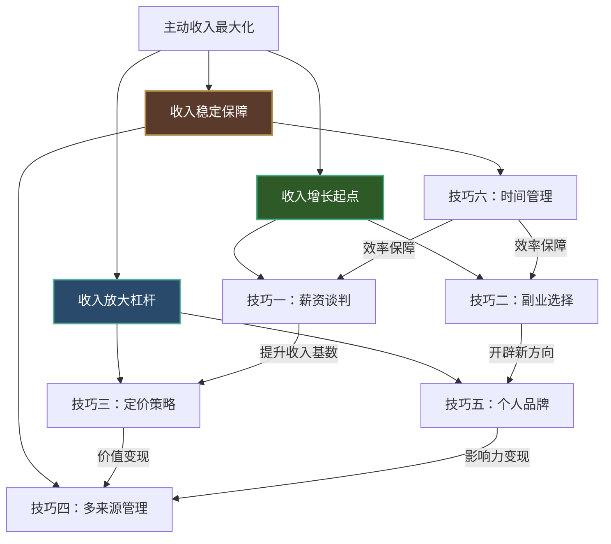
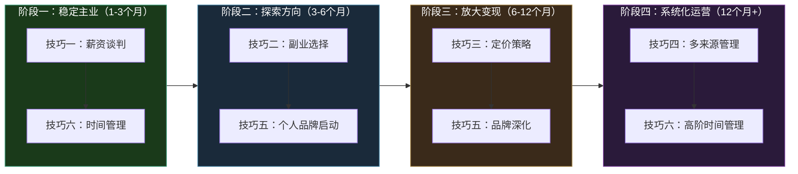

## 本节小结：核心技巧全景回顾与行动框架

前六个技巧从不同维度构建了主动收入最大化的完整方法论。它们并非孤立的"好习惯"，而是一个环环相扣的系统——薪资谈判奠定收入基数，副业选择找到正确方向，定价技巧决定收入天花板，多来源管理分散风险，个人品牌放大影响力，时间管理保证执行效率。

本节小结的目标不是重复每个技巧的细节，而是帮你建立**全局视野**：看清六个技巧之间的逻辑关系，掌握在不同阶段该优先使用哪个技巧，并获得一份可立即执行的行动清单。

### 六大技巧的系统关系

六个技巧之间存在清晰的依赖和递进关系。薪资谈判和副业选择是**收入增长的起点**——一个提升主业收入基数，一个开辟新的收入方向。定价技巧和个人品牌是**收入放大的杠杆**——前者让同样的时间产出更高的价值，后者让你的市场能见度和议价能力持续提升。多来源管理和时间管理则是**收入稳定的保障**——前者分散系统性风险，后者确保你在有限的时间内做出最优分配。



### 六大技巧核心要点速查

下表汇总每个技巧最核心的方法论要点，便于快速回顾和查阅：

| 技巧 | 核心方法 | 关键工具/框架 | 最大误区 | 适用阶段 |
|------|---------|-------------|---------|---------|
| **技巧一：薪资谈判** | 五步法（准备→锚定→协商→让步→收尾） | 市场薪酬数据、BATNA分析 | 谈判时以"我需要"而非"我值得"为论据 | 任何时候都适用，尤其是入职和晋升窗口 |
| **技巧二：副业选择** | 三圈模型（擅长×喜欢×需要） | Ikigai框架、MVP验证 | 跟风热门赛道而不评估自身匹配度 | 有1-2小时/天的可支配时间时 |
| **技巧三：定价策略** | 价值定价法（按产出而非投入收费） | 价格锚定、阶梯报价 | 用"别人收多少"来定价，陷入低价竞争 | 自由职业/副业接单阶段 |
| **技巧四：多来源管理** | 收入组合矩阵（主动+半被动+被动） | 现金流仪表盘、72小时法则 | 同时开太多项目，每个都半途而废 | 主业稳定后开始布局 |
| **技巧五：个人品牌** | 内容输出×社交证明×口碑传播 | 一三五框架（1定位×3平台×5内容类型） | 把品牌等同于人设包装，缺乏真实价值输出 | 职业生涯任何阶段都应启动 |
| **技巧六：时间管理** | 优先级矩阵+精力管理+批量处理 | 番茄工作法、时间日志、精力曲线 | 只管理时间不管理精力，越忙越低效 | 贯穿始终，副业起步期尤为关键 |

### 不同阶段的技巧优先级

主动收入最大化的路径因人而异，但有一条**阶段最优路径**——在正确的时间做正确的事，远比同时做所有事更高效。



**阶段一（1-3个月）：稳定主业基本盘**

优先级：薪资谈判 > 时间管理

这个阶段的核心目标是**先把主业收入优化到合理水平**。大多数人的主业收入都低于市场公允价值——要么是入职时没谈好，要么是连续几年没主动争取涨薪。一次成功的薪资谈判可能带来 15%-30% 的涨幅，这是任何副业初期都很难达到的回报率。同时，优化时间管理为后续副业腾出可支配时间。

**阶段二（3-6个月）：探索副业方向**

优先级：副业选择 > 个人品牌启动

有了稳定的时间余量后，用三圈模型系统评估副业方向。这个阶段**不求快，但求准**——方向选错了，后面的努力都是沉没成本。同时开始建立个人品牌的基础设施：确定定位、选择平台、开始内容输出。

**阶段三（6-12个月）：放大变现**

优先级：定价策略 > 品牌深化

副业方向验证通过后，重点转向**如何在同样的时间投入下赚更多**。价值定价法取代工时定价法，让收入与你创造的价值而非投入的时间挂钩。个人品牌从"有"到"强"，通过持续的内容输出和案例积累建立行业影响力。

**阶段四（12个月+）：系统化运营**

优先级：多来源管理 > 高阶时间管理

当单一副业收入稳定后，开始构建多元收入组合。这个阶段的重点不是"做更多事"，而是**让已有资产产生复合效应**——一份内容可以同时在多个平台变现，一个技能可以同时服务多个客户群体，一次品牌积累可以持续带来新机会。

### 六大技巧的常见组合策略

在实际操作中，技巧之间往往需要组合使用。以下是经过验证的高效组合：

**组合一：薪资谈判 + 个人品牌 = 主业天花板突破**

在谈判前 3-6 个月启动个人品牌建设——在行业社区发表专业见解、在公司内部主导可见度高的项目、在专业平台积累作品集。谈判时，你的"市场价值"不再是抽象的自我评价，而是可量化的外部证据。实践数据显示，有个人品牌背书的谈判者，薪资涨幅平均高出无品牌者 40%。

**组合二：副业选择 + 定价策略 = 高利润副业**

用三圈模型选方向时，同步考虑定价空间——如果一个方向只能做低价值的重复劳动（如数据录入），即使三个圈都满足，天花板也太低。优先选择**价值密度高**的方向：咨询服务、技术培训、专业设计等，这些方向的定价弹性大，同样的时间投入可以产生 5-10 倍的收入差距。

**组合三：多来源管理 + 时间管理 = 可持续的收入系统**

多来源管理的执行难点在于**有限时间如何分配给多个收入来源**。时间管理技巧中的精力曲线分析提供了答案：将高价值工作安排在精力高峰期，低价值维护性工作安排在低谷期，用批量处理减少切换成本。一个管理得当的多来源收入系统，总工时不一定比单一来源更多，但收入确定性和天花板都显著提升。

**组合四：个人品牌 + 多来源管理 = 被动获客飞轮**

个人品牌的终极价值不是"让人知道你"，而是**让客户主动找上门**。当品牌影响力达到临界点后，获客成本趋近于零，此时叠加多来源管理——将同一个技能以不同形式变现（一对一咨询、线上课程、出版物、工具产品），每个来源都在为其他来源导流，形成正向飞轮。

### 从核心技巧到进阶技巧

前六个技巧覆盖了主动收入最大化的"基础操作"，但还有两个关键场景需要专项技巧：**何时该换工作**（技巧七：跳槽决策的系统化方法）和**如何从零启动一个副业项目**（技巧八：副业项目的冷启动方法）。

跳槽决策之所以需要独立的系统化方法，是因为它是一个**不可逆的高风险决策**——错误的跳槽可能让你损失数万元的隐性收入（年终奖、期权、人脉积累），而正确的跳槽可能带来 30%-50% 的收入跃升。简单凭感觉"干得不开心就走"是最危险的策略。

冷启动方法则是副业选择和定价策略的**落地执行层**——从"我知道该做什么"到"我真的开始做了"之间，存在一个巨大的行动鸿沟。大多数副业不是死于方向错误，而是死于从未真正启动。

接下来的两个技巧将分别解决这两个关键卡点。

### 自检清单：你的核心技巧掌握度

用以下清单评估自己对六大技巧的掌握程度。打分标准：0=完全不了解，1=知道概念但未实践，2=实践过但效果一般，3=熟练运用且有成果。

```text
技巧一（薪资谈判）：___/3分
  □ 是否了解当前岗位的市场薪酬区间？
  □ 是否准备了完整的谈判话术？
  □ 是否有过成功的薪资谈判经历？

技巧二（副业选择）：___/3分
  □ 是否用三圈模型梳理过自己的技能/兴趣/市场匹配？
  □ 是否做过至少一次副业方向的小规模验证？
  □ 是否找到了一个可持续的副业方向？

技巧三（定价策略）：___/3分
  □ 是否了解自己所在领域的市场定价区间？
  □ 是否有基于价值而非工时的报价方案？
  □ 是否成功将定价提升过 50% 以上？

技巧四（多来源管理）：___/3分
  □ 是否有超过 2 个收入来源？
  □ 是否有系统的收入追踪和复盘机制？
  □ 各收入来源之间是否存在协同效应？

技巧五（个人品牌）：___/3分
  □ 是否有清晰的个人定位？
  □ 是否在 1 个以上平台持续输出内容？
  □ 是否因个人品牌获得过新机会或客户？

技巧六（时间管理）：___/3分
  □ 是否了解自己的精力曲线？
  □ 是否有固定的时间分配系统？
  □ 是否能在不增加总工时的前提下提升产出？

总分：___/18分
```

**评分解读：**

- **0-6分**：处于认知起步期，建议重新精读每个技巧的完整内容，优先选择一个技巧深入实践
- **7-11分**：处于实践探索期，已经有一定基础，重点是找到自己最薄弱的 2 个技巧集中突破
- **12-15分**：处于能力提升期，大部分技巧已在实践中，重点是优化组合策略和解决瓶颈
- **16-18分**：处于高手进阶期，基础技巧已内化，重点转向技巧七和技巧八的进阶场景

### 下一步行动建议

不要试图同时运用所有技巧。根据自检结果，找到你当前得分最低的那个技巧，用一周时间完成以下动作：

1. **重读该技巧的完整章节**，标注你之前忽略的关键点
2. **完成该技巧的实战练习**（如果有对应练习文件）
3. **记录实践结果**，一周后复盘效果
4. **再选择下一个低分技巧**，重复以上过程

记住：主动收入最大化的本质不是"知道更多方法"，而是**把少数几个方法用到极致**。一个熟练运用薪资谈判技巧的人，仅凭这一项就能在十年内多赚 30-50 万。六个技巧全部熟练运用的人，主动收入的上限将远超同龄人。

接下来，让我们进入技巧七——跳槽决策的系统化方法，学习如何在职业发展的关键节点做出最优决策。
