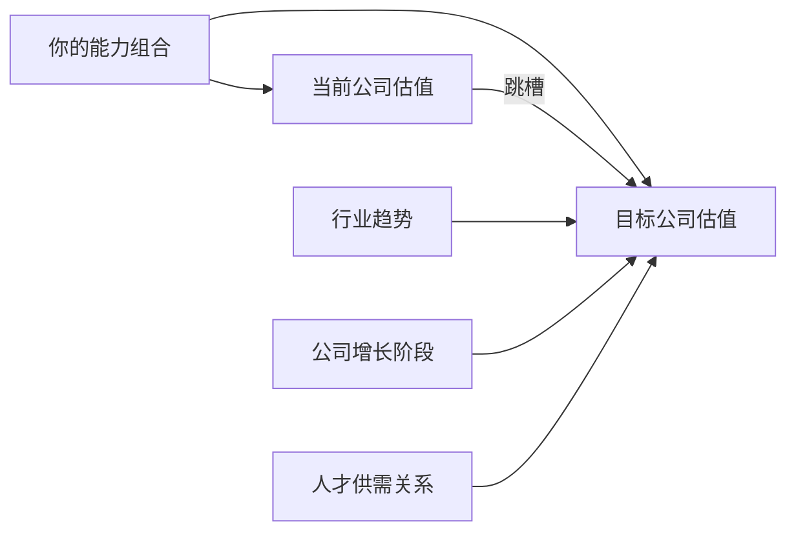
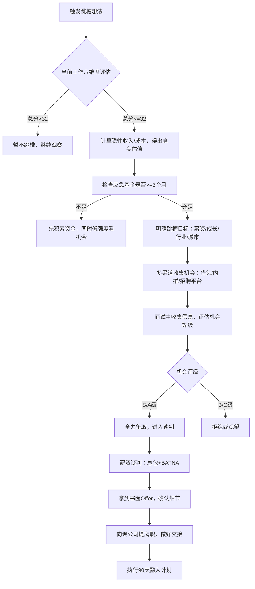

## 技巧七：跳槽决策的系统化方法

跳槽是职业生涯中收益最高、风险也最高的单次决策之一。一次成功的跳槽可以带来 20%-50% 的薪资涨幅、全新的成长通道和更优质的行业人脉；一次失败的跳槽则可能让你陷入试用期淘汰、文化冲突、甚至职业断崖的困境。问题在于——大多数人做这个决策时，依赖的是直觉、情绪或某个偶然的内推机会，而不是一套可复用的系统。

本章将跳槽拆解为五个阶段：**时机判断→机会评估→风险量化→谈判博弈→融入落地**，每个阶段给出可直接使用的工具和框架。

---

### 一、跳槽的底层逻辑：为什么需要系统化

#### 1.1 跳槽本质上是一次"资产置换"

你出售的不是时间，而是**能力组合**（技术栈+行业认知+人脉网络+项目经验）。跳槽意味着用同一套能力组合去换取更高的回报。这里有一个关键洞察：**能力组合的价值是上下文相关的**——同样的技术能力，在一家走下坡路的公司可能只值 30 万，在一家高速增长的公司可能值 50 万。



#### 1.2 跳槽决策的三个常见陷阱

| 陷阱 | 表现 | 后果 |
|------|------|------|
| **情绪驱动型** | 和领导吵了一架就想走 | 可能跳入更差的环境 |
| **薪资唯一型** | 只看薪资涨幅，忽略其他维度 | 高薪低幸福感，半年后再次想跳 |
| **被动接受型** | 有猎头找就去看看，没有就不动 | 错过最佳跳槽窗口期 |

系统化的核心目标是：**把跳槽从情绪决策变成投资决策**。每一跳都要经过预期收益、风险敞口、机会成本的冷静计算。

#### 1.3 最佳跳槽时机模型

不是所有时候都适合跳槽。以下是经过大量职业发展研究验证的**最佳跳槽窗口**：

- **工作满 2-3 年时**：已经积累了足够的项目经验，简历上有可讲述的成果，同时还没有陷入舒适区
- **项目交付后**：带着完整的项目成果离开，简历上有说服力的案例
- **行业上行期**：人才需求旺盛时跳槽，议价空间最大
- **公司融资/上市后**：期权已经兑现或即将兑现，可以带着收益离场
- **领导变动期**：新领导上任带来的不确定性，可能压缩你的发展空间

**不适合跳槽的信号**：

- 刚入职不满 1 年（简历会被标注"不稳定"）
- 公司正在经历重大变革且你参与其中（可能是升职机会）
- 经济下行期且没有更好的 offer（保住现金流优先）
- 正在负责关键项目中途（留下完整项目再走）

---

### 二、当前工作的系统评估

在看外部机会之前，先冷静评估当前状态。很多人犯的错误是：**在情绪最低谷时做跳槽决定**。以下是八维度评估框架。

#### 2.1 八维度评估矩阵

每个维度按 1-5 分打分，并附带具体的评分锚点，避免主观偏差：

| 维度 | 1 分 | 3 分 | 5 分 |
|------|------|------|------|
| **薪资满意度** | 低于市场 P25，连续 2 年未涨 | 接近市场中位数 | 高于市场 P75，有明确涨薪机制 |
| **成长空间** | 无新技能学习机会，重复劳动 | 能学到新东西但节奏慢 | 有明确晋升路径，导师资源丰富 |
| **工作内容** | 大部分时间做无价值的事 | 工作有意义但缺乏挑战 | 核心业务，有挑战有成就感 |
| **领导关系** | 领导不认可你，沟通困难 | 关系一般，偶尔有摩擦 | 领导信任你，愿意给资源和机会 |
| **团队氛围** | 勾心斗角，互相甩锅 | 各干各的，协作有限 | 互相支持，共同成长 |
| **公司前景** | 业务萎缩，裁员传闻不断 | 业务稳定但无增长 | 高速增长，行业领先 |
| **工作生活平衡** | 996 是常态，随时待命 | 偶尔加班，总体可控 | 弹性工作，尊重个人时间 |
| **福利待遇** | 五险一金最低基数，无其他 | 基础福利齐全 | 补充医疗、期权、培训预算等 |

**评分汇总与决策指引**：

| 总分区间 | 判定 | 行动建议 |
|----------|------|----------|
| 33-40 分 | 优质工作 | 不建议跳槽，除非外部有 S 级机会 |
| 25-32 分 | 合格工作 | 可以观望，遇到好机会再考虑 |
| 17-24 分 | 鸡肋工作 | 建议主动出击，开始投递和面试 |
| 8-16 分 | 劣质工作 | 强烈建议跳槽，即使暂时没找到理想机会也应开始行动 |

#### 2.2 "隐藏薪资"核算

很多人只看月薪数字，忽略了总回报包（Total Rewards）。以下是完整的核算框架：

**显性收入**：

- 月薪 × 12 + 年终奖（通常 0-6 个月）
- 绩效奖金（季度/半年度）
- 项目奖金、签单提成
- 股票/期权（需按行权价和当前估值折算为年化收益）

**隐性收入**：

- 五险一金（公积金双边合计可达月薪的 24%）
- 补充医疗保险（市场价约 5000-20000 元/年）
- 餐补、交通补贴、通讯补贴（合计约 1000-3000 元/月）
- 培训预算（外企通常 1-3 万/年）
- 免费健身房、下午茶、年度体检等（约 5000-15000 元/年）
- 弹性工作制的隐性价值（省去通勤时间和成本）

**隐性成本**：

- 超长通勤（每天 2 小时 × 250 天 = 500 小时/年，按时薪折算可能值 2-5 万）
- 无偿加班（如果时薪被压缩，实际收入下降）
- 高压工作带来的健康成本（体检异常、焦虑、失眠）

**核算公式**：

```text
实际年收入 = 显性收入 + 隐性收入 - 隐性成本
实际时薪 = 实际年收入 ÷ (实际工作小时数 + 通勤小时数)
```

这个数字才是你当前工作的**真实估值**。跳槽时，新 offer 必须超过这个数字 15% 以上才有意义（覆盖跳槽的沉没成本和风险溢价）。

---

### 三、新机会的多维评估

#### 3.1 机会评估的八个维度

| 维度 | 权重 | 评估要点 |
|------|------|----------|
| **薪资涨幅** | 20% | 总包涨幅（不是基本工资涨幅），含股票、奖金 |
| **成长空间** | 20% | 能学到什么新技能？晋升路径清晰吗？有无导师？ |
| **公司平台** | 15% | 品牌背书、行业地位、技术栈先进性 |
| **行业前景** | 15% | 行业处于什么阶段？未来 3-5 年的增长预期 |
| **工作内容** | 10% | 是否与你的长期职业方向一致？ |
| **团队质量** | 10% | 面试中接触到的人是否让你佩服？ |
| **工作强度** | 5% | 是否有明确的工作时间边界？ |
| **地理位置** | 5% | 通勤时间、是否需要搬迁、城市发展前景 |

> **为什么行业前景权重这么高？** 因为行业决定了你的能力组合的天花板。在一个萎缩的行业里，你再努力，薪资增长也会遇到瓶颈。正如雷军所说："站在风口上，猪都能飞起来。"反过来，在下行电梯里，你再怎么跳也到不了高层。

#### 3.2 机会分级标准

基于加权总分，将机会分为四级：

| 级别 | 总分 | 定义 | 行动 |
|------|------|------|------|
| **S 级** | ≥85 分 | 稀缺机会，错过可能再等 2-3 年 | 立刻行动，全力争取 |
| **A 级** | 70-84 分 | 好机会，值得跳 | 认真准备，积极争取 |
| **B 级** | 55-69 分 | 中等机会，需要权衡 | 除非当前工作评分 < 20 分，否则观望 |
| **C 级** | <55 分 | 不值得跳 | 直接拒绝，不要浪费时间面试 |

#### 3.3 信息收集清单

面试不只是被考察，更是你收集信息的渠道。以下是必须在面试过程中搞清楚的关键信息：

**关于岗位**：

- 这个岗位为什么开放？是新设还是有人离职？
- 岗位的 KPI 是什么？试用期考核标准？
- 直接汇报对象是谁？团队规模多大？
- 未来 1 年的核心任务是什么？

**关于公司**：

- 最近一轮融资情况？估值多少？
- 核心业务的增长数据（用户量、营收、增速）
- 公司的战略方向和你的岗位的关联
- 技术栈和工程文化（可以通过 Glassdoor、脉脉等渠道了解）

**关于团队**：

- 团队的技术氛围（Code Review 文档？开源贡献？技术分享？）
- 团队成员的平均工作年限和背景
- 团队过去半年的人员流动率

**获取信息的渠道矩阵**：

| 渠道 | 可靠度 | 能获取的信息 |
|------|--------|------------|
| 面试官 | ★★★ | 岗位要求、团队文化、项目方向 |
| 脉脉/看准网 | ★★☆ | 薪资范围、真实评价、内部八卦 |
| 行业人脉 | ★★★★ | 真实的工作体验、领导风格、晋升难度 |
| 招聘 JD | ★☆ | 岗位硬性要求（但可能美化） |
| 公司财报/新闻 | ★★★ | 业务状况、战略方向、裁员风险 |
| LinkedIn | ★★☆ | 团队成员背景、流动情况 |

---

### 四、风险量化与对冲策略

#### 4.1 跳槽风险矩阵

将风险按**发生概率**和**影响程度**两个维度评估：

| 风险类型 | 概率 | 影响 | 风险等级 | 对冲策略 |
|----------|------|------|----------|----------|
| 试用期不通过 | 中 | 高 | ⚠️ 高 | 提前确认考核标准；保持面试手感；预留应急基金 |
| 文化不适应 | 中 | 中 | ⚠️ 中 | 面试中多观察；通过人脉了解内部文化 |
| 实际工作与描述不符 | 中 | 中 | ⚠️ 中 | 面试中追问具体工作内容；要求看团队 OKR |
| 行业下行/裁员 | 低 | 高 | ⚠️ 中 | 选择行业头部公司；避免过度依赖单一公司 |
| 薪资结构变化 | 低 | 中 | 🟢 低 | Offer 中明确写清薪资结构；了解绩效奖金的发放比例 |
| 通勤/搬迁问题 | 低 | 低 | 🟢 低 | 提前实地考察；试跑一次通勤路线 |

#### 4.2 应急基金检查

跳槽前，确保你的财务安全垫足够厚：

- **最低标准**：3 个月生活费（含房租、餐饮、贷款还款）
- **推荐标准**：6 个月生活费（覆盖试用期不通过的最坏情况）
- **理想标准**：9-12 个月生活费（让你有底气拒绝不合理要求）

如果应急基金不足，优先积累资金再跳槽。没有财务安全垫的跳槽是一场赌博。

#### 4.3 不烧桥原则

无论你多么想离开当前公司，都不要烧桥：

- **交接文档**：写清楚所有在手项目的进度、关键联系人、待办事项
- **提前通知**：至少提前 30 天提出离职（法定标准），关键岗位建议提前 45-60 天
- **感恩表达**：对帮助过你的领导和同事表达真诚的感谢
- **不在社交媒体吐槽**：即使公司有很多问题，也不要在公开场合表达
- **保持联系**：离职后定期和前同事保持互动（行业圈子很小）

---

### 五、薪资谈判的系统方法

#### 5.1 谈判前的准备

谈判的底气来自信息和备选方案（BATNA）：

**信息准备**：

- 通过薪酬报告（如拉勾、Boss 直聘、Levels.fyi）了解目标岗位的薪资范围
- 通过行业人脉了解该公司的真实薪资水平
- 计算你的底线数字（低于这个数就不跳）

**BATNA 准备**：

- 同时推进 2-3 个面试流程，手握多个 offer 是最强的谈判筹码
- 如果目前工作还不错，你的 BATNA 就是"留在原公司"——这本身就是很好的备选

#### 5.2 谈判的五步法

**第一步：先让对方出价**

不要主动报期望薪资。当被问到"你的期望薪资是多少"时，可以这样回应：

> "我更看重这个岗位的成长空间和团队。方便了解一下贵公司这个岗位的薪资范围吗？"

**第二步：收到 offer 后不要立刻接受**

> "谢谢您的 offer，我很感兴趣。我需要 1-2 天时间和家人商量一下，可以吗？"

这给你留出冷静分析和准备还价的空间。

**第三步：基于总包谈判**

不要只盯着基本工资，而是基于总回报包谈判：

- 基本工资
- 年终奖（几个月？保底多少？）
- 签字费（跳槽时的一次性补偿）
- 股票/期权（数量、行权价、归属时间表）
- 试用期薪资（有些公司试用期打八折）
- 搬迁补贴（如果需要换城市）

**第四步：用数据而非情绪说话**

> "根据我了解的市场情况，这个级别的岗位总包通常在 XX-XX 之间。考虑到我在 XX 领域的经验，我觉得 XX 的总包更符合双方的预期。"

**第五步：谈不拢时探索其他选项**

如果基本工资确实无法提高，可以谈判其他方面：

- 提前 Review（6 个月后重新评估薪资）
- 更短的晋升周期
- 额外的培训预算
- 弹性工作制
- 签字费（一次性补偿）

#### 5.3 薪资谈判的常见误区

| 误区 | 纠正 |
|------|------|
| 报出当前薪资 | 对方会基于你当前薪资出价，而非基于岗位价值。很多城市已立法禁止询问当前薪资 |
| 涨幅期望太低 | 跳槽的合理涨幅是 20%-40%，低于 15% 的涨幅不值得承担跳槽风险 |
| 对方说"这是最高价"就接受 | 大部分时候这是谈判策略，可以通过强调你的独特价值来争取更多 |
| 同时谈多个 offer 时互相压价 | 可以用 A 的 offer 去谈 B 的薪资，但不要编造虚假数字 |
| 谈完薪资就结束了 | 入职后 6 个月内的表现决定了你能否快速晋升和加薪 |

---

### 六、跳槽后的 90 天融入计划

入职后的前三个月决定了你在新公司的长期发展轨迹。以下是分阶段的行动计划。

#### 6.1 第一阶段：观察与融入（第 1-30 天）

**核心目标**：搞清楚"这里是怎么运转的"

**行动清单**：

- **人际关系**：在第一周内和直接领导做一次 1 对 1 沟通，明确期望；认识团队所有成员，了解每个人的职责和专长；找到公司里的"活地图"——那个什么都知道的老员工
- **业务理解**：阅读公司内部文档、产品文档、技术文档；了解核心业务的数据指标（DAU、营收、转化率等）；理解团队当前的 OKR 和季度目标
- **文化适应**：观察公司的沟通方式（邮件 vs IM vs 面对面）；了解决策流程（谁拍板？会议文化如何？）；注意着装、作息、午餐习惯等非正式规范
- **技术/工具熟悉**：掌握内部开发流程（Git Flow、CI/CD、部署流程）；熟悉内部工具链（项目管理、文档、监控等）

**关键原则**：

> **前 30 天不评价，只观察。** 不要说"我在上家公司是这么做的"。每个公司的运作方式都有其背后的原因，在你不了解全貌之前，先听、先看、先学。

#### 6.2 第二阶段：建立信任（第 31-60 天）

**核心目标**：用交付证明能力

**行动清单**：

- **快速胜利**（Quick Win）：主动承担一个范围明确、周期短（2-3 周）的任务；高质量交付，超出预期；过程中展现你的专业度和协作能力
- **建立口碑**：主动帮助同事解决技术问题；在会议中提出有建设性的意见（但不抢风头）；分享你在前公司积累的有价值经验
- **深化业务理解**：从"知道做什么"进阶到"理解为什么这么做"；了解产品决策背后的业务逻辑和数据依据
- **向上管理**：每周和领导同步进度（简短、重点突出）；遇到问题时带着方案去请示，而不是只带问题

#### 6.3 第三阶段：展现价值（第 61-90 天）

**核心目标**：从"新人"转变为"核心成员"

**行动清单**：

- **承担更大责任**：主动认领跨团队协作项目；成为某个技术领域的 owner
- **提出系统性改进**：基于前 60 天的观察，提出 1-2 个有深度的改进建议；用数据支撑你的建议，而不是"我觉得"
- **建立影响力**：在团队内做一次技术分享；写一篇内部博客总结你的学习和发现
- **第一次正式绩效沟通**：和领导做一次深入的职业发展对话；明确你在公司 6-12 个月的发展路径；了解绩效评估的标准和周期

#### 6.4 90 天融入的关键心态

| 心态 | 说明 |
|------|------|
| **空杯心态** | 过去的经验是你的能力，但在新环境中，先放下"我以前怎么怎么样" |
| **主动心态** | 不要等人安排任务，主动寻找能贡献价值的地方 |
| **耐心心态** | 信任需要时间建立，不要指望一个月就被重用 |
| **观察心态** | 多听少说，尤其是涉及公司政治和人际关系的话题 |
| **交付心态** | 最终打动人的不是你的学历和背景，而是你实际产出的成果 |

---

### 七、特殊情况处理

#### 7.1 收到 Counter Offer 怎么办

当你提离职时，当前公司可能用加薪来挽留。统计数据表明：**接受 Counter Offer 的人中，约 80% 在 6-12 个月内仍然会选择离开**。原因是导致你想走的根本问题往往没有解决。

**接受 Counter Offer 的风险**：

- 领导知道你想走，信任度可能下降
- 你被贴上"用钱留住的人"标签
- 同事知道你用离职谈到了加薪，可能产生不满
- 导致你想离开的问题（成长空间、管理问题、文化问题）通常不会因为加薪而改变

**建议**：除非 counter offer 不仅加薪，还解决了你离开的根本原因（比如换团队、换项目、明确晋升路径），否则不要接受。

#### 7.2 行业转型期的跳槽策略

当行业正在经历剧变（如 AI 替代传统岗位、行业监管收紧、技术范式转移），跳槽策略需要调整：

- **向新范式靠拢**：如果当前行业在萎缩，跳槽到新兴领域比在旧领域换公司更有价值
- **降低薪资涨幅期望**：转型期可能需要接受短期降薪，换取长期在新领域的入场券
- **利用可迁移技能**：强调你的可迁移能力（项目管理、沟通、分析）而非特定行业经验
- **选择转型中的大公司**：大公司在转型时需要有经验的人，且容错空间更大

#### 7.3 35 岁以上的跳槽策略

35 岁以上的职业人士面临独特的挑战：

- **减少海投比例**：更多依赖人脉推荐和猎头渠道，避免被简历筛选系统过滤
- **强调管理能力**：纯技术岗位的竞争在 35 岁后变激烈，管理或架构方向更可持续
- **选择稳定性高的公司**：大厂或行业头部企业，避免创业公司（除非有明确的高管角色）
- **薪资谈判更灵活**：可以接受"略低的基本工资 + 更高的绩效奖金 + 股票"的结构，展现长期承诺
- **利用行业口碑**：这个阶段你的行业声誉比简历更重要，平时就要维护好个人品牌

---

### 八、跳槽决策的完整工作流

将以上所有内容整合为一个可执行的工作流：



---

### 九、自检清单与工具模板

#### 9.1 跳槽决策自检表

在做出最终决定前，逐项确认：

| 检查项 | 是否确认 |
|--------|----------|
| 我已经冷静分析了当前工作，不是在情绪低谷做决定 | □ |
| 我计算了隐性收入/成本，知道自己的真实估值 | □ |
| 应急基金≥3个月生活费 | □ |
| 新 offer 的总包超过当前真实估值 15% 以上 | □ |
| 我通过多个渠道了解了新公司的真实情况 | □ |
| 我和家人/伴侣充分沟通并达成共识 | □ |
| 我了解新岗位的具体工作内容和考核标准 | □ |
| 我有书面 Offer，薪资结构写得清清楚楚 | □ |
| 我已经想好了如何和现公司优雅地告别 | □ |
| 我有 90 天融入计划 | □ |

**全部打勾 = 可以放心跳。有未确认项 = 先补齐再做决定。**

#### 9.2 离职交接清单

| 交接项 | 完成状态 |
|--------|----------|
| 在手项目进度文档 | □ |
| 关键联系人列表（内部+外部） | □ |
| 代码/文档的权限移交 | □ |
| 未报销的费用结清 | □ |
| 公司设备归还（电脑、门禁卡、工牌） | □ |
| 社保/公积金转移确认 | □ |
| 竞业协议/保密协议条款确认 | □ |
| 推荐信/背调联系人确认 | □ |

---

### 十、核心要点回顾

1. **跳槽是投资决策，不是情绪决策**——用系统化框架替代直觉判断
2. **先评估当前，再看外部**——在情绪稳定时做评估，避免低谷期冲动离职
3. **关注总回报包**——月薪只是冰山一角，隐性收入/成本才是真实估值
4. **行业比公司重要，公司比岗位重要**——选对电梯比在电梯里跳得高更重要
5. **谈判靠信息和 BATNA**——多 offer 在手 + 市场薪资数据 = 谈判底气
6. **入职前 90 天决定长期发展**——空杯心态、快速交付、建立信任
7. **不烧桥**——行业圈子很小，今天的前同事可能是明天的面试官
8. **用数据做决策**——每个维度打分，总分驱动行动，而不是"我觉得"
