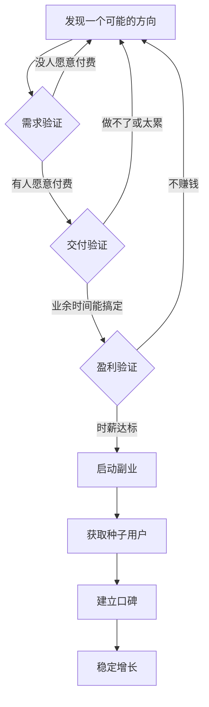
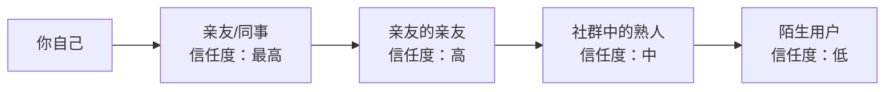
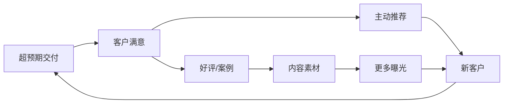
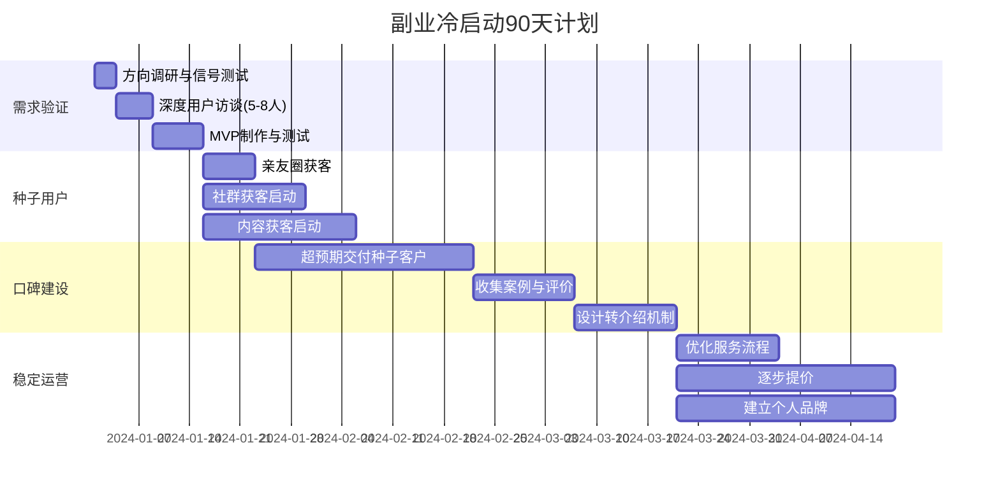
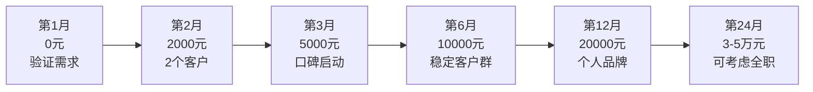

## 技巧八：副业项目的冷启动方法

冷启动（Cold Start）是副业从0到1的关键阶段——你没有任何客户、没有口碑、没有流量，却需要在有限的时间和精力内让项目运转起来。大多数副业失败不是因为方向错了，而是因为冷启动阶段犯了致命错误：要么花了三个月打磨产品却没人买，要么急于变现伤害了第一批用户。

本章提供一套经过验证的冷启动方法论，覆盖需求验证、种子用户获取、口碑建立、定价策略、平台选择和规模化路径，帮助你在90天内让副业产生第一笔收入。

### 冷启动的核心逻辑

冷启动的本质是**用最小成本验证一个商业假设**。这个假设包含三个要素：

| 要素 | 问题 | 验证标准 |
|------|------|----------|
| 需求真实性 | 是否有人愿意为这个需求付费？ | 至少3个人明确表示愿意付费 |
| 交付可行性 | 你能否在业余时间完成交付？ | 单次交付时间不超过4小时 |
| 盈利可持续性 | 收入能否覆盖你的时间成本？ | 时薪不低于主业时薪的50% |

三个要素缺一不可。很多人只验证了需求（"有人感兴趣"），却没有验证付费意愿和交付可行性，结果做着做着就发现要么做不下去，要么不赚钱。



### 第一阶段：需求验证（第1-2周）

需求验证是冷启动中最关键的环节。90%的副业失败可以追溯到需求验证不充分。以下是三种递进式的验证方法，从低成本到高成本，建议按顺序执行。

#### 方法一：轻量级信号测试（1-3天）

这是最快、成本最低的验证方式，核心思路是**在不投入任何开发成本的情况下，测试目标人群的反应**。

**朋友圈/社交媒体测试法：**

发布一条精心设计的内容，观察反馈。注意，这不是简单地发"我在做XX，有没有人感兴趣"——这种表述太模糊，无法获得有效信号。

正确的方式是具体描述你能解决的问题：

> "最近帮朋友做了一次简历优化，从投了30份没回复变成了面试邀约率60%。如果有人需要，我可以帮你看看简历，这周限5个名额。"

这条信息包含了三个关键要素：
1. **具体成果**：面试邀约率从几乎为0到60%
2. **稀缺性**：限5个名额
3. **行动号召**：可以帮你看看简历

如果超过5个人私信询问详情，说明需求信号较强。如果没有任何反应，要么是方向不对，要么是表述方式需要调整。

**信号强度判断标准：**

| 信号强度 | 私信数量 | 后续动作 |
|----------|----------|----------|
| 强信号 | ≥10人私信 | 直接进入下一步 |
| 中信号 | 3-9人私信 | 优化表述后再测一次 |
| 弱信号 | 1-2人私信 | 考虑调整方向或受众 |
| 无信号 | 0人私信 | 换方向，不要死磕 |

#### 方法二：深度用户访谈（3-7天）

信号测试告诉你"有人感兴趣"，但不能告诉你"他们具体需要什么"。深度访谈解决的是这个问题。

**如何找到访谈对象：**
- 从信号测试中回复你的人
- 你所在行业的同事、朋友
- 相关社群中的活跃成员
- 闲鱼、豆瓣、知乎上发帖求助的人

**访谈模板（每次20-30分钟）：**

```text
开场（2分钟）：
"我在调研XX领域的问题，想了解一下你在这方面的经历，大概聊20分钟可以吗？"

核心问题（15分钟）：
1. "你目前在XX方面遇到的最大困难是什么？"（挖掘痛点）
2. "你尝试过哪些方法来解决？效果如何？"（了解现有方案）
3. "如果有一个方案能帮你解决这个问题，你愿意花多少钱？"（测试付费意愿）
4. "你通常在哪里寻找这类服务/产品？"（了解获客渠道）
5. "你做决策时最看重什么？价格、效果、还是便捷性？"（了解决策因素）

收尾（3分钟）：
"非常感谢你的时间。如果后续我做出了相关产品/服务，你愿意第一时间试用吗？"
```

**访谈记录模板：**

每次访谈后立即填写以下记录，不要等到最后一起整理——你会发现记忆会迅速模糊。

```markdown
## 访谈记录 #N
- **对象**：张三，28岁，产品经理，北京
- **日期**：2024-01-15
- **核心痛点**：简历投了50份只有2个面试，不知道问题出在哪
- **尝试过的方案**：用了某简历模板网站（效果不好），找朋友帮看过（建议太笼统）
- **付费意愿**：愿意花200-500元，如果能保证效果可以更高
- **决策因素**：最看重是否有成功案例
- **关键原话**："我不在乎花多少钱，关键是别浪费我时间"
- **洞察**：用户对"效果保证"的需求很强，可以考虑"不满意退款"策略
```

**访谈数量建议：** 至少完成5-8次深度访谈。当连续3次访谈得到的痛点高度一致时，说明你已经摸到了真实需求。

#### 方法三：最小可行产品（MVP）验证（7-14天）

如果前两步验证通过，用最低成本做一个"能用但不完美"的产品/服务来测试真实付费行为。

**关键原则：能用现成工具就不要自己开发。**

| 副业类型 | MVP形式 | 所需时间 | 工具 |
|----------|---------|----------|------|
| 咨询服务 | 一次1对1通话 | 1小时 | 腾讯会议/Zoom |
| 课程/教程 | 一份PDF文档或录播视频 | 3-5天 | WPS/剪映 |
| 设计服务 | 一个案例作品+接单页面 | 2-3天 | Canva/站酷 |
| 技术外包 | 一个简单的Demo | 3-5天 | 现有框架 |
| 自媒体 | 连续发布10条内容 | 7-10天 | 小红书/抖音 |
| 电商选品 | 先不囤货，用1688代发测试 | 1-3天 | 拼多多/闲鱼 |

**MVP验证的核心指标不是收入，而是转化率：**

```text
转化率 = 实际付费人数 / 接触到产品信息的总人数

转化率 > 5%：需求强劲，可以加大投入
转化率 2-5%：需求存在，需要优化产品或定价
转化率 < 2%：需求较弱，需要重新审视方向
```

### 第二阶段：获取种子用户（第2-4周）

种子用户是副业的命脉。他们不仅带来第一笔收入，更重要的是提供真实反馈和口碑传播。获取种子用户的核心策略有三种，可以组合使用。

#### 策略一：信任链获客——从熟人圈向外扩展

冷启动阶段最大的障碍是信任。陌生人不会轻易为一个没有口碑的新服务付费。解决这个问题最有效的方式是**借助已有的信任关系**。



**具体操作方法：**

1. **列出你的"启动名单"**：打开微信通讯录，列出所有可能对你的服务有需求的人。不需要他们直接付费，而是请他们帮忙：
   - "你觉得你身边谁可能需要这个服务？能帮我推荐一下吗？"
   - "我刚开始做这个，想收集一些反馈，你能帮我试试吗？"

2. **设计推荐激励机制**：
   - 推荐成功下单，推荐人获得10%-20%的佣金或等值服务
   - 被推荐人获得首次体验折扣（通常8折）
   - 推荐3人以上，推荐人获得一次免费服务

3. **降低首批用户的决策门槛**：
   - 提供"不满意全额退款"承诺
   - 首批用户享受特别定价（通常是正式价格的50%-70%）
   - 提供一次免费试用或诊断服务

#### 策略二：社群获客——在目标用户聚集地建立存在感

社群获客的核心不是"发广告"，而是**先提供价值，再自然引流**。在社群中直接发广告几乎100%会被踢，而且会损害你的个人品牌。

**正确的社群获客四步法：**

**第一步：选择正确的社群（第1-3天）**

不是所有社群都值得投入时间。选择社群的标准：

| 评估维度 | 优质社群特征 | 低质社群特征 |
|----------|-------------|-------------|
| 成员质量 | 有准入门槛，成员画像清晰 | 无门槛，人员杂乱 |
| 活跃度 | 每天有实质性讨论 | 全是广告和表情包 |
| 管理规范 | 有明确规则，违规会被处理 | 无人管理，信息混乱 |
| 需求匹配 | 成员经常讨论你服务相关的话题 | 话题与你的方向无关 |

**第二步：建立专业形象（第1-2周）**

进入社群后不要急着推销。先花1-2周时间做以下事情：
- 每天回答2-3个与你专业相关的问题
- 分享有用的工具、资源、方法
- 参与讨论，展示你的思考深度

目标是让社群成员在看到你的名字时，第一反应是"这个人懂XX"。

**第三步：软性引流（第2-3周）**

当社群中有人提出与你服务直接相关的问题时，自然地引导：

> "这个问题我之前帮朋友解决过，他从XX变成了XX。如果你需要更详细的方案，可以私信我，我帮你具体分析一下。"

注意：永远不要在群里直接发链接、报价或广告。所有的转化都通过私聊完成。

**第四步：持续输出（长期）**

社群获客不是一次性的事情。你需要持续在社群中输出价值，才能持续获得新客户。建议每周至少花2-3小时在核心社群中互动。

#### 策略三：内容获客——用内容建立专业壁垒

内容获客是最慢但最有复利效应的方式。一篇好文章可以在发布几个月甚至几年后仍然为你带来客户。

**内容获客的平台选择：**

| 平台 | 适合类型 | 冷启动速度 | 内容形式 | 流量特点 |
|------|----------|-----------|----------|----------|
| 小红书 | 生活服务、设计、护肤、穿搭 | 快（1-2周） | 图文笔记 | 女性用户为主，消费意愿强 |
| 知乎 | 专业咨询、技术、教育 | 中（2-4周） | 长文回答 | 高质量用户，决策周期长 |
| B站 | 教程、评测、技术分享 | 慢（1-3月） | 视频 | 年轻用户，粘性高 |
| 抖音/快手 | 泛娱乐、生活技巧、带货 | 快但不稳 | 短视频 | 流量大但精准度低 |
| 公众号 | 深度内容、行业分析 | 慢（1-3月） | 长文 | 粉丝粘性强，转化率高 |
| 即刻/Twitter | 创业、产品、技术 | 中（2-4周） | 短内容 | 创业圈层，互相引流 |

**冷启动期内容策略（以小红书为例）：**

```text
第1周：发布5-8条笔记，测试哪种内容类型数据最好
  - 类型A：干货教程（如"简历优化的5个关键点"）
  - 类型B：案例展示（如"帮朋友改了简历，面试率提升3倍"）
  - 类型C：问题解答（如"为什么你的简历总被筛掉？"）

第2周：聚焦数据最好的类型，继续发布5-8条
  - 标题公式：数字 + 痛点 + 结果
  - 封面设计：对比图、数据图、清单图
  - 发布时间：工作日晚上8-10点，周末上午10-12点

第3周：开始在内容中自然植入引流信息
  - 评论区置顶：引导私信咨询
  - 个人简介：留下联系方式或服务介绍
  - 私信话术：准备标准化的咨询回复模板

第4周：复盘数据，优化内容策略
  - 分析哪类内容互动率最高
  - 分析哪些标题点击率最高
  - 调整发布时间和频率
```

### 第三阶段：口碑建立与定价策略（第1-3个月）

#### 口碑飞轮：从第一个客户到持续转介绍

口碑是副业增长的核心引擎。冷启动阶段的口碑建设有一个关键原则：**对前10个客户投入200%的精力**。



**超预期交付的具体做法：**

1. **承诺80分，交付120分**：不要过度承诺，但在交付时多给一些额外价值。比如你承诺简历优化，额外附赠一份面试常见问题清单。

2. **交付后48小时跟进**：服务完成后不是结束，而是开始。在交付后48小时内主动联系客户：
   - "用了一周感觉怎么样？有没有遇到什么问题？"
   - "我最近又总结了一些XX方面的心得，发给你参考。"

3. **建立客户案例库**：每个成功案例都详细记录（获得客户许可后）：
   - 客户的初始状态（痛点、数据）
   - 你提供的解决方案
   - 最终效果（最好有量化数据）
   - 客户的评价（原话引用更有说服力）

4. **设计转介绍机制**：
   - 在服务结束时自然地提出："如果你觉得这次服务有价值，身边有朋友可能也需要的话，欢迎推荐给他们。"
   - 提供推荐奖励：推荐成功后双方各获得一定优惠
   - 制作"推荐话术模板"，降低客户推荐的心理成本

#### 冷启动期定价策略

定价是冷启动中最容易犯错的环节。定价太高没人买，定价太低不仅亏本，还会给人"廉价"的印象。

**冷启动期的三层定价模型：**

```text
┌─────────────────────────────────────────────┐
│            正式价格（最终目标）               │
│         用于第3个月之后的稳定运营             │
│          例：咨询服务 500元/次               │
├─────────────────────────────────────────────┤
│          优惠价格（冷启动期）                 │
│        用于第1-3个月的获客期                  │
│       例：咨询服务 300元/次（6折）            │
├─────────────────────────────────────────────┤
│          免费/极低价（种子期）                 │
│       用于获取前5-10个种子客户                │
│     例：免费诊断 + 99元完整方案               │
└─────────────────────────────────────────────┘
```

**定价决策的五个参考维度：**

1. **成本底线**：计算你的时间成本。如果你的主业时薪是100元，副业时薪不应低于50元。
2. **竞品参考**：调查同类服务的市场价格，取中间值作为起点。
3. **价值锚定**：你的服务能帮客户省多少钱/赚多少钱？定价应该是客户获得价值的10%-30%。
4. **心理定价**：整数价格（500、1000）适合高端服务；非整数价格（299、497）适合大众市场。
5. **提价节奏**：每完成10-20单或每过1-2个月，提价10%-20%，直到达到目标价格。

### 冷启动期的常见陷阱与避坑指南

#### 陷阱一：过度打磨产品

**典型表现**：花三个月做了一个自认为完美的课程/产品，结果发现没人需要。

**正确做法**：先用最小成本验证需求，再逐步完善。你的第一版产品应该是"能用"而不是"完美"。记住：一个60分但已经卖出去的产品，比一个100分但还在硬盘里的产品有价值一万倍。

#### 陷阱二：免费做太久

**典型表现**：为了积累案例和口碑，做了大量免费服务，结果形成了"免费"的用户心智，后期无法收费。

**正确做法**：免费服务最多做5-10次，用于获取种子用户和案例。之后必须开始收费，哪怕是象征性的低价。人们只会珍惜他们付费获得的东西。

#### 陷阱三：只在一个渠道发力

**典型表现**：所有精力都投入在一个平台上（比如只做小红书），一旦平台算法变化或账号出问题，流量归零。

**正确做法**：冷启动阶段可以聚焦1-2个主要渠道，但同时要有意识地建立私域流量池（微信群、个人号、邮件列表）。平台是租来的，私域才是自己的。

#### 陷阱四：忽视交付质量

**典型表现**：因为急于获客，同时接了太多单子，导致交付质量下降，口碑崩塌。

**正确做法**：冷启动阶段宁可少接单，也要保证每个客户的体验。一个差评在冷启动期的杀伤力是10倍——因为你没有足够的好评来稀释它。建议设置接单上限，比如每周最多服务3个客户。

#### 陷阱五：不做复盘

**典型表现**：每天忙着获客和交付，但从不分析数据、不总结经验，一直在低水平重复。

**正确做法**：每周花1小时做一次复盘：

```markdown
## 周复盘模板

### 数据回顾
- 本周新增咨询：___人
- 本周成交：___单
- 本周收入：___元
- 本周获客渠道分布：朋友圈___%，社群___%，内容___%

### 什么做得好？
- （具体描述，附数据）

### 什么做得不好？
- （具体描述，分析原因）

### 下周改进计划
- （具体的、可执行的行动项）

### 关键洞察
- （这周你学到的最重要的一件事）
```

### 副业冷启动完整时间线

以下是一个经过验证的90天冷启动时间线，适用于大多数服务型副业。



**各阶段关键动作和收入预期：**

| 阶段 | 时间 | 关键动作 | 预期收入 | 核心指标 |
|------|------|----------|----------|----------|
| 验证期 | 第1-2周 | 信号测试、用户访谈、MVP | 0元 | 访谈转化率、付费意愿强度 |
| 种子期 | 第3-4周 | 获取前5-10个种子客户 | 500-2000元 | 客户满意度、NPS评分 |
| 口碑期 | 第2-3月 | 超预期交付、案例积累 | 2000-5000元 | 转介绍率、复购率 |
| 增长期 | 第4-6月 | 渠道扩展、提价、标准化 | 5000-10000元 | 获客成本、客户生命周期价值 |
| 稳定期 | 第7-12月 | 个人品牌、被动获客 | 10000-30000元 | 自然流量占比、利润率 |

### 实操模板：副业启动Checklist

以下是完整的冷启动执行清单，建议打印出来逐项打勾。

#### 第1周：方向明确

```text
□ 列出你擅长的3-5个技能（不只是工作技能，也包括兴趣爱好）
□ 对每个技能评估：市场需求 × 你的擅长程度 × 变现难度
□ 选择得分最高的1-2个方向
□ 在搜索引擎和社交平台上搜索相关关键词，评估市场热度
□ 找到3-5个同类竞品，分析他们的定价、服务内容和用户评价
□ 写下一句话定位："我帮[目标人群]解决[具体问题]，通过[你的方法]"
```

#### 第2周：需求验证

```text
□ 发布信号测试内容（朋友圈/社群/社交媒体）
□ 统计反馈数据（私信数量、评论数量、互动质量）
□ 联系5-8个目标用户进行深度访谈
□ 整理访谈记录，提炼核心痛点和付费意愿
□ 判断验证结果：强信号继续，弱信号调整方向
□ 确定你的核心服务/产品定义
```

#### 第3-4周：获取种子客户

```text
□ 制作MVP（最低可行产品/服务）
□ 设计种子客户特别优惠（免费体验或超低价格）
□ 从亲友圈开始推荐（发一条精心设计的推荐信息）
□ 在2-3个目标社群中开始活跃互动
□ 启动内容创作（选择1个主要平台，发布3-5条内容）
□ 目标：获取3-5个付费种子客户
```

#### 第2个月：优化与提价

```text
□ 根据种子客户反馈优化服务流程
□ 建立标准化的服务SOP（交付流程、沟通模板、售后跟进）
□ 提价20%-50%（根据市场反馈调整）
□ 积累3-5个详细的成功案例
□ 建立客户推荐机制（推荐奖励、话术模板）
□ 持续内容输出，扩大影响力
□ 目标：月收入3000-5000元
```

#### 第3个月：稳定运营

```text
□ 建立固定的获客渠道（至少2个稳定来源）
□ 制定月度内容发布计划
□ 优化定价体系（可设计基础版/进阶版/高端版）
□ 建立客户管理系统（哪怕是Excel表格）
□ 开始建立个人品牌（统一头像、简介、内容风格）
□ 评估是否需要扩大规模（招助手、开发产品化方案）
□ 目标：月收入5000-10000元
```

### 个人品牌打造30天冲刺计划

个人品牌是副业长期增长的基石。以下是一个可在30天内完成的快速建设计划。

#### 第1周：精准定位

```text
□ 确定你的专业标签（不超过3个关键词）
  例：简历优化 | 面试辅导 | 职业规划
□ 确定你的目标受众画像
  例：25-35岁互联网从业者，工作3-8年，想跳槽但简历不过关
□ 写一句话价值主张
  例："帮互联网人把面试通过率从10%提升到50%以上"
□ 设计统一的视觉形象
  - 头像：清晰的个人照片或专业logo
  - 封面图：包含你的价值主张和联系方式
  - 配色方案：选2-3个主色调，所有平台保持一致
```

#### 第2周：内容弹药库

```text
□ 建立选题库（至少20个选题）
  - 痛点类：目标用户最常遇到的问题
  - 方法类：你解决问题的具体方法
  - 案例类：真实的客户案例和效果
  - 资源类：有用的工具、模板、清单
□ 准备5-8条内容的初稿
  - 不追求完美，先完成再完善
□ 学习基础的内容制作技能
  - 图文：Canva模板、稿定设计
  - 视频：剪映、必剪
  - 排版：135编辑器、秀米
□ 选择1-2个主要发布平台并完成账号设置
```

#### 第3周：高频输出

```text
□ 每天发布1条内容（宁可短而精，不要长而空）
□ 每天花30分钟互动（回复评论、参与讨论、关注同行）
□ 关注10个同领域的优秀创作者
  - 分析他们的爆款内容：标题、封面、结构、互动引导
  - 模仿（不是抄袭）他们的成功元素
□ 记录每天的数据：阅读量、点赞数、评论数、涨粉数
```

#### 第4周：复盘迭代

```text
□ 分析过去3周的内容数据
  - 哪条内容数据最好？为什么？
  - 哪条内容数据最差？为什么？
  - 最佳发布时间是几点？
  - 哪类选题最受欢迎？
□ 提炼你的"内容公式"
  例：痛点标题 + 对比图封面 + 3个具体步骤 + 结尾引导互动
□ 制定下个月的内容日历
□ 开始建立内容素材库（截图、数据、案例、金句）
```

### 副业时间管理：能量管理法

传统时间管理关注"什么时候做什么"，但对于上班族做副业来说，更重要的是管理你的**能量**——因为你的可用时间本来就有限，如果在低能量状态工作，效率可能只有高能量状态的30%。

#### 认识你的能量周期

每个人的能量周期不同，但大多数人遵循以下模式：

```text
┌──────────────────────────────────────────────────────────┐
│  能量                                                      │
│  高 │    ┌─────┐                                           │
│     │   │      │          ┌──┐                             │
│  中 │  │       │         │    │                            │
│     │ │        │        │      │                           │
│  低 ││──────────│──────│────────│──────                    │
│     └──┴───┴───┴───┴───┴──┴───┴───┴───┴──→ 时间           │
│     6  8  10  12  14  16  18  20  22                       │
│     ↑        ↑        ↑        ↑                           │
│    起床    上午高峰   午后低谷   晚间回升                    │
└──────────────────────────────────────────────────────────┘
```

#### 能量四象限工作法

将你的副业任务按"所需能量"和"所需创造力"分类，匹配到不同的时间段：

| 时段特征 | 适合的任务 | 具体例子 |
|----------|-----------|----------|
| 高能量+高创造力 | 创作、策略规划、复杂问题解决 | 写文章、设计课程、制定获客策略 |
| 高能量+低创造力 | 沟通、执行、协作 | 客户沟通、社群互动、接单谈价 |
| 低能量+高创造力 | 发散性思考、灵感收集 | 选题头脑风暴、竞品分析、阅读学习 |
| 低能量+低创造力 | 机械性工作、整理归档 | 回复消息、整理资料、更新表格 |

**实操步骤：**

1. **用一周时间记录你的能量状态**：每小时给自己打分（1-5分），同时记录你在做什么、效率如何。

2. **识别你的高能量时段**：大多数人有两个高峰——上午9-11点和晚上8-10点。但你可能是例外，只有实测才知道。

3. **把最重要的副业任务放在高能量时段**：如果你的高能量时段是晚上8-10点，那就把每天这2小时固定留给副业中最需要创造力的工作。

4. **设置"能量保护"机制**：高能量时段不做低价值的事情（刷手机、无意义的聊天、机械性工作）。

5. **利用碎片时间做低能量任务**：通勤路上回复消息、午休时间整理资料、排队时浏览行业资讯。

### 副业收入增长路线图

以下是一个典型的服务型副业收入增长路线，以技术咨询为例。实际数字因人而异，但增长曲线的形状具有普遍参考价值。



**关键里程碑：**

```text
□ 第一个付费客户 —— 从0到1的突破，证明方向可行
□ 第一个月收入超过3000元 —— 验证商业模式
□ 第一次客户主动推荐新客户 —— 口碑飞轮开始转动
□ 第一次提价后仍有客户购买 —— 说明你的价值被认可
□ 月收入稳定超过主业收入的30% —— 副业开始成为真正的收入来源
□ 月收入稳定超过10000元 —— 可以考虑投入更多精力
□ 月收入稳定超过主业收入 —— 面临全职or继续兼职的决策点
```

> **记住**：冷启动最难的部分不是方法，而是心态。前3个月可能是零收入或微收入，这段时间需要极大的耐心和信心。但只要你验证了真实需求、提供了超预期的价值、持续输出内容，增长曲线一定会在某个节点出现拐点。坚持到那个拐点，就是胜利。
