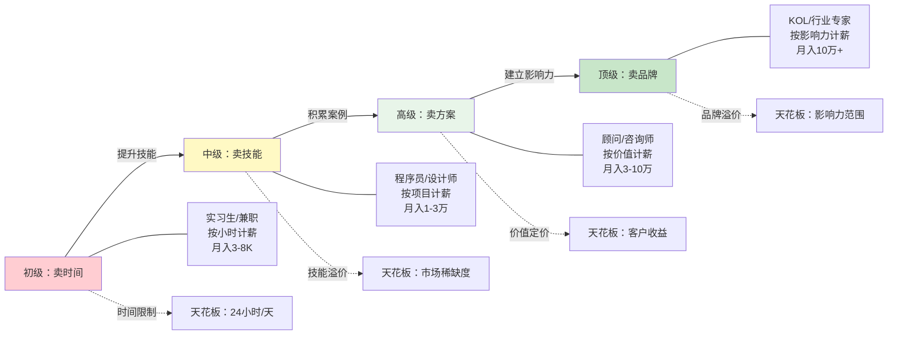
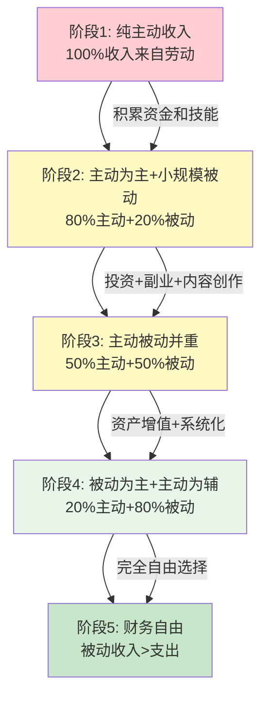

## 4.1 主动收入的本质

主动收入是绝大多数人一生中最主要的收入来源，也是积累第一桶金的核心路径。理解主动收入的本质，不是简单地知道"干活换钱"，而是要深入理解其经济学原理、价值交换机制、增长路径和结构性局限——只有看清本质，才能找到突破天花板的方法。

### 4.1.1 什么是主动收入

#### 定义与核心特征

主动收入（Active Income）是指**个人通过投入时间、技能和劳动所获得的经济回报**。从经济学角度看，它是劳动力市场上的一种即时交易行为：你出售自己的时间和能力，买方（雇主或客户）为此支付报酬。

与被动收入（Passive Income）的根本区别在于三个维度：

| 维度 | 主动收入 | 被动收入 |
|------|----------|----------|
| 时间依赖 | 强依赖——停止劳动即停止收入 | 弱依赖——资产持续产生收益 |
| 收入公式 | 时薪 × 工作时间 | 资产规模 × 收益率 |
| 增长方式 | 线性增长（受限于时间上限） | 指数增长（复利效应） |
| 初始投入 | 低（只需劳动力） | 高（需要资金、时间或技能前置投入） |
| 风险特征 | 低（确定性交换） | 中高（资产可能贬值或归零） |

主动收入的五种主要形态：

1. **工资薪金**：最普遍的形式，按月发放，包含基本工资和绩效奖金。稳定性最高，但增长空间受限于企业薪资体系和晋升通道。
2. **奖金提成**：与业绩直接挂钩，如销售提成、项目奖金。收入弹性大，但波动性也高。
3. **劳务报酬**：一次性或短期的劳务支付，如兼职、临时工、外包项目。灵活性强但缺乏保障。
4. **自由职业收入**：独立承接客户的项目收入，如独立设计师、自由撰稿人、咨询顾问。定价自由度高，但需要自行获客和管理。
5. **经营性收入**：小微企业主或个体工商户的经营利润。风险最高但上限也最高。

#### 为什么主动收入是大多数人的起点

从现实角度看，主动收入几乎是每个人的必经之路，原因有三：

**第一，门槛最低。** 被动收入通常需要资本积累、技术积累或资源积累，而主动收入只需要你愿意付出时间和劳动。一个刚毕业的大学生没有资金去做投资，没有粉丝去做自媒体，但他一定有时间和劳动力可以出售。

**第二，确定性最高。** 在所有收入类型中，主动收入的确定性最强。你签了劳动合同，每个月就有固定收入。这种确定性对于建立财务安全基线至关重要——没有稳定的主动收入，你就无法安心地去尝试其他收入形式。

**第三，技能孵化器。** 主动收入的过程本身就是技能积累的过程。你在工作中学会的编程、营销、管理、沟通等技能，是未来创造被动收入的基础。很多成功的创业者，都是先在职场积累了核心技能和行业认知，然后才开始独立发展。

### 4.1.2 主动收入的经济学原理

#### 边际生产力理论

主动收入的定价逻辑，经济学上可以用**边际生产力理论**（Marginal Productivity Theory）来解释：一个劳动者的收入取决于他为雇主创造的**边际产出价值**。

简单来说：如果你每多工作一小时能为公司多创造 500 元的收入，你的时薪就不会长期低于 500 元（否则其他公司会出更高的价格来挖你），也不会长期高于 500 元（否则雇你就是亏本的）。

这个理论解释了一个关键现象：**为什么单纯"努力工作"不一定能提高收入**。因为收入的决定因素不是你的投入量（工作时长），而是你的产出价值（每小时创造的价值）。一个每天工作 12 小时但每小时产出价值 100 元的人，收入不如一个每天工作 8 小时但每小时产出价值 500 元的人。

#### 人力资本理论

诺贝尔经济学奖得主加里·贝克尔（Gary Becker）提出的**人力资本理论**（Human Capital Theory）认为，劳动者的技能、知识和经验是一种"资本"，可以通过教育和培训进行投资，从而提高未来的收入能力。

人力资本的投资回报体现在两个层面：

- **通用型人力资本**（General Human Capital）：如英语能力、编程基础、沟通技巧。这些技能在任何雇主那里都有价值，回报体现在更高的市场议价能力上。
- **专用型人力资本**（Firm-Specific Human Capital）：如对公司内部系统的深度理解、特定行业的专有知识。这些技能在当前雇主那里价值最高，回报体现在晋升和内部薪资增长上。

理解这个区分很重要：**通用型人力资本让你可以自由跳槽获取更高薪资，专用型人力资本让你在当前组织内获得溢价**。最优策略是两者兼顾，但以通用型为主——因为你需要保持对市场的议价能力。

#### 供需关系与稀缺性溢价

主动收入的定价还受到**供需关系**的深刻影响。同样的技能水平，在不同的供需环境下，收入可以相差数倍。

以程序员为例：2015 年移动互联网爆发期，会写 iOS 应用的开发者极度稀缺，初级 iOS 开发者的月薪就能达到 2-3 万；到 2023 年，iOS 开发者供给充足，同等水平的薪资回落到 1-1.5 万。技能没有变，变的是供需关系。

这意味着：**提升主动收入不仅要提升技能水平，还要关注技能的市场稀缺度**。选择一个需求旺盛但供给不足的领域，比在一个供给过剩的领域做到极致，往往更有效。

### 4.1.3 主动收入的结构性局限

#### 时间硬上限

主动收入最根本的局限是**时间的有限性**。每个人每天只有 24 小时，扣除睡眠、吃饭、通勤和休息，真正能用于创造收入的时间大约是 8-12 小时。

```text
主动收入的理论上限 = 时薪 × 可工作时间

极端假设：
- 时薪：500元（已经是市场前5%的水平）
- 每天有效工作：10小时
- 每月工作：26天（几乎无休）

月收入上限 = 500 × 10 × 26 = 130,000元
年收入上限 = 1,560,000元
```

即使在这个极端假设下，年收入也只有 156 万。而且这个假设要求你每天高强度工作 10 小时、几乎无休——这在长期来看是不可持续的。

#### 线性增长陷阱

主动收入的增长通常是**线性的**：你多投入一小时，就多获得一小时的报酬。这与被动收入的指数增长形成鲜明对比。

```mermaid
graph LR
    subgraph 主动收入增长
        A1[年份1: 10万] --> A2[年份5: 25万] --> A3[年份10: 50万] --> A4[年份20: 80万]
    end
    subgraph 被动收入增长（复利10%）
        B1[年份1: 2万] --> B2[年份5: 8万] --> B3[年份10: 26万] --> B4[年份20: 174万]
    end

    style A1 fill:#ffcdd2
    style A2 fill:#ffcdd2
    style A3 fill:#ffcdd2
    style A4 fill:#ffcdd2
    style B1 fill:#c8e6c9
    style B2 fill:#c8e6c9
    style B3 fill:#c8e6c9
    style B4 fill:#c8e6c9
```

> **关键洞察**：主动收入是"加法"——每多一小时就多一份钱；被动收入是"乘法"——时间和复利共同作用。两条曲线的交叉点，就是你从"必须工作"变为"可以选择工作"的转折点。

#### 健康与年龄的衰减

主动收入还有一个容易被忽视的风险：**它与你的身体和精力状态直接绑定**。随着年龄增长，体力下降、精力减退、学习新技术的速度变慢，都可能导致你的主动收入能力下降。

这对"吃青春饭"的行业尤其明显：程序员在 35 岁后面临的职场压力、销售人员在体力下降后业绩的下滑、设计师面对年轻竞争者的冲击。主动收入的本质是"卖自己"，而"自己"这个资产是会折旧的。

### 4.1.4 主动收入的进阶路径

从"卖时间"到"卖品牌"的进化，是主动收入最大化的主线逻辑。



#### 阶段一：卖时间（初级）

**特征**：按小时或按天计薪，工作内容由雇主定义，个人议价能力弱。

**典型职业**：实习生、兼职、初级服务员、工厂流水线工人、快递员。

**收入逻辑**：时间 × 固定时薪。收入增长的唯一方式是增加工作时间或获得小幅加薪。

**突破策略**：
- 利用业余时间学习可迁移的技能（如办公软件、数据分析、外语）
- 主动争取更有挑战性的任务，积累经验
- 不要在这个阶段停留太久——它是一个起点，不是一个归宿

#### 阶段二：卖技能（中级）

**特征**：拥有市场认可的专业技能，按项目或成果计薪，开始具备一定议价能力。

**典型职业**：程序员、设计师、会计、律师、医生、工程师。

**收入逻辑**：技能水平 × 项目产出。收入增长依赖于技能深度和项目复杂度。

**突破策略**：
- 在一个垂直领域做到前 20%（T 型人才：一个深方向 + 多个浅方向）
- 积累可量化的项目成果（如"主导开发了日活 50 万的 App"）
- 建立行业人脉网络，为跳槽和副业铺路
- 学会向上管理，让领导看到你的价值而不只是你的工时

**收入提升的具体方法**：

| 方法 | 预期提升 | 时间周期 | 难度 |
|------|----------|----------|------|
| 跳槽（同行业） | 20-50% | 1-3个月 | 低 |
| 技能深化（考认证） | 10-30% | 3-6个月 | 中 |
| 转岗（管理/技术双通道） | 30-100% | 6-12个月 | 高 |
| 转行（高薪行业） | 50-200% | 6-18个月 | 高 |
| 副业（技能变现） | 额外 20-80% | 3-6个月 | 中 |

#### 阶段三：卖方案（高级）

**特征**：不再是"你让我做什么我就做什么"，而是"我告诉你应该做什么"。从执行者变为解决者。

**典型职业**：管理顾问、技术架构师、品牌策划、独立咨询师、高级律师。

**收入逻辑**：方案价值 × 客户收益。你帮客户赚了 100 万，收 10 万的咨询费——这个定价逻辑与你投入的时间无关，只与你创造的价值有关。

**突破策略**：
- 从"我能做什么"转向"我能帮你解决什么问题"
- 建立自己的方法论和解决方案框架
- 积累标杆案例（"我帮 X 公司提升了 Y% 的 Z 指标"）
- 学会价值定价而非成本定价

**价值定价 vs 成本定价**：

```text
成本定价思维：
"这个项目我需要花 40 小时，我的时薪是 500 元，所以报价 2 万。"

价值定价思维：
"这个方案能帮客户每年节省 100 万的成本，我收取 10 万的咨询费。
客户的投资回报率是 10 倍，这个价格对他来说非常划算。"
```

#### 阶段四：卖品牌（顶级）

**特征**：你的名字本身就是一种价值背书。客户选择你不是因为你的技能（别人也有），而是因为你这个人（你是独一无二的）。

**典型职业**：行业 KOL、知名企业家、顶级设计师、畅销书作者、知名投资人。

**收入逻辑**：品牌影响力 × 覆盖范围。这个阶段的收入上限取决于你能影响多少人、影响到什么程度。

**突破策略**：
- 持续输出高质量内容，建立行业话语权
- 打造个人 IP，让市场主动来找你
- 从一对一服务转向一对多（演讲、课程、书籍、品牌代言）
- 构建个人品牌生态系统

### 4.1.5 主动收入最大化的底层逻辑

#### 核心公式：收入 = 价值 × 杠杆

主动收入的最大化可以用一个公式来理解：

```text
主动收入 = 单位时间价值 × 杠杆系数

单位时间价值 = 技能稀缺度 × 问题重要性 × 解决方案质量
杠杆系数 = 人群规模 × 传播效率 × 信任程度
```

**提升单位时间价值的三条路径**：

1. **提升技能稀缺度**：掌握大多数人不会的技能。稀缺度不仅取决于技能难度，还取决于市场供需。学习一门冷门但需求大的技能（如工业控制系统安全），可能比学习一门热门但供给过剩的技能（如前端开发）更有溢价。

2. **解决更重要的问题**：同样是写代码，为一个小商户写网站和为银行写核心交易系统，收入差距可以达到 10 倍以上。区别不在于技术难度，而在于问题的商业价值。

3. **提高解决方案质量**：同一个问题，可以用 60 分的方案解决，也可以用 95 分的方案解决。高水准的解决方案不仅溢价更高，还能带来更多口碑推荐。

**提升杠杆系数的三条路径**：

1. **扩大人群规模**：从一对一服务转向一对多。一个咨询师一对一收费 5000/小时，但如果做成在线课程卖给 1000 人每人 500 元，总收入是 50 万——远超一对一的天花板。
2. **提高传播效率**：利用互联网、社交媒体和内容平台放大你的影响力。同样的技能，线下服务只能覆盖本地市场，线上内容可以覆盖全球。
3. **建立信任体系**：通过案例积累、客户评价、行业认证等方式降低客户的决策成本。信任程度越高，客户的付费意愿和付费金额就越高。

#### 三个关键杠杆点

**杠杆点一：选对赛道**

不同行业的收入天花板差异巨大。2023 年中国各行业平均年薪对比：

| 行业 | 平均年薪（万元） | 头部年薪（万元） | 天花板倍数 |
|------|-----------------|-----------------|-----------|
| 金融 | 25-40 | 200-500+ | 10-20x |
| 互联网/科技 | 20-35 | 150-300+ | 8-15x |
| 医疗 | 15-30 | 100-300+ | 7-10x |
| 教育 | 8-15 | 30-80 | 4-5x |
| 制造业 | 6-12 | 30-60 | 3-5x |
| 餐饮/零售 | 4-8 | 15-30 | 2-4x |

选赛道不是要你盲目追高薪行业，而是要找到**你的能力优势和行业高天花板的交叉点**。一个对数字敏感但不喜欢金融的人，硬去做金融可能还不如在自己擅长的领域做到极致。

**杠杆点二：提升时薪而非增加工时**

很多人提升收入的方式是加班、做兼职、接更多项目——本质上都是在增加工时。这条路的天花板很低，而且会透支健康。

更聪明的方式是提升单位时间的价值：

```text
低效路径：月薪1万 → 加班+兼职 → 月入1.5万（但每天工作14小时）
高效路径：月薪1万 → 技能提升+跳槽 → 月入2万（每天工作8小时）

时薪对比：
低效路径：15000 ÷ (14 × 26) = 82元/小时
高效路径：20000 ÷ (8 × 26) = 96元/小时
```

高效路径不仅总收入更高，时薪也更高，而且生活质量更好。

**杠杆点三：从个人贡献者到价值放大器**

当你的技能达到一定水平后，下一步不是继续提升技术深度，而是学会**通过他人创造价值**：

- **带团队**：你一个人写代码月入 3 万，带 5 个人的团队每人创造 2 万价值，你的价值放大到了 10 万。
- **做培训**：把你掌握的技能教给 100 个人，每人收 5000 元，一次培训就是 50 万。
- **建系统**：把你重复做的事情做成标准化流程或产品，让它可以脱离你独立运转。

### 4.1.6 常见误区与纠正

#### 误区一："努力工作就能涨工资"

**真相**：努力是必要条件，但不是充分条件。涨工资取决于你创造的价值是否被看到、你的议价能力是否足够、以及你是否处于正确的行业和公司。

**纠正方法**：
- 学会向上管理，定期向领导汇报你的成果和贡献
- 主动争取高可见度的项目（而不是埋头做后台工作）
- 保持对市场的敏感度，定期了解自己的市场价值
- 每 1-2 年评估一次是否需要跳槽——跳槽是涨薪最快的方式之一

#### 误区二："只要技术够强，收入自然会高"

**真相**：技术能力只是收入的一个决定因素。沟通能力、商业敏感度、人脉资源、行业选择同样重要。很多技术极强的人收入并不高，因为他们只会"做事"不会"卖自己"。

**纠正方法**：
- 花 20% 的时间提升软技能（沟通、演讲、写作、谈判）
- 学会用商业语言描述你的技术价值
- 主动参与跨部门项目，拓展视野和人脉
- 关注行业趋势，及时调整技能方向

#### 误区三："副业做得好就可以辞职"

**真相**：副业收入的稳定性通常远低于主业。辞职前需要确保副业收入至少达到主业收入的 1.5-2 倍，且持续稳定 6 个月以上。

**纠正方法**：
- 副业收入连续 6 个月超过主业收入的 1.5 倍再考虑辞职
- 辞职前储备至少 12 个月的生活费作为安全垫
- 确保副业有持续增长的趋势，而不是一次性的项目收入
- 考虑先转为兼职，用更多时间发展副业，而不是一步到位

#### 误区四："收入高就是成功"

**真相**：收入只是衡量职业发展的一个维度。时薪、工作满意度、成长空间、健康状态、家庭时间同样重要。一个年入 50 万但每天工作 14 小时、身心俱疲的人，不一定比年入 30 万但工作生活平衡的人更成功。

**纠正方法**：
- 用时薪而非月薪来衡量你的劳动价值
- 定期评估你的工作满意度和身心状态
- 设定包含收入、健康、关系、成长的多维目标
- 警惕"高薪陷阱"——有些高薪岗位会透支你的长期发展

#### 误区五："年轻时多赚钱，以后再享受"

**真相**：很多技能和机会都有时间窗口。年轻时过度透支健康换取收入，中年后可能面临健康崩塌、技能过时、转型困难的多重危机。

**纠正方法**：
- 在追求收入的同时投资健康（运动、睡眠、饮食）
- 持续学习新技能，不要依赖单一技能吃老本
- 尽早开始建立被动收入渠道，哪怕金额很小
- 平衡短期收入和长期价值——有些工作收入不高但成长性很强

### 4.1.7 从主动收入到被动收入的过渡

主动收入不是终点，而是起点。最终目标是用主动收入积累的资金、技能和资源，逐步建立被动收入系统。

**过渡路径**：



**每个阶段的关键动作**：

- **阶段 1→2**：开始储蓄（至少收入的 20%），学习投资基础知识，尝试小规模的副业或内容创作。
- **阶段 2→3**：将储蓄系统化投资（基金定投、指数基金等），将副业发展为可规模化的收入来源。
- **阶段 3→4**：优化被动收入结构，减少对主动收入的依赖，开始有选择性地工作。
- **阶段 4→5**：被动收入稳定超过生活支出，实现真正的财务自由。

> **核心理念**：主动收入是"打井"的过程——你需要投入大量的时间和精力去挖掘；被动收入是"水流"的过程——一旦井打通了，水就会持续流出。但在井打通之前，你必须依靠主动收入来养活自己。这就是为什么理解主动收入的本质、最大化主动收入的效率，是实现财务自由的第一步。

### 4.1.8 实操：计算你的主动收入效率

用以下框架评估你当前的主动收入效率，并找到优化方向：

```text
步骤1：计算你的真实时薪
真实时薪 = 月收入 ÷ (实际工作小时数 + 通勤时间 + 加班时间 + 回复工作消息的时间)

步骤2：计算你的时间分配
- 高价值时间（直接创造收入的时间）：___小时/周
- 低价值时间（会议、行政、沟通协调）：___小时/周
- 无效时间（摸鱼、等待、重复劳动）：___小时/周

步骤3：识别提升空间
- 高价值时间占比 < 50%：优先优化工作流程，减少低价值时间
- 真实时薪 < 行业中位数：优先提升技能或考虑跳槽
- 没有副业收入：优先探索技能变现的可能性
- 工作时间 > 50小时/周：优先提升效率而非增加工时

步骤4：制定优化计划
- 短期（1-3个月）：消除最大的时间浪费点
- 中期（3-12个月）：提升技能，增加单位时间价值
- 长期（1-3年）：建立副业或被动收入渠道
```

> **进阶关键**：每一层进阶的核心是从"我做了什么"转向"我解决了什么问题"。初级选手说"我工作了8小时"，高级选手说"我帮你提升了30%的销售额"。收入的天花板取决于你创造的价值大小，而不是你投入的时间多少。理解这一点，你就掌握了主动收入最大化的第一性原理。
