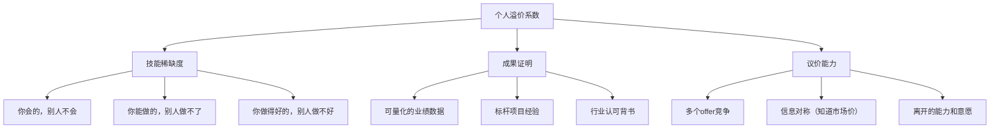
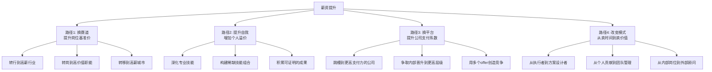

## 4.2 职场收入提升的底层逻辑

> "你的薪水不是由你的努力决定的，而是由你所处的位置和你能撬动的价值决定的。"

上一节我们理解了主动收入的本质——用时间、技能和劳动换取经济回报。但一个关键问题还没有回答：**为什么同样工作8小时，有人月薪5000，有人月薪50000？** 这个10倍的差距到底从何而来？

本节将拆解职场收入的定价机制，让你看清薪资背后的底层逻辑，找到系统性提升收入的杠杆点。

### 4.2.1 薪资定价的底层公式

#### 薪资由什么决定？

很多人以为薪资是"老板定的"或者"HR说了算"。这是一种误解。薪资本质上是一个**市场均衡价格**——由你的价值供给和市场需求共同决定。

薪资的核心公式：

```text
薪资 = 岗位基准价 × 个人溢价系数 × 公司支付系数

其中：
- 岗位基准价 = 行业 × 城市 × 职能（市场给这个岗位的"标价"）
- 个人溢价系数 = 技能稀缺度 × 成果证明 × 议价能力（你比"标准"值多少）
- 公司支付系数 = 公司盈利能力 × 薪酬策略 × 人才竞争强度（公司愿意/能付多少）
```

这三个系数是乘法关系，任何一个为零，薪资就上不去。一个在高薪行业（系数高）但没有差异化的普通员工（溢价系数低），收入可能还不如一个在中等行业但拥有稀缺技能的专家。

#### 三个系数的详细拆解

**系数一：岗位基准价——你站在哪条赛道上**

岗位基准价是市场给特定岗位的"底价"，由三个因素决定：

| 因素 | 影响机制 | 举例 |
|------|---------|------|
| 行业利润水平 | 高利润行业能支付更高薪资 | 金融业应届生起薪是制造业的2-3倍 |
| 城市经济水平 | 一线城市薪资普遍高于二三线 | 同岗位北京薪资比成都高40-80% |
| 职能价值层级 | 离钱越近的岗位薪资越高 | 销售/产品 > 研发 > 职能支持 |

2024年中国主要城市同岗位薪资差异对比：

| 岗位 | 北京 | 上海 | 深圳 | 杭州 | 成都 | 武汉 |
|------|------|------|------|------|------|------|
| Java开发（3年） | 25K | 24K | 23K | 22K | 16K | 14K |
| 产品经理（3年） | 22K | 22K | 20K | 19K | 14K | 12K |
| 市场营销（3年） | 18K | 18K | 16K | 15K | 11K | 10K |
| 行政专员（3年） | 10K | 10K | 9K | 8K | 6K | 5.5K |

> 数据来源：拉勾网、Boss直聘、猎聘等平台2024年Q2薪资报告，取中位数。实际薪资因公司规模和个人能力会有±30%浮动。

从表格可以清楚看到：**选对城市和行业，薪资差距可以达到2倍以上**，而且这不需要你多付出任何额外努力。

**系数二：个人溢价系数——你比"标准"值多少**

在同一个岗位基准价之上，不同人的实际薪资可以相差3-5倍。这个差距来自个人溢价系数，由三个要素构成：



**技能稀缺度**是最核心的溢价来源。经济学中有一个概念叫"租"（Economic Rent）——当你拥有的技能在市场上供不应求时，你可以获得超过"标准价格"的额外报酬，这就是技能租。

技能稀缺度的四个层次：

| 层次 | 描述 | 溢价幅度 | 举例 |
|------|------|---------|------|
| 会做 | 掌握基本技能，能完成标准任务 | 0%（基准价） | 会写CRUD的Java程序员 |
| 做得好 | 技能水平超过多数同行 | +20-50% | 能独立设计高并发系统的架构师 |
| 做得独特 | 拥有稀缺的技能组合 | +50-150% | 懂AI又懂金融的复合型人才 |
| 无可替代 | 行业内极少数能做到的人 | +100-500% | 核心技术专利持有者/行业顶尖专家 |

**成果证明**是把你的能力从"我觉得我很厉害"变成"市场认可我很厉害"的桥梁。没有成果证明的技能，只是自嗨。

最有说服力的成果证明形式：
- **数据化业绩**："负责的项目年营收从500万增长到2000万"——比"负责公司核心项目"有力100倍
- **标杆背书**：曾就职于行业头部公司、服务过知名品牌、获得过行业奖项
- **可验证的作品**：GitHub开源项目、技术博客、公开演讲、专利论文
- **客户/同事推荐**：第三方的评价比自卖自夸可信得多

**系数三：公司支付系数——你所在的平台能/愿付多少**

即使你的个人溢价系数很高，最终拿到手的薪资还取决于公司的支付能力。

| 公司类型 | 支付能力 | 薪酬策略 | 实际影响 |
|---------|---------|---------|---------|
| 外企/大厂 | 强 | 市场领先型，愿意为人才溢价 | 同岗位薪资比市场高30-100% |
| 成长期创业公司 | 中等 | 用股权+现金组合吸引人 | 现金偏低但期权可能有高回报 |
| 传统大型企业 | 中等 | 跟随市场型，按体系调薪 | 薪资稳定但增长缓慢 |
| 中小企业 | 弱 | 成本控制型，能省则省 | 薪资普遍低于市场中位数 |

这个系数经常被忽视，但它解释了一个常见困惑：**为什么我能力不差，但薪资就是上不去？** 答案可能是你所在的公司本身支付能力有限。一条小河里，再大的鱼也长不大。

### 4.2.2 职场收入增长的四种路径

理解了薪资公式后，提升收入的路径就清晰了——你可以改变公式的任何一个系数。



#### 路径一：换赛道——改变你的基准价

这是**效果最明显但成本最高**的路径。换赛道包括三个维度：

**维度1：换行业**

不同行业的薪资天花板差异巨大。但换行业不是盲目追高薪，而是找到你的能力可以迁移的高薪领域。

能力迁移性评估表：

| 你的当前能力 | 可迁移到的高薪行业 | 迁移难度 | 预期薪资提升 |
|------------|------------------|---------|------------|
| 数据分析 | 金融科技、AI/大数据 | 低 | 50-150% |
| 销售能力 | SaaS销售、医疗器械销售 | 低 | 80-200% |
| 内容运营 | 品牌营销、增长黑客 | 低 | 30-80% |
| 项目管理 | 互联网PM、产品经理 | 中 | 30-100% |
| 财务会计 | 投行、私募基金 | 高 | 100-300% |
| 技术开发 | AI/芯片/自动驾驶 | 中 | 50-150% |

**维度2：换职能**

同一个行业内，不同职能的薪资差异也很大。以互联网行业为例：

| 职能 | 3年薪资中位数 | 5年薪资中位数 | 10年薪资中位数 |
|------|-------------|-------------|--------------|
| 算法工程师 | 35K | 50K | 80K+ |
| 产品经理 | 25K | 35K | 50K+ |
| 前端开发 | 22K | 30K | 40K+ |
| 运营 | 15K | 22K | 30K+ |
| 行政 | 8K | 12K | 15K+ |

从行政岗转到产品经理岗，即使行业不变，5年后的薪资差异可以达到3倍。

**维度3：换城市**

一线城市和二三线城市的薪资差距在缩小，但仍然显著。更关键的是，一线城市的高薪岗位密度更高——你遇到好机会的概率更大。

换城市的决策公式：

```text
净收益 = (新城市薪资 - 当前薪资) - (新城市生活成本 - 当前生活成本) - 搬迁成本摊销

只有当净收益 > 0 且未来增长空间明显更大时，换城市才值得
```

需要注意的是，换赛道有时间成本和学习成本。通常需要6-18个月的过渡期，期间收入可能不升反降。要做好心理准备和财务缓冲。

#### 路径二：提升自我——增加你的个人溢价

这是**最可持续但见效最慢**的路径。核心是在当前赛道上，让你的个人溢价系数不断提升。

**策略1：构建T型技能结构**

```text
T型人才模型：

                ← 广度：跨领域知识 →
    ┌─────────────────────────────────────┐
    │  商业思维  沟通表达  数据分析  项目管理 │
    └──────────┬──────────────────────────┘
               │
               │  深度：核心专业技能
               │
               │  ┌─────────────┐
               │  │ 你的核心技能 │
               │  │ 做到前 20%  │
               │  └─────────────┘
               │
```

横向知识让你能跨领域协作、理解商业全局；纵向深度让你在专业领域有不可替代性。两者的交叉点，就是你的溢价所在。

**策略2：构建稀缺技能组合**

单一技能容易被替代，但两种以上技能的组合往往能创造稀缺性。

高溢价技能组合示例：

| 技能组合 | 市场稀缺度 | 适用岗位 | 溢价幅度 |
|---------|-----------|---------|---------|
| 编程 + 金融 | 高 | 量化工程师、金融科技 | +100-200% |
| 设计 + 心理学 | 高 | UX设计总监、用户研究 | +50-100% |
| 销售 + 技术 | 高 | 技术销售、解决方案架构师 | +80-150% |
| 写作 + 行业专业 | 中高 | 行业分析师、内容策略 | +40-80% |
| 数据分析 + 业务理解 | 中高 | 数据产品经理、商业智能 | +50-100% |
| 法律 + 技术 | 极高 | 数据合规、知识产权 | +100-200% |

构建稀缺组合的方法：先在一个领域做到前20%，再叠加一个相关但不同的领域。

**策略3：建立可量化的成果档案**

从今天开始，建立你的"职业账本"——记录你创造的每一个可量化的价值：

```text
职业账本模板：
━━━━━━━━━━━━━━━━━━━━━━━━━━━━━━━
项目名称：[具体项目名]
我的角色：[核心/主导/参与]
量化成果：
  - 营收影响：___万元
  - 成本节约：___万元
  - 效率提升：___%
  - 用户增长：___人
  - 团队规模：___人
关键技能：[用到的核心能力]
获得背书：[领导评价/客户反馈/行业奖项]
━━━━━━━━━━━━━━━━━━━━━━━━━━━━━━━
```

这份档案的价值在于：当你要谈加薪、面试、接私活时，你有**具体的数据**来证明你的价值，而不是空口说"我很努力"。

#### 路径三：换平台——提升公司支付系数

这是**见效最快但不确定性最高**的路径。通过跳槽或内部转岗，进入支付能力更强的平台。

**跳槽涨薪的底层逻辑**

为什么跳槽通常能涨薪30-50%，而内部调薪通常只有5-15%？

| 维度 | 内部调薪 | 跳槽涨薪 |
|------|---------|---------|
| 定价基准 | 你入职时的base + 每年涨幅 | 你当前的市场价值 |
| 信息不对称 | 公司知道你的薪资底线 | 你有多offer可以比较 |
| 谈判地位 | 你已经在船上，换船成本高 | 你是新鲜候选人，竞争驱动溢价 |
| 审批流程 | HR有严格的调薪比例限制 | 招聘预算和调薪预算是两套体系 |
| 沉没成本 | 公司认为你不太可能走 | 新公司认为不给够你就不来 |

简单说：**内部调薪是"补偿逻辑"（你做得好，补你一点），跳槽涨薪是"竞争逻辑"（不给够你就去对手那了）**。

但跳槽也有隐性成本需要计算：

```text
跳槽真实收益 = 新薪资 - 旧薪资 - 以下隐性成本：

1. 风险成本：试用期不过的概率 × 失业期间的生活成本
2. 社交成本：重新建立人脉和信任关系的时间
3. 晋升成本：在原公司可能很快升职，在新公司要重新证明自己
4. 适应成本：新环境的学习曲线（通常3-6个月）
5. 福利差异：股票归属损失、年假重算、社保断缴等
```

**内部晋升的策略**

如果你不想跳槽，在现有公司内提升薪资的关键是**让你的价值被看见**。

向上管理的核心原则：

1. **定期汇报成果**：不是等年终总结才说，而是每月/每季度主动向上级同步你的进展和成果。用数据说话，不讲故事。
2. **主动承接高可见度项目**：那些跨部门的、有高管关注的项目，即使辛苦，也是你展示价值的最佳舞台。
3. **管理上级的预期**：提前沟通你的目标和计划，让上级觉得你的晋升是"水到渠成"而不是"突然要求"。
4. **成为不可替代的人**：掌握关键业务知识、维护关键客户关系、负责核心系统——让公司觉得失去你的代价很高。

#### 路径四：改变模式——从卖时间到卖价值

这是**上限最高但转型最难**的路径。核心是改变你的收入定价逻辑。

四种定价模式的对比：

| 定价模式 | 收入公式 | 天花板 | 适用阶段 |
|---------|---------|-------|---------|
| 按时间定价 | 时薪 × 工时 | 24小时/天 | 初级 |
| 按产出定价 | 单价 × 产出量 | 体力/精力上限 | 中级 |
| 按价值定价 | 客户收益 × 分成比例 | 客户的收益上限 | 高级 |
| 按影响力定价 | 影响力范围 × 转化率 × 客单价 | 几乎无上限 | 顶级 |

从按时间定价到按价值定价的转变，是职场收入提升的最大杠杆。

具体操作方式：
- **在公司内部**：从"完成分配的任务"转向"主动发现并解决业务问题"。当你能说"我发现了一个问题，这是我的解决方案，预计能带来XX万的收益"，你的定价逻辑就变了。
- **在外部市场**：从"接外包按小时收费"转向"按项目价值收费"。一个网站重构项目，按小时收可能是2万，按"帮客户提升30%转化率"来收可能是10万。

### 4.2.3 行业选择的底层逻辑

#### 行业薪资差异的根本原因

为什么金融行业的薪资普遍高于制造业？这不是因为金融从业者更聪明或更努力，而是由行业的**经济结构**决定的。

```text
行业薪资天花板 = 人均创收 × 利润率 × 人才杠杆效应

其中：
- 人均创收：每个员工平均创造多少营收
- 利润率：营收中有多少是利润（可分配给员工的部分）
- 人才杠杆效应：优秀人才和普通人才的产出差距有多大
```

用这个公式解释几个现象：

| 行业 | 人均创收 | 利润率 | 人才杠杆 | 薪资天花板 |
|------|---------|-------|---------|-----------|
| 金融 | 极高（管理大量资金） | 高（20-40%） | 高（好的交易员 vs 差的差距巨大） | 极高 |
| 互联网 | 高（边际成本极低） | 中高（15-30%） | 高（好的工程师 vs 差的10倍差距） | 高 |
| 制造业 | 中低 | 低（5-10%） | 中（自动化降低个人差异） | 中低 |
| 餐饮 | 低 | 低（3-8%） | 低（标准化程度高） | 低 |

**关键洞察**：人才杠杆效应高的行业，愿意为顶尖人才支付极高薪资，因为一个人的产出差距可以是10倍甚至100倍。而在标准化程度高的行业，个人差异小，薪资也更平均。

#### 新兴行业 vs 成熟行业的选择策略

| 维度 | 新兴行业（如AI、新能源） | 成熟行业（如银行、制造） |
|------|----------------------|----------------------|
| 薪资增长速度 | 快（供不应求，抢人） | 慢（供给充足，按体系调薪） |
| 薪资波动性 | 高（行业周期影响大） | 低（相对稳定） |
| 技能折旧速度 | 快（技术迭代快） | 慢（知识体系稳定） |
| 职业天花板 | 高（行业在扩张） | 中（行业成熟，位置有限） |
| 失败风险 | 高（行业可能洗牌） | 低（行业已稳定） |

新兴行业的最佳进入时机是**成长早期**——行业已经被验证可行，但人才供给还没跟上。太早（萌芽期）风险太大，太晚（成熟期）红利已过。

判断一个行业是否处于成长早期的信号：
- 头部公司已完成B轮以上融资，商业模式被验证
- 行业招聘需求年增长超过50%
- 大厂开始设立相关部门（说明市场已被认可）
- 但猎头和培训班还没大量涌入（说明人才供给还没跟上）

#### 行业内细分赛道的选择

即使在同一个行业，不同细分赛道的薪资差异也很大。选择细分赛道时考虑以下因素：

| 因素 | 高薪资信号 | 低薪资信号 |
|------|----------|----------|
| 离钱的距离 | 直接创造营收（销售、产品） | 间接支持（行政、运维） |
| 技术壁垒 | 需要长时间学习和积累 | 入门门槛低，培训即可上岗 |
| 规模效应 | 一个人的产出可以服务大量客户 | 一对一服务，产出有上限 |
| 稀缺性 | 全行业人才供给不足 | 人才供给过剩 |
| 增长趋势 | 市场需求快速增长 | 市场需求平稳或萎缩 |

### 4.2.4 职场收入增长的非线性规律

#### 收入增长不是匀速的

很多人的职业规划假设收入是线性增长的——每年涨10%，20年后自然高薪。但现实是，职场收入增长呈**阶梯型**：


**平稳期**做积累：深耕技能、积累成果、建立人脉、观察市场。
**跃升期**做突破：谈加薪、跳槽、晋升、转行。

很多人的错误是：在平稳期焦虑地频繁跳槽（没有积累到足够的溢价资本），或者在跃升期到来时没有准备好（简历空洞、没有可量化的成果）。

#### 收入增长的四个阶段

| 阶段 | 年龄参考 | 收入特征 | 核心策略 | 典型收入范围（一线城市） |
|------|---------|---------|---------|---------------------|
| 积累期 | 22-28岁 | 低但增速快（年增20-50%） | 快速学习，多试错，找到方向 | 8K-20K/月 |
| 成长期 | 28-35岁 | 中等且稳定增长（年增15-30%） | 深耕专业，建立成果档案 | 20K-50K/月 |
| 突破期 | 35-42岁 | 跃升式增长（跳槽/创业/管理） | 换模式，从执行到决策 | 50K-100K+/月 |
| 收获期 | 42岁+ | 高位稳定或持续增长 | 品牌变现，影响力变现 | 100K+/月或按项目计价 |

每个阶段的核心任务不同，用错策略是最大的浪费：

- 积累期去做副业赚小钱，不如全力提升核心技能
- 成长期追求稳定安逸，可能错过最佳的跃升窗口
- 突破期还在靠加班证明努力，说明没有完成模式转换

#### 35岁现象的本质

"35岁危机"的本质不是年龄歧视，而是**性价比危机**：

```text
35岁危机的本质：

企业视角：
  一个35岁员工的薪资 = 2个25岁员工的薪资
  但如果35岁员工的工作产出 = 只有1.5个25岁员工

  → 从纯性价比角度看，雇年轻人更划算

破解方法：
  让你的产出远超2个年轻人
  → 管理能力（1个管理者 > 5个执行者）
  → 经验判断力（快速决策避免试错成本）
  → 人脉资源（带来业务和机会）
  → 行业深度（新人无法短期获得的认知）
```

35岁以后还能持续增值的人，通常完成了以下转型中的至少一个：
- 从执行者变为管理者
- 从技术专家变为行业顾问
- 从内部员工变为外部资源
- 从个人贡献者变为团队赋能者

### 4.2.5 市场价值的评估方法

#### 如何知道自己的真实市场价值

很多人对自己的市场价值有错误认知——要么低估（不敢谈薪），要么高估（面试碰壁）。以下是四种客观评估方法：

**方法一：招聘平台数据法**

在Boss直聘、拉勾、猎聘等平台搜索与你相同岗位、相同经验、相同城市的职位，记录薪资范围。取中位数作为你的基准市场价值。

```text
操作步骤：
1. 搜索你的目标岗位（不是当前岗位，是你觉得合理的岗位）
2. 筛选：相同城市 + 相同经验年限 + 相同行业
3. 记录前20个结果的薪资范围
4. 排除最高和最低各2个
5. 取剩余16个的中位数 → 这就是你的市场基准价

修正因素：
- 大厂/外企：基准价 × 1.3-1.5
- 中小企业：基准价 × 0.7-0.9
- 有稀缺技能组合：基准价 × 1.2-1.5
- 简历/面试能力弱：基准价 × 0.8-0.9
```

**方法二：猎头报价法**

主动联系3-5个猎头，告诉他们你的背景和期望，让他们给你一个市场评估。猎头的报价通常比较准确，因为他们每天都在做薪资匹配。

注意事项：
- 不要只联系一个猎头，不同猎头专注的细分市场不同
- 猎头可能为了促成交易而略微高估你的价值——打个8折更现实
- 通过猎头了解哪些公司在招人、薪资范围是多少，这些信息本身就有价值

**方法三：面试测试法**

定期（每1-2年）参加面试，即使你没有跳槽打算。面试是最好的市场价值测试——你能拿到多少offer、offer的薪资是多少，就是市场给你的定价。

```text
面试测试法的操作要点：
1. 选择3-5家目标公司，涵盖不同类型（大厂、中厂、创业公司）
2. 认真准备，不要因为"只是测试"就敷衍
3. 记录每一家给你的反馈和薪资范围
4. 如果多数offer低于你的预期 → 你的自我评估偏高
5. 如果多数offer高于你当前薪资 → 你被低估了，该谈谈了
6. 如果所有公司都抢着要你 → 你严重被低估，立刻行动
```

**方法四：收入对标法**

找到和你背景相似（学历、工龄、行业、城市）但薪资明显更高的人，分析差距在哪里。差距就是你的提升空间。

差距通常来自以下几个维度：

| 差距维度 | 你的可能状态 | 对标者的状态 | 提升难度 |
|---------|------------|------------|---------|
| 行业选择 | 传统行业 | 新兴行业 | 高（需转行） |
| 公司平台 | 中小企业 | 头部大厂 | 中（需跳槽） |
| 技能深度 | 通用技能 | 稀缺专业技能 | 中（需学习） |
| 管理经验 | 纯技术/执行 | 带团队经验 | 中（需争取机会） |
| 成果证明 | 模糊描述 | 量化数据+案例 | 低（需记录和包装） |
| 人脉资源 | 弱 | 强行业人脉 | 中（需时间积累） |
| 议价能力 | 不谈判就接受 | 多offer比较 | 低（需策略调整） |

### 4.2.6 实操工具：薪资提升行动清单

#### 第一步：诊断现状（本周完成）

```text
□ 计算你的真实时薪 = 月收入 ÷ (实际工作时间+通勤+加班)
□ 用招聘平台数据法评估你的市场基准价
□ 列出你当前的三个核心技能，评估稀缺度（1-10分）
□ 列出你的3个最大职业成就，尝试数据化描述
□ 评估你所在公司的薪资竞争力（行业中位数的多少倍）
```

#### 第二步：制定策略（两周内完成）

```text
□ 确定你的主攻路径（换赛道/提升自我/换平台/改模式）
□ 设定12个月后的目标薪资（建议比当前高30-50%）
□ 列出达成目标需要的3个关键行动
□ 制定学习计划（需要学什么技能，用多长时间）
□ 更新简历和LinkedIn/脉脉等职业社交平台
```

#### 第三步：执行突破（1-6个月）

```text
□ 开始记录你的"职业账本"——每个项目的量化成果
□ 投入时间学习稀缺技能（每天至少1小时）
□ 主动争取1-2个高可见度项目
□ 定期与上级沟通你的成长和贡献
□ 参加面试测试（每季度1-2次）
□ 当积累足够时，发起薪资谈判或跳槽行动
```

#### 常见问题解答

**Q：我在一家公司待了3年没涨薪，正常吗？**

不正常。如果3年没有薪资增长，只有两种可能：(1) 你的市场价值确实没有增长——说明你没有在学习新技能或创造新价值；(2) 你的公司没有按市场调整薪资——说明你被低估了。无论哪种情况，都需要立刻行动。

**Q：跳槽太频繁会不会不好？**

行业标准是每2-3年跳一次。过于频繁（每半年一次）确实会让雇主担忧你的稳定性。但如果你每次跳槽都有明确的理由（更大的职责、更高的薪资、更好的成长空间），且能自圆其说，频繁跳槽的负面影响远小于长期不涨薪的损失。

**Q：涨薪谈判被拒怎么办？**

被拒不代表失败，而是获得了一个信息：**你目前在这家公司里的价值天花板**。你需要做的是：
1. 问清楚被拒的具体原因（是公司政策还是你个人表现）
2. 问清楚需要达到什么条件才能涨薪
3. 如果条件合理，制定计划去达成
4. 如果条件不合理或公司就是不涨，开始看外部机会

**Q：应该追求高base还是高奖金/期权？**

这取决于你的风险承受能力和职业阶段：

| 收入形式 | 适合谁 | 风险 | 建议占比 |
|---------|-------|------|---------|
| 高base（高底薪） | 有房贷/家庭负担的人 | 低 | 初期>70% |
| 高奖金/提成 | 销售、业务岗、能力强的人 | 中 | 可达40-50% |
| 期权/股权 | 愿意赌公司未来的人 | 高 | 不超过总包30% |

对于大多数人，**优先确保高base**，因为base是确定性收入，奖金和期权有太多不可控因素。

### 4.2.7 本节小结

职场收入提升的底层逻辑可以浓缩为三个核心认知：

1. **薪资是市场定价，不是老板恩赐**。理解薪资公式（岗位基准价 × 个人溢价 × 公司支付系数），你就知道该在哪里发力。
2. **收入增长是阶梯型的，不是线性的**。平稳期做积累，跃升期做突破。在错误的阶段做错误的事，是最大的职业浪费。
3. **最高杠杆的行动往往不是"更努力"，而是"选对位置"**。选对行业、选对公司、选对职能、选对定价模式——战略选择的回报远大于战术努力。

> 下一节我们将深入分析副业的经济学——当你在职场的薪资已经阶段性到顶时，如何通过副业开辟第二增长曲线。
