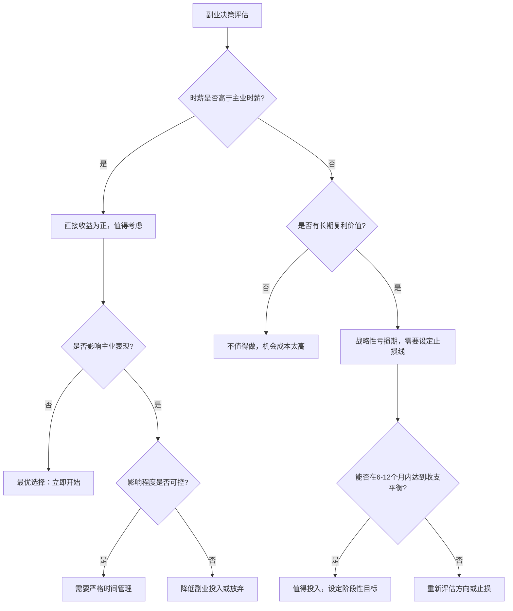
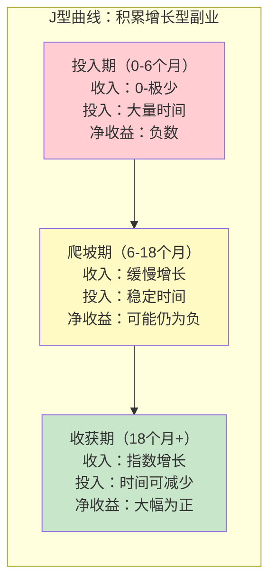

## 4.3 副业的经济学分析

> "不是所有副业都值得做。只有那些边际收益大于边际成本、且能产生复利效应的副业，才值得投入你最稀缺的资源——时间。"

上一节我们拆解了职场收入的定价机制和提升路径。但对大多数人来说，仅靠主业收入存在两个结构性瓶颈：一是时间有上限（一天只有24小时），二是定价权不在自己手里（老板决定你的薪资）。副业，本质上是对这两个瓶颈的突破尝试。

但"做副业"这个建议太笼统了。盲目开始一个副业，可能让你投入大量时间却只赚到杯水车薪，甚至拖累主业。本节将用经济学框架分析副业的决策逻辑、收益结构和最优策略，帮你做出理性而非冲动的选择。

### 4.3.1 副业决策的经济学框架

#### 副业的本质：时间的再投资

从经济学角度看，做副业是一个**投资决策**——你把有限的时间（你的核心资源）从"休闲/休息"或"主业深耕"中抽出来，投入到一个新的收入来源中。和所有投资决策一样，它需要回答三个问题：

1. **预期收益率是多少？**（能赚多少钱）
2. **风险有多大？**（失败的概率和损失）
3. **机会成本是什么？**（同样的时间用来做别的事，收益如何）

大多数人在做副业决策时只看到了第一个问题的答案（"这个副业能赚钱"），却忽略了后两个。结果就是：投入大量时间做了一个时薪远低于主业的副业，还自以为在"多线赚钱"。

#### 机会成本：副业决策的核心概念

**机会成本**是做副业时最需要理解的经济学概念。它的定义是：你选择做A所放弃的B的最大价值。

```text
副业的真实收益 = 副业直接收入 - 机会成本

其中机会成本 = MAX(
    同等时间用于主业加班/学习的预期收入增长,
    同等时间用于休息恢复的长期健康价值,
    同等时间用于陪伴家人的关系价值
)
```

举个具体例子：

| 场景 | 副业时薪 | 主业时薪 | 机会成本 | 真实收益 |
|------|---------|---------|---------|---------|
| 程序员周末接外包 | 80元/小时 | 150元/小时 | 150元/小时 | -70元/小时 |
| 设计师晚间做自媒体 | 20元/小时（初期） | 100元/小时 | 100元/小时 | -80元/小时（初期） |
| 教师寒暑假做家教 | 200元/小时 | 60元/小时 | 60元/小时 | +140元/小时 |

第一个场景中，程序员周末接外包看似有收入，但考虑到他的主业时薪是150元，同样的时间用来提升技术能力（争取加薪/跳槽）可能带来更高的长期收益。外包的实际时薪低于主业时薪，这是一个**负收益**的副业决策。

第三个场景中，教师在寒暑假做家教——寒暑假主业收入为零（带薪休假但没有增量工作可做），机会成本很低，此时家教的200元/小时几乎是"纯收益"。

**关键原则：只有当副业的时薪明显高于主业时薪（至少1.5倍以上），或者副业具有主业无法提供的长期价值（技能积累、人脉拓展、被动收入潜力）时，从经济角度看才值得做。**

#### 比较优势理论在副业选择中的应用

大卫·李嘉图的**比较优势理论**告诉我们：即使你在所有事情上都比别人强，你也不应该什么都自己做——你应该专注于你相对优势最大的领域，把其他事情交给别人。

这个理论对副业选择的启示是：

```text
你应该选择的副业 ≠ 你能做的最赚钱的事
你应该选择的副业 = 你的时间成本最低 + 市场愿意付费最高 的交集

具体来说：
- 你的绝对优势：你擅长什么（技能水平）
- 你的比较优势：你擅长什么相对于其他可选活动（机会成本最低）
- 市场需求：什么有人愿意付钱

最佳副业 = 比较优势 ∩ 市场需求
```

举例说明：一位年收入50万的产品经理，技术能力可以达到中等开发水平。如果他选择副业做外包开发，虽然"能做"，但他做开发的机会成本（50万/年 ÷ 2000小时 = 250元/小时）远高于普通外包开发的市场价（80-120元/小时）。他的比较优势在于产品咨询或商业分析，这些领域的副业时薪可以达到500-1000元/小时。

#### 副业决策矩阵

综合以上分析，可以用一个决策矩阵来评估一个副业是否值得做：



### 4.3.2 副业的经济学分类与收益模型

#### 按收益结构分类

不同副业的收益结构差异巨大，这直接决定了它们的经济学特征和适合的人群。从经济学角度，副业可以按收益曲线分为四种模型：

| 模型 | 收入特征 | 典型副业 | 时薪曲线 | 风险等级 | 适合人群 |
|------|---------|---------|---------|---------|---------|
| 即时变现型 | 做一次赚一次 | 接单外包、家教、代驾 | 平坦或缓慢上升 | 低 | 需要短期现金流的人 |
| 积累增长型 | 前期低后期高 | 自媒体、知识付费、开源项目 | 先低后高的指数曲线 | 中 | 有耐心、看重长期回报的人 |
| 规模复制型 | 一次投入多次收益 | 课程、电子书、SaaS工具 | 阶梯式跃升 | 中高 | 有产品化能力的人 |
| 杠杆撬动型 | 用他人时间赚钱 | 中介、联盟、团队外包 | 平台期后跃升 | 高 | 有资源和管理能力的人 |

**即时变现型副业的经济学分析**

即时变现型副业的核心逻辑是**用时间直接换钱**，和主业的收入模式完全相同。它的优势是确定性高、启动成本低；劣势是没有杠杆效应，收入和时间严格线性相关。

```text
即时变现型副业的收入公式：
月收入 = 时薪 × 可投入小时数 × 转化效率

其中：
- 时薪由市场供需决定（你的技能稀缺度 × 客户支付意愿）
- 可投入小时数有刚性上限（扣除主业、休息、生活后的时间）
- 转化效率 = 有效工作时间 / 总投入时间（含找客户、沟通、修改等）
```

关键数据：一个全职工作者，扣除通勤、休息、生活后，每周可用于副业的时间大约在10-20小时。假设副业时薪100元，转化效率60%（大量时间花在找客户和沟通上），月收入约为：

```text
100元 × 15小时/周 × 4周 × 60% = 3,600元/月
```

这个数字看起来不错，但要注意几个隐性成本：
- 社保公积金：如果副业收入需要自行缴纳，每月额外支出1000-3000元
- 设备工具：电脑、软件订阅、交通等
- 税务成本：劳务报酬所得税率20-40%
- 健康成本：长期加班对身体和精神的损耗

扣除这些后，实际到手可能只有2000-2500元/月。这就是为什么很多人的副业做了半年就放弃了——看起来有收入，但算上隐性成本和机会成本，实际上是亏损的。

**积累增长型副业的经济学分析**

积累增长型副业的核心特征是**前期投入时间但没有收入，后期收入随积累增长**。典型的例子是自媒体（公众号、B站、抖音）和知识付费。

这类副业的经济学模型可以用**J型曲线**来描述：



这类副业的关键经济学指标是**盈亏平衡点**——需要多少时间/内容/粉丝才能达到收支平衡。

| 副业类型 | 典型盈亏平衡点 | 盈亏平衡时间 | 月均投入时间 | 达到盈亏平衡的总投入 |
|---------|-------------|------------|------------|----------------|
| 公众号自媒体 | 1万粉丝 | 6-12个月 | 30-50小时 | 200-600小时 |
| B站UP主 | 5000粉丝 | 8-18个月 | 40-80小时 | 400-1400小时 |
| 知识星球 | 200付费用户 | 3-6个月 | 20-40小时 | 60-240小时 |
| 小红书博主 | 5000粉丝 | 3-8个月 | 20-40小时 | 60-320小时 |
| 抖音短视频 | 1万粉丝 | 2-6个月 | 30-60小时 | 60-360小时 |

以时薪100元计算，投入200-1400小时的"学费"相当于2万-14万元的机会成本。这就是为什么积累增长型副业**只适合以下人群**：
1. 主业收入稳定，不需要副业立即变现
2. 有明确的内容/技能定位，不是盲目试水
3. 能够承受6-12个月没有收入的心理压力
4. 对该领域有真正的热情和专业知识

**规模复制型副业的经济学分析**

规模复制型副业的核心特征是**一次投入，多次收益**。你花时间创建一个产品（课程、电子书、工具），然后它可以被反复销售，每多卖一份的边际成本几乎为零。

这是经济学中典型的**边际成本递减**模型：

```text
规模复制型副业的收入公式：
总收入 = 单价 × 销量 - 固定成本（创建成本）

其中：
- 固定成本 = 创建产品的时间 × 时薪 + 工具/平台费用
- 边际成本 ≈ 0（每多卖一份几乎不增加成本）
- 销量取决于：产品质量 × 推广渠道 × 目标市场规模

盈亏平衡销量 = 固定成本 / 单价
```

举例：你花100小时创建一门在线课程，你的机会成本为100元/小时，平台费用500元，课程定价299元：

```text
固定成本 = 100 × 100 + 500 = 10,500元
盈亏平衡销量 = 10,500 / 299 ≈ 35份
```

卖出35份后，每多卖一份就是299元的纯利润。如果课程质量好，持续推广，一年卖出500份是有可能的，年收入约15万元，而后续每年的维护时间可能只需要20-30小时。

**这就是副业的"杠杆效应"——用有限的时间投入撬动无限的收入可能。**

但规模复制型副业有一个容易被忽略的经济学问题：**创建成本的风险**。如果产品创建出来后卖不出去，你投入的所有时间就全部沉没了。这和即时变现型副业（做一次赚一次）形成了鲜明对比。

| 维度 | 即时变现型 | 规模复制型 |
|------|----------|----------|
| 风险分布 | 每次投入都有回报 | 前期投入全部沉没，后期才有回报 |
| 最大损失 | 小（每次投入都小） | 大（一次性投入大） |
| 收入上限 | 低（受时间限制） | 高（不受时间限制） |
| 适合策略 | 用主业验证市场需求 | 先在即时变现型中验证再产品化 |

### 4.3.3 副业的时间经济学

#### 时间分配的最优化问题

对全职工作者来说，副业面临的核心约束是**时间有限**。这本质上是一个资源分配的最优化问题：

```text
约束条件：
- 总可用时间 T = 24小时/天 - 睡眠(7-8小时) - 主业(9-10小时) - 通勤(1-2小时) - 生活必需(2-3小时) = 2-4小时/天
- 周末可用时间 W = 约8-10小时/天

目标函数：
最大化 总效用 = 经济收入 + 技能积累 + 个人满足感 + 健康维持

约束：
1. 睡眠时间 ≥ 7小时（硬约束，违反会严重影响健康和效率）
2. 主业投入时间 ≥ 标准要求（不能因副业影响主业）
3. 每周副业时间 ≤ 20小时（超过这个阈值，边际效率急剧下降）
```

研究表明，**每周投入10-15小时在副业上是最优的**。低于10小时，积累速度太慢，很难达到突破点；超过15小时，疲劳会导致效率下降，且主业和健康会受到明显影响。

#### 边际效用递减规律

经济学中的**边际效用递减规律**在副业时间分配中表现得非常明显：

| 每日副业时间 | 第1小时效率 | 第2小时效率 | 第3小时效率 | 第4小时效率 | 综合产出 |
|------------|-----------|-----------|-----------|-----------|---------|
| 1小时/天 | 100% | - | - | - | 100% |
| 2小时/天 | 100% | 85% | - | - | 185% |
| 3小时/天 | 100% | 85% | 65% | - | 250% |
| 4小时/天 | 100% | 85% | 65% | 40% | 290% |

从1小时增加到2小时，产出增加了85%（几乎翻倍）。从2小时增加到3小时，产出只增加了65%。从3小时增加到4小时，产出只增加了40%，但你多付出了一小时的时间和精力。

**最优投入点**是当副业的**边际收益 = 边际成本**的时候。对大多数人来说，这意味着每天2-3小时、每周5天是最优的副业投入节奏。

#### 时间质量 vs 时间数量

副业的产出不仅取决于投入的时间数量，更取决于时间质量。以下是不同时间段做副业的效率对比：

| 时间段 | 精力水平 | 干扰程度 | 适合的副业类型 | 效率系数 |
|-------|---------|---------|-------------|---------|
| 早起（5:00-7:00） | 高（头脑清醒） | 极低 | 创意型（写作、设计、编程） | 1.5x |
| 午休（12:00-13:00） | 中 | 中 | 轻量型（回复客户、社交媒体） | 0.8x |
| 晚间（20:00-22:00） | 中低（一天工作后） | 中 | 执行型（剪辑、整理、排版） | 0.7x |
| 周末白天 | 高 | 中高（社交、家庭） | 深度型（课程录制、大项目） | 1.2x |
| 通勤路上 | 低 | 高 | 学习型（听播客、看资料） | 0.5x |

**最佳策略**：把高精力时段分配给需要深度思考的创意型工作，把低精力时段分配给机械性的执行型工作。早起2小时做副业的产出，可能等于晚间4小时的产出。

### 4.3.4 副业的风险经济学

#### 风险的量化分析

做副业不是零风险的。以下是从经济学角度需要量化的主要风险：

**风险一：主业受损风险**

这是副业最大的隐性风险。如果副业影响了主业表现，导致加薪机会丧失、晋升受阻甚至被辞退，损失可能远超副业收入。

```text
主业受损的期望损失 = P(影响主业) × 影响程度

影响程度量化：
- 失去一次加薪机会（年薪增加2万）→ 损失2万/年
- 失去晋升机会（年薪增加5-10万）→ 损失5-10万/年
- 因绩效下降被辞退（3-6个月失业）→ 损失5-15万

P(影响主业)的估计：
- 每周投入≤10小时，且不影响休息 → 5-10%
- 每周投入10-20小时 → 20-40%
- 每周投入>20小时 → 50-70%
```

举例：一位年薪30万的产品经理，每周投入20小时做副业（月收入5000元），有30%概率影响到一次晋升机会（年薪增加8万）。期望损失 = 30% × 8万 = 2.4万/年。副业年收入 = 5000 × 12 = 6万。看似副业净赚3.6万，但如果再考虑疲劳导致的健康成本和主业效率下降，实际净收益可能只有1-2万。

**风险二：沉没成本陷阱**

积累增长型和规模复制型副业的沉没成本风险特别高。当副业投入了大量时间但没有起色时，人很容易因为"已经投入了这么多"而不愿放弃，继续投入更多时间，这就是**沉没成本谬误**。

```text
正确的止损决策框架：

不管过去投入了多少时间和金钱，只看未来：
- 继续投入的预期收益 > 继续投入的预期成本 → 继续
- 继续投入的预期收益 < 继续投入的预期成本 → 止损

具体操作：设定阶段性里程碑
- 3个月：验证方向可行性（有正反馈信号）
- 6个月：达到初级盈利（至少覆盖机会成本的50%）
- 12个月：达到盈亏平衡（覆盖全部机会成本）
- 18个月：实现规模化盈利

任何一个里程碑未达标，就认真评估是否需要调整方向或止损。
```

**风险三：法律与合规风险**

不同副业面临的法律风险差异很大：

| 风险类型 | 涉及副业 | 后果严重程度 | 防范措施 |
|---------|---------|-----------|---------|
| 竞业限制 | 与主业同行业的副业 | 高（可能被起诉） | 仔细阅读劳动合同中的竞业条款 |
| 知识产权 | 使用主业成果做副业 | 高（可能被追责） | 确保副业内容完全独立创作 |
| 税务合规 | 所有有收入的副业 | 中（补税+罚款） | 如实申报，保留收支凭证 |
| 资质许可 | 医疗、法律、金融类副业 | 高（可能违法） | 确认是否需要执业资质 |
| 劳动合同 | 全职员工做副业 | 中（可能被辞退） | 了解公司对副业的政策 |

**风险四：身心健康风险**

这是最容易被低估的风险。长期在主业和副业之间连轴转，会导致：

```text
健康成本的量化估算：

睡眠不足（<7小时/天持续3个月以上）：
- 免疫力下降 → 每年多生病2-3次 → 医疗费用+误工损失 ≈ 3000-5000元
- 认知能力下降 → 主业效率降低10-20% → 间接收入损失
- 慢性疲劳 → 需要更长的恢复时间 → 可能需要请假/休假

心理压力：
- 焦虑和抑郁风险增加 → 可能需要心理咨询（200-500元/次）
- 人际关系质量下降 → 隐性社交成本
- 决策质量下降 → 可能做出错误的职业/财务决策
```

#### 风险分散策略

和投资理财一样，副业也需要分散风险：

1. **主业+副业的行业分散**：副业尽量选择和主业不同的领域，避免行业同时下行的风险。
2. **即时变现+长期积累的组合**：用即时变现型副业保证短期现金流，用积累增长型副业追求长期回报。
3. **线上+线下的渠道分散**：不要只依赖一个平台或渠道，平台政策变化可能让你的副业一夜归零。
4. **个人+团队的能力分散**：当副业做大后，逐步引入合作伙伴或外包，降低对个人时间的依赖。

### 4.3.5 副业的税务经济学

#### 中国副业收入的税务框架

很多副业从业者忽略了税务问题，这是一个重大疏忽。不同类型的副业收入适用不同的税率和申报方式：

| 收入类型 | 税目 | 税率 | 起征点 | 申报方式 |
|---------|------|------|-------|---------|
| 劳务报酬 | 劳务报酬所得 | 20-40% | 800元/次 | 支付方代扣代缴 |
| 稿酬 | 稿酬所得 | 实际11.2%（优惠税率） | 800元/次 | 支付方代扣代缴 |
| 个体经营 | 经营所得 | 5-35% | 6万/年 | 自行申报 |
| 平台收入 | 看具体性质 | 不同情况不同 | - | 平台代扣或自行申报 |

**劳务报酬 vs 经营所得的选择**

如果你的副业收入较高（月入5000元以上），需要认真考虑收入性质的税务优化：

```text
场景对比：年副业收入12万元

方案A：按劳务报酬缴税
- 每次收入预扣：(收入-800) × 20% 或 收入 × (1-20%) × 20%
- 年终汇算清缴：并入综合所得，适用3-45%累进税率
- 如果主业年收入30万，副业12万，合计42万
- 42万对应税率25%，应纳税额较高

方案B：注册个体工商户，按经营所得缴税
- 年收入12万，扣除成本费用后（假设60%的成本率）
- 应纳税所得额 = 12万 × (1-60%) = 4.8万
- 适用税率10%，应纳税 = 4.8万 × 10% - 1500 = 3300元
- 相比劳务报酬可能节省数千元

方案C：利用小规模纳税人优惠
- 月销售额10万以下免征增值税
- 年收入12万基本可以免税
- 经营所得税率也较低
```

**重要提示**：税务优化必须在合法合规的前提下进行。建议年副业收入超过10万元后，咨询专业会计师，制定合理的税务规划。

#### 发票与凭证管理

副业收入需要保留完整的收支凭证：

1. **收入凭证**：合同、收款记录、发票
2. **支出凭证**：设备购买、软件订阅、交通费用、材料成本
3. **记账习惯**：每月整理一次，使用记账工具（如随手记、MoneyWiz）

保留凭证不仅是税务合规的要求，也能帮你准确计算副业的真实利润率。

### 4.3.6 副业的长期经济学：复利与转型

#### 副业的复利效应

最有价值的副业不是赚最多钱的，而是能产生**复利效应**的。复利效应体现在三个层面：

**层面一：技能复利**

```text
技能复利的公式：
副业技能价值 = 初始技能水平 × (1 + 技能增长率)^时间

举例：写作能力
- 初始水平：能写普通文章（市场价500元/篇）
- 年增长率：30%（通过副业实践持续提升）
- 3年后：500 × (1.3)^3 = 1098元/篇
- 5年后：500 × (1.3)^5 = 1857元/篇
- 10年后：500 × (1.3)^10 = 6888元/篇

同样的时间投入，10年后的时薪是初始时的13倍。
```

**层面二：人脉复利**

副业中积累的客户、合作伙伴、行业人脉，会随着时间推移产生越来越多的价值。一个客户可能带来转介绍，一个合作伙伴可能带来新项目，一个行业人脉可能带来跳槽机会。

```text
人脉复利的特征：
- 前期增长缓慢（需要时间建立信任）
- 中期网络效应显现（人脉介绍人脉）
- 后期形成壁垒（行业口碑和信任网络难以复制）

量化指标：
- 第1年：累计客户/人脉 10-30人
- 第3年：累计客户/人脉 50-150人
- 第5年：累计客户/人脉 200-500人（其中活跃推荐人20-50人）
```

**层面三：品牌复利**

持续在某个领域输出内容和作品，会逐步建立个人品牌。品牌的价值在于**降低信任成本**——客户因为认识你、信任你而主动找上门，你不需要花时间推销自己。

```text
品牌复利的经济价值：
- 获客成本下降：从主动找客户变为客户主动找你
- 议价能力提升：品牌溢价10-50%
- 转介绍率提升：老客户带来新客户，获客成本趋近于零
- 机会密度增加：好的合作机会主动找上门
```

#### 从副业到主业的转型决策

当副业收入持续超过主业收入时，很多人会面临一个重要决策：是否把副业变成主业？

这个决策需要经济学框架来分析：

```text
转型决策公式：
转型期望值 = P(成功) × 成功后的收入 - P(失败) × 失败后的损失

其中：
P(成功)的估计因素：
- 副业已经稳定盈利超过6个月 → +20%
- 副业收入是主业的2倍以上 → +20%
- 有6个月以上的财务储备 → +15%
- 副业有明确的增长路径 → +15%
- 家人支持 → +10%
- 行业/市场趋势向好 → +10%

P(失败)的估计因素：
- 副业收入波动大 → +20%
- 依赖单一客户或平台 → +20%
- 没有财务储备 → +15%
- 副业已触及增长天花板 → +15%
```

**安全转型的四个条件**：

1. **收入条件**：副业月收入 ≥ 主业月收入 × 2（留出安全边际）
2. **时间条件**：副业稳定盈利持续 ≥ 6个月（排除运气因素）
3. **储备条件**：银行存款 ≥ 12个月生活费（应对转型期不确定性）
4. **增长条件**：副业有清晰的、未触达的增长天花板

满足全部四个条件再考虑转型。满足前三个是最低门槛。

### 4.3.7 不同人群的副业策略

#### 按职业阶段分

| 阶段 | 年龄参考 | 副业策略 | 推荐副业类型 | 时间投入建议 |
|------|---------|---------|-------------|------------|
| 职场新人 | 22-26岁 | 以学习为主，副业为辅 | 技能变现型（接单练手） | 每周5-8小时 |
| 职场中期 | 26-35岁 | 主副并行，双线发展 | 积累增长型（自媒体/知识付费） | 每周10-15小时 |
| 职场成熟期 | 35-45岁 | 副业可能超越主业 | 规模复制型（课程/产品） | 灵活调整 |
| 职业转型期 | 任意年龄 | 副业作为转型跳板 | 试验型（低成本试错新方向） | 根据情况调整 |

#### 按收入水平分

| 主业月收入 | 副业重点 | 目标 | 具体建议 |
|----------|---------|------|---------|
| < 8000元 | 提升主业收入优先 | 先把主业做到前20% | 不建议做副业，全力提升技能和薪资 |
| 8000-15000元 | 即时变现型副业 | 增加20-50%收入 | 选择与主业技能相关的接单型副业 |
| 15000-30000元 | 积累增长型副业 | 建立第二收入来源 | 投资时间在内容/产品/品牌建设上 |
| 30000-50000元 | 规模复制型副业 | 打造被动收入 | 把专业知识产品化（课程/咨询/工具） |
| > 50000元 | 杠杆撬动型副业 | 收入多元化 | 投资/合伙/平台化，用资本和资源赚钱 |

### 4.3.8 副业的常见经济学误区

#### 误区一：只看收入，不看成本

很多人炫耀"副业月入过万"，但不告诉你他每天投入5小时、周末全无、主业绩效下降。真实的副业收益必须扣除所有成本：

```text
真实副业收益 = 直接收入 - 时间机会成本 - 设备工具成本 - 健康成本 - 主业损失风险 - 税务成本

很多人的真实情况：
账面收入：+5000元/月
- 时间机会成本（100小时 × 50元/小时）：-5000元
- 设备工具费用：-500元
- 健康成本（长期加班的隐性损失）：-1000元
- 主业绩效影响的期望损失：-2000元
= 真实收益：-3500元/月（实际上是亏损的）
```

#### 误区二：追热点，不看比较优势

"现在做短视频很赚钱"——但你是否适合做短视频？你的比较优势在哪里？如果一个内向的技术人员盲目去做需要强表达能力的短视频，他不仅赚不到钱，还会浪费大量时间在自己不擅长的事情上。

#### 误区三：把副业当主业做

副业有副业的投入节奏。把副业当主业来做（每天投入4-5小时以上），会导致两头都做不好。副业的最优策略是**用最少的时间获得最大的收益**，而不是拼时间。

#### 误区四：忽略税收和法律风险

副业收入需要纳税，部分副业可能涉及竞业限制或知识产权问题。不了解这些就盲目开始，可能面临补税、罚款甚至法律纠纷。

#### 误区五：没有止损机制

很多副业做了两年，投入了上千小时，收入还不到2000元/月。因为"已经投入了这么多"而不愿放弃，这是典型的沉没成本谬误。正确的做法是设定明确的阶段性里程碑，不达标就果断调整或止损。

#### 误区六：副业依赖单一平台

在某个平台上做副业（比如只做抖音或只做淘宝），最大的风险是平台政策变化。平台算法调整、规则变更、封号等，可能让你的副业收入一夜归零。分散平台和渠道是基本的风险管理。

### 4.3.9 实操工具：副业经济学评估清单

在决定开始一个副业之前，用以下清单进行系统评估：

```text
副业经济学评估清单
━━━━━━━━━━━━━━━━━━━━━━━━━━━━━━━━━━━━━━━━━━

【基础信息】
副业方向：__________________
预期启动时间：__________________
预计每周投入时间：________________小时

【收益评估】
预期时薪：__________________元/小时
主业时薪：__________________元/小时
副业时薪 / 主业时薪 = ______ （应 > 1.5）

预期月收入（稳定期）：__________________元
达到稳定期需要的时间：__________________个月
投入期的总时间成本：__________________小时 × ______元/小时 = ______元

【风险评估】
主业受损概率：______ %
主业受损期望损失：__________________元
沉没成本上限（止损线）：__________________小时 / ______元

【复利评估】
该副业能否提升可迁移技能？ □ 是 □ 否
该副业能否积累行业人脉？ □ 是 □ 否
该副业能否建立个人品牌？ □ 是 □ 否
该副业是否有被动收入潜力？ □ 是 □ 否
复利评分（是的个数）：______ / 4（建议至少2个）

【合规检查】
是否与主业存在竞业冲突？ □ 是 □ 否
是否使用主业的知识产权？ □ 是 □ 否
是否需要特殊资质或许可？ □ 是 □ 否
是否了解相关税务义务？ □ 是 □ 否

【综合评估】
净收益评估：正 / 负 / 不确定
风险等级：低 / 中 / 高
复利潜力：低 / 中 / 高
决策建议：立即开始 / 谨慎尝试 / 暂不建议 / 不建议
━━━━━━━━━━━━━━━━━━━━━━━━━━━━━━━━━━━━━━━━━━
```

### 4.3.10 本节要点回顾

| 维度 | 核心结论 |
|------|---------|
| 决策框架 | 副业的真实收益 = 直接收入 - 机会成本 - 所有隐性成本 |
| 比较优势 | 选择你的时间成本最低且市场需求最高的方向 |
| 时间投入 | 每周10-15小时是最优区间，早起时段效率最高 |
| 收益模型 | 即时变现（低风险低上限）、积累增长（J型曲线）、规模复制（边际成本递减） |
| 风险管理 | 主业受损是最大风险，设定止损里程碑，分散渠道 |
| 税务合规 | 年入10万+考虑注册个体户，保留完整收支凭证 |
| 复利价值 | 技能复利 > 人脉复利 > 品牌复利，三者兼备最优 |
| 常见误区 | 只看收入不看成本、追热点不看优势、没有止损机制 |
