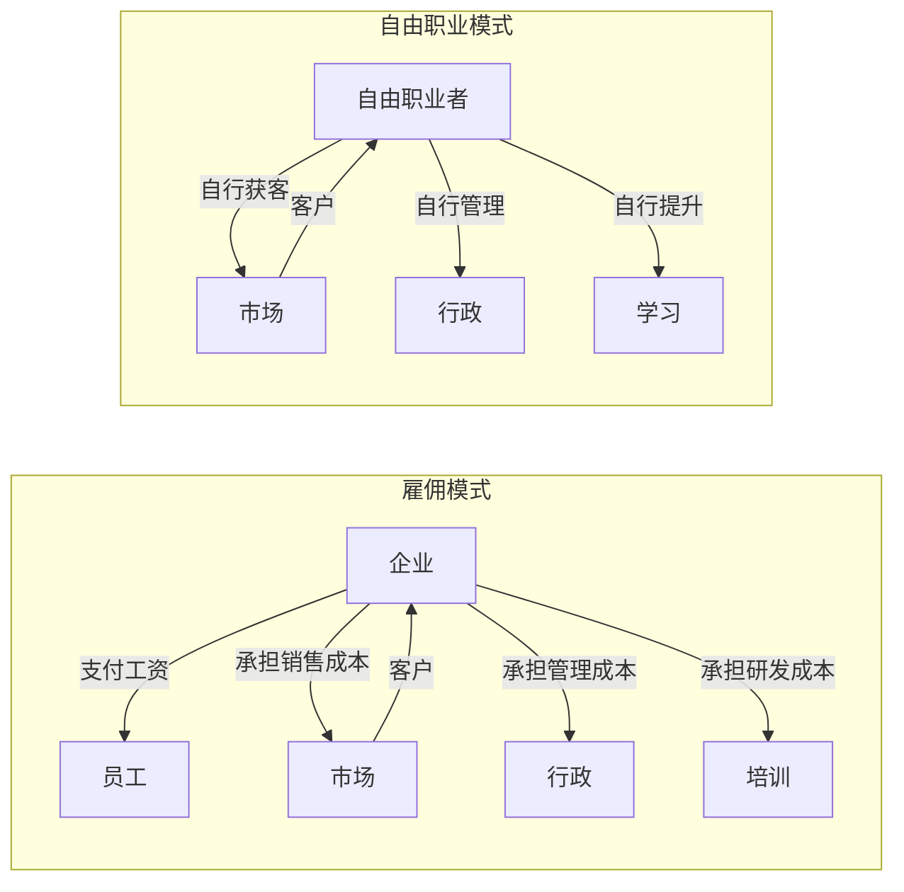
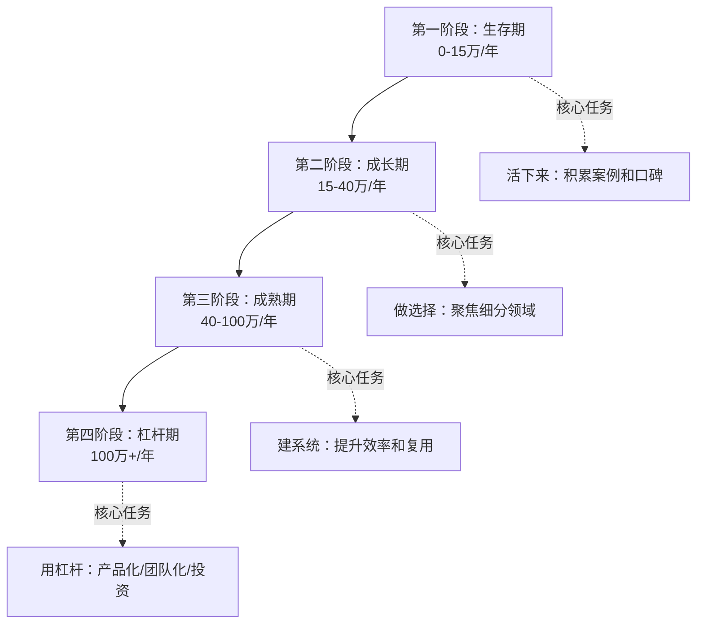

## 4.4 自由职业的经济学

自由职业不是"没有工作"，而是一种独立的经济模型。理解这套经济学，是从"接散活"到"经营个人商业体"的关键跨越。本节从定价机制、收入结构、成本核算、市场博弈四个维度，拆解自由职业背后的经济逻辑。

### 4.4.1 自由职业的经济本质

#### 什么是自由职业经济学

自由职业者本质上是一个**一人企业**。你同时承担四个角色：

| 角色 | 职责 | 对应经济活动 |
|------|------|-------------|
| 生产者 | 提供专业服务 | 交付作品/方案 |
| 销售者 | 获取客户和项目 | 营销、谈判、签单 |
| 管理者 | 运营个人业务 | 记账、税务、合同 |
| 研发者 | 提升专业能力 | 学习、迭代、创新 |

传统雇佣关系中，企业承担了销售、管理、研发的固定成本，员工只需要做好"生产者"角色。自由职业者拿回了全部角色，也承担了全部成本——这就是为什么自由职业的收入必须高于打工时薪的 2-3 倍，才能维持同等生活水平。

#### 自由职业 vs 雇佣的经济学对比



关键差异在于**风险分配**：

| 维度 | 雇佣模式 | 自由职业 |
|------|---------|---------|
| 收入稳定性 | 固定月薪，高度稳定 | 项目制，波动大 |
| 收入上限 | 受限于职级和行业薪资带 | 理论上无上限 |
| 风险承担 | 企业承担经营风险 | 个人承担全部风险 |
| 时间自由度 | 固定工时，假期有限 | 自主安排，但常过度工作 |
| 福利保障 | 五险一金、带薪假、补贴 | 全部自行解决 |
| 资产积累 | 无个人品牌资产 | 积累客户关系和个人品牌 |
| 税负结构 | 工资薪金个税 | 经营所得或劳务报酬税 |

### 4.4.2 定价经济学：你的时间值多少钱

#### 有效时薪：自由职业的核心指标

自由职业者最常见的错误是**只看项目报价，不算有效时薪**。

**有效时薪 = 项目收入 ÷ 总投入时间**

总投入时间包括：

- 需求沟通和确认
- 方案设计和规划
- 实际执行和交付
- 修改和返工
- 项目管理和协调
- 收款和对账

举一个具体例子：一个报价 5000 元的 UI 设计项目，如果前期沟通花了 3 小时，设计 12 小时，修改 5 小时，其他事务 2 小时，总投入 22 小时，有效时薪只有 227 元——远低于你以为的"5000元一天"。

#### 四种定价模型

**模型一：按时定价**

按小时或按天收费，最简单直接。

- 优点：工作量变化时收入自动调整，客户容易理解
- 缺点：收入有天花板（一天只有24小时），惩罚效率高的人
- 适用场景：咨询、培训、辅导等时间密集型服务
- 定价公式：`日薪 = (目标年收入 + 年运营成本) ÷ 有效工作天数`

有效工作天数不是365天。扣除周末、节假日、生病、营销时间、学习时间后，一年大约有效工作日为 180-220 天。

**模型二：按项目定价**

对整个项目报一个总价。

- 优点：客户预算明确，高效完成时收益更高
- 缺点：需求变更容易亏损，估算失误风险自担
- 适用场景：网站开发、设计、写作、翻译等交付物明确的项目
- 定价公式：`项目价 = 预估工时 × 目标时薪 × 1.3-1.5（风险溢价）`

1.3-1.5 的系数是给需求变更、沟通成本、收款风险留的缓冲。

**模型三：按价值定价**

根据服务给客户创造的价值来定价，而非你的成本。

- 优点：收入上限极高，与客户利益绑定
- 缺点：需要很强的议价能力和行业理解
- 适用场景：咨询顾问、策略服务、高影响项目
- 定价公式：`服务价格 ≤ 客户预期收益 × 10%-30%`

比如帮企业优化转化率，预计能增加 200 万营收，你的服务费可以定在 20-60 万之间。这远高于按工时计算的几万元。

**模型四：订阅/包月定价**

客户按月支付固定费用，你提供持续服务。

- 优点：收入可预测，现金流稳定，客户粘性高
- 缺点：需要持续投入，客户可能"占便宜"过度使用
- 适用场景：内容创作、社群运营、技术支持、设计外包
- 定价公式：`月费 = 预估月均工时 × 时薪 × 0.8（长期折扣）`

#### 定价策略对比表

| 策略 | 收入上限 | 收入稳定性 | 风险 | 议价难度 | 适合阶段 |
|------|---------|-----------|------|---------|---------|
| 按时定价 | 低 | 中 | 低 | 低 | 新手期 |
| 按项目定价 | 中 | 中低 | 中 | 中 | 成长期 |
| 按价值定价 | 高 | 低 | 高 | 高 | 成熟期 |
| 订阅定价 | 中 | 高 | 低 | 中 | 稳定期 |

**进阶建议**：自由职业的定价应该随经验增长逐步从"按时"过渡到"按价值"。刚开始时按时定价积累经验，建立口碑后转向按项目定价，当你能清晰量化服务价值时，切换到按价值定价。

### 4.4.3 收入结构与现金流管理

#### 收入波动的数学规律

自由职业收入的核心特征是**高波动性**。假设你月均收入 2 万，实际收入可能分布如下：

| 月份 | 实际收入 | 偏差 |
|------|---------|------|
| 1月 | 35,000 | +75% |
| 2月 | 8,000 | -60% |
| 3月 | 22,000 | +10% |
| 4月 | 15,000 | -25% |
| 5月 | 28,000 | +40% |
| 6月 | 12,000 | -40% |

这种波动不是经营不善，而是自由职业的内在属性。项目有淡旺季，客户付款有延迟，新旧项目交替有空档。

应对策略：

1. **建立收入平滑基金**：旺季收入超出均值的部分存入专用账户，填补淡季缺口
2. **项目错峰安排**：长期项目和短期项目搭配，避免同时开工或同时结束
3. **预收款机制**：签约收 30%-50% 定金，交付前收至 80%-100%
4. **订阅收入兜底**：用 1-2 个包月客户保障基本现金流

#### 收入来源的金字塔结构

理想的自由职业收入应该呈金字塔结构：

```text
          /\
         /  \      ← 顶层：高价值项目（1-2个/年）
        /    \        占收入 30%-40%
       /------\
      /        \    ← 中层：稳定客户（3-5个/年）
     /          \      占收入 40%-50%
    /------------\
   /              \  ← 底层：零散项目+被动收入
  /                \    占收入 10%-20%
 /------------------\
```

- **顶层**：年度大客户或高价值咨询项目，收入高但获取难度大
- **中层**：续约客户或中型项目，是收入的压舱石
- **底层**：平台接单、内容变现、知识付费等，提供补充收入和潜在客户入口

### 4.4.4 成本核算：你的业务真正花多少钱

自由职业者必须理解**显性成本**和**隐性成本**。

#### 显性成本清单

| 成本类别 | 具体项目 | 参考占比 |
|---------|---------|---------|
| 平台费用 | 平台抽成（10%-20%）、会员费 | 5%-15% |
| 工具订阅 | 软件、云服务、域名、CDN | 3%-8% |
| 办公成本 | 空间、设备折耗、网费、电费 | 5%-10% |
| 社保公积金 | 自行缴纳五险一金 | 15%-25% |
| 税费 | 增值税、个税、附加税 | 5%-20% |
| 学习投入 | 课程、书籍、会议、认证 | 3%-5% |
| 营销成本 | 网站、内容制作、广告投放 | 2%-5% |

#### 隐性成本清单

| 隐性成本 | 说明 | 典型损耗 |
|---------|------|---------|
| 未计费时间 | 沟通、修改、等反馈、对账 | 实际工时的 30%-50% |
| 空档期 | 项目间隙无收入的时间 | 每年 2-4 个月 |
| 坏账 | 客户拖欠或拒付尾款 | 年收入的 2%-10% |
| 机会成本 | 接了低价值项目错过了高价值机会 | 不可量化但巨大 |
| 健康成本 | 长期高压导致的健康损耗 | 未来医疗支出 |

#### 真实利润率计算

很多自由职业者以为自己"收入不错"，实际上忽略了隐性成本后利润率极低。

**真实时薪 = (年总收入 - 年总显性成本 - 年总隐性成本折算) ÷ 总工作小时数**

假设一个自由设计师：
- 年收入：30 万
- 显性成本（平台+工具+社保+税费）：8 万
- 隐性成本（空档期损失+坏账）：4 万
- 总工作时间：2500 小时（含未计费时间）

真实时薪 = (300000 - 80000 - 40000) ÷ 2500 = **72 元/小时**

折合月薪约 12,672 元（按每月 176 工时）。这个数字可能还不如一个中高级打工人的薪资，但承担了远高于打工的风险。

### 4.4.5 市场博弈：自由职业的竞争经济学

#### 供需关系与价格弹性

自由职业市场是一个**典型的竞争市场**：

- 供给端：进入门槛低，供给弹性大
- 需求端：企业对自由职业者的需求随经济周期波动
- 价格机制：同质化服务容易陷入价格战

破解方法是**差异化**——让自己提供的服务从"商品"变成"解决方案"。

| 层级 | 服务类型 | 竞争方式 | 价格空间 |
|------|---------|---------|---------|
| L1 | 通用执行 | 纯价格竞争 | 极低，易被替代 |
| L2 | 专业执行 | 技术能力竞争 | 中等，需持续精进 |
| L3 | 方案解决 | 价值竞争 | 较高，需要行业理解 |
| L4 | 战略咨询 | 信任竞争 | 极高，需要口碑背书 |

从 L1 到 L4，核心竞争力从"我会做"变成"我比你更懂你的业务"。

#### 信息不对称与信号传递

自由职业市场存在严重的信息不对称——客户很难在签约前判断你的服务质量。解决信号传递问题的方法：

1. **作品集**：用过往案例证明能力，比任何描述都有说服力
2. **客户评价**：第三方背书降低客户的决策风险
3. **内容输出**：博客、演讲、开源项目展示专业深度
4. **行业认证**：官方认证提供标准化的能力证明
5. **试用机制**：小项目试水，降低客户首次合作的心理门槛

#### 赢者通吃效应

在某些自由职业领域存在赢者通吃效应——排名靠前的从业者获得不成比例多的机会。平台推荐算法、搜索排名、口碑传播都加剧了这个效应。

应对策略：

- **细分赛道**：不做"设计师"，做"B2B SaaS 产品的品牌设计师"
- **平台外获客**：建立独立获客渠道，减少对平台排名的依赖
- **老客户复购**：维护好现有客户关系，复购成本远低于获新客

### 4.4.6 税务经济学

#### 中国自由职业者的税负结构

自由职业者的税务身份直接影响税负：

**身份一：个人劳务报酬**

- 适用场景：偶尔接单、平台代扣
- 税率：20%-40%（预扣），年度汇算并入综合所得
- 特点：税率高，无抵扣

**身份二：个体工商户**

- 适用场景：持续经营的自由职业者
- 税率：经营所得 5%-35%，可核定征收
- 特点：可扣除经营成本，部分地区核定综合税负 1%-3%

**身份三：个人独资企业**

- 适用场景：收入较高的自由职业者
- 税率：经营所得 5%-35%，可核定征收
- 特点：可开专票，适合对接企业客户

#### 税务优化合法路径

1. **选择合适身份**：年收入 10 万以下个人即可，10-50 万考虑个体户核定，50 万以上考虑个独企业
2. **充分利用扣除**：设备购置、软件订阅、培训费用、差旅费均可作为经营成本
3. **合理安排收入确认时间**：利用年度汇算的税率差进行合法规划
4. **利用小规模纳税人优惠**：月收入 10 万以下免征增值税（季度 30 万）

> 重要提醒：税务优化必须在法律框架内进行。虚开发票、虚构交易、隐瞒收入是违法行为，后果严重。

### 4.4.7 风险管理经济学

#### 自由职业的五大风险

| 风险 | 概率 | 影响 | 应对策略 |
|------|------|------|---------|
| 客户集中风险 | 高 | 单一客户收入超 40% 时极高 | 控制单一客户收入占比 ≤ 30% |
| 技术替代风险 | 中 | AI 等新技术可能替代某些服务 | 向策略层、创意层转型 |
| 健康中断风险 | 中 | 生病或受伤导致无法工作 | 购买商业保险+建立被动收入 |
| 市场周期风险 | 中 | 经济下行时企业削减外包预算 | 建立 6-12 个月生活储备金 |
| 合同纠纷风险 | 中 | 需求变更、知识产权、尾款纠纷 | 规范合同+分阶段收款 |

#### 保险配置建议

自由职业者没有企业提供的福利保障，需要自行配置：

- **医疗险**：百万医疗险，年费 300-800 元，覆盖大病风险
- **重疾险**：确诊即赔，弥补收入中断损失
- **意外险**：覆盖意外伤残，自由职业者常外出更需保障
- **职业责任险**：设计、咨询、法律等服务类自由职业者的必备保障
- **养老储备**：自行缴纳养老保险或配置商业养老年金

### 4.4.8 从经济学视角看自由职业的阶段演进

#### 自由职业四阶段模型



**第一阶段（生存期）**：核心经济学逻辑是"用时间换空间"。收入主要靠出卖时间，目标是活下来并积累足够多的案例和客户关系。此阶段应接受较低的时薪，换取经验和口碑。

**第二阶段（成长期）**：核心经济学逻辑是"用选择换效率"。开始筛选客户和项目，拒绝低价单，聚焦细分领域建立专业壁垒。有效时薪开始显著提升。

**第三阶段（成熟期）**：核心经济学逻辑是"用系统换规模"。建立标准化流程、模板库、工具链，提升单位时间产出。开始尝试将服务产品化——把经验变成课程、把方案变成模板、把咨询变成工具。

**第四阶段（杠杆期）**：核心经济学逻辑是"用杠杆换自由"。三种杠杆路径：
- **产品杠杆**：开发数字产品（课程、模板、SaaS），一次制作反复销售
- **团队杠杆**：外包低价值工作，自己专注高价值环节
- **资本杠杆**：用积累的资金投资，创造被动收入

### 4.4.9 实操工具箱

#### 自由职业定价计算器

```text
目标年收入：__________ 元
年运营成本：__________ 元
年隐性成本（空档+坏账）：__________ 元
有效工作天数：__________ 天（建议180-220天）
每日有效工时：__________ 小时（建议6-7小时）

=== 计算结果 ===
日费率 = (目标年收入 + 年运营成本 + 年隐性成本) ÷ 有效工作天数
       = __________ 元/天

时费率 = 日费率 ÷ 每日有效工时
       = __________ 元/小时

项目报价 = 预估工时 × 时费率 × 风险系数(1.3-1.5)
         = __________ 元
```

#### 客户价值评估清单

在决定是否接一个项目前，用这个清单评估：

| 评估维度 | 权重 | 得分(1-5) | 加权分 |
|---------|------|----------|-------|
| 直接收入 | 25% | ___ | ___ |
| 案例价值（能否放进作品集） | 20% | ___ | ___ |
| 长期合作潜力 | 20% | ___ | ___ |
| 学习成长机会 | 15% | ___ | ___ |
| 口碑传播可能性 | 10% | ___ | ___ |
| 时间灵活性 | 10% | ___ | ___ |
| **总分** | | | ___ |

总分 < 2.5 的项目应慎重考虑是否接受，除非正处于生存期。

#### 月度财务复盘模板

每月末花 30 分钟做一次复盘：

1. **收入分析**：本月总收入、各项目占比、同比/环比变化
2. **时间分析**：本月总工时、各项目耗时、有效时薪计算
3. **成本分析**：本月运营成本、是否有意外支出
4. **管道分析**：在谈项目、已签约待开工、进行中、待收款
5. **调整决策**：是否需要调整定价、筛选客户、优化流程

### 4.4.10 常见经济学误区

**误区一："自由职业就是赚更多钱"**

真相：自由职业的收入上限确实更高，但中位数收入可能低于同等能力的全职工作者。扣除自行缴纳的社保、税费、工具成本后，实际可支配收入未必更优。选择自由职业的核心动机应该是"自主权"和"成长空间"，而非单纯的收入预期。

**误区二："客户越少越好管理"**

真相：客户过度集中是自由职业最大的经济风险。一个大客户占你 60% 的收入，一旦流失就是断崖式下降。合理的客户结构是：单个客户收入占比不超过 30%，核心客户 3-5 个，辅助客户若干。

**误区三："忙就是好"**

真相：满负荷运转意味着你没有时间做营销、学习和思考，一旦当前项目结束就会陷入空档期。自由职业的健康状态是 70%-80% 的产能利用率，留出缓冲给突发需求和自我提升。

**误区四："价格低才能拿到项目"**

真相：低价策略吸引的是价格敏感型客户，这类客户往往需求多、尊重少、回款慢。适度的价格反而是一种筛选机制——愿意为质量付费的客户通常也是最好的客户。

**误区五："自由职业不用管钱"**

真相：自由职业者比打工人更需要财务规划。收入波动要求更强的现金流管理能力，社保自行缴纳要求了解政策，税务优化要求基本的财务知识。不会管钱的自由职业者，收入再高也可能陷入困境。
