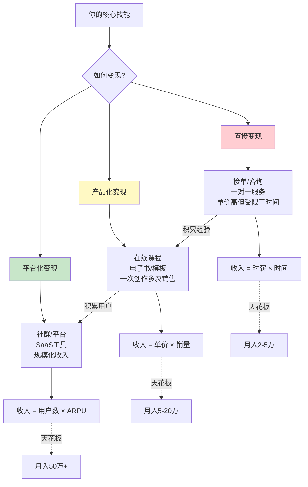
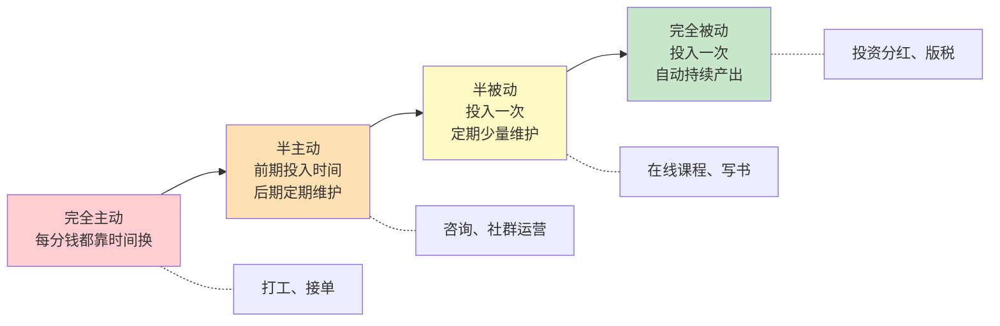

## 4.5 多收入来源的构建理论

**技能变现路径图**：如何将技能转化为多元收入



> **变现策略**：最佳路径是先通过直接变现验证市场需求，再将经验产品化，最终建立平台实现规模化。不要跳过验证阶段直接做产品，否则可能做出没人要的东西。

### 4.5.1 为什么要构建多收入来源

#### 单一收入的脆弱性

大多数人一生只依赖工资这一条收入管道。这看似稳定，实则脆弱——裁员、行业衰退、公司倒闭、身体状况变化，任何一个变量都可能让整条管道断裂。

**风险量化模型**：

```text
风险暴露 = 收入中断概率 × 中断持续时间 × 生活开支刚性

单一收入示例：
  中断概率：15%（行业平均裁员率+公司倒闭率）
  中断时长：6个月（平均求职周期）
  开支刚性：100%（房贷/生活费无法压缩）
  风险暴露 = 0.15 × 6 × 100% = 0.9（高风险）

三收入来源示例：
  主业中断概率：15%，影响占比 60%
  副业中断概率：5%，影响占比 25%
  投资收入中断概率：2%，影响占比 15%
  综合风险暴露 = 0.15×0.6 + 0.05×0.25 + 0.02×0.15 = 0.093 + 0.0125 + 0.003 ≈ 0.11（低风险）
```

这个模型揭示了一个关键事实：**多收入来源不是"锦上添花"，而是抗风险的基础设施**。

#### 真实案例对比

| 维度 | 小李（单一收入） | 小张（多元收入） |
|------|-----------------|-----------------|
| 收入构成 | 工资 15,000 | 工资 10,000 + 副业 3,000 + 投资 1,500 |
| 被裁员后收入 | 0 元/月 | 4,500 元/月 |
| 缓冲时间 | 0 天（立即恐慌） | 约 3 个月（可从容求职） |
| 求职心态 | 被迫接受任何 offer | 可以选择匹配的机会 |
| 职业谈判筹码 | 无 | 有替代方案，谈判地位更强 |

#### 多收入来源的心理优势

除了财务安全，多元收入还带来三个容易被忽视的心理收益：

1. **决策自由度**：当你知道主业不是唯一选择时，你在职场中的决策会更理性。不会为了保住饭碗而接受不合理的要求，也不会因为害怕失去收入而在该跳槽时犹豫不决。
2. **身份认同多元性**：单一收入者往往把"我是XX公司的员工"等同于"我是谁"。一旦失去工作，身份认同会崩塌。多元收入者同时是"工程师/写作者/投资者"，任何一个角色受挫都不会摧毁自我认知。
3. **持续学习的动力**：不同收入来源需要不同的技能组合，这种天然的"被迫学习"让你保持竞争力，避免在单一领域里逐渐过时。

### 4.5.2 收入来源的完整分类体系

#### 按投入-产出关系分类

理解收入来源的本质，关键在于理解"你投入了什么，产出了什么"：

| 分类 | 定义 | 核心公式 | 代表形式 | 典型天花板 |
|------|------|---------|---------|-----------|
| **时间出售型** | 直接出售个人时间 | 收入 = 时薪 × 时间 | 工资、兼职、接单 | 受限于可用时间（约 2000h/年） |
| **技能杠杆型** | 用技能创造可复用产品 | 收入 = 单价 × 销量 | 课程、电子书、模板、工具 | 受限于市场规模和推广能力 |
| **资本收益型** | 让钱生钱 | 收入 = 本金 × 收益率 | 股息、利息、租金、基金 | 受限于本金规模 |
| **平台抽成型** | 搭建连接供需的平台 | 收入 = 交易额 × 佣金率 | 社群、中介、SaaS | 受限于用户规模和活跃度 |
| **品牌溢价型** | 用个人影响力变现 | 收入 = 曝光量 × 转化率 × 客单价 | 广告、代言、付费专栏 | 受限于粉丝规模和粘性 |

#### 按被动程度分类（被动收入阶梯）



> **重要澄清**：不存在"零投入"的被动收入。所谓的"被动"，本质上是"前期高密度投入 + 后期低频维护"。那些宣传"躺赚"的，要么在夸大其词，要么在收割你。

#### 按启动难度和回报周期分类

| 象限 | 启动难度 | 回报周期 | 适合阶段 | 典型例子 |
|------|---------|---------|---------|---------|
| 快启动快回报 | 低 | 1-2周 | 初期（急需现金流） | 闲鱼二手转卖、跑腿兼职、数据标注 |
| 快启动慢回报 | 低 | 3-6个月 | 中期（边赚边学） | 自媒体写作、短视频、知识付费 |
| 慢启动快回报 | 高 | 1-3个月 | 有专业壁垒时 | 高端咨询、技术外包、翻译 |
| 慢启动慢回报 | 高 | 6-24个月 | 长期战略布局 | SaaS产品、投资体系、品牌建设 |

### 4.5.3 构建多收入来源的系统方法

#### 第一步：盘点现有资产

在构建新收入来源之前，先盘点你已经拥有的"变现资本"：

| 资产类型 | 盘点内容 | 变现方向 |
|---------|---------|---------|
| **硬技能** | 编程、设计、写作、翻译、数据分析 | 接单、课程、工具开发 |
| **软技能** | 沟通、演讲、组织、教学 | 培训、咨询、社群 |
| **知识储备** | 行业经验、专业知识、方法论 | 写作、课程、咨询 |
| **人脉资源** | 同行、客户、上下游、社群 | 中介、推荐、合作 |
| **物质资产** | 房产、车辆、设备、闲置物品 | 租赁、二手出售 |
| **数字资产** | 粉丝、域名、网站、账号 | 广告、带货、转让 |
| **资金** | 存款、可投资金额 | 投资、借贷、合伙 |

**自检清单**：对每一项资产问三个问题——

1. 这项资产目前是否在产生收入？（是/否）
2. 如果没有，转化为收入需要多长时间和多少投入？
3. 这项资产的市场价值是否在增长、稳定还是贬值？

#### 第二步：设计收入组合

收入组合的设计遵循投资组合理论的核心原则——**不相关性**。理想的多收入来源应该尽量不相关，这样当某一个受影响时，其他的不受波及。

**收入相关性矩阵示例**：

```text
           工资   自由接单   投资理财   线上课程   房租收入
工资        1.0     0.8       0.1       0.3       0.1
自由接单    0.8     1.0       0.1       0.5       0.1
投资理财    0.1     0.1       1.0       0.2       0.5
线上课程    0.3     0.5       0.2       1.0       0.1
房租收入    0.1     0.1       0.5       0.1       1.0
```

相关性越高（接近 1.0），两份收入越可能同时受影响。例如"工资"和"自由接单"如果都在同一个行业，行业寒冬时会同时下滑。选择不同行业、不同媒介、不同客户群的收入来源，才能真正分散风险。

#### 第三步：阶梯式构建

不要试图同时开辟多条收入管道。资源（时间、精力、资金）有限时，阶梯式推进更可持续：

**Phase 1：稳定主业（0-6个月）**

主业是最大的现金流来源，也是其他收入的启动资金。在主业不稳定时开辟副业，反而可能两头落空。

目标：主业收入稳定 → 存下 6 个月生活费的应急基金

**Phase 2：验证第一个副业（6-18个月）**

选择一个与主业技能相关的副业方向，用最少的时间投入去验证市场需求。

```text
验证标准：
  ✓ 有人愿意付费（不是"这个很好"而是"我买一个"）
  ✓ 单位时间收入 ≥ 主业时薪的 50%
  ✓ 你能在每周投入 5-10 小时内完成
```

**Phase 3：引入被动收入（12-24个月）**

当副业积累了一定经验和用户后，开始将经验产品化（课程、模板、工具），同时将储蓄投入低风险投资产生资本收益。

**Phase 4：优化和扩展（24个月以后）**

- 砍掉投入产出比低的收入来源
- 加大投入高回报的收入来源
- 探索新的收入管道
- 形成稳定的收入组合

### 4.5.4 收入增长的复利效应与协同机制

#### 复利效应的数学表达

多个收入来源并不仅仅是"加法"关系，当它们产生协同效应时，整体增长速度远超单一来源：

```text
单收入来源增长模型：
  年收入 = 初始收入 × (1 + 增长率)^n
  初始 10万，年增长 10%，5年后 = 16.1万

多收入来源增长模型：
  年收入 = Σ(各来源 × (1 + 该来源增长率)^n)
  
  初始：主业 10万 + 副业 2万 + 投资 0.5万 = 12.5万
  增长：主业 10% + 副业 30% + 投资 15%
  5年后：16.1万 + 7.4万 + 1.0万 = 24.5万

  比单主业多出 8.4万（增长 52%）
```

#### 收入来源之间的协同效应

不同收入来源之间会产生"1+1>2"的协同效应，这是多收入体系最被低估的价值：

| 协同类型 | 机制 | 实例 |
|---------|------|------|
| **技能迁移** | A收入来源培养的技能直接提升B | 写作能力提升课程质量 |
| **流量复用** | A来源积累的用户成为B的客户 | 博客读者转化为课程学员 |
| **信任传递** | A来源建立的专业形象提升B的转化率 | 出版物背书咨询服务 |
| **信息优势** | A来源获得的行业洞察优化B的决策 | 实战经验提升投资判断 |
| **风险对冲** | A的低谷期恰好是B的高峰期 | 教育行业暑假旺季 vs 咨询淡季 |

#### 反复利：多收入来源也会放大错误

协同效应是双向的。如果你在多个收入来源中犯了同样的错误（比如都在同一个行业、都用同一种技能），这个错误会被放大而不是分散。

**避坑检查清单**：

- [ ] 你的收入来源是否依赖同一个客户群体？
- [ ] 你的收入来源是否都在同一个行业？
- [ ] 你的收入来源是否都依赖同一种核心技能？
- [ ] 如果这个群体/行业/技能失效，你的总收入会下降多少？

如果任何一项答案是"超过 60%"，说明你的收入组合分散度不够。

### 4.5.5 多收入管理的实操框架

#### 时间分配模型

拥有多条收入来源最大的挑战不是"做什么"，而是"时间怎么分"。以下是经过验证的时间分配框架：

**核心原则：投入产出比优先**

```text
每周总可用时间 = 168小时 - 睡眠(56h) - 生活(28h) = 84小时
  主业：40小时（固定）
  机动时间：44小时

分配规则：
  1. 主业投入不低于40小时（保障主要现金流）
  2. 副业投入机动时间的 50-60%（约 22-26 小时）
  3. 学习提升占 15-20%（约 7-9 小时）
  4. 留出 20% 缓冲时间（应对突发和休息）
```

#### 收入追踪与评估体系

每月对每条收入来源做一次评估，计算三个核心指标：

| 指标 | 计算方法 | 决策依据 |
|------|---------|---------|
| **时薪** | 本月该来源收入 ÷ 投入小时数 | 低于主业时薪 50% → 考虑砍掉 |
| **增长率** | (本月 - 上月) ÷ 上月 × 100% | 连续3个月负增长 → 分析原因 |
| **投入产出比** | 净收入 ÷ (时间成本 + 资金成本) | 低于 1.0 → 暂停投入 |

**追踪模板示例**：

```markdown
## 2025年6月 收入追踪

| 收入来源 | 收入 | 投入时间 | 时薪 | 环比增长 | 决策 |
|---------|------|---------|------|---------|------|
| 主业工资 | 15,000 | 160h | 93.75 | +5% | 维持 |
| 技术咨询 | 4,000 | 20h | 200 | +20% | 扩大 |
| 课程销售 | 1,200 | 5h | 240 | +10% | 维持 |
| 基金收益 | 300 | 0h | ∞ | -2% | 维持 |
| 自媒体 | 500 | 15h | 33.3 | -10% | ⚠️ 调整 |
| **合计** | **21,000** | **200h** | **105** | | |

⚠️ 自媒体时薪低于主业50%，需分析：是内容方向问题还是变现方式问题？
```

#### 4.5.6 常见误区与纠正

| 误区 | 真相 | 纠正方法 |
|------|------|---------|
| 同时开始5个副业 | 精力分散，每个都做不好 | 最多同时维持 2-3 条收入管道 |
| 追求"完全被动" | 真正的被动收入需要巨大前期投入 | 接受"半被动"，先跑通再优化 |
| 只追风口 | 风口消失后收入归零 | 选择与核心技能相关的方向 |
| 忽视税务 | 多收入来源可能跳档，税负增加 | 提前了解各收入类型的税率 |
| 不做记录 | 不知道哪个赚钱哪个亏钱 | 坚持月度收入追踪 |
| 把副业当主业花时间 | 主业是现金流基本盘 | 主业投入不低于总时间的 50% |

### 4.5.7 高阶：收入组合的动态优化

当你的多收入体系运转 1-2 年后，进入优化阶段。此时不是"增加新收入"，而是优化现有组合的效率。

**优化三原则**：

1. **砍尾扩头**：砍掉投入产出比最低的 1-2 条收入，将释放的时间投入回报最高的来源
2. **技能复用**：识别哪些技能可以跨收入来源复用，集中强化这些"杠杆技能"
3. **自动化与外包**：将重复性工作自动化或外包，提升每条管道的被动程度

**年度收入组合审计清单**：

- [ ] 各收入来源的实际时薪 vs 目标时薪
- [ ] 各收入来源之间的相关性是否上升（如都依赖同一平台）
- [ ] 是否有新的收入机会出现（市场变化、新技能获得）
- [ ] 是否有收入来源已到天花板需要转型
- [ ] 税务规划是否需要调整
- [ ] 应急基金是否仍覆盖 6 个月开支

> **终极目标**：构建一个收入来源之间低相关、整体抗风险、且能持续增长的收入组合。不是追求"收入来源数量最多"，而是追求"组合效率最优"。三条精心设计的收入管道，胜过十条东一榔头西一棒子的零散副业。
