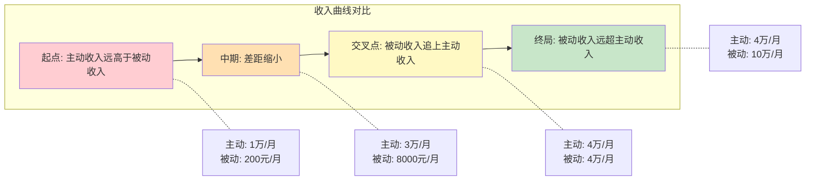
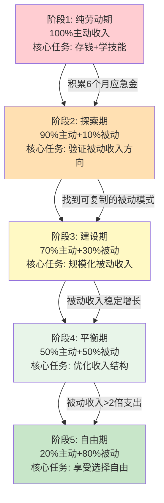
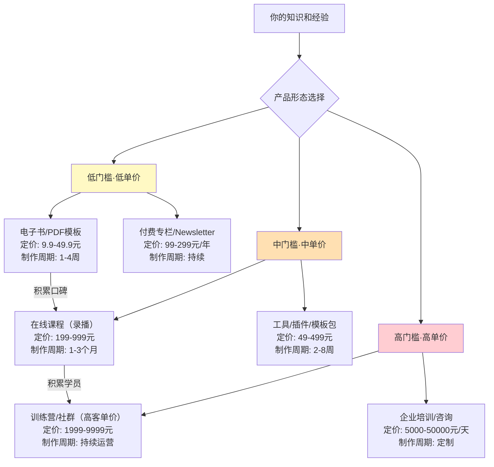

## 4.6 从主动收入到被动收入的过渡

主动收入是起点，但不是终点。所有关于主动收入最大化的努力——提升技能、谈判薪资、拓展副业——最终都指向同一个目标：**积累足够的资金、技能和资源，建立能够自动运转的被动收入系统**。这一节要解决的核心问题是：如何从"必须工作才有收入"过渡到"即使不工作也有收入"，以及在这个过渡过程中需要跨越哪些关卡、避开哪些陷阱。

### 4.6.1 为什么要过渡：主动收入的终局困境

#### 数学上的必然性

主动收入的本质是"时间换钱"。无论你的时薪多高，都受制于一个硬约束：**每个人每天只有24小时**。即使你把所有清醒时间都用来工作（这显然不可持续），你的收入也有一个无法突破的天花板。

```text
主动收入的数学极限：

假设：
  时薪 = 500元（已经是市场前5%的水平）
  每天有效工作 = 10小时（已经是高强度）
  每月工作天数 = 26天（几乎无休）

月收入上限 = 500 × 10 × 26 = 130,000元
年收入上限 = 1,560,000元

扣除社保、个税后实际到手 ≈ 110万/年

而这个数字需要你：
  - 每天高强度工作10小时
  - 几乎没有休息日
  - 长期保持巅峰状态
  - 不生病、不休假、不遭遇行业衰退
```

这个极限值看起来不低，但问题是：**它不可持续，也无法增长**。随着年龄增长，体力下降、精力减退，你的有效工作时间只会缩短，不会延长。主动收入是一条先上升后下降的曲线，而生活开支是一条持续上升的曲线——两条曲线终将交叉。

#### 被动收入的数学优势

被动收入的公式完全不同：**收入 = 资产规模 × 收益率**。这个公式没有"时间"这个变量，因此不受24小时的限制。

```text
被动收入的增长模型：

假设初始投资本金 50万，年化收益率 10%（指数基金长期平均），
每年追加投入 10万（从主动收入中节省）：

第1年：50万 × 1.1 + 10万 = 65万
第3年：96万
第5年：153万
第10年：358万
第15年：726万
第20年：1,386万

被动收入（按4%安全提取率）：
  第10年：358万 × 4% = 14.3万/年 ≈ 1.2万/月
  第15年：726万 × 4% = 29万/年 ≈ 2.4万/月
  第20年：1,386万 × 4% = 55.4万/年 ≈ 4.6万/月
```

这就是复利的力量：前期增长缓慢，后期爆发式增长。关键在于**尽早开始**和**持续投入**。

#### 两条曲线的交叉点



**交叉点的意义**：当被动收入等于你的生活开支时，你就达到了财务独立（Financial Independence）。此后，工作变成了"选择"而非"必须"。从交叉点到真正辞职，通常还需要一个缓冲期来验证被动收入的稳定性。

### 4.6.2 过渡的本质：三种资本的转化

从主动收入到被动收入的过渡，本质上是**三种资本的积累和转化**过程：

| 资本类型 | 来源 | 转化方向 | 转化周期 |
|---------|------|---------|---------|
| **金融资本** | 主动收入的储蓄 | → 投资本金 → 资本收益 | 1-5年 |
| **人力资本** | 工作中积累的技能和知识 | → 产品（课程/工具/内容） → 版税/授权收入 | 6-24个月 |
| **社会资本** | 行业人脉、个人品牌、粉丝 | → 流量 → 广告/带货/社群收入 | 12-36个月 |

这三种资本之间并非独立，而是相互促进：

- 金融资本让你有底气去尝试（不怕失败）
- 人力资本让你有能力去创造（做出好产品）
- 社会资本让你有渠道去变现（找到客户）

**最常见的错误**是只关注其中一种而忽视其他两种。比如只存钱不投资（有金融资本但不会用），或者只学技能不输出（有人力资本但无法变现），或者只积累粉丝不变现（有社会资本但浪费了）。

### 4.6.3 过渡的五阶段模型

#### 阶段总览



#### 阶段1：纯劳动期（0-12个月）

**核心任务**：稳定主动收入 + 建立财务基础

这个阶段的目标不是急着去建被动收入，而是打好地基。地基不稳就去盖楼，只会塌得更快。

**必须完成的三件事**：

1. **建立应急基金**：存下6个月生活费的应急资金，放在货币基金或活期存款中，绝不用于投资。这是你的"安全气囊"——有了它，你在后续阶段才敢冒险尝试。

2. **记账并优化支出**：不是为了省钱，而是为了搞清楚"钱去了哪里"。很多人以为自己月光是因为赚得少，记账后才发现是因为花得不自知。目标是将储蓄率提升到30%以上。

3. **开始学习投资和被动收入的基础知识**：不需要马上行动，但需要建立认知框架。推荐阅读《小狗钱钱》《富爸爸穷爸爸》《指数基金投资指南》等入门书籍。

**阶段1的红线**：
- 没有应急基金就不要开始投资
- 有高利率负债（信用卡分期、网贷）先还清再考虑投资
- 不要因为急于求成而影响主业表现

#### 阶段2：探索期（6-24个月）

**核心任务**：用最小成本验证被动收入方向

有了应急基金和基础认知后，开始小规模尝试。这个阶段的核心原则是**低成本试错**——不要一上来就投入大量资金或时间。

**被动收入方向的三类探索**：

| 方向 | 启动成本 | 技术门槛 | 回报周期 | 适合人群 |
|------|---------|---------|---------|---------|
| **投资理财类** | 中（需要本金） | 低-中 | 中-长 | 有储蓄、风险承受力中等 |
| **内容创作类** | 低（只需时间） | 低-中 | 中（3-12个月） | 有表达欲、某领域有积累 |
| **产品/工具类** | 低-中 | 中-高 | 中-长 | 有技术能力、善于解决问题 |

**每类方向的最小可行实验（MVE）**：

**投资理财方向的MVE**：
- 用1000-5000元开始基金定投（沪深300或中证500指数基金）
- 目标不是赚钱，而是理解市场波动、建立投资纪律
- 记录每笔投资的逻辑和心态变化
- 3个月后评估：你能否承受20%的账面亏损而不恐慌卖出？

**内容创作方向的MVE**：
- 选择一个你擅长的领域，在一个平台上持续输出30篇内容
- 平台选择：公众号（深度文章）、小红书（图文）、B站（视频）、知乎（问答）
- 不需要追求爆款，目标是验证：你能否持续产出？是否有受众？
- 3个月后评估：有没有人主动关注你？有没有收到正反馈？

**产品/工具方向的MVE**：
- 把你工作中重复做的事情，做成一个模板或小工具
- 放到闲鱼、Gumroad或GitHub上试卖
- 定价9.9-49.9元，目标是验证"有没有人愿意付费"
- 1个月后评估：有没有成交？客户反馈如何？

**阶段2的关键指标**：

```text
验证通过的标准（至少满足2项）：
  ✓ 有人愿意付费（不是"很好"而是"我买一个"）
  ✓ 你能每周投入5-10小时持续产出
  ✓ 3个月内有明确的增长趋势
  ✓ 你对这个方向有持续的热情（不是三分钟热度）

验证失败的信号：
  ✗ 3个月零成交零关注
  ✗ 你每次做这件事都感到痛苦
  ✗ 市场上同类产品已经严重饱和
  ✗ 你需要投入的成本远超你的承受能力
```

#### 阶段3：建设期（12-36个月）

**核心任务**：将验证过的方向规模化

通过阶段2的验证后，进入建设期。这个阶段的核心是**系统化**——把一个偶然成功的尝试，变成一个可复制、可扩展的系统。

**建设期的四项核心工作**：

**1. 产品化**

将你的技能、知识或服务转化为可批量交付的产品：

```text
产品化路径：

知识型：
  经验 → 文章 → 系列课程 → 书籍 → 训练营
  （从免费内容建立信任，到付费产品深度交付）

工具型：
  手工操作 → 脚本自动化 → SaaS工具 → API服务
  （从解决自己的问题，到帮别人解决同样的问题）

投资型：
  手动选股 → 定投策略 → 量化模型 → 资管产品
  （从个人投资，到系统化的投资方法论）
```

**2. 流量建设**

产品再好，没有客户也等于零。被动收入的"被动"不包括获客——你仍然需要持续吸引流量，但可以通过内容和系统来降低获客成本。

| 流量来源 | 成本 | 稳定性 | 适合阶段 |
|---------|------|--------|---------|
| 搜索引擎（SEO） | 低（时间成本） | 高（长期稳定） | 中后期 |
| 社交媒体内容 | 低（时间成本） | 中（受算法影响） | 全阶段 |
| 付费广告 | 高（资金成本） | 低（停止投放即停止） | 验证期后 |
| 口碑推荐 | 极低 | 高 | 产品成熟后 |
| 社群运营 | 中（时间成本） | 高 | 中期 |

**3. 自动化**

将重复性工作自动化，提升每条收入管道的"被动程度"：

- 投资：设置自动定投、自动再平衡
- 内容：提前批量制作、定时发布
- 销售：搭建自动化的销售漏斗（引流→转化→交付→售后）
- 客服：常见问题FAQ + 自动回复

**4. 风险对冲**

随着被动收入规模增长，风险管理变得越来越重要：

- 不要把所有被动收入来源放在同一个篮子里
- 投资类被动收入要做资产配置（股债平衡、跨市场分散）
- 内容类被动收入要建立多平台分发（不要只依赖一个平台）
- 保持一定比例的主动收入作为"安全垫"

#### 阶段4：平衡期（24-60个月）

**核心任务**：优化收入结构，从"多劳多得"转向"多产多得"

当被动收入占比达到30-50%时，你进入了一个关键的转折期。此时需要重新审视你的时间分配。

**时间再分配策略**：

```text
阶段1-2的时间分配：
  主业: 70%  副业/被动收入建设: 20%  学习: 10%

阶段3的时间分配：
  主业: 50%  被动收入维护和扩展: 35%  学习: 15%

阶段4的时间分配：
  主业: 30%  被动收入优化: 40%  新机会探索: 20%  休息: 10%
```

**平衡期的关键决策点**：

1. **是否减少主业投入？** 当被动收入稳定超过支出的50%时，可以考虑将主业从全职转为兼职或自由职业，释放更多时间给被动收入系统。

2. **是否砍掉低效的被动收入来源？** 每条被动收入管道都需要维护成本。如果某条管道的投入产出比持续低于其他管道，果断砍掉，将资源集中到高效管道上。

3. **是否引入新的被动收入类型？** 此时你已经有了金融资本、人力资本和社会资本的积累，可以探索更高门槛但也更高回报的被动收入形式（如房产投资、股权投资、品牌授权等）。

#### 阶段5：自由期（36个月以后）

**核心任务**：被动收入稳定超过生活开支，实现财务自由

**财务自由的精确定义**：

```text
财务自由 = 被动收入 ≥ 生活开支 × 安全系数

安全系数建议值：
  保守型：2.0（被动收入是支出的2倍）
  稳健型：1.5（被动收入是支出的1.5倍）
  进取型：1.2（被动收入是支出的1.2倍）

示例：
  月支出：15,000元
  保守型要求：被动收入 ≥ 30,000元/月
  稳健型要求：被动收入 ≥ 22,500元/月
  进取型要求：被动收入 ≥ 18,000元/月
```

**自由期的生活方式选择**：

达到财务自由后，你有三种选择：

1. **完全退休**：停止所有主动工作，享受生活。适合对工作没有热情、有丰富兴趣爱好的人。
2. **选择性工作**：只做自己想做的项目，不再为钱工作。适合热爱工作但讨厌被束缚的人。
3. **继续扩张**：将被动收入系统进一步扩大，追求更大的财务目标。适合有事业野心的人。

没有"正确"的选择，只有"适合你"的选择。

### 4.6.4 四种核心被动收入模式详解

#### 模式一：资本收益型——让钱生钱

**原理**：将主动收入积累的资金投入能产生收益的资产，通过利息、股息、租金、资本增值等方式获得收入。

**主要形式对比**：

| 资产类型 | 年化收益率 | 风险等级 | 流动性 | 最低门槛 | 适合阶段 |
|---------|-----------|---------|--------|---------|---------|
| 货币基金 | 1.5-2.5% | 极低 | 极高 | 1元 | 阶段1（应急金） |
| 债券基金 | 3-6% | 低 | 高 | 100元 | 阶段1-2 |
| 指数基金 | 8-12%（长期） | 中 | 高 | 100元 | 阶段2-5 |
| 股票 | 不确定 | 高 | 高 | 数百元 | 阶段3+（需要知识） |
| 房产投资 | 3-8%（含租金） | 中 | 低 | 数十万 | 阶段4-5 |
| REITs | 5-8% | 中 | 中 | 数千元 | 阶段3+ |

**指数基金定投的实操方案**：

这是最适合普通人的资本收益型被动收入方式，因为它不需要择时能力，只需要纪律。

```python
# 指数基金定投计算模型
import math

def calculate_fund_accumulation(
    monthly_invest: float,     # 每月定投金额
    annual_return: float,      # 年化收益率
    years: int,                # 投资年限
    initial_capital: float = 0 # 初始本金
) -> dict:
    """计算定投积累总额和被动收入"""
    monthly_return = (1 + annual_return) ** (1/12) - 1
    total_months = years * 12
    
    # 终值公式：FV = PV×(1+r)^n + PMT×((1+r)^n - 1)/r
    fv_initial = initial_capital * (1 + monthly_return) ** total_months
    fv_monthly = monthly_invest * ((1 + monthly_return) ** total_months - 1) / monthly_return
    total = fv_initial + fv_monthly
    
    # 按4%安全提取率计算年被动收入
    passive_annual = total * 0.04
    passive_monthly = passive_annual / 12
    
    return {
        "总积累": round(total, 2),
        "年被动收入": round(passive_annual, 2),
        "月被动收入": round(passive_monthly, 2),
        "总投入": round(initial_capital + monthly_invest * total_months, 2),
        "收益倍数": round(total / (initial_capital + monthly_invest * total_months), 2)
    }

# 示例：每月定投3000元，年化10%，投资20年
result = calculate_fund_accumulation(3000, 0.10, 20)
# 总积累 ≈ 228万，月被动收入 ≈ 7600元
```

**投资中的关键纪律**：

1. **坚持定投**：不管市场涨跌，按时按量投入。市场下跌时反而是"打折买入"的机会。
2. **长期持有**：至少持有5年以上，最好10年以上。短期波动是正常的，长期趋势是向上的。
3. **分散配置**：不要只投一只基金。建议配置：60%宽基指数（沪深300+中证500）+ 20%债券基金 + 10%海外指数 + 10%货币基金。
4. **定期再平衡**：每半年或一年调整一次比例，卖出涨多的、买入跌多的，维持目标配置。

#### 模式二：知识产品型——将经验变成资产

**原理**：将你积累的知识、技能和经验转化为可以反复销售的产品。核心优势是**边际成本趋近于零**——制作一份课程的成本是固定的，卖1份和卖10000份的成本几乎一样。

**知识产品的完整谱系**：



**从零开始做一门在线课程的完整流程**：

**第1步：选题验证（1-2周）**

不要凭感觉选题，用数据验证：

- 在知乎、小红书搜索你的领域，看哪些问题关注度高但回答质量低
- 在B站、网易云课堂看同类课程的销量和评价（差评中藏着改进机会）
- 在社群中做问卷调查："如果有一门XX课程，你最想学什么？"
- 关键判断标准：**这个问题有多少人愿意花钱解决？**

**第2步：课程大纲设计（1周）**

```text
课程大纲模板：

课程名称：《XXX：从入门到实战》
目标学员：[具体描述你的目标用户画像]
学完能做：[具体描述学完后的成果]

模块1：基础认知（为什么学、学什么、怎么学）
  1.1 [核心概念A]：定义+原理+常见误解
  1.2 [核心概念B]：定义+原理+常见误解
  1.3 环境搭建/工具准备

模块2：核心技能（怎么做）
  2.1 [技能A]：原理讲解 + 操作演示 + 练习
  2.2 [技能B]：原理讲解 + 操作演示 + 练习
  2.3 [技能C]：原理讲解 + 操作演示 + 练习

模块3：实战应用（做成什么）
  3.1 实战项目1：完整案例演示
  3.2 实战项目2：完整案例演示
  3.3 常见问题排查

模块4：进阶提升（怎么做得更好）
  4.1 高级技巧
  4.2 行业最佳实践
  4.3 持续学习路径
```

**第3步：内容制作（4-8周）**

- 录播课程：先写逐字稿，再录制，最后剪辑。每节课10-20分钟为佳。
- 工具推荐：OBS（录屏）、剪映/DaVinci Resolve（剪辑）、Canva（PPT设计）
- 制作标准：画面清晰、声音清楚、内容有逻辑、有实操演示

**第4步：上架和推广（持续）**

- 平台选择：知识星球（社群）、小鹅通（自有平台）、网易云课堂/腾讯课堂（大平台）
- 冷启动策略：先用免费内容引流（公众号/知乎/B站），再用低价试听课转化
- 定价策略：首期打折（5-7折）积累评价，后续恢复原价

#### 模式三：数字资产型——一次创建，持续收益

**原理**：创建有价值的数字资产（网站、App、域名、账号等），通过流量变现或资产增值获得收入。

**主要形式**：

**1. 内容网站/博客**

通过SEO获取搜索引擎流量，用广告（Google AdSense、百度联盟）或联盟营销（淘宝客、京东联盟）变现。

```text
内容网站的收入模型：
  月流量 × 千次展示收入(RPM) / 1000 = 广告收入
  
  示例：
    月PV: 100,000
    RPM: 30元（中文内容平均值）
    月广告收入: 100,000 × 30 / 1000 = 3,000元
    
    月PV: 500,000
    月广告收入: 15,000元
    
    月PV: 1,000,000
    月广告收入: 30,000元

时间投入：
  前6个月: 每周10-15小时（内容创作+SEO优化）
  6个月后: 每周3-5小时（维护+少量新内容）
  
关键成功因素：
  - 选择有搜索量但竞争不激烈的细分领域
  - 内容质量高于同行（深度、实用性、可读性）
  - SEO基础优化（标题、描述、内链、外链）
  - 持续更新（至少每周2-3篇高质量文章）
```

**2. 小程序/工具类产品**

开发一个解决特定问题的小工具，通过付费功能、广告或会员制变现。

| 产品类型 | 开发成本 | 维护成本 | 收入潜力 | 适合人群 |
|---------|---------|---------|---------|---------|
| 微信小程序 | 1-4周 | 低 | 中（月入1-5万） | 有前端开发能力 |
| Chrome插件 | 1-2周 | 极低 | 低-中（月入1-3万） | 有JS开发能力 |
| SaaS工具 | 2-6个月 | 中 | 高（月入5-50万） | 有全栈开发能力 |
| API服务 | 1-4周 | 低 | 中（月入1-10万） | 有后端开发能力 |

**3. 自媒体账号矩阵**

在多个平台建立账号，通过广告分成、品牌合作、带货等方式变现。

```text
自媒体矩阵收入模型：

单账号月收入 = 粉丝数 × 互动率 × 变现系数

示例（知识类账号）：
  公众号 5万粉: 广告收入 2000-5000元/月
  B站 3万粉: 广告分成 1000-3000元/月
  小红书 2万粉: 品牌合作 2000-8000元/月
  知乎 5万粉: 付费咨询+好物推荐 1000-3000元/月
  
  合计: 6000-19000元/月

维护成本: 每周10-15小时（内容创作+互动）
```

#### 模式四：系统/平台型——搭建自动运转的机器

**原理**：创建一个能够自动连接供需双方的系统或平台，从每笔交易中抽取佣金。这是被动收入的最高形态，但也是难度最大的。

**典型形式**：

- **社群/会员制平台**：建立付费社群，提供持续价值。年费制收入高度可预测。
- **中介/经纪人模式**：连接买家和卖家，收取佣金。如房产中介、留学中介、猎头。
- **联盟/分销体系**：招募分销员帮你推广产品，你提供产品和后台支持。

**社群型被动收入的搭建框架**：

```text
社群收入 = 会员数 × 年费 × 续费率

增长模型：
  第1年: 100人 × 365元 = 36,500元
  第2年: 300人 × 365元 × 70%续费率 + 200新人 × 365元 = 149,650元
  第3年: 500人 × 365元 × 75%续费率 + 300新人 × 365元 = 246,375元

关键指标：
  - 月新增会员: >20人（健康增长）
  - 续费率: >60%（价值认可）
  - 活跃率: >40%（社群健康）
  - NPS(净推荐值): >30（口碑传播）
```

### 4.6.5 过渡期的风险管理

#### 财务风险

过渡期最大的财务风险是**"两头落空"**——主业因为分心而收入下降，被动收入还没有建立起来。

**防范措施**：

```text
安全底线清单：
  ☐ 应急基金始终保持6个月支出以上
  ☐ 主业收入不低于行业平均水平（不能因为搞副业而被开除）
  ☐ 被动收入建设的投入（时间和金钱）不超过可承受范围
  ☐ 不借钱投资、不加杠杆
  ☐ 不把所有积蓄投入单一资产
```

#### 心理风险

过渡期通常长达2-5年，这个过程中最大的敌人不是外部风险，而是**心理上的焦虑和急躁**。

**常见的心理陷阱**：

| 陷阱 | 表现 | 纠正 |
|------|------|------|
| **对比焦虑** | "别人副业月入10万，我才2000" | 对比自己的起点，而不是别人的终点 |
| **急于求成** | 同时做5个副业，每个都半途而废 | 聚焦1-2个方向，做到极致 |
| **放弃临界** | "做了半年才赚500块，算了吧" | 理解复利曲线——前期增长必然缓慢 |
| **路径依赖** | "我就会这个，其他的学不会" | 舒适区外才有增长 |
| **完美主义** | "课程还没做好，再改改" | 完成比完美重要，先发布再迭代 |

#### 机会成本

过渡期投入的每一小时，都有一个机会成本——这小时如果用来加班或接单，能赚多少钱？

```text
机会成本计算：

假设你的主业时薪是100元

选项A：花20小时做一个在线课程
  直接成本: 0元（假设用自己的电脑和时间）
  机会成本: 20 × 100 = 2,000元
  
选项B：花20小时接一个外包项目
  直接收入: 5,000元
  机会成本: 0元（这就是你的选择）

短期看，选项B更赚钱。
但如果课程在接下来3年每月卖出10份 × 99元 = 990元/月：
  3年总收入: 990 × 36 = 35,640元
  投入回报比: 35,640 / 2,000 = 17.8倍

这就是"短期牺牲换长期收益"的数学逻辑。
```

### 4.6.6 关键里程碑与自检清单

#### 过渡进度评估表

每个季度用这张表评估你的过渡进度：

```text
## 季度过渡进度自检

### 财务指标
- [ ] 应急基金是否保持在6个月支出以上？
- [ ] 储蓄率是否达到30%以上？
- [ ] 被动收入占总收入的比例：___% 
- [ ] 被动收入环比增长率：___%

### 被动收入健康度
- [ ] 被动收入来源数量：___个（建议2-4个）
- [ ] 最大单一来源占比：___%（建议<50%）
- [ ] 是否有至少一个来源在持续增长？
- [ ] 维护所有来源每周需要投入：___小时

### 时间分配
- [ ] 主业投入时间：___小时/周
- [ ] 被动收入建设/维护时间：___小时/周
- [ ] 学习提升时间：___小时/周
- [ ] 是否因为副业影响了主业表现？

### 心理状态
- [ ] 你对当前的过渡进度是否满意？
- [ ] 你是否感到过度疲惫或焦虑？
- [ ] 你是否还在享受这个过程？
```

#### 关键里程碑

| 里程碑 | 标准 | 通常达成时间 | 意义 |
|--------|------|-------------|------|
| **M1：第一笔被动收入** | 任何金额的非劳动收入 | 3-12个月 | 证明可行性 |
| **M2：月入1000元** | 被动收入≥1000元/月 | 6-18个月 | 覆盖基础开支 |
| **M3：占总收入10%** | 被动收入≥总收入的10% | 12-24个月 | 开始产生质变 |
| **M4：覆盖基本生活** | 被动收入≥基本生活开支 | 24-48个月 | 基本财务安全 |
| **M5：覆盖全部支出** | 被动收入≥全部生活开支 | 36-72个月 | 财务独立 |
| **M6：被动收入>主动收入** | 被动收入≥2倍生活开支 | 48-120个月 | 完全财务自由 |

### 4.6.7 常见误区与深度纠正

#### 误区一："被动收入就是什么都不做"

**真相**：被动收入的"被动"是相对的。它指的是"不需要你持续投入时间就能产生收入"，但前期需要大量的时间和精力投入来创建资产，后期也需要定期维护。

**纠正**：把"被动收入"理解为"资产型收入"更准确——你创建了一个资产（课程、投资组合、网站），这个资产持续为你工作。就像房东不需要每天去收房租，但买房时需要大量资金投入，也需要定期维护房子。

#### 误区二："等有钱了再开始"

**真相**：被动收入的建设不需要大量资金。内容创作类几乎零成本，投资类可以从每月100元定投开始。等待"有钱"是一个永远不会到来的时间点。

**纠正**：用你现在的资源开始。月薪5000也能每月定投500元，没技术也能写文章分享经验。关键是**开始**，而不是等到"完美时机"。

#### 误区三："找一个万能的被动收入方法"

**真相**：没有适合所有人的"最佳"被动收入方式。最适合你的方式取决于你的技能、资源、风险偏好和时间。

**纠正**：用"最小可行实验"的方式，同时尝试2-3个方向，每个投入最小成本，3-6个月后根据结果集中精力到最有希望的方向。

#### 误区四："被动收入可以替代主动收入的学习"

**真相**：主动收入中积累的技能、人脉和行业认知，是建立被动收入的基础。一个在职场表现平平的人，很难在被动收入领域取得突破——因为底层能力是相通的。

**纠正**：先把主动收入做好，同时利用主动收入过程中积累的能力来建立被动收入。不要幻想"主业做不好但副业能成功"。

#### 误区五："分散投资就是买很多只股票/基金"

**真相**：真正的分散是**资产类别**的分散，不是同一类资产内的数量分散。买10只A股基金和买1只沪深300指数基金的风险分散效果差不多，因为它们高度相关。

**纠正**：分散投资要做到三个层面的分散：
1. **资产类别分散**：股票+债券+房产+现金
2. **地域分散**：A股+港股+美股+新兴市场
3. **时间分散**：定投（分批买入）而非一次性投入

#### 误区六："追求高收益率"

**真相**：在被动收入的世界里，**稳定性比收益率更重要**。年化8%的稳定收益，20年后的结果远好于"一年赚50%、一年亏30%"的剧烈波动。

```text
复利的残酷真相：

投资者A（稳健型）：每年稳定8%
  10年后: 1.08^10 = 2.16倍
  
投资者B（激进型）：+50%, -30%交替
  10年后: (1.5 × 0.7)^5 = 1.05^5 = 1.28倍

A的最终收益是B的1.69倍，尽管B的"平均收益率"是10%。
```

这就是为什么巴菲特说投资的第一条规则是"不要亏钱"，第二条规则是"记住第一条"。

### 4.6.8 高阶策略：加速过渡的杠杆方法

#### 策略一：技能复用——用主动收入的技能建立被动收入

最高效的过渡方式是**把你在主动收入中已经掌握的技能转化为被动收入产品**。

```text
技能复用路径示例：

程序员：
  主动收入: 写代码 → 被动收入: 开发SaaS工具/技术课程/代码模板

设计师：
  主动收入: 做设计 → 被动收入: 设计模板/素材包/设计课程

教师/培训师：
  主动收入: 线下授课 → 被动收入: 录播课程/教材/教育App

销售：
  主动收入: 卖产品 → 被动收入: 销售方法论课程/销售工具/社群

财务人员：
  主动收入: 做账报税 → 被动收入: 财务模板/Excel工具/财税课程
```

**关键原则**：不要从零开始学一个新领域来做被动收入，而是把你已经擅长的事情产品化。你在这个领域有5年经验，这就是你的壁垒。

#### 策略二：借力平台——利用成熟平台降低启动成本

不要什么都自己从头建。成熟的平台已经帮你解决了支付、流量、技术等问题。

| 需求 | 平台选择 | 优势 | 劣势 |
|------|---------|------|------|
| 卖课程 | 小鹅通/知识星球 | 零技术门槛、支付体系完善 | 平台抽成、流量受限 |
| 卖模板 | 闲鱼/Gumroad | 启动快、用户基数大 | 竞争激烈、客单价低 |
| 写内容 | 公众号/知乎/B站 | 免费、自带流量 | 受平台规则限制 |
| 做投资 | 支付宝/天天基金 | 操作简单、品种齐全 | 费率可能不是最低 |
| 做社群 | 知识星球/微信群 | 社交关系链强 | 需要持续运营 |

#### 策略三：杠杆放大——用他人的时间和资源

当你的被动收入系统运转到一定规模后，可以引入杠杆来加速增长：

- **外包**：将重复性工作外包给助理或专业团队（如视频剪辑、社群管理），你专注于高价值的创作和策略。
- **合作**：与互补领域的人合作，互相导流。比如一个做Python课程的人和一个做数据分析课程的人合作推广。
- **授权**：将你的内容或产品授权给其他人分销，你收取授权费或分成。
- **投资他人**：当你有资金和经验后，投资其他人的被动收入项目，用资本杠杆获取收益。

### 4.6.9 实操模板：个人过渡计划

以下是一个可直接使用的个人过渡计划模板：

```markdown
# 我的主动收入→被动收入过渡计划

## 现状评估
- 当前月收入：___元（主动收入占比___%）
- 月支出：___元
- 储蓄率：___%
- 应急基金：___元（覆盖___个月支出）
- 核心技能：___
- 可投入时间：___小时/周

## 第一阶段：基础建设（第1-6个月）
目标：建立应急基金 + 学习基础知识 + 选择方向
- [ ] 应急基金达到6个月支出
- [ ] 完成3本投资/被动收入入门书籍阅读
- [ ] 选定2-3个被动收入方向进行最小可行实验
- [ ] 每月记录财务数据

## 第二阶段：验证方向（第6-18个月）
目标：找到1-2个有效的被动收入方向
- [ ] 完成至少一个方向的MVE（最小可行实验）
- [ ] 实现第一笔被动收入（金额不限）
- [ ] 确定主攻方向，开始规模化投入
- [ ] 建立投资定投习惯

## 第三阶段：规模化（第18-36个月）
目标：被动收入占比达到20-30%
- [ ] 被动收入月入达到___元
- [ ] 建立至少2个不相关的被动收入来源
- [ ] 将重复性工作自动化或外包
- [ ] 优化投资组合配置

## 第四阶段：结构优化（第36-60个月）
目标：被动收入占比达到50%
- [ ] 被动收入覆盖基本生活开支
- [ ] 评估是否需要减少主业投入
- [ ] 年度收入组合审计和调整
- [ ] 探索新的被动收入类型

## 长期愿景（5年以上）
- 被动收入目标：___元/月
- 生活方式目标：___
- 最想用自由时间做的事：___
```

### 4.6.10 本节核心总结

从主动收入到被动收入的过渡，是一场**长达数年的资本积累和转化过程**。它不是一夜暴富的捷径，而是一条需要耐心、纪律和正确方法的长期路径。

**记住三个核心原则**：

1. **先打地基再盖楼**：没有稳定的主动收入和应急基金，不要急于追求被动收入。
2. **用技能做杠杆**：最高效的被动收入方式是把你已有的技能和经验产品化，而不是从零开始学新东西。
3. **时间是最大的盟友**：复利需要时间才能发挥作用。越早开始，即使金额很小，最终的结果也会越好。

> **最终目标不是"不工作"，而是"可以选择不工作"**。当你拥有了被动收入，你工作的原因从"不得不"变成了"我想要"——这才是真正的自由。而通往自由的第一步，就是从今天开始，用你现有的资源，哪怕很小，去建立你的第一个被动收入来源。
