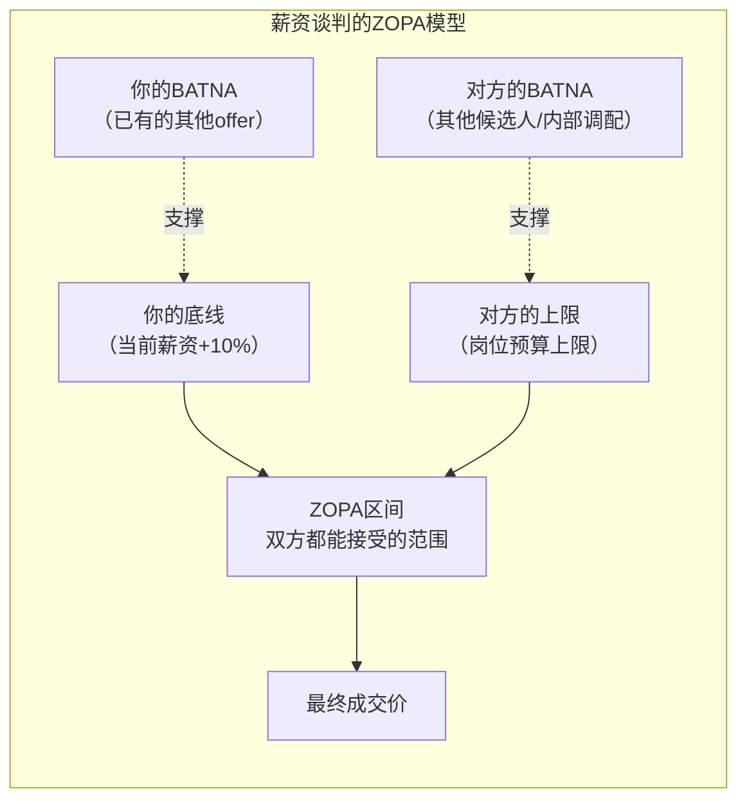
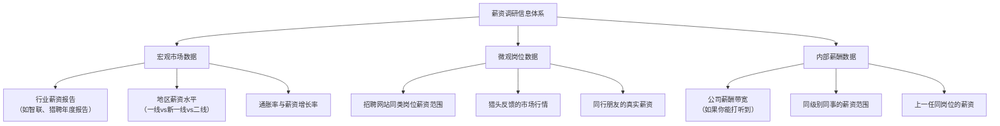
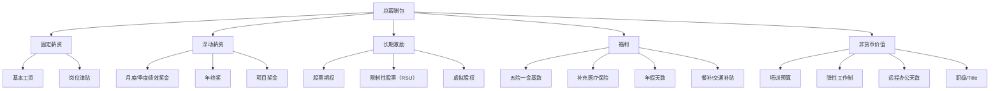
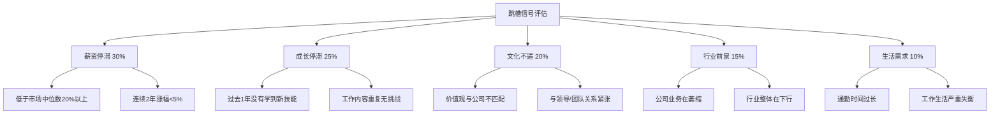
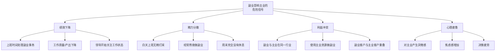

## 4.7 薪资谈判的深层策略

薪资谈判是普通人一生中回报率最高的"投资"之一——一场30分钟的谈判，可能带来每年数万甚至数十万元的收入差距，而且这个差距会随着复利效应在职业生涯中不断放大。假设两个人能力相当，一个在入职时多谈了20%的薪资，另一个人没有谈判就接受了offer，10年后两者的累计收入差距可能超过百万元。

然而，大多数人对薪资谈判存在深深的恐惧。据LinkedIn的一项调查，超过60%的求职者从未在offer阶段尝试过谈判，而在尝试谈判的人中，超过80%获得了至少部分的改善。谈判不是天赋，而是一门可以系统学习的技术。

### 4.7.1 薪资谈判的心理学基础

薪资谈判的本质是一场信息不对称下的心理博弈。理解以下心理学原理，能帮助你从"被动接受"转变为"主动掌控"。

#### 锚定效应（Anchoring Effect）

锚定效应是指人在做决策时，会过度依赖第一个接收到的信息（即"锚点"）。在薪资谈判中，第一个提出数字的人，实际上是在设定整个谈判的参照基准。

Tversky和Kahneman的经典实验表明，即使锚点是随机数字，也会显著影响被试的判断。在薪资谈判场景中，Northcraft和Neale（1987）的研究发现，房地产经纪人对同一房产的估值，会因挂牌价格的不同而产生高达12%的偏差——这说明即使专业人士也无法完全摆脱锚定效应的影响。

**实操策略：**

```text
原则：能先出价就先出价

场景1：HR问"你的期望薪资是多少？"
  应对：不要说"看公司安排"或"都可以"
  正确：基于调研，报一个高于你心理预期15-25%的数字
  话术："根据我对市场的了解，以及我在XX方面的经验，
        我的期望是XX-XX的范围。当然，我也很看重整体的
        发展机会和团队氛围。"

场景2：HR先出了一个低价
  应对：不要直接反驳，而是重新锚定
  话术："感谢您的介绍。根据我的调研和行业对标，
        类似岗位的市场范围在XX-XX之间。
        我想了解一下，这个数字是否还有调整空间？"

场景3：对方出价远超你预期
  应对：保持镇定，不要表现出惊喜
  继续讨论其他条款（奖金、期权、入职时间等），
  为自己争取更多谈判空间
```

**锚定的量化技巧：**

| 场景 | 锚定策略 | 上浮幅度 | 理由 |
|------|----------|----------|------|
| 有竞争力的offer | 市场中位数上浮15-20% | 15-20% | 留出谈判空间，但不至于吓退对方 |
| 多个offer竞争 | 最高offer上浮10% | 10-15% | 以竞争对手为锚点 |
| 内部加薪谈判 | 当前薪资上浮20-30% | 20-30% | 弥补长期未涨的差额 |
| 被动挖角 | 当前薪资上浮30-50% | 30-50% | 对方主动找你，溢价空间大 |

#### 损失厌恶（Loss Aversion）

Kahneman和Tversky的前景理论揭示：人们对损失的敏感度是收益的2-2.5倍。这意味着，"失去100元"带来的痛苦，需要"获得200-250元"才能抵消。

在薪资谈判中，这一原理有两个核心应用：

**应用一：框架效应——把"收益"包装成"损失"**

```text
错误话术（收益框架）：
  "如果能给我加薪，我会更加努力工作。"
  → 对方感受到的是"我需要付出更多成本"

正确话术（损失框架）：
  "我在团队中负责的XX项目目前正处于关键阶段，
   如果我的薪资问题得不到解决，我可能需要重新
   考虑我的职业规划，这对项目来说会是一个损失。"
  → 对方感受到的是"如果不行动，我们会失去一个关键人物"
```

**应用二：创造"损失感"而非威胁**

```text
核心区别：
  威胁："给我涨薪，否则我走。"（对抗性，容易激怒对方）
  损失感："我最近收到了一些外部邀请，说实话有点心动。
           但我在团队投入了很多，不想轻易离开。
           不过如果薪资差距太大，我可能真的要做出艰难的选择了。"
           （真诚表达，让对方感受到可能失去你的风险）

关键前提：你必须真的有替代选项，或者真的有离开的打算。
虚假的威胁会被识破，反而会损害信任关系。
```

#### BATNA与ZOPA：谈判的底层框架

BATNA（Best Alternative to a Negotiated Agreement，最佳替代方案）和ZOPA（Zone of Possible Agreement，可能达成协议的区间）是哈佛谈判项目提出的经典框架，也是薪资谈判的底层逻辑。



**构建你的BATNA：**

BATNA是谈判中最重要的筹码。没有BATNA的谈判，就像没有底牌的赌博。

| BATNA强度 | 具体表现 | 谈判优势 |
|-----------|----------|----------|
| 强BATNA | 手上有1-2个已确认的offer | 可以坚定立场，不怕谈崩 |
| 中BATNA | 正在面试流程中，有初步意向 | 有一定底气，但需要谨慎 |
| 弱BATNA | 只是"可以去看看" | 需要更灵活的策略 |
| 无BATNA | 没有任何替代选项 | 谨慎谈判，以保住关系为主 |

**如何在没有offer的情况下构建BATNA：**

```text
1. 持续面试：即使不打算跳槽，也保持每季度面试1-2家的习惯
   - 这不仅帮你了解市场行情，也帮你保持面试状态
   - 面试反馈本身就是宝贵的信息

2. 内部BATNA：了解公司内部的调岗可能性
   - 如果其他部门愿意接收你，这也是一种替代方案
   - 内部转岗的谈判逻辑与外部不同，但同样有效

3. 能力BATNA：确保你的技能在市场上有需求
   - 考取行业认证、发表技术文章、维护开源项目
   - 这些都是你"即使离开也能找到好工作"的证据

4. 财务BATNA：有一定的储蓄让你有底气说"不"
   - 建议至少有6个月生活费的应急储蓄
   - 财务自由度直接影响你的谈判底线
```

#### 互惠原则（Reciprocity）

Robert Cialdini在《影响力》中揭示：当一个人收到好处或让步时，会感到有义务回报。在薪资谈判中，你可以战略性地使用让步来激发对方的互惠心理。

**实操示例——让步换取让步：**

```text
第一步（表达理解）：
"我理解公司今年的预算有限，也理解团队的整体薪酬结构需要平衡。"

第二步（做出小让步）：
"如果基础薪资的调整幅度有限，我愿意考虑将一部分
 固定薪资转为绩效奖金的形式。"

第三步（期待对方回应）：
"那在绩效奖金的比例上，能否给我一个比较有吸引力的方案？
 比如基础薪资XX，加上季度绩效奖金XX？"

第四步（锁定成果）：
"谢谢您的理解。那我们是否可以确认一下其他细节，
 比如入职时间、年假天数？"
```

#### 社会认同与稀缺性

**社会认同（Social Proof）：**

当你能证明"其他公司也在用类似的薪资吸引同类人才"时，你的报价就更容易被接受。

```text
话术示例：
"我注意到最近几家同行业公司（比如XX、XX）在招类似岗位，
 市场薪资普遍在XX-XX的范围。我希望我们的薪酬方案
 能够具有市场竞争力，这样对双方的长期合作都更有利。"
```

**稀缺性（Scarcity）：**

人们更看重即将失去或难以获得的东西。如果你的时间有限、有多个选择，这本身就是一种稀缺性。

```text
话术示例：
"我手上有一个offer需要在下周五之前回复，
 但我其实更倾向于咱们这边。
 如果能在那之前给我一个确定的方案，
 我会非常感激。"
```

### 4.7.2 薪资谈判的完整准备流程

谈判的胜负，80%在准备阶段就已经决定了。以下是系统化的准备框架。

#### 第一步：市场调研——建立你的信息优势

信息不对称是谈判中最大的敌人。你需要掌握三类信息：



**调研的具体方法：**

| 方法 | 信息质量 | 可操作性 | 注意事项 |
|------|----------|----------|----------|
| 薪资查询网站（看准网、职友集） | ★★★ | ★★★★★ | 数据可能偏旧，注意样本量 |
| 招聘JD中的薪资范围 | ★★★ | ★★★★ | 通常是一个较宽的区间 |
| 猎头咨询 | ★★★★ | ★★★ | 猎头有动机帮你压价（降低企业成本）或抬价（提高佣金） |
| 同行交流 | ★★★★★ | ★★ | 需要信任关系，注意隐私 |
| 行业薪资报告 | ★★★★ | ★★★ | 宏观数据好用，但不够精细 |
| 面试过程中的信息收集 | ★★★★★ | ★★★★ | 每次面试都是收集信息的机会 |

**信息收集的关键问题清单：**

```text
1. 这个岗位在市场上的薪资范围是多少？（P25/P50/P75/P90）
2. 这个岗位在不同公司之间的薪资差异有多大？
3. 同一公司内，这个职级的薪资带宽是多少？
4. 除了基本工资，奖金/期权/福利的占比是多少？
5. 这个岗位的晋升路径和对应的薪资涨幅是多少？
6. 最近半年市场行情是涨还是跌？
```

#### 第二步：自我盘点——量化你的价值

你不是在求别人给你涨薪，你是在证明你值得这个价格。

**价值量化框架：**

```text
你的市场价值 = 基础价值 + 溢价价值

基础价值（由你的资历和能力决定）：
├── 教育背景：学历、学校、专业
├── 工作年限：行业经验、岗位经验
├── 技能栈：硬技能、软技能、证书
└── 过往履历：公司背景、职级

溢价价值（由你的独特贡献决定）：
├── 直接业绩：你为公司创造了多少营收/节省了多少成本？
├── 项目成果：你主导/参与了哪些重要项目？
├── 稀缺技能：你掌握了哪些市场上稀缺的能力？
├── 人脉资源：你带来了哪些客户/合作伙伴？
└── 内部影响力：你在团队中的不可替代性有多高？
```

**量化示例：**

```text
差的表述：
  "我在上家公司工作很努力，领导也很认可我。"

好的表述：
  "在上家公司，我主导了XX系统的重构，
   将系统响应时间从500ms优化到50ms，
   支撑了日均XX万的交易量。
   该项目为公司节省了约XX万的服务器成本，
   我也因此获得了年度最佳员工。"
```

#### 第三步：方案设计——准备多个备选方案

不要只准备一个"要么接受要么拒绝"的方案，而是设计多个组合，让对方有选择余地。

**薪酬包拆解方案：**



**方案组合示例：**

| 方案 | 基本月薪 | 年终奖 | 期权 | 年假 | 总包估值 |
|------|----------|--------|------|------|----------|
| 方案A（高月薪） | 30K | 3个月 | 无 | 10天 | ~45万 |
| 方案B（平衡型） | 25K | 4个月 | 5000股 | 15天 | ~42万+期权价值 |
| 方案C（长期导向） | 22K | 3个月 | 15000股 | 15天 | ~37万+期权价值 |

**设计思路：** 给对方三个方案而不是一个数字，让对方在你的框架内选择，而不是在"接受"和"拒绝"之间选择。

### 4.7.3 不同薪资水平的谈判策略

薪资水平不同，谈判的重心和策略也完全不同。以下是针对三个薪资区间的系统化策略。

#### 初级岗位（月薪5K-15K）：重点争取成长空间

初级岗位的薪资谈判空间有限，因为你的议价能力主要来自潜力而非业绩。此时谈判的核心目标不是"多要2000块"，而是"为自己争取最大的成长加速度"。

| 谈判维度 | 具体策略 | 话术示例 | 优先级 |
|----------|----------|----------|--------|
| 加薪机制 | 争取明确的试用期后加薪承诺 | "如果试用期表现达到预期，加薪幅度是否可以明确？比如在JD范围内上浮X%？" | ★★★★★ |
| 学习资源 | 争取培训预算和学习时间 | "我计划在半年内考取XX认证，公司能否支持培训费用和学习时间？" | ★★★★ |
| 导师制度 | 争取有经验的导师 | "能否安排一位资深同事作为我的入职导师？这对我的快速成长很重要。" | ★★★★ |
| 项目参与 | 争取参与核心项目的机会 | "我希望有机会参与XX项目，这对我的职业发展很重要。" | ★★★ |
| 转岗通道 | 了解内部转岗政策 | "如果我在当前岗位表现出色，是否有内部转岗到XX方向的机会？" | ★★★ |

**初级岗位的薪资谈判时机：**

```text
入职前：可以争取10-15%的上调空间
  → 话术："我很期待加入团队。在薪资方面，根据我的了解，
           这个岗位的市场范围在XX-XX之间，
           我希望能在XX的水平上达成共识。"

试用期转正：是争取加薪的最佳时机
  → 话术："试用期这三个月，我完成了XX项目，
           得到了XX的好评。关于转正后的薪资，
           我希望能按照当初沟通的方案，调整到XX水平。"

年度调薪：提出系统性诉求
  → 话术："过去一年，我在XX方面取得了XX成果。
           希望薪资能反映我的贡献和成长。"
```

#### 中级岗位（月薪15K-30K）：重点争取薪酬结构优化

中级岗位是"夹心层"——你有足够的经验去谈判，但还没有到"猎头主动找你"的程度。这个阶段的谈判重点是优化薪酬结构，而不是单纯追求月薪数字。

| 谈判维度 | 具体策略 | 话术示例 | 优先级 |
|----------|----------|----------|--------|
| 绩效奖金 | 将部分固定薪资转为绩效奖金 | "我建议采用'固定+绩效'的结构，比如80%固定+20%绩效，这样既能保障基础，又能激励我创造更多价值。" | ★★★★★ |
| 股权激励 | 争取参与股权激励计划 | "除了现金薪酬，我希望了解公司是否有股权激励计划？我对公司的长期发展很有信心。" | ★★★★ |
| 职级匹配 | 确保职级与职责匹配 | "我目前负责的工作内容已经涵盖了XX级别的职责，我希望职级能相应调整。" | ★★★★ |
| 弹性福利 | 争取定制化福利 | "除了标准福利外，是否可以增加XX（如补充医疗、健身补贴、额外年假等）？" | ★★★ |
| 调薪周期 | 缩短调薪周期 | "能否将年度调薪改为半年度调薪？这样我的表现能更快反映在薪酬上。" | ★★★ |

**绩效奖金谈判的注意事项：**

```text
关键问题清单：
1. 绩效奖金的计算方式是什么？（固定金额 vs 绩效系数 vs 团队目标）
2. 绩效评估的标准是什么？（谁来评？评什么？怎么评？）
3. 过去几年的绩效奖金实际发放情况如何？
4. 绩效不达标时，奖金是0还是有保底？
5. 离职时未发放的绩效奖金如何处理？

建议：口头承诺不可靠，尽量争取书面确认
  - 在offer letter中明确奖金的计算方式和发放条件
  - 如果对方说"到时候再说"，要追问"能否写进合同补充协议？"
```

#### 高级岗位（月薪30K+）：重点争取整体薪酬包

高级岗位的薪资谈判，已经远远超出了"月薪"的范畴。你需要关注的是整体薪酬包（Total Compensation Package），包括年薪、奖金、股权、签约金、离职补偿等。

| 谈判维度 | 具体策略 | 话术示例 | 优先级 |
|----------|----------|----------|--------|
| 整体薪酬包 | 关注年薪总额而非月薪 | "我更关注年度总薪酬包，包括固定薪资、年度奖金、长期激励和福利的综合。" | ★★★★★ |
| 签约奖金 | 争取一次性签约金 | "考虑到我放弃的其他机会和当前公司的未发放奖金/期权，能否提供签约奖金作为补偿？" | ★★★★ |
| 股权细节 | 深入谈判期权条款 | "关于期权，我希望了解：行权价、vesting schedule、cliff期、加速条款等细节。" | ★★★★★ |
| 退出条款 | 争取有利的离职条款 | "关于离职条款，我希望了解：如果是公司原因导致的离职，未vest的期权如何处理？" | ★★★★ |
| 竞业限制 | 谈判竞业条款的范围和补偿 | "关于竞业限制协议，我希望条款范围合理，并有相应的竞业补偿。" | ★★★★ |
| 工作条件 | 争取弹性工作和自主权 | "除了薪酬，我也很看重工作的灵活性。能否明确远程办公的天数和弹性工作时间？" | ★★★ |

**高级岗位谈判的"沉默力量"：**

```text
高级岗位谈判中，沉默是最强大的工具之一。

场景：对方报了一个数字后
  普通反应：马上回应（接受、反驳或讨价还价）
  高手反应：沉默3-5秒，然后说"嗯……"（表现出在认真考虑）
  
为什么有效：
  - 对方会主动补充信息来填补沉默
  - 对方可能会主动加码（"当然，这个数字还可以再讨论"）
  - 你给自己争取了思考时间

使用场景：
  - 对方首次报价后
  - 对方提出一个条件后
  - 你不确定如何回应时
```

### 4.7.4 薪资谈判的实战流程

以下是薪资谈判的完整实战流程，从收到offer到最终确认。

#### 第一阶段：收到offer后的响应

```text
关键原则：永远不要当场接受

收到offer后的标准动作：
1. 表达感谢和兴趣："非常感谢offer，我对这个机会非常感兴趣。"
2. 争取时间："我需要一两天时间仔细考虑，可以明天/后天给您答复吗？"
3. 获取书面offer："能否发一份正式的offer letter？我想仔细看看具体条款。"
4. 分析offer细节（见下方清单）
```

**offer分析清单：**

```text
□ 基本工资：税前还是税后？月薪还是年薪？
□ 试用期：多长时间？薪资是否打折？打折比例？
□ 绩效奖金：计算方式？发放频率？保底情况？
□ 年终奖：几个月？是否与公司业绩挂钩？
□ 股票/期权：数量？行权价？vesting schedule？cliff期？
□ 五险一金：缴纳基数？是否按实际工资缴纳？
□ 补充福利：商业保险？补充公积金？餐补？交通补贴？
□ 年假：几天？是否包含法定假日？
□ 工作时间：是否有加班文化？加班是否有补偿？
□ 试用期离职：提前几天通知？
□ 竞业限制：是否有？范围？补偿？
□ 其他条款：培训协议？保密协议？知识产权归属？
```

#### 第二阶段：提出你的方案

**counter-offer的结构：**

```text
邮件/消息模板：

XX经理您好，

再次感谢贵公司的offer，我对加入XX团队非常期待。

关于offer中的薪资部分，我做了详细的市场调研和自我评估，
希望能和您进一步沟通。

我的考虑如下：
1. 根据市场调研，XX岗位（X年经验）在XX城市的
   薪资范围通常在XX-XX之间
2. 我在XX方面有X年经验，主导过XX项目，
   带来了XX的业绩增长
3. 考虑到这些因素，我期望的薪资范围是XX-XX

当然，我也理解公司有整体的薪酬体系，
如果有其他方式可以补充（如签约奖金、额外年假等），
我也非常愿意探讨。

期待您的反馈。
```

#### 第三阶段：谈判对话

**常见场景的应对话术：**

```text
场景1：HR说"这是我们的最高预算了"
  → 追问："我理解预算限制。那在其他方面是否有灵活空间？
           比如签约奖金、提前调薪、额外年假等？"
  → 试探："如果我接受这个数字，是否可以在试用期缩短
           或者提前调薪方面做些安排？"

场景2：HR说"你的期望超出了我们的范围"
  → 了解："能否告诉我这个岗位的薪资范围是多少？"
  → 强调价值："我理解，但我希望您能考虑XX因素，
               这些是我区别于其他候选人的地方。"

场景3：HR说"我们需要内部审批"
  → 争取承诺："我理解需要审批流程。
               如果审批通过，最快什么时候可以确定？"
  → 设置deadline："我手上有一个offer需要在XX之前回复，
                  如果能在那之前给我一个确定的答复，
                  我会非常感激。"

场景4：HR施加时间压力
  → 不要慌："我理解您希望尽快确定，但这是一个重要的决定，
             我希望做出慎重的选择。能否给我XX天时间？"
  → 反向施压："我也很希望尽快加入，但如果能给我多一点
               时间考虑，我相信我能做出对双方都最好的决定。"

场景5：HR说"我们给你的已经是special offer了"
  → 核实："非常感谢公司的诚意。能否告诉我，
          这个offer具体special在哪里？
          是基本工资还是奖金部分做了调整？"
  → 不要轻易被"special"标签吓住，追问具体数字
```

#### 第四阶段：达成协议后的确认

```text
达成口头协议后，务必做以下确认：

1. 书面确认：要求对方发送修改后的正式offer letter
   → "非常感谢我们达成的共识，能否更新offer letter中的相关条款？"

2. 核对细节：逐项对照之前的讨论，确保所有承诺都写进了文件
   → 特别注意：口头承诺但没写进合同的条款，法律效力有限

3. 确认入职流程：报到时间、所需材料、入职培训安排
   → "入职前我需要准备哪些材料？第一天的安排是怎样的？"

4. 感谢：给帮助你的人发感谢信息
   → 猎头、HR、面试官、推荐人
```

### 4.7.5 特殊场景的谈判策略

#### 内部加薪谈判

内部加薪与跳槽谈判有本质区别——你面对的是一个已经了解你工作表现的人，而且你们的关系还会持续。

| 维度 | 跳槽谈判 | 内部加薪 |
|------|----------|----------|
| 信息不对称 | 对方不了解你的实际能力 | 对方了解你的工作表现 |
| 关系持续性 | 谈崩了就不来 | 谈崩了还要继续共事 |
| 对方动机 | 想招你进来 | 想留住你但预算有限 |
| 谈判空间 | 较大（薪资带宽宽） | 较小（受公司薪酬体系约束） |
| BATNA重要性 | 非常重要 | 极其重要 |

**内部加薪的最佳时机：**

```text
1. 刚完成一个重要项目或里程碑
   → 你的价值刚被验证，有具体成果可谈

2. 年度/半年度绩效评估后
   → 如果绩效优秀，这是最自然的加薪窗口

3. 承担了新职责或新角色后
   → 职责增加了，薪资应该相应调整

4. 收到外部offer时（谨慎使用）
   → 这是最强的筹码，但也最容易伤害关系
   → 建议：不要直接说"我有offer"，而是"我在认真考虑职业发展"
```

**内部加薪的话术框架：**

```text
第一步：预约正式沟通
"XX总，关于我的职业发展和薪酬，我希望能和您做一次正式的沟通。
 您看这周什么时间方便？"

第二步：展示价值
"过去一年，我在以下几个方面取得了比较明显的成果：
 1. 主导了XX项目，为公司带来了XX的收益
 2. 优化了XX流程，将效率提升了XX%
 3. 带领团队完成了XX目标"

第三步：提出诉求
"基于这些贡献，以及我对市场行情的了解，
 我希望薪资能从目前的XX调整到XX的水平。
 这个数字是基于XX因素综合考虑的。"

第四步：留有余地
"当然，我也理解公司有整体的薪酬体系和预算安排。
 如果短期无法达到这个水平，
 是否可以制定一个分阶段的调薪计划？"
```

#### 应届毕业生的薪资谈判

应届毕业生通常缺乏谈判筹码，但并不意味着没有谈判空间。

```text
应届生的谈判策略：

1. 用实习表现说话
   "在实习期间，我独立完成了XX项目，
    获得了导师和团队的一致好评。
    我希望正式入职的薪资能反映我在实习中的实际贡献。"

2. 用多个offer竞争
   "我目前手上有两个offer，薪资分别是XX和XX。
    我更倾向于贵公司，但希望薪资能有一定的竞争力。"

3. 争取入职后的快速调薪机制
   "我理解应届生的薪资标准。但如果入职后6个月内
    表现优秀，是否有快速调薪的通道？"

4. 谈判非货币条件
   "薪资方面我没有太多异议，但能否在以下方面做些安排：
    入职后的培训计划、转岗机会、或者弹性工作时间？"
```

#### 35岁以上的薪资谈判

35岁以上的职场人面临的最大挑战是"年龄偏见"。但你的经验、判断力和人脉，正是年轻候选人无法替代的优势。

```text
核心策略：把"年龄"转化为"经验溢价"

1. 强调行业积累
   "我在XX行业有12年的经验，经历了行业的三个完整周期。
    这种深度的行业理解，能够帮助公司避免很多弯路。"

2. 强调人脉和资源
   "我在这个领域积累了广泛的人脉，
    包括XX公司的XX、XX公司的XX。
    这些资源能够直接为业务带来价值。"

3. 强调稳定性
   "与年轻候选人相比，我的优势是稳定性。
    我已经过了频繁跳槽的阶段，
    更看重长期的发展和深度的业务参与。"

4. 接受合理的薪资预期
   "我的薪资预期是基于我的经验和能力，
    但我也理解市场的现实。
    如果公司有完善的激励机制，
    我愿意在基础薪资上做一定的灵活调整。"
```

### 4.7.6 跳槽时机的科学判断

#### 跳槽信号评估模型



**评分标准：** 每个信号打分1-5分，加权计算总分

| 总分区间 | 判断 | 行动建议 |
|----------|------|----------|
| 4.0-5.0 | 强烈建议行动 | 立即开始求职，不要犹豫 |
| 3.5-4.0 | 建议开始看机会 | 更新简历，开始接触猎头 |
| 2.5-3.5 | 可以留意机会 | 保持市场敏感度，持续提升 |
| 1.5-2.5 | 暂时稳定 | 专注内部提升，做好本职工作 |
| 1.0-1.5 | 状态良好 | 享受当前工作，保持竞争力 |

#### 跳槽的最佳时机窗口

| 时机窗口 | 原因 | 竞争程度 | 涨薪空间 | 注意事项 |
|----------|------|----------|----------|----------|
| 年后2-3月 | 年终奖发完，招聘旺季开始 | 高 | 中 | 最多人选择的时机，竞争激烈 |
| 金九银十（9-10月） | 秋招季，公司为来年储备人才 | 高 | 中 | 适合有经验的候选人 |
| 年中6-7月 | 中期盘点后，公司补招 | 中 | 中高 | 岗位选择相对少，但竞争也小 |
| 行业风口期 | 相关岗位需求暴增 | 低 | 高 | 需要判断是短期泡沫还是长期趋势 |
| 项目完成/获奖时 | 个人价值得到证明 | 低 | 高 | 带着"战果"去面试，说服力最强 |
| 被猎头主动联系时 | 对方有明确需求和预算 | 低 | 很高 | 最好的时机之一，但要验证机会真实性 |

#### 跳槽的薪资涨幅参考

```text
薪资涨幅参考区间（税前年薪）：

正常跳槽（同行业同岗位）：     20-30%
跨行业跳槽（技能可迁移）：     30-50%
管理岗跳槽：                   30-50%
被动挖角（顶级人才）：         50-100%
创业公司→大厂：                10-20%（但稳定性提升）
大厂→创业公司：                30-50%（含期权的总包可能更高）

低于20%涨幅的跳槽，需要慎重考虑：
  → 除非有其他重要因素（如更好的平台、更近的通勤、
     更好的行业方向、更有前景的岗位等）
  → 跳槽本身有隐性成本：适应期、试用期风险、失去内部积累
```

**薪资涨幅的谈判策略：**

```text
当对方问"你目前的薪资是多少"时：

策略1：如实告知 + 强调期望
  "我目前的年薪是XX，但我对新机会的期望是XX。
   这个期望是基于市场行情和我的能力评估，
   而不是简单的百分比涨幅。"

策略2：反问了解范围
  "我想先了解一下这个岗位的预算范围，
   然后再结合我目前的情况给出一个合理的期望。"

策略3：提供总包数据（如果你的base较低但奖金高）
  "我目前的总薪酬包是XX，包括基本工资、奖金和期权。
   我对新机会的总包期望是XX。"

注意：部分公司（尤其是外企）会要求提供薪资证明
  → 确保你报的数字经得起验证
  → 如果薪资较低，可以解释原因（如"当时是应届入职/内部转岗"）
```

### 4.7.7 副业与主业的平衡策略

副业是增加收入的重要手段，但如果处理不当，可能会损害你的主业——而主业才是你收入的根基。

#### 副业影响主业的危险信号



**每个信号的应对方案：**

| 信号 | 紧急应对 | 长期调整 |
|------|----------|----------|
| 绩效下降 | 立即减少副业投入，优先保障主业 | 设定硬性规则：工作日不碰副业 |
| 精力分散 | 暂停副业1-2周，恢复精力 | 优化时间管理，保障睡眠质量 |
| 利益冲突 | 立即停止涉及冲突的副业内容 | 选择与主业完全不同的副业方向 |
| 心理疲惫 | 降低副业频率和强度 | 将副业节奏调整为长期可持续模式 |

#### 主业与副业的最优时间分配

| 阶段 | 周期 | 主业投入 | 副业投入 | 关键目标 | 里程碑 |
|------|------|----------|----------|----------|--------|
| 探索期 | 0-3月 | 90% | 10%（每周3-5小时） | 找到可行的副业方向 | 确定1-2个方向并开始尝试 |
| 验证期 | 3-6月 | 80% | 20%（每周8-10小时） | 验证副业的商业模式 | 产生第一笔副业收入 |
| 增长期 | 6-12月 | 70% | 30%（每周12-15小时） | 规模化副业收入 | 副业收入达到主业的20% |
| 稳定期 | 12月+ | 60% | 40%（每周15-20小时） | 稳定和优化 | 副业收入达到主业的50% |
| 转型期 | 条件成熟时 | 逐步交接 | 全职投入 | 完成职业转型 | 副业收入稳定超过主业 |

**转型的决策标准：**

```text
不要仅凭"副业收入超过主业"就辞职，还需要满足：

□ 副业收入已连续6个月以上稳定超过主业
□ 副业有可复制的增长模型，而非依赖个别客户
□ 有足够的储蓄覆盖至少12个月的生活费
□ 副业有明确的长期发展路径
□ 家庭/伴侣支持你的决定
□ 你已经想清楚了社保、公积金等实际问题的解决方案
□ 你对"没有固定收入"的心理压力有充分准备

满足其中5条以上，才建议考虑全职转型。
```

#### 副业收入的税务与法律合规

```text
常见副业形式的税务处理：

1. 兼职/顾问收入
   - 属于"劳务报酬"
   - 预扣税率：20%（800元以下免税）
   - 年终汇算清缴，并入综合所得

2. 自媒体/知识付费
   - 可能属于"经营所得"（如果有营业执照）
   - 或"劳务报酬"（如果没有）
   - 建议：收入达到一定规模后，注册个体工商户

3. 电商/微商
   - 需要工商注册
   - 需要依法纳税
   - 注意：朋友圈卖货也需要合规

法律风险提醒：
  - 检查劳动合同中是否有竞业限制条款
  - 确保副业不违反公司的知识产权条款
  - 避免使用公司资源（电脑、账号、客户信息等）做副业
  - 如果副业涉及教育、医疗、金融等行业，需要相关资质
```

### 4.7.8 常见谈判误区与纠正

#### 误区一：不敢开口谈

```text
错误想法："谈薪资会不会显得我很贪心？""万一谈崩了怎么办？"

现实情况：
  - 不谈才是最大的损失。每年少谈2万，10年就是20万+
  - 对方期望你谈。HR的预算通常比他们第一次报的高10-20%
  - 谈崩的概率极低。除非你要求离谱，否则最差结果就是维持原价

纠正方法：
  - 把谈判看作"专业讨论"而非"冲突"
  - 提前排练话术，降低开口的心理门槛
  - 记住：你不是在"要"，而是在"证明你值"
```

#### 误区二：只关注月薪数字

```text
错误做法："我只要月薪到XX就行。"

问题所在：
  - 月薪只是薪酬包的一部分
  - 税前和税后差距可能很大
  - 五险一金基数、年终奖、期权等才是大头
  - 同样月薪3万，一个年终6个月，一个年终0个月，
    年收入差距就是18万

纠正方法：
  - 始终用"年度总包"（Total Compensation）来评估
  - 详细拆解offer的每一个组成部分
  - 用Excel计算税后实际到手金额
```

#### 误区三：接受第一个offer

```text
错误做法："offer已经很好了，我不好意思再谈。"

数据支撑：
  - 据Salary.com统计，不谈判的候选人平均每年少赚7.5%
  - 84%的雇主在首次报价时留有谈判空间
  - 谈判成功的平均涨幅为7-10%

纠正方法：
  - 永远不要当场接受offer
  - 至少给自己24小时的考虑时间
  - 准备一个counter-offer，哪怕只调5%
```

#### 误区四：用威胁来谈判

```text
错误做法："如果不给我涨薪，我就走。"

问题所在：
  - 威胁会破坏信任关系
  - 即使成功了，领导也会开始寻找你的替代者
  - 你被列入"不稳定因素"名单

纠正方法：
  - 用"信息传递"代替"威胁"
  - 不说"不涨薪就走"，说"我在认真考虑我的职业发展方向"
  - 不说"我有offer"，说"最近收到了一些邀请，让我在认真思考"
  - 让对方感受到风险，而不是受到威胁
```

#### 误区五：只谈钱不谈其他

```text
错误做法："我就关心到手多少钱。"

遗漏的价值：
  - 弹性工作制：每周省下2小时通勤 = 一年100小时 = 价值数千元
  - 额外年假：每多一天假 = 一天的工资 + 精神恢复价值
  - 培训机会：一次高质量培训 = 数万元的能力提升
  - 好的团队：减少内耗 = 提升幸福感和工作效率
  - 职业平台：大厂背景 = 未来跳槽的溢价

纠正方法：
  - 用"总价值"视角评估offer
  - 把非货币条件的价值量化
  - 综合考虑3-5年的发展，而不是只看眼前
```

#### 误区六：谈判后不书面确认

```text
错误做法："口头说好了就行。"

风险：
  - 人事变动：谈好的HR离职了，新HR不认账
  - 理解偏差：你以为说的是税后，对方理解为税前
  - 无法举证：口头承诺没有法律效力

纠正方法：
  - 所有谈判结果必须写进offer letter或合同
  - 如果对方说"这个不方便写进去"，要追问"那怎么保证执行？"
  - 谈判结束后发一封确认邮件，总结所有达成的共识
```

### 4.7.9 薪资谈判的长期策略

薪资谈判不是一次性的事件，而是贯穿整个职业生涯的系统性工程。

#### 建立你的"谈判档案"

```text
建议维护一份持续更新的个人职业档案，包含：

1. 业绩清单：每完成一个项目，记录成果和数据
   → 格式："主导XX项目，实现XX目标，带来XX价值"

2. 技能清单：每学一项新技能或获得认证，及时更新
   → 包括技术技能、管理技能、语言能力、行业认证

3. 市场行情：每季度更新一次市场薪资数据
   → 关注行业报告、招聘网站、猎头反馈

4. 人脉清单：维护行业人脉网络
   → 包括猎头、同行、前同事、行业社群

5. offer记录：保存所有收到过的offer
   → 作为未来谈判的参照基准

这份档案在以下场景会用到：
  - 年度调薪谈判
  - 跳槽时准备简历和面试
  - 绩效评估时展示价值
  - 自信心不足时提醒自己的成就
```

#### 每年至少做一次市场对标

```text
市场对标的具体步骤：

1. 更新简历（即使不找工作）
   → 倒逼自己总结过去一年的成果

2. 接触1-2个猎头
   → 了解市场行情，获取岗位信息

3. 参加1-2次面试
   → 检验自己的市场价值
   → 收集薪资数据

4. 与同行交流
   → 了解行业趋势
   → 校准自己的薪资预期

5. 评估内部发展
   → 与领导沟通职业规划
   → 了解内部晋升和调薪的机会
```

#### 职业生涯各阶段的薪资策略

| 阶段 | 年龄参考 | 薪资策略 | 重点投资 |
|------|----------|----------|----------|
| 起步期 | 22-25岁 | 优先选择平台和学习机会 | 技能积累、行业认知、人脉基础 |
| 成长期 | 25-30岁 | 通过跳槽和谈判快速提升 | 专业深度、项目经验、管理能力 |
| 黄金期 | 30-35岁 | 争取高薪+股权 | 行业影响力、领导力、商业思维 |
| 稳定期 | 35-40岁 | 关注整体薪酬包和稳定性 | 战略眼光、资源整合、副业收入 |
| 转型期 | 40岁+ | 从"挣工资"转向"挣回报" | 投资收益、创业收入、顾问收入 |


### 4.7.10 本节核心要点总结

```text
薪资谈判的10条铁律：

1. 永远准备，永远不裸谈
   → 谈判胜负80%在准备阶段决定

2. 先出价，掌握锚点
   → 让对方在你的框架内讨论

3. 用BATNA构建底气
   → 没有替代方案的谈判是乞求

4. 量化你的价值
   → 用数据说话，不用形容词

5. 关注总包，不只看月薪
   → 年度总包才是真正的收入

6. 谈判是对话，不是对抗
   → 互惠让步比强硬坚持更有效

7. 书面确认，口头不算
   → 写进合同的才是你的

8. 不要当场接受
   → 给自己思考和调研的时间

9. 长期经营，持续对标
   → 每年至少做一次市场价值评估

10. 心态决定一切
    → 你不是在"要"，你是在"证明你值"
```
