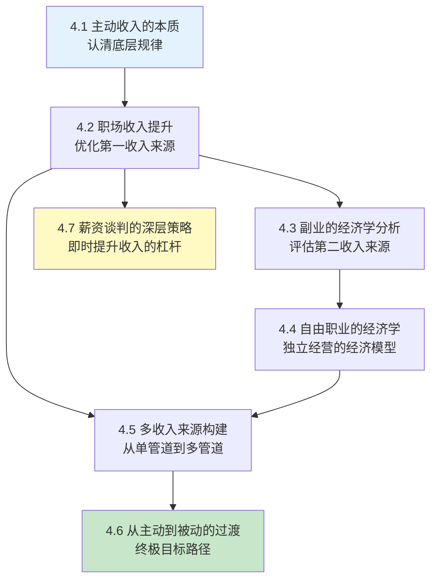

## 本节小结：理论基础的完整框架

本节（4.1—4.7）用七个小节构建了一套完整的主动收入认知体系。如果你只记住了零散的概念，这一节的目标是帮你把它们串成一条逻辑链——从"理解主动收入是什么"到"掌握薪资谈判的博弈技巧"，每一步都是下一步的基础。

### 七节内容的核心逻辑链



这条链的逻辑是：先理解主动收入的本质和局限（4.1），然后在三条主线上发力——优化职场收入（4.2）、拓展副业（4.3）、考虑自由职业（4.4），三条线汇聚到多收入来源的系统构建（4.5），最终指向从主动收入向被动收入的过渡（4.6）。而薪资谈判（4.7）是贯穿全程的"即时杠杆"——不管你在哪个阶段，谈判能力都能立刻带来收入提升。

### 七大核心模型回顾

#### 模型一：主动收入的定价公式（来自 4.1）

```text
你的收入 = 边际产出价值 × 供需稀缺系数
```

边际生产力理论告诉我们：收入不取决于你有多努力，而取决于你每小时创造多少价值。一个人每天工作12小时但每小时产出价值100元，收入不如每天工作8小时但每小时产出价值500元的人。这是整个理论基础的起点——**提升收入的根本路径是提升单位时间的产出价值，而不是延长工作时间**。

#### 模型二：薪资的三系数乘法（来自 4.2）

```text
薪资 = 岗位基准价 × 个人溢价系数 × 公司支付系数
```

- **岗位基准价**：行业 × 城市 × 职能，决定了你的"底价"
- **个人溢价系数**：技能稀缺度 × 成果证明 × 议价能力，决定了你比"标准"值多少
- **公司支付系数**：公司盈利能力 × 薪酬策略 × 人才竞争强度，决定了你能拿到多少

三个系数是乘法关系，任何一个为零，薪资就上不去。这个模型的实操意义是：**不要只在一个系数上使劲**。提升技能（个人溢价）的同时，也要选对行业和城市（岗位基准价），还要选对平台（公司支付系数）。

#### 模型三：副业的机会成本计算（来自 4.3）

```text
副业真实收益 = 副业直接收入 - 机会成本
```

机会成本 = 同等时间用于主业加班/学习的预期收入增长，或用于休息恢复的长期健康价值。只有当副业时薪明显高于主业时薪（至少1.5倍），或者副业具有主业无法提供的长期价值（技能积累、被动收入潜力）时，才值得做。

比较优势理论进一步指出：你应该选择的不是"你能做的最赚钱的事"，而是"你的时间成本最低 + 市场愿意付费最高"的交集。

#### 模型四：自由职业的有效时薪（来自 4.4）

```text
有效时薪 = 项目收入 ÷ 总投入时间（含沟通、修改、管理、收款）
```

自由职业者本质上是一人企业，同时承担生产者、销售者、管理者、研发者四个角色。因此自由职业的收入必须高于打工时薪的2-3倍，才能维持同等生活水平。定价策略应从"按时"逐步过渡到"按价值"——从成本定价到市场定价到价值定价。

#### 模型五：收入来源的风险量化（来自 4.5）

```text
风险暴露 = 收入中断概率 × 中断持续时间 × 生活开支刚性
```

单一收入来源的风险暴露值远高于多收入来源。三个收入来源即使每个都不如单一工资高，综合风险暴露却可以降低到原来的1/8。多收入来源不是"锦上添花"，而是抗风险的基础设施。

#### 模型六：三种资本的转化（来自 4.6）

| 资本类型 | 来源 | 转化方向 | 转化周期 |
|---------|------|---------|---------|
| 金融资本 | 主动收入的储蓄 | → 投资本金 → 资本收益 | 1-5年 |
| 人力资本 | 工作中积累的技能和知识 | → 产品 → 版税/授权收入 | 6-24个月 |
| 社会资本 | 行业人脉、个人品牌 | → 流量 → 广告/社群收入 | 12-36个月 |

从主动收入到被动收入的过渡，本质上是这三种资本的积累和转化。最常见的错误是只关注其中一种而忽视其他两种——只存钱不投资、只学技能不输出、只积累粉丝不变现。

#### 模型七：薪资谈判的博弈框架（来自 4.7）

```text
谈判结果 = f(你的BATNA强度, 信息对称程度, 锚定策略, 框架效应)
```

- **BATNA（最佳替代方案）**：你手上有没有其他offer，决定了你的底气
- **锚定效应**：第一个出价的人设定参照基准，能先出价就先出价
- **损失厌恶**：把"收益"包装成"损失"更有效——"如果问题不解决，我可能需要重新考虑职业规划"
- **ZOPA（可能达成协议的区间）**：你的底线和对方上限之间的交集

### 关键指标速查表

以下指标贯穿整个理论基础，是衡量主动收入健康度的核心参数：

| 指标 | 含义 | 健康值 | 警戒值 | 计算方式 |
|------|------|--------|--------|---------|
| 有效时薪 | 每小时实际创造的价值 | >200元 | <50元 | 月收入 ÷ 实际工作小时数 |
| 储蓄率 | 收入中留存的比例 | >30% | <10% | (收入-支出) ÷ 收入 |
| 收入来源数 | 不依赖单一工资的收入管道 | ≥3 | =1 | 独立收入来源的数量 |
| 副业ROI | 副业投入的时间回报率 | >主业时薪×1.5 | <主业时薪 | 副业收入 ÷ 副业投入时间 |
| 被动收入占比 | 无需持续劳动的收入比例 | >30% | =0% | 被动收入 ÷ 总收入 |
| 技能稀缺度 | 你的技能在市场上的稀缺程度 | 做得独特/无可替代 | 会做/做得好 | 同类人才供给量/市场需求量 |
| BATNA强度 | 谈判中的替代选项质量 | 有确认offer | 无替代方案 | 替代方案的可行性和吸引力 |

### 常见的认知误区

理论基础七节内容中反复出现了一些需要警惕的思维陷阱，在此统一梳理：

**误区一：努力就能涨薪**
4.1 已经用边际生产力理论说明：收入取决于产出价值，而非投入时长。每天加班到深夜但产出价值不变，薪资不会涨。正确的做法是提升单位时间的产出价值——学更稀缺的技能、解决更高难度的问题。

**误区二：选对行业就够了**
4.2 的三系数模型表明：行业只是三个系数中的一个。选对了行业但没有差异化技能（个人溢价系数低），或者选了一个盈利能力差的公司（公司支付系数低），薪资照样上不去。

**误区三：副业一定比主业赚钱慢**
4.3 的机会成本分析表明：这取决于你选择什么副业。即时变现型副业（如家教、咨询）可以在第一周就产生收入。真正需要警惕的不是"副业赚钱慢"，而是"副业时薪低于主业时薪"——这种副业在经济学上是负收益的。

**误区四：自由职业 = 自由**
4.4 明确指出：自由职业者同时承担四个角色，工作时间往往超过上班族。自由职业的"自由"是时间安排的自由，不是工作量的自由。而且收入波动大、福利保障缺失，需要更高的收入才能维持同等生活水平。

**误区五：收入来源越多越好**
4.5 的风险量化模型表明：关键不是数量，而是每条管道的质量和独立性。如果三个副业都依赖同一种技能、同一个客户群，风险并没有真正分散。理想的多收入来源应该跨越不同的技能领域和客户群体。

**误区六：被动收入不需要前期投入**
4.6 的三种资本转化模型表明：被动收入需要前期投入金融资本（本金）、人力资本（技能产品化）或社会资本（个人品牌）。这些投入的周期从6个月到5年不等。没有前期投入的"被动收入"只有两种可能：骗局或者极低收益。

**误区七：谈判会得罪人**
4.7 的数据表明：超过80%的尝试谈判者获得了至少部分改善。谈判是正常的商业行为，不谈判反而可能被低估。关键在于用专业的方式谈判——有数据支撑、有替代方案、有合理的框架效应。

### 理论到实践的桥梁

理论基础的七节内容建立了一套完整的认知框架，但认知本身不产生收入。从理论到实践，你需要三个步骤：

**第一步：诊断现状**
用 4.1 的有效时薪公式计算你当前的真实时薪，用 4.2 的三系数模型分析你薪资的瓶颈在哪里，用 4.5 的风险模型评估你收入来源的脆弱程度。

**第二步：选择路径**
根据你的诊断结果，选择最需要优先发力的方向：

- 如果你的瓶颈在"岗位基准价"太低 → 考虑换行业或换城市（4.2）
- 如果你的瓶颈在"个人溢价系数"太低 → 深耕稀缺技能（4.2）
- 如果你有余力且主业时薪不高 → 开拓高时薪副业（4.3）
- 如果你有专业技能且渴望独立 → 评估自由职业的可行性（4.4）
- 如果你已经有稳定收入但缺乏安全感 → 构建多收入来源（4.5）
- 如果你已经有多收入来源 → 推动收入产品化，向被动收入过渡（4.6）

**第三步：立即行动**
不管你在哪一步，薪资谈判（4.7）都是可以立刻执行的行动。一场30分钟的谈判，可能带来每年数万元的收入差距——这是所有理论中回报率最高的实操技能。

### 下一步：核心技巧

理论基础建立了"道"——你理解了主动收入的本质、定价机制、增长路径和过渡方向。接下来的核心技巧部分将给出"术"——薪资谈判的五步法、副业选择的三圈模型、自由职业定价技巧、个人品牌打造路径等可直接执行的方法论。

理论告诉你"为什么"，技巧告诉你"怎么做"。两者缺一不可。
