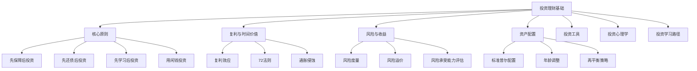
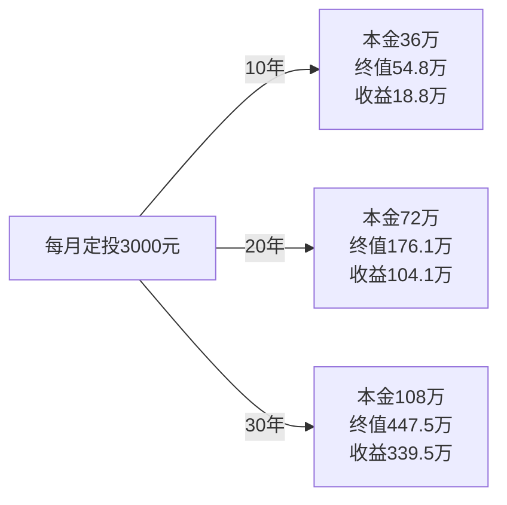
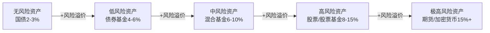
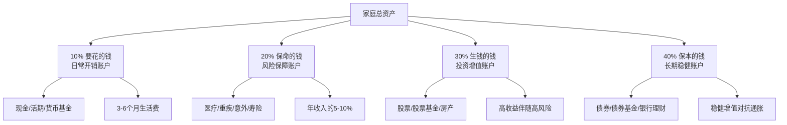
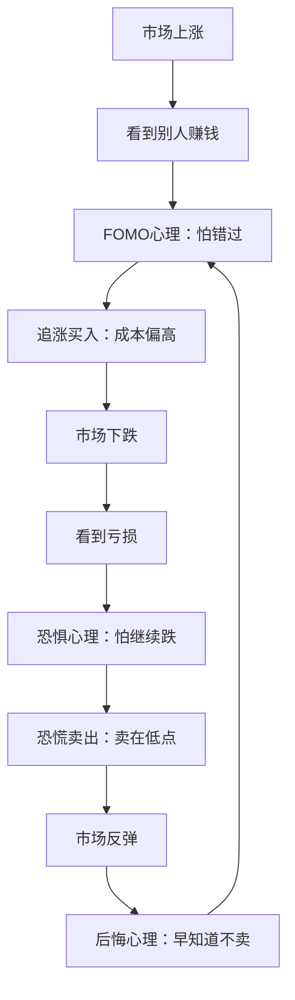
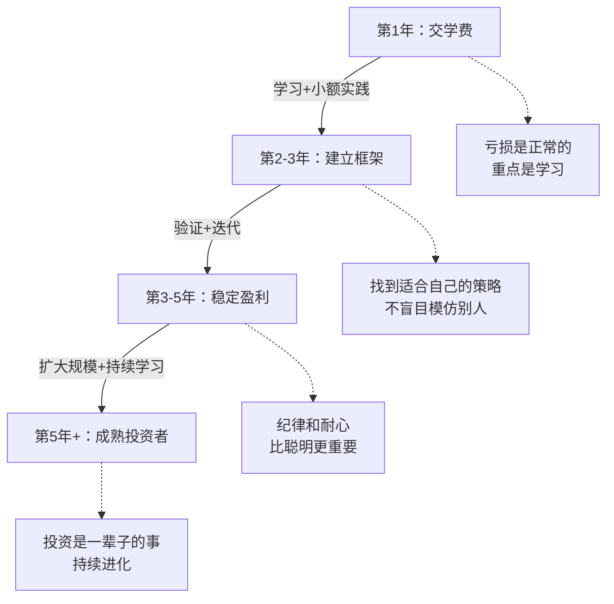

# 第五章：投资理财基础

> "投资不是为了一夜暴富，而是为了让财富稳健增长。" —— 沃伦·巴菲特

投资理财是财富增长的核心引擎。许多人对投资有误解——要么认为是赌博，要么期待一夜暴富。事实上，投资是一门可以系统学习的学科，有清晰的理论框架、成熟的方法论和可验证的实践路径。本章将从底层原理出发，帮你建立正确的投资理念，理解风险与收益的关系，掌握资产配置框架，并熟悉主流投资工具。



***

## 5.1 投资理财的核心原则

投资的成败往往不取决于你选了哪只股票，而取决于你是否遵守了基本原则。这些原则看似简单，但违反它们的代价往往是真金白银的损失。

### 5.1.1 先保障后投资

投资的本质是用闲钱博取收益，而不是拿生活必需的钱去冒险。在投资之前，你必须先建立保障体系——这是投资的地基，地基不牢，大厦将倾。

**保障清单**：

1. **应急基金**：3-6个月的生活费
   - 存放在货币基金或银行活期（如余额宝、零钱通）
   - 随时可以取出，T+0或T+1到账
   - 绝对不用于投资——这是你的"安全垫"
   - 计算方式：月支出 × 3~6。如果你月支出8000元，应急基金应为2.4万~4.8万元

2. **医疗保险**：
   - 基本医保（必须有）：覆盖门诊和住院的基础报销
   - 百万医疗险（推荐）：年缴200-800元，覆盖大病住院，保额200-600万
   - 重疾险（推荐）：确诊即赔，补偿收入损失。30岁男性，50万保额，年缴约5000-8000元

3. **意外保险**：
   - 意外伤害险：年缴100-300元，保额50-100万
   - 意外医疗险：覆盖意外导致的医疗费用

4. **寿险**（有家庭责任的人）：
   - 定期寿险：保到60岁即可，保费远低于终身寿险
   - 保额 = 房贷余额 + 家庭5年生活费 + 子女教育至成年的费用
   - 30岁男性，100万保额，保至60岁，年缴约1000-1500元

**保险配置的优先级**：医保 > 百万医疗 > 意外险 > 重疾险 > 定期寿险。预算有限时，按此顺序逐步配置。

**案例：一个"裸奔"投资者的教训**

小李月薪2万，把所有存款30万都投入了股市。2022年突发急性阑尾炎住院，手术加住院费5万。他没有应急基金，被迫在股市低点割肉卖出6万元股票（实际亏损约1.8万）。加上住院自费部分1万，总损失约2.8万。

如果他先建立保障体系：
- 应急基金：5万（约3个月生活费），存在货币基金，年化约2%
- 百万医疗险：年缴300元，住院费报销后自付仅1万免赔额
- 实际损失：仅300元保费 + 1万免赔额 = 1.03万

差距：2.8万 vs 1.03万。保障体系不是成本，是投资的前提条件。

### 5.1.2 先还债后投资

**核心逻辑：还债的"收益"是确定的，投资的收益是不确定的。** 当你偿还一笔年化18%的信用卡债务时，你获得的是确定的18%年化"收益"——没有任何投资能保证这样的确定性回报。

**债务优先级**：

| 优先级 | 债务类型 | 年化利率 | 紧急程度 | 处理方式 |
|--------|----------|----------|----------|----------|
| 1 | 信用卡分期/最低还款 | 15-18% | 极高 | 立即全额还清 |
| 2 | 网贷/消费金融 | 10-36% | 极高 | 立即还清，必要时借低息置换 |
| 3 | 消费贷 | 8-15% | 高 | 尽快还清 |
| 4 | 车贷 | 5-8% | 中 | 正常还款，有余力可提前 |
| 5 | 房贷（商贷） | 4-5.5% | 低 | 按计划还款，可考虑投资 |
| 6 | 房贷（公积金） | 3.1% | 低 | 不建议提前还，利率太低 |

**还债 vs 投资的决策公式**：

```text
如果债务利率 > 投资预期年化收益（确定性调整后），优先还债

确定性调整后的投资收益 = 名义预期收益 × 成功概率

例如：
- 信用卡年化18%，确定性100% → 等效收益18%
- 股市预期年化10%，成功概率约70% → 等效收益7%
- 结论：优先还信用卡（18% > 7%）

- 房贷年化3.1%，确定性100% → 等效收益3.1%
- 指数基金预期年化8%，成功概率约70% → 等效收益5.6%
- 结论：可以同时投资和还房贷（5.6% > 3.1%）
```

**案例：一个"以贷养贷"的悲剧**

小王信用卡欠款10万，年化18%。他觉得"投资收益能覆盖利息"，选择用信用卡套现投资。结果：
- 投资亏损30%，信用卡债务滚到14万（含利息和套现手续费）
- 每月利息支出约2100元
- 为了还信用卡，又借了网贷，利率24%
- 一年后总负债18万，月还款额超过工资

如果他选择还债：
- 每月还5000元（节衣缩食+兼职）
- 12个月还清，总利息约1.2万
- 之后每月5000元可以开始投资

教训：高息债务就像漏水的船，不先堵住漏洞，往船上装再多金子也会沉。

### 5.1.3 先学习后投资

投资是你把钱交给市场的行为。不学习就投资，等于闭着眼睛过马路——可能运气好没被撞，但迟早会出事。

**投资学习路径**：

**入门阶段（1-3个月）——建立认知框架**：
- 学习基本概念：股票是什么（公司所有权的一小部分）、基金是什么（一篮子股票/债券的集合）、债券是什么（借钱给政府/企业的借条）
- 理解收益来源：股票的收益来自企业盈利增长+估值变化，债券的收益来自利息+价格变动
- 了解投资工具：如何开户、如何买卖、交易规则（A股T+1、涨跌停±10%等）
- 阅读2-3本入门书籍（见本章末推荐）

**进阶阶段（3-6个月）——学习分析框架**：
- 基本面分析：如何读财报（利润表、资产负债表、现金流量表）、关键财务指标（ROE、毛利率、负债率）
- 估值方法：市盈率（PE）、市净率（PB）、现金流折现（DCF）的含义和适用场景
- 投资策略入门：价值投资（买便宜的好公司）、指数投资（买整个市场）、定投（定期定额买入）
- 模拟投资：用雪球、同花顺的模拟盘功能，不花真钱练习3个月

**实战阶段（6-12个月）——小额验证**：
- 用1-5万元开始真实投资（亏得起的钱）
- 记录每一笔投资的买入理由、预期、止损点
- 每月复盘：哪些判断对了、哪些错了、为什么
- 逐步建立自己的投资检查清单

**精通阶段（1年+）——形成体系**：
- 形成自己的投资框架（选股标准、买入时机、卖出条件、仓位管理）
- 管理较大资金（10万+）
- 持续学习：阅读财报、跟踪行业、研究历史
- 能够清晰地向别人解释你的投资逻辑

### 5.1.4 用闲钱投资

**什么是"闲钱"？**

```text
闲钱 = 总资产 - 应急基金 - 保险费用 - 未来12个月已知大额支出 - 高息债务余额

举例：
- 总资产：50万
- 应急基金：5万
- 保险费用：1万/年
- 未来1年已知支出（婚礼）：10万
- 信用卡欠款：2万
- 闲钱 = 50 - 5 - 1 - 10 - 2 = 32万
```

**闲钱的核心特征**：
- 3-5年内不需要使用——短期要用的钱不适合投资权益类资产
- 即使亏损50%也不会影响正常生活——这是你的心理底线
- 即使亏损50%也不需要割肉卖出——这是你的流动性底线

**绝对不能用于投资的钱**：
- 应急基金——这是你的安全网
- 房贷月供——断供的后果是失去房子
- 生活费——吃饭的钱不能冒险
- 借来的钱——杠杆放大收益也放大亏损，且有还款期限压力
- 未来1年内确定要用的钱（学费、婚礼、装修）
- 孩子的教育金（如果3年内要用）

**杠杆的毁灭性力量**：

很多人低估了借钱投资的风险。假设你借了10万炒股，年化借款利率12%：

| 场景 | 股市收益 | 你的实际收益 | 一年后净值 |
|------|----------|-------------|-----------|
| 大赚 | +30% | +30%-12% = +18% | 11.8万 |
| 小赚 | +10% | +10%-12% = -2% | 9.8万 |
| 持平 | 0% | 0%-12% = -12% | 8.8万 |
| 小亏 | -20% | -20%-12% = -32% | 6.8万 |
| 大亏 | -50% | -50%-12% = -62% | 3.8万 |

注意：即使股市"只"跌了20%，你的实际亏损是32%。如果借来的10万到期要还，你被迫在亏损时卖出，损失变成确定的。这就是杠杆杀人的方式。

***

## 5.2 复利与时间价值

理解复利是理解投资的起点。爱因斯坦（据传）说过："复利是世界第八大奇迹。"这句话虽然出处存疑，但道理千真万确。

### 5.2.1 复利效应

**单利 vs 复利**：

```text
单利：每年只对本金计算利息
  本金10万，年化10%，10年后 = 10万 + 10万×10%×10 = 20万

复利：每年对"本金+已产生的利息"计算利息
  本金10万，年化10%，10年后 = 10万 × (1+10%)^10 = 25.94万

差距：20万 vs 25.94万，多出5.94万——这就是"利滚利"的力量
```

**复利的数学公式**：

```text
终值 = 本金 × (1 + 年化收益率)^年数

FV = PV × (1 + r)^n

其中：
- FV = Future Value（终值）
- PV = Present Value（现值/本金）
- r = 年化收益率
- n = 投资年数
```

**时间对复利的放大效应**：

假设年化收益率8%，初始投资10万元：

| 投资年限 | 终值 | 总收益 | 本金倍数 |
|---------|------|--------|---------|
| 5年 | 14.69万 | 4.69万 | 1.47倍 |
| 10年 | 21.59万 | 11.59万 | 2.16倍 |
| 15年 | 31.72万 | 21.72万 | 3.17倍 |
| 20年 | 46.61万 | 36.61万 | 4.66倍 |
| 25年 | 68.48万 | 58.48万 | 6.85倍 |
| 30年 | 100.63万 | 90.63万 | 10.06倍 |

关键洞察：
- 前10年赚了11.59万，后10年赚了25.02万——同样的时间，收益翻倍
- 30年后本金翻了10倍，但本金只占终值的10%，90%是复利的贡献
- 这就是为什么投资要趁早——每晚一年开始，最终差距是巨大的

**定期投入的复利效应（定投）**：

如果你不仅一次性投入，还每月追加投入，复利效应更加惊人：

```text
每月定投3000元，年化收益率8%：
- 10年后：本金36万，终值54.8万，收益18.8万
- 20年后：本金72万，终值176.1万，收益104.1万
- 30年后：本金108万，终值447.5万，收益339.5万

30年定投，收益是本金的3.14倍！
```



### 5.2.2 72法则

**72法则**是一个快速估算资金翻倍时间的简便方法：

```text
资金翻倍所需年数 ≈ 72 ÷ 年化收益率（%）

例如：
- 年化收益3%（货币基金）→ 72÷3 = 24年翻倍
- 年化收益6%（债券基金）→ 72÷6 = 12年翻倍
- 年化收益8%（指数基金）→ 72÷8 = 9年翻倍
- 年化收益12%（优质股票）→ 72÷12 = 6年翻倍
- 年化收益18%（信用卡利息）→ 72÷18 = 4年翻倍（债务翻倍！）
```

72法则的实用价值在于帮你快速建立直觉：信用卡欠款10万如果不还，4年后变成20万；而货币基金里的10万需要24年才能变成20万。这就是为什么高息债务必须优先偿还。

### 5.2.3 通胀的隐形侵蚀

通胀是投资的"隐形敌人"——你的钱在银行里数字没变，但购买力在下降。

**中国近年CPI（居民消费价格指数）**：
- 2019年：2.9%
- 2020年：2.5%
- 2021年：0.9%
- 2022年：2.0%
- 2023年：0.2%
- 2024年：约0.5%

表面看通胀不高，但如果你计算住房、教育、医疗等真实生活成本的涨幅，实际通胀远高于CPI。保守估计，真实生活成本年涨幅约3-5%。

**通胀对购买力的侵蚀**：

假设实际通胀率4%：

| 年数 | 100元的购买力 | 等于今天的多少钱 |
|------|-------------|----------------|
| 5年后 | 100元能买的东西 | 82元 |
| 10年后 | 100元能买的东西 | 68元 |
| 20年后 | 100元能买的东西 | 46元 |
| 30年后 | 100元能买的东西 | 31元 |

也就是说，如果你把100元放在活期存款（年化0.2%），30年后虽然名义上有106元，但实际购买力只剩约33元——你"亏"了67%。

**实际收益率**：

```text
实际收益率 ≈ 名义收益率 - 通胀率

例如：
- 银行定期1.5%，通胀4% → 实际收益率 ≈ -2.5%（亏钱！）
- 货币基金2%，通胀4% → 实际收益率 ≈ -2%（还是亏！）
- 债券基金5%，通胀4% → 实际收益率 ≈ +1%（勉强保值）
- 指数基金8%，通胀4% → 实际收益率 ≈ +4%（真正增值）
```

核心结论：**仅仅"不亏"是不够的，你的投资收益率必须超过通胀率，否则你的财富在缩水。** 这就是为什么只存银行是不够的——你需要投资。

***

## 5.3 风险与收益

投资的第一课：风险和收益是一枚硬币的两面。没有高收益低风险的投资——如果有人告诉你有，那大概率是骗局。

### 5.3.1 风险-收益关系

**核心原理：风险溢价**

投资者承担额外风险，要求获得额外回报。这个额外回报叫做"风险溢价"（Risk Premium）。



**历史数据支撑**（美国市场1926-2023年，约100年数据）：

| 资产类别 | 年化收益率 | 年化波动率 | 最大单年亏损 |
|---------|-----------|-----------|------------|
| 短期国债 | 3.3% | 3.1% | 0% |
| 长期国债 | 5.1% | 9.7% | -13% |
| 大盘股（标普500） | 10.3% | 19.8% | -43% |
| 小盘股 | 11.8% | 31.5% | -58% |

A股市场（2005-2024年）：

| 指数 | 年化收益率 | 年化波动率 | 最大年度亏损 |
|------|-----------|-----------|------------|
| 沪深300 | 约8-10% | 约25% | -65%（2008年） |
| 中证500 | 约10-12% | 约30% | -61%（2008年） |
| 中证全债 | 约4-5% | 约3% | -3% |

规律清晰：收益越高，波动越大，最大亏损越深。这就是风险-收益的铁律。

### 5.3.2 风险的度量

投资者需要理解几种常见的风险度量指标：

**波动率（Volatility）**：收益率的标准差，衡量价格上下波动的剧烈程度。
- 波动率20%意味着：在约68%的时间里，年收益率在"平均值±20%"范围内
- 波动率越高，你可能获得的最高收益越高，但可能承受的亏损也越大

**最大回撤（Max Drawdown）**：从历史最高点到最低点的最大跌幅。
- 沪深300在2007-2008年的最大回撤约72%（从5891点跌到1627点）
- 最大回撤的意义：你需要问自己"如果我的投资跌了70%，我能承受吗？"

**夏普比率（Sharpe Ratio）**：每承担一单位风险获得的超额收益。

```text
夏普比率 = (投资收益率 - 无风险利率) ÷ 投资波动率

例如：
- 基金A：收益15%，波动率20%，无风险利率3%
  夏普比率 = (15%-3%) ÷ 20% = 0.6

- 基金B：收益12%，波动率10%，无风险利率3%
  夏普比率 = (12%-3%) ÷ 10% = 0.9

基金B虽然收益低，但风险调整后表现更好——每承担1%的风险，获得0.9%超额收益（vs 基金A的0.6%）
```

夏普比率 > 1 为优秀，0.5-1 为良好，< 0.5 为一般。

### 5.3.3 风险承受能力评估

投资之前，你必须清楚自己能承受多大的风险。风险承受能力由两个维度决定：

**客观承受能力**（你能亏多少）：

| 因素 | 高承受能力 | 低承受能力 |
|------|-----------|-----------|
| 年龄 | 20-35岁 | 50岁以上 |
| 收入 | 稳定且高 | 不稳定或低 |
| 负债 | 无负债或低负债 | 高负债 |
| 家庭负担 | 无子女/单身 | 有老人小孩要养 |
| 投资期限 | 10年以上 | 3年以内 |
| 应急基金 | 充足（6个月+） | 不足（3个月以下） |

**主观承受能力**（你能扛多大心理压力）：

- 如果你的投资一天跌了5%，你会：A. 淡定 B. 有点焦虑 C. 睡不着觉 D. 立刻卖出
- 如果你的投资一年跌了30%，你会：A. 加仓 B. 持有不动 C. 卖出一部分 D. 全部卖出
- 你的投资亏损超过多少会影响你的日常生活？ A. 50%以上 B. 30% C. 20% D. 10%

大部分人的主观承受能力低于客观承受能力——也就是说，你能亏得起的钱比你能扛得住的钱多。**投资组合应该按照主观承受能力来配置，而不是客观承受能力。**

### 5.3.4 分散投资：唯一的免费午餐

诺贝尔经济学奖得主哈里·马科维茨说过："分散投资是投资中唯一的免费午餐。"它的意思是：通过把资金分配到不相关的资产上，你可以在不降低预期收益的情况下降低风险。

**分散投资的层次**：

1. **资产类别分散**：股票+债券+黄金+现金，不同资产的涨跌周期不同
2. **行业分散**：不要全部买科技股或全部买银行股
3. **地域分散**：A股+港股+美股，不同国家的经济周期不同
4. **时间分散**：定投，分批买入，避免一次性买在高点
5. **个股分散**：单只股票仓位不超过总资产的10-15%

**分散的数学原理**：

假设你有两只股票，各自波动率都是30%：
- 如果它们完全同涨同跌（相关系数=1）：组合波动率仍然是30%，没有分散效果
- 如果它们完全不相关（相关系数=0）：组合波动率降到21%，降低了30%
- 如果它们完全反向（相关系数=-1）：组合波动率降到0%，完全消除风险

现实中大部分股票之间是正相关的（相关系数0.3-0.7），所以分散能降低风险，但不能完全消除。这就是"系统性风险"——当整个市场下跌时，几乎所有股票都会跌。

***

## 5.4 资产配置的基本框架

资产配置决定了你投资收益的90%以上。研究表明，投资组合的长期收益差异中，约91.5%来自资产配置决策，只有4.6%来自选股，3.9%来自择时（来源：Brinson, Hood & Beebower, 1986）。

### 5.4.1 标准普尔家庭资产配置

**标准普尔家庭资产配置**（Standard & Poor's Family Asset Allocation）是全球广泛引用的资产配置框架，将家庭资产分为四个账户：



**10%：要花的钱（日常开销账户）**
- 用途：日常衣食住行开支
- 形式：银行活期、货币基金（余额宝/零钱通）
- 特点：流动性第一，收益第二。随用随取
- 金额：维持3-6个月生活费
- 注意：这个账户金额过大（超过6个月支出）意味着资金闲置，应该把多余部分转移到其他账户

**20%：保命的钱（风险保障账户）**
- 用途：保险保障，应对突发大额支出
- 形式：医保 + 百万医疗 + 重疾险 + 意外险 + 定期寿险
- 特点：以小博大。每年几千元保费，撬动几百万的保障
- 金额：年收入的5-10%
- 原则：先保大人后保小孩，先保经济支柱后保其他成员

**30%：生钱的钱（投资增值账户）**
- 用途：追求高收益，实现财富快速增长
- 形式：股票、股票型基金、指数基金、房产投资
- 特点：高收益伴随高风险。这个账户可能赚50%，也可能亏30%
- 金额：根据风险承受能力调整
- 关键：用闲钱投资，做好亏损的心理准备

**40%：保本的钱（长期稳健账户）**
- 用途：养老金、子女教育金等长期目标
- 形式：债券基金、银行大额存单、国债、年金险
- 特点：低风险，收益稳定，持续增值
- 金额：保本增值，对抗通胀
- 原则：这笔钱不能亏，因为它关系到未来的基本生活保障

**重要提示**：标准普尔配置是一个参考框架，不是教条。实际配置需要根据你的年龄、收入、家庭状况、风险偏好等因素调整。一个25岁单身高薪程序员和一个45岁有两个孩子的中层管理者的配置应该截然不同。

### 5.4.2 根据年龄调整配置

年龄是影响资产配置最重要的因素之一，因为年龄决定了你的投资期限和风险承受能力。

**经典法则："100-年龄"法则**

```text
权益类资产（股票/股票基金）配置比例 = 100 - 年龄
固收类资产（债券/债券基金）配置比例 = 年龄

例如：
- 25岁：股票75%，债券25%
- 35岁：股票65%，债券35%
- 45岁：股票55%，债券45%
- 55岁：股票45%，债券55%
- 65岁：股票35%，债券65%
```

这个法则的逻辑很简单：年轻时投资期限长，能承受更多波动，应多配股票追求高收益；年长时投资期限短，需要更多稳定性，应多配债券。

**进阶修正版**：考虑到现代人寿命延长和A股波动率较高的特点，可以把公式修正为：

```text
权益类配置比例 = 110 - 年龄（适合风险承受能力较高的人）
权益类配置比例 = 90 - 年龄（适合风险承受能力较低的人）
```

**按人生阶段的详细配置建议**：

| 阶段 | 年龄 | 权益类 | 固收类 | 现金类 | 核心策略 |
|------|------|--------|--------|--------|---------|
| 积累期 | 22-30岁 | 60-80% | 15-30% | 5-10% | 积极增长，可承受大波动 |
| 成长期 | 30-40岁 | 50-70% | 25-40% | 5-10% | 攻守兼备，开始稳健 |
| 成熟期 | 40-50岁 | 40-55% | 35-50% | 5-10% | 稳健为主，控制回撤 |
| 保守期 | 50-60岁 | 25-40% | 50-65% | 5-15% | 保本为主，适度增值 |
| 退休期 | 60岁+ | 15-30% | 55-75% | 10-20% | 安全第一，对抗通胀 |

### 5.4.3 资产配置实操指南

**Step 1：确定投资目标**

不同目标对应不同的配置策略：

| 目标类型 | 投资期限 | 可承受波动 | 推荐配置 |
|---------|---------|-----------|---------|
| 买车/旅行 | 1-3年 | 极低（不能亏） | 货币基金+短期债券基金 |
| 买房首付 | 3-5年 | 低（最多亏5-10%） | 债券基金为主+少量混合基金 |
| 子女教育 | 5-15年 | 中等 | 股债平衡（50:50到30:70） |
| 养老 | 15年+ | 中高（年轻时）→ 低（临近退休） | 生命周期配置 |
| 财富自由 | 10年+ | 中高 | 权益为主（60-80%） |

**Step 2：评估风险承受能力**

使用以下评估问卷计算你的风险分数（每题1-5分）：

```text
1. 你的年龄？
   22-30岁(5分) | 31-40岁(4分) | 41-50岁(3分) | 51-60岁(2分) | 60+(1分)

2. 你的年收入占家庭总收入的比例？
   >80%(5分) | 60-80%(4分) | 40-60%(3分) | 20-40%(2分) | <20%(1分)

3. 你的负债率（月还款/月收入）？
   <20%(5分) | 20-35%(4分) | 35-50%(3分) | 50-70%(2分) | >70%(1分)

4. 如果投资亏损20%，你会？
   加仓(5分) | 持有(4分) | 卖出一部分(3分) | 全卖(2分) | 恐慌(1分)

5. 你的投资经验？
   5年+(5分) | 3-5年(4分) | 1-3年(3分) | <1年(2分) | 无(1分)

6. 这笔投资的钱你多久不需要用？
   10年+(5分) | 5-10年(4分) | 3-5年(3分) | 1-3年(2分) | <1年(1分)

总分对照：
25-30分：激进型 → 权益类70-80%
20-24分：积极型 → 权益类60-70%
15-19分：平衡型 → 权益类40-60%
10-14分：稳健型 → 权益类20-40%
6-9分：保守型 → 权益类0-20%
```

**Step 3：制定资产配置方案**

以30岁上班族为例，月入2万，风险评估结果为"平衡型"（17分），可投资资金30万：

```text
资产配置方案（平衡型，30岁，30万可投资资金）：

┌─────────────────────────────────────────────────┐
│  应急基金（不动）                                  │
│  └─ 货币基金：5万（约3个月生活费）                 │
├─────────────────────────────────────────────────┤
│  可投资资金：30万                                  │
│                                                   │
│  稳健层（50% = 15万）                              │
│  ├─ 纯债基金：10万（年化3-5%）                     │
│  └─ 国债/大额存单：5万（年化2.5-3.5%）             │
│                                                   │
│  增长层（40% = 12万）                              │
│  ├─ 沪深300指数基金：6万                           │
│  ├─ 中证500指数基金：3万                           │
│  └─ 纳斯达克100指数基金：3万                       │
│                                                   │
│  卫星层（10% = 3万）                               │
│  └─ 黄金ETF：3万（对冲风险）                       │
└─────────────────────────────────────────────────┘
```

**Step 4：执行与再平衡**

资产配置不是"设置后遗忘"。市场涨跌会导致实际比例偏离目标：

```text
初始配置：股票60% + 债券40%
一年后：股票大涨，实际变为 股票72% + 债券28%

再平衡操作：卖出部分股票，买入债券，恢复60:40

结果：你在高位减仓了股票，在低位加仓了债券——这就是"纪律性高抛低吸"
```

**再平衡的频率和方法**：

| 方法 | 操作 | 适合人群 |
|------|------|---------|
| 定期再平衡 | 每半年或每年调整一次 | 大多数投资者 |
| 阈值再平衡 | 任何资产偏离目标超过5%时调整 | 有时间关注的投资者 |
| 现金流再平衡 | 新资金投入时按目标比例分配 | 持续定投的投资者 |

推荐组合：平时用"现金流再平衡"（新投入的钱买比例偏低的资产），每年年底做一次"定期再平衡"。

***

## 5.5 投资工具概览

了解各种投资工具的特点、风险和适用场景，是做出明智投资决策的基础。以下按风险从低到高逐一介绍。

### 5.5.1 低风险投资工具

**银行存款**：

| 类型 | 年化收益 | 起存金额 | 特点 |
|------|---------|---------|------|
| 活期存款 | 0.2% | 无 | 随时取，收益极低 |
| 定期存款（1年） | 1.5% | 50元 | 收益低但确定 |
| 定期存款（3年） | 2.0-2.5% | 50元 | 收益尚可 |
| 大额存单（20万起） | 2.3-2.8% | 20万 | 利率比定期高0.1-0.3% |

银行存款的优势是确定性和安全性（50万以内受存款保险保障），劣势是收益率跑不赢通胀。适合存放应急资金和短期（1年内）确定要用的钱。

**国债**：

国债是国家发行的债券，以国家信用为担保，是中国最安全的投资品种之一。

- 储蓄国债（电子式/凭证式）：面向个人，3年期约2.5%，5年期约2.7%
- 记账式国债：可在交易所买卖，价格会波动
- 购买渠道：银行柜台、网银（储蓄国债）；券商账户（记账式国债）
- 适合：极度保守的投资者，或作为资产配置中的稳定器

**货币基金**：

货币基金投资于短期货币市场工具（国债、银行存单、回购等），风险极低，流动性好。

- 代表产品：余额宝（天弘余额宝）、零钱通（华夏财富宝）
- 年化收益：1.5-2.5%（近年持续走低）
- 特点：T+0快速赎回（单日限额1万），T+1普通赎回（无限额）
- 适合：现金管理、应急资金存放、投资资金的"停车场"

**银行理财产品**：

资管新规后（2022年），银行理财不再保本，但整体风险仍然较低。

| 类型 | 风险等级 | 预期收益 | 特点 |
|------|---------|---------|------|
| 现金管理类 | R1（低） | 2-2.5% | 类似货币基金 |
| 固定收益类 | R2（中低） | 3-4% | 以债券为主 |
| 混合类 | R3（中） | 3-6% | 含少量权益资产 |

注意：银行理财已经打破刚性兑付，亏损是可能的（2022年底债市调整期间，大量R2级理财出现亏损）。不要把银行理财等同于"保本"。

### 5.5.2 中风险投资工具

**债券基金**：

债券基金投资于各种债券，由基金经理主动管理。

| 类型 | 投资范围 | 预期收益 | 最大回撤 |
|------|---------|---------|---------|
| 纯债基金 | 只投债券 | 3-5% | 2-5% |
| 一级债基 | 债券+打新股 | 4-7% | 3-8% |
| 二级债基 | 债券+少量股票（<20%） | 5-10% | 5-15% |

债券基金适合：不想承受股市大波动，但又希望跑赢通胀的投资者。也是资产配置中"压舱石"的核心品种。

**混合基金**：

混合基金同时投资股票和债券，比例灵活调整。

| 类型 | 股票比例 | 预期收益 | 适合 |
|------|---------|---------|------|
| 偏债混合 | 20-40% | 5-10% | 稳健型 |
| 平衡混合 | 40-60% | 6-12% | 平衡型 |
| 偏股混合 | 60-80% | 8-15% | 积极型 |

**REITs（不动产投资信托基金）**：

REITs让你用很少的钱投资房地产，享受租金收益和资产增值。

- 中国公募REITs于2021年上市，主要投资基础设施（高速公路、产业园、仓储物流等）
- 收益来源：分红（强制分配90%以上利润）+ 价格涨跌
- 预期收益：5-10%（分红3-5% + 资本增值2-5%）
- 风险：流动性不如股票，底层资产估值可能波动
- 适合：追求稳定现金流的投资者，作为股债之外的补充

### 5.5.3 高风险投资工具

**股票**：

股票是公司所有权的凭证。买股票就是成为公司的股东，分享公司的盈利和增长。

- 收益来源：股价上涨（资本利得）+ 分红（股息）
- A股特点：T+1交易（今天买明天才能卖）、涨跌停±10%（创业板/科创板±20%）、散户占比高
- 长期收益：沪深300指数自2005年以来年化约8-10%（含分红再投资）
- 短期风险：单年可能亏损30-50%
- 适合：有学习意愿、能承受波动、投资期限3年以上的投资者

**指数基金 vs 主动基金**：

| 对比项 | 指数基金 | 主动基金 |
|--------|---------|---------|
| 管理方式 | 被动跟踪指数 | 基金经理主动选股 |
| 费率 | 低（管理费0.1-0.5%） | 高（管理费1-1.5%） |
| 业绩 | 跟踪指数，长期约8-10% | 差异大，约30%能跑赢指数 |
| 透明度 | 高（持仓=指数成分股） | 低（持仓季度才披露） |
| 适合 | 大多数投资者 | 能选到优秀基金经理的投资者 |

**关键事实**：长期来看，约70%的主动基金跑不赢指数基金。这是全球范围内的统计数据（来源：SPIVA报告）。对于大多数人来说，低成本的宽基指数基金（如沪深300、中证500）是最佳的股票投资方式。

**期货、期权**：

期货和期权是金融衍生品，使用杠杆交易，风险极高。

- 期货：缴纳5-15%的保证金，控制100%的合约价值。杠杆约6-20倍
- 期权：支付权利金获得买入/卖出权利。最大亏损限于权利金（买方）或理论上无限（卖方）
- 适合：专业投资者、机构投资者。普通投资者远离

### 5.5.4 另类投资工具

**黄金**：

黄金是传统的避险资产，在经济不确定、地缘政治风险上升时表现较好。

- 投资方式：实物金条、黄金ETF（如华安黄金ETF 518880）、纸黄金、积存金
- 长期收益：过去50年年化约7-8%（美元计价），但波动较大
- 配置意义：与股票和债券的相关性低，能有效降低组合波动
- 建议配置比例：总资产的5-15%

**加密货币**：

加密货币（如比特币、以太坊）是高波动、高风险的另类资产。

- 比特币历史最大回撤超过80%（2017-2018年：从约2万美元跌到约3000美元）
- 中国目前禁止加密货币交易和挖矿
- 如果参与海外合规平台投资，仓位建议不超过总资产的5%
- 核心风险：监管不确定性、技术风险、流动性风险、市场操纵

**投资工具综合对比表**：

| 工具 | 风险等级 | 预期年化收益 | 流动性 | 最低门槛 | 适合人群 |
|------|---------|-------------|--------|---------|---------|
| 银行活期 | 极低 | 0.2% | 极高 | 无 | 所有人 |
| 货币基金 | 极低 | 1.5-2.5% | 极高 | 1元 | 所有人 |
| 银行定期 | 低 | 1.5-2.5% | 低 | 50元 | 保守型 |
| 国债 | 低 | 2.5-3% | 中 | 100元 | 保守型 |
| 纯债基金 | 中低 | 3-5% | 中高 | 10元 | 稳健型 |
| 银行理财 | 中低 | 2.5-4% | 中低 | 1万 | 稳健型 |
| 混合基金 | 中 | 6-12% | 中 | 10元 | 平衡型 |
| 指数基金 | 中高 | 8-12% | 中高 | 10元 | 积极型 |
| 股票 | 高 | -30%~+50% | 高 | 100股（几百元起） | 积极型 |
| 黄金ETF | 中 | 5-8% | 高 | 1手（几百元起） | 所有人（配置用） |
| REITs | 中 | 5-10% | 中低 | 1000元 | 追求现金流 |
| 期货/期权 | 极高 | -∞~+∞ | 高 | 数万元 | 专业投资者 |
| 加密货币 | 极高 | -90%~+1000% | 高 | 几十元 | 极高风险承受能力 |

***

## 5.6 投资心理学

投资中最大的敌人不是市场，是你自己。研究表明，普通投资者的长期收益远低于市场平均水平——DALBAR数据显示，美国股票基金20年年化收益约9.5%，但普通投资者实际获得的只有约5%。差距的主要来源就是错误的心理和行为。

### 5.6.1 常见的认知偏差

**过度自信偏差**：
- 表现：80%的司机认为自己的驾驶水平高于平均水平——投资者同理。你觉得自己比市场聪明，能选到牛股，能精准择时
- 危害：频繁交易（增加手续费和税费）、集中持仓（增加风险）、忽视止损（认为"会涨回来的"）
- 数据：研究表明，交易最频繁的投资者，收益率比交易最少的投资者低约7个百分点/年
- 对策：记录每一笔交易的逻辑和结果，定期复盘，用数据检验自己是否真的"比市场聪明"

**确认偏差**：
- 表现：你看好某只股票，就会不自觉地只关注利好消息，过滤掉利空消息。你会在论坛上搜索"XX股票为什么值得买"，而不是"XX股票的风险是什么"
- 危害：在错误的道路上越走越远，错过止损时机
- 对策：每次做出投资决策前，强迫自己写下3个看空的理由。如果写不出来，说明你研究得不够深入

**锚定效应**：
- 表现：你以30元买入一只股票，跌到20元时觉得"便宜了"——但它的合理价值可能只有15元。反过来，涨到40元时觉得"太高了"——但它的合理价值可能是60元
- 危害：被自己的买入价格（锚点）束缚，做出错误的买卖决策
- 对策：买入前就计算好合理估值区间，卖出决策基于估值而非买入价格。问自己："如果我今天没有持仓，以当前价格我会买入吗？"

**从众心理（羊群效应）**：
- 表现：身边人都在炒股赚钱，你也忍不住入场。论坛上大家都在喊"牛市来了"，你也跟着加仓
- 危害：追涨杀跌，在市场顶部入场，在市场底部离场
- 数据：A股开户数与市场点位高度正相关——牛市顶部开户数最多，熊市底部开户数最少
- 对策：建立独立的投资框架，不以市场情绪为决策依据。巴菲特的名言："别人贪婪时恐惧，别人恐惧时贪婪"

**损失厌恶**：
- 表现：亏1万的痛苦感是赚1万快乐感的2-2.5倍（诺贝尔奖得主卡尼曼的前景理论）
- 危害：过早卖出盈利的股票（急于"落袋为安"），过久持有亏损的股票（不愿"割肉"），导致"截断利润，让亏损奔跑"——与正确做法完全相反
- 对策：设定止损线（如-10%或-15%）并严格执行。使用条件单自动执行，不给自己犹豫的机会

**近因偏差**：
- 表现：过度重视最近发生的事，忽视长期规律。最近股市涨了，就认为会一直涨；最近跌了，就认为会一直跌
- 危害：在牛市后期最乐观，在熊市后期最悲观
- 对策：定期回顾历史数据，提醒自己市场是周期性的。过去20年A股经历了至少5轮牛熊转换

### 5.6.2 情绪管理与投资决策

投资中的两大敌人：贪婪和恐惧。它们像钟摆的两端，大部分时间不是在这一端，就是在那一端，很少停在中间。

**贪婪的信号**：
- "这次不一样"——历史上最昂贵的四个字
- 开始计算"如果涨到XX，我能赚多少"
- 加大投入金额，甚至借钱投资
- 对风险提示充耳不闻
- 典型时期：牛市后期（2007年6000点、2015年5000点）

**恐惧的信号**：
- 开始计算"如果继续跌，我会亏多少"
- 频繁查看账户
- 开始怀疑"这次会不会不一样，会不会一直跌下去"
- 想要"先卖了等跌到底再买回来"
- 典型时期：熊市后期（2008年1664点、2018年底2440点）

**情绪管理的实操方法**：

1. **制定书面投资计划**：在冷静时写下买入条件、卖出条件、仓位上限。情绪波动时翻出来看，而不是凭感觉操作

2. **自动化执行**：
   - 定投：每月自动扣款，不受情绪影响
   - 条件单：设置止损止盈自动触发
   - 再平衡：按固定时间表执行

3. **降低关注频率**：
   - 不要每天看账户——研究显示，看账户越频繁的投资者，实际收益越低
   - 建议频率：定投用户每月看1次即可，长期投资者每季度看1次

4. **设置"冷静期"**：
   - 任何非计划内的买卖决策，强制等待48小时再执行
   - 大部分冲动决策在48小时后会自行消退

5. **物理隔离**：
   - 删除手机上的股票APP（只保留券商交易APP）
   - 退出股票交流群（那里99%是噪音）
   - 不看股评节目

### 5.6.3 避免追涨杀跌

追涨杀跌是散户亏钱的第一大原因。

**追涨杀跌的心理机制**：



这个循环的核心问题在于：你的买入决策基于"涨了还会涨"的情绪，卖出决策基于"跌了还会跌"的情绪——两者都是错的。

**数据警示**：

以2007年A股牛市为例：
- 沪指从2005年的1000点涨到2007年10月的6124点
- 但大量散户是在4000-6000点之间入场的（追涨）
- 2008年沪指跌到1664点，大部分散户在2000-3000点之间割肉（杀跌）
- 结果：牛市中亏钱的散户比比皆是

**破解追涨杀跌的方法**：

1. **定投策略**：无论涨跌，每月固定投入相同金额。跌了自动多买份额，涨了自动少买份额——这就是"纪律性低买高卖"

2. **估值锚定法**：
   - 在指数PE低于历史中位数时加大定投金额
   - 在指数PE高于历史中位数1.5倍时减少定投金额
   - 在指数PE高于历史中位数2倍时停止定投并开始分批卖出

3. **写投资日记**：记录每次想买卖时的心理状态和理由。回顾时你会发现，大多数冲动决策都是错误的

### 5.6.4 建立投资纪律

投资纪律是投资成功的基石。没有纪律，再好的策略也无法执行。正如那句话所说："策略决定下限，纪律决定上限。"

**投资纪律清单**：

**买入纪律**：
1. 只买经过研究的品种——不听消息、不跟热点、不买不懂的东西
2. 设定买入估值区间——低于合理估值时才买，不追高
3. 分批买入——不要一次性全仓。计划买10万，分3-5次买入
4. 单只个股仓位不超过总资产的15%
5. 任何单项投资的亏损不超过总资产的3%

**持有纪律**：
1. 设定最低持有期限——股票至少1年，基金至少3年
2. 不因短期波动（周级别、月级别）改变策略
3. 按计划做再平衡，不临时起意
4. 定期（每季度）检查持仓逻辑是否仍然成立

**卖出纪律**：
1. 止损：个股亏损达到15-20%时强制卖出（除非基本面逻辑未变）
2. 止盈：达到目标收益时分批卖出（不要试图卖在最高点）
3. 基本面恶化：公司出现重大负面变化（财务造假、行业巨变、核心管理层离职等）
4. 发现更好的投资机会时，可以换仓（但要控制交易频率）

**资金管理纪律**：
1. 永远不借钱投资
2. 永远保留6个月生活费的应急基金
3. 单一资产类别不超过总资产的70%
4. 新手阶段总投入不超过可投资资金的50%（留一半等"交完学费"后再投入）

**案例：一个有纪律的投资者**

老李，35岁，月入3万，从2015年开始系统投资。他的纪律体系：

**核心规则**：
- 每月定投8000元（4000沪深300 + 2000中证500 + 2000纳斯达克100）
- 个股投资不超过总仓位的20%
- 任何单笔亏损超过总资产的3%就止损
- 每半年再平衡一次
- 每年元旦做全年复盘

**执行结果（2015-2024年，10年）**：
- 经历了2015年股灾、2018年熊市、2020年疫情冲击、2022年调整
- 定投从未中断（包括2018年底市场最恐慌时）
- 10年年化收益约12%（含2015年的亏损）
- 最大回撤约25%（2018年），远低于同期市场40%+的回撤

**关键教训**：2018年底市场最恐慌时，他按照计划继续定投，甚至加投了一倍。那几个月买入的份额，后来成了收益最高的部分。

***

## 5.7 中国市场投资实务

了解中国市场的特殊规则和投资环境，是实操的前提。

### 5.7.1 A股市场的基本规则

| 项目 | 规则 |
|------|------|
| 交易时间 | 周一至周五 9:30-11:30、13:00-15:00 |
| 交易制度 | T+1（今天买，明天才能卖） |
| 涨跌停 | 主板±10%，创业板/科创板±20% |
| 最低买入 | 1手 = 100股 |
| 交易费用 | 佣金万2.5（可谈更低）+ 印花税卖出时千1 + 过户费十万分之一 |
| 开户条件 | 年满18岁，身份证+银行卡，线上即可办理 |
| 创业板 | 需2年交易经验+10万资产 |
| 科创板 | 需2年交易经验+50万资产 |
| 北交所 | 需2年交易经验+50万资产 |

### 5.7.2 中国投资者的税务考量

投资收益的税务处理直接影响实际回报：

| 收益类型 | 税率 | 说明 |
|---------|------|------|
| 股票买卖差价 | 0% | 目前A股免征资本利得税 |
| 股票分红（持有>1年） | 0% | 免税 |
| 股票分红（持有1月-1年） | 10% | 差别化征收 |
| 股票分红（持有<1月） | 20% | 差别化征收 |
| 基金分红 | 0% | 目前免税 |
| 基金买卖差价 | 0% | 目前免税 |
| 债券利息 | 20% | 个人所得税 |
| 银行存款利息 | 0% | 目前免税 |

**税务优化策略**：
- 长期持有高分红股票（持有超1年免个税）
- 基金投资的税务优势明显（分红和买卖差价均免税）
- 债券基金的税务效率高于直接持有债券

### 5.7.3 常见的中国投资者误区

**误区一："买便宜的股票更容易赚钱"**

真相：股价高低与投资价值无关。100元的股票可能比3元的股票更"便宜"——关键看估值（PE、PB）而非绝对价格。很多低价股（"仙股"）低价是因为公司基本面差，而不是"打折"。

**误区二："基金分红就是白赚的"**

真相：基金分红是从基金净值中分出来的钱，分红后净值等额下降。你拿到的分红就是你自己的钱从左口袋到右口袋。分红本身不创造价值，但也不亏钱——选择"红利再投资"比分现金更高效（避免了再申购的费用和时间）。

**误区三："过去的业绩代表未来"**

真相：基金招募书上都会写"过往业绩不代表未来表现"，这不是废话。2020年的冠军基金，2021年可能排名垫底。选择基金不要只看过去1年的收益，要看3-5年的长期表现、最大回撤、基金经理的投资风格是否稳定。

**误区四："分散投资就是买很多只基金"**

真相：如果你买了10只都是重仓白酒的基金，你其实没有分散——你只是用10种方式重仓了白酒。真正的分散是资产类别分散（股+债+黄金）、行业分散、地域分散（A股+港股+美股）。

**误区五："定投一定能赚钱"**

真相：定投不是万能的。如果你在2007年6000点开始定投沪深300，到2015年5000点时才回本。定投需要配合估值判断——在估值合理或偏低时开始定投，在估值过高时暂停或减额。无脑定投只适合有极长投资期限（10年+）且能坚持不间断的投资者。

***

## 5.8 投资学习路径

### 5.8.1 入门阶段：理解基本概念（1-3个月）

**学习目标**：建立投资的认知框架，理解"钱从哪里来"

**核心知识清单**：
- 股票、基金、债券、存款的本质区别
- 收益率、风险、波动的基本含义
- 什么是指数（沪深300、中证500、创业板指）
- 什么是估值（PE市盈率、PB市净率的基本含义）
- 开户、买卖、交易费用的实操知识
- 定投的概念和优势

**推荐资源**：
- 书籍：《小狗钱钱》（博多·舍费尔）——理财启蒙，适合零基础；《穷爸爸富爸爸》（罗伯特·清崎）——财商启蒙，建立资产vs负债的思维
- 在线课程：Coursera - Financial Markets（耶鲁大学，罗伯特·席勒主讲，有中文字幕）
- 中文社区：雪球（xueqiu.com）——投资社区，可以学习别人的投资逻辑
- 工具：天天基金（fund.eastmoney.com）——查看基金信息和排名

**实践任务**：
- 开通证券账户（选佣金低的互联网券商，如华泰、东方财富）
- 开通基金账户（支付宝/天天基金/蛋卷基金）
- 用模拟盘功能练习买卖操作
- 开始阅读上市公司的年报（先看最简单的部分：营收、利润、分红）

### 5.8.2 进阶阶段：学习分析方法（3-6个月）

**学习目标**：掌握基本面和估值分析，能够独立判断一个投资标的是否值得买

**核心知识清单**：
- 如何阅读三大财务报表（利润表、资产负债表、现金流量表）
- 关键财务指标：ROE（净资产收益率）、毛利率、净利率、负债率、自由现金流
- 估值方法：PE估值、PB估值、PEG估值、DCF折现（了解即可）
- 指数基金的选择方法：跟踪误差、费率、规模、流动性
- 主动基金的选择方法：基金经理风格、长期业绩、最大回撤、夏普比率

**推荐资源**：
- 书籍：《聪明的投资者》（格雷厄姆）——价值投资圣经；《漫步华尔街》（马尔基尔）——理解市场效率和指数投资；《指数基金投资指南》（银行螺丝钉）——实操性强的指数基金指南
- 工具：理杏仁（lixinger.com）——A股数据和估值分析；同花顺（10jqka.com.cn）——行情和财务数据

**实践任务**：
- 分析3-5家你熟悉的上市公司的财务数据
- 用估值指标判断沪深300当前是"贵"还是"便宜"
- 选定2-3只指数基金作为核心持仓
- 模拟投资3个月，记录决策过程和结果

### 5.8.3 实战阶段：小额实践（6-12个月）

**学习目标**：在真实市场中验证投资框架，学会管理情绪和风险

**核心知识清单**：
- 投资组合管理：仓位控制、再平衡
- 风险控制：止损、分散、仓位上限
- 情绪管理：识别贪婪和恐惧，坚持纪律
- 投资复盘：系统性地回顾决策和结果

**实践任务**：
- 用1-5万元开始真实投资
- 执行定投计划（至少坚持6个月不中断）
- 记录每一笔投资的：买入理由、预期持有时间、止损点、目标收益
- 每月写投资月报：本月操作、市场回顾、情绪记录、下月计划
- 每季度做正式复盘

**注意事项**：
- 这个阶段的主要目标不是赚钱，而是"交学费"——用小钱买经验
- 最大的教训往往来自亏损。珍惜每一次亏损，分析原因，避免重犯
- 不要因为赚了钱就加大投入。你赚的钱可能只是运气，不是能力

### 5.8.4 精通阶段：形成自己的投资体系（1年+）

**学习目标**：建立一套完整的、可重复的投资框架

**核心知识清单**：
- 资产配置优化：基于现代投资组合理论（MPT）的配置方法
- 另类投资：REITs、黄金、大宗商品的配置价值
- 全球投资：港股通、QDII基金、美股投资
- 宏观经济分析：利率、通胀、货币政策对投资的影响
- 财富传承：遗嘱、保险、信托等工具

**实践任务**：
- 管理10万以上资金
- 形成书面的投资框架文档（包括：投资理念、资产配置方案、选股标准、买卖规则、风控规则）
- 每年写一份年度投资报告
- 开始帮助身边的人学习投资（教是最好的学）

**投资者的成长阶梯**：



***

## 5.9 本章总结

### 核心要点

1. **投资四原则**：先保障后投资、先还债后投资、先学习后投资、用闲钱投资。这四条原则看似简单，但违反任何一条都可能造成重大损失

2. **复利是核心引擎**：时间是复利最好的朋友。年化8%的收益率，30年可以让本金翻10倍。定投+复利的组合，是普通人实现财富增长的最可靠路径

3. **风险与收益不可分割**：没有高收益低风险的投资。分散投资是唯一能在不降低收益的前提下降低风险的方法

4. **资产配置决定90%的收益**：标准普尔四象限框架是起点，根据年龄、风险承受能力和投资目标进行个性化调整

5. **投资心理学比投资技术更重要**：过度自信、确认偏差、从众心理、损失厌恶是投资者最大的敌人。建立书面纪律，自动化执行，减少情绪干扰

6. **中国市场有其特殊性**：T+1交易、涨跌停制度、散户占比高、政策影响大。了解这些特性是实操的前提

### 行动清单

- [ ] 建立应急基金（3-6个月生活费），存入货币基金
- [ ] 配置基本保险（医保 + 百万医疗 + 意外险）
- [ ] 用风险评估问卷测试你的风险承受能力
- [ ] 根据评估结果制定资产配置方案
- [ ] 开通证券账户和基金账户
- [ ] 开始每月定投（指数基金为起点）
- [ ] 阅读1本入门书籍（推荐《小狗钱钱》或《指数基金投资指南》）
- [ ] 建立投资日记，记录每笔投资的决策逻辑

### 推荐资源

**入门书籍**：
- 《小狗钱钱》——博多·舍费尔（理财启蒙，轻松易读）
- 《穷爸爸富爸爸》——罗伯特·清崎（财商启蒙，建立资产思维）
- 《指数基金投资指南》——银行螺丝钉（A股指数基金实操指南）

**进阶书籍**：
- 《聪明的投资者》——本杰明·格雷厄姆（价值投资圣经，巴菲特推荐）
- 《漫步华尔街》——伯顿·马尔基尔（理解市场效率，坚定指数投资信念）
- 《投资最重要的事》——霍华德·马克斯（理解风险，建立投资哲学）
- 《共同基金常识》——约翰·博格（指数基金之父的投资智慧）

**在线资源**：
- 雪球（xueqiu.com）：投资社区，学习投资逻辑
- 东方财富（eastmoney.com）：行情数据和财经新闻
- 同花顺（10jqka.com.cn）：行情分析软件
- 天天基金（fund.eastmoney.com）：基金数据和筛选
- 理杏仁（lixinger.com）：A股数据分析和估值工具

**在线课程**：
- Coursera - Financial Markets（耶鲁大学，免费旁听）
- 得到App - 《香帅的北大金融学课》（系统性金融学入门）

***

> **下一章预告**：我们将深入探讨股票投资实战，包括A股、港股、美股市场的特点和投资策略，以及基金投资和投资组合管理的具体方法。
